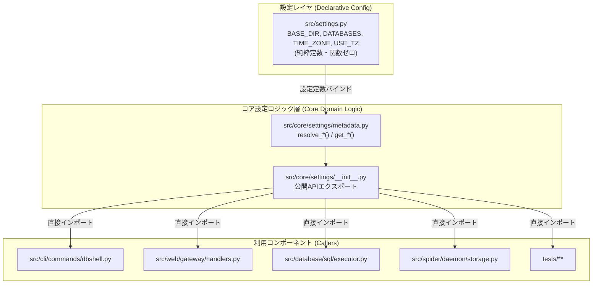

# [REFACTOR] settings.py のスコープ・メタデータ関数の core/settings/ への集約と settings.py 宣言的定数化 (ID: 325)

## 1. 概要 / Summary
`src/settings.py` に残存しているデータベーススコープおよびメタデータ解決関数：
- `get_database_scopes()`
- `get_all_configured_databases()`
- `get_database_metadata(scope_name: str)`
- `get_table_scope_from_settings(tname: str)`
- `get_table_type_from_settings(tname: str)`

を `src/core/settings/` パッケージ（`src/core/settings/metadata.py` および `src/core/settings/__init__.py`）配下に完全集約・再構築し、`src/settings.py` から関数実装および関数再エクスポートを全廃して Django 互換の純粋な宣言的設定定数ファイル（`BASE_DIR`, `DATABASES`, `TIME_ZONE`, `USE_TZ`, `DATABASE_TIME_ZONE`, `DISPLAY_TIME_ZONE`, `DB_TIME_ZONE` 等の定数辞書のみ）へとリファクタリングする。

本改修により、Clean Architecture における「設定（Configuration）」と「ドメイン・ユーティリティロジック（Core Logic）」の責務分離（SoC: Separation of Concerns）を確立し、`settings.py` とコアパッケージ間の循環参照（Circular Import）リスクを構造的に排除する。
また、リポジトリ内の全呼び出し元（CLI, Web Gateway, SQL Executor, Spider Daemon, Tests）において `settings` からの関数インポートを `core.settings` 直接インポートへと移行する。

---

## 2. アーキテクチャ設計・多角評価 (Multi-Agent Perspectives)

1. **プロジェクトマネージャー (PM)**:
   - 設定と振る舞い（ロジック）を厳格に分離。Djangoライクな設定ファイル設計（`settings.py` には関数を置かない原則）に準拠し、保守性と可読性を飛躍的に高める。
2. **システムアーキテクト (Systems Architect)**:
   - 単方向の依存関係グラフを確立：
     `Caller (CLI / Web / Spider / SQL)` ──> `core.settings (Logic / Introspection)` ──> `settings (Declarative Data)`
     これにより、将来いかなるサブモジュールが `settings` を参照しても循環インポートが発生しない設計を保証する。
3. **ソフトウェア開発 (SWD)**:
   - `core.settings.metadata` 内の関数は、引数が渡されない場合は `settings.DATABASES` 等の設定値を自動束縛し、引数が明示された場合は渡された辞書を使用する柔軟なシグネチャとする。
4. **情報セキュリティスペシャリスト (Security Specialist)**:
   - 未知のスコープ名に対する安全なフォールバック（CWE-20: 不正な入力の安全なハンドリング）、辞書変更耐性（読み取り専用の安全なメタデータ辞書生成）を徹底する。
5. **ソフトウェア品質保証 (SQA)**:
   - 全関数で循環的複雑度（Cyclomatic Complexity）CC <= 5（Xenon Rank A）を維持。
   - `mypy --strict` 型検査、`flake8`、`black`、`isort`、既存および新規の全単体テストで 100% PASS を達成する。



---

## 3. トレーサビリティ / Traceability
- **ユーザー指示**:
  - 「settings.py の以下を core/settings/ に集約してほしい。」
  - 「(4) src/settings.py での再エクスポート 不要です。直接coreで呼んでください。」
- **関連ドキュメント・過去 Issue**:
  - [Issue 324: Django互換のTIME_ZONE/USE_TZ設定およびDSN構成の追加](closed/324-add-timezone-and-use-tz-settings-and-dsn-support.md)
  - [Issue 323: settings.py に基づく Active Database Scope 一覧の動的生成と spider_execution_db 表示の実装](closed/323-dynamically-populate-database-scopes-from-settings.md)
  - [Issue 234: settings.py による中央集中データベース設定とスコープ管理](closed/234-unify-database-declarations-in-settings-and-reconcile-introspection.md)

---

## 4. 影響範囲と関連ファイル / Scope and Affected Files
- [src/core/settings/__init__.py](../../src/core/settings/__init__.py) (公開関数 `get_*`, `resolve_*` の包括的エクスポート)
- [src/core/settings/metadata.py](../../src/core/settings/metadata.py) (集約関数 `get_database_scopes`, `get_all_configured_databases`, `get_database_metadata`, `get_table_scope_from_settings`, `get_table_type_from_settings` の実装)
- [src/settings.py](../../src/settings.py) (関数実装および再エクスポートを全廃し、純粋な定数・設定辞書のみを定義)
- [src/spider/daemon/storage.py](../../src/spider/daemon/storage.py) (`get_all_configured_databases` のインポート先を `core.settings` に更新)
- [src/web/gateway/handlers.py](../../src/web/gateway/handlers.py) (`get_database_metadata`, `get_all_configured_databases` のインポート先を `core.settings` に更新)
- [src/database/sql/executor.py](../../src/database/sql/executor.py) (`get_table_scope_from_settings` のインポート先を `core.settings` に更新)
- [src/cli/commands/dbshell.py](../../src/cli/commands/dbshell.py) (`get_database_scopes`, `get_table_scope_from_settings`, `get_table_type_from_settings` のインポート先を `core.settings` に更新)
- [tests/cli/test_manage_dbshell.py](../../tests/cli/test_manage_dbshell.py) (`get_database_scopes` のインポート先を `core.settings` に更新)
- [tests/web/test_database_real_introspection.py](../../tests/web/test_database_real_introspection.py) (`get_all_configured_databases` のインポート先を `core.settings` に更新)
- [tests/test_settings_timezone.py](../../tests/test_settings_timezone.py) (`get_all_configured_databases`, `get_database_metadata` のインポート先を `core.settings` に更新、単体検証追加)

---

## 5. 実装方針 / Implementation Plan
Target Branch: `refactor/325-aggregate-settings-functions-to-core-settings`

### Step 1: `src/core/settings/` のインターフェース実装
- `src/core/settings/metadata.py` に `settings` の定数をデフォルトバインドした5関数を実装：
  ```python
  def get_database_scopes(
      databases: Optional[Dict[str, Dict[str, Any]]] = None,
  ) -> Dict[str, str]:
      target_dbs = databases if databases is not None else settings.DATABASES
      return resolve_database_scopes(target_dbs)

  def get_all_configured_databases(
      databases: Optional[Dict[str, Dict[str, Any]]] = None,
  ) -> List[str]:
      target_dbs = databases if databases is not None else settings.DATABASES
      return resolve_all_configured_databases(target_dbs)

  def get_database_metadata(
      scope_name: str,
      databases: Optional[Dict[str, Dict[str, Any]]] = None,
  ) -> Dict[str, Any]:
      target_dbs = databases if databases is not None else settings.DATABASES
      return resolve_database_metadata(
          scope_name=scope_name,
          databases=target_dbs,
          default_tz=settings.DATABASE_TIME_ZONE,
          default_use_tz=settings.USE_TZ,
          default_display_tz=settings.DISPLAY_TIME_ZONE,
      )

  def get_table_scope_from_settings(
      tname: str,
      databases: Optional[Dict[str, Dict[str, Any]]] = None,
  ) -> str:
      target_dbs = databases if databases is not None else settings.DATABASES
      return resolve_table_scope(tname=tname, databases=target_dbs)

  def get_table_type_from_settings(
      tname: str,
      databases: Optional[Dict[str, Dict[str, Any]]] = None,
  ) -> Optional[str]:
      target_dbs = databases if databases is not None else settings.DATABASES
      return resolve_table_type(tname=tname, databases=target_dbs)
  ```
- `src/core/settings/__init__.py` で上記5関数および既存の低レベルリゾルバをエクスポート。

### Step 2: `src/settings.py` の純粋定数化（Zero Functions）
- `src/settings.py` から以下を完全削除：
  - `from core.settings.metadata import ...`
  - `List`, `Optional` のインポート
  - `get_database_scopes()`
  - `get_all_configured_databases()`
  - `get_database_metadata()`
  - `get_table_scope_from_settings()`
  - `get_table_type_from_settings()`
- `__all__` を純粋な設定定数のみに限定：
  ```python
  __all__ = [
      "BASE_DIR",
      "TIME_ZONE",
      "USE_TZ",
      "DATABASE_TIME_ZONE",
      "DISPLAY_TIME_ZONE",
      "DB_TIME_ZONE",
      "DATABASES",
  ]
  ```

### Step 3: 全呼び出し元（Consumers）のインポート更新
- `src/spider/daemon/storage.py`: `from core.settings import get_all_configured_databases`
- `src/web/gateway/handlers.py`: `from core.settings import get_all_configured_databases, get_database_metadata`
- `src/database/sql/executor.py`: `from core.settings import get_table_scope_from_settings`
- `src/cli/commands/dbshell.py`: `from core.settings import get_database_scopes, get_table_scope_from_settings, get_table_type_from_settings`
- テストコード（`tests/cli/test_manage_dbshell.py`, `tests/web/test_database_real_introspection.py`, `tests/test_settings_timezone.py`）のインポートを更新。

### Step 4: 品質ゲート・回帰テスト・検証
- `make check_format` (isort, black, flake8)
- `make static_analysis` (radon, xenon CC <= 5 Rank A, mypy --strict PASS)
- `make test` (pytest)

---

## 6. セキュリティ考慮事項 (Threat Model & Mitigations)
- **CWE-20 (Improper Input Handling)**:
  `get_database_metadata(scope_name)` に未知のスコープ名が渡された場合でも、クラッシュせず安全なデフォルト辞書（`type: Unknown`, `engine: unknown`, `location: ""`）を返却する。
- **CWE-400 (Uncontrolled Resource Consumption)**:
  メタデータ解決は静的辞書引き・純粋メモリ操作のみであり、過剰な計算や再帰ループが発生しない設計とする。
- **Immutability of Settings**:
  設定辞書への予期せぬ破壊的変更（Side Effects）を防ぐため、メタデータ生成時は設定の参照のみを行い、直接の変更（`cfg.pop()` や代入等）は一切行わない。

---

## 7. 完了条件 / Success Criteria (DoD)
- [x] `src/settings.py` 内に関数定義（`def `）および関数再エクスポートが0件であること。
- [x] `src/core/settings` から 5 つの集約関数（`get_database_scopes`, `get_all_configured_databases`, `get_database_metadata`, `get_table_scope_from_settings`, `get_table_type_from_settings`）が正しくエクスポートされ、直接呼び出し可能であること。
- [x] プロダクションコードおよびテストコードの全呼び出し元が `core.settings` からの直接インポートに更新されていること。
- [x] 循環インポート（Circular Dependency）が 0 件であること。
- [x] `make check_format` がエラー 0 件で通過すること。
- [x] `make static_analysis`（mypy `--strict`, flake8, xenon CC <= 5 Rank A）が 100% PASS すること。
- [x] 関連する全テスト（`test_settings_timezone.py`, `test_manage_dbshell.py`, `test_database_real_introspection.py` 等）が PASS すること。
