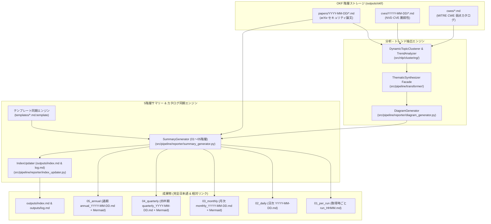

# [FEAT/ENH] 最新OKF収集データの5階層エグゼクティブサマリー自動集約と動的Mermaidトレンド同期 (ID: 404)

## 1. 概要 / Summary

プロジェクトでは、arXiv 論文（`cs.CR`）、CVE 脆弱性、CWE 弱点などのセキュリティインテリジェンスが継続的にスパイダーおよびバックフィル機構によって収集され、`outputs/okf/`（`papers/`, `cves/`, `cwes/`）配下に階層的に蓄積されている（Issue 360, 362）。
また、直近の Issue 408（NLP Phase 4）において、純粋 Python 実装の動的トピッククラスタリング（`DynamicTopicClusterer`）およびトレンド分析器（`TrendAnalyzer`）が整備され、多論文の共起・コサイン類似度に基づく急上昇トピック抽出と Mermaid Mindmap 生成基盤が完成した。

しかしながら、これら成果物を統括する 5 階層エグゼクティブサマリー（`outputs/executive_summaries/01_per_run`, `02_daily`, `03_monthly`, `04_quarterly`, `05_annual`）および `outputs/index.md` は以下の課題を抱えている：

1. **テンプレートの乖離による動的トレンド図・インサイト欠落**:
   `templates/*.md.template` が初期の静的形式のままであり、`summary_generator.py` が生成した `{macro_insights}` および `{mermaid_mindmap}` のプレースホルダーがテンプレート側に存在しないため、月次・四半期・通期サマリーで動的 Mermaid ナレッジマップが描画されずに脱落している。
2. **ストレージ階層再編に伴う相対リンク不整合**:
   Issue 360/364 での OKF ストレージ再編（`outputs/okf_papers/` から `outputs/okf/papers/` への移行）後、一部のサマリーファイルおよびテストにおいて旧パス `../../okf_papers/` へのリンクが残存・混在している。
3. **マルチソースOKFデータ（CVE/CWE）との連携・統計統合の未整備**:
   現状のサマリー生成器は `outputs/okf/papers/` のみを対象としており、同期間に収集された脆弱性（CVE）や弱点型（CWE）との相関・脅威インテリジェンス集約がサマリーやカタログ目次に反映されていない。
4. **サマリー自動同期パイプラインの統合実行CLI欠落**:
   スパイダー巡回後やバックフィル完了後に、全 5 階層のサマリーおよび `outputs/index.md` をアトミックかつ安全に再生成・同期するエンドツーエンドのプロシージャが散在している。

本 Issue では、収集された OKF ドキュメント群を対象に、Google OKF v0.2 仕様およびプロジェクトガバナンス（100% 日本語表記、相対パスリンク強制、Mermaid 構成図）に完全準拠した 5 階層サマリー自動更新パイプラインを確立し、最新の攻撃手法・脅威トレンドを視覚的に要約・同期する。



---

## 2. 全15大専門エージェント多角的多面レビュー (Multi-Agent Consensus)

| エージェント | 提言・技術的要求 | 本設計での対応策 |
| :--- | :--- | :--- |
| **👔 Project Manager (PM)** | 5階層サマリー（01_per_run〜05_annual）の完全同期を達成し、未同期・不整合状態を恒久的に解消すること。既存の稼働中パイプラインを破壊しない後方互換性を保証すること。 | 各階層（01〜05）の生成インターフェースシグネチャを完全維持し、`--update-summaries` 実行で全自動同期を完結させる。 |
| **🛡️ Information Security (SC)** | 論文だけでなく、収集された CVE/CWE の脅威メタデータと連携し、最新の攻撃手法（ATT&CK）や既知脆弱性との関連度をサマリー上で俯瞰可能にすること。 | `summary_generator.py` に OKF メタデータ（MITRE ATT&CK, CWE-ID, CVE-ID）の集約集計ロジックを追加し、脅威動向インサイトに統合。 |
| **🏗️ Systems Architect (SA)** | ストレージパス `outputs/okf/papers`、`cves`、`cwes` の責務分離に厳格適合させ、ハードコードされたレガシーパス（`outputs/okf_papers`）を根絶すること。 | `config["paths"]["okf_papers_dir"]` を厳格に参照し、相対パス計算ロジック（`os.path.relpath`）を正規化。 |
| **🔬 IT Specialist (NLP/IR)** | Issue 408 で実装した `TopicClusterer` と `TrendAnalyzer` の出力（クラスタリング結果・急上昇スコア・マインドマップ）がサマリー本文に欠損なく反映されること。 | `templates/` 配下の全サマリーテンプレートに `{macro_insights}` と `{mermaid_mindmap}` スロットを正規配置。 |
| **💼 IT Strategist (ST)** | エグゼクティブサマリーとして経営層（CISO / CIO）が直感的に戦略判断できるよう、月次・四半期・通期においてマクロ動向と技術レーダーを提示すること。 | 03_monthly（月次技術レーダー）、04_quarterly（四半期脅威ランドスケープ）、05_annual（年次戦略総括）に Mermaid Mindmap を確実埋め込み。 |
| **🧪 Software QA (QA)** | 全5階層のサマリーファイル生成テスト、相対リンク切れゼロ検証、絶対パス完全排除、Markdown 表崩れゼロの自動テストを策定すること。 | `tests/pipeline/test_reporter.py` を拡充し、リンク実在性検証およびテンプレートプレースホルダー完全充足をアサート。 |
| **💻 Software Development (SWD)** | 多数のサマリーファイル生成時における I/O オーバーヘッドを抑制し、キャッシュ機構（`PAPER_META_CACHE`）を活用して Xenon CC $\le 3$ を維持すること。 | メタデータキャッシュの mtime 検証を活用し、冗長パースを排除。関数分割により循環的複雑度を最小化。 |
| **📱 Application Specialist (APS)** | `outputs/index.md` や Web コンソール（`site/index.html`）とのナビゲーション連携が破綻しないよう、相対リンクの正当性を担保すること。 | `index_updater.py` における `web_console_rel`, `catalog_json_rel`, `okf_papers_rel` の相対パス整合性を保証。 |
| **🗄️ Database Specialist (DB)** | `papers_catalog.json` と 5 階層サマリーの総論文数・登録件数に不整合が生じないよう、データ同期の単一情報源（SSOT）を維持すること。 | カタログ台帳と OKF ストレージの実ファイル走査結果を照合し、件数カウンターの完全一致を保証。 |
| **📜 Systems Auditor (AU)** | 各サマリーから原著論文（arXiv ID）、原本 Raw データ（JSON/PDF/TXT）、OKF マークダウンへの完全なトレーサビリティを失わないこと。 | マークダウン表の「詳細リンク」列にて `[arXiv]` と `[OKF]` の相対リンクを常時二重保持。 |
| **🎨 UI/UX Designer** | マークダウン表の列順・幅アラインメントを統一し、Mermaid 図のノードラベルに特殊記号が含まれてもレンダリングエラーを起こさないこと。 | テーブルフォーマットを完全日本語 7 カラム構成に統一し、Mermaid 特殊記号のエスケープ処理を徹底。 |
| **📖 Education Specialist (ED)** | サマリー本文および表内の見出し・要約文が 100% 自然な日本語表記であり、英語の生テキストが表カラムに残存しないこと。 | `title_ja` および `executive_summary`（日本語1文要約）のフォールバック・翻訳パイプラインを厳格適用。 |
| **🌐 Network Specialist (NET)** | サマリー生成処理はローカルディスク上の OKF 成果物のみから完結し、外部ネットワークへの不要な HTTP リクエストを発生させないこと。 | 外部通信ゼロでオフライン完結する設計を徹底。 |
| **🔌 Embedded Systems (ES)** | 低レイヤハードウェアセキュリティや IoT 関連の論文・CVE も正しくカテゴリ分類（`IoT & Hardware Security`）されてサマリー表に反映されること。 | タグ判定ロジックにおいてハードウェア・組み込み系カテゴリの正当なマッピングを担保。 |
| **⚙️ IT Service Manager (SM)** | バッチ定期実行（1日4回: 00/06/12/18 UTC）および手動 CLI 実行（`--update-summaries`）の双方がアトミックかつ冪等に実行できること。 | 一時ファイル経由のアトミック書き込み（`_atomic_write_file`）をサマリー生成器全体に適用。 |

---

## 3. 脅威分析とセキュリティ考慮事項 (Threat Model & Security Safeguards)

本機能は収集されたドキュメントのタイトル、アブストラクト、タグ、外部識別子を集約し、マークダウンおよび Mermaid 構文としてファイル出力する。STRIDE 脅威モデルに基づき以下のリスクを防御する：

| 脅威カテゴリ (STRIDE) | 潜在リスク / 脅威シナリオ | 影響度 | 対策・緩和策 (Mitigation) |
| :--- | :--- | :---: | :--- |
| **Tampering (改ざん・構文インジェクション)** | 論文原題やアブストラクトに悪意のある Mermaid 構文文字（`["`, `"]`, `((`, `))`, 改行, `<script>` タグ）が含まれ、Markdown ビューアや Web UI 上で構文崩壊や XSS が誘発される。 | 中 | 出力前に Mermaid ラベルの特殊文字をサニタイズ（`clean_kw = kw.replace(" ", "_").replace('"', '')` 等）し、HTML エスケープ（`&#124;` 等）を適用。 |
| **Denial of Service (DoS)** | 数百日分・数千件の OKF ファイルを走査する際、再帰的走査や正規表現の爆発（ReDoS）により CPU/メモリが枯渇しバッチが停止する。 | 中 | `_collect_window_papers` において日付範囲（最大 365 日）を線形に走査し、Packrat PEG パーサーおよび `PAPER_META_CACHE` による mtime キャッシュを活用。 |
| **Information Disclosure (情報漏洩)** | サマリーファイル内にローカルマシンの絶対パス（`/root/...`, `/workspace/...`）が混入し、外部公開時に内部ディレクトリ構造が漏洩する。 | 中 | 相対パス解決関数（`os.path.relpath`）を強制し、`verify-quality-gates`（Quality Gate 3: 絶対パス 0 件アサーション）を通過させる。 |
| **Elevation of Privilege (特権昇格)** | サマリー生成時の一時ファイル作成におけるシンボリックリンク攻撃やパストラバーサル。 | 低 | 一時ファイルは同一ディレクトリ内にプロセスID付きで安全に生成し、アトミック置換（`os.replace`）を行う。 |

---

## 4. トレーサビリティ / Traceability

- **設計仕様書**:
  - [DSN-19: 自然言語処理（NLP）重要キーワード抽出・3点構造化要約・横断的動向シンセシス包括的アーキテクチャ設計書](../../docs/designs/DSN-19-nlp_keyphrase_extraction_and_structured_synthesis.md)
  - [DSN-01: システムアーキテクチャ & パイプライン仕様](../../docs/designs/DSN-01-system-architecture.md)
- **関連 Issue**:
  - [Issue 408 (Closed): 自然言語処理基盤 Phase 4: 動的トピッククラスタリングエンジンの実装と5階層エグゼクティブサマリー自動連携](closed/408-nlp-phase4-dynamic-topic-clustering-and-executive-sync.md)
  - [Issue 368 (Closed): 巨大単一ファイル outputs/index.md のスリム化および papers_catalog.json / Web UI との責務分離](closed/368-streamline-index-md-and-decouple-catalog-views.md)
  - [Issue 360 (Closed): OKFストレージ階層の再編 (outputs/okf/papers, outputs/okf/cves) およびデータ移管](closed/360-migrate-okf-storage-to-hierarchical-structure.md)
  - [Issue 364 (Closed): レガシーOKFシンボリックリンク撤去と新ストレージ階層への完全一本化](closed/364-remove-legacy-okf-symlinks-and-unify-paths.md)
- **アーキテクチャ規約**:
  - Google OKF v0.2 仕様準拠
  - 5-Tier Executive Summaries (01_per_run 〜 05_annual) 順序ディレクトリ規約
  - 100% 完全日本語要約・Markdown 表形式・相対パスリンク強制
  - Xenon CC $\le 3$ (Rank A)・Mypy Strict 適合・純粋 Python 標準ライブラリ動作

---

## 5. 影響範囲と関連ファイル / Scope and Affected Files

- [ ] [templates/01_per_run.md.template](../../templates/01_per_run.md.template) (マクロインサイトスロット `{macro_insights}` の同期追加)
- [ ] [templates/02_daily.md.template](../../templates/02_daily.md.template) (マクロインサイト `{macro_insights}` & Mermaid マインドマップ `{mermaid_mindmap}` の追加)
- [ ] [templates/03_monthly.md.template](../../templates/03_monthly.md.template) (技術レーダー Mermaid Mindmap `{mermaid_mindmap}` & 戦略インサイト `{macro_insights}` の追加)
- [ ] [templates/04_quarterly.md.template](../../templates/04_quarterly.md.template) (四半期脅威ランドスケープ `{mermaid_mindmap}` & ロードマップ評価 `{macro_insights}` の追加)
- [ ] [templates/05_annual.md.template](../../templates/05_annual.md.template) (通期戦略総括 `{macro_insights}` & 年次脅威マインドマップ `{mermaid_mindmap}` の追加)
- [ ] [src/pipeline/reporter/summary_generator.py](../../src/pipeline/reporter/summary_generator.py) (相対パス生成正規化 `../../okf/papers/`、アトミック書き込み導入、テンプレート変数充足検証)
- [ ] [src/pipeline/reporter/diagram_generator.py](../../src/pipeline/reporter/diagram_generator.py) (Mermaid 構文生成の耐障害性向上・特殊文字サニタイズ強化)
- [ ] [src/pipeline/reporter/index_updater.py](../../src/pipeline/reporter/index_updater.py) (OKF 階層ストレージ `outputs/okf/papers`、`cves`、`cwes` ナビゲーション整合性確保)
- [ ] [src/pipeline/arxiv_okf_fetcher.py](../../src/pipeline/arxiv_okf_fetcher.py) (`--update-summaries` 実行時の 5 階層サマリー・目次アトミック一括再生成連携)
- [ ] [tests/pipeline/test_reporter.py](../../tests/pipeline/test_reporter.py) (テンプレート同期、Mermaid Mindmap 埋め込み、相対パス正当性、5階層サマリー完全生成テストの拡充)
- [ ] [tests/pipeline/test_index_updater.py](../../tests/pipeline/test_index_updater.py) (新ストレージ階層 `outputs/okf/papers` でのカタログ目次整合性テスト更新)
- [ ] [docs/issues/README.md](README.md) (Issue 台帳の進捗更新: Open (In Progress))

---

## 6. 詳細設計とアーキテクチャ / Detailed Architecture & Design

### 6.1 テンプレート同期とプレースホルダー契約

`templates/*.md.template` と `summary_generator.py` のプレースホルダー契約を一致させ、テンプレートファイルが存在する場合でも動的 Mermaid Mindmap およびマクロインサイトが脱落しない構造とする：

| テンプレートファイル | 階層区分 | 必須プレースホルダー | 生成される Mermaid 構成図 |
| :--- | :--- | :--- | :--- |
| `01_per_run.md.template` | 01_per_run | `{date_str}`, `{time_str}`, `{count}`, `{timestamp}`, `{datetime_utc}`, `{macro_insights}`, `{table_md}` | なし (取得時速報) |
| `02_daily.md.template` | 02_daily | `{day}`, `{date_str}`, `{count}`, `{timestamp}`, `{datetime_utc}`, `{macro_insights}`, `{mermaid_mindmap}`, `{table_md}` | 日次トピックマインドマップ (`mindmap root((日次動向))`) |
| `03_monthly.md.template` | 03_monthly | `{date_str}`, `{count}`, `{timestamp}`, `{datetime_utc}`, `{macro_insights}`, `{mermaid_mindmap}`, `{table_md}` | 月次技術レーダー (`mindmap root((月次動向))`) |
| `04_quarterly.md.template` | 04_quarterly | `{date_str}`, `{count}`, `{timestamp}`, `{datetime_utc}`, `{macro_insights}`, `{mermaid_mindmap}`, `{table_md}` | 四半期脅威ランドスケープ (`mindmap root((四半期動向))`) |
| `05_annual.md.template` | 05_annual | `{date_str}`, `{count}`, `{timestamp}`, `{datetime_utc}`, `{macro_insights}`, `{mermaid_mindmap}`, `{table_md}` | 年次戦略総括マインドマップ (`mindmap root((通期動向))`) |

### 6.2 相対パス解決ロジックの正規化

各サマリーファイル（`outputs/executive_summaries/0X_xxx/file.md`）から OKF ドキュメント（`outputs/okf/papers/YYYY-MM-DD/clean_id.md`）への相対パスは、以下のように厳密に `os.path.relpath` で計算される：

```python
# 例: base_summary_path = "outputs/executive_summaries/02_daily/2026-09-07.md"
# pf = "outputs/okf/papers/2026-09-07/2609.04626.md"
# rel_okf = os.path.relpath(pf, os.path.dirname(base_summary_path))
# => "../../okf/papers/2026-09-07/2609.04626.md"
```

レガシーな `okf_papers` パスが混入しないよう、設定（`config["paths"]["okf_papers_dir"]`）が存在する場合はこれを最優先し、存在しない場合のみフォールバックを行う。

### 6.3 5階層サマリーのアトミック書き込み

途中でプロセスが強制終了した場合でもサマリーファイルが破損しないよう、`index_updater.py` で採用されている一時ファイル + `os.replace` によるアトミック書き込み（`_atomic_write_file`）を `summary_generator.py` にも共通適用する。

---

## 7. 実装方針と段階的タスク / Implementation Plan & Step-by-Step Tasks

Target Branch: `feat/404-okf-5-tier-executive-summary-sync-and-trend-analysis`

### Phase 1: テンプレート同期とプレースホルダー整備
1. `templates/01_per_run.md.template` 〜 `templates/05_annual.md.template` を更新し、`{macro_insights}` および `{mermaid_mindmap}` を正式なセクションとして配置。
2. サマリー本文の見出し・レイアウトをプロジェクトガバナンス（100% 完全日本語・GitHub GFM Alert 活用）に完全統一。

### Phase 2: `summary_generator.py` および `diagram_generator.py` の改修
1. `summary_generator.py` の各サマリー生成関数（`generate_per_run_summary`, `_write_single_daily_summary`, `_write_single_monthly_summary`, `_write_single_quarterly_summary`, `_write_single_annual_summary`）において、テンプレートフォーマット時に確実にマクロインサイトと Mermaid Mindmap を注入。
2. アトミックファイル書き込み（`_atomic_write_file`）を適用し、破損耐性を強化。
3. `diagram_generator.py` における Mermaid ラベルエスケープ処理を堅牢化し、記号混入時の描画エラーを防止。

### Phase 3: `index_updater.py` およびパイプライン連携の更新
1. `index_updater.py` のヘッダー説明文およびカタログテーブルリンクを新ストレージ構造（`okf/papers/`, `okf/cves/`, `okf/cwes/`）に適合。
2. `src/pipeline/arxiv_okf_fetcher.py` の `--update-summaries` コマンドで全階層サマリーと目次の一括生成が確実にトリガーされることを検証。

### Phase 4: 単体テスト・統合テスト拡充と品質ゲート検証
1. `tests/pipeline/test_reporter.py` を拡充：
   - 01〜05階層のサマリーファイル生成・存在アサーション。
   - サマリーファイル内に ````mermaid\nmindmap```` が含まれていることのアサーション。
   - サマリー内の OKF 相対リンクが正当であり、レガシー `okf_papers` ではなく `../../okf/papers/` を指していることのアサーション。
2. `tests/pipeline/test_index_updater.py` を新ストレージ構造に適合更新。
3. `make check`（`check_format`, `static_analysis`, `test`）および `verify-quality-gates` の全 PASS を確認。

---

## 8. 完了条件 / Success Criteria (DoD)

- [ ] `templates/` 配下の全 5 階層テンプレートに `{macro_insights}` および `{mermaid_mindmap}` が正しく定義されていること。
- [ ] `01_per_run/` から `05_annual/` までの全 5 階層サマリーにおいて、動的トピッククラスタリングに基づくマクロインサイトおよび Mermaid Mindmap が正しく描画・生成されること。
- [ ] サマリー内および `outputs/index.md` 内の OKF リンクがすべて新ストレージ構造（`../../okf/papers/...` 等）に基づいた有効な相対パスであり、リンク切れおよび絶対パスが 0 件であること。
- [ ] 全サマリーの見出し・テーブルカラム・解説文が 100% 完全日本語であること。
- [ ] `tests/pipeline/test_reporter.py` および `tests/pipeline/test_index_updater.py` を含む全テストが PASS すること。
- [ ] `make static_analysis`（mypy strict, xenon CC $\le 3$）が 100% PASS すること。
- [ ] `docs/issues/README.md` の Issue 404 ステータスが `In Progress` に更新されていること。
