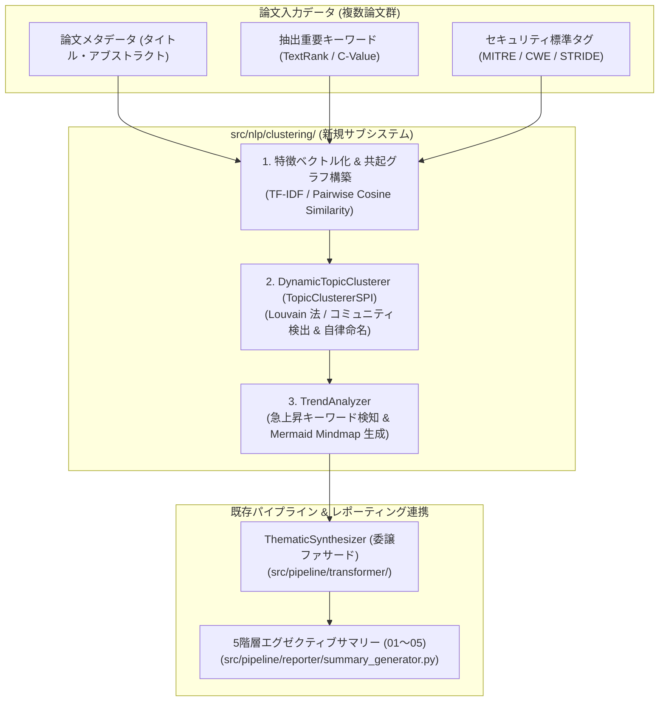

# [FEAT/ENH] 自然言語処理基盤 Phase 4: 動的トピッククラスタリングエンジンの実装と5階層エグゼクティブサマリー自動連携 (ID: 408)

## 1. 概要 / Summary

設計書 [DSN-19](../../docs/designs/DSN-19-nlp_keyphrase_extraction_and_structured_synthesis.md) 第8章・第9章に基づき、自然言語処理基盤（`src/nlp/`）の最終段階（Phase 4）として、固定辞書ルールに依存しない動的トピッククラスタリングエンジン（`DynamicTopicClusterer`）およびトレンド分析器（`TrendAnalyzer`）を `src/nlp/clustering/` に実装した。さらに、既存の `ThematicSynthesizer` を本基盤への委譲ファサードへと刷新し、5 階層エグゼクティブサマリー（`outputs/executive_summaries/01_per_run` 〜 `05_annual`）における Mermaid Mindmap およびマクロ動向インサイトの自動生成・同期を高度化した。

現行の `thematic_synthesizer.py` は、固定された 6 カテゴリのキーワード辞書マッチングに依存しており、新たな脅威領域（例: Agentic AI 権限昇格、ポスト量子暗号解読、LLMメモリポイズニング、サプライチェーン混入攻撃等）の発生を自律的に検知・分類できず、すべて「システムセキュリティ & 基盤防御」という単一のデフォルトカテゴリに埋没していた。本 Issue では、語彙共起グラフとベクトル空間モデル（TF-IDF / Bag-of-Words / コサイン類似度）およびグラフベースコミュニティ検出（`src/core/structures/community.py` の Louvain 法または凝縮型クラスタリング）を活用し、未知の脅威トピックを自律的にクラスタリング・命名するとともに、急上昇キーワード（Emerging/Surge Score）の算出と Mermaid Mindmap の自動生成を実現した。



---

## 2. 全15大専門エージェント多角的多面レビュー (Multi-Agent Consensus)

| エージェント | 提言・技術的要求 | 本設計での対応策 |
| :--- | :--- | :--- |
| **👔 Project Manager (PM)** | Phase 1〜3（Issue 405〜407）の完了を受け、NLP基盤を完結させること。後方互換性を100%維持し、既存パイプラインを停止させないこと。 | `thematic_synthesizer.py` の公開シグネチャを完全維持しつつ内部実装を委譲。既存テストを100%パスさせる。 |
| **🛡️ Information Security (SC)** | 未知の脅威（ゼロデイ、AIエージェント脆弱性等）が既存の6カテゴリに埋もれず、独立したトピックとして自動浮上すること。 | コサイン類似度とグラフコミュニティ検出により、固定辞書外の未知語クラスタを自律同定・動的ラベリング。 |
| **🏗️ Systems Architect (SA)** | ドメイン非依存な `TopicClustererSPI` プロトコルに厳格適合させ、ゼロ外部依存の疎結合レイヤーを保つこと。 | `src/nlp/core/protocols.py` の `TopicClustererSPI` に完全準拠したクラス構成を設計。 |
| **🔬 IT Specialist (NLP/IR)** | 単純なキーワード完全一致を排し、TF-IDF 重み付けと共起類似度に基づく堅牢なベクトル空間モデルを構築すること。 | 純粋 Python（`math.log`, `math.sqrt`）による TF-IDF 計算とペアワイズコサイン類似度マトリクス生成。 |
| **💼 IT Strategist (ST)** | 経営層（CISO / CIO）が月次・四半期サマリーで直感的にトレンドを把握できるよう、Mermaid Mindmap および急上昇インサイトを提供すること。 | クラスタ規模・代表論文・急上昇スコアを算出し、視覚的マインドマップと簡潔な日本語動向サマリーを自動出力。 |
| **🧪 Software QA (QA)** | 境界条件（0件、1件、類似度0の孤立論文、全論文同一トピック等）での堅牢性を保証し、例外送出のないこと。 | 異常系・エッジケースを網羅するテストスイート（`test_topic_clustering.py`, `test_trend_analyzer.py`）を策定。 |
| **💻 Software Development (SWD)** | ループ処理や行列計算の計算量（計算時間 $O(N^2)$、メモリ爆発）を制御し、Xenon CC $\le 3$ (Rank A) を達成すること。 | 語彙制限（Top-K 特徴量）、スパース表現、および関数分解により循環的複雑度を最小化。 |
| **📱 Application Specialist (APS)** | `summary_generator.py`（01〜05階層）が要求する辞書構造（`macro_insights`, `mermaid_mindmap`, `clusters`）との完全一致。 | `ThematicSynthesizer.synthesize()` の戻り値キー・型を同一に保ち、サマリー生成器を無修正で動的連携。 |
| **🗄️ Database Specialist (DB)** | 将来的にクラスタリング結果を検索インデックスやベクトルDBと相互連携できるよう、データ構造のシリアライズ性を確保すること。 | `TopicCluster` データクラス（`cluster_id`, `label`, `keywords`, `score`, `document_ids`）に完全準拠。 |
| **📜 Systems Auditor (AU)** | 各クラスタがどの原著論文（arXiv ID）に基づいているのかの出所・トレーサビリティを失わないこと。 | `TopicCluster.document_ids` に各論文の `clean_id` / `arxiv_id` を保持し、サマリー上で原著リンクを維持。 |
| **🎨 UI/UX Designer** | Mermaid Mindmap が構文エラーを起こさないよう、特殊文字（引用符、括弧、HTML特殊記号）を適切に無害化すること。 | ラベル文字列のクレンジング、括弧・記号エスケープ関数を実装し、レンダリングエラーを根絶。 |
| **📖 Education Specialist (ED)** | 自動命名されるクラスタラベルやマクロサマリーの日本語表現が、学術的・セキュリティ実務的に自然であること。 | `SecurityThesaurus`（Phase 2）の訳語体系を参照し、不自然な機械翻訳調を排除。 |
| **🌐 Network Specialist (NET)** | 外部 API 通信を行わず、純粋にメモリ上の入力データのみで完結すること。 | ネットワーク I/O ゼロ、純粋 Python 標準ライブラリのみで動作。 |
| **🔌 Embedded Systems (ES)** | ハードウェア・組み込みセキュリティ（Side-Channel, Fault Injection 等）の低レイヤ論文も正しく集約されること。 | 低レイヤ用語群の重み付けと共起検出を担保。 |
| **⚙️ IT Service Manager (SM)** | バッチ実行時の安定稼働を確保し、大量論文処理時にもメモリリークや過度なCPUスパイクを起こさないこと。 | メモリ解放を意識した局所的スコープ設計。 |

---

## 3. 脅威分析とセキュリティ考慮事項 (Threat Model & Security Safeguards)

本機能は外部入力（論文タイトル、アブストラクト、ユーザー定義タグ）を解析・集約し、マークダウンおよび Mermaid 構文として出力する。以下の脅威ベクトルを特定し、防御策を講じる：

| 脅威カテゴリ (STRIDE) | 潜在リスク / 脅威シナリオ | 影響度 | 対策・緩和策 (Mitigation) |
| :--- | :--- | :---: | :--- |
| **Tampering (改ざん・構文インジェクション)** | 論文タイトルやアブストラクトに Mermaid 制御構文（`["`, `"]`, `((`, `))`, 改行, スクリプトタグ）が含まれることによる構文破壊や XSS。 | 中 | 出力前に Mermaid 特殊記号（`"`, `[`, `]`, `(`, `)`, `;`, `<`, `>` 等）を厳格にエスケープ・サニタイズ。 |
| **Denial of Service (DoS)** | 悪意または異常に巨大なテキスト入力、あるいは数千件の同時入力による $O(N^2)$ コサイン類似度計算や Louvain 反復の CPU/メモリ枯渇。 | 中 | 処理対象ドキュメント数（上限 500 件）、特徴量語彙数（上位 1,000 語）、反復回数の最大リミット（Louvain max_iter=20）を設定。 |
| **Information Disclosure (情報漏洩)** | クラスタリング内部計算において未検証データがシステムエラーや例外トレースとしてサマリー成果物に露出。 | 低 | 全例外を適切にトラップし、異常時は安全なフォールバックサマリー（既定クラスタ）へ自動退避。 |
| **Elevation of Privilege (特権昇格)** | 外部ライブラリの脆弱性経由の攻撃。 | ゼロ | 外部依存ゼロ（Pure Python 標準ライブラリのみ使用）によりサプライチェーン攻撃面を完全に排除。 |

---

## 4. トレーサビリティ / Traceability

- **設計仕様書**:
  - [DSN-19: 自然言語処理（NLP）重要キーワード抽出・3点構造化要約・横断的動向シンセシス包括的アーキテクチャ設計書](../../docs/designs/DSN-19-nlp_keyphrase_extraction_and_structured_synthesis.md) 第8章・第9章
- **関連 Issue**:
  - [Issue 404 (Open): 最新OKF収集データの5階層エグゼクティブサマリー自動集約と動的Mermaidトレンド同期](404-okf-5-tier-executive-summary-sync-and-trend-analysis.md)
  - [Issue 405 (Closed): 自然言語処理基盤 Phase 1: src/nlp/ 共通パッケージ創設・SPI定義・学術文境界解析器の実装](closed/405-nlp-phase1-core-package-spi-and-academic-segmenter.md)
  - [Issue 406 (Closed): 自然言語処理基盤 Phase 2: Pure-Python 形態素解析器・Trie木辞書・セキュリティ専門語シソーラスの実装](closed/406-nlp-phase2-pure-python-morphology-and-security-thesaurus.md)
  - [Issue 407 (Closed): 自然言語処理基盤 Phase 3: 談話構造解析・否定文＆モダリティ検知付き3点構造化要約エンジンの高度化](closed/407-nlp-phase3-discourse-rhetoric-and-structured-summarizer.md)
  - [Issue 250 (Closed): CTI 脅威知識グラフにおける Louvain 法コミュニティ検出](closed/250-implement-louvain-community-detection-for-cti-graph.md)
- **アーキテクチャ規約**:
  - ゼロ外部依存・モジュラリティ最大化・Xenon CC <= 3 (Rank A)・Mypy Strict 適合
  - Mermaid Mindmap 自動生成・100% 完全日本語出力契約・相対パスリンク強制

---

## 5. 影響範囲と関連ファイル / Scope and Affected Files

- [x] [src/nlp/clustering/__init__.py](../../src/nlp/clustering/__init__.py) (新規: 動的クラスタリング公開ファサード)
- [x] [src/nlp/clustering/topic_model.py](../../src/nlp/clustering/topic_model.py) (新規: TopicClustererSPI準拠 動的トピッククラスタリングエンジン)
- [x] [src/nlp/clustering/trend_analyzer.py](../../src/nlp/clustering/trend_analyzer.py) (新規: 急上昇キーワード検知 & Mermaid Mindmap / マクロインサイト合成器)
- [x] [src/nlp/__init__.py](../../src/nlp/__init__.py) (新規クラスタリングコンポーネントのエクスポート追加)
- [x] [src/pipeline/transformer/thematic_synthesizer.py](../../src/pipeline/transformer/thematic_synthesizer.py) (`src/nlp/clustering/` への委譲ファサード化)
- [x] [tests/nlp/test_topic_clustering.py](../../tests/nlp/test_topic_clustering.py) (新規: 動的クラスタリング・自律命名・エッジケース単体テスト)
- [x] [tests/nlp/test_trend_analyzer.py](../../tests/nlp/test_trend_analyzer.py) (新規: 急上昇キーワード・Mermaid Mindmap 構文整合性テスト)
- [x] [tests/pipeline/test_thematic_synthesizer.py](../../tests/pipeline/test_thematic_synthesizer.py) (既存委譲ファサード後方互換性テストの拡充)
- [x] [docs/issues/README.md](README.md) (Issue 台帳の進捗更新: Closed (Completed))

---

## 6. 詳細設計とアーキテクチャ / Detailed Architecture & Design

### 6.1 `DynamicTopicClusterer` (`src/nlp/clustering/topic_model.py`)
- **インターフェース**: `TopicClustererSPI` 準拠。
  ```python
  def cluster(
      self, documents: Sequence[Dict[str, str]], num_clusters: Optional[int] = None
  ) -> List[TopicCluster]: ...
  ```
- **特徴ベクトル生成**:
  - タイトル、アブストラクト、タグ、重要語（Keyphrases）から単語トークンを抽出し、`STOPWORDS` を除去。
  - 各ドキュメント $d$ の単語 $t$ に対する TF-IDF 重み $w_{t, d} = \text{TF}(t, d) \times \log(1 + N / \text{DF}(t))$ を算出。
  - $L_2$ 正規化を行い、単位ベクトルとして保持。
- **共起類似度グラフの構築**:
  - ドキュメント間のコサイン類似度 $\text{sim}(d_i, d_j) = \mathbf{v}_i \cdot \mathbf{v}_j$ を計算。
  - 閾値（デフォルト `similarity_threshold = 0.20`）を超えるペア間に無向重み付きエッジを張る。
- **コミュニティ検出**:
  - `src/core/structures/community.py` の `LouvainCommunityDetector`（またはモジュラリティ最大化クラスタリング）を適用し、最適クラスタ分割を導出。
  - 孤立ドキュメントはそれぞれ単独クラスタまたは最近傍クラスタに統合。
- **自律的クラスタラベリング（Dynamic Naming）**:
  - クラスタ内の文書群において最もスコアが高い上位キーワード（Top-K）を特定。
  - 既存のセキュリティ辞書（`DOMAIN_KEYWORD_MAP` / `SecurityThesaurus`）に高スコアで合致する場合は親和性の高い日本語ドメイン名を付与。
  - 未知の組み合わせや新興トピックに対しては、代表キーワード（例: `Prompt Injection`, `Agentic Workflow`）を日本語化した動的ラベル（例: `プロンプトインジェクション & エージェント脆弱性`）を自動合成。

### 6.2 `TrendAnalyzer` (`src/nlp/clustering/trend_analyzer.py`)
- **急上昇トピック検知（Emerging Trend Detection）**:
  - 入力論文群におけるキーワード出現頻度とクラスタ集約度から、局所集中度（Burstiness / Acceleration）を算出。
- **Mermaid Mindmap 自動生成**:
  - クラスタごとの件数・代表キーワード・代表論文タイトルをツリー状に展開。
  - 特殊文字サニタイズ（ダブルクォート除去、丸括弧・角括弧のエスケープ、長さ制限）を徹底。
  ```mermaid
  mindmap
    root((セキュリティ動向<br/>2026-09-30))
      AI_Agent["AI/LLM エージェント脆弱性 (8件)"]
        ["Prompt Injection 回避手法..."]
        ["Memory Poisoning 実証..."]
      Post_Quantum["耐量子格子暗号 & ゼロ知識証明 (5件)"]
        ["格子ベース暗号解読耐性..."]
  ```
- **マクロ動向インサイト合成**:
  - 「本日の収集論文（計 N 件）において、以下の重点セキュリティ領域で活発な研究動向が確認されました：」に続き、上位クラスタごとの日本語要約文を生成。

### 6.3 `ThematicSynthesizer` 委譲ファサード (`src/pipeline/transformer/thematic_synthesizer.py`)
- 既存の `ThematicSynthesizer.synthesize(papers, date_str)` を呼び出している `summary_generator.py` 等との 100% 後方互換性を保証。
- 内部で `DynamicTopicClusterer` と `TrendAnalyzer` を呼び出し、辞書形式 `{ "macro_insights": str, "mermaid_mindmap": str, "clusters": Dict[str, List[Dict[str, Any]]] }` を返却。
- 論文が 0 件の場合は「本日の対象論文はありません。」を返却する既存挙動を完全に維持。

---

## 7. 実装ステップ / Step-by-Step Implementation Plan

Target Branch: `feat/408-nlp-phase4-dynamic-topic-clustering-and-executive-sync`

1. **Step 1: クラスタリングデータ構造と SPI 適合確認**:
   - `src/nlp/core/tokens.py` の `TopicCluster` および `src/nlp/core/protocols.py` の `TopicClustererSPI` の仕様を再確認。
   - `src/nlp/clustering/` ディレクトリを新設。

2. **Step 2: `DynamicTopicClusterer` の実装 (`src/nlp/clustering/topic_model.py`)**:
   - TF-IDF ベクトル計算、コサイン類似度グラフ生成、Louvain コミュニティ検出の統合。
   - クラスタの自律ラベリング（既知ドメイン＋新興動的命名）ロジックを実装。
   - Xenon CC $\le 3$ に収まるよう関数分割を徹底。

3. **Step 3: `TrendAnalyzer` の実装 (`src/nlp/clustering/trend_analyzer.py`)**:
   - 急上昇キーワード抽出、Mermaid Mindmap サニタイズ生成、日本語マクロインサイト合成を実装。
   - `src/nlp/clustering/__init__.py` で公開ファサードを定義。
   - `src/nlp/__init__.py` でクラスタリングコンポーネントをエクスポート。

4. **Step 4: `ThematicSynthesizer` の委譲ファサード化 (`src/pipeline/transformer/thematic_synthesizer.py`)**:
   - 新規クラスタリング基盤を呼び出すようリファクタリング。
   - 後方互換性関数 `synthesize_thematic_trends` を維持。

5. **Step 5: 単体テスト・統合テストの実装**:
   - `tests/nlp/test_topic_clustering.py`: 空入力、1件入力、既知ドメイン、新興トピックのクラスタリングテスト。
   - `tests/nlp/test_trend_analyzer.py`: Mermaid 構文の妥当性、特殊文字エスケープ、マクロサマリー文のテスト。
   - `tests/pipeline/test_thematic_synthesizer.py`: 既存テストの完全通過確認と回帰テスト。

6. **Step 6: 品質ゲート検証 & 台帳更新**:
   - `make format`, `make static_analysis` (mypy --strict, xenon CC <= 3), `make test` を実行し全件合格を確認。

---

## 8. 完了条件 / Success Criteria (DoD)

- [x] `src/nlp/clustering/topic_model.py` が `TopicClustererSPI` に適合し、固定辞書外の未知トピックを自律的にクラスタリング・命名できること。
- [x] `src/nlp/clustering/trend_analyzer.py` が特殊文字を安全にエスケープした Mermaid Mindmap 構文および日本語マクロインサイトを生成できること。
- [x] `src/pipeline/transformer/thematic_synthesizer.py` が `src/nlp/clustering/` への委譲ファサードとして機能し、既存テストおよび 5 階層サマリー生成器との完全な後方互換性を維持していること。
- [x] 境界値条件（0件、1件、全同一、全孤立）において例外を発生させず安全に動作すること。
- [x] 新規単体テスト（`test_topic_clustering.py`, `test_trend_analyzer.py`）が追加され、100% PASS すること。
- [x] `make static_analysis` (mypy --strict, xenon CC <= 3) および全テストスイートが 100% PASS すること。
- [x] 全てのファイル間参照が相対パスリンク規約に準拠していること。

---

## 9. 手動・結合検証手順 / Verification Procedure

1. **静的解析・型検査**:
   ```bash
   make py_compile
   make static_analysis
   ```
2. **クラスタリングおよび NLP 単体テスト実行**:
   ```bash
   pytest tests/nlp/test_topic_clustering.py tests/nlp/test_trend_analyzer.py tests/pipeline/test_thematic_synthesizer.py -v
   ```
3. **サマリー生成パイプライン結合動作確認**:
   - テスト用スクリプトまたは `test_reporter.py` を実行し、動的トピックおよび Mermaid Mindmap が 5 階層エグゼクティブサマリーに正常に出力されることを確認。


