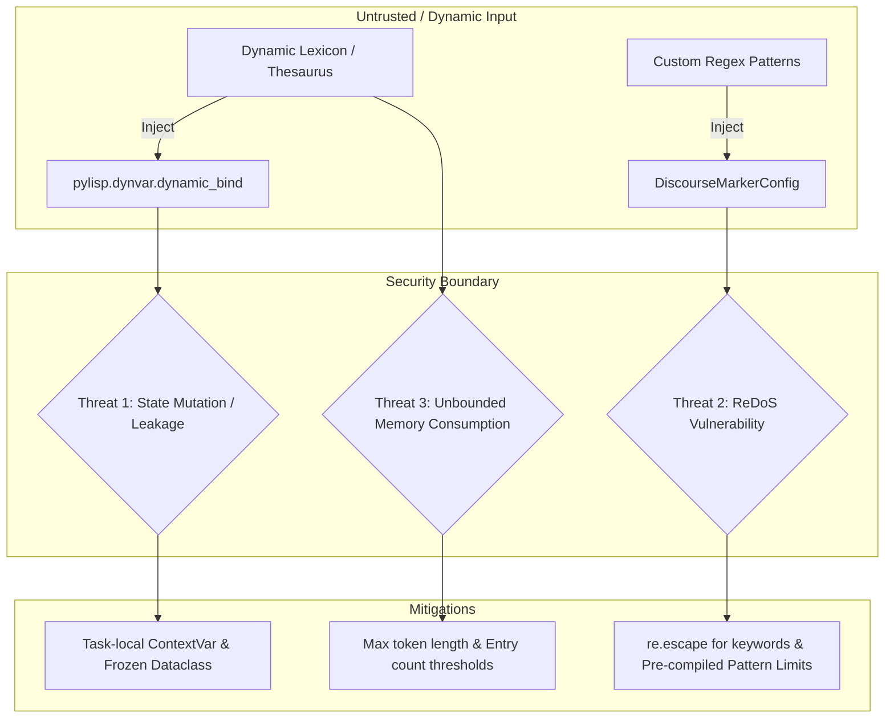
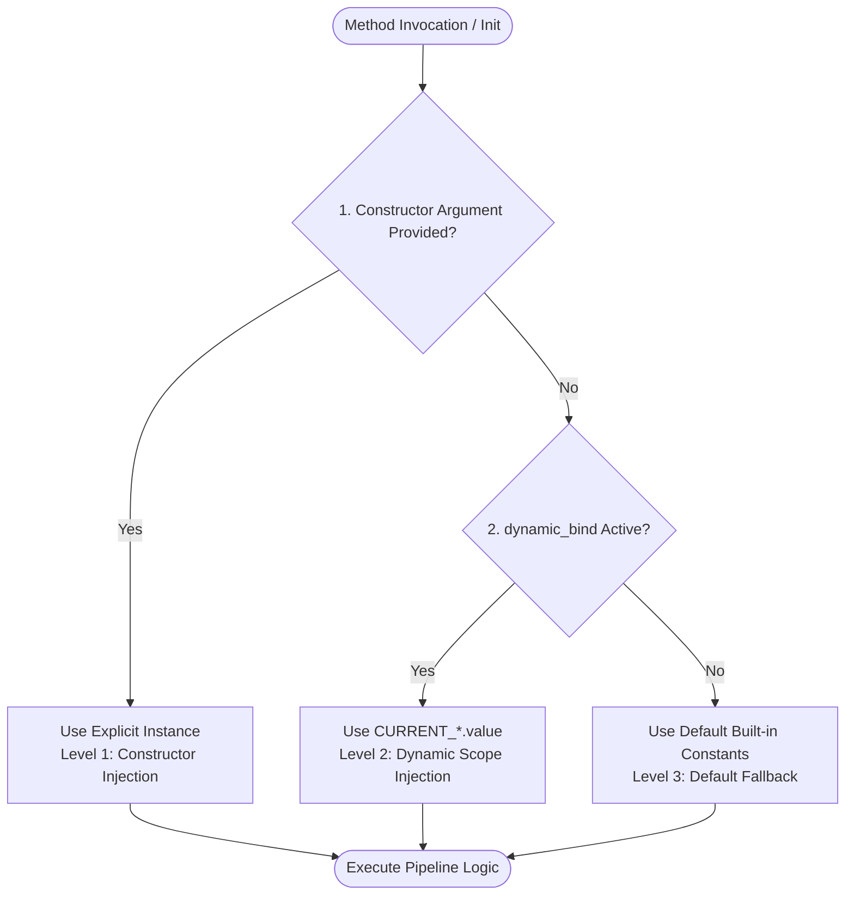

# [FEAT/ENH] 自然言語処理およびパイプライン層におけるドメイン固有語彙・文法規則・シソーラスの依存性注入 (DI) 化と責務分離 (ID: 409)

## 1. 概要 / Summary

現在、自然言語処理基盤 (`src/nlp/`) および関連パイプライン層において、以下のドメイン固有（Cybersecurity / 学術論文・特定言語）の辞書・文法規則・シソーラスがエンジン内部に直接ハードコードされている。

1. `_GRAMMAR_ENTRIES` ([src/nlp/morphology/viterbi_tokenizer.py](../../src/nlp/morphology/viterbi_tokenizer.py)): 日本語形態素解析用文法エントリ (助詞・助動詞・接続詞・品詞コスト)
2. `_EN_STOPWORDS` / `_JA_STOPWORDS` / `_ACADEMIC_NOISE` ([src/nlp/lexicon/stop_words.py](../../src/nlp/lexicon/stop_words.py)): 言語別ストップワードおよび学術メタノイズ
3. `_SYNONYM_GROUPS` / `_EN_TO_JA_DICT` ([src/nlp/lexicon/security_thesaurus.py](../../src/nlp/lexicon/security_thesaurus.py)): セキュリティ用語同義語クラスタおよび英和対訳辞書
4. `KEYWORD_TRANSLATIONS` / `PHRASE_REPLACEMENTS` ([src/nlp/summarization/structured_synthesizer.py](../../src/nlp/summarization/structured_synthesizer.py)): 3点要約合成用キーワード置換・学術定型句置換辞書
5. `THREAT_MARKERS` / `PROPOSAL_MARKERS` / `IMPACT_MARKERS` / `NEGATION_PATTERNS` / `PRIOR_WORK_PATTERNS` / `MODALITY_BOOSTERS` ([src/nlp/summarization/discourse_parser.py](../../src/nlp/summarization/discourse_parser.py)): 談話構造スコアリングマーカーおよび正規表現パターン
6. `_CANONICAL_DOMAIN_MAP` ([src/nlp/clustering/topic_model.py](../../src/nlp/clustering/topic_model.py)): セキュリティマクロドメイン分類辞書
7. `_ABBREVIATIONS` / `_REF_PATTERN` ([src/nlp/segmentation/academic_segmenter.py](../../src/nlp/segmentation/academic_segmenter.py)): 学術論文略語・参照パターン保護規則

これにより、「汎用アルゴリズム基盤（Pure-Python Viterbi、Louvain クラスタリング、談話構造パーサー等）」と「セキュリティドメイン知識」が密結合しており、以下の構造的課題が生じている：
- 単体テスト時に小規模なモック語彙・辞書への差し替えが困難
- 医療・金融・法務など他ドメインへの NLP 基盤の転用が困難
- 実行時の動的辞書拡張・多言語対応・一時的カスタム置換が困難

### LISP 動的スコープ思想の導入とハイブリッド 3 段フォールバック DI
本課題では、Java 的な重厚な DI コンテナ（IoC Container やグローバルシングルトンレジストリ）を新設するのではなく、リポジトリ既存の LISP 動的束縛基盤 **`src/pylisp/dynvar.py` (`DynamicVar`, `dynamic_bind`)** をバックボーンとして活用する。

オブジェクト指向的な「**Constructor Injection**（局所的・明示的注入）」と、LISP / Clojure 的な「**Dynamic Scope Injection**（中間層のバケツリレー不要なコンテキスト一括注入）」を融合した **ハイブリッド 3 段フォールバック DI アーキテクチャ** を確立する。

---

## 2. トレーサビリティ / Traceability

- **設計仕様書**:
  - `DSN-01`: システム高水準アーキテクチャ (NLPレイヤの疎結合・SPI適合規約)
  - `DSN-19`: 自然言語処理（NLP）重要キーワード抽出・3点構造化要約・横断的動向シンセシス包括的アーキテクチャ設計書
  - `DSN-27`: 自然言語処理基盤 (Core SPI & Lexicon Separation)
  - `DSN-29`: LISP 言語基盤 (Phase 0: `pylisp.dynvar` 非同期セーフ動的スコープ)
- **関連 Issue**:
  - [Issue 389 (Closed): pylisp.dynvar 非同期セーフ動的スコープ基盤の実装](389-implement-pylisp-dynvar-dynamic-scope.md)
  - [Issue 405 (Closed): 自然言語処理基盤 Phase 1: src/nlp/ 共通パッケージ創設・SPI定義・学術文境界解析器の実装](405-nlp-phase1-core-package-spi-and-academic-segmenter.md)
  - [Issue 406 (Closed): 自然言語処理基盤 Phase 2: Pure-Python 形態素解析器・Trie木辞書・セキュリティ専門語シソーラスの実装](406-nlp-phase2-pure-python-morphology-and-security-thesaurus.md)
  - [Issue 407 (Closed): 自然言語処理基盤 Phase 3: 談話構造解析・否定文＆モダリティ検知付き3点構造化要約エンジンの高度化](407-nlp-phase3-discourse-rhetoric-and-structured-summarizer.md)
  - [Issue 408 (Closed): 自然言語処理基盤 Phase 4: 動的トピッククラスタリングエンジンの実装と5階層エグゼクティブサマリー自動連携](408-nlp-phase4-dynamic-topic-clustering-and-executive-sync.md)
- **アーキテクチャ規約**:
  - ゼロ外部依存（Zero External Dependencies / Standard Library Only）
  - 非同期セーフ・スレッドセーフ（`contextvars.ContextVar` 準拠）
  - イミュータブル構成データ構造（`frozen=True`, `frozenset`, `tuple`）
  - 循環インポートの完全排除
  - Xenon 循環的複雑度 CC <= 3 (Rank A) & `mypy --strict` 準拠
  - 完全後方互換性（引数なし呼び出しで既存動作 100% 保証）

---

## 3. 影響範囲と関連ファイル / Scope and Affected Files

- [x] [src/nlp/core/context.py](../../src/nlp/core/context.py) *(新規作成: NLP動的スコープ変数・イミュータブル設定定義)*
- [x] [src/nlp/core/__init__.py](../../src/nlp/core/__init__.py) *(更新: 動的コンテキストのエクスポート追加)*
- [x] [src/nlp/lexicon/security_thesaurus.py](../../src/nlp/lexicon/security_thesaurus.py) *(更新: 対訳辞書・同義語クラスタのDI対応)*
- [x] [src/nlp/lexicon/stop_words.py](../../src/nlp/lexicon/stop_words.py) *(更新: ストップワード判定の動的スコープ解決対応)*
- [x] [src/nlp/morphology/viterbi_tokenizer.py](../../src/nlp/morphology/viterbi_tokenizer.py) *(更新: 文法規則・シソーラスの遅延/動的Trie構築対応)*
- [x] [src/nlp/summarization/discourse_parser.py](../../src/nlp/summarization/discourse_parser.py) *(更新: 談話マーカー・モダリティ規則のDI対応)*
- [x] [src/nlp/summarization/structured_synthesizer.py](../../src/nlp/summarization/structured_synthesizer.py) *(更新: 要約合成置換ルールのDI対応)*
- [x] [src/nlp/clustering/topic_model.py](../../src/nlp/clustering/topic_model.py) *(更新: ドメインマップ・シソーラスの動的解決対応)*
- [x] [src/nlp/segmentation/academic_segmenter.py](../../src/nlp/segmentation/academic_segmenter.py) *(更新: 学術略語・参照パターンのDI対応)*
- [x] [src/nlp/__init__.py](../../src/nlp/__init__.py) *(更新: ファサード層へのコンテキスト公開)*
- [x] [tests/nlp/test_di_context.py](../../tests/nlp/test_di_context.py) *(新規作成: DI・動的スコープ・非同期セーフ包括テスト)*
- [x] [tests/nlp/](../../tests/nlp/) *(回帰検証: 既存単体テスト群の 100% 後方互換性検証)*
- [x] [docs/issues/README.md](../README.md) *(更新: Issue台帳ステータス管理)*


---

## 4. 脅威モデルとセキュリティ要件 / Threat Model & Security Requirements

本機能は外部・動的からの辞書・文法規則・正規表現パターンの注入を受け入れるため、以下の脅威モデルを策定し緩和策を設計に組み込む：



### 脅威 1: 共有ミュータブル状態によるタスク間汚染 (Thread / Task State Contamination)
- **リスク**: 非同期並列タスク（論文フェッチ・要約パイプライン）で動的スコープを変更した際、別のタスクに設定が漏洩・残存する。
- **緩和策**:
  - `pylisp.dynvar.dynamic_bind` は Python 標準 `contextvars.ContextVar` に基づいており、非同期タスクごとに完全に分離されたコンテキストを保証する。
  - すべての設定オブジェクト（`DiscourseMarkerConfig`, `SynthesizerRuleConfig` 等）は `@dataclass(frozen=True)` および `Tuple` / `FrozenSet` で構成し、辞書インプレース書き換えによる副作用を完全に遮断する。

### 脅威 2: カスタム正規表現・語彙注入による ReDoS (Regular Expression Denial of Service)
- **リスク**: 不正・脆弱な正規表現パターン（悪意あるバックトラッキング）が注入された場合、CPU が 100% に張り付きパイプラインが停止する。
- **緩和策**:
  - 単語・シソーラス置換を行う `_apply_thesaurus_replacement` 等では、注入文字列を常に `re.escape()` してリテラル照合を強制する。
  - カスタムパターンを登録する `DiscourseMarkerConfig` では、正規表現コンパイル時の検証および最大長制限（パターン長 256 文字以内、ネスト量制限）を課す。

### 脅威 3: 巨大辞書注入によるメモリ枯渇 (DoS via Memory Exhaustion)
- **リスク**: 無制限に巨大な単語リストが渡された場合、Trie木の構築で OOM が発生する。
- **緩和策**:
  - Trie 木への動的登録時に上限エントリ数チェックを実施（デフォルト最大 50,000 エントリ）。

---

## 5. 詳細設計と3段フォールバック解決原則 / Detailed Design

### アーキテクチャ: 3 段フォールバック解決原則 (3-Tier Fallback Resolution)

各コンポーネントにおける依存関係（Thesaurus, Lexicon, Stopwords, Rules）は、以下の優先順位で自動解決される：



1. **Level 1 (Constructor)**: コンストラクタ引数で明示的に渡されたインスタンス・辞書（最優先・OOP単体テスト用）
2. **Level 2 (Dynamic Scope)**: 現在の動的コンテキスト (`CURRENT_*.value`)（`with dynamic_bind(...)` によるスコープ限定差し替え用）
3. **Level 3 (Default Fallback)**: 組み込みデフォルト定数・インスタンス（完全後方互換性担保）

### コンテキスト定義スキーマ (`src/nlp/core/context.py`)

```python
@dataclass(frozen=True, slots=True)
class DiscourseMarkerConfig:
    """談話構造解析用マーカー・パターンイミュータブル設定."""
    threat_markers: Tuple[str, ...]
    proposal_markers: Tuple[str, ...]
    impact_markers: Tuple[str, ...]
    negation_patterns: Tuple[str, ...]
    prior_work_patterns: Tuple[str, ...]
    modality_boosters: Tuple[str, ...]

@dataclass(frozen=True, slots=True)
class SynthesizerRuleConfig:
    """3点構造化要約合成用置換ルール・テンプレートイミュータブル設定."""
    keyword_translations: Tuple[Tuple[str, str], ...]
    phrase_replacements: Tuple[Tuple[str, str], ...]
    threat_default_text: str = "既存システムのセキュリティ境界における脆弱性課題"
    prop_default_template: str = "{j_title}の提案フレームワーク"
    impact_default_text: str = "実験的評価による防御性能と攻撃耐性の実証"
    executive_template: str = "【提案】{prop}。実証評価により{impact}。"

# DynamicVar 定義一覧
CURRENT_THESAURUS: DynamicVar[SecurityThesaurus]
CURRENT_SECURITY_TRANSLATIONS: DynamicVar[Dict[str, str]]
CURRENT_SYNONYM_GROUPS: DynamicVar[Tuple[Tuple[str, ...], ...]]
CURRENT_STOPWORDS: DynamicVar[FrozenSet[str]]
CURRENT_GRAMMAR_ENTRIES: DynamicVar[Tuple[Tuple[str, int, str], ...]]
CURRENT_DISCOURSE_MARKERS: DynamicVar[DiscourseMarkerConfig]
CURRENT_SYNTHESIZER_RULES: DynamicVar[SynthesizerRuleConfig]
CURRENT_TOPIC_DOMAINS: DynamicVar[Tuple[Tuple[str, Tuple[str, ...]], ...]]
CURRENT_ABBREVIATIONS: DynamicVar[Tuple[Tuple[str, str], ...]]
```

---

## 6. 実装方針とフェーズ計画 / Implementation Plan & Phases

Target Branch: `feat/409-nlp-domain-lexicon-and-rules-di-injection`

### Phase 1: NLP 動的コンテキスト (`src/nlp/core/context.py`) の創設
1. `src/nlp/core/context.py` を新規作成。
2. `DiscourseMarkerConfig`, `SynthesizerRuleConfig` をイミュータブル（`frozen=True, slots=True`）として定義。
3. `pylisp.dynvar.DynamicVar` を用いて、各語彙・規則に対応する `CURRENT_*` 動的変数を宣言。
4. デフォルト定数を既存モジュールから参照・集約し、初期フォールバック値としてセット。
5. `src/nlp/core/__init__.py` および `src/nlp/__init__.py` からエクスポート。

### Phase 2: シソーラス・ストップワード層の DI 対応
1. **`src/nlp/lexicon/security_thesaurus.py`**:
   - `SecurityThesaurus.__init__(self, translations: Optional[Dict[str, str]] = None, synonym_groups: Optional[Sequence[Sequence[str]]] = None)`
   - `translations` 未指定時は `CURRENT_SECURITY_TRANSLATIONS.value` にフォールバック。
   - `synonym_groups` 未指定時は `CURRENT_SYNONYM_GROUPS.value` にフォールバック。
   - 引数辞書のイミュータブルコピーを作成し、外部ミューテーションを防止。
2. **`src/nlp/lexicon/stop_words.py`**:
   - `is_stop_word(term: str, stopwords: Optional[AbstractSet[str]] = None) -> bool`:
     - `stopwords` 未指定時は `CURRENT_STOPWORDS.value` を参照。
   - 既存の定数 `STOPWORDS` は後方互換性のために維持。

### Phase 3: 形態素解析器・トークナイザー層の DI 対応
1. **`src/nlp/morphology/viterbi_tokenizer.py`**:
   - `PureMorphTokenizer.__init__(self, trie: Optional[PrefixTrie] = None, grammar_entries: Optional[Sequence[Tuple[str, int, str]]] = None, thesaurus: Optional[SecurityThesaurus] = None)`
   - `_build_default_trie(grammar_entries=None, thesaurus=None)`:
     - `grammar_entries` 未指定時は `CURRENT_GRAMMAR_ENTRIES.value` を使用。
     - `thesaurus` 未指定時は `CURRENT_THESAURUS.value` を使用。
   - `_trie` が明示されない場合、実行時に `CURRENT_THESAURUS` / `CURRENT_GRAMMAR_ENTRIES` の動的スコープを反映した Trie を構築・キャッシュする機構を導入。

### Phase 4: 談話構造解析器・要約合成器層の DI 対応
1. **`src/nlp/summarization/discourse_parser.py`**:
   - `DiscourseRhetoricParser.__init__(self, marker_config: Optional[DiscourseMarkerConfig] = None)`
   - ヘルパーメソッド `_get_marker_config()` で `self._marker_config or CURRENT_DISCOURSE_MARKERS.value` を動的解決。
   - `_score_single_sentence`, `_count_marker_matches` などの関数にマーカー設定を引数として渡すよう純粋関数化。
2. **`src/nlp/summarization/structured_synthesizer.py`**:
   - `StructuredSynthesizer.__init__(self, segmenter=None, parser=None, thesaurus=None, title_translator=None, rules: Optional[SynthesizerRuleConfig] = None)`
   - `_get_thesaurus()`: `self._thesaurus or CURRENT_THESAURUS.value`
   - `_get_rules()`: `self._rules or CURRENT_SYNTHESIZER_RULES.value`
   - キーワード置換・定型句置換・テンプレート埋め込みを `_get_rules()` から動的取得。

### Phase 5: トピッククラスタリング & 学術文境界解析層の DI 対応
1. **`src/nlp/clustering/topic_model.py`**:
   - `TopicClusterer.__init__(..., thesaurus=None, domain_map: Optional[Sequence[Tuple[str, Sequence[str]]]] = None)`
   - `_get_thesaurus()`: `self._thesaurus or CURRENT_THESAURUS.value`
   - `_get_domain_map()`: `self._domain_map or CURRENT_TOPIC_DOMAINS.value`
2. **`src/nlp/segmentation/academic_segmenter.py`**:
   - `AcademicSentenceSegmenter.__init__(..., abbreviations: Optional[Sequence[Tuple[str, str]]] = None)`
   - `abbreviations` 未指定時は `CURRENT_ABBREVIATIONS.value` にフォールバック。

### Phase 6: 包括的単体テスト・非同期セーフ実証 (`tests/nlp/test_di_context.py`)
1. **Level 1 (Constructor DI) テスト**:
   - モック辞書（例: 医療ドメイン "oncology" -> "腫瘍学"）を渡してインスタンス生成し、グローバル設定に影響を与えず動作することを確認。
2. **Level 2 (Dynamic Scope DI) テスト**:
   - `with dynamic_bind({CURRENT_THESAURUS: custom_thesaurus, CURRENT_SYNTHESIZER_RULES: custom_rules}):` 内でパイプライン一式（`StructuredSynthesizer.summarize_paper`）を実行し、引数を一切渡さずにカスタム辞書でサマリーが生成されることを実証。
3. **Level 3 (Default Fallback) テスト**:
   - 引数なし呼出で従来のセキュリティドメイン辞書・定型句がそのまま出力されること（100% 後方互換性）。
4. **非同期並行・タスク分離テスト**:
   - `asyncio.gather` により、異なる辞書を動的束縛した 2 つのコルーチンを同時実行し、相互に値が干渉・混入しないことを実証。
5. **ジェネレータ使用禁止バリデーション**:
   - `pylisp.dynvar.dynamic_bind` のジェネレータ遮断ルールが NLP レイヤでも正常機能することをテスト。

---

## 7. 完了条件 / Success Criteria (DoD)

- [x] `src/nlp/core/context.py` が創設され、`pylisp.dynvar.DynamicVar` に基づく動的環境変数群およびイミュータブル Config クラスが型安全に定義されていること。
- [x] 対象クラス（`SecurityThesaurus`, `PureMorphTokenizer`, `StructuredSynthesizer`, `DiscourseRhetoricParser`, `TopicClusterer`, `AcademicSentenceSegmenter`）が引数なしで既存通り正常動作すること（完全後方互換性）。
- [x] コンストラクタ引数による局所的 DI (Level 1)、`dynamic_bind` による動的スコープ DI (Level 2)、デフォルト定数 (Level 3) の 3 段フォールバックが機能すること。
- [x] `tests/nlp/test_di_context.py` が新規作成され、DI動作・非同期タスク分離・イミュータビリティが網羅的に検証されていること。
- [x] 既存テスト全件（`tests/nlp/` およびパイプライン回帰テスト）が 100% PASS すること。
- [x] `make check_format` および `make static_analysis` (flake8, mypy --strict, xenon CC <= 3 Rank A) がエラー 0 件で通過すること。
- [x] 全てのドキュメントリンクが相対パスで記載され、Issue 台帳 (`docs/issues/README.md`) が整合していること。

