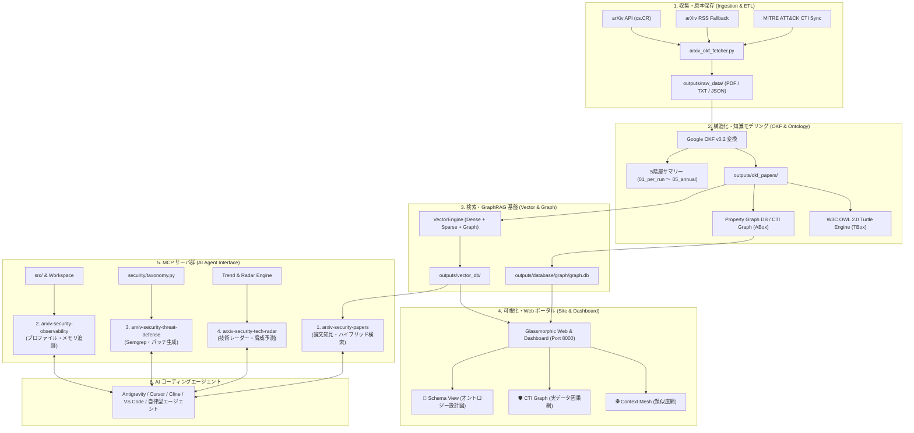

# [USR-01] ユーザーマニュアル ＆ AI コーディングエージェント連携ガイド (User Manual)

---

## 1. システム概要 ＆ アーキテクチャ (System Architecture)

`arxiv-security-papers` は、arXiv の最新コンピュータセキュリティ（`cs.CR` 等）論文を自動収集・原本保存（PDF/全文テキスト/JSONメタデータ）し、**Google Open Knowledge Format (OKF) v0.2** 形式に構造化変換した上で、**5 階層エグゼクティブサマリー**の自動生成、**W3C OWL 2.0 / Turtle オントロジー (TBox)** と **プロパティグラフDB (ABox)** による因果連鎖・実証エビデンス探索、**セマンティックベクトル検索 (Dense + Sparse + GraphRAG)**、および **Model Context Protocol (MCP)** 経由で AI コーディングエージェントへ学術知見・コード観測性・脅威防御・技術レーダーを提供する統合インテリジェンス基盤です。



---

## 2. クイックスタート (Quickstart)

### 2.1 前提環境
- **Python**: 3.14 以上（Python 3.14.7 標準動作確認済み）
- **メモリ**: 2GB 以上の空き RAM（大規模ベクトル検索・Dual CSR グラフ DB キャッシュ利用時）
- **ディスク**: 1GB 以上の空きストレージ（PDF 原本および OKF マークダウン蓄積用）
- **システムツール**: `git`, `make`（※ PDF テキスト抽出は内製 Pure-Python エンジン `src/pdf_engine/` で動作するため、`poppler-utils` / `pdftotext` のインストールは不要・完全ゼロ外部依存です）

### 2.2 最速セットアップ手順

リポジトリルートで以下のコマンドを順に実行します。

```bash
# 1. 仮想環境の構築と依存パッケージのインストール
make setup

# 2. 論文の収集・OKF 変換・サマリー生成を実行
make pipeline

# 3. セマンティックベクトル検索インデックスのビルド
make build_vector_db

# 4. セキュリティナレッジグラフ (Property Graph DB) の構築
make build_knowledge_graph

# 5. 全品質ゲート (format, static_analysis, test, closure-compiler) の一括検証
make verify_quality
```

---

## 3. 論文収集・パイプライン運用コマンド (Paper Ingestion & ETL)

### 3.1 通常の自動収集（最新論文）
arXiv API から最新のセキュリティ論文を取得し、PDF ダウンロード、全文テキスト抽出、OKF 変換、および 5 階層エグゼクティブサマリーを一括更新します。

```bash
make pipeline
# または
make run
```

### 3.2 期間指定・過去バックフィル収集
特定の日付範囲や取得件数を指定して過去論文を取り込みます。

```bash
# 過去 160 日間の論文を一括バックフィル取得
make backfill_160d

# 中断されたバックフィルをチェックポイントから自動再開
make backfill_resume

# 日付範囲と件数を指定して実行
.venv/bin/python src/pipeline/arxiv_okf_fetcher.py --start-date 2026-07-28 --end-date 2026-08-27 --max-results 50

# 既存論文も含めて強制再処理する場合（--force）
.venv/bin/python src/pipeline/arxiv_okf_fetcher.py --force --max-results 20
```

### 3.3 MITRE ATT&CK CTI 定義同期 ＆ 過去論文アノテーション
MITRE ATT&CK の最新脅威インテリジェンス定義をローカル SQLite カタログへ同期し、蓄積済み OKF 論文へ CTI テクニック・緩和策を再付与します。

```bash
# MITRE ATT&CK CTI 定義の同期
make sync_cti

# 既存 OKF 論文全件の CTI 再アノテーション
make reannotate_cti
```

### 3.4 PDF 抽出エンジン（Pure-Python ゼロ依存）の直接実行 ＆ ベンチマーク
システム依存ライブラリ（`pdftotext` 等）を使用しない内製 Pure-Python PDF 解析エンジンです。

```bash
# 単一 PDF ファイルのテキスト抽出テスト
PYTHONPATH=src .venv/bin/python3 -m pdf_engine outputs/raw_data/2026-09-06/2504.03936.pdf

# PDF テキスト抽出エンジンのパフォーマンステスト・ベンチマーク実行
PYTHONPATH=src .venv/bin/python3 -m pdf_engine.benchmark
```

---

## 4. 自律型閉ループ・インテリジェンス統合システム (Universal Intelligence Orchestrator)

`src/intelligence/` および `src/workflow/` に基づく 6 大フェーズ（PIR計画、自律ハーベスト、Admiralty信憑性評価/OKF構造化、ベイズ仮説検証/5層サマリー合成、配布、フィードバック学習）のライフサイクルを CLI または Python API から実行・制御します。

### 4.1 6 フェーズ閉ループ・インテリジェンスサイクルの実行 (`cycle`)
```bash
# Makefile からの標準自律サイクル実行
make orchestrate

# 詳細ログ表示付き実行
PYTHONPATH=src .venv/bin/python3 src/__main__.py cycle --verbose

# 特定トピックにフォーカスした収集・サマリー合成
PYTHONPATH=src .venv/bin/python3 src/__main__.py cycle --topics "耐量子暗号,MCPセキュリティ" --quota 10

# リアクティブ・ストリーミング DAG & バックプレッシャー制御による実行
PYTHONPATH=src .venv/bin/python3 src/__main__.py cycle --streaming --chunk-size 5
```

### 4.2 3-Horizon PIR（優先インテリジェンス要件）の管理 (`pir`)
```bash
# 登録済み PIR 一覧 & 正規化トピック重み分布の表示
PYTHONPATH=src .venv/bin/python3 src/__main__.py pir list

# 新規 PIR（戦術・運用・戦略）の登録
PYTHONPATH=src .venv/bin/python3 src/__main__.py pir add \
  --id "pir_mcp_vuln" \
  --title "MCP Tool Vulnerabilities" \
  --description "Monitor privilege escalation in Model Context Protocol tools" \
  --topics "MCPセキュリティ,権限昇格" \
  --priority 0.95 \
  --horizon tactical

# 緊急事態発生時の PIR 動的エスカレーション（即時昇格）
PYTHONPATH=src .venv/bin/python3 src/__main__.py pir escalate \
  --id "pir_mcp_vuln" \
  --reason "Active 0-day in wild" \
  --horizon tactical
```

### 4.3 自律型自己修復ハーベストルーター & サーキットブレーカー (`harvest`)
```bash
# 各収集ルートの回線状態（CLOSED / OPEN / HALF_OPEN）と健全度スコアの確認
PYTHONPATH=src .venv/bin/python3 src/__main__.py harvest status

# 指定トピックでの通信疎通・動的ルート変異テスト
PYTHONPATH=src .venv/bin/python3 src/__main__.py harvest test --topic "耐量子暗号" --quota 3
```

### 4.4 NATO STANAG 2022 Admiralty 信憑性評価 (`credibility`)
```bash
# Admiralty 信憑性評価マトリクス (A1〜F6) の Markdown 表示
PYTHONPATH=src .venv/bin/python3 src/__main__.py credibility matrix

# 情報源の信頼度（A〜F）と確憑性（1〜6）による個別スコアリング
PYTHONPATH=src .venv/bin/python3 src/__main__.py credibility score --source arxiv --credibility 2
```

### 4.5 自律検証セキュリティ仮説の管理 (`hypothesis`)
```bash
# 追跡中のセキュリティ仮説一覧・ベイズ確信度スコアの確認
PYTHONPATH=src .venv/bin/python3 src/__main__.py hypothesis list

# 新規仮説の登録
PYTHONPATH=src .venv/bin/python3 src/__main__.py hypothesis add \
  --id "hypo_pqc_sidechannel" \
  --statement "Kyber/ML-KEM 実装においてキャッシュサイドチャネル攻撃の脆弱性が存在する" \
  --topics "耐量子暗号,サイドチャネル攻撃"
```

### 4.6 Event Sourcing WAL クラッシュリカバリ (`recover`)
```bash
# 実行済み・中断中サイクルの WAL 履歴一覧を表示
PYTHONPATH=src .venv/bin/python3 src/__main__.py recover --list

# 中断された特定のサイクルを最新チェックポイントから自律再開
PYTHONPATH=src .venv/bin/python3 src/__main__.py recover --cycle-id <cycle_id>
```

### 4.7 常駐デーモンモード (`daemon`)
```bash
# 閉ループインテリジェンス・オーケストレーターを継続デーモン実行
make orchestrate_daemon
# または
PYTHONPATH=src .venv/bin/python3 src/intelligence/cli.py daemon
```

---

## 5. オントロジー (TBox) ＆ セキュリティ知識体系 (W3C OWL 2.0 / Turtle Engine)

プロジェクト全体の中核概念（メタモデル）を定義する W3C RDF 1.1 / OWL 2.0 準拠の Pure-Python オントロジー生成エンジンです。

### 5.1 W3C OWL Turtle (`.ttl`) 生成・エクスポート
```bash
# デフォルト出力先 (outputs/ontology/security_ontology_v2.ttl) への生成
PYTHONPATH=src .venv/bin/python3 -m ontology.turtle_engine

# 出力先パスを指定して生成
PYTHONPATH=src .venv/bin/python3 -m ontology.turtle_engine --output outputs/ontology/custom_ontology.ttl

# 標準出力に出力（パイプライン処理向け）
PYTHONPATH=src .venv/bin/python3 -m ontology.turtle_engine --stdout
```

### 5.2 Full-Spectrum セキュリティオントロジー v2.0 仕様
`outputs/ontology/security_ontology_v2.ttl` には以下の 8 大領域が網羅的に定義されています：
1. **コア実体・述語**: `Paper`, `ThreatActor`, `AttackTechnique`, `Vulnerability`, `DefenseMechanism`
2. **実世界インシデント**: `Incident`, `verifiesCVE`, `exploitedInIncident`
3. **実効的防御成果物**: `DetectionRule` (Semgrep/Sigma), `PoCArtifact`, `blocks`
4. **前提条件と脅威モデル**: `Precondition`, `accessLevel`, `requiresPrecondition`
5. **研究ギャップ・残余リスク**: `ResearchGap`, `ResidualRisk`, `leavesUnaddressed`
6. **来歴と信頼水準**: `PublicationVenue`, `reproducibilityTier`, `presentedAt`
7. **脅威因果連鎖・被害影響**: `Impact`, `hasImpact`, `neutralizesPrecondition`, `strideCategory`
8. **主張-エビデンス具現化・正規表現データ型制約**: `Claim`, `EvaluationResult`, `CVEIdentifier` (`CVE-YYYY-NNNN+`), `AttackTechniqueIdentifier` (`TNNNN`)

---

## 6. プロパティグラフDB (ABox: CTI Knowledge Graph) ＆ GraphRAG

実論文データ（ABox）からエンティティおよび因果連鎖トリプルを抽出・インデックス化する **Dual CSR (Compressed Sparse Row)** 高速プロパティグラフエンジンです。

### 6.1 ナレッジグラフの構築・バックフィル
```bash
# 全 OKF 論文からオントロジー実体・関係を抽出しグラフDBを構築
make build_knowledge_graph

# または CLI から直接実行（--backfill）
PYTHONPATH=src .venv/bin/python3 src/graph/cli.py build --backfill
```

### 6.2 トポロジ統計・検証
```bash
# グラフDBの頂点数・エッジ数・ラベル別分布の表示
make graph_stats

# または CLI から直接実行（--stats）
PYTHONPATH=src .venv/bin/python3 src/graph/cli.py show --stats
```

### 6.3 CLI グラフクエリ実行 (`query`)
CLI から直接、多ホップ因果探索、Ego ネットワーク、CWE 影響範囲、最短到達経路、研究ギャップなどを高速検索できます。

```bash
# ① 因果連鎖探索 (causal:): 指定実体から多ホップの因果関係を展開
PYTHONPATH=src .venv/bin/python3 src/graph/cli.py query "causal:T1059"

# ② Ego ネットワーク探索 (ego:): 指定実体の周囲 N ホップ（デフォルト2）を展開
PYTHONPATH=src .venv/bin/python3 src/graph/cli.py query "ego:CWE-79 2"

# ③ CWE 被害影響探索 (cwe:): 指定 CWE に紐づく攻撃手法・被害影響・対象論文を展開
PYTHONPATH=src .venv/bin/python3 src/graph/cli.py query "cwe:79"

# ④ 最短到達経路探索 (path:): 実体 A から実体 B への最短推論パスを探索
PYTHONPATH=src .venv/bin/python3 src/graph/cli.py query "path:Paper_2504.03936->CWE-79"

# ⑤ 研究ギャップ探索 (gap): 防御策が未提案の攻撃手法や脆弱性を抽出
PYTHONPATH=src .venv/bin/python3 src/graph/cli.py query "gap"

# ⑥ キーワードマッチ検索: 名前やタイトルに部分一致するノードとその隣接エッジを展開
PYTHONPATH=src .venv/bin/python3 src/graph/cli.py query "LLM Jailbreak" --limit 30
```

---

## 7. 検索エンジン ＆ セマンティックベクトルDB (Dense + Sparse + GraphRAG)

密ベクトル (Dense)、疎ベクトル (BM25/Sparse)、および知識グラフ (GraphRAG) を組み合わせた 4 段階ハイブリッド検索エンジンです。

### 7.1 ベクトルインデックスのビルド
```bash
# 全 OKF 論文からセマンティックベクトルインデックスを生成
make build_vector_db
```

### 7.2 セマンティック RAG 検索 CLI
```bash
# 自然言語クエリによるベクトル検索実行
make rag_query Q="LLM Prompt Injection and Jailbreak"
```

### 7.3 検索エンジン品質ベンチマーク評価
```bash
# 検索精度指標 (Precision@K, Recall@K, MAP, MRR, NDCG) の自動計測
make eval_search
```

### 7.4 IR メトリクス評価 ＆ CI 回帰検知ゲート
```bash
# ベースライン IR メトリクス (NDCG@10, MRR, MAP) の更新
make ir_eval

# 検索精度回帰防止ゲート (3% 以上の低下を検知して遮断)
make check_ir_regression
```

---

## 8. 戦略 KPI ＆ 脅威アナリティクス集計 (Analytics)

論文メタデータ、脅威カテゴリ、MITRE ATT&CK マッピングから戦略的セキュリティ KPI を集計します。

```bash
# 戦略 KPI と脅威アナリティクスのバッチ事前集計
make aggregate_analytics

# または Python CLI から直接実行
PYTHONPATH=src .venv/bin/python3 -m analytics.cli aggregate
```

---

## 9. プロセススーパーバイザー (Pre-Fork Daemon & Arbiter)

Gunicorn スタイルのプリフォーク型プロセスマネージャー兼アービターです。収集ワーカー、Web サーバー、MCP サーバーを単一障害点なく常駐管理します。

```bash
# 1. 前面（フォアグラウンド）でスーパーバイザーを起動
make run_supervisor

# 2. バックグラウンドデーモンモード (-D) で起動
make start_supervisor

# 3. 稼働ステータス確認（Unix ドメインソケット IPC 経由）
make status_supervisor

# 4. リアルタイム TUI モニタリングダッシュボード（Worker top）
make top_supervisor

# 5. ワーカープロセスの動的スケーリング (例: 4ワーカーへ拡張)
PYTHONPATH=src .venv/bin/python3 -m supervisor.cli scale --workers 4

# 6. 設定およびワーカープロセスのローリングリロード（ゼロダウンタイム）
make reload_supervisor

# 7. スーパーバイザー稼働ログの直近出力確認
PYTHONPATH=src .venv/bin/python3 -m supervisor.cli logs --lines 50

# 8. スーパーバイザーデーモンおよび全ワーカーの安全停止
make stop_supervisor
```

---

## 10. Web ポータル UI ＆ ダッシュボード (3大可視化モード操作ガイド)

Glassmorphism デザインを採用した Web ポータルおよびインタラクティブな Graph Engineering Dashboard です。

```bash
# Web サーバーの起動 (http://localhost:8000)
make run_web

# またはグラフダッシュボード直接起動 (http://localhost:8000/dashboard)
make run_dashboard
```

- **Web 検索 UI**: `http://localhost:8000`
- **CTI / オントロジー ダッシュボード**: `http://localhost:8000/dashboard`

### 10.1 Web ダッシュボードの 3 大可視化モード

| モード名 | アイコン / UI 表記 | 概要・用途 | 主な操作・探索機能 |
| :--- | :--- | :--- | :--- |
| **Context Mesh** | `🌐 Context Mesh` | 論文間のセマンティック類似度（Dense Vector コサイン類似度）に基づく類似網 | 類似論文クラスタの俯瞰、特定トピックの関連論文探索 |
| **CTI Graph** | `🛡️ CTI Graph` | 実論文データ（ABox）から抽出された脅威・防御・因果・エビデンスの実データ網 | ノードクリックによる詳細表示、マルチセレクトフィルタ、Ego展開、因果連鎖ハイライト |
| **Schema View** | `📐 Schema View` | W3C OWL 2.0 TBox メタモデルスキーマ（クラス体系・関係性設計図） | クラス定義の確認、継承階層（`subClassOf`）、ドメイン/レンジ制約、因果・具現化述語の視覚的検証 |

#### Schema View の配色定義とエッジ表現体系
- **ノード配色（W3C OWL TBox クラス）**:
  - `Indigo (#4f46e5)`: `Paper`（学術論文）, `PoCArtifact`（PoCコード成果物）, `PublicationVenue`（発表学会・論文誌）
  - `Orange (#ea580c)` / `Amber (#d97706)`: `AttackTechnique`（攻撃手法・ATT&CK）, `Vulnerability`（脆弱性・CWE）
  - `Pink / Magenta (#db2777)`: `Impact`（被害影響・STRIDE）, `Incident`（実世界セキュリティ事案）
  - `Emerald Green (#16a34a)` / `Teal (#059669)`: `DefenseMechanism`（防御策）, `DetectionRule`（検知ルール: Semgrep/Sigma）, `Precondition`（前提条件）
  - `Violet (#8b5cf6)` / `Mint Green (#10b981)`: `Claim`（学術的主張）, `EvaluationResult`（実験評価エビデンス）
- **エッジ表現体系**:
  - **赤実線 (`#EF4444`)**: 攻撃因果・被害影響・前提条件無力化関係 (`sec:hasImpact`, `sec:neutralizesPrecondition`)
  - **紫破線 (`#8B5CF6`)**: 具現化実体・評価結果結合関係 (`sec:assertsClaim`, `sec:evaluatesTechnique`, `sec:evaluatesClaim`)
  - **灰色点線 (`#9CA3AF`)**: クラス継承階層 (`rdfs:subClassOf`)
  - **インディゴ実線 (`#6366F1`)**: 標準オントロジーオブジェクトプロパティ (`sec:mitigates`, `sec:exploitedInIncident` 等)

### 10.2 主要 Web REST API エンドポイント一覧

| メソッド | エンドポイント | 説明 | パラメータ例 |
| :--- | :--- | :--- | :--- |
| `GET` | `/api/search` | ハイブリッド論文検索 | `?q=Zero+Trust&top_k=10` |
| `GET` | `/api/graph` | CTI グラフデータ取得（ABox） | `?limit=200&focus=T1059` |
| `GET` | `/api/graph/schema` | オントロジーメタモデル取得（TBox） | なし |
| `GET` | `/api/health` | サーバーヘルスチェック | なし |
| `GET` | `/api/stats` | 論文総数・カテゴリ分布統計 | なし |

---

## 11. MCP（Model Context Protocol）エージェント連携ガイド

### 11.1 MCP 設定ファイルの登録 (`mcp_config.json`)

エージェント設定ファイル（Claude Desktop、Antigravity、Cursor、Cline 等）に以下の設定を追加します。

```json
{
  "mcpServers": {
    "arxiv-security-papers": {
      "command": "/workspace/arxiv-security-papers/.venv/bin/python3",
      "args": [
        "src/mcp/papers_server.py"
      ],
      "env": {
        "PYTHONPATH": "src"
      }
    },
    "arxiv-security-observability": {
      "command": "/workspace/arxiv-security-papers/.venv/bin/python3",
      "args": [
        "src/mcp/observability_server.py"
      ],
      "env": {
        "PYTHONPATH": "src"
      }
    },
    "arxiv-security-threat-defense": {
      "command": "/workspace/arxiv-security-papers/.venv/bin/python3",
      "args": [
        "src/mcp/threat_defense_server.py"
      ],
      "env": {
        "PYTHONPATH": "src"
      }
    },
    "arxiv-security-tech-radar": {
      "command": "/workspace/arxiv-security-papers/.venv/bin/python3",
      "args": [
        "src/mcp/tech_radar_server.py"
      ],
      "env": {
        "PYTHONPATH": "src"
      }
    }
  }
}
```

### 11.2 提供される 4 大 MCP サーバーとツール一覧

#### ① `arxiv-security-papers` (学術知見・論文検索)
- **個別起動**: `make run_mcp_server`

| ツール名 | 説明 | 主要引数 |
| :--- | :--- | :--- |
| `search_security_papers` | セマンティックベクトル検索 | `query` (検索文), `top_k` (件数) |
| `search_papers_hybrid` | 4 段階 RAG ハイブリッド検索 (Vector+BM25+GraphRAG) | `query`, `top_k`, `category` |
| `get_paper_summary` | 指定 arXiv ID の完全日本語要約と OKF メタデータを取得 | `arxiv_id` (例: `"2504.03936"`) |
| `get_latest_trends` | 最新の月次・四半期・年次動向レポートを取得 | `period` (`"monthly"`, `"quarterly"`) |
| `query_attack_technique` | MITRE ATT&CK テクニック ID に紐づく論文を検索 | `technique_id` (例: `"T1059"`) |
| `query_knowledge_graph` | セキュリティエンティティの GraphRAG 探索 | `entity`, `max_depth` |

#### ② `arxiv-security-observability` (コード観測・最適化)
- **個別起動**: `make run_observability_mcp`

| ツール名 | 説明 | 主要引数 |
| :--- | :--- | :--- |
| `profile_code_performance` | cProfile による実行ボトルネック特定 | `code` (対象コード), `top_n`, `sort_by` |
| `track_memory_allocations` | tracemalloc による行単位のメモリ消費追跡 | `code`, `top_lines` |
| `benchmark_alternatives` | 複数実装候補の timeit ベンチマーク比較 | `candidates`, `number`, `repeat` |
| `inspect_bytecode` | Python dis によるバイトコード逆アセンブル解析 | `code` |
| `get_system_metrics` | 検索エンジン・キャッシュの稼働メトリクス取得 | なし |

#### ③ `arxiv-security-threat-defense` (脅威防御・パッチ生成)
- **個別起動**: `make run_threat_defense_mcp`

| ツール名 | 説明 | 主要引数 |
| :--- | :--- | :--- |
| `generate_semgrep_rule` | CWE/脆弱性パターンから Semgrep CI ルール YAML を合成 | `cwe_id` (例: `"CWE-502"`), `rule_id` |
| `synthesize_secure_patch` | 脆弱なコード片に対する学術知見準拠のセキュア修正パッチ生成 | `code`, `cwe_id` |
| `check_threat_coverage` | MITRE ATT&CK / NIST SP 800 に対する防御カバレッジ評価 | `declared_defenses` (リスト) |

#### ④ `arxiv-security-tech-radar` (技術レーダー・動向予測)
- **個別起動**: `make run_tech_radar_mcp`

| ツール名 | 説明 | 主要引数 |
| :--- | :--- | :--- |
| `get_technology_radar` | Adopt / Trial / Assess / Hold の技術レーダーを出力 | `ring`, `category` |
| `predict_emerging_threats` | 論文研究速度に基づく新興サイバー脅威・攻撃ベクトル予測 | `min_severity` (`"HIGH"`, `"CRITICAL"`) |

### 11.3 MCP 稼働統計 ＆ 動作検証
```bash
# MCP 利用メトリクス集計とレポート出力
make mcp_stats

# 全 4 大 MCP サーバーの仕様準拠性・プロトコルテスト実行
PYTHONPATH=src .venv/bin/python3 tests/test_all_mcp_servers.py
```

---

## 12. 包括的 Makefile コマンド一覧リファレンス (Cheat Sheet)

| カテゴリ | コマンド (`make <target>`) | 説明・主な用途 |
| :--- | :--- | :--- |
| **セットアップ** | `make setup` | 仮想環境構築、依存パッケージインストール、Git フック登録 |
| | `make clean` | 一時ファイル・ビルド成果物・キャッシュのクリーンアップ |
| **品質・テスト** | `make check_format` | isort, black, flake8 によるコードスタイル差分検証（非破壊） |
| | `make format` | isort, black, flake8 による自動コードフォーマット適用 |
| | `make static_analysis` | radon (CC/MI/Halstead), xenon (Grade A), mypy (strict), py_compile |
| | `make py_compile` | 全 Python ソースコードの構文コンパイル検査 |
| | `make build_js` | Google Closure Compiler による site/js バンドル最適化ビルド |
| | `make test` | pytest 高速テスト実行（@pytest.mark.slow を除く） |
| | `make test_scenarios` | データベース整合性・高負荷 DSN-14 シナリオテスト実行 |
| | `make test_slow` | 時間のかかる包括的ストレステストのみを実行 |
| | `make test_all` | カバレッジ 80% 以上を要求する全テスト一括実行 |
| | `make check` | `check_format`, `static_analysis`, `test` の一括ゲート |
| | `make verify_quality` | Python & JS を網羅する厳格な最終品質検証ゲート |
| | `make build` | フォーマット・品質ゲート実行および JS/Python ビルド |
| **収集・ETL** | `make pipeline` | 最新 arXiv 論文収集・PDF抽出・OKF変換・5層サマリー更新 |
| | `make run` | パイプライン実行（またはカスタム `$SRC` 実行） |
| | `make backfill_160d` | 過去 160 日間の論文一括バックフィルバッチ実行 |
| | `make backfill_resume` | 中断されたバックフィルバッチをチェックポイントから再開 |
| | `make sync_cti` | MITRE ATT&CK 定義をローカル SQLite カタログへ同期 |
| | `make reannotate_cti` | 全 OKF 論文へ CTI 定義を再アノテーション |
| **オントロジー / グラフ** | `make build_knowledge_graph` | 全 OKF 論文から実体・トリプルを抽出し Property Graph DB 構築 |
| | `make graph_stats` | Property Graph DB のトポロジ統計・頂点/エッジ分布表示 |
| **検索 / RAG** | `make build_vector_db` | セマンティックベクトル検索インデックスのビルド |
| | `make rag_query Q="..."` | セマンティック RAG 検索クエリ実行 |
| | `make eval_search` | 検索エンジン品質評価 (Precision, Recall, MAP, MRR, NDCG) |
| | `make ir_eval` | IR ランキング精度ベースライン (NDCG@10 等) の更新 |
| | `make check_ir_regression` | 検索精度回帰防止 CI ゲート検証（劣化 3% 以内） |
| **アナリティクス** | `make aggregate_analytics` | 戦略 KPI および脅威アナリティクスのバッチ事前集計 |
| **閉ループ自律インテリジェンス** | `make orchestrate` | 6 フェーズ自律インテリジェンスサイクルの実行 |
| | `make orchestrate_daemon` | 閉ループインテリジェンスの継続常駐デーモン実行 |
| **プロセススーパーバイザー** | `make run_supervisor` | プリフォーク型スーパーバイザーの前画面フォアグラウンド実行 |
| | `make start_supervisor` | スーパーバイザーのバックグラウンドデーモン常駐起動 |
| | `make status_supervisor` | スーパーバイザーおよび全ワーカーの稼働ステータス確認 |
| | `make reload_supervisor` | スーパーバイザー設定・ワーカーのゼロダウンタイム再読み込み |
| | `make top_supervisor` | リアルタイム TUI ワーカー監視ダッシュボード |
| | `make stop_supervisor` | スーパーバイザーデーモンおよびワーカーの安全停止 |
| **Web / ダッシュボード** | `make run_web` | Glassmorphic Web 検索 UI & REST API サーバー起動 (8000) |
| | `make run_dashboard` | Graph Engineering Dashboard サーバー起動 (8000/dashboard) |
| **MCP サーバー** | `make run_mcp_server` | 論文知見 MCP サーバー (`arxiv-security-papers`) 起動 |
| | `make run_observability_mcp` | コード観測 MCP サーバー (`arxiv-security-observability`) 起動 |
| | `make run_threat_defense_mcp` | 脅威防御 MCP サーバー (`arxiv-security-threat-defense`) 起動 |
| | `make run_tech_radar_mcp` | 技術レーダー MCP サーバー (`arxiv-security-tech-radar`) 起動 |
| | `make mcp_stats` | MCP 利用メトリクス集計およびレポート出力 |

---

## 13. 品質ゲートとテスト検証 (Quality Verification)

本リポジトリは全コードが厳格な品質ゲートを満たすよう設計・自動化されています。

```bash
# 1. コード整形・リント・型検査 (mypy strict 0エラー, xenon Grade A)
make check

# 2. 全 MCP サーバーの仕様準拠性・返却文字数上限テスト
PYTHONPATH=src .venv/bin/python3 tests/test_all_mcp_servers.py

# 3. オントロジー & グラフDB 統合テスト
PYTHONPATH=src .venv/bin/python3 -m pytest tests/ontology/ tests/graph/

# 4. ユニットテスト全件実行 (pytest カバレッジ 80% 以上)
make test
```

---

## 14. トラブルシューティング ＆ FAQ

| 症状 / エラー | 原因 | 対処法 |
| :--- | :--- | :--- |
| `Index not found` | ベクトルインデックスが未構築 | `make build_vector_db` を実行してインデックスを作成してください。 |
| `Graph database not found` | グラフ DB が未構築 | `make build_knowledge_graph` を実行してグラフ DB を作成してください。 |
| `HTTP 429 Too Many Requests` | arXiv API のレートリミット到達 | 自動的に RSS フォールバックまたは指数バックオフリトライが作動します。間隔を空けて再実行してください。 |
| `MCP connection refused` | Python パスまたは PYTHONPATH の誤り | `mcp_config.json` で仮想環境の絶対パス（`.../.venv/bin/python3`）と `PYTHONPATH: "src"` を指定してください。 |
| `PDF text extraction empty` | 特殊暗号化または破損した PDF | 内製 Pure-Python エンジンで抽出できない極稀な特殊フォーマットの場合のみ、システムに `pdftotext`（`poppler-utils`）が存在すれば自動フォールバックします。 |
| `Supervisor control socket not found` | スーパーバイザーが未起動またはクラッシュ | `make start_supervisor` で再起動するか、`outputs/supervisor.log` を確認してください。 |
