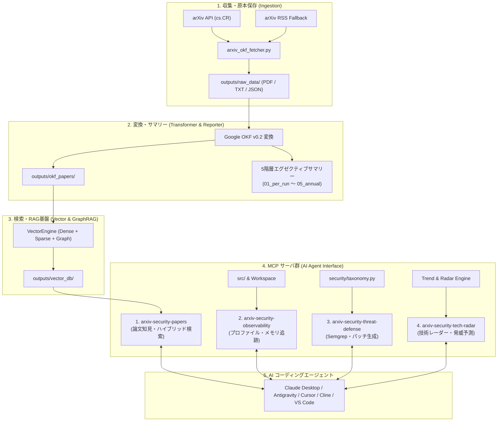

# [USR-01] ユーザーマニュアル ＆ AI コーディングエージェント連携ガイド (User Manual)

---

## 1. システム概要 (System Overview)

`arxiv-security-papers` は、arXiv の最新コンピュータセキュリティ（`cs.CR` 等）論文を自動収集・原本保存（PDF/全文テキスト/JSONメタデータ）し、**Google Open Knowledge Format (OKF) v0.2** 形式に構造化変換した上で、**5 階層エグゼクティブサマリー**の生成、および **Model Context Protocol (MCP)** 経由で AI コーディングエージェントへリアルタイムに学術知見・コード観測性・脅威防御・技術レーダーを提供する統合プラットフォームです。



---

## 2. クイックスタート (Quickstart)

### 2.1 前提環境
- **Python**: 3.12 以上（3.14+ 推奨）
- **OS**: Linux / macOS
- **システムツール**: `git`, `make`（※ PDF テキスト抽出は内製 Pure-Python エンジン `src/pdf_engine/` で動作するため、`poppler-utils` / `pdftotext` のインストールは不要・完全ゼロ依存です）


### 2.2 最速セットアップ手順

リポジトリルートで以下のコマンドを実行します。

```bash
# 1. 仮想環境の構築と依存パッケージのインストール
make setup

# 2. 論文の収集・OKF 変換・サマリー生成を実行
make pipeline

# 3. セマンティックベクトル検索インデックスのビルド
make build_vector_db

# 4. 全 MCP サーバーの動作・プロトコル準拠性を検証
.venv/bin/python tests/test_all_mcp_servers.py
```

---

## 3. 論文収集・パイプライン運用コマンド (Paper Ingestion)

### 3.1 通常の自動収集（最新論文）
arXiv API から最新のセキュリティ論文を取得し、PDF ダウンロード、全文テキスト抽出、OKF 変換、および 5 階層エグゼクティブサマリーを一括更新します。

```bash
make pipeline
# または
make run
```

### 3.2 期間指定・過去バックフィル収集
特定の日付範囲や取得件数を指定して過去論文を取り込みます。

```bash
# 過去30日間の論文を最大50件取得して取り込む
.venv/bin/python src/pipeline/arxiv_okf_fetcher.py --start-date 2026-07-28 --end-date 2026-08-27 --max-results 50

# 既存論文も含めて強制再処理する場合（--force）
.venv/bin/python src/pipeline/arxiv_okf_fetcher.py --force --max-results 20
```

### 3.3 自律知能オーケストレーション実行
収集からインデックス再構築、技術動向分析レポートまでを 1 サイクルで完遂します。

```bash
make orchestrate
```

### 3.4 バックグラウンド自動収集デーモン (Supervisor)
プロセススーパーバイザーを起動し、1 日 4 回（00:00, 06:00, 12:00, 18:00）の自動収集をバックグラウンド常駐で実行します。

```bash
# デーモンモードで起動
make start_supervisor

# 稼働ステータス確認
make status_supervisor

# リアルタイム TUI モニタリング
make top_supervisor

# デーモン停止
make stop_supervisor
```

---

## 4. MCP（Model Context Protocol）エージェント連携ガイド

### 4.1 MCP 設定ファイルの登録 (`mcp_config.json`)

エージェント設定ファイル（Claude Desktop、Antigravity、Cursor、Cline 等）に以下の設定を追加します。

```json
{
  "mcpServers": {
    "arxiv-security-papers": {
      "command": "/workspace/arxiv-security-papers/.venv/bin/python3",
      "args": [
        "src/mcp/papers_server.py"
      ],
      "env": {
        "PYTHONPATH": "src"
      }
    },
    "arxiv-security-observability": {
      "command": "/workspace/arxiv-security-papers/.venv/bin/python3",
      "args": [
        "src/mcp/observability_server.py"
      ],
      "env": {
        "PYTHONPATH": "src"
      }
    },
    "arxiv-security-threat-defense": {
      "command": "/workspace/arxiv-security-papers/.venv/bin/python3",
      "args": [
        "src/mcp/threat_defense_server.py"
      ],
      "env": {
        "PYTHONPATH": "src"
      }
    },
    "arxiv-security-tech-radar": {
      "command": "/workspace/arxiv-security-papers/.venv/bin/python3",
      "args": [
        "src/mcp/tech_radar_server.py"
      ],
      "env": {
        "PYTHONPATH": "src"
      }
    }
  }
}
```

### 4.2 提供される 4 大 MCP サーバーとツール一覧

#### ① `arxiv-security-papers` (学術知見・論文検索)
| ツール名 | 説明 | 主要引数 |
| :--- | :--- | :--- |
| `search_security_papers` | セマンティックベクトル検索 | `query` (検索文), `top_k` (件数) |
| `search_papers_hybrid` | 4 段階 RAG ハイブリッド検索 (Vector+BM25+GraphRAG) | `query`, `top_k`, `category` |
| `get_paper_summary` | 指定 arXiv ID の完全日本語要約と OKF メタデータを取得 | `arxiv_id` (例: `"2504.03936"`) |
| `get_latest_trends` | 最新の月次・四半期・年次動向レポートを取得 | `period` (`"monthly"`, `"quarterly"`) |
| `query_attack_technique` | MITRE ATT&CK テクニック ID に紐づく論文を検索 | `technique_id` (例: `"T1059"`) |
| `query_knowledge_graph` | セキュリティエンティティの GraphRAG 探索 | `entity`, `max_depth` |

#### ② `arxiv-security-observability` (コード観測・最適化)
| ツール名 | 説明 | 主要引数 |
| :--- | :--- | :--- |
| `profile_code_performance` | cProfile による実行ボトルネック特定 | `code` (対象コード), `top_n`, `sort_by` |
| `track_memory_allocations` | tracemalloc による行単位のメモリ消費追跡 | `code`, `top_lines` |
| `benchmark_alternatives` | 複数実装候補の timeit ベンチマーク比較 | `candidates`, `number`, `repeat` |
| `inspect_bytecode` | Python dis によるバイトコード逆アセンブル解析 | `code` |
| `get_system_metrics` | 検索エンジン・キャッシュの稼働メトリクス取得 | なし |

#### ③ `arxiv-security-threat-defense` (脅威防御・パッチ生成)
| ツール名 | 説明 | 主要引数 |
| :--- | :--- | :--- |
| `generate_semgrep_rule` | CWE/脆弱性パターンから Semgrep CI ルール YAML を合成 | `cwe_id` (例: `"CWE-502"`), `rule_id` |
| `synthesize_secure_patch` | 脆弱なコード片に対する学術知見準拠のセキュア修正パッチ生成 | `code`, `cwe_id` |
| `check_threat_coverage` | MITRE ATT&CK / NIST SP 800 に対する防御カバレッジ評価 | `declared_defenses` (リスト) |

#### ④ `arxiv-security-tech-radar` (技術レーダー・動向予測)
| ツール名 | 説明 | 主要引数 |
| :--- | :--- | :--- |
| `get_technology_radar` | Adopt / Trial / Assess / Hold の技術レーダーを出力 | `ring`, `category` |
| `predict_emerging_threats` | 論文研究速度に基づく新興サイバー脅威・攻撃ベクトル予測 | `min_severity` (`"HIGH"`, `"CRITICAL"`) |

---

## 5. Web ポータル UI ＆ ダッシュボード

ローカル Web ブラウザで論文閲覧、全文検索、GraphRAG ナレッジグラフを可視化します。

```bash
# Web サーバーの起動 (http://localhost:8000)
make run_web

# またはグラフダッシュボード直接起動 (http://localhost:8000/dashboard)
make run_dashboard
```

- **Web UI URL**: `http://localhost:8000`
- **Dashboard URL**: `http://localhost:8000/dashboard`

---

## 6. 品質ゲートとテスト検証 (Quality Verification)

本リポジトリは全コードが厳格な品質ゲートを満たすよう設計されています。

```bash
# 1. コード整形・リント・型検査 (mypy strict 0エラー, xenon Grade A/B)
make check

# 2. 全 MCP サーバーの仕様準拠性・返却文字数上限テスト
.venv/bin/python tests/test_all_mcp_servers.py

# 3. ユニットテスト全件実行 (pytest)
make test
```

---

## 7. トラブルシューティング

| 症状 / エラー | 原因 | 対処法 |
| :--- | :--- | :--- |
| `Index not found` | ベクトルインデックスが未構築 | `make build_vector_db` を実行してインデックスを再作成してください。 |
| `HTTP 429 Too Many Requests` | arXiv API のレートリミット到達 | 自動的に RSS フォールバックまたはリトライが作動します。間隔を空けて再実行してください。 |
| `MCP connection refused` | Python パスまたは PYTHONPATH の誤り | `mcp_config.json` で仮想環境の絶対パス（`.../.venv/bin/python3`）を指定してください。 |
| `PDF text extraction empty` | 特殊暗号化または破損した PDF | 内製 Pure-Python エンジンで抽出できない極稀な特殊フォーマットの場合のみ、システムに `pdftotext`（`poppler-utils`）が存在すれば自動フォールバックします。 |

