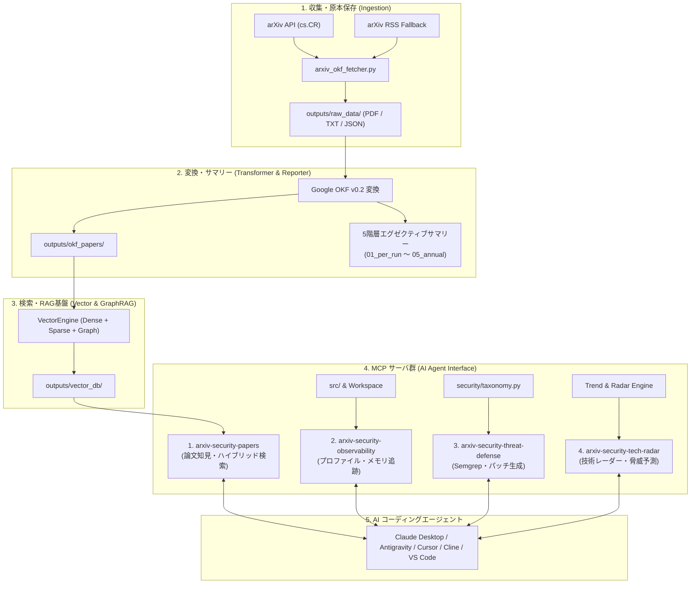

# [USR-01] ユーザーマニュアル ＆ AI コーディングエージェント連携ガイド (User Manual)

---

## 1. システム概要 (System Overview)

`arxiv-security-papers` は、arXiv の最新コンピュータセキュリティ（`cs.CR` 等）論文を自動収集・原本保存（PDF/全文テキスト/JSONメタデータ）し、**Google Open Knowledge Format (OKF) v0.2** 形式に構造化変換した上で、**5 階層エグゼクティブサマリー**の生成、および **Model Context Protocol (MCP)** 経由で AI コーディングエージェントへリアルタイムに学術知見・コード観測性・脅威防御・技術レーダーを提供する統合プラットフォームです。



---

## 2. クイックスタート (Quickstart)

### 2.1 前提環境
- **Python**: 3.14 以上（Python 3.14.7 標準）
- **メモリ**: 2GB 以上の空き RAM（大規模ベクトル検索・SlottedPage DB キャッシュ利用時）
- **ディスク**: 1GB 以上の空きストレージ（PDF 原本および OKF マークダウン蓄積用）
- **システムツール**: `git`, `make`（※ PDF テキスト抽出は内製 Pure-Python エンジン `src/pdf_engine/` で動作するため、`poppler-utils` / `pdftotext` のインストールは不要・完全ゼロ依存です）


### 2.2 最速セットアップ手順

リポジトリルートで以下のコマンドを実行します。

```bash
# 1. 仮想環境の構築と依存パッケージのインストール
make setup

# 2. 論文の収集・OKF 変換・サマリー生成を実行
make pipeline

# 3. セマンティックベクトル検索インデックスのビルド
make build_vector_db

# 4. 全 MCP サーバーの動作・プロトコル準拠性を検証
.venv/bin/python tests/test_all_mcp_servers.py
```

---

## 3. 論文収集・パイプライン運用コマンド (Paper Ingestion)

### 3.1 通常の自動収集（最新論文）
arXiv API から最新のセキュリティ論文を取得し、PDF ダウンロード、全文テキスト抽出、OKF 変換、および 5 階層エグゼクティブサマリーを一括更新します。

```bash
make pipeline
# または
make run
```

### 3.2 期間指定・過去バックフィル収集
特定の日付範囲や取得件数を指定して過去論文を取り込みます。

```bash
# 過去30日間の論文を最大50件取得して取り込む
.venv/bin/python src/pipeline/arxiv_okf_fetcher.py --start-date 2026-07-28 --end-date 2026-08-27 --max-results 50

# 既存論文も含めて強制再処理する場合（--force）
.venv/bin/python src/pipeline/arxiv_okf_fetcher.py --force --max-results 20
```

### 3.3 自律型閉ループ・インテリジェンス統合システム運用コマンド (Closed-Loop Intelligence & Universal Workflow)

`src/intelligence/` および `src/workflow/` に基づく 6 大フェーズ（PIR計画、自律ハーベスト、Admiralty信憑性評価/OKF構造化、ベイズ仮説検証/5層サマリー合成、配布、フィードバック学習）のライフサイクルを CLI または Python API から実行・制御します。

#### ① 6 フェーズ閉ループ・インテリジェンスサイクルの実行 (`cycle`)
```bash
# 通常の 1 サイクル自律実行（詳細ログ表示付き）
PYTHONPATH=src .venv/bin/python3 src/__main__.py cycle --verbose

# 特定トピックにフォーカスした収集・サマリー合成
PYTHONPATH=src .venv/bin/python3 src/__main__.py cycle --topics "耐量子暗号,MCPセキュリティ" --quota 10

# リアクティブ・ストリーミング DAG & バックプレッシャー制御による実行
PYTHONPATH=src .venv/bin/python3 src/__main__.py cycle --streaming --chunk-size 5
```

#### ② 3-Horizon PIR（優先インテリジェンス要件）の管理 (`pir`)
```bash
# 登録済み PIR 一覧 & 正規化トピック重み分布の表示
PYTHONPATH=src .venv/bin/python3 src/__main__.py pir list

# 新規 PIR（戦術・運用・戦略）の登録
PYTHONPATH=src .venv/bin/python3 src/__main__.py pir add \
  --id "pir_mcp_vuln" \
  --title "MCP Tool Vulnerabilities" \
  --description "Monitor privilege escalation in Model Context Protocol tools" \
  --topics "MCPセキュリティ,権限昇格" \
  --priority 0.95 \
  --horizon tactical

# 緊急事態発生時の PIR 動的エスカレーション（即時昇格）
PYTHONPATH=src .venv/bin/python3 src/__main__.py pir escalate \
  --id "pir_mcp_vuln" \
  --reason "Active 0-day in wild" \
  --horizon tactical
```

#### ③ 自律型自己修復ハーベストルーター & サーキットブレーカー (`harvest`)
```bash
# 各収集ルートの回線状態（CLOSED / OPEN / HALF_OPEN）と健全度スコアの確認
PYTHONPATH=src .venv/bin/python3 src/__main__.py harvest status

# 指定トピックでの通信疎通・動的ルート変異テスト
PYTHONPATH=src .venv/bin/python3 src/__main__.py harvest test --topic "耐量子暗号" --quota 3
```

#### ④ NATO STANAG 2022 Admiralty 信憑性評価 (`credibility`)
```bash
# Admiralty 信憑性評価マトリクス (A1〜F6) の Markdown 表示
PYTHONPATH=src .venv/bin/python3 src/__main__.py credibility matrix

# 情報源の信頼度（A〜F）と確憑性（1〜6）による個別スコアリング
PYTHONPATH=src .venv/bin/python3 src/__main__.py credibility score --source arxiv --credibility 2
```

#### ⑤ 自律検証セキュリティ仮説の管理 (`hypothesis`)
```bash
# 追跡中のセキュリティ仮説一覧・ベイズ確信度スコアの確認
PYTHONPATH=src .venv/bin/python3 src/__main__.py hypothesis list

# 新規仮説の登録
PYTHONPATH=src .venv/bin/python3 src/__main__.py hypothesis add \
  --id "hypo_pqc_sidechannel" \
  --statement "Kyber/ML-KEM 実装においてキャッシュサイドチャネル攻撃の脆弱性が存在する" \
  --topics "耐量子暗号,サイドチャネル攻撃"
```

#### ⑥ Event Sourcing WAL クラッシュリカバリ (`recover`)
```bash
# 実行済み・中断中サイクルの WAL 履歴一覧を表示
PYTHONPATH=src .venv/bin/python3 src/__main__.py recover --list

# 中断された特定のサイクルを最新チェックポイントから自律再開
PYTHONPATH=src .venv/bin/python3 src/__main__.py recover --cycle-id <cycle_id>
```

#### ⑦ Python API によるプログラム直接呼び出し

##### A. 閉ループ・インテリジェンスエンジン (`src/intelligence/`)
```python
import sys
sys.path.insert(0, "src")

from intelligence.engine import ClosedLoopIntelligenceEngine
from intelligence.pir.models import PIRHorizon

engine = ClosedLoopIntelligenceEngine(workspace_dir=".")

# PIR の登録
engine.register_pir(
    req_id="pir_pqc_migration",
    title="Post-Quantum Cryptography Migration",
    description="NIST PQC 標準化と移行リスクの追跡",
    target_topics=["耐量子暗号", "暗号・プライバシー技術"],
    priority_score=0.9,
    horizon=PIRHorizon.STRATEGIC,
)

# 1 サイクルの実行 (Saga + WAL + Feedback 自動駆動)
context = engine.run_cycle()
print(f"Cycle ID: {context.cycle_id}")
print(f"Phase Statuses: {context.phase_statuses}")
print(f"Synthesized Products: {len(context.products)}")
```

##### B. 汎用ワークフロー基盤 (`src/workflow/`)
```python
import sys
sys.path.insert(0, "src")

from workflow.circuit import CircuitBreaker
from workflow.dag import DAGWorkflowEngine
from workflow.saga import SagaCoordinator
from workflow.streaming_dag import BufferPolicy, StreamChunk, StreamingDAG

# Topological DAG の実行
dag = DAGWorkflowEngine()
dag.add_node("step_a", lambda s: {"val_a": 10})
dag.add_node("step_b", lambda s: {"val_b": s["val_a"] * 2}, dependencies=["step_a"])
result = dag.execute()
print("DAG Result:", result)  # {'val_a': 10, 'val_b': 20}

# サーキットブレーカーの状態管理
cb = CircuitBreaker(failure_threshold=2, cooldown_seconds=10.0)
cb.record_failure()
cb.record_failure()
print("Circuit State:", cb.state)  # CircuitState.OPEN
```

### 3.4 バックグラウンド自動収集デーモン (Supervisor)
プロセススーパーバイザーを起動し、1 日 4 回（00:00, 06:00, 12:00, 18:00）の自動収集をバックグラウンド常駐で実行します。

```bash
# デーモンモードで起動
make start_supervisor

# 稼働ステータス確認
make status_supervisor

# リアルタイム TUI モニタリング
make top_supervisor

# デーモン停止
make stop_supervisor
```

---

## 4. MCP（Model Context Protocol）エージェント連携ガイド

### 4.1 MCP 設定ファイルの登録 (`mcp_config.json`)

エージェント設定ファイル（Claude Desktop、Antigravity、Cursor、Cline 等）に以下の設定を追加します。

```json
{
  "mcpServers": {
    "arxiv-security-papers": {
      "command": "/workspace/arxiv-security-papers/.venv/bin/python3",
      "args": [
        "src/mcp/papers_server.py"
      ],
      "env": {
        "PYTHONPATH": "src"
      }
    },
    "arxiv-security-observability": {
      "command": "/workspace/arxiv-security-papers/.venv/bin/python3",
      "args": [
        "src/mcp/observability_server.py"
      ],
      "env": {
        "PYTHONPATH": "src"
      }
    },
    "arxiv-security-threat-defense": {
      "command": "/workspace/arxiv-security-papers/.venv/bin/python3",
      "args": [
        "src/mcp/threat_defense_server.py"
      ],
      "env": {
        "PYTHONPATH": "src"
      }
    },
    "arxiv-security-tech-radar": {
      "command": "/workspace/arxiv-security-papers/.venv/bin/python3",
      "args": [
        "src/mcp/tech_radar_server.py"
      ],
      "env": {
        "PYTHONPATH": "src"
      }
    }
  }
}
```

### 4.2 提供される 4 大 MCP サーバーとツール一覧

#### ① `arxiv-security-papers` (学術知見・論文検索)
| ツール名 | 説明 | 主要引数 |
| :--- | :--- | :--- |
| `search_security_papers` | セマンティックベクトル検索 | `query` (検索文), `top_k` (件数) |
| `search_papers_hybrid` | 4 段階 RAG ハイブリッド検索 (Vector+BM25+GraphRAG) | `query`, `top_k`, `category` |
| `get_paper_summary` | 指定 arXiv ID の完全日本語要約と OKF メタデータを取得 | `arxiv_id` (例: `"2504.03936"`) |
| `get_latest_trends` | 最新の月次・四半期・年次動向レポートを取得 | `period` (`"monthly"`, `"quarterly"`) |
| `query_attack_technique` | MITRE ATT&CK テクニック ID に紐づく論文を検索 | `technique_id` (例: `"T1059"`) |
| `query_knowledge_graph` | セキュリティエンティティの GraphRAG 探索 | `entity`, `max_depth` |

#### ② `arxiv-security-observability` (コード観測・最適化)
| ツール名 | 説明 | 主要引数 |
| :--- | :--- | :--- |
| `profile_code_performance` | cProfile による実行ボトルネック特定 | `code` (対象コード), `top_n`, `sort_by` |
| `track_memory_allocations` | tracemalloc による行単位のメモリ消費追跡 | `code`, `top_lines` |
| `benchmark_alternatives` | 複数実装候補の timeit ベンチマーク比較 | `candidates`, `number`, `repeat` |
| `inspect_bytecode` | Python dis によるバイトコード逆アセンブル解析 | `code` |
| `get_system_metrics` | 検索エンジン・キャッシュの稼働メトリクス取得 | なし |

#### ③ `arxiv-security-threat-defense` (脅威防御・パッチ生成)
| ツール名 | 説明 | 主要引数 |
| :--- | :--- | :--- |
| `generate_semgrep_rule` | CWE/脆弱性パターンから Semgrep CI ルール YAML を合成 | `cwe_id` (例: `"CWE-502"`), `rule_id` |
| `synthesize_secure_patch` | 脆弱なコード片に対する学術知見準拠のセキュア修正パッチ生成 | `code`, `cwe_id` |
| `check_threat_coverage` | MITRE ATT&CK / NIST SP 800 に対する防御カバレッジ評価 | `declared_defenses` (リスト) |

#### ④ `arxiv-security-tech-radar` (技術レーダー・動向予測)
| ツール名 | 説明 | 主要引数 |
| :--- | :--- | :--- |
| `get_technology_radar` | Adopt / Trial / Assess / Hold の技術レーダーを出力 | `ring`, `category` |
| `predict_emerging_threats` | 論文研究速度に基づく新興サイバー脅威・攻撃ベクトル予測 | `min_severity` (`"HIGH"`, `"CRITICAL"`) |

---

## 5. Web ポータル UI ＆ ダッシュボード

ローカル Web ブラウザで論文閲覧、全文検索、GraphRAG ナレッジグラフを可視化します。

```bash
# Web サーバーの起動 (http://localhost:8000)
make run_web

# またはグラフダッシュボード直接起動 (http://localhost:8000/dashboard)
make run_dashboard
```

- **Web UI URL**: `http://localhost:8000`
- **Dashboard URL**: `http://localhost:8000/dashboard`

---

## 6. 品質ゲートとテスト検証 (Quality Verification)

本リポジトリは全コードが厳格な品質ゲートを満たすよう設計されています。

```bash
# 1. コード整形・リント・型検査 (mypy strict 0エラー, xenon Grade A/B)
make check

# 2. 全 MCP サーバーの仕様準拠性・返却文字数上限テスト
.venv/bin/python tests/test_all_mcp_servers.py

# 3. ユニットテスト全件実行 (pytest)
make test
```

---

## 7. トラブルシューティング

| 症状 / エラー | 原因 | 対処法 |
| :--- | :--- | :--- |
| `Index not found` | ベクトルインデックスが未構築 | `make build_vector_db` を実行してインデックスを再作成してください。 |
| `HTTP 429 Too Many Requests` | arXiv API のレートリミット到達 | 自動的に RSS フォールバックまたはリトライが作動します。間隔を空けて再実行してください。 |
| `MCP connection refused` | Python パスまたは PYTHONPATH の誤り | `mcp_config.json` で仮想環境の絶対パス（`.../.venv/bin/python3`）を指定してください。 |
| `PDF text extraction empty` | 特殊暗号化または破損した PDF | 内製 Pure-Python エンジンで抽出できない極稀な特殊フォーマットの場合のみ、システムに `pdftotext`（`poppler-utils`）が存在すれば自動フォールバックします。 |

