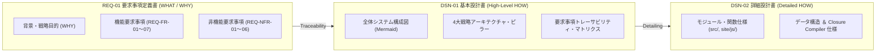

# [MNG-01] 文書管理・ドキュメント台帳 (Document Management & Ledger) — arxiv-security-papers

本ドキュメントは、「`arxiv-security-papers`」プロジェクトにおいて作成・維持されるすべてのドキュメントの台帳であり、ドキュメントごとの目的、担当領域、および **REQ-01, DSN-01, DSN-02 の役割・すみ分け方針** を明示的に定義します。

---

## 1. 文書管理方針 (Document Management Policy)

本プロジェクトにおける文書管理の基本理念は、全 13 専門エージェントガバナンスに基づく「**ドキュメント・スキル・コードの三位一体（連携）モデル**」に基づいています。

ドキュメント（Single Source of Truth / SOT）は、プロジェクトにおける唯一の「正」であり、コードと同等以上の価値を持つ重要成果物です。暗黙知や場当たり的な開発を徹底排除し、機能追加・仕様変更・モデル更新時には、必ず要求事項定義書（`REQ-01`）、基本設計書（`DSN-01`）、詳細設計書（`DSN-02`）、および Issue 台帳（`issues/README.md`）を先行して更新し、設計変更履歴を常に追跡可能（トレーサブル）な状態に維持することで、ドキュメントの腐敗（死文化）を恒久的に防止します。

### 1.1 文書管理番号の設計方針と管理策 (Numbering Policy & Controls)

変更影響を最小化し、トレーサビリティを担保するため、以下の分類プレフィックス＋2桁連番の管理体系を導入します。

- **`MNG` (Management)**: プロセス定義、文書管理台帳等のプロジェクト運用管理文書。
- **`REQ` (Requirements)**: システム要求事項定義書、機能要求・非機能要求等の要求文書。
- **`DSN` (Design)**: アーキテクチャ基本設計書 (HLD)、コンポーネント詳細設計書 (LLD) 等の技術設計文書。
- **`MCP` (Model Context Protocol)**: AI エージェント連携用 MCP サーバおよびベクトル DB 仕様文書。
- **`ISS` (Issues)**: 開発タスク・障害追跡用の Issue 台帳および個別 Issue アーカイブ。

#### 文書管理策 (Document Controls)
1. **事前登録管理**: 新規ドキュメントの作成・改廃時は、本台帳（`MNG-01`）へ登録し一意の管理番号を採番します。
2. **完全相対パス管理**: 環境独立性を担保するため、ドキュメント間リンクには厳格に相対パスのみを使用します。
3. **品質ゲート連携**: `make py_compile` および `verify-quality-gates` スキルにより、ドキュメント内相対パスの有効性と整合性を自動検証します。

---

## 2. ドキュメント台帳 (Document Ledger)

| 管理番号 / ドキュメント名 | 相対ファイルパス | 目的・概要 | 役割規定 (WHAT / WHY / HOW) | 主な参照者 | 承認者 | 更新タイミング |
| :--- | :--- | :--- | :--- | :--- | :--- | :--- |
| **[MNG-01] 文書管理台帳** | [processes/MNG-01-document_ledger.md](MNG-01-document_ledger.md) | 全ドキュメントの一覧管理、命名・採番規則、REQ/DSN 分掌方針を定義する中央台帳。 | 管理基準 (Governance) | PM, SA, 全エージェント | PM | ドキュメント追加・分掌変更時 |
| **[MNG-02] ATT&CK/CWE対応台帳** | [processes/MNG-02-mitre_attack_cwe_ledger.md](MNG-02-mitre_attack_cwe_ledger.md) | 論文から抽出・マッピングする MITRE ATT&CK / ATLAS 攻撃手法、CWE 脆弱性クラス、および因果関係クロス照合マトリクス (Issue #135 準拠)。 | **オントロジー台帳 (Ontology Ledger)** | SEC, IR, AI, 全エージェント | SEC | オントロジー拡張・Issue 135実装時 |
| **[MNG-03] オントロジー駆動開発プロセス規範** | [processes/MNG-03-ontology_driven_development_process.md](MNG-03-ontology_driven_development_process.md) | 概念モデリングから TBox 定義、ABox 抽出、推論展開、下流同期までの 5 段階 ODD ライフサイクルおよび 13 エージェント責任分界点を定義。 | **開発プロセス規範 (Process Spec)** | 全 13 エージェント | PM, SA | オントロジー運用・開発プロセス改訂時 |
| **[REQ-01] 要求事項定義書** | [requirements/REQ-01-system_requirements.md](../requirements/REQ-01-system_requirements.md) | システムの背景・事業目的 (WHY) および達成すべき機能・非機能要求事項 (WHAT) を定義。 | **WHAT / WHY** | ST, SA, PM, QA, AU | ST | 背景・事業目標・要求変更時 |
| **[REQ-ONT-01] オントロジー駆動知識アーキテクチャ** | [requirements/REQ-ONT-01_ontology_driven_knowledge_architecture.md](../requirements/REQ-ONT-01_ontology_driven_knowledge_architecture.md) | オントロジー第一原則、意味論的相互運用性、因果推論要求、および W3C Turtle 形式要件を規定する最上位要求仕様書。 | **Ontology Architecture WHAT / WHY** | SA, SEC, DB, 全エージェント | PM, SA | オントロジー要件・連携仕様改訂時 |
| **[REQ-02] 主要機能一覧** | [requirements/REQ-02-feature_list.md](../requirements/REQ-02-feature_list.md) | 主要機能 (F-01〜F-08) の全マスター一覧、設計ページリンク、およびモジュール関係性マップ。 | **Feature Master** | PM, SA, 全エージェント | PM | 機能追加・更新時 |
| **[REQ-03] ユースケース台帳** | [requirements/REQ-03-use_case_ledger.md](../requirements/REQ-03-use_case_ledger.md) | 6大ペルソナ（経営/研究/PSIRT/AI/Dev/LLM）および国家サイバー統括室人材フレームワーク13役割に対応する全33ユースケース・業務価値創出フローを定義。 | **Use Case Ledger** | ST, PM, 全エージェント | ST | 業務シナリオ・新機能追加時 |
| **[DSN-01] 基本設計書 (HLD)** | [designs/DSN-01-high_level_design.md](../designs/DSN-01-high_level_design.md) | システム全体の論理アーキテクチャ、4大ピラー、要求追跡マトリクス (HLD HOW) を定義。 | **High-Level HOW** | SA, ST, PM, 開発 | SA | アーキテクチャ・構造変更時 |
| **[DSN-02] 詳細設計書 (LLD)** | [designs/DSN-02-low_level_design.md](../designs/DSN-02-low_level_design.md) | Python/JS モジュール仕様、関数シグネチャ、データ構造、ツール設定 (Detailed HOW) を定義。 | **Detailed HOW** | SA, 開発, SQA | SA | モジュール・コード仕様変更時 |
| **[DSN-03] 収集・OKF変換設計** | [designs/DSN-03-paper_collector_and_okf_converter.md](../designs/DSN-03-paper_collector_and_okf_converter.md) | F-01 (arXiv収集/PDF抽出/原本保存) および F-02 (Google OKF v0.2 変換) の個別機能設計。 | **Feature HOW** | SA, 開発 | SA | 収集/変換アルゴリズム変更時 |
| **[DSN-04] サマリー生成設計** | [designs/DSN-04-five_tier_executive_summaries.md](../designs/DSN-04-five_tier_executive_summaries.md) | F-03 (01_per_run〜05_annual 5階層サマリー/完全日本語化/表形式/Mermaid) の個別機能設計。 | **Feature HOW** | SA, 開発, UI/UX | SA | サマリー構造改訂時 |
| **[DSN-05] 5手法検索エンジン設計**| [designs/DSN-05-multi_engine_hybrid_search.md](../designs/DSN-05-multi_engine_hybrid_search.md) | F-04 (Vector, BM25, Inverted, FM-Index, Recency 5手法フュージョン検索) の個別機能設計。 | **Feature HOW** | SA, IR, 開発 | SA, IR | 検索アルゴリズム変更時 |
| **[DSN-06] MCP サーバ設計** | [designs/DSN-06-mcp_server_and_ai_integration.md](../designs/DSN-06-mcp_server_and_ai_integration.md) | F-05 (MCP JSON-RPC 2.0 4大ツール/パス境界セキュリティガード) の個別機能設計。 | **Feature HOW** | SA, AI, SC | SA | MCP ツール拡張時 |
| **[DSN-07] Web/Compiler設計** | [designs/DSN-07-web_portal_and_markdown_compiler.md](../designs/DSN-07-web_portal_and_markdown_compiler.md) | F-06 (Web UI), F-07 (Markdown Compiler Engine), F-08 (Closure Compiler) の個別機能設計。 | **Feature HOW** | SA, UI/UX, 開発 | SA | Web画面・コンパイラ変更時 |
| **[DSN-08] Lucene/Solr検索設計** | [designs/DSN-08-lucene-solr-modular-architecture.md](../designs/DSN-08-lucene-solr-modular-architecture.md) | 分離型トークナイザ/CharFilter、DocValues、PostingsList、ManagedSchema の詳細設計。 | **Feature HOW** | SA, IR, 開発 | SA, IR | 検索コアモジュール変更時 |
| **[DSN-09] 可観測性・プロファイル設計** | [designs/DSN-09-observability-and-performance-profiling.md](../designs/DSN-09-observability-and-performance-profiling.md) | リアルタイムクエリプロファイラ、メモリフットプリント追跡、メトリクスエクスポータ設計。 | **Feature HOW** | SA, SQA, SM | SA, SQA | プロファイラ改訂時 |
| **[DSN-10] 検索エンジン評価設計** | [designs/DSN-10-search-engine-evaluation-framework.md](../designs/DSN-10-search-engine-evaluation-framework.md) | NDCG@K, MRR@K, MAP, Precision/Recall 自動ベンチマークスイート設計。 | **Feature HOW** | SA, IR, SQA | SA, SQA | 評価フレームワーク改訂時 |
| **[DSN-11] リポジトリ脅威防御設計** | [designs/DSN-11-repository-security-and-threat-defense.md](../designs/DSN-11-repository-security-and-threat-defense.md) | AST セキュリティサンドボックス、RBAC エンジン、パス走査検証防御設計。 | **Feature HOW** | SA, SC, AU | SA, SC | セキュリティガード改訂時 |
| **[DSN-12] MCP エコシステム拡張設計** | [designs/DSN-12-mcp-strategic-ecosystem-expansion.md](../designs/DSN-12-mcp-strategic-ecosystem-expansion.md) | 観測性・Tech Radar・脅威防御 MCP サーバー群およびセキュリティ堅牢化設計。 | **Feature HOW** | SA, AI, SC | SA, SC | MCP サーバ群拡張時 |
| **[DSN-13] SQLite Vector 互換設計** | [designs/DSN-13-sqlite-vector-architecture.md](../designs/DSN-13-sqlite-vector-architecture.md) | PEP 249 DB-API 2.0、VFS、Pager、4KB Paged B+Tree、VDBE バイトコードエンジン設計。 | **Feature HOW** | SA, DB, 開発 | SA, DB | SQLite 互換レイヤ改訂時 |
| **[DSN-14] 次世代DB包括アーキテクチャ設計** | [designs/DSN-14-database_engine_architecture.md](../designs/DSN-14-database_engine_architecture.md) | Slotted Page、ディスク永続 WAL & ARIES リカバリ、MVCC / SS2PL、CoW / LMDB ゼロコピー、LSM-Tree & Bloom フィルタ、分散協調・合意（Raft/Paxos/PBFT）、厳格クォーラム & CRDT、2PC & Saga パターン。 | **High-Level HOW / Architecture** | SA, DB, 全エージェント | SA, DB | DB エンジン仕様・ロードマップ改訂時 |
| **[DSN-16] 次世代プラットフォーム提言書** | [designs/DSN-16-nextgen_security_knowledge_platform_proposal.md](../designs/DSN-16-nextgen_security_knowledge_platform_proposal.md) | 多段階 LLM 要約、MITRE ATT&CK / TTPs マッピング、Caldera プレイブック生成、MCP / マルチチャネル配信、プロンプトインジェクション防護、CI/CD ゼロトラスト分離。 | **Proposal / Architecture** | 全 13 エージェント | PM, SA | 次世代機能拡張・ロードマップ改訂時 |
| **[DSN-17] セキュリティ知識オントロジー設計** | [designs/DSN-17-security_knowledge_ontology.md](../designs/DSN-17-security_knowledge_ontology.md) | 7大コアエンティティ、12大関係述語、国際標準タクソノミー正規化、OKF v0.2 事実トリプル抽出設計。 | **Feature HOW** | SEC, IR, SA | SA, SEC | オントロジー仕様拡張時 |
| **[DSN-18] プロパティグラフDB設計** | [designs/DSN-18-property_graph_database_engine.md](../designs/DSN-18-property_graph_database_engine.md) | 純Python隣接リストグラフストレージ、ノード/エッジインデックス、Cypherライク探索エンジン設計。 | **Feature HOW** | SA, DB, 開発 | SA, DB | グラフエンジン改訂時 |
| **[DSN-19] NLPキーワード・要約合成設計** | [designs/DSN-19-nlp_keyphrase_extraction_and_structured_synthesis.md](../designs/DSN-19-nlp_keyphrase_extraction_and_structured_synthesis.md) | Pure-Python TF-IDF/TextRank キーフレーズ抽出、3点構造化要約生成エンジン設計。 | **Feature HOW** | IR, NLP, 開発 | SA, IR | 要約アルゴリズム改訂時 |
| **[DSN-20] 外部セキュリティ知識インジェスト・カタログ設計** | [designs/DSN-20-external_security_knowledge_ingestion_and_catalog_architecture.md](../designs/DSN-20-external_security_knowledge_ingestion_and_catalog_architecture.md) | Zero External Dependencies プラグイン型ストリーミング同期、統一SQLite WAL + FTS5 カタログ、ATT&CK/CWE/CVEマルチデータセット対応、PropertyGraph & MCP 統合設計。 | **Feature HOW / Architecture** | SEC, SA, DB, NET | SA, SEC | 外部知識インジェスト・カタログ改訂時 |
| **[DSN-21] エンタープライズデザインシステム & 統合コンソール設計** | [designs/DSN-21-enterprise_design_system_and_unified_console.md](../designs/DSN-21-enterprise_design_system_and_unified_console.md) | エンタープライズSaaS型 Glassmorphic UI、レスポンシブ3画面統合コンソール、およびカラー/タイポグラフィ設計仕様。 | **UI/UX HOW** | UI/UX, SA, 前線エンジニア | SA, UI/UX | コンソール画面・UIトークン改訂時 |
| **[DSN-22] セキュリティおよび脅威知識オントロジー W3C 仕様書** | [designs/DSN-22-security_and_threat_ontology_w3c_specification.md](../designs/DSN-22-security_and_threat_ontology_w3c_specification.md) | W3C RDF 1.1 Turtle / OWL 2 仕様準拠の純粋 Python オントロジービルダー、TBox/ABox シリアライザ、および因果推論マッピング設計。 | **Ontology Engine HOW** | SA, SEC, DB, 全エージェント | SA, SEC | オントロジーエンジン仕様改訂時 |
| **[MCP-01] MCP & Vector DB 仕様書** | [mcp/MCP-01-mcp_server_specification.md](../mcp/MCP-01-mcp_server_specification.md) | MCP JSON-RPC サーバ 4大ツールおよびセマンティック Vector DB インデックス仕様。 | 特化仕様 (Specialized HOW) | AI Agent, IR, SC | SA, IR | MCP ツール拡張・アルゴリズム改訂時 |
| **[USR-01] ユーザーマニュアル** | [manuals/USR-01-user_manual.md](../manuals/USR-01-user_manual.md) | クイックスタート、論文収集・パイプライン運用、4大MCPサーバー連携、トラブルシューティングガイド。 | **User & Agent Guide** | ユーザー, AI Agent, 開発 | PM, SA | パイプライン・MCP仕様変更時 |
| **[ISS-00] Issue 台帳** | [issues/README.md](../issues/README.md) | プロジェクトの全 Issue (起票・進行中・完了) を一括追跡・管理する中央台帳。 | 作業管理 (Issues) | PM, 開発チーム | PM | Issue 新規作成・ステータス変更時 |

---

## 3. REQ-01, DSN-01, DSN-02 の明確な役割と分掌定義 (Document Demarcation Rules)

### 3.1 `REQ-01` (システム要求事項定義書 - WHAT / WHY)
- **定義領域**: **「なぜ作るのか（WHY）」** および **「システムが何を達成すべきか（WHAT）」**。
- **記載対象**: 事業背景、戦略目標、機能要求事項 (`REQ-FR-01`〜`07`)、非機能要求事項 (`REQ-NFR-01`〜`06`)。
- **排除対象**: 具体的なコード実装方式、特定のクラス名・関数名、ライブラリ内部構成、ビルドツールコマンド（これらはすべて設計ドキュメントへ移管）。

### 3.2 `DSN-01` (基本設計書 HLD - High-Level HOW)
- **定義領域**: **「要求を達成するために、システム全体をどのように構造化するか（High-Level HOW）」**。
- **記載対象**: 論理システム構成図 (Mermaid)、4 大戦略アーキテクチャ・ピラー、全体物理レイアウト方針、要求事項 (`REQ-01`) から基本設計 (`DSN-01`) への **要求事項トレーサビリティ・マトリクス (RTM)**。
- **境界規則**: モジュール内部の個別関数仕様や具体的なソースコード記述は含めない。

### 3.3 `DSN-02` (詳細設計書 LLD - Detailed HOW)
- **定義領域**: **「基本設計で定義された各コンポーネントを、コードレベルでどのように具象実装するか（Detailed HOW）」**。
- **記載対象**: 各 Python / JS モジュール (`src/`, `site/js/`) の関数シグネチャ・引数型・戻り値、JSON データ構造スキーマ、Google Closure Compiler ビルド仕様。

### 3.4 階層決定とトレーサビリティルール (Traceability & Decision Cascade)
1. **競合時の優先位階**: 不一致が生じた場合、**`REQ-01`（上位要求） > `DSN-01`（基本設計） > `DSN-02`（詳細設計） > コード** の順で優先評価します。
2. **要求追跡義務**: すべての機能要求 (`REQ-FR`) および非機能要求 (`REQ-NFR`) は、`DSN-01` のトレーサビリティ・マトリクスを通じて `DSN-02` の具象モジュールおよび単体テストへ 100% 追跡可能（Traceable）でなければなりません。
