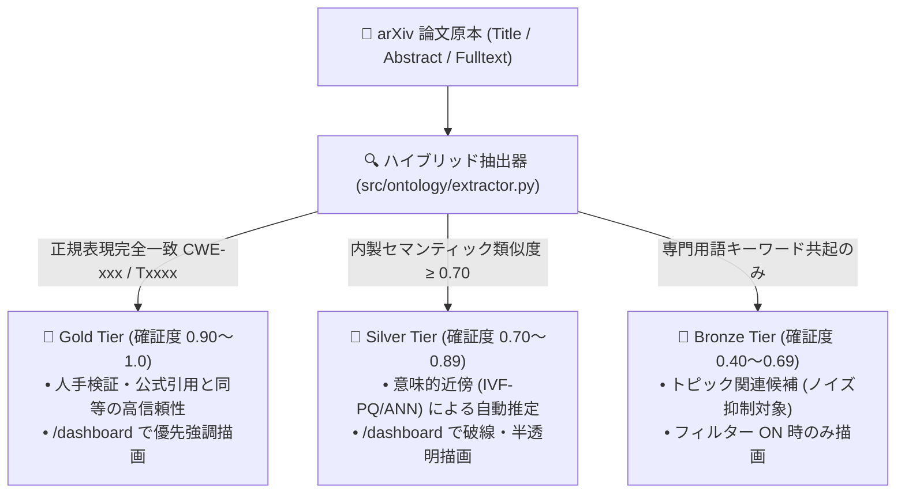

# [MNG-02] MITRE ATT&CK & CWE 統合ナレッジグラフ対応台帳 (MITRE ATT&CK & CWE Knowledge Graph Ledger)
## 〜 arXiv セキュリティ論文（cs.CR）向け オントロジー・マッピング台帳 (Issue #135 準拠) 〜

- **文書番号**: `MNG-02`
- **文書ステータス**: `APPROVED`
- **対象サブシステム**: `src/ontology/` / `src/graph/` / `site/dashboard.html` / `outputs/database/graph.db` (ナレッジグラフオントロジー, ATT&CK/CWEマッピング, /dashboard 2D Canvas 可視化)
- **作成日**: 2026-09-03
- **最終更新日**: 2026-09-03
- **【主査・報告】 Information Security Specialist (SEC) / Database Infrastructure Specialist (DB)**
- **【参画】 Project Manager (PM), Systems Architect (SA), UI/UX Designer (UI), IT Specialist (NLP)**
- **対象 Issue**: [Issue 135: arXivセキュリティ論文・MITRE ATT&CK・CWEナレッジグラフデータ基盤および /dashboard インタラクティブグラフ可視化の実装](../issues/135-implement-paper-attck-cwe-knowledge-graph-and-dashboard-visualization.md)
- **トレーサビリティ**: [MNG-01: 文書管理台帳](MNG-01-document_ledger.md) / [DSN-14: Graph Engineering Dashboard](../designs/DSN-14-graph_engineering_dashboard.md) / [DSN-17: セキュリティ知識オントロジー](../designs/DSN-17-security_knowledge_ontology.md) / [DSN-18: Property Graph Database Engine](../designs/DSN-18-property_graph_database_engine.md)
- **管理基準**: ゼロ外部依存（Standard Library Only）・100% 日本語ドキュメント統治

---

## 1. 概要と台帳の目的

本台帳は、本リポジトリが収集・分析・蓄積する 14,000 件超の学術セキュリティ論文（arXiv `cs.CR` 等）から、攻撃手法（**MITRE ATT&CK / MITRE ATLAS**）および脆弱性クラス（**CWE: Common Weakness Enumeration**）を精密に特定・紐づけ、`/dashboard` 上で因果関係グラフとして可視化するための**標準マスター台帳**です。

論文が論じる「攻撃の実証（`EXPLOITS`）」「防御・緩和策（`MITIGATES`）」「対象脆弱性（`DISCLOSES`）」を、表記揺れを排除した標準識別子へ正規化し、多段階因果推論（Multi-Hop Graph Walk）および GraphRAG に直結させます。

---

## 2. MITRE ATT&CK / ATLAS 攻撃手法マスター一覧

arXiv 論文で頻出する Enterprise ATT&CK 戦術配下の主要テクニック、および AI / LLM セキュリティに特化した MITRE ATLAS テクニックの一覧です。

### 2.1 AI / 機械学習 / LLM セキュリティ (MITRE ATLAS & ATT&CK)

| テクニック ID | テクニック名称 (日/英) | 対応戦術 (Tactics) | 概要・対象論文テーマ | 代表的紐づけ CWE |
| :--- | :--- | :--- | :--- | :--- |
| **AML.T0054** | プロンプトインジェクション (LLM Prompt Injection) | Execution, Initial Access | LLMのシステムプロンプトや制約を上書き・無効化する悪意ある入力の注入 | CWE-20, CWE-94, CWE-1427 |
| **AML.T0051** | LLMジェイルブレイク (LLM Jailbreak) | Defense Evasion | 多言語翻訳、Role-play、Base64等を用いて安全ガードレールを回避する手法 | CWE-693, CWE-863 |
| **AML.T0044** | 学習データ汚染・データポイズニング (Data Poisoning) | Persistence, Resource Dev | 事前学習/ファインチューニングデータに微小なノイズやトリガーを混入 | CWE-345, CWE-1428 |
| **AML.T0018** | バックドアモデル埋め込み (Backdoor ML Model) | Persistence | 特定のトリガーパターン入力時のみ攻撃者の意図通りに誤分類・誤作動させる | CWE-506, CWE-1428 |
| **AML.T0024** | モデル反転・モデル抽出 (Model Inversion / Stealing) | Collection, Exfiltration | APIクエリの入出力相関から学習モデルの重みや機密アーキテクチャを復元 | CWE-200, CWE-1426 |
| **AML.T0025** | メンバーシップ推論 (Membership Inference) | Reconnaissance, Discovery | 特定の個人データがモデルの学習セットに含まれていたかを統計的に特定 | CWE-200, CWE-359 |

### 2.2 システム・ソフトウェア・ネットワークセキュリティ (MITRE ATT&CK Enterprise)

| テクニック ID | テクニック名称 (日/英) | 対応戦術 (Tactics) | 概要・対象論文テーマ | 代表的紐づけ CWE |
| :--- | :--- | :--- | :--- | :--- |
| **T1190** | 公開アプリケーションの脆弱性悪用 (Exploit Public-Facing App) | Initial Access | Webサーバーや公開APIの脆弱性を悪用して外部から侵入 | CWE-89, CWE-78, CWE-94 |
| **T1059** | コマンド・スクリプトインタプリタ悪用 (Command & Scripting Interpreter) | Execution | PowerShell, Bash, Python, AppleScript等を悪用した任意コード実行 | CWE-78, CWE-77 |
| **T1203** | クライアント実行の脆弱性悪用 (Exploitation for Client Execution) | Execution | PDF閲覧ソフトやブラウザ等のメモリ破壊脆弱性を悪用した実行 | CWE-120, CWE-416, CWE-125 |
| **T1068** | 権限昇格の脆弱性悪用 (Exploitation for Privilege Escalation) | Privilege Escalation | カーネルやサービスプロセスの不備を悪用し一般権限からroot/SYSTEM奪取 | CWE-269, CWE-732, CWE-862 |
| **T1195** | サプライチェーン侵害 (Supply Chain Compromise) | Initial Access, Persistence | 悪意ある依存パッケージ、タイポスクワッティング、ビルドパイプライン汚染 | CWE-1395, CWE-506 |
| **T1212** | 認証情報アクセスの脆弱性悪用 (Exploitation for Credential Access) | Credential Access | LSASSやキーストア、セキュアメモリの欠陥から認証情報を窃取 | CWE-522, CWE-798 |
| **T1499** | エンドポイントDoS攻撃 (Endpoint Denial of Service) | Impact | リソース枯渇、アルゴリズム計算量爆破、クラッシュ誘発 | CWE-400, CWE-770, CWE-1426 |
| **T1588.005** | エクスプロイトツールの入手・悪用 (Obtain Exploits: Public/Private) | Resource Development | 公開PoCや脆弱性実証コード（Zero-day/N-day）の兵器化・自動化 | CWE-1035 |

---

## 3. CWE (Common Weakness Enumeration) マスター一覧

論文で言及・検証される頻出脆弱性クラス、CWE Top 25、および最新ハードウェア・AIセキュリティ欠陥の一覧です。

### 3.1 メモリ破壊・低レイヤ脆弱性 (Memory Safety & Low-level)

| CWE ID | 脆弱性名称 (日/英) | 抽象度 (Abstraction) | 概要・論文における典型的な文脈 |
| :--- | :--- | :--- | :--- |
| **CWE-119** | メモリバッファ境界制限の不適切処理 (Improper Restriction of Operations within Memory Buffer) | Class | メモリ領域外への読み書き全般。ファジングやシンボリック実行論文の基本標的。 |
| **CWE-120** | バッファサイズ未検証コピー (バッファオーバーフロー) (Buffer Copy without Checking Size of Input) | Base | `strcpy` やスタックオーバーフロー。古典的攻撃およびLLMコード生成の欠陥。 |
| **CWE-125** | 境界外読み取り (アウトオブバウンズリード) (Out-of-bounds Read) | Base | 情報漏洩（Heartbleed型）。ハードウェアサイドチャネル攻撃の前提。 |
| **CWE-787** | 境界外書き込み (アウトオブバウンズライト) (Out-of-bounds Write) | Base | メモリ破壊、制御フローハイジャック（CFIバイパス論文等）。 |
| **CWE-416** | 解放後使用 (Use After Free: UAF) (Use After Free) | Base | ヒープメモリ破壊、ブラウザ/カーネルエクスプロイト論文の中核。 |
| **CWE-190** | 整数オーバーフロー / ラップアラウンド (Integer Overflow or Wraparound) | Base | 算術境界チェック不備によるバッファサイズ誤計算。スマートコントラクトにも頻出。 |

### 3.2 入力検証・インジェクション・デシリアライズ (Input Validation & Injection)

| CWE ID | 脆弱性名称 (日/英) | 抽象度 (Abstraction) | 概要・論文における典型的な文脈 |
| :--- | :--- | :--- | :--- |
| **CWE-20** | 不適切な入力検証 (Improper Input Validation) | Class | 全インジェクションの根本原因。プロンプトインジェクションの基礎分類。 |
| **CWE-78** | OSコマンドインジェクション (Improper Neutralization of Special Elements used in an OS Command) | Base | Web/IoTデバイスにおけるシェルコマンド実行。 |
| **CWE-89** | SQLインジェクション (Improper Neutralization of Special Elements used in an SQL Command) | Base | データベース操作言語の不正実行。自動静的解析論文のベンチマーク。 |
| **CWE-79** | クロスサイトスクリプティング (XSS) (Improper Neutralization of Input During Web Page Generation) | Base | クライアントブラウザでの悪意あるスクリプト実行。 |
| **CWE-94** | 任意コードインジェクション (Improper Control of Generation of Code) | Base | `eval()` 実行や動的テンプレートインジェクション。 |
| **CWE-502** | 信頼できないデータのデシリアライズ (Deserialization of Untrusted Data) | Base | Python Pickle, Javaオブジェクト等によるリモートコード実行 (RCE)。 |

### 3.3 認可・暗号・サイドチャネル・ハードウェア (Crypto & Microarchitecture)

| CWE ID | 脆弱性名称 (日/英) | 抽象度 (Abstraction) | 概要・論文における典型的な文脈 |
| :--- | :--- | :--- | :--- |
| **CWE-862** | 認可の欠如 (Missing Authorization) | Base | APIやオブジェクトアクセス時の権限検証欠如（BOLA/IDOR）。 |
| **CWE-863** | 不適切な認可 (Incorrect Authorization) | Base | 権限バイパス。ロール設計の論理的欠陥。 |
| **CWE-327** | 破綻または危険な暗号アルゴリズムの使用 (Use of a Broken or Risky Cryptographic Algorithm) | Base | 耐量子暗号（PQC）移行研究や弱暗号解読論文。 |
| **CWE-330** | 不十分な乱数生成器の使用 (Use of Insufficiently Random Values) | Base | 暗号鍵やセッショントークンの予測可能性。 |
| **CWE-1255** | サイドチャネル情報漏洩 (Information Exposure Through Microarchitectural State) | Class | キャッシュタイミング攻撃、Spectre、Meltdown、Power Analysis。 |
| **CWE-1300** | ハードウェアグリッチ・物理的フォールト (Improper Protection Against Physical Glitching Attacks) | Class | 電圧・電磁パルスによるフォールト注入攻撃（Fault Injection）。 |

---

## 4. ATT&CK $\leftrightarrow$ CWE 因果クロス照合マトリクス (Cross-Mapping Matrix)

論文内で頻繁に観測される「攻撃手法（ATT&CK）が成立要因とする脆弱性（CWE）」の標準因果リレーション（`[:EXPLOITS]` / `[:LEVERAGES]`）です。

| ATT&CK ID | 攻撃手法名 | 主因となる CWE ID | CWE 脆弱性名 | 因果関係・攻撃機序の解説 |
| :--- | :--- | :--- | :--- | :--- |
| **AML.T0054** | Prompt Injection | **CWE-20** **CWE-1427** | 不適切な入力検証 安全でないAI出力処理 | プロンプト入力文字列の未サニタイズ境界混同により、指示とデータが混同され制御フローが侵害される。 |
| **AML.T0051** | LLM Jailbreak | **CWE-693** **CWE-863** | 防御機構の不備 不適切な認可 | ガードレール（フィルター）の網羅性欠如により、倫理規範やアクセス認可ポリシーが迂回される。 |
| **AML.T0044** | Data Poisoning | **CWE-345** **CWE-1428** | データの信頼性検証欠如 モデル重み・学習データの改ざん | ファインチューニング時にデータセットの出所・ハッシュ検証が行われず、不正データが混入する。 |
| **T1190** | Exploit Public-Facing App | **CWE-89** **CWE-78** **CWE-502** | SQLi Command Injection Deserialization | 公開サービスが受信した外部入力を直接SQL/OS/デシリアライザに渡すことでRCEが成立する。 |
| **T1203** | Client Execution | **CWE-120** **CWE-416** | Buffer Overflow Use After Free | クライアント側でパースされる不正規ファイル（PDF/画像）の境界チェック不備によりメモリが破壊される。 |
| **T1068** | Privilege Escalation | **CWE-787** **CWE-269** | Out-of-bounds Write 不適切な特権管理 | カーネル空間での境界外書き込みによりプロセストークン（cred構造体）が改ざんされroot昇格する。 |
| **T1195** | Supply Chain Compromise | **CWE-1395** **CWE-506** | 脆弱な外部依存性 悪意あるコードの混入 | パッケージレジストリ（PyPI, npm）の検証欠如によりタイポスクワットパッケージが混入する。 |
| **T1499** | Endpoint DoS | **CWE-400** **CWE-770** | 制御されないリソース消費 制限なきリソース割り当て | 計算量爆発（ReDoSや巨大LLM生成）によりCPU/メモリが枯渇しサービス停止に至る。 |

---

## 5. 来歴階層化（Provenance Tiering）ルール

ナレッジグラフにノード・エッジを投入する際、抽出根拠の確証度に応じて以下の Tier をエッジプロパティ `tier` として記録し、クオリティを保証します：

1. **Gold Tier (`confidence >= 0.90`)**:
   - 論文のタイトルまたはアブストラクトに明示的な識別子（`CWE-78`, `T1059` 等）が記述されている場合。
2. **Silver Tier (`0.70 <= confidence < 0.90`)**:
   - `DeterministicEmbedding` によるアブストラクトと脆弱性/攻撃定義文のコサイン類似度が 0.70 以上、または PRIMUS 推論による高精度一致。
3. **Bronze Tier (`confidence < 0.70`)**:
   - 単語レベルの共起（"buffer", "overflow" 等）に基づく暫定リンク。デフォルト表示では除外可能。

---

## 6. `/dashboard` グラフ可視化での表現仕様

本台帳で定義されたノードとエッジは、`/dashboard`（[site/dashboard.html](../../site/dashboard.html)）の 2D Canvas 力学モデル上で以下の視覚スタイルで統一されます：

- **`:Paper` (arXiv 論文)**: 青色丸ノード (`#3B82F6`)。ホバーでタイトル・著者・URL 表示。
- **`:AttackTechnique` (ATT&CK)**: 赤色丸ノード (`#EF4444`)。Txxxx 識別子と名称を表示。
- **`:CWE` (脆弱性クラス)**: 橙色丸ノード (`#F59E0B`)。CWE-xxx 識別子を表示。
- **研究ギャップ表示**: 接続されている `:Paper` が 0 件の孤立 ATT&CK/CWE ノードは**金色枠線で点滅（Pulsing Gold Border）**し、未研究分野であることを強調。

---

## 7. 関連ファイルリンク
- [docs/issues/135-implement-paper-attck-cwe-knowledge-graph-and-dashboard-visualization.md](../issues/135-implement-paper-attck-cwe-knowledge-graph-and-dashboard-visualization.md)
- [src/ontology/taxonomy.py](../../src/ontology/taxonomy.py)
- [src/ontology/schema.py](../../src/ontology/schema.py)
- [src/graph/engine.py](../../src/graph/engine.py)
- [site/dashboard.html](../../site/dashboard.html)
