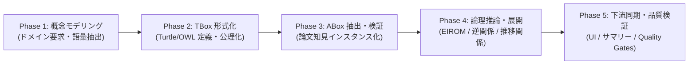

# オントロジー駆動開発プロセス標準規範 (Ontology-Driven Development Process Specification)

本ドキュメントは、「`arxiv-security-papers`」プロジェクトにおいて、新機能開発、スキーマ拡張、論文データ抽出、推論パイプライン更新、および UI/API 連携を実施する際の標準的な開発プロセスである **オントロジー駆動開発（ODD: Ontology-Driven Development）** を規定します。

---

## 1. 目的と基本思想 (Purpose & Philosophy)

本プロジェクトにおけるすべてのデータ流通および推論機能は、「コード先行」や「データベース物理定義先行」ではなく、**オントロジー（概念・関係・論理制約）の形式的定義を最上位のマスター（Single Source of Truth / SOT）** として開発を進めます。

これにより、以下の品質を組織的・継続的に担保します。
1. **概念の一貫性とスキーマ乖離の根絶**: 論文抽出、グラフDB、ベクトル検索、Web UI、MCP ツール間でのデータ表現の不一致を完全排除。
2. **客観的エビデンスに基づく推論**: 因果関係や攻撃パスの導出をブラックボックスな確率的生成に頼らず、オントロジー公理とルールに基づいて決定論的・説明可能に導出。
3. **多角的な 13 大専門エージェントガバナンス**: オントロジーの定義・更新において、セキュリティ、インフラ、自然言語処理、監査、UI、教育など各専門視点の合意を必須化。

---

## 2. オントロジー駆動開発 5 段階ライフサイクル (ODD Lifecycle)

### Phase 1: 概念モデリング & ドメイン分析 (Conceptual Modeling)
- **活動内容**: 新規のセキュリティ脅威、攻撃手法、防御技術、またはシステム要素を導入する際、まずは概念・実体・関係性を自然言語および概念図で整理。
- **成果物**: ドメイン分析メモ、エンティティ候補、プロパティ候補。
- **主要担当**: Information Security Specialist, IT Specialist (NLP), IT Strategist.

### Phase 2: TBox 定義 & W3C Turtle 形式化 (TBox Formalization)
- **活動内容**: 
  - `src/ontology/turtle_engine.py` を用いて、クラス（`owl:Class`）、オブジェクトプロパティ（`owl:ObjectProperty`）、データ型プロパティ（`owl:DatatypeProperty`）を Python DSL で記述。
  - 日本語ラベル（`rdfs:label "@ja"`）、日本語解説（`rdfs:comment "@ja"`）、定義域（`rdfs:domain`）、値域（`rdfs:range`）、排他制約（`owl:disjointWith`）、推移律（`owl:TransitiveProperty`）、逆関係（`owl:inverseOf`）を厳密に設定。
  - W3C Turtle 形式（`.ttl`）としてシリアライズし、構文検証を実行。
- **成果物**: `src/ontology/turtle_engine.py` のクラス/プロパティ定義、`.ttl` ファイル。
- **主要担当**: Systems Architect, Database Specialist, Education Specialist.

### Phase 3: ABox インスタンス抽出 & 適合性検証 (ABox Conformance Checking)
- **活動内容**:
  - arXiv / IACR 等の論文本文からエンティティおよび関係性を抽出（`src/ontology/extractor.py`）。
  - 抽出されたインスタンスが TBox のドメイン・レンジ・型制約に適合しているかを機械検証（Conformance Check）。
  - 不正なリテラルや未定義クラスへの参照を排除し、健全な ABox インスタンス（`OntologyInstance` / `RawTriple`）として確定。
- **成果物**: 抽出された知識トリプル群、OKF Markdown フロントマター。
- **主要担当**: IT Specialist (NLP), Software QA Specialist.

### Phase 4: 論理推論・因果グラフ拡張 (Inference & Expansion)
- **活動内容**:
  - エッジ推論ルール（EIROM: Edge Inference Rule Ontology Master）を適用。
  - オントロジーで定義された逆関係（例: `sec:discloses` ↔ `sec:disclosedIn`）や推移関係（例: `sec:subOrganizationOf`, `cites`）を自動展開。
  - 各エッジに確信度（Confidence Tier: High / Medium / Low）とエビデンス（本文抜粋スニペット）を付与。
- **成果物**: エンリッチ化された知識グラフ（`src/database/engine/graph_database.py`）。
- **主要担当**: Systems Architect, Information Security Specialist.

### Phase 5: 下流同期・品質検証 (Downstream Sync & Quality Gates)
- **活動内容**:
  - 生成されたナレッジを 5 階層サマリー（01〜05）、Web ポータル（`/dashboard tab=graph`）、MCP ツール、およびベクトルインデックスへ自動反映。
  - `make check`（フォーマット、静的解析 `mypy --strict` / `xenon` Grade A、単体テスト）を実行し、全ゲートを通過することを確認。
- **成果物**: 更新されたサマリー、Web ダッシュボード、テスト成功ログ。
- **主要担当**: UI/UX Designer, IT Service Manager, Systems Auditor, PM.

---

## 3. 全 13 大専門エージェント責任分界点 (RACI Matrix)

| エージェント | Phase 1 (モデリング) | Phase 2 (TBox定義) | Phase 3 (ABox抽出) | Phase 4 (推論展開) | Phase 5 (品質・同期) |
| :--- | :---: | :---: | :---: | :---: | :---: |
| **1. Project Manager (PM)** | A | A | A | A | A |
| **2. Information Security Specialist** | R | C | R | R | C |
| **3. Systems Architect** | C | R | C | R | C |
| **4. Software QA Specialist** | I | C | R | C | R |
| **5. Database Specialist** | C | R | C | C | C |
| **6. Network Specialist** | I | C | C | I | I |
| **7. IT Specialist (NLP)** | R | C | R | C | I |
| **8. IT Strategist** | R | I | I | C | C |
| **9. IT Service Manager** | I | I | C | I | R |
| **10. Embedded Specialist** | I | C | I | I | I |
| **11. Systems Auditor** | I | I | C | C | R |
| **12. UI/UX Designer** | I | I | I | I | R |
| **13. Education Specialist** | C | R | I | I | C |

*(R: Responsible / 実行責任, A: Accountable / 説明・承認責任, C: Consulted / 助言・協議, I: Informed / 報告受領)*

---

## 4. 命名規則および名前空間管理方針 (Namespace & Naming Conventions)

1. **名前空間プレフィックス (Prefixes)**:
   - システム共通オントロジー: `sec: <https://arxiv-security-papers.org/ontology/security#>`
   - 企業・組織オントロジー例: `ex: <https://example.com/ontology/corp#>`
   - 標準 W3C 名前空間: `rdf:`, `rdfs:`, `owl:`, `xsd:` を必須登録。
2. **クラス名 (Classes)**:
   - パスカルケース（PascalCase）: `Paper`, `ThreatActor`, `AttackTechnique`, `DefenseMechanism`。
3. **プロパティ名 (Properties)**:
   - キャメルケース（camelCase）: `discloses`, `exploits`, `mitigates`, `paperId`, `publishedDate`。
4. **インスタンス URI (Instances)**:
   - プレフィックス＋識別子（スネークケースまたはID）: `sec:paper_2608_01234`, `sec:technique_t1059`。
5. **言語タグ (Language Tags)**:
   - 日本語の名称・解説には必ず `@ja` を付与し、英語の原語には `@en` を付与。

---

## 5. 関連ドキュメント (Traceability)

- [REQ-ONT-01: オントロジー駆動知識アーキテクチャ要求仕様書](../requirements/REQ-ONT-01_ontology_driven_knowledge_architecture.md)
- [DSN-22: セキュリティおよび脅威知識オントロジー W3C 仕様書](../designs/DSN-22-security_and_threat_ontology_w3c_specification.md)
- [MNG-01: 文書管理台帳](MNG-01-document_ledger.md)
- [MNG-02: ATT&CK/CWE対応台帳](MNG-02-mitre_attack_cwe_ledger.md)
