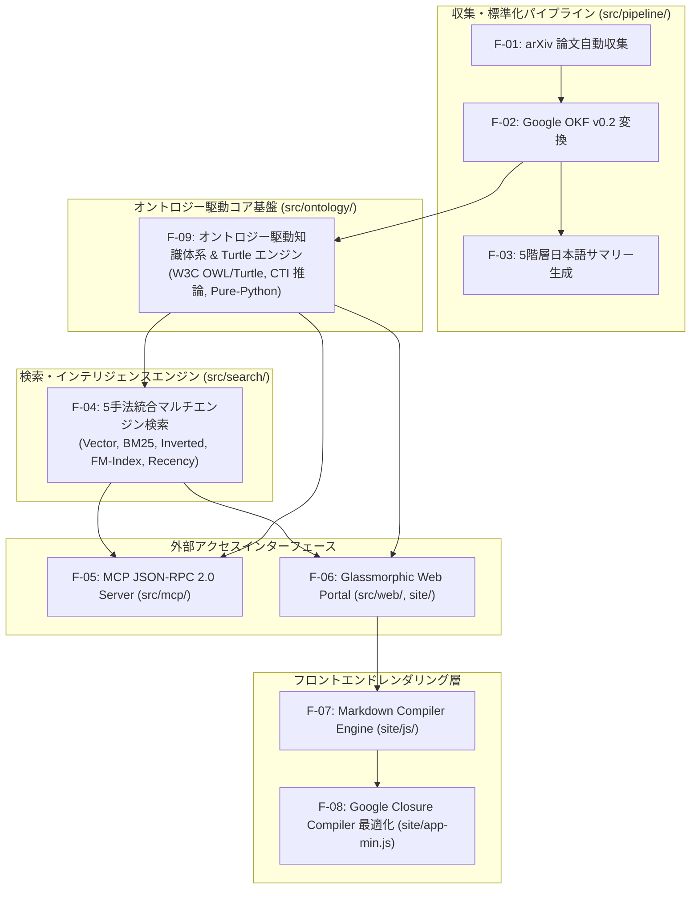

# [REQ-02] 主要機能一覧 (System Feature List) — arxiv-security-papers

本ドキュメントは、「`arxiv-security-papers`」プロジェクトに実装されている主要機能（Capabilities）の一覧を体系的に整理したマスター機能一覧です。各主要機能は、個別の機能設計ページ (`DSN-03`〜`DSN-07`) にて物理設計仕様が記録されています。

---

## 1. 主要機能一覧 (Master Feature List)

| 機能 ID | 主要機能名 | 概要 | 対応要求 (REQ-01) | 設計仕様ページ (DSN) | 主な実装ファイル |
| :---: | --- | --- | :---: | :---: | --- |
| **F-01** | **arXiv 論文自動収集 ＆ 原本保存 (Paper Collector)** | arXiv `cs.CR` 分野より過去 160 日間の最新論文メタデータ・PDF・TXT 本文を並列ダウンロード・重複排除保存 | REQ-FR-01, REQ-NFR-01, NFR-02 | [DSN-03](../designs/DSN-03-paper_collector_and_okf_converter.md) | `src/arxiv_okf_fetcher.py` |
| **F-02** | **Google OKF v0.2 ナレッジ変換 (OKF Converter)** | 非構造な論文テキストを米 Google 社規格 OKF v0.2 仕様準拠の YAML フロントマター付きナレッジ Markdown に変換 | REQ-FR-02, REQ-NFR-03 | [DSN-03](../designs/DSN-03-paper_collector_and_okf_converter.md) | `src/arxiv_okf_fetcher.py` |
| **F-03** | **5階層エグゼクティブサマリー自動生成 (Executive Summaries)** | 01_per_run から 05_annual までの 5 つの時間軸で完全日本語化された構造化要約・比較表・トレンド図を独立管理 | REQ-FR-03, REQ-FR-07 | [DSN-04](../designs/DSN-04-five_tier_executive_summaries.md) | `src/arxiv_okf_fetcher.py` |
| **F-04** | **5手法統合マルチエンジン検索 (Multi-Engine Hybrid Search)** | 転置インデックス, Okapi BM25, FM-Index, ベクトル TF-IDF, 最新性ブースト, 事前注釈, セキュリティ同義語拡張を統合フュージョン検索 | REQ-FR-04, REQ-NFR-05 | [DSN-05](../designs/DSN-05-multi_engine_hybrid_search.md) | `src/vector_engine.py`, `src/synonym_expander.py` |
| **F-05** | **Model Context Protocol サーバ (MCP Server & Tools)** | Anthropic/Google 提唱の MCP JSON-RPC 2.0 サーバ経由で 4 大 AI ツールを標準安全公開 | REQ-FR-05, REQ-NFR-04 | [DSN-06](../designs/DSN-06-mcp_server_and_ai_integration.md) | `src/mcp_server.py` |
| **F-06** | **Glassmorphic Web 検索ポータル (Web Search Portal)** | Google スタイル GET クエリ (`?q=`, `?tag=`) ＆ URL 状態同期対応のリッチダークモード Web ポータル画面 | REQ-FR-06, REQ-NFR-05 | [DSN-07](../designs/DSN-07-web_portal_and_markdown_compiler.md) | `src/web_server.py`, `site/index.html`, `site/app.js` |
| **F-07** | **Markdown Compiler Engine (Client-side Transpiler)** | Lexer, Parser, AST, Evaluator, Renderer 5 層構成によりマークダウン表および Mermaid トレンド図をブラウザ上動的描画 | REQ-FR-07, REQ-NFR-05 | [DSN-07](../designs/DSN-07-web_portal_and_markdown_compiler.md) | `site/js/` (lexer, parser, evaluator, renderer, compiler) |
| **F-08** | **Closure Compiler 最適化 ＆ 品質保証体系 (Closure Compiler & QA)** | `yuzora` 準拠の静的 JS ミニファイ (`site/app-min.js`)、型保護 (`site/externs.js`)、および `Makefile` 品質検証 | REQ-NFR-05, REQ-NFR-06 | [DSN-07](../designs/DSN-07-web_portal_and_markdown_compiler.md) | `tools/closure-compiler/`, `Makefile`, `site/externs.js` |
| **F-09** | **オントロジー駆動知識体系 ＆ Turtle エンジン (Ontology-Driven & Turtle Engine)** | W3C RDF/OWL 準拠の知識モデリング、Pure-Python Turtle (.ttl) 生成、および因果連鎖推論基盤 | REQ-FR-08, REQ-ONT-FR-01〜05 | [DSN-22](../designs/DSN-22-security_and_threat_ontology_w3c_specification.md) | `src/ontology/turtle_engine.py`, `src/ontology/` |

---

## 2. 機能間の関係性 (Feature Interactivity Architecture)

