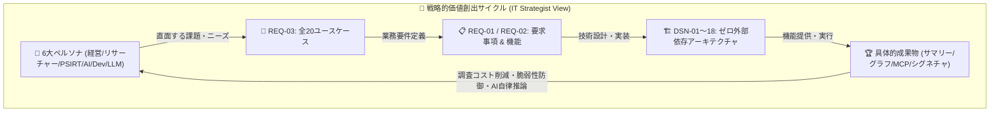

# [REQ-03] プロジェクトユースケース台帳 (Project Use Case Ledger)
## 〜 6大ペルソナ・全20ユースケース・業務価値創出マトリクス 〜

- **文書番号**: `REQ-03`
- **文書ステータス**: `APPROVED`
- **対象サブシステム**: 全サブシステム (`src/` / `site/` / `outputs/` / `docs/`)
- **作成日**: 2026-09-03
- **最終更新日**: 2026-09-03
- **【主査・報告】 IT Strategist (ST)**
- **【参画】 Project Manager (PM), Information Security Specialist (SEC), Systems Architect (SA), UI/UX Designer (UI), Education Specialist (EDU)**
- **トレーサビリティ**: [MNG-01: 文書管理台帳](../processes/MNG-01-document_ledger.md) / [REQ-01: システム要求事項定義書](REQ-01-system_requirements.md) / [REQ-02: 主要機能一覧](REQ-02-feature_list.md) / [DSN-01: 基本設計書](../designs/DSN-01-high_level_design.md) / [DSN-14: Graph Engineering Dashboard](../designs/DSN-14-graph_engineering_dashboard.md) / [DSN-17: セキュリティ知識オントロジー](../designs/DSN-17-security_knowledge_ontology.md) / [DSN-18: Property Graph Database Engine](../designs/DSN-18-property_graph_database_engine.md) / [MNG-02: ATT&CK/CWE対応台帳](../processes/MNG-02-mitre_attack_cwe_ledger.md)
- **管理基準**: ゼロ外部依存（Standard Library Only）・100% 日本語ドキュメント統治

---

## 体系目次

- [1. エグゼクティブサマリー & 戦略的位置づけ (WHY)](#1-エグゼクティブサマリー--戦略的位置づけ-why)
  - [1.1 ユースケース台帳の目的と戦略的価値](#11-ユースケース台帳の目的と戦略的価値)
  - [1.2 要求仕様（WHAT）と機能設計（HOW）を繋ぐ価値実現モデル](#12-要求仕様whatと機能設計howを繋ぐ価値実現モデル)
- [2. 6大ペルソナ定義マトリクス (Personas & Stakeholders)](#2-6大ペルソナ定義マトリクス-personas--stakeholders)
- [3. ユースケース体系マスター台帳 (Master Use Case Catalog)](#3-ユースケース体系マスター台帳-master-use-case-catalog)
  - [3.1 戦略インテリジェンス・経営判断ドメイン (UC-STR)](#31-戦略インテリジェンス経営判断ドメイン-uc-str)
  - [3.2 学術調査・研究ギャップ発見ドメイン (UC-RES)](#32-学術調査研究ギャップ発見ドメイン-uc-res)
  - [3.3 脅威インテリジェンス・実務防御ドメイン (UC-OPS)](#33-脅威インテリジェンス実務防御ドメイン-uc-ops)
  - [3.4 自律AIエージェント・GraphRAG連携ドメイン (UC-AGT)](#34-自律aiエージェントgraphrag連携ドメイン-uc-agt)
  - [3.5 開発・アーキテクチャ・脅威モデリングドメイン (UC-DEV)](#35-開発アーキテクチャ脅威モデリングドメイン-uc-dev)
  - [3.6 AI/LLM セーフティ・レッドチーミングドメイン (UC-LLM)](#36-aillm-セーフティレッドチーミングドメイン-uc-llm)
- [4. 主要ユースケース詳細仕様カード (Use Case Specification Cards)](#4-主要ユースケース詳細仕様カード-use-case-specification-cards)
- [5. ユースケース ↔ 要求・設計・Issue トレーサビリティマトリクス](#5-ユースケース--要求設計issue-トレーサビリティマトリクス)

---

## 1. エグゼクティブサマリー & 戦略的位置づけ (WHY)

### 1.1 ユースケース台帳の目的と戦略的価値
学術プレプリントリポジトリ arXiv からサイバーセキュリティ領域（`cs.CR`）の文献を継続収集し、要約・構造化・検索・グラフ分析を提供する本基盤（`arxiv-security-papers`）において、**「誰が、どのような目的で、システムをどのように活用し、いかなる成果・価値（ビジネス/研究リターン）を得るか」** を明文化することは、アーキテクチャの持続的な保守性と拡張性を担保する上で極めて重要です。

本台帳（`REQ-03`）は、**IT Strategist (ST)** が主導し、全 13 大専門エージェントの合議のもと、システムの機能仕様（`REQ-02` / `DSN-*`）をエンドユーザーの具体的な業務シナリオ（ユースケース）へと昇華させ、要求事項（`REQ-01`）とコード・テスト・ダッシュボードを結ぶトレーサビリティの要となります。

### 1.2 要求仕様（WHAT）と機能設計（HOW）を繋ぐ価値実現モデル



---

## 2. 6大ペルソナ定義マトリクス (Personas & Stakeholders)

| ペルソナ ID | ペルソナ名称 (Role) | 想定される責務・関心事 | 主要な課題 (Pain Points) | 本システムが提供するコア価値 |
| :--- | :--- | :--- | :--- | :--- |
| **P-01** | **CISO / セキュリティ役員・経営層**<br>(Executive / Leadership) | 全社セキュリティ方針、研究開発投資配分、重大脅威の早期把握 | 専門的すぎる論文を精読する時間がない、網羅的トレンドが見えない | 5層エグゼクティブサマリー（完全日本語・表形式・Mermaid動向図）による瞬時の状況把握 |
| **P-02** | **セキュリティリサーチャー / 学術研究者**<br>(Academic Researcher / Analyst) | 先行研究サーベイ、新規攻撃/防御アルゴリズム開発、論文執筆 | 表記揺れによる検索漏れ、未開拓分野（研究ギャップ）の発見困難 | 語彙+Dense ANN+RRFハイブリッド検索、ATT&CK/CWE因果グラフ探索、原本PDF/全文即時参照 |
| **P-03** | **PSIRT / SOC / 脅威インテリジェンス担当**<br>(Threat Intelligence / Incident Responder) | 新規脆弱性・攻撃技術の自社影響分析、防御ルール即時展開 | 論文から実務防御ルール（Sigma/YARA）への変換コストが高い | CTI精密マッピング（CWE $\leftrightarrow$ ATT&CK）、動的防御シグネチャ自動生成 |
| **P-04** | **自律 AI エージェント / LLM コパイロット**<br>(Autonomous AI Agent / MCP Client) | セキュリティ分析タスクの自律遂行、高精度回答生成 | 外部ツールの非標準性、ハルシネーション、プロンプトインジェクション | Model Context Protocol (MCP) 4大ツール、マルチホップ GraphRAG、AST堅牢化 |
| **P-05** | **セキュリティエンジニア / DevSecOps**<br>(Software & Cloud Security Architect) | システム設計レビュー、脅威モデリング、セキュアコーディング | 設計段階での脅威見落とし、最新の学術的攻撃手法への無知 | OpenAPI/IaC照合型 STRIDE 脅威モデリング自動化、`/dashboard` 力学モデル可視化 |
| **P-06** | **AI / MLOps セキュリティ担当者**<br>(AI/LLM Safety Specialist) | LLM ガードレール構築、敵対的攻撃耐性評価、データセット保護 | プロンプトインジェクションやモデル抽出の攻撃手法が急速に進化 | MITRE ATLAS 体系に基づく最新脱獄・データ汚染論文の定点監視・緩和策抽出 |

---

## 3. ユースケース体系マスター台帳 (Master Use Case Catalog)

全 20 件のユースケースを 6 大戦略ドメインに分類して定義します。

### 3.1 戦略インテリジェンス・経営判断ドメイン (UC-STR)

| ユースケース ID | ユースケース名 | 主アクター | 概要 | 主な成果物 / 出力 | 対応機能 / DSN |
| :--- | :--- | :--- | :--- | :--- | :--- |
| **UC-STR-01** | **5層時間軸サマリーによる定点動向観測** | P-01 (CISO) | 実行時・日次・月次・四半期・通期の 5 階層サマリーを閲覧し、セキュリティ研究の短期・長期トレンドを把握する。 | `outputs/executive_summaries/01_per_run`〜`05_annual` | F-03 / DSN-03, DSN-04 |
| **UC-STR-02** | **脅威トレンド分析に基づく R&D 投資判断** | P-01 (CISO) | 急上昇キーワードや急増している攻撃対象（LLM, PQC, IoT）を抽出し、次期セキュリティ研究開発投資を決定する。 | 月次・四半期動向 Mermaid 構成図、カテゴリ別統計表 | F-03, F-04 / DSN-04, DSN-16 |
| **UC-STR-03** | **国際セキュリティ標準準拠状況の俯瞰** | P-01 (CISO), P-03 | NIST SP 800-53, MITRE ATT&CK, CWE との照合結果を俯瞰し、自社の統制基準の有効性を検証する。 | [MNG-02] ATT&CK/CWE対応台帳、標準統制マッピング表 | F-02, F-04 / DSN-17, MNG-02 |

### 3.2 学術調査・研究ギャップ発見ドメイン (UC-RES)

| ユースケース ID | ユースケース名 | 主アクター | 概要 | 主な成果物 / 出力 | 対応機能 / DSN |
| :--- | :--- | :--- | :--- | :--- | :--- |
| **UC-RES-01** | **語彙・意味ハイブリッド検索による先行研究調査** | P-02 (研究者) | 英語・日本語の専門用語、表記揺れ、略称を意識せず、BM25 + Dense ANN + RRF 融合検索で関連論文を網羅抽出する。 | 関連度順論文一覧、スニペット、スコア詳細 | F-04 / DSN-04, Issue 123, 124 |
| **UC-RES-02** | **ナレッジグラフを用いた研究ギャップ（未開拓領域）の特定** | P-02 (研究者) | MITRE ATT&CK 手法や CWE のうち、論文による実証・防御研究が 0 件のノードを抽出し、新規研究テーマを設定する。 | 研究ギャップ一覧、次数 0 ノードリスト、`/dashboard` 警告表示 | F-04 / DSN-14, DSN-18, Issue 135 |
| **UC-RES-03** | **原本 PDF および pdftotext 全文テキストの高速精読** | P-02 (研究者) | 外部接続なしにローカル保存された原本 PDF および抽出済みプレーンテキストを即座に参照し、アルゴリズム詳細を精読する。 | `outputs/raw_data/YYYY-MM-DD/<id>.txt`, `<id>.pdf` | F-01 / DSN-03, DSN-13 |
| **UC-RES-04** | **引用ネットワークの多段追跡と系譜分析** | P-02 (研究者) | 論文間の引用・被引用関係（CITES）をグラフ走査し、特定技術の系譜や基盤となった原著論文へ遡行する。 | 引用ツリー、系譜パス、PageRank スコア | F-04 / DSN-18, Issue 129 |

### 3.3 脅威インテリジェンス・実務防御ドメイン (UC-OPS)

| ユースケース ID | ユースケース名 | 主アクター | 概要 | 主な成果物 / 出力 | 対応機能 / DSN |
| :--- | :--- | :--- | :--- | :--- | :--- |
| **UC-OPS-01** | **脆弱性 (CWE) 起点の攻撃手法 (ATT&CK) 波及探索** | P-03 (PSIRT) | 自社で検知された脆弱性（例: CWE-78）を入力し、それを悪用する既知の攻撃手法および実証論文を 1〜2 ホップで逆引きする。 | 影響を受ける ATT&CK テクニック群、関連論文リスト | F-04 / DSN-17, DSN-18, Issue 135 |
| **UC-OPS-02** | **学術論文からの動的防御シグネチャ自動生成** | P-03 (PSIRT/SOC) | 論文に記載された攻撃パターンや AST 構造から、Semgrep / Sigma / YARA ルールを自動生成し、構文検証を経て配備する。 | `rule.yml`, `rule.yar`, インメモリ AST テスト結果 | F-05 / DSN-08, Issue 131 |
| **UC-OPS-03** | **PRIMUS 知見に基づく根本原因・深刻度推定** | P-03 (PSIRT) | 論文の自然言語記述から CTI-RCM (根本原因 $\rightarrow$ CWE)、CTI-VSP (深刻度 $\rightarrow$ CVSS)、CTI-ATE (攻撃手法 $\rightarrow$ ATT&CK) を精密推定する。 | CVSS ベクトル予測値、CWE カテゴリ、確証度スコア | F-02 / DSN-17, Issue 128 |

### 3.4 自律AIエージェント・GraphRAG連携ドメイン (UC-AGT)

| ユースケース ID | ユースケース名 | 主アクター | 概要 | 主な成果物 / 出力 | 対応機能 / DSN |
| :--- | :--- | :--- | :--- | :--- | :--- |
| **UC-AGT-01** | **MCP 経由でのセキュアな論文データ検索・取得** | P-04 (AI Agent) | AI コーディングアシスタントが MCP ツールを直接呼び出し、論文メタデータ・要約・本文スニペットを安全に取得する。 | JSON-RPC 2.0 ツールレスポンス (Token最適化) | F-05 / DSN-08, MCP-01 |
| **UC-AGT-02** | **マルチホップ GraphRAG によるハルシネーション根絶回答** | P-04 (AI Agent) | 論文ナレッジグラフから事実トリプル（Sub-graph）を抽出し、グラウンディング情報として LLM に注入して正確無比な回答を得る。 | 事実根拠（Provenance）付きマークダウン回答 | F-04, F-05 / DSN-18, Issue 129 |
| **UC-AGT-03** | **MCP 通信のテイント解析とインジェクション防御** | P-04 (AI Agent), P-03 | 悪意ある論文要約内に含まれるプロンプトインジェクション攻撃を AST ガードとテイント解析で無害化・遮断する。 | サニタイズ済みペイロード、遮断セキュリティログ | F-05 / DSN-07, Issue 132 |

### 3.5 開発・アーキテクチャ・脅威モデリングドメイン (UC-DEV)

| ユースケース ID | ユースケース名 | 主アクター | 概要 | 主な成果物 / 出力 | 対応機能 / DSN |
| :--- | :--- | :--- | :--- | :--- | :--- |
| **UC-DEV-01** | **IaC / OpenAPI スキーマ解析と STRIDE 脅威モデリング** | P-05 (DevSecOps) | システムの設計定義ファイルを解析し、収集論文の攻撃事例と自動照合して STRIDE 脅威モデルおよび対策案を自動生成する。 | STRIDE 脅威分析マトリクス、推奨緩和策リスト | F-05 / DSN-17, Issue 130 |
| **UC-DEV-02** | **`/dashboard` 2D Canvas による脅威メッシュの視覚的探索** | P-05 (DevSecOps) | ブラウザで `/dashboard` を開き、力学モデルで自律配置される Paper-ATT&CK-CWE グラフをドラッグ・ズーム・2-Hop 展開する。 | インタラクティブ Canvas 描画、詳細フローティングカード | F-06 / DSN-14, Issue 135 |
| **UC-DEV-03** | **Merkle Tree による論文原本・メタデータ改ざん検知** | P-05 (監査/SRE) | 暗号論的ハッシュ木（Merkle Tree）を用いて、保存された論文原本や OKF メタデータの整合性を一括検証（FIM）する。 | 改ざん検証レポート、Merkle ルートハッシュ照合結果 | F-01, F-02 / DSN-05, Issue 134 |

### 3.6 AI/LLM セーフティ・レッドチーミングドメイン (UC-LLM)

| ユースケース ID | ユースケース名 | 主アクター | 概要 | 主な成果物 / 出力 | 対応機能 / DSN |
| :--- | :--- | :--- | :--- | :--- | :--- |
| **UC-LLM-01** | **最新プロンプトインジェクション・ジェイルブレイク動向の追跡** | P-06 (AI Safety) | MITRE ATLAS AML.T0054 / AML.T0051 に分類される最新論文を抽出し、新たな攻撃手法（多言語、エンコード回避等）を分析する。 | AI 安全性動向レポート、攻撃手法一覧 | F-03, F-04 / DSN-17, MNG-02 |
| **UC-LLM-02** | **学習データ汚染（Data Poisoning）およびバックドア耐性の検証** | P-06 (AI Safety) | ファインチューニングや RAG 知識ベースに対する汚染論文を収集し、自社モデルの防御閾値を評価・更新する。 | 防御パラメータ推奨値、耐性評価ベンチマーク | F-04 / DSN-16, Issue 128 |
| **UC-LLM-03** | **モデル抽出・メンバーシップ推論に対するプライバシー保護策の選定** | P-06 (AI Safety) | 差分プライバシー（DP）や出力摂動に関する学術文献を参照し、自社 AI API のプライバシー保護機能を設計する。 | プライバシー保護アーキテクチャ提案書 | F-04 / DSN-16, DSN-17 |

---

## 4. 主要ユースケース詳細仕様カード (Use Case Specification Cards)

代表的な 3 つの中核ユースケースについて、入出力・実行フロー・例外処理を詳細規定します。

### 4.1 [UC-RES-01] 語彙・意味ハイブリッド検索による先行研究調査

```
【ユースケースID】: UC-RES-01
【主アクター】: P-02 セキュリティリサーチャー
【事前条件】:
  1. システムに OKF 論文インデックスおよび Dense ベクトルストレージ (vectors.vdb) が構築されていること。
  2. 検索サービス (SearchService IPC) または VectorEngine が起動中であること。
【トリガー】: ユーザーが Web UI または CLI で検索クエリ（例: "adversarial prompt injection defense"）を入力。
【基本シーケンス】:
  1. システムはクエリ文字列を受信し、専門用語同義語辞書 (TaxonomyRegistry) により概念を正規化する。
  2. 転置インデックスによる BM25 語彙スコアリングを実行し、候補集合 A を取得する。
  3. DeterministicEmbedding によりクエリを 128 次元ベクトルへ射影し、IVF-PQ / HNSW によりコサイン類似度近傍探索を実行、候補集合 B を取得する。
  4. 候補集合 A と B をマージし、相互順位融合 (RRF: Reciprocal Rank Fusion) により統一順位を算出する。
  5. 上位 Top-K 件の論文メタデータ、日本語1文要約、ハイライトスニペットを返却・表示する。
【事後条件】: 検索レイテンシ 10ms 未満で、語彙不一致でも意味が一致する論文が上位に提示されること。
【例外シーケンス】:
  - 該当論文が 0 件の場合: 緩和した同義語候補（Query Suggestion）および関連カテゴリを提示する。
```

### 4.2 [UC-OPS-01] 脆弱性 (CWE) 起点の攻撃手法 (ATT&CK) 波及探索

```
【ユースケースID】: UC-OPS-01
【主アクター】: P-03 PSIRT / 脆弱性アナリスト
【事前条件】:
  1. MITRE ATT&CK および CWE のマスターオントロジーが PropertyGraphEngine にシードされていること。
  2. 論文と CWE / ATT&CK の紐づけエッジ (EXPLOITS, DISCLOSES) が生成済みであること。
【トリガー】: ユーザーが CWE ID（例: "CWE-78"）を指定して波及探索を実行。
【基本シーケンス】:
  1. PropertyGraphEngine は "Vulnerability:CWE-78" 頂点を取得する。
  2. 逆方向 CSR 隣接インデックスを走査し、この脆弱性を悪用する攻撃手法 (:AttackTechnique) を 1-Hop 探索する。
  3. 各攻撃手法ノードからさらに、それらを実証または防御対象としている論文 (:Paper) を 2-Hop 探索する。
  4. 脆弱性 $\rightarrow$ 攻撃手法 $\rightarrow$ 実証論文 の因果連鎖パス (Path) を構築する。
  5. 確証度 (Gold/Silver) 付きで構造化マークダウンまたは JSON として返却する。
【事後条件】: 脆弱性の影響範囲および悪用可能な具体的エクスプロイト手法が網羅的に特定されること。
```

### 4.3 [UC-DEV-02] `/dashboard` 2D Canvas による脅威メッシュの視覚的探索

```
【ユースケースID】: UC-DEV-02
【主アクター】: P-05 セキュリティエンジニア / アーキテクト
【事前条件】:
  1. Web ゲートウェイ (src/web/) が起動しており、/api/graph/cti-mesh が利用可能であること。
  2. 最新のブラウザで site/dashboard.html がロードされていること。
【トリガー】: ユーザーがブラウザで http://localhost:8000/dashboard を開く。
【基本シーケンス】:
  1. ダッシュボードは起動時に /api/graph/cti-mesh からノードおよびエッジの最新 JSON を取得する。
  2. HTML5 Canvas 2D 物理演算エンジンが起動し、クーロン反発力・バネ引力によりノードを自動配置する。
  3. ノードは種別ごとに色分け描画される (Paper: 青, ATT&CK: 赤, CWE: 橙)。
  4. ユーザーが特定のノードをクリックすると、2-Hop 以内の接続ノードがハイライトされ、詳細カードが表示される。
  5. ユーザーが「研究ギャップトグル」を押下すると、接続論文 0 件の孤立ノードが金色枠線で点滅表示される。
【事後条件】: 外部通信 0 件の完全スタンドアロン環境で、60 FPS の滑らかなグラフ探索が行えること。
```

---

## 5. ユースケース ↔ 要求・設計・Issue トレーサビリティマトリクス

| ユースケース ID | 対応要求事項 (REQ-01) | 対応主要機能 (REQ-02) | 対応設計書 (DSN) | 対応 Issue | 主な実装モジュール |
| :--- | :--- | :--- | :--- | :--- | :--- |
| **UC-STR-01** | REQ-FR-03 | F-03 | DSN-03, DSN-04 | Issue 116 | `src/arxiv_okf_fetcher.py` |
| **UC-STR-02** | REQ-FR-03, FR-07 | F-03, F-04 | DSN-04, DSN-16 | Issue 117 | `src/arxiv_okf_fetcher.py`, `src/vector_engine.py` |
| **UC-STR-03** | REQ-FR-02 | F-02 | DSN-17 | MNG-02, Issue 135 | `src/ontology/schema.py`, `src/ontology/taxonomy.py` |
| **UC-RES-01** | REQ-FR-04 | F-04 | DSN-04, DSN-05 | Issue 123, 124 | `src/search/vector_engine.py`, `src/search/vector/` |
| **UC-RES-02** | REQ-FR-04 | F-04 | DSN-14, DSN-18 | Issue 135 | `src/graph/engine.py`, `src/graph/traversal.py` |
| **UC-RES-03** | REQ-FR-01 | F-01 | DSN-03, DSN-13 | Issue 116 | `src/arxiv_okf_fetcher.py`, `src/pdf_engine/` |
| **UC-RES-04** | REQ-FR-04 | F-04 | DSN-18 | Issue 129 | `src/graph/engine.py`, `src/graph/traversal.py` |
| **UC-OPS-01** | REQ-FR-04 | F-04 | DSN-17, DSN-18 | Issue 135 | `src/graph/engine.py`, `src/ontology/taxonomy.py` |
| **UC-OPS-02** | REQ-FR-05 | F-05 | DSN-08 | Issue 131 | `src/mcp/threat_defense_server.py` |
| **UC-OPS-03** | REQ-FR-02 | F-02 | DSN-17 | Issue 128 | `src/ontology/extractor.py`, `src/ontology/taxonomy.py` |
| **UC-AGT-01** | REQ-FR-05 | F-05 | DSN-06, DSN-08 | Issue 120 | `src/mcp/papers_server.py`, `src/mcp/base.py` |
| **UC-AGT-02** | REQ-FR-04, FR-05 | F-04, F-05 | DSN-18 | Issue 129 | `src/graph/graphrag.py`, `src/mcp/papers_server.py` |
| **UC-AGT-03** | REQ-FR-05 | F-05 | DSN-07, DSN-08 | Issue 132 | `src/security/ast_sandbox.py`, `src/mcp/base.py` |
| **UC-DEV-01** | REQ-FR-05 | F-05 | DSN-17 | Issue 130 | `src/ontology/taxonomy.py`, `src/mcp/` |
| **UC-DEV-02** | REQ-FR-06, FR-07 | F-06, F-07 | DSN-14 | Issue 135 | `site/dashboard.html`, `src/web/gateway/handlers.py` |
| **UC-DEV-03** | REQ-FR-01, NFR-02 | F-01, F-02 | DSN-05 | Issue 134 | `src/database/storage/`, `src/security/` |
| **UC-LLM-01** | REQ-FR-03, FR-04 | F-03, F-04 | DSN-17 | Issue 128, 135 | `src/ontology/taxonomy.py`, `src/search/` |
| **UC-LLM-02** | REQ-FR-04 | F-04 | DSN-16, DSN-17 | Issue 128 | `src/search/vector/`, `src/ontology/` |
| **UC-LLM-03** | REQ-FR-04 | F-04 | DSN-16, DSN-17 | Issue 128 | `src/ontology/schema.py`, `src/search/` |
