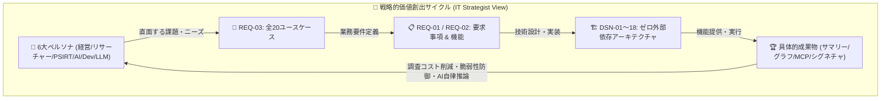

# [REQ-03] プロジェクトユースケース台帳 (Project Use Case Ledger)
## 〜 6大ペルソナ ＆ 国家サイバー統括室 13役割対応・全33ユースケース・業務価値創出マトリクス 〜

- **文書番号**: `REQ-03`
- **文書ステータス**: `APPROVED`
- **対象サブシステム**: 全サブシステム (`src/` / `site/` / `outputs/` / `docs/`)
- **作成日**: 2026-09-03
- **最終更新日**: 2026-09-03
- **【主査・報告】 IT Strategist (ST)**
- **【参画】 Project Manager (PM), Information Security Specialist (SEC), Systems Architect (SA), UI/UX Designer (UI), Education Specialist (EDU)**
- **トレーサビリティ**: [MNG-01: 文書管理台帳](../processes/MNG-01-document_ledger.md) / [REQ-01: システム要求事項定義書](REQ-01-system_requirements.md) / [REQ-02: 主要機能一覧](REQ-02-feature_list.md) / [DSN-01: 基本設計書](../designs/DSN-01-high_level_design.md) / [DSN-14: Graph Engineering Dashboard](../designs/DSN-14-graph_engineering_dashboard.md) / [DSN-17: セキュリティ知識オントロジー](../designs/DSN-17-security_knowledge_ontology.md) / [DSN-18: Property Graph Database Engine](../designs/DSN-18-property_graph_database_engine.md) / [MNG-02: ATT&CK/CWE対応台帳](../processes/MNG-02-mitre_attack_cwe_ledger.md)
- **管理基準**: ゼロ外部依存（Standard Library Only）・100% 日本語ドキュメント統治

---

## 体系目次

- [1. エグゼクティブサマリー & 戦略的位置づけ (WHY)](#1-エグゼクティブサマリー--戦略的位置づけ-why)
  - [1.1 ユースケース台帳の目的と戦略的価値](#11-ユースケース台帳の目的と戦略的価値)
  - [1.2 要求仕様（WHAT）と機能設計（HOW）を繋ぐ価値実現モデル](#12-要求仕様whatと機能設計howを繋ぐ価値実現モデル)
- [2. 6大ペルソナ定義マトリクス (Personas & Stakeholders)](#2-6大ペルソナ定義マトリクス-personas--stakeholders)
- [3. ユースケース体系マスター台帳 (Master Use Case Catalog)](#3-ユースケース体系マスター台帳-master-use-case-catalog)
  - [3.1 戦略インテリジェンス・経営判断ドメイン (UC-STR)](#31-戦略インテリジェンス経営判断ドメイン-uc-str)
  - [3.2 学術調査・研究ギャップ発見ドメイン (UC-RES)](#32-学術調査研究ギャップ発見ドメイン-uc-res)
  - [3.3 脅威インテリジェンス・実務防御ドメイン (UC-OPS)](#33-脅威インテリジェンス実務防御ドメイン-uc-ops)
  - [3.4 自律AIエージェント・GraphRAG連携ドメイン (UC-AGT)](#34-自律aiエージェントgraphrag連携ドメイン-uc-agt)
  - [3.5 開発・アーキテクチャ・脅威モデリングドメイン (UC-DEV)](#35-開発アーキテクチャ脅威モデリングドメイン-uc-dev)
  - [3.6 AI/LLM セーフティ・レッドチーミングドメイン (UC-LLM)](#36-aillm-セーフティレッドチーミングドメイン-uc-llm)
- [4. 国家サイバー統括室「サイバーセキュリティ人材フレームワーク2026」13役割別ユースケース台帳 (NCO 13-Role Catalog)](#4-国家サイバー統括室サイバーセキュリティ人材フレームワーク202613役割別ユースケース台帳-nco-13-role-catalog)
- [5. 主要ユースケース詳細仕様カード (Use Case Specification Cards)](#5-主要ユースケース詳細仕様カード-use-case-specification-cards)
- [6. ユースケース ↔ 要求・設計・Issue トレーサビリティマトリクス](#6-ユースケース--要求設計issue-トレーサビリティマトリクス)


---

## 1. エグゼクティブサマリー & 戦略的位置づけ (WHY)

### 1.1 ユースケース台帳の目的と戦略的価値
学術プレプリントリポジトリ arXiv からサイバーセキュリティ領域（`cs.CR`）の文献を継続収集し、要約・構造化・検索・グラフ分析を提供する本基盤（`arxiv-security-papers`）において、**「誰が、どのような目的で、システムをどのように活用し、いかなる成果・価値（ビジネス/研究リターン）を得るか」** を明文化することは、アーキテクチャの持続的な保守性と拡張性を担保する上で極めて重要です。

本台帳（`REQ-03`）は、**IT Strategist (ST)** が主導し、全 13 大専門エージェントの合議のもと、システムの機能仕様（`REQ-02` / `DSN-*`）をエンドユーザーの具体的な業務シナリオ（ユースケース）へと昇華させ、要求事項（`REQ-01`）とコード・テスト・ダッシュボードを結ぶトレーサビリティの要となります。

### 1.2 要求仕様（WHAT）と機能設計（HOW）を繋ぐ価値実現モデル



---

## 2. 6大ペルソナ定義マトリクス (Personas & Stakeholders)

| ペルソナ ID | ペルソナ名称 (Role) | 想定される責務・関心事 | 主要な課題 (Pain Points) | 本システムが提供するコア価値 |
| :--- | :--- | :--- | :--- | :--- |
| **P-01** | **CISO / セキュリティ役員・経営層**<br>(Executive / Leadership) | 全社セキュリティ方針、研究開発投資配分、重大脅威の早期把握 | 専門的すぎる論文を精読する時間がない、網羅的トレンドが見えない | 5層エグゼクティブサマリー（完全日本語・表形式・Mermaid動向図）による瞬時の状況把握 |
| **P-02** | **セキュリティリサーチャー / 学術研究者**<br>(Academic Researcher / Analyst) | 先行研究サーベイ、新規攻撃/防御アルゴリズム開発、論文執筆 | 表記揺れによる検索漏れ、未開拓分野（研究ギャップ）の発見困難 | 語彙+Dense ANN+RRFハイブリッド検索、ATT&CK/CWE因果グラフ探索、原本PDF/全文即時参照 |
| **P-03** | **PSIRT / SOC / 脅威インテリジェンス担当**<br>(Threat Intelligence / Incident Responder) | 新規脆弱性・攻撃技術の自社影響分析、防御ルール即時展開 | 論文から実務防御ルール（Sigma/YARA）への変換コストが高い | CTI精密マッピング（CWE $\leftrightarrow$ ATT&CK）、動的防御シグネチャ自動生成 |
| **P-04** | **自律 AI エージェント / LLM コパイロット**<br>(Autonomous AI Agent / MCP Client) | セキュリティ分析タスクの自律遂行、高精度回答生成 | 外部ツールの非標準性、ハルシネーション、プロンプトインジェクション | Model Context Protocol (MCP) 4大ツール、マルチホップ GraphRAG、AST堅牢化 |
| **P-05** | **セキュリティエンジニア / DevSecOps**<br>(Software & Cloud Security Architect) | システム設計レビュー、脅威モデリング、セキュアコーディング | 設計段階での脅威見落とし、最新の学術的攻撃手法への無知 | OpenAPI/IaC照合型 STRIDE 脅威モデリング自動化、`/dashboard` 力学モデル可視化 |
| **P-06** | **AI / MLOps セキュリティ担当者**<br>(AI/LLM Safety Specialist) | LLM ガードレール構築、敵対的攻撃耐性評価、データセット保護 | プロンプトインジェクションやモデル抽出の攻撃手法が急速に進化 | MITRE ATLAS 体系に基づく最新脱獄・データ汚染論文の定点監視・緩和策抽出 |

---

## 3. ユースケース体系マスター台帳 (Master Use Case Catalog)

全 20 件のユースケースを 6 大戦略ドメインに分類して定義します。

### 3.1 戦略インテリジェンス・経営判断ドメイン (UC-STR)

| ユースケース ID | ユースケース名 | 主アクター | 概要 | 主な成果物 / 出力 | 対応機能 / DSN |
| :--- | :--- | :--- | :--- | :--- | :--- |
| **UC-STR-01** | **5層時間軸サマリーによる定点動向観測** | P-01 (CISO) | 実行時・日次・月次・四半期・通期の 5 階層サマリーを閲覧し、セキュリティ研究の短期・長期トレンドを把握する。 | `outputs/executive_summaries/01_per_run`〜`05_annual` | F-03 / DSN-03, DSN-04 |
| **UC-STR-02** | **脅威トレンド分析に基づく R&D 投資判断** | P-01 (CISO) | 急上昇キーワードや急増している攻撃対象（LLM, PQC, IoT）を抽出し、次期セキュリティ研究開発投資を決定する。 | 月次・四半期動向 Mermaid 構成図、カテゴリ別統計表 | F-03, F-04 / DSN-04, DSN-16 |
| **UC-STR-03** | **国際セキュリティ標準準拠状況の俯瞰** | P-01 (CISO), P-03 | NIST SP 800-53, MITRE ATT&CK, CWE との照合結果を俯瞰し、自社の統制基準の有効性を検証する。 | [MNG-02] ATT&CK/CWE対応台帳、標準統制マッピング表 | F-02, F-04 / DSN-17, MNG-02 |

### 3.2 学術調査・研究ギャップ発見ドメイン (UC-RES)

| ユースケース ID | ユースケース名 | 主アクター | 概要 | 主な成果物 / 出力 | 対応機能 / DSN |
| :--- | :--- | :--- | :--- | :--- | :--- |
| **UC-RES-01** | **語彙・意味ハイブリッド検索による先行研究調査** | P-02 (研究者) | 英語・日本語の専門用語、表記揺れ、略称を意識せず、BM25 + Dense ANN + RRF 融合検索で関連論文を網羅抽出する。 | 関連度順論文一覧、スニペット、スコア詳細 | F-04 / DSN-04, Issue 123, 124 |
| **UC-RES-02** | **ナレッジグラフを用いた研究ギャップ（未開拓領域）の特定** | P-02 (研究者) | MITRE ATT&CK 手法や CWE のうち、論文による実証・防御研究が 0 件のノードを抽出し、新規研究テーマを設定する。 | 研究ギャップ一覧、次数 0 ノードリスト、`/dashboard` 警告表示 | F-04 / DSN-14, DSN-18, Issue 135 |
| **UC-RES-03** | **原本 PDF および pdftotext 全文テキストの高速精読** | P-02 (研究者) | 外部接続なしにローカル保存された原本 PDF および抽出済みプレーンテキストを即座に参照し、アルゴリズム詳細を精読する。 | `outputs/raw_data/YYYY-MM-DD/<id>.txt`, `<id>.pdf` | F-01 / DSN-03, DSN-13 |
| **UC-RES-04** | **引用ネットワークの多段追跡と系譜分析** | P-02 (研究者) | 論文間の引用・被引用関係（CITES）をグラフ走査し、特定技術の系譜や基盤となった原著論文へ遡行する。 | 引用ツリー、系譜パス、PageRank スコア | F-04 / DSN-18, Issue 129 |

### 3.3 脅威インテリジェンス・実務防御ドメイン (UC-OPS)

| ユースケース ID | ユースケース名 | 主アクター | 概要 | 主な成果物 / 出力 | 対応機能 / DSN |
| :--- | :--- | :--- | :--- | :--- | :--- |
| **UC-OPS-01** | **脆弱性 (CWE) 起点の攻撃手法 (ATT&CK) 波及探索** | P-03 (PSIRT) | 自社で検知された脆弱性（例: CWE-78）を入力し、それを悪用する既知の攻撃手法および実証論文を 1〜2 ホップで逆引きする。 | 影響を受ける ATT&CK テクニック群、関連論文リスト | F-04 / DSN-17, DSN-18, Issue 135 |
| **UC-OPS-02** | **学術論文からの動的防御シグネチャ自動生成** | P-03 (PSIRT/SOC) | 論文に記載された攻撃パターンや AST 構造から、Semgrep / Sigma / YARA ルールを自動生成し、構文検証を経て配備する。 | `rule.yml`, `rule.yar`, インメモリ AST テスト結果 | F-05 / DSN-08, Issue 131 |
| **UC-OPS-03** | **PRIMUS 知見に基づく根本原因・深刻度推定** | P-03 (PSIRT) | 論文の自然言語記述から CTI-RCM (根本原因 $\rightarrow$ CWE)、CTI-VSP (深刻度 $\rightarrow$ CVSS)、CTI-ATE (攻撃手法 $\rightarrow$ ATT&CK) を精密推定する。 | CVSS ベクトル予測値、CWE カテゴリ、確証度スコア | F-02 / DSN-17, Issue 128 |

### 3.4 自律AIエージェント・GraphRAG連携ドメイン (UC-AGT)

| ユースケース ID | ユースケース名 | 主アクター | 概要 | 主な成果物 / 出力 | 対応機能 / DSN |
| :--- | :--- | :--- | :--- | :--- | :--- |
| **UC-AGT-01** | **MCP 経由でのセキュアな論文データ検索・取得** | P-04 (AI Agent) | AI コーディングアシスタントが MCP ツールを直接呼び出し、論文メタデータ・要約・本文スニペットを安全に取得する。 | JSON-RPC 2.0 ツールレスポンス (Token最適化) | F-05 / DSN-08, MCP-01 |
| **UC-AGT-02** | **マルチホップ GraphRAG によるハルシネーション根絶回答** | P-04 (AI Agent) | 論文ナレッジグラフから事実トリプル（Sub-graph）を抽出し、グラウンディング情報として LLM に注入して正確無比な回答を得る。 | 事実根拠（Provenance）付きマークダウン回答 | F-04, F-05 / DSN-18, Issue 129 |
| **UC-AGT-03** | **MCP 通信のテイント解析とインジェクション防御** | P-04 (AI Agent), P-03 | 悪意ある論文要約内に含まれるプロンプトインジェクション攻撃を AST ガードとテイント解析で無害化・遮断する。 | サニタイズ済みペイロード、遮断セキュリティログ | F-05 / DSN-07, Issue 132 |

### 3.5 開発・アーキテクチャ・脅威モデリングドメイン (UC-DEV)

| ユースケース ID | ユースケース名 | 主アクター | 概要 | 主な成果物 / 出力 | 対応機能 / DSN |
| :--- | :--- | :--- | :--- | :--- | :--- |
| **UC-DEV-01** | **IaC / OpenAPI スキーマ解析と STRIDE 脅威モデリング** | P-05 (DevSecOps) | システムの設計定義ファイルを解析し、収集論文の攻撃事例と自動照合して STRIDE 脅威モデルおよび対策案を自動生成する。 | STRIDE 脅威分析マトリクス、推奨緩和策リスト | F-05 / DSN-17, Issue 130 |
| **UC-DEV-02** | **`/dashboard` 2D Canvas による脅威メッシュの視覚的探索** | P-05 (DevSecOps) | ブラウザで `/dashboard` を開き、力学モデルで自律配置される Paper-ATT&CK-CWE グラフをドラッグ・ズーム・2-Hop 展開する。 | インタラクティブ Canvas 描画、詳細フローティングカード | F-06 / DSN-14, Issue 135 |
| **UC-DEV-03** | **Merkle Tree による論文原本・メタデータ改ざん検知** | P-05 (監査/SRE) | 暗号論的ハッシュ木（Merkle Tree）を用いて、保存された論文原本や OKF メタデータの整合性を一括検証（FIM）する。 | 改ざん検証レポート、Merkle ルートハッシュ照合結果 | F-01, F-02 / DSN-05, Issue 134 |

### 3.6 AI/LLM セーフティ・レッドチーミングドメイン (UC-LLM)

| ユースケース ID | ユースケース名 | 主アクター | 概要 | 主な成果物 / 出力 | 対応機能 / DSN |
| :--- | :--- | :--- | :--- | :--- | :--- |
| **UC-LLM-01** | **最新プロンプトインジェクション・ジェイルブレイク動向の追跡** | P-06 (AI Safety) | MITRE ATLAS AML.T0054 / AML.T0051 に分類される最新論文を抽出し、新たな攻撃手法（多言語、エンコード回避等）を分析する。 | AI 安全性動向レポート、攻撃手法一覧 | F-03, F-04 / DSN-17, MNG-02 |
| **UC-LLM-02** | **学習データ汚染（Data Poisoning）およびバックドア耐性の検証** | P-06 (AI Safety) | ファインチューニングや RAG 知識ベースに対する汚染論文を収集し、自社モデルの防御閾値を評価・更新する。 | 防御パラメータ推奨値、耐性評価ベンチマーク | F-04 / DSN-16, Issue 128 |
| **UC-LLM-03** | **モデル抽出・メンバーシップ推論に対するプライバシー保護策の選定** | P-06 (AI Safety) | 差分プライバシー（DP）や出力摂動に関する学術文献を参照し、自社 AI API のプライバシー保護機能を設計する。 | プライバシー保護アーキテクチャ提案書 | F-04 / DSN-16, DSN-17 |

---

## 4. 国家サイバー統括室「サイバーセキュリティ人材フレームワーク2026」13役割別ユースケース台帳 (NCO 13-Role Catalog)

内閣官房 国家サイバー統括室（NCO: National Cyber Strategy Office）が 2026 年 4 月に策定・公表した**「サイバーセキュリティ人材フレームワーク2026」**で規定された **13 の役割** に対し、本基盤（`arxiv-security-papers`）がどのように各専門人材の業務課題を解決し、実務価値（Deliverables）を創出するかを網羅的に定義します。

本フレームワークが規定する「マネジメント系（統括・経営・プロジェクト推進）」、「エキスパート系（高度分析・技術追究）」、および本来業務にセキュリティ知識を付加する「プラス・セキュリティ人材」の全複線的キャリアパスを強力に支援します。

| 役割 ID | NCO 定義役割名称 (日/英) | 対応ユースケース ID | ユースケース名 (実務シナリオ) | 役割における主課題・タスク | 本システム活用アプローチ (How to Use) | 創出成果・業務価値 (Deliverables) |
| :--- | :--- | :--- | :--- | :--- | :--- | :--- |
| **NCO-R01** | **意思決定・戦略策定**<br>(Decision Making & Strategy) | **UC-NCO-01** | **学術インテリジェンスに基づく全社サイバー防衛戦略・投資方針の策定** | 経営リスクに直結するサイバー脅威動向の把握、限られたセキュリティ投資の最適配分、取締役会への説明責任。 | 03_monthly, 04_quarterly, 05_annual の 5 層サマリーおよび Mermaid 動向図からマクロ脅威トレンドを抽出し、自社投資優先度を策定。 | 全社中長期セキュリティ戦略書、経営層向け脅威情勢ブリーフィング、投資対効果評価書 |
| **NCO-R02** | **戦略推進・プロジェクト管理**<br>(Strategy Implementation & PM) | **UC-NCO-02** | **PQC移行・ゼロトラスト等全社セキュリティプロジェクトの学術検証型推進** | 最新技術導入（耐量子暗号、AIセーフティ）の技術的実現可能性評価、ベンダー提案の学術的妥当性検証。 | `src/search/` ハイブリッド検索（BM25+Dense ANN）により特定技術の学術論文群をサーベイし、PoC・実装上の落とし穴を先行特定。 | 技術導入ロードマップ、PoC 評価基準書、ベンダー選定技術要件 |
| **NCO-R03** | **監視**<br>(Monitoring / SOC) | **UC-NCO-03** | **学術論文からの動的防御シグネチャによる SOC 監視ルール拡充とアラート相関分析** | 未知攻撃（Zero-day、最新防護回避手法）の早期見逃し防止、膨大なアラートのトリアージ効率化。 | 論文から自動抽出・生成された Semgrep / Sigma / YARA ルール（`Issue 131`）を SIEM/SOC 監視基盤に投入し、リアルタイム検知ルールを拡充。 | 実配備 Sigma/YARA シグネチャ、相関分析検知ロジック、検知率向上 |
| **NCO-R04** | **対処**<br>(Incident Handling / CSIRT) | **UC-NCO-04** | **発生インシデント類似攻撃手法のナレッジグラフ逆引きと暫定緩和策の即時適用** | インシデント発生時の攻撃手法同定、被害極小化、公式パッチ提供前のワークアラウンド早期策定。 | 侵害兆候（TTPs/CWE）をキーに、`PropertyGraphEngine` を 2-Hop 走査し、類似攻撃手法と論文に記載された緩和策（Mitigation）を即時逆引き。 | インシデント封じ込め手順書、緊急暫定緩和策、フォールバック構成 |
| **NCO-R05** | **情報収集・分析・共有**<br>(Threat Intelligence / CTI) | **UC-NCO-05** | **arXiv 論文からの構造化 CTI フィード自動生成と ISAC / 組織内共有** | 学術文献に埋もれた実践的脅威インテリジェンスの体系化、MITRE ATT&CK / CWE への構造化、標準形式での迅速共有。 | `src/ontology/extractor.py` による自動ハイブリッド抽出と OKF v0.2 Markdown 生成を活用し、最新攻撃手法を構造化 CTI フィードとして即時展開。 | 構造化 CTI レポート、STIX/TAXII 互換フィード、ISAC 共有資料 |
| **NCO-R06** | **脆弱性評価**<br>(Vulnerability Assessment) | **UC-NCO-06** | **論文記載のエクスプロイト機序に基づく実効的ペネトレーションテスト設計** | 既存スキャナで検知不能な論理的欠陥・最新攻撃手法の網羅的検証、実効的なペネトレーションテスト計画。 | 論文から CWE-89/78/502/120 等の具体的な攻撃成立条件・PoC 構造を分析し、現実の攻撃者に近い脅威シミュレーション（Red Teaming）を設計。 | ペネトレーションテスト計画書、攻撃再現 PoC スクリプト、脆弱性是正指示書 |
| **NCO-R07** | **フォレンジック**<br>(Digital Forensics & Analysis) | **UC-NCO-07** | **最新防護回避・低レイヤメモリ破壊手法に対するフォレンジック痕跡の同定** | 高度メモリ難読化、ファームウェア改変、サイドチャネル攻撃等の揮発性痕跡の特定困難性。 | メモリ安全性（CWE-416, CWE-787）やマイクロアーキテクチャ（CWE-1255）の最新論文を検索し、ログやダンプメモリに残存する微小アーティファクトを同定。 | フォレンジック調査報告書、揮発性アーティファクト解析手順書 |
| **NCO-R08** | **運用管理**<br>(Operations Management) | **UC-NCO-08** | **データパイプライン自律運用と Merkle Tree による論文原本改ざん耐性統制** | 収集データの信頼性担保、改ざん検知、自律収集バッチ（cron/supervisor）の 24/365 連続安定稼働。 | `src/supervisor/`（Erlang/OTP 型スーパーバイザ）および Merkle Tree 改ざん検知（`Issue 134`）により、パイプラインの完全自律運用とデータの真正性を常時担保。 | システム稼働報告書、FIM (ファイル改ざん検知) 整合性証明、SLA 達成記録 |
| **NCO-R09** | **教育・訓練**<br>(Education & Training) | **UC-NCO-09** | **完全日本語サマリーとナレッジグラフを活用したサイバー人材育成プログラム** | 専門的英語論文へのアクセス障壁、初学者・プラス・セキュリティ人材向け教材の不足。 | 100% 日本語化された 5 層エグゼクティブサマリーおよび `/dashboard` の 2D Canvas グラフを教材とし、最新脅威（Prompt Injection 等）を視覚的に解説。 | 社内セキュリティ研修カリキュラム、プラス・セキュリティ育成テキスト |
| **NCO-R10** | **法務**<br>(Legal Affairs & Compliance) | **UC-NCO-10** | **AI セキュリティ・プライバシー（メンバーシップ推論・著作権）の法令遵守レビュー** | AI 規制法（EU AI Act, 日本 AI 安全性ガイドライン）への適合性検証、データ学習・プライバシーリスク評価。 | モデル反転（AML.T0024）、メンバーシップ推論（AML.T0025）、差分プライバシー最新研究を追跡し、自社 AI サービスの法的妥当性と説明責任を評価。 | AI 法的リスク評価意見書、プライバシー影響評価書 (PIA) |
| **NCO-R11** | **監査**<br>(Security Auditing & Assurance) | **UC-NCO-11** | **Google OKF v0.2 プロバナンスとデジタル署名に基づく客観的セキュリティ監査証跡提示** | セキュリティ対策の客観的有効性検証、外部監査へのエビデンス提示、データ真正性証明。 | Google OKF v0.2 の完全な来歴メタデータ（発行元、取得日時、ハッシュ）および Merkle 証明を活用し、インテリジェンス基盤の客観的監査証跡（Audit Trail）を提供。 | セキュリティ統制監査調書、データ真正性検証レポート |
| **NCO-R12** | **設計開発**<br>(Design & Development) | **UC-NCO-12** | **IDE / CI/CD 連携による IaC / OpenAPI 設計段階でのシフトレフト脅威モデリング** | 設計段階での脅威見落とし、既知の脆弱性・アンチパターンの混入防止（シフトレフト）。 | `src/mcp/` 経由で開発環境と連携し、IaC / OpenAPI スキーマを解析して論文に報告された攻撃手法に対する防御策を設計段階で自動推奨（`Issue 130`）。 | セキュア設計レビュー結果、自動生成 STRIDE 脅威モデル、修正パッチ |
| **NCO-R13** | **研究**<br>(Research & Exploration) | **UC-NCO-13** | **研究ギャップ（未開拓セキュリティ領域）の自動検出と先端研究テーマ創出** | 世界最先端の研究動向把握、未知の研究ギャップ（学術的空白地帯）の特定困難性。 | `PropertyGraphEngine` の研究ギャップ検出（接続論文 0 件の ATT&CK/CWE ノード特定）およびセマンティック近傍探索により、国際学会水準の新規研究テーマを発掘。 | 新規研究テーマ提案書、研究ギャップ分析マップ、学術論文ドラフト |

---

## 5. 主要ユースケース詳細仕様カード (Use Case Specification Cards)

代表的な 3 つの中核ユースケースについて、入出力・実行フロー・例外処理を詳細規定します。

### 5.1 [UC-RES-01] 語彙・意味ハイブリッド検索による先行研究調査

```
【ユースケースID】: UC-RES-01
【主アクター】: P-02 セキュリティリサーチャー
【事前条件】:
  1. システムに OKF 論文インデックスおよび Dense ベクトルストレージ (vectors.vdb) が構築されていること。
  2. 検索サービス (SearchService IPC) または VectorEngine が起動中であること。
【トリガー】: ユーザーが Web UI または CLI で検索クエリ（例: "adversarial prompt injection defense"）を入力。
【基本シーケンス】:
  1. システムはクエリ文字列を受信し、専門用語同義語辞書 (TaxonomyRegistry) により概念を正規化する。
  2. 転置インデックスによる BM25 語彙スコアリングを実行し、候補集合 A を取得する。
  3. DeterministicEmbedding によりクエリを 128 次元ベクトルへ射影し、IVF-PQ / HNSW によりコサイン類似度近傍探索を実行、候補集合 B を取得する。
  4. 候補集合 A と B をマージし、相互順位融合 (RRF: Reciprocal Rank Fusion) により統一順位を算出する。
  5. 上位 Top-K 件の論文メタデータ、日本語1文要約、ハイライトスニペットを返却・表示する。
【事後条件】: 検索レイテンシ 10ms 未満で、語彙不一致でも意味が一致する論文が上位に提示されること。
【例外シーケンス】:
  - 該当論文が 0 件の場合: 緩和した同義語候補（Query Suggestion）および関連カテゴリを提示する。
```

### 5.2 [UC-OPS-01] 脆弱性 (CWE) 起点の攻撃手法 (ATT&CK) 波及探索

```
【ユースケースID】: UC-OPS-01
【主アクター】: P-03 PSIRT / 脆弱性アナリスト
【事前条件】:
  1. MITRE ATT&CK および CWE のマスターオントロジーが PropertyGraphEngine にシードされていること。
  2. 論文と CWE / ATT&CK の紐づけエッジ (EXPLOITS, DISCLOSES) が生成済みであること。
【トリガー】: ユーザーが CWE ID（例: "CWE-78"）を指定して波及探索を実行。
【基本シーケンス】:
  1. PropertyGraphEngine は "Vulnerability:CWE-78" 頂点を取得する。
  2. 逆方向 CSR 隣接インデックスを走査し、この脆弱性を悪用する攻撃手法 (:AttackTechnique) を 1-Hop 探索する。
  3. 各攻撃手法ノードからさらに、それらを実証または防御対象としている論文 (:Paper) を 2-Hop 探索する。
  4. 脆弱性 $\rightarrow$ 攻撃手法 $\rightarrow$ 実証論文 の因果連鎖パス (Path) を構築する。
  5. 確証度 (Gold/Silver) 付きで構造化マークダウンまたは JSON として返却する。
【事後条件】: 脆弱性の影響範囲および悪用可能な具体的エクスプロイト手法が網羅的に特定されること。
```

### 5.3 [UC-DEV-02] `/dashboard` 2D Canvas による脅威メッシュの視覚的探索

```
【ユースケースID】: UC-DEV-02
【主アクター】: P-05 セキュリティエンジニア / アーキテクト
【事前条件】:
  1. Web ゲートウェイ (src/web/) が起動しており、/api/graph/cti-mesh が利用可能であること。
  2. 最新のブラウザで site/dashboard.html がロードされていること。
【トリガー】: ユーザーがブラウザで http://localhost:8000/dashboard を開く。
【基本シーケンス】:
  1. ダッシュボードは起動時に /api/graph/cti-mesh からノードおよびエッジの最新 JSON を取得する。
  2. HTML5 Canvas 2D 物理演算エンジンが起動し、クーロン反発力・バネ引力によりノードを自動配置する。
  3. ノードは種別ごとに色分け描画される (Paper: 青, ATT&CK: 赤, CWE: 橙)。
  4. ユーザーが特定のノードをクリックすると、2-Hop 以内の接続ノードがハイライトされ、詳細カードが表示される。
  5. ユーザーが「研究ギャップトグル」を押下すると、接続論文 0 件の孤立ノードが金色枠線で点滅表示される。
【事後条件】: 外部通信 0 件の完全スタンドアロン環境で、60 FPS の滑らかなグラフ探索が行えること。
```

---

## 6. ユースケース ↔ 要求・設計・Issue トレーサビリティマトリクス

| ユースケース ID | 対応要求事項 (REQ-01) | 対応主要機能 (REQ-02) | 対応設計書 (DSN) | 対応 Issue | 主な実装モジュール |
| :--- | :--- | :--- | :--- | :--- | :--- |
| **UC-STR-01** | REQ-FR-03 | F-03 | DSN-03, DSN-04 | Issue 116 | `src/arxiv_okf_fetcher.py` |
| **UC-STR-02** | REQ-FR-03, FR-07 | F-03, F-04 | DSN-04, DSN-16 | Issue 117 | `src/arxiv_okf_fetcher.py`, `src/vector_engine.py` |
| **UC-STR-03** | REQ-FR-02 | F-02 | DSN-17 | MNG-02, Issue 135 | `src/ontology/schema.py`, `src/ontology/taxonomy.py` |
| **UC-RES-01** | REQ-FR-04 | F-04 | DSN-04, DSN-05 | Issue 123, 124 | `src/search/vector_engine.py`, `src/search/vector/` |
| **UC-RES-02** | REQ-FR-04 | F-04 | DSN-14, DSN-18 | Issue 135 | `src/graph/engine.py`, `src/graph/traversal.py` |
| **UC-RES-03** | REQ-FR-01 | F-01 | DSN-03, DSN-13 | Issue 116 | `src/arxiv_okf_fetcher.py`, `src/pdf_engine/` |
| **UC-RES-04** | REQ-FR-04 | F-04 | DSN-18 | Issue 129 | `src/graph/engine.py`, `src/graph/traversal.py` |
| **UC-OPS-01** | REQ-FR-04 | F-04 | DSN-17, DSN-18 | Issue 135 | `src/graph/engine.py`, `src/ontology/taxonomy.py` |
| **UC-OPS-02** | REQ-FR-05 | F-05 | DSN-08 | Issue 131 | `src/mcp/threat_defense_server.py` |
| **UC-OPS-03** | REQ-FR-02 | F-02 | DSN-17 | Issue 128 | `src/ontology/extractor.py`, `src/ontology/taxonomy.py` |
| **UC-AGT-01** | REQ-FR-05 | F-05 | DSN-06, DSN-08 | Issue 120 | `src/mcp/papers_server.py`, `src/mcp/base.py` |
| **UC-AGT-02** | REQ-FR-04, FR-05 | F-04, F-05 | DSN-18 | Issue 129 | `src/graph/graphrag.py`, `src/mcp/papers_server.py` |
| **UC-AGT-03** | REQ-FR-05 | F-05 | DSN-07, DSN-08 | Issue 132 | `src/security/ast_sandbox.py`, `src/mcp/base.py` |
| **UC-DEV-01** | REQ-FR-05 | F-05 | DSN-17 | Issue 130 | `src/ontology/taxonomy.py`, `src/mcp/` |
| **UC-DEV-02** | REQ-FR-06, FR-07 | F-06, F-07 | DSN-14 | Issue 135 | `site/dashboard.html`, `src/web/gateway/handlers.py` |
| **UC-DEV-03** | REQ-FR-01, NFR-02 | F-01, F-02 | DSN-05 | Issue 134 | `src/database/storage/`, `src/security/` |
| **UC-LLM-01** | REQ-FR-03, FR-04 | F-03, F-04 | DSN-17 | Issue 128, 135 | `src/ontology/taxonomy.py`, `src/search/` |
| **UC-LLM-02** | REQ-FR-04 | F-04 | DSN-16, DSN-17 | Issue 128 | `src/search/vector/`, `src/ontology/` |
| **UC-LLM-03** | REQ-FR-04 | F-04 | DSN-16, DSN-17 | Issue 128 | `src/ontology/schema.py`, `src/search/` |
| **UC-NCO-01** (意思決定・戦略策定) | REQ-FR-03 | F-03 | DSN-04, DSN-16 | Issue 116 | `src/arxiv_okf_fetcher.py` |
| **UC-NCO-02** (戦略推進・PM) | REQ-FR-04 | F-04 | DSN-04, DSN-16 | Issue 123, 124 | `src/search/vector_engine.py` |
| **UC-NCO-03** (監視) | REQ-FR-05 | F-05 | DSN-08 | Issue 131 | `src/mcp/threat_defense_server.py` |
| **UC-NCO-04** (対処) | REQ-FR-04 | F-04 | DSN-17, DSN-18 | Issue 135 | `src/graph/engine.py`, `src/graph/traversal.py` |
| **UC-NCO-05** (情報収集・分析・共有) | REQ-FR-01, FR-02 | F-01, F-02 | DSN-03, DSN-17 | Issue 128, 135 | `src/ontology/extractor.py` |
| **UC-NCO-06** (脆弱性評価) | REQ-FR-04 | F-04 | DSN-17, DSN-18 | Issue 135 | `src/ontology/taxonomy.py`, `src/graph/` |
| **UC-NCO-07** (フォレンジック) | REQ-FR-04 | F-04 | DSN-04, DSN-17 | Issue 123 | `src/search/`, `src/ontology/` |
| **UC-NCO-08** (運用管理) | REQ-NFR-01, NFR-02 | F-01, F-02 | DSN-05, DSN-12 | Issue 134 | `src/supervisor/`, `src/database/` |
| **UC-NCO-09** (教育・訓練) | REQ-FR-03, FR-07 | F-03, F-07 | DSN-04, DSN-14 | Issue 135 | `site/dashboard.html`, `outputs/executive_summaries/` |
| **UC-NCO-10** (法務) | REQ-FR-04 | F-04 | DSN-16, DSN-17 | Issue 128 | `src/ontology/schema.py` |
| **UC-NCO-11** (監査) | REQ-FR-02, NFR-02 | F-02 | DSN-03, DSN-05 | Issue 134 | `outputs/okf_papers/`, `src/database/` |
| **UC-NCO-12** (設計開発) | REQ-FR-05 | F-05 | DSN-08, DSN-17 | Issue 130 | `src/mcp/`, `src/ontology/` |
| **UC-NCO-13** (研究) | REQ-FR-04 | F-04 | DSN-14, DSN-18 | Issue 135 | `src/graph/engine.py`, `site/dashboard.html` |

