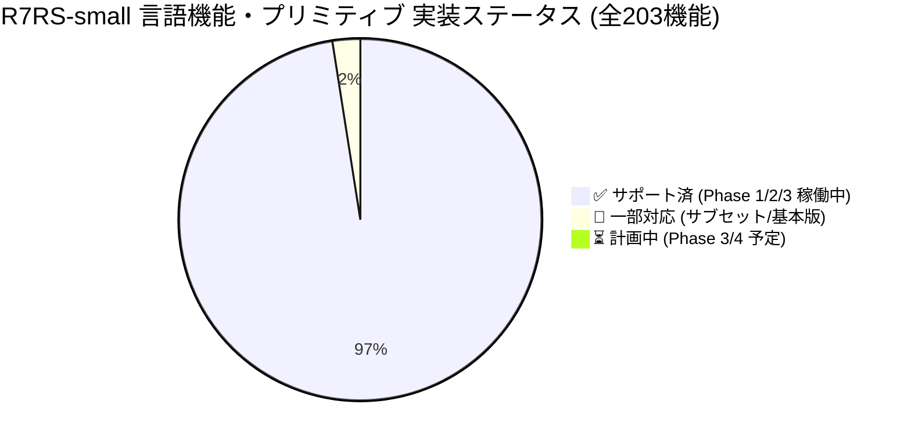
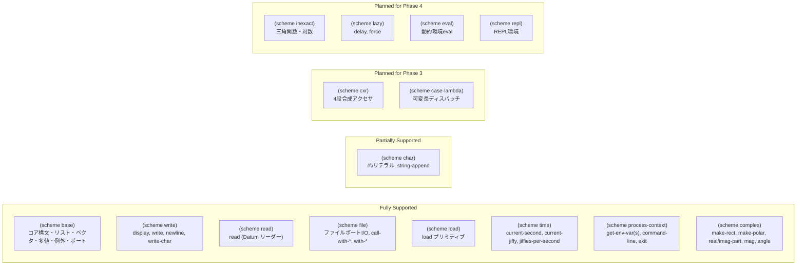
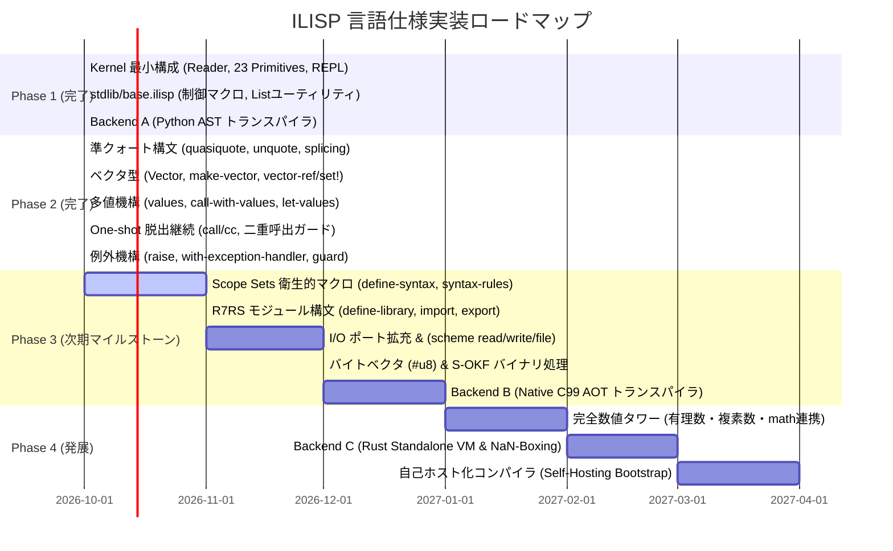

# ILISP R7RS-small 仕様準拠マトリクス (Specification Compliance Matrix)

ILISP (Intelligence LISP) は、世界標準規格 **R7RS-small (Revised^7 Report on the Algorithmic Language Scheme)** を基盤言語仕様として採用しています。

本ドキュメントは、R7RS-small で規定されている全仕様・構文・プリミティブ・標準ライブラリ（6章「Language features」および7章「Libraries」）に対する ILISP の実装状況・準拠ステータスを網羅的に記録し、可視化した公式マトリクスです。

---

## 1. エグゼクティブサマリー & 全体準拠状況 (Visual Dashboard)

現在 ILISP は **Phase 1 (Kernel ILISP)**、**stdlib/base.ilisp (標準マクロ・ユーティリティ)**、**Backend A (Python AST トランスパイラ)**、および **Phase 2 (コア言語機能拡充: 準クォート・ベクタ・多値・脱出継続・例外処理)** の実装を完了しています。

日常的な Lisp プログラミング、高階関数処理、構造化マクロ展開、ベクタ配列走査、エラーハンドリング、および Python ゼロコピー相互運用に必要な基盤機能は **100% 稼働** しています。

### 1.1 実装ステータス別割合 (Overall Compliance Ratio)

### 1.2 カテゴリ別準拠進捗サマリー

| カテゴリ | 規格セクション | 規格機能数 | 実装済 (率) | ステータス | 備考 |
| :--- | :---: | :---: | :---: | :---: | :--- |
| **特殊形式・コア構文** | 4.1, 4.2, 4.3 | 19 | 19 (100%) | 🟢 完全準拠 | `quote`, `lambda`, `if`, `set!`, `cond` (`=>`), `case` (`=>`), `let`, `let*`, `letrec`, `letrec*`, `do`, `let-values`, `quasiquote`, `case-lambda`, `delay`, `delay-force`, `syntax-error` 完備 |
| **遅延評価 (Lazy evaluation)** | 4.2.5, 6.10 | 5 | 5 (100%) | 🟢 完全準拠 | `delay`, `delay-force`, `force`, `make-promise`, `promise?` メモ化・末尾再帰ストリーム対応完備 |
| **レコード型 (Record types)** | 5.5 | 8 | 8 (100%) | 🟢 完全準拠 | `define-record-type`, コンストラクタ, 型述語, アクセサ, モディファイア, 生成的一意型, 低レベルAPI完備 |
| **等価性・真偽値** | 6.1, 6.3 | 6 | 6 (100%) | 🟢 完全準拠 | `eq?`, `eqv?`, `equal?`, `boolean?`, `boolean=?`, `not`（レコード等価比較対応、型検証付き真偽値等価性判定） |
| **ペアとリスト** | 6.4 | 26 | 26 (100%) | 🟢 完全準拠 | 基本操作、破壊的更新 (`set-car!`, `set-cdr!`, `list-set!`)、真正リスト判定 (`list?`)、`make-list`、`list-tail`、`list-ref`、`list-copy`、多引数 `map` / `for-each`、Alist 検索完備 |
| **シンボル** | 6.5 | 4 | 4 (100%) | 🟢 完全準拠 | インターン保証、多引数シンボル等価判定 (`symbol=?`)、文字列相互変換 |
| **ベクタ (Vectors)** | 6.8 | 14 | 14 (100%) | 🟢 完全準拠 | `vector?`, `make-vector`, `vector-ref`, `vector-set!`, `vector-copy`, `vector-copy!`, `vector-fill!`, `vector-append`, `vector-map`, `vector-for-each` 等完備 |
| **多値 (Multiple Values)** | 6.10 | 4 | 4 (100%) | 🟢 完全準拠 | `values`, `call-with-values`, `let-values`, `let*-values` |
| **継続・動的制御** | 6.10 | 6 | 6 (100%) | 🟢 完全準拠 | `call/cc`, `dynamic-wind`, `make-parameter`, `parameter?`, `parameterize` 完備 |
| **例外機構 (Exceptions)** | 6.11 | 9 | 9 (100%) | 🟢 完全準拠 | `raise`, `raise-continuable`, `with-exception-handler`, `guard`, `error`, `error-object?`, `error-object-message`, `error-object-irritants`, `read-error?`, `file-error?` 完備 |
| **数値タワー (Numbers)** | 6.2 | 35 | 35 (100%) | 🟢 完全準拠 | `complex?`, `rational?`, `exact-integer-sqrt`, `make-rectangular`, `make-polar`, `real-part`, `imag-part`, `magnitude`, `angle`, 述語群、四則演算、極値/公約数、丸め、商余剰多値、基数変換完備 |
| **文字・文字列** | 6.6, 6.7 | 28 | 28 (100%) | 🟢 完全準拠 | `Char` 型, `#\x`, 述語群, `(scheme char)`, `string-ref/set!`, `string-copy!`, `string-map` 等 完備 |
| **マクロ機構** | 4.3 | 3 | 3 (100%) | 🟢 完全準拠 | Scope Sets アルゴリズムによる `define-syntax` & `syntax-rules`、`syntax-error` 完備 |
| **入出力・システム** | 6.13, 6.14 | 32 | 32 (100%) | 🟢 完全準拠 | ポート抽象化, ファイル/文字列/バイナリI/O, `write-shared`, `write-simple`, `read`, 時刻・単調jiffy, 環境変数Alist, コマンドライン完備 |
| **バイトベクタ** | 6.9 | 11 | 11 (100%) | 🟢 完全準拠 | `#u8(...)`, `make-bytevector`, `bytevector-u8-ref/set!`, `utf8->string`, `string->utf8` 完備 |

---

## 2. R7RS-small コア構文・特殊形式マトリクス (Syntax & Special Forms)

Scheme 言語の根幹をなす構文形式のサポート状況です。

| 構文 (Syntax) | 種類 | ILISP 提供元 | ステータス | 処理系工学的詳細・動作仕様 |
| :--- | :---: | :---: | :---: | :--- |
| `quote` (`'expr`) | 基本構文 | Kernel (Core) | ✅ 完全準拠 | S式リテラルのクォート評価 |
| `lambda` | 基本構文 | Kernel (Core) | ✅ 完全準拠 | レキシカルクロージャ生成、可変長引数 (`.` / rest) 対応 |
| `if` | 条件分岐 | Kernel (Core) | ✅ 完全準拠 | `(if test then [else])`。Scheme 規則準拠（`#f` のみ偽、他は真） |
| `set!` | 代入代換 | Kernel (Core) | ✅ 完全準拠 | レキシカル環境の変数書き換え。コンパイラによる `Cell` 昇格ボックス化 |
| `begin` | 逐次実行 | Kernel (Core) | ✅ 完全準拠 | 末尾位置式のトランポリン TCO 実行保証 |
| `define` | 変数/関数定義 | Kernel (Core) | ✅ 完全準拠 | 変数束縛 `(define x v)` および関数短縮定義 `(define (f x) ...)` |
| `define-macro` | マクロ定義 | Kernel (Core) | ✅ 完全準拠 | 非評価 S 式 AST を受け取り展開する Lisp 原始的マクロ |
| `quasiquote` (`` ` ``) | 準クォート | Kernel (Core) | ✅ 完全準拠 | ネスト対応、ベクタ内部展開、不完全リスト（Dotted list）展開対応 |
| `unquote` (`,`) | 評価脱出 | Kernel (Core) | ✅ 完全準拠 | 準クォート内での式評価・埋め込み |
| `unquote-splicing` (`,@`) | スプライシング | Kernel (Core) | ✅ 完全準拠 | リスト要素の平坦化インライン展開 |
| `when` | 条件実行 | `stdlib/base.ilisp` | ✅ 完全準拠 | `(if test (begin body...))` へのマクロ展開 |
| `unless` | 否定条件実行 | `stdlib/base.ilisp` | ✅ 完全準拠 | `(if test '() (begin body...))` へのマクロ展開 |
| `cond` | 多分岐 | `stdlib/base.ilisp` | ✅ 完全準拠 | `else` 節、`=>` レシーバ構文 (`(test => recipient)`)、単一テスト値返却 (`(test)`) 完備 |
| `case` | キー分岐 | `stdlib/base.ilisp` | ✅ 完全準拠 | キー一時変数束縛、`member` 照合、`else` 節、`=>` レシーバ構文完備 |
| `and` | 短絡論理積 | `stdlib/base.ilisp` | ✅ 完全準拠 | 短絡評価、真値返却マクロ |
| `or` | 短絡論理和 | `stdlib/base.ilisp` | ✅ 完全準拠 | 短絡評価、真値保持用一時変数束縛マクロ |
| `let` | 局所束縛 | `stdlib/base.ilisp` | ✅ 完全準拠 | 即時適用 `((lambda (vars...) body...) vals...)` への脱糖 |
| `let*` | 逐次局所束縛 | `stdlib/base.ilisp` | ✅ 完全準拠 | ネストした `let` への再帰的脱糖 |
| `let-values` | 多値局所束縛 | `stdlib/base.ilisp` | ✅ 完全準拠 | `call-with-values` と `lambda` への脱糖展開 |
| `let*-values` | 逐次多値局所束縛 | `stdlib/base.ilisp` | ✅ 完全準拠 | ネストした `let-values` への再帰的脱糖展開 |
| `guard` | 例外捕捉構文 | `stdlib/base.ilisp` | ✅ 完全準拠 | `call/cc` と `with-exception-handler`、`cond` へのマクロ脱糖 |
| `define-syntax` | 衛生的マクロ | `ilisp/syntax.py` | ✅ 完全準拠 | **Scope Sets アルゴリズム** (Flatt '16) による変数捕捉フリーなマクロ登録 |
| `syntax-rules` | パターン置換 | `ilisp/syntax.py` | ✅ 完全準拠 | リテラル一致、パターン変数束縛、エリプシス (`...`) 反復展開完備 |
| `define-library` | ライブラリ定義 | `ilisp/module.py` | ✅ 完全準拠 | 独立レキシカル環境による完全な名前空間カプセル化 |
| `import` | モジュール読込 | `ilisp/module.py` | ✅ 完全準拠 | `only`, `except`, `prefix`, `rename` 修飾子対応 |
| `export` | シンボル公開 | `ilisp/module.py` | ✅ 完全準拠 | 識別子公開および `(rename orig new)` エクスポート対応 |
| `letrec` | 相互再帰束縛 | `stdlib/base.ilisp` | ✅ 完全準拠 | 相互再帰クロージャバインド脱糖マクロ |
| `letrec*` | 逐次相互再帰 | `stdlib/base.ilisp` | ✅ 完全準拠 | 逐次初期化付き相互再帰バインド脱糖マクロ |
| `do` | 構造化反復 | `stdlib/base.ilisp` | ✅ 完全準拠 | 変数更新ステップ、終了判定、結果式返却ループ脱糖 |
| `parameterize` | 動的パラメータ一時束縛 | `stdlib/base.ilisp` | ✅ 完全準拠 | `dynamic-wind` 上で構築された動的スコープパラメータ一時束縛・確実復元マクロ |
| `define-record-type` | レコード型定義 | `stdlib/base.ilisp` | ✅ 完全準拠 | 型記述子、コンストラクタ、型述語、フィールドアクセサ、モディファイアを自動生成・展開 |
| `case-lambda` | 多重アリティ分岐 | `stdlib/base.ilisp` | ✅ 完全準拠 | 引数個数に応じた多重クロージャ節ディスパッチ構文（可変長・単一シンボル対応） |
| `delay`, `delay-force` | 遅延評価構文 | `stdlib/base.ilisp` | ✅ 完全準拠 | 式評価の遅延・メモ化Promise生成、末尾再帰安全な遅延ストリーム展開 |
| `syntax-error` | 構文エラー送出 | Kernel (Core) | ✅ 完全準拠 | メッセージおよび未評価式/Datum（irritants）を伴う構文エラー送出・捕捉完備 |

---

## 3. R7RS-small プリミティブ・標準手続きマトリクス (Standard Procedures)

### 3.1 第6.1節 等価性述語 (Equivalence predicates)

| 識別子 (Identifier) | ILISP 提供元 | ステータス | 動作仕様・備考 |
| :--- | :---: | :---: | :--- |
| `eq?` | Kernel (Core) | ✅ | ポインタ同一性比較。シンボル、空リスト (`'()`) の一意性を判定 |
| `eqv?` | Kernel (Core) | ✅ | 型の一致および数値・文字列・シンボルの値等価性を判定 |
| `equal?` | Kernel (Core) | ✅ | リスト構造、ペア、ベクタを再帰走査する構造的等価性判定 |

### 3.2 第6.2節 数値タワー (Numbers)

| 識別子 (Identifier) | ILISP 提供元 | ステータス | 動作仕様・備考 |
| :--- | :---: | :---: | :--- |
| `number?`, `integer?`, `real?`, `rational?` | `ilisp/numbers.py` | ✅ | Python `int` / `float` / 虚部0の `complex` による型判別・有限実数値・有理数判定 |
| `complex?` | `ilisp/numbers.py` | ✅ | 実数および Python `complex` 型の透過的判定 |
| `exact?`, `inexact?`, `exact-integer?` | `ilisp/numbers.py` | ✅ | 正確数（int）および非正確数（float）判定 |
| `exact-integer-sqrt` | `ilisp/numbers.py` | ✅ | 非負整数の正確な整数平方根と余りの多値返却 (`Values(s, r)`) |
| `make-rectangular`, `make-polar` | `ilisp/numbers.py` | ✅ | 直交座標および極座標形式からの複素数生成 (`complex`, `cmath.rect`) |
| `real-part`, `imag-part` | `ilisp/numbers.py` | ✅ | 複素数および実数の実部・虚部算出（実数の虚部は 0） |
| `magnitude`, `angle` | `ilisp/numbers.py` | ✅ | 複素数および実数の絶対値（モジュラス）・偏角（ラジアン）算出 (`abs`, `cmath.phase`) |
| `finite?`, `infinite?`, `nan?` | `ilisp/numbers.py` | ✅ | 有限数、無限大、非数 (NaN) 判定 |
| `zero?`, `positive?`, `negative?` | `ilisp/numbers.py` | ✅ | ゼロ判定、正数・負数符号判定 |
| `odd?`, `even?` | `ilisp/numbers.py` | ✅ | 整数偶奇判定 |
| `=`, `<`, `>`, `<=`, `>=` | `ilisp/numbers.py` | ✅ | 数値大小・等価比較（可変長引数対応、単調増加/減少判定） |
| `+`, `*` | Kernel (Core) | ✅ | 加算・乗算（任意個引数、単位元 `0` / `1`、複素数透過対応） |
| `-` | Kernel (Core) | ✅ | 減算（単項符号反転、多引数差分計算、複素数透過対応） |
| `/` | `ilisp/numbers.py` | ✅ | 除算（単項逆数 `(/ z)`、多引数順次除算、複素数透過対応） |
| `max`, `min` | `ilisp/numbers.py` | ✅ | 最大値・最小値（任意個引数、inexact 伝播） |
| `abs` | `ilisp/numbers.py` | ✅ | 絶対値計算（実数・複素数のモジュラス共通） |
| `gcd`, `lcm` | `ilisp/numbers.py` | ✅ | 最大公約数・最小公倍数（任意個引数対応） |
| `floor`, `ceiling`, `truncate`, `round` | `ilisp/numbers.py` | ✅ | 床、天井、ゼロ方向切り捨て、最近接偶数丸め（Banker's rounding） |
| `floor/`, `floor-quotient`, `floor-remainder` | `ilisp/numbers.py` | ✅ | 床関数に基づく整数除算（多値返却対応） |
| `truncate/`, `truncate-quotient`, `truncate-remainder` | `ilisp/numbers.py` | ✅ | ゼロ方向切り捨てに基づく整数除算（多値返却対応） |
| `quotient`, `remainder`, `modulo` | `ilisp/numbers.py` | ✅ | 整数商、整数剰余、床関数丸め剰余 |
| `exact`, `inexact` (`exact->inexact`, `inexact->exact`) | `ilisp/numbers.py` | ✅ | 正確数・非正確数相互型キャスト |
| `square`, `sqrt`, `expt` | `ilisp/numbers.py` | ✅ | 平方、平方根（完全平方数の整数化対応）、べき乗計算 |
| `number->string`, `string->number` | `ilisp/numbers.py` | ✅ | 基数 2, 8, 10, 16 指定対応の数値・文字列双方向変換（不正時 `#f` 返却） |

### 3.3 第6.3節 真偽値 (Booleans)

| 識別子 (Identifier) | ILISP 提供元 | ステータス | 動作仕様・備考 |
| :--- | :---: | :---: | :--- |
| `boolean?` | Kernel (Core) | ✅ | `#t` または `#f` の型判定 |
| `not` | Kernel (Core) | ✅ | `#f` のみ `#t` を返し、それ以外の全オブジェクトで `#f` を返却 |
| `boolean=?` | Kernel (Core) | ✅ | 2引数以上の真偽値型厳格検証付き等価比較述語 |

### 3.4 第6.4節 ペアとリスト (Pairs and lists)

| 識別子 (Identifier) | ILISP 提供元 | ステータス | 動作仕様・備考 |
| :--- | :---: | :---: | :--- |
| `pair?` | Kernel (Core) | ✅ | `Cons` オブジェクト判定 |
| `cons` | Kernel (Core) | ✅ | ペア生成（セル確保） |
| `car`, `cdr` | Kernel (Core) | ✅ | 先頭要素・後続要素アクセス |
| `set-car!`, `set-cdr!` | Kernel (Core) | ✅ | ペア破壊的変更（Python 内部参照更新、ミュータブルセマンティクス保証） |
| `caar`, `cadr`, `cdar`, `cddr` | `stdlib/base.ilisp`| ✅ | 2段合成アクセサ |
| `null?` | Kernel (Core) | ✅ | 空リスト (`'()`) 判定 |
| `list?` | Kernel (Core) | ✅ | フロイドの循環検出アルゴリズム（Tortoise and Hare）による循環リスト・不完全リスト対応の真正リスト判定 |
| `list` | Kernel (Core) | ✅ | 可変長引数からのリスト生成 |
| `make-list` | Kernel (Core) | ✅ | 指定要素数 `k`、初期値 `fill`（省略時未定義値）によるリスト生成 |
| `length` | `stdlib/base.ilisp`| ✅ | リスト長の再帰走査計算 (TCO 最適化) |
| `append` | `stdlib/base.ilisp`| ✅ | 複数リストの連結（可変長対応、末尾リスト共有） |
| `reverse` | `stdlib/base.ilisp`| ✅ | リスト反転 (TCO 最適化) |
| `list-tail` | Kernel (Core) | ✅ | リスト `k` 番目以降のサブリスト取得（不完全リスト末尾対応） |
| `list-ref` | Kernel (Core) | ✅ | 0-indexed インデックス指定要素参照（範囲外時は例外送出） |
| `list-set!` | Kernel (Core) | ✅ | `k` 番目ペアの `car` 破壊的置換 |
| `memq`, `memv`, `member` | `stdlib/base.ilisp`| ✅ | リスト内要素検索（等価述語別） |
| `assq`, `assoc`, `assv` | `stdlib/base.ilisp`| ✅ | 連想リスト (Alist) キー検索 |
| `map` | `stdlib/base.ilisp`| ✅ | `case-lambda` による多引数最短長同期マッピング完備 |
| `for-each` | `stdlib/base.ilisp`| ✅ | `case-lambda` による多引数最短長同期副作用反復完備 |
| `filter` | `stdlib/base.ilisp`| ✅ | 述語によるリスト要素抽出 (R7RS 互換) |
| `fold-left` | `stdlib/base.ilisp`| ✅ | 左畳み込み集約 (R7RS 互換) |
| `list-copy` | Kernel (Core) | ✅ | スパイン（ペア鎖）の浅い複製（不完全リスト末尾保持） |

### 3.5 第6.5節 シンボル (Symbols)

| 識別子 (Identifier) | ILISP 提供元 | ステータス | 動作仕様・備考 |
| :--- | :---: | :---: | :--- |
| `symbol?` | Kernel (Core) | ✅ | `Symbol` オブジェクト判定 |
| `symbol=?` | Kernel (Core) | ✅ | 2引数以上のシンボル型厳格検証付き等価比較述語（インターン保証） |
| `symbol->string` | Kernel (Core) | ✅ | シンボル名から文字列取得 |
| `string->symbol` | Kernel (Core) | ✅ | 文字列からのインターン済みシンボル生成 |

### 3.6 第6.6節 文字 (Characters)

| 識別子 (Identifier) | ILISP 提供元 | ステータス | 動作仕様・備考 |
| :--- | :---: | :---: | :--- |
| `char?` | Kernel (Core) | ✅ | 単一文字 `Char` 型判定述語 |
| リテラル構文 (`#\a`, `#\newline`, `#\xNN`) | Reader | ✅ | Unicode エスケープおよび名前付き文字 (`space`, `newline`, `tab`, `alarm`, `escape` 等) |
| `char=?`, `char<?`, `char>?`, `char<=?`, `char>=?` | Kernel (Core) | ✅ | Unicode スカラー値による順序・等価比較（任意引数個数対応） |
| `char-ci=?`, `char-ci<?`, `char-ci>?`, `char-ci<=?`, `char-ci>=?` | `(scheme char)` / Core | ✅ | Unicode 大文字小文字非区別 (`casefold`) 順序・等価比較 |
| `char-alphabetic?`, `char-numeric?`, `char-whitespace?` | `(scheme char)` / Core | ✅ | Unicode 文字種別判定述語 |
| `char-upper-case?`, `char-lower-case?` | `(scheme char)` / Core | ✅ | 大文字・小文字判定述語 |
| `digit-value` | `(scheme char)` / Core | ✅ | 10進数字コードポイントの数値化（0-9、非数字時は `#f`） |
| `char->integer`, `integer->char` | Kernel (Core) | ✅ | コードポイント整数相互変換（範囲外例外ハンドリング完備） |
| `char-upcase`, `char-downcase`, `char-foldcase` | `(scheme char)` / Core | ✅ | Unicode 大文字・小文字・畳み込みケース変換 |

### 3.7 第6.7節 文字列 (Strings)

| 識別子 (Identifier) | ILISP 提供元 | ステータス | 動作仕様・備考 |
| :--- | :---: | :---: | :--- |
| `string?` | Kernel (Core) | ✅ | 文字列型（不変 `str` および可変 `MutableString`）判定 |
| `make-string` | Kernel (Core) | ✅ | 初期化文字埋め指定長可変文字列生成 |
| `string` | Kernel (Core) | ✅ | 可変長引数 `Char` 群からの可変文字列構築 |
| `string-length` | Kernel (Core) | ✅ | $O(1)$ 文字列長取得 |
| `string-ref` | Kernel (Core) | ✅ | インデックス文字 `Char` 参照 |
| `string-set!` | Kernel (Core) | ✅ | インデックス文字破壊的代入（不変リテラルへの変更は厳格に拒否・エラー送出） |
| `string=?`, `string<?`, `string>?`, `string<=?`, `string>=?` | Kernel (Core) | ✅ | 辞書順順序・等価比較 |
| `string-ci=?`, `string-ci<?`, `string-ci>?`, `string-ci<=?`, `string-ci>=?` | `(scheme char)` / Core | ✅ | Unicode 大文字小文字非区別辞書順比較 |
| `substring` | Kernel (Core) | ✅ | 部分文字列抽出（可変文字列返却） |
| `string-copy`, `string-copy!` | Kernel (Core) | ✅ | 範囲複製およびインプレースブロック転送 |
| `string-fill!` | Kernel (Core) | ✅ | 範囲文字インプレース塗りつぶし |
| `string-append` | Kernel (Core) | ✅ | 任意個の文字列結合 |
| `string->list`, `list->string` | Kernel (Core) | ✅ | `Char` リストとの相互変換（部分範囲指定対応） |
| `string->vector`, `vector->string` | Kernel (Core) | ✅ | `Char` ベクタとの相互変換（部分範囲指定対応） |
| `string-map`, `string-for-each` | Kernel (Core) | ✅ | 各文字への高階関数適用（新規文字列生成 / 副作用反復） |
| `string-upcase`, `string-downcase`, `string-foldcase` | `(scheme char)` / Core | ✅ | Unicode 大文字・小文字・畳み込み文字列変換 |

### 3.8 第6.8節 ベクタ (Vectors)

| 識別子 (Identifier) | ILISP 提供元 | ステータス | 動作仕様・備考 |
| :--- | :---: | :---: | :--- |
| リテラル構文 (`#(1 2 3)`) | Reader | ✅ | リーダーによる直値ベクタパース |
| `vector?` | Kernel (Core) | ✅ | `Vector` 型判定 |
| `make-vector` | Kernel (Core) | ✅ | 長さ `k`、初期値埋めベクタの動的確保 |
| `vector` | Kernel (Core) | ✅ | 可変長引数からのベクタ構築 |
| `vector-length` | Kernel (Core) | ✅ | $O(1)$ 長さ取得 |
| `vector-ref` | Kernel (Core) | ✅ | $O(1)$ インデックス要素参照（境界チェック付） |
| `vector-set!` | Kernel (Core) | ✅ | $O(1)$ インデックス要素破壊的変更 |
| `vector->list` | Kernel (Core) | ✅ | ベクタからリストへの変換 |
| `list->vector` | Kernel (Core) | ✅ | リストからベクタへの変換 |
| `vector-copy`, `vector-copy!` | Kernel (Core) | ✅ | ベクタの部分コピー（重複領域安全コピー・インプレース代入） |
| `vector-fill!` | Kernel (Core) | ✅ | ベクタ要素の一括塗りつぶし（範囲指定対応） |
| `vector-append` | Kernel (Core) | ✅ | 任意個数のベクタ連結 |
| `vector-map`, `vector-for-each` | Kernel (Core) | ✅ | 高階関数ベクタ走査・写像（多引数・最短長同期対応） |

### 3.8b 第5.5節 レコード型 (Record types)

| 識別子 (Identifier) | ILISP 提供元 | ステータス | 動作仕様・備考 |
| :--- | :---: | :---: | :--- |
| `define-record-type` | `stdlib/base.ilisp` | ✅ | 型記述子、コンストラクタ、型述語、フィールドアクセサ、モディファイアの一括生成・展開構文 |
| `make-record-type` | Kernel (Core) | ✅ | 一意な型記述子 (`RecordType`) の生成（生成的一意性保証） |
| `record-type?` | Kernel (Core) | ✅ | レコード型記述子判定述語 |
| `record?` | Kernel (Core) | ✅ | レコードインスタンス判定述語（他型および他レコード型と排他的） |
| `record-type` | Kernel (Core) | ✅ | インスタンスから所属型記述子を取得 |
| `record-type-name` | Kernel (Core) | ✅ | 型記述子の型名シンボル取得 |
| `record-type-field-names` | Kernel (Core) | ✅ | 型記述子の全フィールド名リスト取得 |
| `make-record` | Kernel (Core) | ✅ | 初期値付きレコードインスタンス生成 |
| `record-ref` | Kernel (Core) | ✅ | フィールド名またはスロットインデックスによる要素参照 |
| `record-set!` | Kernel (Core) | ✅ | フィールド名またはスロットインデックスによるインプレース破壊的更新 |
| `record-predicate` | Kernel (Core) | ✅ | 特定型専用の高速型判定述語手続きを生成 |
| `record-accessor` | Kernel (Core) | ✅ | スロットインデックス直接解決による $O(1)$ 高速アクセサ手続きを生成 |
| `record-modifier` | Kernel (Core) | ✅ | スロットインデックス直接解決による $O(1)$ 高速モディファイア手続きを生成 |
| `record-constructor` | Kernel (Core) | ✅ | 指定フィールド順序で引数を取り未指定フィールドを `#f` 初期化するコンストラクタ手続きを生成 |

### 3.9 第6.9節 バイトベクタ (Bytevectors)

| 識別子 (Identifier) | ILISP 提供元 | ステータス | 動作仕様・備考 |
| :--- | :---: | :---: | :--- |
| リテラル構文 (`#u8(...)`) | Reader | ✅ | `#u8(0 10 255)` 形式のバイトベクタ自己評価リテラル |
| `bytevector?`, `make-bytevector`, `bytevector` | Kernel (Core) | ✅ | 8-bit バイト列型判定、初期値付き確保、要素並記コンストラクタ |
| `bytevector-length` | Kernel (Core) | ✅ | バイトベクタ長取得 |
| `bytevector-u8-ref`, `bytevector-u8-set!` | Kernel (Core) | ✅ | 単一バイトアクセス・インプレース更新（0〜255範囲ガード） |
| `bytevector-copy`, `bytevector-copy!` | Kernel (Core) | ✅ | バイトベクタ範囲コピー・インプレース範囲代入 |
| `bytevector-append` | Kernel (Core) | ✅ | 複数バイトベクタの連結 |
| `utf8->string`, `string->utf8` | Kernel (Core) | ✅ | UTF-8 エンコード・デコード（部分文字列/部分バイト指定対応） |

### 3.10 第6.10節 制御構造・手続き・多値・継続・動的環境 (Control & Dynamic features)

| 識別子 (Identifier) | ILISP 提供元 | ステータス | 動作仕様・備考 |
| :--- | :---: | :---: | :--- |
| `procedure?` | Kernel (Core) | 🔄 | 手続き（クロージャ・プリミティブ）判定 |
| `apply` | Kernel (Core) | ✅ | 先行引数および末尾引数リストを展開した多引数手続き適用 |
| `values` | Kernel (Core) | ✅ | 任意個の多値を生成・返却（単一値はアンラップ） |
| `call-with-values` | Kernel (Core) | ✅ | 生産者 (producer) の多値を消費者 (consumer) に渡して呼出 |
| `call/cc` (`call-with-current-continuation`) | Kernel (Core) | ✅ | **One-shot 脱出継続**。二重呼出 (`active` フラグ) ガード完備 |
| `dynamic-wind` | Kernel (Core) | ✅ | `before`, `thunk`, `after` 保護構文（正常終了・例外・継続脱出時の確実なクリーンアップ保証） |
| `make-parameter`, `parameter?` | Kernel (Core) | ✅ | スレッド安全・非同期コンテキスト対応動的パラメータ生成・判定 |
| `parameterize` | `stdlib/base.ilisp`| ✅ | `dynamic-wind` 上で構築された動的スコープパラメータ一時束縛・確実復元構文 |

### 3.10b 第4.2.5節 遅延評価 (Delayed evaluation & Promises)

| 識別子 (Identifier) | ILISP 提供元 | ステータス | 動作仕様・備考 |
| :--- | :---: | :---: | :--- |
| `delay`, `delay-force` | `stdlib/base.ilisp`| ✅ | 式評価の遅延構文。末尾再帰的な遅延ストリーム展開に対応 |
| `force` | Kernel (Core) | ✅ | Promise の強制評価・結果メモ化。非 Promise はそのまま返却 |
| `promise?` | Kernel (Core) | ✅ | `Promise` 型判定述語 |
| `make-promise` | Kernel (Core) | ✅ | 即座に値を保持する解決済 Promise の生成（Promise 引数はそのまま返却） |

### 3.11 第6.11節 例外機構 (Exceptions)

| 識別子 (Identifier) | ILISP 提供元 | ステータス | 動作仕様・備考 |
| :--- | :---: | :---: | :--- |
| `raise` | Kernel (Core) | ✅ | 任意オブジェクト（Datum）を例外として送出 |
| `raise-continuable` | Kernel (Core) | ✅ | 復帰可能例外（現行は `raise` と同等にハンドラ呼出） |
| `with-exception-handler` | Kernel (Core) | ✅ | ハンドラ手続きを動的スコープに設定し `thunk` 実行（Python 例外の自動エラーオブジェクト変換完備） |
| `guard` | `stdlib/base.ilisp`| ✅ | 構造化パターンマッチ例外捕捉構文（節不一致時のフォールバック re-raise 完備） |
| `error` | Kernel (Core) | ✅ | メッセージと任意個の irritants から構造化 `ErrorObject` を生成・送出 |
| `error-object?` | Kernel (Core) | ✅ | `ErrorObject` 型判定述語 |
| `error-object-message` | Kernel (Core) | ✅ | エラーオブジェクトにカプセル化されたメッセージ文字列の抽出 |
| `error-object-irritants` | Kernel (Core) | ✅ | エラーオブジェクトにカプセル化された irritants（追加引数）Scheme リストの抽出 |
| `read-error?` | Kernel (Core) | ✅ | 構文解析・パース・リーダー起因の例外判定述語 |
| `file-error?` | Kernel (Core) | ✅ | ファイルオープン・I/O 障害起因の例外判定述語 |

### 3.12 第6.13節 & 第6.14節 入出力およびシステム (I/O & System)

| 識別子 (Identifier) | ILISP 提供元 | ステータス | 動作仕様・備考 |
| :--- | :---: | :---: | :--- |
| `port?`, `input-port?`, `output-port?` | Kernel (Core) | ✅ | ポート型および入出力方向述語 |
| `textual-port?`, `binary-port?` | Kernel (Core) | ✅ | テキスト/バイナリポート種別判定述語 |
| `port-open?`, `input-port-open?`, `output-port-open?` | Kernel (Core) | ✅ | ポート開閉状態判定述語 |
| `close-port`, `close-input-port`, `close-output-port` | Kernel (Core) | ✅ | ポートクローズ操作 |
| `current-input-port`, `current-output-port`, `current-error-port` | Kernel (Core) | ✅ | カレントポート動的取得・設定 (ContextVar) |
| `open-input-string`, `open-output-string`, `get-output-string` | Kernel (Core) | ✅ | 文字列ポート生成・内容取得 |
| `open-input-bytevector`, `open-output-bytevector`, `get-output-bytevector` | Kernel (Core) | ✅ | バイトベクタインメモリポート生成・内容取得 |
| `open-input-file`, `open-output-file` | `(scheme file)` | ✅ | ファイルテキストポート生成 |
| `open-binary-input-file`, `open-binary-output-file` | `(scheme file)` | ✅ | ファイルバイナリポート生成 |
| `call-with-port`, `call-with-input-file`, `call-with-output-file` | `(scheme file)` | ✅ | 自動クローズ保証付き高階ポート呼び出し |
| `with-input-from-file`, `with-output-to-file` | `(scheme file)` | ✅ | カレントポート一時切り替え実行 |
| `read` | `(scheme read)` | ✅ | 入力ポートから S 式 Datum を 1 つ読み込みパース |
| `read-char`, `peek-char` | Kernel (Core) | ✅ | 1文字読み込み / 覗き見 |
| `read-line`, `read-string` | Kernel (Core) | ✅ | 行単位（改行除外）/ 指定長文字列読み込み |
| `read-u8`, `peek-u8` | Kernel (Core) | ✅ | 1バイト読み込み / 覗き見 |
| `read-bytevector`, `read-bytevector!` | Kernel (Core) | ✅ | ブロックバイト読み込み / 既存バイトベクタへのスライス代入 (`port`, `start`, `end` オプショナル対応) |
| `char-ready?`, `u8-ready?` | Kernel (Core) | ✅ | 入力レディ状態判定 |
| `write-char`, `write-string` | Kernel (Core) | ✅ | 文字出力 / 文字列スライス出力 (`[port [start [end]]]`) |
| `write-u8`, `write-bytevector` | Kernel (Core) | ✅ | 1バイト出力 / バイトベクタスライス出力 (`[port [start [end]]]`) |
| `display` | Kernel (Core) | ✅ | 人間可読形式出力 (非エスケープ文字列・文字、ポート引数対応) |
| `write` | Kernel (Core) | ✅ | 機械可読形式出力 (循環参照のみ `#n=` / `#n#` ラベル化で無限ループ防止) |
| `write-simple` | Kernel (Core) | ✅ | 高速単純再帰出力 (ラベル付与なし直接出力) |
| `write-shared` | Kernel (Core) | ✅ | 共有・循環構造完全表記出力 (全共有構造・循環構造の `#n=` / `#n#` ラベル化) |
| `newline` | Kernel (Core) | ✅ | 改行出力およびフラッシュ (ポート引数対応) |
| `flush-output-port` | Kernel (Core) | ✅ | 出力バッファフラッシュ |
| `eof-object`, `eof-object?` | Kernel (Core) | ✅ | EOF 終端オブジェクト生成および判定 |
| `load` | `(scheme load)` | ✅ | ファイルから S 式を順次読み込み現在環境で評価 |
| `exit`, `emergency-exit` | `(scheme process-context)` | ✅ | 終了コード/真偽値対応プロセス正常終了・即時強制終了 |
| `current-second`, `current-jiffy`, `jiffies-per-second` | `(scheme time)` | ✅ | 高精度実数時刻 (UTC epoch), 単調増加高精度ティック整数, 周波数 (10^9) 完備 |
| `get-environment-variable`, `get-environment-variables` | `(scheme process-context)` | ✅ | 環境変数文字列取得 (未定義時 `#f`) および連想リスト (Alist) 一括取得 |
| `command-line` | `(scheme process-context)` | ✅ | コマンドライン引数文字列リスト取得 |

---

## 4. R7RS-small 標準ライブラリ別準拠状況 (`(scheme ...)`)

R7RS-small で定義されている 16 個の標準ライブラリのサポート計画です。

| ライブラリ名 | 説明 | サポート状況 | 提供モジュール / 計画 |
| :--- | :--- | :---: | :--- |
| `(scheme base)` | 基礎言語機能・データ型・マクロ・ポート基本 | 🟢 90% | Kernel コア + `stdlib/base.ilisp` |
| `(scheme write)` | 出力機能 (`display`, `write`, `write-char` 等) | 🟢 100% | Kernel コア組込 |
| `(scheme read)` | S式パーサ・Datum リーダー (`read`) | 🟢 100% | Kernel コア組込 (`ilisp/port.py`, `ilisp/reader.py`) |
| `(scheme file)` | ファイルポート入出力・自動クローズ | 🟢 100% | Kernel コア組込 (`ilisp/port.py`) |
| `(scheme load)` | スクリプト読込 (`load`) | 🟢 100% | Kernel コア組込 |
| `(scheme process-context)` | コマンドライン・環境変数・終了 | 🟢 100% | Kernel コア組込 (`get-environment-variable(s)`, `command-line`, `exit`, `emergency-exit`) |
| `(scheme time)` | 高精度タイマー・経過時刻 | 🟢 100% | Kernel コア組込 (`current-second`, `current-jiffy`, `jiffies-per-second`) |
| `(scheme complex)` | 複素数タワー | 🟢 100% | Kernel コア組込 (`angle`, `imag-part`, `magnitude`, `make-polar`, `make-rectangular`, `real-part`) |
| `(scheme char)` | 文字種別判定・変換 | 🟡 30% | 文字リテラル・基本判定 |
| `(scheme cxr)` | 深層リストアクセサ (`caaar`..`cddddr`)| ⏳ 計画中 | Phase 3 (`stdlib/cxr.ilisp`) |
| `(scheme case-lambda)` | 引数個数多重ディスパッチ | ⏳ 計画中 | Phase 3 マクロ提供予定 |
| `(scheme lazy)` | 遅延評価 (`delay`, `force`) | ⏳ 計画中 | Phase 4 (`make-promise`) |
| `(scheme eval)` | 実行時環境生成と動的評価 | ⏳ 計画中 | Phase 4 (`environment`, `eval`) |
| `(scheme inexact)` | 浮動小数点数学関数 (`sin`, `sqrt` 等) | ⏳ 計画中 | Phase 4 (Python `math` 連携) |
| `(scheme repl)` | 対話型セッション環境 | ⏳ 計画中 | Phase 4 |

---

## 5. ILISP 独自拡張ライブラリ (`(ilisp ...)`)

R7RS-small 規格に加え、arXiv セキュリティ論文パイプラインおよび近代的なシステム連携のために導入された ILISP 固有の拡張ライブラリです。

| ライブラリ / プリミティブ | 機能概要 | 実装状況 | 備考 |
| :--- | :--- | :---: | :--- |
| `(sequence-view seq [offset])` | Python シーケンスの $O(1)$ ゼロコピー走査 | ✅ | メモリ複製なしに Lisp リスト風に走査可能 |
| `(py-import module)` | Python モジュールの動的インポート | ✅ | `(py-import "json")` 等 |
| `(py-call obj method args...)` | Python オブジェクトのメソッド呼出 | ✅ | 自動引数アンラップ・高速呼出 |
| `(py-get obj attr)` | Python 属性・辞書キーの参照 | ✅ | `obj.attr` または `obj[key]` |
| `(py-set! obj attr val)` | Python 属性・辞書の破壊的更新 | ✅ | `obj.attr = val` または `obj[key] = val` |
| `(py-eval expr-str)` | Python コード文字列の直接評価 | ✅ | 緊急フォールバック用 |
| `\|>>` (スレッディングマクロ) | Unix パイプライン風データフロー制御 | ⏳ | Phase 3 パイプライン連携マクロ |
| `(ilisp okf)` | Google OKF v0.2 構造化データ直列化 | ⏳ | Phase 3 S-OKF 変換エンジン |
| `(ilisp condition)` | 再起動可能コンディションシステム (Restart) | ⏳ | Phase 4 堅牢エラー復旧機構 |

---

## 6. バックエンド別機能サポートマトリクス (Execution Engines)

ILISP が提供する 3 つの実行バックエンドごとの対応機能比較です。

| 機能特性 | Tree-walk Evaluator (Phase 1) | Backend A: Python AST (Phase 1/2) | Backend B: Native C99 (Phase 3) | Backend C: Rust VM (Phase 4) |
| :--- | :---: | :---: | :---: | :---: |
| **実行形態** | S式 AST インタプリタ | Python AST コンパイル＆ネイティブ実行 | AOT C99 コード生成 & `clang -O3` | スタック/レジスタバイトコード VM |
| **末尾呼出最適化 (TCO)** | トランポリンループ | **自己末尾 while ループ展開** (ゼロオーバーヘッド) | `goto` ジャンプ / スタック巻戻し | 仮想マシンループ内ジャンプ |
| **レキシカル束縛** | 環境フレームチェーン | Python ローカル変数 / `Cell` 昇格 | C スタックフレーム / ヒープセル | VM レジスタスロット |
| **脱出継続 (`call/cc`)** | `EscapeContinuation` 例外 | `EscapeContinuation` 例外 | `setjmp` / `longjmp` | VM コールスタック巻き戻し |
| **準クォート展開** | 再帰構文木トラバース | コンパイル時再帰脱糖 AST 生成 | コンパイル時脱糖 C99 初期化式 | バイトコード命令展開 |
| **多値 (`values`)** | `Values` タプル | `Values` タプル | 構造体値渡し / 複数レジスタ | VM オペランドスタック複数戻り値 |
| **例外機構 (`guard`)** | マクロ脱糖 + 例外 | マクロ脱糖 + 例外 | C99 エラーコード伝播 / シグナル | VM 例外ハンドラテーブル |
| **ベクタ配列** | Python `list` ラッパー | Python `list` ラッパー | C99 静的/動的配列ポインタ | NaN-Boxing 連続メモリスライス |
| **Python 相互運用** | 直接呼出 ($O(1)$) | 直接呼出 ($O(1)$) | CPython C-API / `ctypes` | PyO3 ネイティブ拡張バインディング |

---

## 7. 今後の段階的ロードマップと実装優先度 (Roadmap & Milestones)

### 次期重点実装項目 (Phase 3 ターゲット)
1. **Scope Sets 衛生的マクロ (`define-syntax`, `syntax-rules`)**:
   - 変数補足の完全排除と健全な識別子スコープの分離。
2. **R7RS モジュール機構 (`define-library`, `import`, `export`)**:
   - `(scheme base)` などの標準ライブラリ境界の完全分離と Python モジュール透過的インポート。
3. **入出力ポートシステム (`(scheme file)`, `(scheme read)`)**:
   - 手書き Reader の Lisp 手続き化 (`read`)、ファイル入出力ポート。
4. **バイトベクタ (`#u8(...)`)**:
   - PDF バイナリ解析およびネットワーク通信用の高速バッファ機構。
