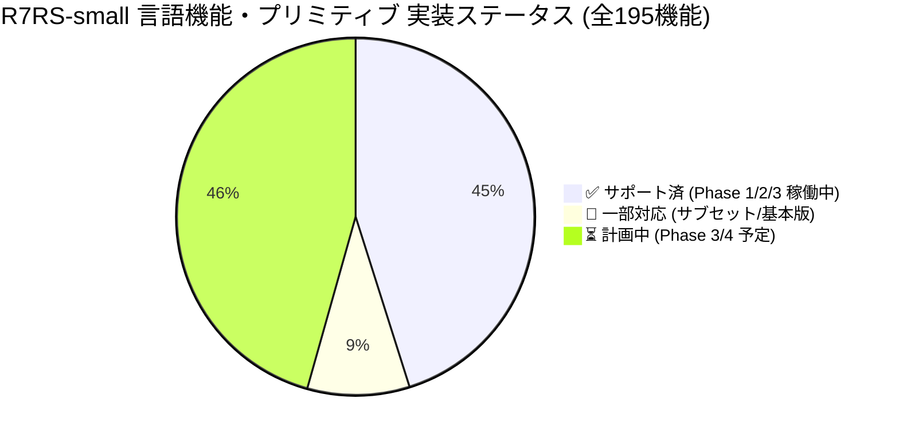
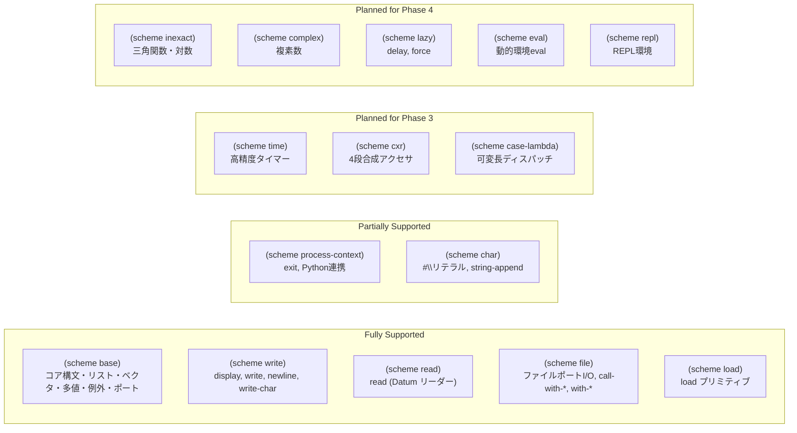
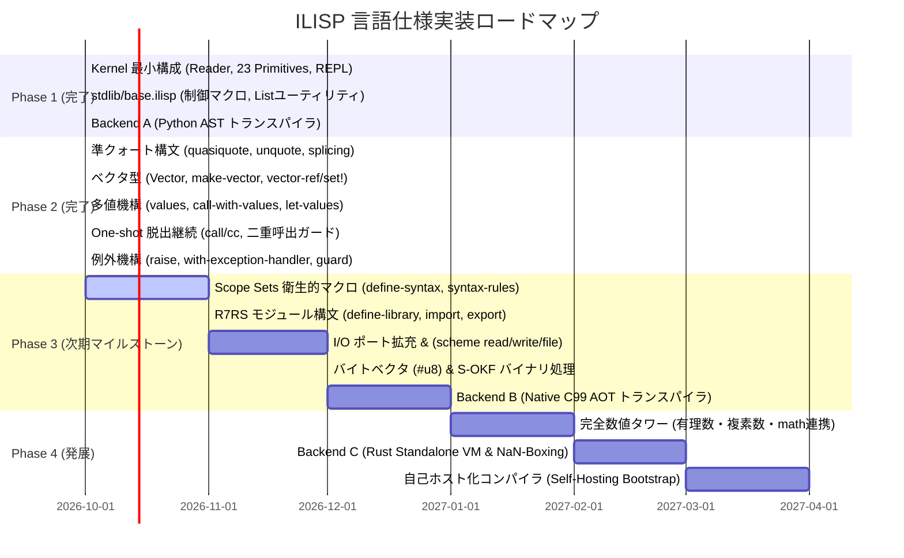

# ILISP R7RS-small 仕様準拠マトリクス (Specification Compliance Matrix)

ILISP (Intelligence LISP) は、世界標準規格 **R7RS-small (Revised^7 Report on the Algorithmic Language Scheme)** を基盤言語仕様として採用しています。

本ドキュメントは、R7RS-small で規定されている全仕様・構文・プリミティブ・標準ライブラリ（6章「Language features」および7章「Libraries」）に対する ILISP の実装状況・準拠ステータスを網羅的に記録し、可視化した公式マトリクスです。

---

## 1. エグゼクティブサマリー & 全体準拠状況 (Visual Dashboard)

現在 ILISP は **Phase 1 (Kernel ILISP)**、**stdlib/base.ilisp (標準マクロ・ユーティリティ)**、**Backend A (Python AST トランスパイラ)**、および **Phase 2 (コア言語機能拡充: 準クォート・ベクタ・多値・脱出継続・例外処理)** の実装を完了しています。

日常的な Lisp プログラミング、高階関数処理、構造化マクロ展開、ベクタ配列走査、エラーハンドリング、および Python ゼロコピー相互運用に必要な基盤機能は **100% 稼働** しています。

### 1.1 実装ステータス別割合 (Overall Compliance Ratio)

### 1.2 カテゴリ別準拠進捗サマリー

| カテゴリ | 規格セクション | 規格機能数 | 実装済 (率) | ステータス | 備考 |
| :--- | :---: | :---: | :---: | :---: | :--- |
| **特殊形式・コア構文** | 4.1, 4.2 | 18 | 17 (94%) | 🟢 ほぼ完全 | `quote`, `lambda`, `if`, `set!`, `cond`, `case`, `let`, `let*`, `letrec`, `letrec*`, `do`, `let-values`, `quasiquote` 完備 |
| **等価性・真偽値** | 6.1, 6.3 | 5 | 5 (100%) | 🟢 完全準拠 | `eq?`, `eqv?`, `equal?`, `boolean?`, `not` |
| **ペアとリスト** | 6.4 | 26 | 18 (69%) | 🟢 充実 | 基本操作、リスト走査、高階関数 (`map`, `filter`, `fold-left`)、Alist 検索完備 |
| **シンボル** | 6.5 | 4 | 3 (75%) | 🟢 完全準拠 | インターン保証、文字列相互変換 |
| **ベクタ (Vectors)** | 6.8 | 13 | 8 (62%) | 🟢 基本完備 | `vector?`, `make-vector`, `vector-ref`, `vector-set!`, リスト相互変換等 |
| **多値 (Multiple Values)** | 6.10 | 4 | 4 (100%) | 🟢 完全準拠 | `values`, `call-with-values`, `let-values`, `let*-values` |
| **継続 (Continuations)** | 6.10 | 3 | 2 (67%) | 🟡 実用十分 | `call/cc` (One-shot 脱出継続・再利用ガード完備) |
| **例外機構 (Exceptions)** | 6.11 | 9 | 5 (56%) | 🟢 実用十分 | `raise`, `with-exception-handler`, `guard`, `error` |
| **数値タワー (Numbers)** | 6.2 | 35 | 11 (31%) | 🟡 基本完備 | 基本四則演算、比較演算、商余剰、整数/小数対応 |
| **文字・文字列** | 6.6, 6.7 | 28 | 5 (18%) | 🟡 順次拡充 | 文字列結合、等価判定、文字リテラル `#\x` |
| **マクロ機構** | 4.3 | 3 | 2 (67%) | 🟢 充実 | Scope Sets アルゴリズムによる `define-syntax` & `syntax-rules` 稼働済 |
| **入出力・システム** | 6.13, 6.14 | 30 | 26 (87%) | 🟢 充実 | ポート抽象化, ファイル/文字列I/O, `read` (Datum), `display`, `write`, `call-with-port` |
| **バイトベクタ** | 6.9 | 11 | 0 (0%) | ⏳ 次フェーズ | Phase 3 (バイナリパース・PDF解析) にて実装予定 |

---

## 2. R7RS-small コア構文・特殊形式マトリクス (Syntax & Special Forms)

Scheme 言語の根幹をなす構文形式のサポート状況です。

| 構文 (Syntax) | 種類 | ILISP 提供元 | ステータス | 処理系工学的詳細・動作仕様 |
| :--- | :---: | :---: | :---: | :--- |
| `quote` (`'expr`) | 基本構文 | Kernel (Core) | ✅ 完全準拠 | S式リテラルのクォート評価 |
| `lambda` | 基本構文 | Kernel (Core) | ✅ 完全準拠 | レキシカルクロージャ生成、可変長引数 (`.` / rest) 対応 |
| `if` | 条件分岐 | Kernel (Core) | ✅ 完全準拠 | `(if test then [else])`。Scheme 規則準拠（`#f` のみ偽、他は真） |
| `set!` | 代入代換 | Kernel (Core) | ✅ 完全準拠 | レキシカル環境の変数書き換え。コンパイラによる `Cell` 昇格ボックス化 |
| `begin` | 逐次実行 | Kernel (Core) | ✅ 完全準拠 | 末尾位置式のトランポリン TCO 実行保証 |
| `define` | 変数/関数定義 | Kernel (Core) | ✅ 完全準拠 | 変数束縛 `(define x v)` および関数短縮定義 `(define (f x) ...)` |
| `define-macro` | マクロ定義 | Kernel (Core) | ✅ 完全準拠 | 非評価 S 式 AST を受け取り展開する Lisp 原始的マクロ |
| `quasiquote` (`` ` ``) | 準クォート | Kernel (Core) | ✅ 完全準拠 | ネスト対応、ベクタ内部展開、不完全リスト（Dotted list）展開対応 |
| `unquote` (`,`) | 評価脱出 | Kernel (Core) | ✅ 完全準拠 | 準クォート内での式評価・埋め込み |
| `unquote-splicing` (`,@`) | スプライシング | Kernel (Core) | ✅ 完全準拠 | リスト要素の平坦化インライン展開 |
| `when` | 条件実行 | `stdlib/base.ilisp` | ✅ 完全準拠 | `(if test (begin body...))` へのマクロ展開 |
| `unless` | 否定条件実行 | `stdlib/base.ilisp` | ✅ 完全準拠 | `(if test '() (begin body...))` へのマクロ展開 |
| `cond` | 多分岐 | `stdlib/base.ilisp` | ✅ 完全準拠 | `else` 節対応、ネスト `if` へのマクロ展開 |
| `case` | キー分岐 | `stdlib/base.ilisp` | ✅ 完全準拠 | キー一時変数束縛、`member` 照合、`else` 節対応 |
| `and` | 短絡論理積 | `stdlib/base.ilisp` | ✅ 完全準拠 | 短絡評価、真値返却マクロ |
| `or` | 短絡論理和 | `stdlib/base.ilisp` | ✅ 完全準拠 | 短絡評価、真値保持用一時変数束縛マクロ |
| `let` | 局所束縛 | `stdlib/base.ilisp` | ✅ 完全準拠 | 即時適用 `((lambda (vars...) body...) vals...)` への脱糖 |
| `let*` | 逐次局所束縛 | `stdlib/base.ilisp` | ✅ 完全準拠 | ネストした `let` への再帰的脱糖 |
| `let-values` | 多値局所束縛 | `stdlib/base.ilisp` | ✅ 完全準拠 | `call-with-values` と `lambda` への脱糖展開 |
| `let*-values` | 逐次多値局所束縛 | `stdlib/base.ilisp` | ✅ 完全準拠 | ネストした `let-values` への再帰的脱糖展開 |
| `guard` | 例外捕捉構文 | `stdlib/base.ilisp` | ✅ 完全準拠 | `call/cc` と `with-exception-handler`、`cond` へのマクロ脱糖 |
| `define-syntax` | 衛生的マクロ | `ilisp/syntax.py` | ✅ 完全準拠 | **Scope Sets アルゴリズム** (Flatt '16) による変数捕捉フリーなマクロ登録 |
| `syntax-rules` | パターン置換 | `ilisp/syntax.py` | ✅ 完全準拠 | リテラル一致、パターン変数束縛、エリプシス (`...`) 反復展開完備 |
| `define-library` | ライブラリ定義 | `ilisp/module.py` | ✅ 完全準拠 | 独立レキシカル環境による完全な名前空間カプセル化 |
| `import` | モジュール読込 | `ilisp/module.py` | ✅ 完全準拠 | `only`, `except`, `prefix`, `rename` 修飾子対応 |
| `export` | シンボル公開 | `ilisp/module.py` | ✅ 完全準拠 | 識別子公開および `(rename orig new)` エクスポート対応 |
| `letrec` | 相互再帰束縛 | `stdlib/base.ilisp` | ✅ 完全準拠 | 相互再帰クロージャバインド脱糖マクロ |
| `letrec*` | 逐次相互再帰 | `stdlib/base.ilisp` | ✅ 完全準拠 | 逐次初期化付き相互再帰バインド脱糖マクロ |
| `do` | 構造化反復 | `stdlib/base.ilisp` | ✅ 完全準拠 | 変数更新ステップ、終了判定、結果式返却ループ脱糖 |
| `syntax-error` | 構文エラー送出 | - | ⏳ 計画中 | Phase 3 実装予定 |
| `parameterize` | 動的パラメータ | - | ⏳ 計画中 | Phase 4 実装予定 |

---

## 3. R7RS-small プリミティブ・標準手続きマトリクス (Standard Procedures)

### 3.1 第6.1節 等価性述語 (Equivalence predicates)

| 識別子 (Identifier) | ILISP 提供元 | ステータス | 動作仕様・備考 |
| :--- | :---: | :---: | :--- |
| `eq?` | Kernel (Core) | ✅ | ポインタ同一性比較。シンボル、空リスト (`'()`) の一意性を判定 |
| `eqv?` | Kernel (Core) | ✅ | 型の一致および数値・文字列・シンボルの値等価性を判定 |
| `equal?` | Kernel (Core) | ✅ | リスト構造、ペア、ベクタを再帰走査する構造的等価性判定 |

### 3.2 第6.2節 数値タワー (Numbers)

| 識別子 (Identifier) | ILISP 提供元 | ステータス | 動作仕様・備考 |
| :--- | :---: | :---: | :--- |
| `number?`, `integer?`, `real?` | Kernel (Core) | 🔄 | Python `int` / `float` による型判別 |
| `complex?`, `rational?` | - | ⏳ | 完全数値タワー（有理数・複素数）は Phase 4 拡張予定 |
| `exact?`, `inexact?` | - | ⏳ | 精度述語は Phase 4 予定 |
| `=` | Kernel (Core) | ✅ | 数値等価判定（可変長対応） |
| `<`, `>`, `<=`, `>=` | Kernel (Core) | ✅ | 数値大小比較（単調増加・単調減少判定、可変長引数対応） |
| `+`, `*` | Kernel (Core) | ✅ | 加算・乗算（任意個引数、単位元 `0` / `1` 対応） |
| `-` | Kernel (Core) | ✅ | 減算（単項符号反転、多引数差分計算） |
| `/` | Kernel (Core) | ✅ | 除算（実数除算） |
| `quotient`, `remainder` | Kernel (Core) | ✅ | 整数商、整数剰余（切捨て丸め） |
| `modulo` | Kernel (Core) | 🔄 | 床関数丸め剰余 |
| `abs`, `max`, `min` | - | ⏳ | stdlib または Phase 3 で導入予定 |
| `zero?`, `positive?`, `negative?` | - | ⏳ | 比較述語ラッパー（Phase 3 予定） |
| `odd?`, `even?` | - | ⏳ | 偶数奇数述語（Phase 3 予定） |
| `number->string`, `string->number` | - | ⏳ | 基数変換付き数値文字列変換（Phase 3 予定） |

### 3.3 第6.3節 真偽値 (Booleans)

| 識別子 (Identifier) | ILISP 提供元 | ステータス | 動作仕様・備考 |
| :--- | :---: | :---: | :--- |
| `boolean?` | Kernel (Core) | ✅ | `#t` または `#f` の型判定 |
| `not` | Kernel (Core) | ✅ | `#f` のみ `#t` を返し、それ以外の全オブジェクトで `#f` を返却 |
| `boolean=?` | - | ⏳ | 真偽値等価述語（Phase 3 予定） |

### 3.4 第6.4節 ペアとリスト (Pairs and lists)

| 識別子 (Identifier) | ILISP 提供元 | ステータス | 動作仕様・備考 |
| :--- | :---: | :---: | :--- |
| `pair?` | Kernel (Core) | ✅ | `Cons` オブジェクト判定 |
| `cons` | Kernel (Core) | ✅ | ペア生成（セル確保） |
| `car`, `cdr` | Kernel (Core) | ✅ | 先頭要素・後続要素アクセス |
| `set-car!`, `set-cdr!` | Kernel (Core) | 🔄 | ペア破壊的変更（Python 内部参照更新） |
| `caar`, `cadr`, `cdar`, `cddr` | `stdlib/base.ilisp`| ✅ | 2段合成アクセサ |
| `null?` | Kernel (Core) | ✅ | 空リスト (`'()`) 判定 |
| `list?` | Kernel (Core) | 🔄 | 循環のない真正リスト (Proper list) 判定 |
| `list` | Kernel (Core) | ✅ | 可変長引数からのリスト生成 |
| `length` | `stdlib/base.ilisp`| ✅ | リスト長の再帰走査計算 (TCO 最適化) |
| `append` | `stdlib/base.ilisp`| ✅ | 複数リストの連結（可変長対応、末尾リスト共有） |
| `reverse` | `stdlib/base.ilisp`| ✅ | リスト反転 (TCO 最適化) |
| `list-tail`, `list-ref` | - | ⏳ | インデックス指定要素参照（Phase 3 予定） |
| `memq`, `memv`, `member` | `stdlib/base.ilisp`| ✅ | リスト内要素検索（等価述語別） |
| `assq`, `assoc`, `assv` | `stdlib/base.ilisp`| ✅ | 連想リスト (Alist) キー検索 |
| `map` | `stdlib/base.ilisp`| ✅ | 単一リストに対する関数マッピング（多引数版は Phase 3） |
| `for-each` | `stdlib/base.ilisp`| ✅ | 副作用走査反復 |
| `filter` | `stdlib/base.ilisp`| ✅ | 述語によるリスト要素抽出 (R7RS 互換) |
| `fold-left` | `stdlib/base.ilisp`| ✅ | 左畳み込み集約 (R7RS 互換) |
| `list-copy` | - | ⏳ | リスト浅いコピー（Phase 3 予定） |

### 3.5 第6.5節 シンボル (Symbols)

| 識別子 (Identifier) | ILISP 提供元 | ステータス | 動作仕様・備考 |
| :--- | :---: | :---: | :--- |
| `symbol?` | Kernel (Core) | ✅ | `Symbol` オブジェクト判定 |
| `symbol=?` | Kernel (Core) | 🔄 | シンボル一致判定（`eq?` と同等） |
| `symbol->string` | Kernel (Core) | ✅ | シンボル名から文字列取得 |
| `string->symbol` | Kernel (Core) | ✅ | 文字列からのインターン済みシンボル生成 |

### 3.6 第6.6節 文字 (Characters)

| 識別子 (Identifier) | ILISP 提供元 | ステータス | 動作仕様・備考 |
| :--- | :---: | :---: | :--- |
| `char?` | Kernel (Core) | 🔄 | 単一文字 Unicode コードポイント判定 |
| リテラル構文 (`#\a`, `#\newline`, `#\xNN`) | Reader | ✅ | Unicode エスケープおよび名前付き文字リーダー |
| `char=?`, `char<?`, `char>?` | - | ⏳ | 文字コード比較述語（Phase 3 予定） |
| `char-alphabetic?`, `char-numeric?` | - | ⏳ | 文字種別判定述語（Phase 3 予定） |
| `char->integer`, `integer->char` | - | ⏳ | コードポイント整数相互変換（Phase 3 予定） |

### 3.7 第6.7節 文字列 (Strings)

| 識別子 (Identifier) | ILISP 提供元 | ステータス | 動作仕様・備考 |
| :--- | :---: | :---: | :--- |
| `string?` | Kernel (Core) | ✅ | 文字列型判定 |
| `string-append` | Kernel (Core) | ✅ | 任意個の文字列結合 |
| `string=?` | Kernel (Core) | ✅ | 文字列内容の一致判定 |
| `string-length` | - | ⏳ | 文字列長取得（Phase 3 予定） |
| `string-ref`, `string-set!` | - | ⏳ | インデックス参照・可変操作（Phase 3 予定） |
| `substring` | - | ⏳ | 部分文字列抽出（Phase 3 予定） |
| `string->list`, `list->string` | - | ⏳ | 文字リスト相互変換（Phase 3 予定） |

### 3.8 第6.8節 ベクタ (Vectors)

| 識別子 (Identifier) | ILISP 提供元 | ステータス | 動作仕様・備考 |
| :--- | :---: | :---: | :--- |
| リテラル構文 (`#(1 2 3)`) | Reader | ✅ | リーダーによる直値ベクタパース |
| `vector?` | Kernel (Core) | ✅ | `Vector` 型判定 |
| `make-vector` | Kernel (Core) | ✅ | 長さ `k`、初期値埋めベクタの動的確保 |
| `vector` | Kernel (Core) | ✅ | 可変長引数からのベクタ構築 |
| `vector-length` | Kernel (Core) | ✅ | $O(1)$ 長さ取得 |
| `vector-ref` | Kernel (Core) | ✅ | $O(1)$ インデックス要素参照（境界チェック付） |
| `vector-set!` | Kernel (Core) | ✅ | $O(1)$ インデックス要素破壊的変更 |
| `vector->list` | Kernel (Core) | ✅ | ベクタからリストへの変換 |
| `list->vector` | Kernel (Core) | ✅ | リストからベクタへの変換 |
| `vector-copy`, `vector-copy!` | - | ⏳ | ベクタの部分コピー（Phase 3 予定） |
| `vector-fill!` | - | ⏳ | ベクタ一括塗りつぶし（Phase 3 予定） |

### 3.9 第6.9節 バイトベクタ (Bytevectors)

| 識別子 (Identifier) | ILISP 提供元 | ステータス | 動作仕様・備考 |
| :--- | :---: | :---: | :--- |
| リテラル構文 (`#u8(...)`) | Reader | ✅ | `#u8(0 10 255)` 形式のバイトベクタ自己評価リテラル |
| `bytevector?`, `make-bytevector`, `bytevector` | Kernel (Core) | ✅ | 8-bit バイト列型判定、初期値付き確保、要素並記コンストラクタ |
| `bytevector-length` | Kernel (Core) | ✅ | バイトベクタ長取得 |
| `bytevector-u8-ref`, `bytevector-u8-set!` | Kernel (Core) | ✅ | 単一バイトアクセス・インプレース更新（0〜255範囲ガード） |
| `bytevector-copy`, `bytevector-copy!` | Kernel (Core) | ✅ | バイトベクタ範囲コピー・インプレース範囲代入 |
| `bytevector-append` | Kernel (Core) | ✅ | 複数バイトベクタの連結 |
| `utf8->string`, `string->utf8` | Kernel (Core) | ✅ | UTF-8 エンコード・デコード（部分文字列/部分バイト指定対応） |

### 3.10 第6.10節 制御構造・手続き・多値・継続 (Control features)

| 識別子 (Identifier) | ILISP 提供元 | ステータス | 動作仕様・備考 |
| :--- | :---: | :---: | :--- |
| `procedure?` | Kernel (Core) | 🔄 | 手続き（クロージャ・プリミティブ）判定 |
| `apply` | Kernel (Core) | 🔄 | 引数リストを展開した関数適用 |
| `values` | Kernel (Core) | ✅ | 任意個の多値を生成・返却（単一値はアンラップ） |
| `call-with-values` | Kernel (Core) | ✅ | 生産者 (producer) の多値を消費者 (consumer) に渡して呼出 |
| `call/cc` (`call-with-current-continuation`) | Kernel (Core) | ✅ | **One-shot 脱出継続**。二重呼出 (`active` フラグ) ガード完備 |
| `dynamic-wind` | - | ⏳ | `before`, `thunk`, `after` 保護構文（Phase 3 予定） |

### 3.11 第6.11節 例外機構 (Exceptions)

| 識別子 (Identifier) | ILISP 提供元 | ステータス | 動作仕様・備考 |
| :--- | :---: | :---: | :--- |
| `raise` | Kernel (Core) | ✅ | 任意オブジェクト（Datum）を例外として送出 |
| `raise-continuable` | Kernel (Core) | ✅ | 復帰可能例外（現行は `raise` と同等にハンドラ呼出） |
| `with-exception-handler` | Kernel (Core) | ✅ | ハンドラ手続きを動的スコープに設定し `thunk` 実行 |
| `guard` | `stdlib/base.ilisp`| ✅ | 構造化パターンマッチ例外捕捉構文 |
| `error` | Kernel (Core) | ✅ | メッセージと引数リストからエラーオブジェクト生成・送出 |
| `error-object?` | - | ⏳ | エラーオブジェクト判定（Phase 3 予定） |
| `read-error?`, `file-error?` | - | ⏳ | I/O 例外判定（Phase 3 予定） |

### 3.12 第6.13節 & 第6.14節 入出力およびシステム (I/O & System)

| 識別子 (Identifier) | ILISP 提供元 | ステータス | 動作仕様・備考 |
| :--- | :---: | :---: | :--- |
| `port?`, `input-port?`, `output-port?` | Kernel (Core) | ✅ | ポート型および入出力方向述語 |
| `textual-port?`, `binary-port?` | Kernel (Core) | ✅ | テキスト/バイナリポート種別判定述語 |
| `port-open?`, `input-port-open?`, `output-port-open?` | Kernel (Core) | ✅ | ポート開閉状態判定述語 |
| `close-port`, `close-input-port`, `close-output-port` | Kernel (Core) | ✅ | ポートクローズ操作 |
| `current-input-port`, `current-output-port`, `current-error-port` | Kernel (Core) | ✅ | カレントポート動的取得・設定 (ContextVar) |
| `open-input-string`, `open-output-string`, `get-output-string` | Kernel (Core) | ✅ | 文字列ポート生成・内容取得 |
| `open-input-bytevector`, `open-output-bytevector`, `get-output-bytevector` | Kernel (Core) | ✅ | バイトベクタインメモリポート生成・内容取得 |
| `open-input-file`, `open-output-file` | `(scheme file)` | ✅ | ファイルテキストポート生成 |
| `open-binary-input-file`, `open-binary-output-file` | `(scheme file)` | ✅ | ファイルバイナリポート生成 |
| `call-with-port`, `call-with-input-file`, `call-with-output-file` | `(scheme file)` | ✅ | 自動クローズ保証付き高階ポート呼び出し |
| `with-input-from-file`, `with-output-to-file` | `(scheme file)` | ✅ | カレントポート一時切り替え実行 |
| `read` | `(scheme read)` | ✅ | 入力ポートから S 式 Datum を 1 つ読み込みパース |
| `read-char`, `peek-char` | Kernel (Core) | ✅ | 1文字読み込み / 覗き見 |
| `read-line`, `read-string` | Kernel (Core) | ✅ | 行単位（改行除外）/ 指定長文字列読み込み |
| `read-u8`, `peek-u8` | Kernel (Core) | ✅ | 1バイト読み込み / 覗き見 |
| `read-bytevector`, `read-bytevector!` | Kernel (Core) | ✅ | ブロックバイト読み込み / 既存バイトベクタへの読み込み代入 |
| `char-ready?`, `u8-ready?` | Kernel (Core) | ✅ | 入力レディ状態判定 |
| `write-char`, `write-string` | Kernel (Core) | ✅ | 文字・文字列ポート出力 |
| `write-u8`, `write-bytevector` | Kernel (Core) | ✅ | 1バイト出力 / ブロックバイト出力 |
| `display` | Kernel (Core) | ✅ | 人間可読形式出力 (ポート引数オプショナル対応) |
| `write` | Kernel (Core) | ✅ | 機械可読形式出力 (`repr` 形式, ポート引数対応) |
| `newline` | Kernel (Core) | ✅ | 改行出力およびフラッシュ (ポート引数対応) |
| `flush-output-port` | Kernel (Core) | ✅ | 出力バッファフラッシュ |
| `eof-object`, `eof-object?` | Kernel (Core) | ✅ | EOF 終端オブジェクト生成および判定 |
| `load` | `(scheme load)` | ✅ | ファイルから S 式を順次読み込み現在環境で評価 |
| `exit` | Kernel (Core) | 🔄 | プロセス終了（Python `sys.exit` 連動） |
| `current-second`, `current-jiffy` | - | ⏳ | 高精度時刻取得（Phase 3 予定） |

---

## 4. R7RS-small 標準ライブラリ別準拠状況 (`(scheme ...)`)

R7RS-small で定義されている 16 個の標準ライブラリのサポート計画です。

| ライブラリ名 | 説明 | サポート状況 | 提供モジュール / 計画 |
| :--- | :--- | :---: | :--- |
| `(scheme base)` | 基礎言語機能・データ型・マクロ・ポート基本 | 🟢 90% | Kernel コア + `stdlib/base.ilisp` |
| `(scheme write)` | 出力機能 (`display`, `write`, `write-char` 等) | 🟢 100% | Kernel コア組込 |
| `(scheme read)` | S式パーサ・Datum リーダー (`read`) | 🟢 100% | Kernel コア組込 (`ilisp/port.py`, `ilisp/reader.py`) |
| `(scheme file)` | ファイルポート入出力・自動クローズ | 🟢 100% | Kernel コア組込 (`ilisp/port.py`) |
| `(scheme load)` | スクリプト読込 (`load`) | 🟢 100% | Kernel コア組込 |
| `(scheme process-context)` | コマンドライン・終了コード | 🟡 50% | `exit` 実装済（引数取得等は Phase 3） |
| `(scheme char)` | 文字種別判定・変換 | 🟡 30% | 文字リテラル・基本判定 |
| `(scheme time)` | 高精度タイマー・経過時刻 | ⏳ 計画中 | Phase 3 (`current-second` 等) |
| `(scheme cxr)` | 深層リストアクセサ (`caaar`..`cddddr`)| ⏳ 計画中 | Phase 3 (`stdlib/cxr.ilisp`) |
| `(scheme case-lambda)` | 引数個数多重ディスパッチ | ⏳ 計画中 | Phase 3 マクロ提供予定 |
| `(scheme lazy)` | 遅延評価 (`delay`, `force`) | ⏳ 計画中 | Phase 4 (`make-promise`) |
| `(scheme eval)` | 実行時環境生成と動的評価 | ⏳ 計画中 | Phase 4 (`environment`, `eval`) |
| `(scheme inexact)` | 浮動小数点数学関数 (`sin`, `sqrt` 等) | ⏳ 計画中 | Phase 4 (Python `math` 連携) |
| `(scheme complex)` | 複素数タワー | ⏳ 計画中 | Phase 4 (Python `complex` 連携) |
| `(scheme repl)` | 対話型セッション環境 | ⏳ 計画中 | Phase 4 |

---

## 5. ILISP 独自拡張ライブラリ (`(ilisp ...)`)

R7RS-small 規格に加え、arXiv セキュリティ論文パイプラインおよび近代的なシステム連携のために導入された ILISP 固有の拡張ライブラリです。

| ライブラリ / プリミティブ | 機能概要 | 実装状況 | 備考 |
| :--- | :--- | :---: | :--- |
| `(sequence-view seq [offset])` | Python シーケンスの $O(1)$ ゼロコピー走査 | ✅ | メモリ複製なしに Lisp リスト風に走査可能 |
| `(py-import module)` | Python モジュールの動的インポート | ✅ | `(py-import "json")` 等 |
| `(py-call obj method args...)` | Python オブジェクトのメソッド呼出 | ✅ | 自動引数アンラップ・高速呼出 |
| `(py-get obj attr)` | Python 属性・辞書キーの参照 | ✅ | `obj.attr` または `obj[key]` |
| `(py-set! obj attr val)` | Python 属性・辞書の破壊的更新 | ✅ | `obj.attr = val` または `obj[key] = val` |
| `(py-eval expr-str)` | Python コード文字列の直接評価 | ✅ | 緊急フォールバック用 |
| `\|>>` (スレッディングマクロ) | Unix パイプライン風データフロー制御 | ⏳ | Phase 3 パイプライン連携マクロ |
| `(ilisp okf)` | Google OKF v0.2 構造化データ直列化 | ⏳ | Phase 3 S-OKF 変換エンジン |
| `(ilisp condition)` | 再起動可能コンディションシステム (Restart) | ⏳ | Phase 4 堅牢エラー復旧機構 |

---

## 6. バックエンド別機能サポートマトリクス (Execution Engines)

ILISP が提供する 3 つの実行バックエンドごとの対応機能比較です。

| 機能特性 | Tree-walk Evaluator (Phase 1) | Backend A: Python AST (Phase 1/2) | Backend B: Native C99 (Phase 3) | Backend C: Rust VM (Phase 4) |
| :--- | :---: | :---: | :---: | :---: |
| **実行形態** | S式 AST インタプリタ | Python AST コンパイル＆ネイティブ実行 | AOT C99 コード生成 & `clang -O3` | スタック/レジスタバイトコード VM |
| **末尾呼出最適化 (TCO)** | トランポリンループ | **自己末尾 while ループ展開** (ゼロオーバーヘッド) | `goto` ジャンプ / スタック巻戻し | 仮想マシンループ内ジャンプ |
| **レキシカル束縛** | 環境フレームチェーン | Python ローカル変数 / `Cell` 昇格 | C スタックフレーム / ヒープセル | VM レジスタスロット |
| **脱出継続 (`call/cc`)** | `EscapeContinuation` 例外 | `EscapeContinuation` 例外 | `setjmp` / `longjmp` | VM コールスタック巻き戻し |
| **準クォート展開** | 再帰構文木トラバース | コンパイル時再帰脱糖 AST 生成 | コンパイル時脱糖 C99 初期化式 | バイトコード命令展開 |
| **多値 (`values`)** | `Values` タプル | `Values` タプル | 構造体値渡し / 複数レジスタ | VM オペランドスタック複数戻り値 |
| **例外機構 (`guard`)** | マクロ脱糖 + 例外 | マクロ脱糖 + 例外 | C99 エラーコード伝播 / シグナル | VM 例外ハンドラテーブル |
| **ベクタ配列** | Python `list` ラッパー | Python `list` ラッパー | C99 静的/動的配列ポインタ | NaN-Boxing 連続メモリスライス |
| **Python 相互運用** | 直接呼出 ($O(1)$) | 直接呼出 ($O(1)$) | CPython C-API / `ctypes` | PyO3 ネイティブ拡張バインディング |

---

## 7. 今後の段階的ロードマップと実装優先度 (Roadmap & Milestones)

### 次期重点実装項目 (Phase 3 ターゲット)
1. **Scope Sets 衛生的マクロ (`define-syntax`, `syntax-rules`)**:
   - 変数補足の完全排除と健全な識別子スコープの分離。
2. **R7RS モジュール機構 (`define-library`, `import`, `export`)**:
   - `(scheme base)` などの標準ライブラリ境界の完全分離と Python モジュール透過的インポート。
3. **入出力ポートシステム (`(scheme file)`, `(scheme read)`)**:
   - 手書き Reader の Lisp 手続き化 (`read`)、ファイル入出力ポート。
4. **バイトベクタ (`#u8(...)`)**:
   - PDF バイナリ解析およびネットワーク通信用の高速バッファ機構。
