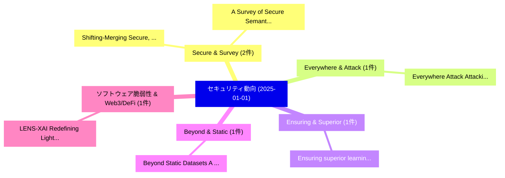

# 📅 02_daily: 日次エグゼクティブサマリー報告書 (2025-01-01)

**集計日時**: 2026-10-02 23:05:13 UTC  
**対象日付**: 2025-01-01  
**本日収集論文数**: 12 件  

---

## 💡 主要セキュリティ動向・脅威インサイト (Executive Insights)

本日の収集論文（計 12 件）において、以下の重点セキュリティ領域で活発な研究動向が確認されました：
- **Secure & Survey** (2 件): 注目論文として 「Shifting-Merging: Secure, High...」、「A Survey of Secure Semantic Co...」 等が発表され、実務防御および攻撃検証の進展が見られます。
- **Everywhere & Attack** (1 件): 注目論文として 「Everywhere Attack: Attacking L...」 等が発表され、実務防御および攻撃検証の進展が見られます。
- **Ensuring & Superior** (1 件): 注目論文として 「Ensuring superior learning out...」 等が発表され、実務防御および攻撃検証の進展が見られます。
- **Beyond & Static** (1 件): 注目論文として 「Beyond Static Datasets: A Beha...」 等が発表され、実務防御および攻撃検証の進展が見られます。
- **ソフトウェア脆弱性 & Web3/DeFi** (1 件): 注目論文として 「LENS-XAI: Redefining Lightweig...」 等が発表され、実務防御および攻撃検証の進展が見られます。

### 🗺️ 技術・脅威トピックマインドマップ

---

## 📌 日次セキュリティ論文一覧 (日本語表形式)

| No | arXiv ID | 論文タイトル (日本語訳) | 重要キーワード | 構造化エグゼクティブ要約 (背景・提案・影響) | 脅威分類 | 詳細リンク |
|---|---|---|---|---|---|---|
| 1 | `2501.00707v1` | [Everywhere Attack: Attacking Locally and Globally to Boost Targeted Transferability（セキュリティ分析論文）](../../okf/papers/2025-01-01/2501.00707.md) | `Boost Targeted Transferability`, `Everywhere Attack`, `Attacking Locally` | 【提案】概要 (Overview & Key Finding) 本論文「Everywhere Attack: Attacking Locally and Globally to Bo...。実証評価により経営層・セキュリティ管理者向け推奨アクション (E... | `cs.CR` | [arXiv](https://arxiv.org/abs/2501.00707v1) &#124; [OKF](../../okf/papers/2025-01-01/2501.00707.md) |
| 2 | `2501.00754v1` | [Ensuring superior learning outcomes and data security for authorized learner（セキュリティ分析論文）](../../okf/papers/2025-01-01/2501.00754.md) | `Jeongho Bang`, `Wooyeong Song`, `Kyujin Shin` | 【提案】概要 (Overview & Key Finding) 本論文「Ensuring superior learning outcomes and data security f...。実証評価により経営層・セキュリティ管理者向け推奨アクション (E... | `cs.CR` | [arXiv](https://arxiv.org/abs/2501.00754v1) &#124; [OKF](../../okf/papers/2025-01-01/2501.00754.md) |
| 3 | `2501.00757v1` | [Beyond Static Datasets: A Behavior-Driven Entity-Specific Simulation to Overcome Data Scarcity and Train Effective Crypto Anti-Money Laundering Models（セキュリティ分析論文）](../../okf/papers/2025-01-01/2501.00757.md) | `Train Effective Crypto Anti`, `Beyond Static Datasets`, `Overcome Data Scarcity` | 【提案】概要 (Overview & Key Finding) 本論文「Beyond Static Datasets: A Behavior-Driven Entity-Specif...。実証評価により経営層・セキュリティ管理者向け推奨アクション (E... | `cs.CR` | [arXiv](https://arxiv.org/abs/2501.00757v1) &#124; [OKF](../../okf/papers/2025-01-01/2501.00757.md) |
| 4 | `2501.00786v1` | [Shifting-Merging: Secure, High-Capacity and Efficient Steganography via 大規模言語モデル](../../okf/papers/2025-01-01/2501.00786.md) | `Efficient Steganography`, `Large Language Models`, `Minhao Bai` | 【提案】概要 (Overview & Key Finding) 本論文「Shifting-Merging: Secure, High-Capacity and Efficient S...。実証評価により経営層・セキュリティ管理者向け推奨アクション (E... | `cs.CR` | [arXiv](https://arxiv.org/abs/2501.00786v1) &#124; [OKF](../../okf/papers/2025-01-01/2501.00786.md) |
| 5 | `2501.00790v2` | [LENS-XAI: Redefining Lightweight and Explainable Network Security through Knowledge Distillation and Variational Autoencoders for Scalable Intrusion Detection in サイバーセキュリティ](../../okf/papers/2025-01-01/2501.00790.md) | `Explainable Network Security`, `Scalable Intrusion Detection`, `Redefining Lightweight` | 【提案】概要 (Overview & Key Finding) 本論文「LENS-XAI: Redefining Lightweight and Explainable Networ...。実証評価により経営層・セキュリティ管理者向け推奨アクション (E... | `cs.CR` | [arXiv](https://arxiv.org/abs/2501.00790v2) &#124; [OKF](../../okf/papers/2025-01-01/2501.00790.md) |
| 6 | `2501.00798v2` | [Make Shuffling Great Again: A Side-Channel Resistant Fisher-Yates Algorithm for Protecting Neural Networks（セキュリティ分析論文）](../../okf/papers/2025-01-01/2501.00798.md) | `Channel Resistant Fisher`, `Protecting Neural Networks`, `Side-Channel Resistant` | 【提案】概要 (Overview & Key Finding) 本論文「Make Shuffling Great Again: A サイドチャネル攻撃 Resistant Fishe...。実証評価により経営層・セキュリティ管理者向け推奨アクション (E... | `cs.CR` | [arXiv](https://arxiv.org/abs/2501.00798v2) &#124; [OKF](../../okf/papers/2025-01-01/2501.00798.md) |
| 7 | `2501.00824v7` | [How Breakable Is Privacy: Probing and Resisting Model Inversion Attacks in Collaborative Inference（セキュリティ分析論文）](../../okf/papers/2025-01-01/2501.00824.md) | `Resisting Model Inversion Attacks`, `Collaborative Inference`, `Rongke Liu` | 【提案】概要 (Overview & Key Finding) 本論文「How Breakable Is Privacy: Probing and Resisting モデル反転攻撃...。実証評価により経営層・セキュリティ管理者向け推奨アクション (E... | `cs.CR` | [arXiv](https://arxiv.org/abs/2501.00824v7) &#124; [OKF](../../okf/papers/2025-01-01/2501.00824.md) |
| 8 | `2501.00842v2` | [A Survey of Secure Semantic Communications（セキュリティ分析論文）](../../okf/papers/2025-01-01/2501.00842.md) | `Secure Semantic Communications`, `Rui Meng`, `Song Gao` | 【提案】概要 (Overview & Key Finding) 本論文「A Survey of Secure Semantic Communications（セキュリティ分析論文）」...。実証評価により経営層・セキュリティ管理者向け推奨アクション (E... | `cs.CR` | [arXiv](https://arxiv.org/abs/2501.00842v2) &#124; [OKF](../../okf/papers/2025-01-01/2501.00842.md) |
| 9 | `2501.00916v2` | [Provable DI-QRNG protocols based on self-testing methodologies in preparation and measure scenario（セキュリティ分析論文）](../../okf/papers/2025-01-01/2501.00916.md) | `DI-QRNG protocols`, `self-testing methodologies`, `Asmita Samanta` | 【提案】概要 (Overview & Key Finding) 本論文「Provable DI-QRNG protocols based on self-testing method...。実証評価により経営層・セキュリティ管理者向け推奨アクション (E... | `cs.CR` | [arXiv](https://arxiv.org/abs/2501.00916v2) &#124; [OKF](../../okf/papers/2025-01-01/2501.00916.md) |
| 10 | `2501.00926v4` | [Differentially Private Matchings（セキュリティ分析論文）](../../okf/papers/2025-01-01/2501.00926.md) | `Differentially Private Matchings`, `Michael Dinitz`, `Felix Zhou` | 【提案】概要 (Overview & Key Finding) 本論文「Differentially Private Matchings（セキュリティ分析論文）」（原題: Diffe...。実証評価によりLiu, Felix Zhou - **公開日時*... | `cs.CR` | [arXiv](https://arxiv.org/abs/2501.00926v4) &#124; [OKF](../../okf/papers/2025-01-01/2501.00926.md) |
| 11 | `2501.00940v1` | [SPADE: Enhancing Adaptive Cyber Deception Strategies with Generative AI and Structured Prompt Engineering（セキュリティ分析論文）](../../okf/papers/2025-01-01/2501.00940.md) | `Enhancing Adaptive Cyber Deception Strategies`, `Structured Prompt Engineering`, `Md Sajidul Islam Sajid` | 【提案】概要 (Overview & Key Finding) 本論文「SPADE: Enhancing Adaptive Cyber Deception Strategies wi...。実証評価により経営層・セキュリティ管理者向け推奨アクション (E... | `cs.CR` | [arXiv](https://arxiv.org/abs/2501.00940v1) &#124; [OKF](../../okf/papers/2025-01-01/2501.00940.md) |
| 12 | `2501.00951v1` | [Pseudorandom quantum authentication（セキュリティ分析論文）](../../okf/papers/2025-01-01/2501.00951.md) | `Dax Enshan Koh`, `Tobias Haug`, `Nikhil Bansal` | 【提案】概要 (Overview & Key Finding) 本論文「Pseudorandom 量子 authentication（セキュリティ分析論文）」（原題: Pseudor...。実証評価により経営層・セキュリティ管理者向け推奨アクション (E... | `cs.CR` | [arXiv](https://arxiv.org/abs/2501.00951v1) &#124; [OKF](../../okf/papers/2025-01-01/2501.00951.md) |

