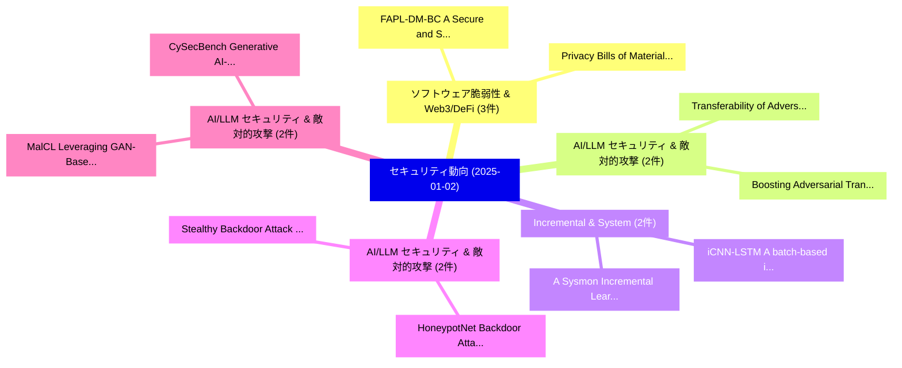

# 📅 02_daily: 日次エグゼクティブサマリー報告書 (2025-01-02)

**集計日時**: 2026-10-02 23:05:13 UTC  
**対象日付**: 2025-01-02  
**本日収集論文数**: 19 件  

---

## 💡 主要セキュリティ動向・脅威インサイト (Executive Insights)

本日の収集論文（計 19 件）において、以下の重点セキュリティ領域で活発な研究動向が確認されました：
- **ソフトウェア脆弱性 & Web3/DeFi** (3 件): 注目論文として 「FAPL-DM-BC: A Secure and Scala...」、「Privacy Bills of Materials: A ...」 等が発表され、実務防御および攻撃検証の進展が見られます。
- **AI/LLM セキュリティ & 敵対的攻撃** (2 件): 注目論文として 「Boosting Adversarial Transfera...」、「Transferability of Adversarial...」 等が発表され、実務防御および攻撃検証の進展が見られます。
- **Incremental & System** (2 件): 注目論文として 「iCNN-LSTM: A batch-based incre...」、「A Sysmon Incremental Learning ...」 等が発表され、実務防御および攻撃検証の進展が見られます。
- **AI/LLM セキュリティ & 敵対的攻撃** (2 件): 注目論文として 「HoneypotNet: Backdoor Attacks ...」、「Stealthy Backdoor Attack to Re...」 等が発表され、実務防御および攻撃検証の進展が見られます。
- **AI/LLM セキュリティ & 敵対的攻撃** (2 件): 注目論文として 「MalCL: Leveraging GAN-Based Ge...」、「CySecBench: Generative AI-base...」 等が発表され、実務防御および攻撃検証の進展が見られます。

### 🗺️ 技術・脅威トピックマインドマップ

---

## 📌 日次セキュリティ論文一覧 (日本語表形式)

| No | arXiv ID | 論文タイトル (日本語訳) | 重要キーワード | 構造化エグゼクティブ要約 (背景・提案・影響) | 脅威分類 | 詳細リンク |
|---|---|---|---|---|---|---|
| 1 | `2501.01015v2` | [Boosting Adversarial Transferability with Spatial Adversarial Alignment（セキュリティ分析論文）](../../okf/papers/2025-01-02/2501.01015.md) | `Boosting Adversarial Transferability`, `Spatial Adversarial Alignment`, `Zhaoyu Chen` | 【提案】概要 (Overview & Key Finding) 本論文「Boosting Adversarial Transferability with Spatial Adver...。実証評価により経営層・セキュリティ管理者向け推奨アクション (E... | `cs.CR` | [arXiv](https://arxiv.org/abs/2501.01015v2) &#124; [OKF](../../okf/papers/2025-01-02/2501.01015.md) |
| 2 | `2501.01032v1` | [DynamicLip: Shape-Independent Continuous Authentication via Lip Articulator Dynamics（セキュリティ分析論文）](../../okf/papers/2025-01-02/2501.01032.md) | `Independent Continuous Authentication`, `Lip Articulator Dynamics`, `Shape-Independent Continuous` | 【提案】概要 (Overview & Key Finding) 本論文「DynamicLip: Shape-Independent Continuous Authentication...。実証評価により経営層・セキュリティ管理者向け推奨アクション (E... | `cs.CR` | [arXiv](https://arxiv.org/abs/2501.01032v1) &#124; [OKF](../../okf/papers/2025-01-02/2501.01032.md) |
| 3 | `2501.01042v4` | [Transferability of Adversarial Attacks in Video-based MLLMs: A Cross-modal Image-to-Video Approach（セキュリティ分析論文）](../../okf/papers/2025-01-02/2501.01042.md) | `Adversarial Attacks`, `Video-based MLLMs`, `Cross-modal Image` | 【提案】概要 (Overview & Key Finding) 本論文「Transferability of 敵対的攻撃s in Video-based MLLMs: A Cross...。実証評価により経営層・セキュリティ管理者向け推奨アクション (E... | `cs.CR` | [arXiv](https://arxiv.org/abs/2501.01042v4) &#124; [OKF](../../okf/papers/2025-01-02/2501.01042.md) |
| 4 | `2501.01063v1` | [FAPL-DM-BC: A Secure and Scalable FL Framework with Adaptive Privacy and Dynamic Masking, Blockchain, and XAI for the IoVs（セキュリティ分析論文）](../../okf/papers/2025-01-02/2501.01063.md) | `Adaptive Privacy`, `Dynamic Masking`, `Amballa Venkata Sriram` | 【提案】概要 (Overview & Key Finding) 本論文「FAPL-DM-BC: A Secure and Scalable FL Framework with Ada...。実証評価により経営層・セキュリティ管理者向け推奨アクション (E... | `cs.CR` | [arXiv](https://arxiv.org/abs/2501.01063v1) &#124; [OKF](../../okf/papers/2025-01-02/2501.01063.md) |
| 5 | `2501.01083v1` | [iCNN-LSTM: A batch-based incremental ransomware detection system using Sysmon（セキュリティ分析論文）](../../okf/papers/2025-01-02/2501.01083.md) | `batch-based incremental`, `Jamil Ispahany`, `Rafiqul Islam` | 【提案】概要 (Overview & Key Finding) 本論文「iCNN-LSTM: A batch-based incremental ランサムウェア detection ...。実証評価により経営層・セキュリティ管理者向け推奨アクション (E... | `cs.CR` | [arXiv](https://arxiv.org/abs/2501.01083v1) &#124; [OKF](../../okf/papers/2025-01-02/2501.01083.md) |
| 6 | `2501.01089v1` | [A Sysmon Incremental Learning System for Ransomware Analysis and Detection（セキュリティ分析論文）](../../okf/papers/2025-01-02/2501.01089.md) | `Sysmon Incremental Learning System`, `Jamil Ispahany`, `Rafiqul Islam` | 【提案】概要 (Overview & Key Finding) 本論文「A Sysmon Incremental Learning System for ランサムウェア Analys...。実証評価により経営層・セキュリティ管理者向け推奨アクション (E... | `cs.CR` | [arXiv](https://arxiv.org/abs/2501.01089v1) &#124; [OKF](../../okf/papers/2025-01-02/2501.01089.md) |
| 7 | `2501.01090v1` | [HoneypotNet: Backdoor Attacks Against Model Extraction（セキュリティ分析論文）](../../okf/papers/2025-01-02/2501.01090.md) | `Yixu Wang`, `Tianle Gu`, `Yan Teng` | 【提案】概要 (Overview & Key Finding) 本論文「HoneypotNet: Backdoor Attacks Against Model Extraction（...。実証評価により経営層・セキュリティ管理者向け推奨アクション (E... | `cs.CR` | [arXiv](https://arxiv.org/abs/2501.01090v1) &#124; [OKF](../../okf/papers/2025-01-02/2501.01090.md) |
| 8 | `2501.01110v1` | [MalCL: Leveraging GAN-Based Generative Replay to Combat Catastrophic Forgetting in Malware Classification（セキュリティ分析論文）](../../okf/papers/2025-01-02/2501.01110.md) | `Based Generative Replay`, `Combat Catastrophic Forgetting`, `GAN-Based Generative` | 【提案】概要 (Overview & Key Finding) 本論文「MalCL: Leveraging GAN-Based Generative Replay to Combat...。実証評価により経営層・セキュリティ管理者向け推奨アクション (E... | `cs.CR` | [arXiv](https://arxiv.org/abs/2501.01110v1) &#124; [OKF](../../okf/papers/2025-01-02/2501.01110.md) |
| 9 | `2501.01131v2` | [Privacy Bills of Materials: A Transparent Privacy Information Inventory for Collaborative Privacy Notice Generation in Mobile App Development（セキュリティ分析論文）](../../okf/papers/2025-01-02/2501.01131.md) | `Transparent Privacy Information Inventory`, `Collaborative Privacy Notice Generation`, `Mobile App Development` | 【提案】概要 (Overview & Key Finding) 本論文「Privacy Bills of Materials: A Transparent Privacy Infor...。実証評価により経営層・セキュリティ管理者向け推奨アクション (E... | `cs.CR` | [arXiv](https://arxiv.org/abs/2501.01131v2) &#124; [OKF](../../okf/papers/2025-01-02/2501.01131.md) |
| 10 | `2501.01146v1` | [PoVF: Empowering Decentralized Blockchain Systems with Verifiable Function Consensus（セキュリティ分析論文）](../../okf/papers/2025-01-02/2501.01146.md) | `Empowering Decentralized Blockchain Systems`, `Verifiable Function Consensus`, `Chenxi Xiong` | 【提案】概要 (Overview & Key Finding) 本論文「PoVF: Empowering Decentralized Blockchain Systems with ...。実証評価により経営層・セキュリティ管理者向け推奨アクション (E... | `cs.CR` | [arXiv](https://arxiv.org/abs/2501.01146v1) &#124; [OKF](../../okf/papers/2025-01-02/2501.01146.md) |
| 11 | `2501.01187v2` | [NET-SA: An Efficient Secure Aggregation Architecture Based on In-Network Computing（セキュリティ分析論文）](../../okf/papers/2025-01-02/2501.01187.md) | `Network Computing`, `In-Network Computing`, `Qingqing Ren` | 【提案】概要 (Overview & Key Finding) 本論文「NET-SA: An Efficient Secure Aggregation Architecture Ba...。実証評価により経営層・セキュリティ管理者向け推奨アクション (E... | `cs.CR` | [arXiv](https://arxiv.org/abs/2501.01187v2) &#124; [OKF](../../okf/papers/2025-01-02/2501.01187.md) |
| 12 | `2501.01194v1` | [A Game Between the Defender and the Attacker for Trigger-based Black-box Model Watermarking（セキュリティ分析論文）](../../okf/papers/2025-01-02/2501.01194.md) | `Trigger-based Black`, `Model Watermarking`, `Chaoyue Huang` | 【提案】概要 (Overview & Key Finding) 本論文「A Game Between the Defender and the Attacker for Trigge...。実証評価により経営層・セキュリティ管理者向け推奨アクション (E... | `cs.CR` | [arXiv](https://arxiv.org/abs/2501.01194v1) &#124; [OKF](../../okf/papers/2025-01-02/2501.01194.md) |
| 13 | `2501.01255v1` | [Design of mechanisms for ensuring the execution of tasks in project planning（セキュリティ分析論文）](../../okf/papers/2025-01-02/2501.01255.md) | `Oksana Mulesa`, `Petro Horvat`, `Tamara Radivilova` | 【提案】概要 (Overview & Key Finding) 本論文「Design of mechanisms for ensuring the execution of task...。実証評価により経営層・セキュリティ管理者向け推奨アクション (E... | `cs.CR` | [arXiv](https://arxiv.org/abs/2501.01255v1) &#124; [OKF](../../okf/papers/2025-01-02/2501.01255.md) |
| 14 | `2501.01263v1` | [Stealthy Backdoor Attack to Real-world Models in Android Apps（セキュリティ分析論文）](../../okf/papers/2025-01-02/2501.01263.md) | `Stealthy Backdoor Attack`, `Android Apps`, `Real-world Models` | 【提案】概要 (Overview & Key Finding) 本論文「Stealthy Backdoor Attack to Real-world Models in Androi...。実証評価により経営層・セキュリティ管理者向け推奨アクション (E... | `cs.CR` | [arXiv](https://arxiv.org/abs/2501.01263v1) &#124; [OKF](../../okf/papers/2025-01-02/2501.01263.md) |
| 15 | `2501.01334v1` | [Security in OS-Level Virtualizationの分析](../../okf/papers/2025-01-02/2501.01334.md) | `Level Virtualization`, `OS-Level Virtualization`, `Krishna Sai Ketha` | 【提案】概要 (Overview & Key Finding) 本論文「Security in OS-Level Virtualizationの分析」（原題: Analysis of...。実証評価により経営層・セキュリティ管理者向け推奨アクション (E... | `cs.CR` | [arXiv](https://arxiv.org/abs/2501.01334v1) &#124; [OKF](../../okf/papers/2025-01-02/2501.01334.md) |
| 16 | `2501.01335v1` | [CySecBench: Generative AI-based CyberSecurity-focused Prompt Dataset for Large Language Modelsのベンチマーク評価](../../okf/papers/2025-01-02/2501.01335.md) | `Prompt Dataset`, `AI-based CyberSecurity`, `Benchmarking Large Language Models` | 【提案】概要 (Overview & Key Finding) 本論文「CySecBench: Generative AI-based CyberSecurity-focused P...。実証評価により経営層・セキュリティ管理者向け推奨アクション (E... | `cs.CR` | [arXiv](https://arxiv.org/abs/2501.01335v1) &#124; [OKF](../../okf/papers/2025-01-02/2501.01335.md) |
| 17 | `2501.01517v1` | [Wi-Fi 6 Connection Establishment Against Relay and Spoofing Threatsのセキュリティ強化](../../okf/papers/2025-01-02/2501.01517.md) | `Wi-Fi 6`, `Securing Wi`, `Spoofing Threats` | 【提案】概要 (Overview & Key Finding) 本論文「Wi-Fi 6 Connection Establishment Against Relay and Spoo...。実証評価により経営層・セキュリティ管理者向け推奨アクション (E... | `cs.CR` | [arXiv](https://arxiv.org/abs/2501.01517v1) &#124; [OKF](../../okf/papers/2025-01-02/2501.01517.md) |
| 18 | `2501.02011v1` | [Anti-counterfeiting tags with camouflaged QR codes on nanocavities, using polymer-dispersed-liquid-crystals（セキュリティ分析論文）](../../okf/papers/2025-01-02/2501.02011.md) | `Anti-counterfeiting tags`, `Mauro Daniel Luigi Bruno`, `Maria Penelope De Santo` | 【提案】概要 (Overview & Key Finding) 本論文「Anti-counterfeiting tags with camouflaged QR codes on n...。実証評価により経営層・セキュリティ管理者向け推奨アクション (E... | `cs.CR` | [arXiv](https://arxiv.org/abs/2501.02011v1) &#124; [OKF](../../okf/papers/2025-01-02/2501.02011.md) |
| 19 | `2501.02018v1` | [Safeguarding 大規模言語モデル in Real-time with Tunable Safety-Performance Trade-offs](../../okf/papers/2025-01-02/2501.02018.md) | `Tunable Safety`, `Performance Trade`, `Safety-Performance Trade` | 【提案】概要 (Overview & Key Finding) 本論文「Safeguarding 大規模言語モデル in Real-time with Tunable Safety-...。実証評価により経営層・セキュリティ管理者向け推奨アクション (E... | `cs.CR` | [arXiv](https://arxiv.org/abs/2501.02018v1) &#124; [OKF](../../okf/papers/2025-01-02/2501.02018.md) |

