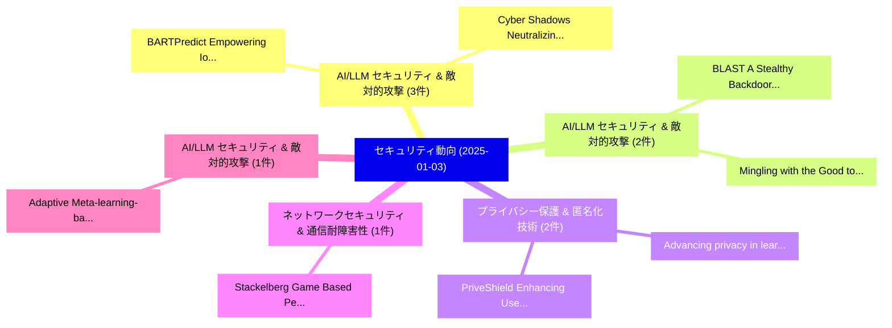

# 📅 02_daily: 日次エグゼクティブサマリー報告書 (2025-01-03)

**集計日時**: 2026-10-02 23:05:13 UTC  
**対象日付**: 2025-01-03  
**本日収集論文数**: 17 件  

---

## 💡 主要セキュリティ動向・脅威インサイト (Executive Insights)

本日の収集論文（計 17 件）において、以下の重点セキュリティ領域で活発な研究動向が確認されました：
- **AI/LLM セキュリティ & 敵対的攻撃** (3 件): 注目論文として 「BARTPredict: Empowering IoT Se...」、「Cyber Shadows: Neutralizing Se...」 等が発表され、実務防御および攻撃検証の進展が見られます。
- **AI/LLM セキュリティ & 敵対的攻撃** (2 件): 注目論文として 「BLAST: A Stealthy Backdoor Lev...」、「Mingling with the Good to Back...」 等が発表され、実務防御および攻撃検証の進展が見られます。
- **プライバシー保護 & 匿名化技術** (2 件): 注目論文として 「Advancing privacy in learning ...」、「PriveShield: Enhancing User Pr...」 等が発表され、実務防御および攻撃検証の進展が見られます。
- **ネットワークセキュリティ & 通信耐障害性** (1 件): 注目論文として 「Stackelberg Game Based Perform...」 等が発表され、実務防御および攻撃検証の進展が見られます。
- **AI/LLM セキュリティ & 敵対的攻撃** (1 件): 注目論文として 「Adaptive Meta-learning-based A...」 等が発表され、実務防御および攻撃検証の進展が見られます。

### 🗺️ 技術・脅威トピックマインドマップ

---

## 📌 日次セキュリティ論文一覧 (日本語表形式)

| No | arXiv ID | 論文タイトル (日本語訳) | 重要キーワード | 構造化エグゼクティブ要約 (背景・提案・影響) | 脅威分類 | 詳細リンク |
|---|---|---|---|---|---|---|
| 1 | `2501.01584v1` | [Stackelberg Game Based Performance Optimization in Digital Twin Assisted 連合学習 over NOMA Networks](../../okf/papers/2025-01-03/2501.01584.md) | `Stackelberg Game Based Performance Optimization`, `Digital Twin Assisted`, `Digital Twin Assisted Federated Learning` | 【提案】概要 (Overview & Key Finding) 本論文「Stackelberg Game Based Performance Optimization in Digi...。実証評価により経営層・セキュリティ管理者向け推奨アクション (E... | `cs.CR` | [arXiv](https://arxiv.org/abs/2501.01584v1) &#124; [OKF](../../okf/papers/2025-01-03/2501.01584.md) |
| 2 | `2501.01593v2` | [BLAST: A Stealthy Backdoor Leverage Attack against Cooperative Multi-Agent Deep Reinforcement Learning based Systems（セキュリティ分析論文）](../../okf/papers/2025-01-03/2501.01593.md) | `Stealthy Backdoor Leverage Attack`, `Agent Deep Reinforcement Learning`, `Cooperative Multi` | 【提案】概要 (Overview & Key Finding) 本論文「BLAST: A Stealthy Backdoor Leverage Attack against Coop...。実証評価により経営層・セキュリティ管理者向け推奨アクション (E... | `cs.CR` | [arXiv](https://arxiv.org/abs/2501.01593v2) &#124; [OKF](../../okf/papers/2025-01-03/2501.01593.md) |
| 3 | `2501.01620v1` | [Adaptive Meta-learning-based Adversarial Training for Robust Automatic Modulation Classification（セキュリティ分析論文）](../../okf/papers/2025-01-03/2501.01620.md) | `Robust Automatic Modulation Classification`, `Adaptive Meta`, `Adversarial Training` | 【提案】概要 (Overview & Key Finding) 本論文「Adaptive Meta-learning-based Adversarial Training for R...。実証評価により経営層・セキュリティ管理者向け推奨アクション (E... | `cs.CR` | [arXiv](https://arxiv.org/abs/2501.01620v1) &#124; [OKF](../../okf/papers/2025-01-03/2501.01620.md) |
| 4 | `2501.01664v1` | [BARTPredict: Empowering IoT Security with LLM-Driven Cyber Threat Prediction（セキュリティ分析論文）](../../okf/papers/2025-01-03/2501.01664.md) | `Driven Cyber Threat Prediction`, `LLM-Driven Cyber`, `Abdelaziz Amara Korba` | 【提案】概要 (Overview & Key Finding) 本論文「BARTPredict: Empowering IoT Security with LLM-Driven Cy...。実証評価により経営層・セキュリティ管理者向け推奨アクション (E... | `cs.CR` | [arXiv](https://arxiv.org/abs/2501.01664v1) &#124; [OKF](../../okf/papers/2025-01-03/2501.01664.md) |
| 5 | `2501.01672v2` | [Practical Secure Inference Algorithm for Fine-tuned Large Language Model Based on Fully Homomorphic Encryption（セキュリティ分析論文）](../../okf/papers/2025-01-03/2501.01672.md) | `Practical Secure Inference Algorithm`, `Large Language Model Based`, `Fully Homomorphic Encryption` | 【提案】概要 (Overview & Key Finding) 本論文「Practical Secure Inference Algorithm for Fine-tuned Lar...。実証評価により経営層・セキュリティ管理者向け推奨アクション (E... | `cs.CR` | [arXiv](https://arxiv.org/abs/2501.01672v2) &#124; [OKF](../../okf/papers/2025-01-03/2501.01672.md) |
| 6 | `2501.01732v1` | [Combined Hyper-Extensible Extremely-Secured Zero-Trust CIAM-PAM architecture（セキュリティ分析論文）](../../okf/papers/2025-01-03/2501.01732.md) | `Combined Hyper`, `Extensible Extremely`, `Secured Zero` | 【提案】概要 (Overview & Key Finding) 本論文「Combined Hyper-Extensible Extremely-Secured ゼロトラスト CIAM...。実証評価により経営層・セキュリティ管理者向け推奨アクション (E... | `cs.CR` | [arXiv](https://arxiv.org/abs/2501.01732v1) &#124; [OKF](../../okf/papers/2025-01-03/2501.01732.md) |
| 7 | `2501.01786v1` | [Advancing privacy in learning analytics using differential privacy（セキュリティ分析論文）](../../okf/papers/2025-01-03/2501.01786.md) | `Qinyi Liu`, `Ronas Shakya`, `Mohammad Khalil` | 【提案】概要 (Overview & Key Finding) 本論文「Advancing privacy in learning analytics using 差分プライバシー（...。実証評価により経営層・セキュリティ管理者向け推奨アクション (E... | `cs.CR` | [arXiv](https://arxiv.org/abs/2501.01786v1) &#124; [OKF](../../okf/papers/2025-01-03/2501.01786.md) |
| 8 | `2501.01818v1` | [Rerouting LLM Routers（セキュリティ分析論文）](../../okf/papers/2025-01-03/2501.01818.md) | `Avital Shafran`, `Roei Schuster`, `Thomas Ristenpart` | 【提案】概要 (Overview & Key Finding) 本論文「Rerouting LLM Routers（セキュリティ分析論文）」（原題: Rerouting LLM Ro...。実証評価により経営層・セキュリティ管理者向け推奨アクション (E... | `cs.CR` | [arXiv](https://arxiv.org/abs/2501.01818v1) &#124; [OKF](../../okf/papers/2025-01-03/2501.01818.md) |
| 9 | `2501.01830v1` | [Auto-RT: Automatic Jailbreak Strategy Exploration for Red-Teaming 大規模言語モデル](../../okf/papers/2025-01-03/2501.01830.md) | `Automatic Jailbreak Strategy Exploration`, `Teaming Large Language Models`, `Red-Teaming Large` | 【提案】概要 (Overview & Key Finding) 本論文「Auto-RT: Automatic ジェイルブレイク Strategy Exploration for Re...。実証評価により経営層・セキュリティ管理者向け推奨アクション (E... | `cs.CR` | [arXiv](https://arxiv.org/abs/2501.01830v1) &#124; [OKF](../../okf/papers/2025-01-03/2501.01830.md) |
| 10 | `2501.01913v1` | [Mingling with the Good to Backdoor 連合学習](../../okf/papers/2025-01-03/2501.01913.md) | `Backdoor Federated Learning`, `Nuno Neves`, `Raw Meta` | 【提案】概要 (Overview & Key Finding) 本論文「Mingling with the Good to Backdoor 連合学習」（原題: Mingling w...。実証評価により経営層・セキュリティ管理者向け推奨アクション (E... | `cs.CR` | [arXiv](https://arxiv.org/abs/2501.01913v1) &#124; [OKF](../../okf/papers/2025-01-03/2501.01913.md) |
| 11 | `2501.02029v1` | [Spot Risks Before Speaking! Unraveling Safety Attention Heads in Large Vision-Language Models（セキュリティ分析論文）](../../okf/papers/2025-01-03/2501.02029.md) | `Unraveling Safety Attention Heads`, `Large Vision`, `Language Models` | 【提案】Unraveling Safety Attention Heads in Large Vision-Language Models ### (日本語題名: Spot Risk...。実証評価により経営層・セキュリティ管理者向け推奨アクション (E... | `cs.CR` | [arXiv](https://arxiv.org/abs/2501.02029v1) &#124; [OKF](../../okf/papers/2025-01-03/2501.02029.md) |
| 12 | `2501.02032v1` | [Dynamic Feature Fusion: Combining Global Graph Structures and Local Semantics for Blockchain Fraud Detection（セキュリティ分析論文）](../../okf/papers/2025-01-03/2501.02032.md) | `Combining Global Graph Structures`, `Dynamic Feature Fusion`, `Blockchain Fraud Detection` | 【提案】概要 (Overview & Key Finding) 本論文「Dynamic Feature Fusion: Combining Global Graph Structur...。実証評価により経営層・セキュリティ管理者向け推奨アクション (E... | `cs.CR` | [arXiv](https://arxiv.org/abs/2501.02032v1) &#124; [OKF](../../okf/papers/2025-01-03/2501.02032.md) |
| 13 | `2501.02042v1` | [Robust and Accurate Stability Estimation of Local Surrogate Models in Text-based Explainable AIに向けて](../../okf/papers/2025-01-03/2501.02042.md) | `Accurate Stability Estimation`, `Local Surrogate Models`, `Text-based Explainable` | 【提案】概要 (Overview & Key Finding) 本論文「Robust and Accurate Stability Estimation of Local Surro...。実証評価により経営層・セキュリティ管理者向け推奨アクション (E... | `cs.CR` | [arXiv](https://arxiv.org/abs/2501.02042v1) &#124; [OKF](../../okf/papers/2025-01-03/2501.02042.md) |
| 14 | `2501.02091v1` | [PriveShield: Enhancing User Privacy Using Automatic Isolated Profiles in Browsers（セキュリティ分析論文）](../../okf/papers/2025-01-03/2501.02091.md) | `Enhancing User Privacy Using Automatic Isolated Profiles`, `Seyed Ali Akhavani`, `Engin Kirda` | 【提案】概要 (Overview & Key Finding) 本論文「PriveShield: Enhancing User Privacy Using Automatic Iso...。実証評価により経営層・セキュリティ管理者向け推奨アクション (E... | `cs.CR` | [arXiv](https://arxiv.org/abs/2501.02091v1) &#124; [OKF](../../okf/papers/2025-01-03/2501.02091.md) |
| 15 | `2501.02118v1` | [K-Gate Lock: Multi-Key Logic Locking Using Input Encoding Against Oracle-Guided Attacks（セキュリティ分析論文）](../../okf/papers/2025-01-03/2501.02118.md) | `Gate Lock`, `Guided Attacks`, `K-Gate Lock` | 【提案】概要 (Overview & Key Finding) 本論文「K-Gate Lock: Multi-Key Logic Locking Using Input Encodi...。実証評価により経営層・セキュリティ管理者向け推奨アクション (E... | `cs.CR` | [arXiv](https://arxiv.org/abs/2501.02118v1) &#124; [OKF](../../okf/papers/2025-01-03/2501.02118.md) |
| 16 | `2501.09025v2` | [Cyber Shadows: Neutralizing Security Threats with AI and Targeted Policy Measures（セキュリティ分析論文）](../../okf/papers/2025-01-03/2501.09025.md) | `Neutralizing Security Threats`, `Targeted Policy Measures`, `Cyber Shadows` | 【提案】概要 (Overview & Key Finding) 本論文「Cyber Shadows: Neutralizing Security Threats with AI an...。実証評価により経営層・セキュリティ管理者向け推奨アクション (E... | `cs.CR` | [arXiv](https://arxiv.org/abs/2501.09025v2) &#124; [OKF](../../okf/papers/2025-01-03/2501.09025.md) |
| 17 | `2501.10403v1` | [Using hypervisors to create a cyber polygon（セキュリティ分析論文）](../../okf/papers/2025-01-03/2501.10403.md) | `Dmytro Tymoshchuk`, `Vasyl Yatskiv`, `Raw Meta` | 【提案】概要 (Overview & Key Finding) 本論文「Using hypervisors to create a cyber polygon（セキュリティ分析論文）...。実証評価により経営層・セキュリティ管理者向け推奨アクション (E... | `cs.CR` | [arXiv](https://arxiv.org/abs/2501.10403v1) &#124; [OKF](../../okf/papers/2025-01-03/2501.10403.md) |

