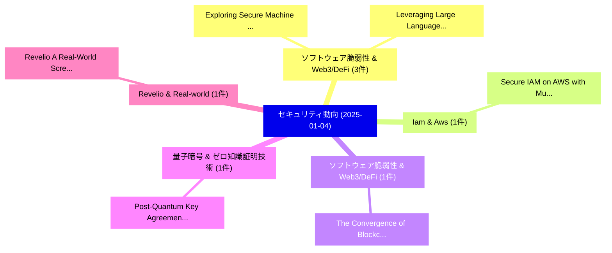

# 📅 02_daily: 日次エグゼクティブサマリー報告書 (2025-01-04)

**集計日時**: 2026-10-02 23:05:13 UTC  
**対象日付**: 2025-01-04  
**本日収集論文数**: 10 件  

---

## 💡 主要セキュリティ動向・脅威インサイト (Executive Insights)

本日の収集論文（計 10 件）において、以下の重点セキュリティ領域で活発な研究動向が確認されました：
- **ソフトウェア脆弱性 & Web3/DeFi** (3 件): 注目論文として 「Exploring Secure Machine Learn...」、「Leveraging Large Language Mode...」 等が発表され、実務防御および攻撃検証の進展が見られます。
- **Iam & Aws** (1 件): 注目論文として 「Secure IAM on AWS with Multi-A...」 等が発表され、実務防御および攻撃検証の進展が見られます。
- **ソフトウェア脆弱性 & Web3/DeFi** (1 件): 注目論文として 「The Convergence of Blockchain ...」 等が発表され、実務防御および攻撃検証の進展が見られます。
- **量子暗号 & ゼロ知識証明技術** (1 件): 注目論文として 「Post-Quantum Key Agreement Pro...」 等が発表され、実務防御および攻撃検証の進展が見られます。
- **Revelio & Real-world** (1 件): 注目論文として 「Revelio: A Real-World Screen-C...」 等が発表され、実務防御および攻撃検証の進展が見られます。

### 🗺️ 技術・脅威トピックマインドマップ

---

## 📌 日次セキュリティ論文一覧 (日本語表形式)

| No | arXiv ID | 論文タイトル (日本語訳) | 重要キーワード | 構造化エグゼクティブ要約 (背景・提案・影響) | 脅威分類 | 詳細リンク |
|---|---|---|---|---|---|---|
| 1 | `2501.02147v2` | [Exploring Secure Machine Learning Through Payload Injection and FGSM Attacks on ResNet-50（セキュリティ分析論文）](../../okf/papers/2025-01-04/2501.02147.md) | `Exploring Secure Machine Learning Thr`, `Gaurav Kumar Gupta`, `Umesh Yadav` | 【提案】概要 (Overview & Key Finding) 本論文「Exploring Secure Machine Learning Through Payload Injec...。実証評価により経営層・セキュリティ管理者向け推奨アクション (E... | `cs.CR` | [arXiv](https://arxiv.org/abs/2501.02147v2) &#124; [OKF](../../okf/papers/2025-01-04/2501.02147.md) |
| 2 | `2501.02203v1` | [Secure IAM on AWS with Multi-Account Strategy（セキュリティ分析論文）](../../okf/papers/2025-01-04/2501.02203.md) | `Account Strategy`, `Multi-Account Strategy`, `Sungchan Yi` | 【提案】概要 (Overview & Key Finding) 本論文「Secure IAM on AWS with Multi-Account Strategy（セキュリティ分析論...。実証評価により経営層・セキュリティ管理者向け推奨アクション (E... | `cs.CR` | [arXiv](https://arxiv.org/abs/2501.02203v1) &#124; [OKF](../../okf/papers/2025-01-04/2501.02203.md) |
| 3 | `2501.02229v1` | [Leveraging Large Language Models and Machine Learning for Smart Contract 脆弱性検出](../../okf/papers/2025-01-04/2501.02229.md) | `Leveraging Large Language Models`, `Machine Learning`, `Smart Contract Vulnerability Detection` | 【提案】概要 (Overview & Key Finding) 本論文「Leveraging Large Language Models and Machine Learning f...。実証評価により経営層・セキュリティ管理者向け推奨アクション (E... | `cs.CR` | [arXiv](https://arxiv.org/abs/2501.02229v1) &#124; [OKF](../../okf/papers/2025-01-04/2501.02229.md) |
| 4 | `2501.02263v1` | [The Convergence of Blockchain Technology and Islamic Economics: Decentralized Solutions for Shariah-Compliant Finance（セキュリティ分析論文）](../../okf/papers/2025-01-04/2501.02263.md) | `Blockchain Technology`, `Islamic Economics`, `Decentralized Solutions` | 【提案】概要 (Overview & Key Finding) 本論文「The Convergence of Blockchain Technology and Islamic Ec...。実証評価により経営層・セキュリティ管理者向け推奨アクション (E... | `cs.CR` | [arXiv](https://arxiv.org/abs/2501.02263v1) &#124; [OKF](../../okf/papers/2025-01-04/2501.02263.md) |
| 5 | `2501.02292v2` | [Post-Quantum Key Agreement Protocols Based on Modified Matrix-Power Functions over Singular Random Integer Matrix Semirings（セキュリティ分析論文）](../../okf/papers/2025-01-04/2501.02292.md) | `Quantum Key Agreement Protocols Based`, `Singular Random Integer Matrix Semirings`, `Post-Quantum Key` | 【提案】概要 (Overview & Key Finding) 本論文「Post-量子 Key Agreement Protocols Based on Modified Matri...。実証評価により経営層・セキュリティ管理者向け推奨アクション (E... | `cs.CR` | [arXiv](https://arxiv.org/abs/2501.02292v2) &#124; [OKF](../../okf/papers/2025-01-04/2501.02292.md) |
| 6 | `2501.02349v1` | [Revelio: A Real-World Screen-Camera Communication System with Visually Imperceptible Data Embedding（セキュリティ分析論文）](../../okf/papers/2025-01-04/2501.02349.md) | `Visually Imperceptible Data Embedding`, `Camera Communication System`, `World Screen` | 【提案】概要 (Overview & Key Finding) 本論文「Revelio: A Real-World Screen-Camera Communication Syste...。実証評価により経営層・セキュリティ管理者向け推奨アクション (E... | `cs.CR` | [arXiv](https://arxiv.org/abs/2501.02349v1) &#124; [OKF](../../okf/papers/2025-01-04/2501.02349.md) |
| 7 | `2501.02350v1` | [PM-Dedup: Secure Deduplication with Partial Migration from Cloud to Edge Servers（セキュリティ分析論文）](../../okf/papers/2025-01-04/2501.02350.md) | `Secure Deduplication`, `Partial Migration`, `Edge Servers` | 【提案】概要 (Overview & Key Finding) 本論文「PM-Dedup: Secure Deduplication with Partial Migration f...。実証評価により経営層・セキュリティ管理者向け推奨アクション (E... | `cs.CR` | [arXiv](https://arxiv.org/abs/2501.02350v1) &#124; [OKF](../../okf/papers/2025-01-04/2501.02350.md) |
| 8 | `2501.02352v1` | [GNSS/GPS Spoofing and Jamming Identification Using Machine Learning and Deep Learning（セキュリティ分析論文）](../../okf/papers/2025-01-04/2501.02352.md) | `Jamming Identification Using Machine Learning`, `Deep Learning`, `Ali Ghanbarzade` | 【提案】概要 (Overview & Key Finding) 本論文「GNSS/GPS Spoofing and Jamming Identification Using Mach...。実証評価により経営層・セキュリティ管理者向け推奨アクション (E... | `cs.CR` | [arXiv](https://arxiv.org/abs/2501.02352v1) &#124; [OKF](../../okf/papers/2025-01-04/2501.02352.md) |
| 9 | `2501.02354v1` | [PrivDPR: Synthetic Graph Publishing with Deep PageRank under Differential Privacy（セキュリティ分析論文）](../../okf/papers/2025-01-04/2501.02354.md) | `Synthetic Graph Publishing`, `Differential Privacy`, `Sen Zhang` | 【提案】概要 (Overview & Key Finding) 本論文「PrivDPR: Synthetic Graph Publishing with Deep PageRank ...。実証評価により経営層・セキュリティ管理者向け推奨アクション (E... | `cs.CR` | [arXiv](https://arxiv.org/abs/2501.02354v1) &#124; [OKF](../../okf/papers/2025-01-04/2501.02354.md) |
| 10 | `2501.02373v3` | [BADTV: Unveiling Backdoor Threats in Third-Party Task Vectors（セキュリティ分析論文）](../../okf/papers/2025-01-04/2501.02373.md) | `Unveiling Backdoor Threats`, `Party Task Vectors`, `Third-Party Task` | 【提案】概要 (Overview & Key Finding) 本論文「BADTV: Unveiling Backdoor Threats in Third-Party Task V...。実証評価により経営層・セキュリティ管理者向け推奨アクション (E... | `cs.CR` | [arXiv](https://arxiv.org/abs/2501.02373v3) &#124; [OKF](../../okf/papers/2025-01-04/2501.02373.md) |

