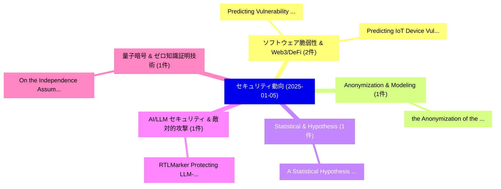

# 📅 02_daily: 日次エグゼクティブサマリー報告書 (2025-01-05)

**集計日時**: 2026-10-02 23:05:13 UTC  
**対象日付**: 2025-01-05  
**本日収集論文数**: 10 件  

---

## 💡 主要セキュリティ動向・脅威インサイト (Executive Insights)

本日の収集論文（計 10 件）において、以下の重点セキュリティ領域で活発な研究動向が確認されました：
- **ソフトウェア脆弱性 & Web3/DeFi** (2 件): 注目論文として 「Predicting Vulnerability to Ma...」、「Predicting IoT Device Vulnerab...」 等が発表され、実務防御および攻撃検証の進展が見られます。
- **Anonymization & Modeling** (1 件): 注目論文として 「the Anonymization of the Langu...」 等が発表され、実務防御および攻撃検証の進展が見られます。
- **Statistical & Hypothesis** (1 件): 注目論文として 「A Statistical Hypothesis Testi...」 等が発表され、実務防御および攻撃検証の進展が見られます。
- **AI/LLM セキュリティ & 敵対的攻撃** (1 件): 注目論文として 「RTLMarker: Protecting LLM-Gene...」 等が発表され、実務防御および攻撃検証の進展が見られます。
- **量子暗号 & ゼロ知識証明技術** (1 件): 注目論文として 「On the Independence Assumption...」 等が発表され、実務防御および攻撃検証の進展が見られます。

### 🗺️ 技術・脅威トピックマインドマップ

---

## 📌 日次セキュリティ論文一覧 (日本語表形式)

| No | arXiv ID | 論文タイトル (日本語訳) | 重要キーワード | 構造化エグゼクティブ要約 (背景・提案・影響) | 脅威分類 | 詳細リンク |
|---|---|---|---|---|---|---|
| 1 | `2501.02407v3` | [the Anonymization of the Language Modelingに向けて](../../okf/papers/2025-01-05/2501.02407.md) | `Language Modeling`, `Antoine Boutet`, `Lucas Magnana` | 【提案】概要 (Overview & Key Finding) 本論文「the Anonymization of the Language Modelingに向けて」（原題: Tow...。実証評価により経営層・セキュリティ管理者向け推奨アクション (E... | `cs.CR` | [arXiv](https://arxiv.org/abs/2501.02407v3) &#124; [OKF](../../okf/papers/2025-01-05/2501.02407.md) |
| 2 | `2501.02441v2` | [A Statistical Hypothesis Testing Framework for Data Misappropriation Detection in 大規模言語モデル](../../okf/papers/2025-01-05/2501.02441.md) | `Data Misappropriation Detection`, `Large Language Models`, `Statistical Hypothesis Testing` | 【提案】概要 (Overview & Key Finding) 本論文「A Statistical Hypothesis Testing Framework for Data Mis...。実証評価により経営層・セキュリティ管理者向け推奨アクション (E... | `cs.CR` | [arXiv](https://arxiv.org/abs/2501.02441v2) &#124; [OKF](../../okf/papers/2025-01-05/2501.02441.md) |
| 3 | `2501.02446v1` | [RTLMarker: Protecting LLM-Generated RTL Copyright via a Hardware Watermarking Framework（セキュリティ分析論文）](../../okf/papers/2025-01-05/2501.02446.md) | `LLM-Generated RTL`, `Kun Wang`, `Kaiyan Chang` | 【提案】概要 (Overview & Key Finding) 本論文「RTLMarker: Protecting LLM-Generated RTL Copyright via a...。実証評価により経営層・セキュリティ管理者向け推奨アクション (E... | `cs.CR` | [arXiv](https://arxiv.org/abs/2501.02446v1) &#124; [OKF](../../okf/papers/2025-01-05/2501.02446.md) |
| 4 | `2501.02493v2` | [Predicting Vulnerability to Malware Using Machine Learning Models: A Study on Microsoft Windows Machines（セキュリティ分析論文）](../../okf/papers/2025-01-05/2501.02493.md) | `Malware Using Machine Learning Models`, `Microsoft Windows Machines`, `Predicting Vulnerability` | 【提案】概要 (Overview & Key Finding) 本論文「Predicting 脆弱性 to マルウェア Using Machine Learning Models: ...。実証評価により経営層・セキュリティ管理者向け推奨アクション (E... | `cs.CR` | [arXiv](https://arxiv.org/abs/2501.02493v2) &#124; [OKF](../../okf/papers/2025-01-05/2501.02493.md) |
| 5 | `2501.02520v1` | [Predicting IoT Device Vulnerability Fix Times with Survival and Failure Time Models（セキュリティ分析論文）](../../okf/papers/2025-01-05/2501.02520.md) | `Device Vulnerability Fix Times`, `Failure Time Models`, `Xinzhang Chen` | 【提案】概要 (Overview & Key Finding) 本論文「Predicting IoT Device 脆弱性 Fix Times with Survival and F...。実証評価により経営層・セキュリティ管理者向け推奨アクション (E... | `cs.CR` | [arXiv](https://arxiv.org/abs/2501.02520v1) &#124; [OKF](../../okf/papers/2025-01-05/2501.02520.md) |
| 6 | `2501.02626v1` | [On the Independence Assumption in Quasi-Cyclic Code-Based Cryptography（セキュリティ分析論文）](../../okf/papers/2025-01-05/2501.02626.md) | `Independence Assumption`, `Cyclic Code`, `Based Cryptography` | 【提案】概要 (Overview & Key Finding) 本論文「On the Independence Assumption in Quasi-Cyclic Code-Bas...。実証評価により経営層・セキュリティ管理者向け推奨アクション (E... | `cs.CR` | [arXiv](https://arxiv.org/abs/2501.02626v1) &#124; [OKF](../../okf/papers/2025-01-05/2501.02626.md) |
| 7 | `2501.02629v2` | [Layer-Level Self-Exposure and Patch: Affirmative Token Mitigation for Jailbreak Attack Defense（セキュリティ分析論文）](../../okf/papers/2025-01-05/2501.02629.md) | `Affirmative Token Mitigation`, `Jailbreak Attack Defense`, `Level Self` | 【提案】概要 (Overview & Key Finding) 本論文「Layer-Level Self-Exposure and Patch: Affirmative Token ...。実証評価により経営層・セキュリティ管理者向け推奨アクション (E... | `cs.CR` | [arXiv](https://arxiv.org/abs/2501.02629v2) &#124; [OKF](../../okf/papers/2025-01-05/2501.02629.md) |
| 8 | `2501.02647v1` | [Trust and Dependability in Blockchain & AI Based MedIoT Applications: Research Challenges and Future Directions（セキュリティ分析論文）](../../okf/papers/2025-01-05/2501.02647.md) | `Research Challenges`, `Future Directions`, `Ellis Solaiman` | 【提案】概要 (Overview & Key Finding) 本論文「Trust and Dependability in Blockchain & AI Based MedIoT...。実証評価により経営層・セキュリティ管理者向け推奨アクション (E... | `cs.CR` | [arXiv](https://arxiv.org/abs/2501.02647v1) &#124; [OKF](../../okf/papers/2025-01-05/2501.02647.md) |
| 9 | `2501.03272v1` | [Backdoor Token Unlearning: Exposing and Defending Backdoors in Pretrained Language Models（セキュリティ分析論文）](../../okf/papers/2025-01-05/2501.03272.md) | `Backdoor Token Unlearning`, `Pretrained Language Models`, `Defending Backdoors` | 【提案】概要 (Overview & Key Finding) 本論文「Backdoor Token Unlearning: Exposing and Defending Backd...。実証評価により経営層・セキュリティ管理者向け推奨アクション (E... | `cs.CR` | [arXiv](https://arxiv.org/abs/2501.03272v1) &#124; [OKF](../../okf/papers/2025-01-05/2501.03272.md) |
| 10 | `2501.03279v1` | [Revolutionizing Encrypted Traffic Classification with MH-Net: A Multi-View Heterogeneous Graph Model（セキュリティ分析論文）](../../okf/papers/2025-01-05/2501.03279.md) | `Revolutionizing Encrypted Traffic Classification`, `View Heterogeneous Graph Model`, `Multi-View Heterogeneous` | 【提案】概要 (Overview & Key Finding) 本論文「Revolutionizing Encrypted Traffic Classification with M...。実証評価により経営層・セキュリティ管理者向け推奨アクション (E... | `cs.CR` | [arXiv](https://arxiv.org/abs/2501.03279v1) &#124; [OKF](../../okf/papers/2025-01-05/2501.03279.md) |

