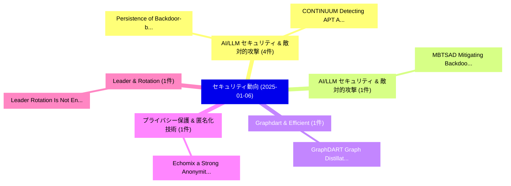

# 📅 02_daily: 日次エグゼクティブサマリー報告書 (2025-01-06)

**集計日時**: 2026-10-02 23:05:13 UTC  
**対象日付**: 2025-01-06  
**本日収集論文数**: 17 件  

---

## 💡 主要セキュリティ動向・脅威インサイト (Executive Insights)

本日の収集論文（計 17 件）において、以下の重点セキュリティ領域で活発な研究動向が確認されました：
- **AI/LLM セキュリティ & 敵対的攻撃** (4 件): 注目論文として 「Persistence of Backdoor-based ...」、「CONTINUUM: Detecting APT Attac...」 等が発表され、実務防御および攻撃検証の進展が見られます。
- **AI/LLM セキュリティ & 敵対的攻撃** (1 件): 注目論文として 「MBTSAD: Mitigating Backdoors i...」 等が発表され、実務防御および攻撃検証の進展が見られます。
- **Graphdart & Efficient** (1 件): 注目論文として 「GraphDART: Graph Distillation ...」 等が発表され、実務防御および攻撃検証の進展が見られます。
- **プライバシー保護 & 匿名化技術** (1 件): 注目論文として 「Echomix: a Strong Anonymity Sy...」 等が発表され、実務防御および攻撃検証の進展が見られます。
- **Leader & Rotation** (1 件): 注目論文として 「Leader Rotation Is Not Enough:...」 等が発表され、実務防御および攻撃検証の進展が見られます。

### 🗺️ 技術・脅威トピックマインドマップ

---

## 📌 日次セキュリティ論文一覧 (日本語表形式)

| No | arXiv ID | 論文タイトル (日本語訳) | 重要キーワード | 構造化エグゼクティブ要約 (背景・提案・影響) | 脅威分類 | 詳細リンク |
|---|---|---|---|---|---|---|
| 1 | `2501.02704v3` | [Persistence of Backdoor-based Watermarks for Neural Networks: A Comprehensive Evaluation（セキュリティ分析論文）](../../okf/papers/2025-01-06/2501.02704.md) | `Neural Networks`, `Backdoor-based Watermarks`, `Anh Tu Ngo` | 【提案】概要 (Overview & Key Finding) 本論文「Persistence of Backdoor-based Watermarks for Neural Net...。実証評価により経営層・セキュリティ管理者向け推奨アクション (E... | `cs.CR` | [arXiv](https://arxiv.org/abs/2501.02704v3) &#124; [OKF](../../okf/papers/2025-01-06/2501.02704.md) |
| 2 | `2501.02754v1` | [MBTSAD: Mitigating Backdoors in Language Models Based on Token Splitting and Attention Distillation（セキュリティ分析論文）](../../okf/papers/2025-01-06/2501.02754.md) | `Language Models Based`, `Mitigating Backdoors`, `Token Splitting` | 【提案】概要 (Overview & Key Finding) 本論文「MBTSAD: Mitigating Backdoors in Language Models Based o...。実証評価により経営層・セキュリティ管理者向け推奨アクション (E... | `cs.CR` | [arXiv](https://arxiv.org/abs/2501.02754v1) &#124; [OKF](../../okf/papers/2025-01-06/2501.02754.md) |
| 3 | `2501.02796v1` | [GraphDART: Graph Distillation for Efficient Advanced Persistent Threat Detection（セキュリティ分析論文）](../../okf/papers/2025-01-06/2501.02796.md) | `Efficient Advanced Persistent Threat Detection`, `Graph Distillation`, `Saba Fathi Rabooki` | 【提案】概要 (Overview & Key Finding) 本論文「GraphDART: Graph Distillation for Efficient Advanced Pe...。実証評価により経営層・セキュリティ管理者向け推奨アクション (E... | `cs.CR` | [arXiv](https://arxiv.org/abs/2501.02796v1) &#124; [OKF](../../okf/papers/2025-01-06/2501.02796.md) |
| 4 | `2501.02933v2` | [Echomix: a Strong Anonymity System with Messaging（セキュリティ分析論文）](../../okf/papers/2025-01-06/2501.02933.md) | `Strong Anonymity System`, `David Stainton`, `Leif Ryge` | 【提案】概要 (Overview & Key Finding) 本論文「Echomix: a Strong Anonymity System with Messaging（セキュリテ...。実証評価により経営層・セキュリティ管理者向け推奨アクション (E... | `cs.CR` | [arXiv](https://arxiv.org/abs/2501.02933v2) &#124; [OKF](../../okf/papers/2025-01-06/2501.02933.md) |
| 5 | `2501.02970v3` | [Leader Rotation Is Not Enough: Scrutinizing Leadership Democracy of Chained BFT Consensus（セキュリティ分析論文）](../../okf/papers/2025-01-06/2501.02970.md) | `Scrutinizing Leadership Democracy`, `Jianyu Niu`, `Yining Tang` | 【提案】背景とセキュリティ上の課題 (Background & Problem) 本研究はサイバー脅威環境におけるセキュリティ構造・脆弱性の検証を目的としています。(主要検出項目: ...。実証評価により経営層・セキュリティ管理者向け推奨アクション (E... | `cs.CR` | [arXiv](https://arxiv.org/abs/2501.02970v3) &#124; [OKF](../../okf/papers/2025-01-06/2501.02970.md) |
| 6 | `2501.02971v2` | [Proof-of-Data: A Consensus Protocol for Collaborative Intelligence（セキュリティ分析論文）](../../okf/papers/2025-01-06/2501.02971.md) | `Consensus Protocol`, `Collaborative Intelligence`, `Huiwen Liu` | 【提案】概要 (Overview & Key Finding) 本論文「Proof-of-Data: A Consensus Protocol for Collaborative I...。実証評価により経営層・セキュリティ管理者向け推奨アクション (E... | `cs.CR` | [arXiv](https://arxiv.org/abs/2501.02971v2) &#124; [OKF](../../okf/papers/2025-01-06/2501.02971.md) |
| 7 | `2501.02981v2` | [CONTINUUM: Detecting APT Attacks through Spatial-Temporal Graph Neural Networks（セキュリティ分析論文）](../../okf/papers/2025-01-06/2501.02981.md) | `Temporal Graph Neural Networks`, `Spatial-Temporal Graph`, `Atmane Ayoub Mansour Bahar` | 【提案】概要 (Overview & Key Finding) 本論文「CONTINUUM: Detecting APT Attacks through Spatial-Tempor...。実証評価により経営層・セキュリティ管理者向け推奨アクション (E... | `cs.CR` | [arXiv](https://arxiv.org/abs/2501.02981v2) &#124; [OKF](../../okf/papers/2025-01-06/2501.02981.md) |
| 8 | `2501.03067v1` | [Design and implementation of tools to build an ontology of Security Requirements for Internet of Medical Things（セキュリティ分析論文）](../../okf/papers/2025-01-06/2501.03067.md) | `Security Requirements`, `Medical Things`, `Daniel Naro` | 【提案】概要 (Overview & Key Finding) 本論文「Design and implementation of tools to build an ontology...。実証評価により経営層・セキュリティ管理者向け推奨アクション (E... | `cs.CR` | [arXiv](https://arxiv.org/abs/2501.03067v1) &#124; [OKF](../../okf/papers/2025-01-06/2501.03067.md) |
| 9 | `2501.03118v1` | [TEE-based Key-Value Stores: a Survey（セキュリティ分析論文）](../../okf/papers/2025-01-06/2501.03118.md) | `Value Stores`, `TEE-based Key`, `Aghiles Ait Messaoud` | 【提案】概要 (Overview & Key Finding) 本論文「TEE-based Key-Value Stores: a Survey（セキュリティ分析論文）」（原題: T...。実証評価により経営層・セキュリティ管理者向け推奨アクション (E... | `cs.CR` | [arXiv](https://arxiv.org/abs/2501.03118v1) &#124; [OKF](../../okf/papers/2025-01-06/2501.03118.md) |
| 10 | `2501.03141v1` | [Foundations of Platform-Assisted Auctions（セキュリティ分析論文）](../../okf/papers/2025-01-06/2501.03141.md) | `Assisted Auctions`, `Platform-Assisted Auctions`, `Hao Chung` | 【提案】概要 (Overview & Key Finding) 本論文「Foundations of Platform-Assisted Auctions（セキュリティ分析論文）」（...。実証評価により経営層・セキュリティ管理者向け推奨アクション (E... | `cs.CR` | [arXiv](https://arxiv.org/abs/2501.03141v1) &#124; [OKF](../../okf/papers/2025-01-06/2501.03141.md) |
| 11 | `2501.03227v5` | [When Should Selfish Miners Double-Spend?（セキュリティ分析論文）](../../okf/papers/2025-01-06/2501.03227.md) | `Mustafa Doger`, `Sennur Ulukus`, `Raw Meta` | 【提案】### (日本語題名: When Should Selfish Miners Double-Spend?（セキュリティ分析論文）)  > [!NOTE] > **OKF Me...。実証評価により経営層・セキュリティ管理者向け推奨アクション (E... | `cs.CR` | [arXiv](https://arxiv.org/abs/2501.03227v5) &#124; [OKF](../../okf/papers/2025-01-06/2501.03227.md) |
| 12 | `2501.03296v1` | [Dynamic Data Defense: Unveiling the Database in motion Chaos Encryption (DaChE) Algorithm -- A Breakthrough in Chaos Theory for Enhanced Database Security（セキュリティ分析論文）](../../okf/papers/2025-01-06/2501.03296.md) | `Dynamic Data Defense`, `Enhanced Database Security`, `Chaos Encryption` | 【提案】概要 (Overview & Key Finding) 本論文「Dynamic Data Defense: Unveiling the Database in motion ...。実証評価により経営層・セキュリティ管理者向け推奨アクション (E... | `cs.CR` | [arXiv](https://arxiv.org/abs/2501.03296v1) &#124; [OKF](../../okf/papers/2025-01-06/2501.03296.md) |
| 13 | `2501.03301v2` | [Rethinking Byzantine Robustness in Federated Recommendation from Sparse Aggregation Perspective（セキュリティ分析論文）](../../okf/papers/2025-01-06/2501.03301.md) | `Rethinking Byzantine Robustness`, `Sparse Aggregation Perspective`, `Federated Recommendation` | 【提案】概要 (Overview & Key Finding) 本論文「Rethinking Byzantine Robustness in Federated Recommenda...。実証評価により経営層・セキュリティ管理者向け推奨アクション (E... | `cs.CR` | [arXiv](https://arxiv.org/abs/2501.03301v2) &#124; [OKF](../../okf/papers/2025-01-06/2501.03301.md) |
| 14 | `2501.03306v1` | [The Robustness of Spiking Neural Networks in 連合学習 with Compression Against Non-omniscient Byzantine Attacks](../../okf/papers/2025-01-06/2501.03306.md) | `Spiking Neural Networks`, `Byzantine Attacks`, `Non-omniscient Byzantine` | 【提案】概要 (Overview & Key Finding) 本論文「The Robustness of Spiking Neural Networks in 連合学習 with ...。実証評価により経営層・セキュリティ管理者向け推奨アクション (E... | `cs.CR` | [arXiv](https://arxiv.org/abs/2501.03306v1) &#124; [OKF](../../okf/papers/2025-01-06/2501.03306.md) |
| 15 | `2501.03358v1` | [Data integrity vs. inference accuracy in large AIS datasets（セキュリティ分析論文）](../../okf/papers/2025-01-06/2501.03358.md) | `Adam Kiersztyn`, `Aneta Oniszczuk`, `Agnieszka Rzepka` | 【提案】概要 (Overview & Key Finding) 本論文「Data integrity vs. inference accuracy in large AIS data...。実証評価により経営層・セキュリティ管理者向け推奨アクション (E... | `cs.CR` | [arXiv](https://arxiv.org/abs/2501.03358v1) &#124; [OKF](../../okf/papers/2025-01-06/2501.03358.md) |
| 16 | `2501.03391v1` | [Privacy-Preserving Smart Contracts for Permissioned Blockchains: A zk-SNARK-Based Recipe Part-1（セキュリティ分析論文）](../../okf/papers/2025-01-06/2501.03391.md) | `Preserving Smart Contracts`, `Based Recipe Part`, `Privacy-Preserving Smart` | 【提案】概要 (Overview & Key Finding) 本論文「Privacy-Preserving スマートコントラクトs for Permissioned Blockch...。実証評価により経営層・セキュリティ管理者向け推奨アクション (E... | `cs.CR` | [arXiv](https://arxiv.org/abs/2501.03391v1) &#124; [OKF](../../okf/papers/2025-01-06/2501.03391.md) |
| 17 | `2501.03423v1` | [SoK: A Review of Cross-Chain Bridge Hacks in 2023（セキュリティ分析論文）](../../okf/papers/2025-01-06/2501.03423.md) | `Chain Bridge Hacks`, `Cross-Chain Bridge`, `Nikita Belenkov` | 【提案】概要 (Overview & Key Finding) 本論文「SoK: A Review of Cross-Chain Bridge Hacks in 2023（セキュリテ...。実証評価により経営層・セキュリティ管理者向け推奨アクション (E... | `cs.CR` | [arXiv](https://arxiv.org/abs/2501.03423v1) &#124; [OKF](../../okf/papers/2025-01-06/2501.03423.md) |

