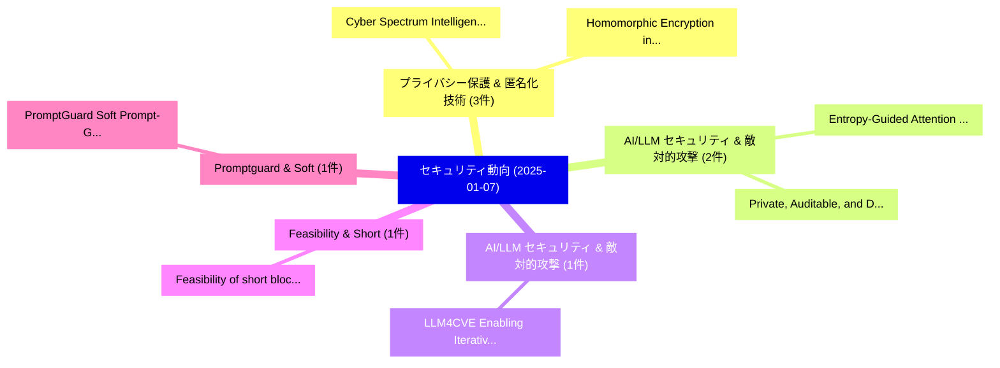

# 📅 02_daily: 日次エグゼクティブサマリー報告書 (2025-01-07)

**集計日時**: 2026-10-02 23:05:13 UTC  
**対象日付**: 2025-01-07  
**本日収集論文数**: 15 件  

---

## 💡 主要セキュリティ動向・脅威インサイト (Executive Insights)

本日の収集論文（計 15 件）において、以下の重点セキュリティ領域で活発な研究動向が確認されました：
- **プライバシー保護 & 匿名化技術** (3 件): 注目論文として 「Cyber Spectrum Intelligence: S...」、「Homomorphic Encryption in Heal...」 等が発表され、実務防御および攻撃検証の進展が見られます。
- **AI/LLM セキュリティ & 敵対的攻撃** (2 件): 注目論文として 「Entropy-Guided Attention for P...」、「Private, Auditable, and Distri...」 等が発表され、実務防御および攻撃検証の進展が見られます。
- **AI/LLM セキュリティ & 敵対的攻撃** (1 件): 注目論文として 「LLM4CVE: Enabling Iterative Au...」 等が発表され、実務防御および攻撃検証の進展が見られます。
- **Feasibility & Short** (1 件): 注目論文として 「Feasibility of short blockleng...」 等が発表され、実務防御および攻撃検証の進展が見られます。
- **Promptguard & Soft** (1 件): 注目論文として 「PromptGuard: Soft Prompt-Guide...」 等が発表され、実務防御および攻撃検証の進展が見られます。

### 🗺️ 技術・脅威トピックマインドマップ

---

## 📌 日次セキュリティ論文一覧 (日本語表形式)

| No | arXiv ID | 論文タイトル (日本語訳) | 重要キーワード | 構造化エグゼクティブ要約 (背景・提案・影響) | 脅威分類 | 詳細リンク |
|---|---|---|---|---|---|---|
| 1 | `2501.03446v1` | [LLM4CVE: Enabling Iterative Automated Vulnerability Repair with 大規模言語モデル](../../okf/papers/2025-01-07/2501.03446.md) | `Enabling Iterative Automated Vulnerability Repair`, `Large Language Models`, `Mohammad Abdullah Al Faruque` | 【提案】概要 (Overview & Key Finding) 本論文「LLM4CVE: Enabling Iterative Automated 脆弱性 Repair with 大...。実証評価により経営層・セキュリティ管理者向け推奨アクション (E... | `cs.CR` | [arXiv](https://arxiv.org/abs/2501.03446v1) &#124; [OKF](../../okf/papers/2025-01-07/2501.03446.md) |
| 2 | `2501.03449v2` | [Feasibility of short blocklength Reed-Muller codes for physical layer security in real environment（セキュリティ分析論文）](../../okf/papers/2025-01-07/2501.03449.md) | `Reed-Muller codes`, `Md Munibun Billah`, `Tyler Sweat` | 【提案】概要 (Overview & Key Finding) 本論文「Feasibility of short blocklength Reed-Muller codes for ...。実証評価により経営層・セキュリティ管理者向け推奨アクション (E... | `cs.CR` | [arXiv](https://arxiv.org/abs/2501.03449v2) &#124; [OKF](../../okf/papers/2025-01-07/2501.03449.md) |
| 3 | `2501.03489v2` | [Entropy-Guided Attention for Private LLMs（セキュリティ分析論文）](../../okf/papers/2025-01-07/2501.03489.md) | `Guided Attention`, `Entropy-Guided Attention`, `Nandan Kumar Jha` | 【提案】概要 (Overview & Key Finding) 本論文「Entropy-Guided Attention for Private LLMs（セキュリティ分析論文）」（...。実証評価により経営層・セキュリティ管理者向け推奨アクション (E... | `cs.CR` | [arXiv](https://arxiv.org/abs/2501.03489v2) &#124; [OKF](../../okf/papers/2025-01-07/2501.03489.md) |
| 4 | `2501.03544v5` | [PromptGuard: Soft Prompt-Guided Unsafe Content Moderation for Text-to-Image Models（セキュリティ分析論文）](../../okf/papers/2025-01-07/2501.03544.md) | `Guided Unsafe Content Moderation`, `Soft Prompt`, `Image Models` | 【提案】概要 (Overview & Key Finding) 本論文「PromptGuard: Soft Prompt-Guided Unsafe Content Moderati...。実証評価により経営層・セキュリティ管理者向け推奨アクション (E... | `cs.CR` | [arXiv](https://arxiv.org/abs/2501.03544v5) &#124; [OKF](../../okf/papers/2025-01-07/2501.03544.md) |
| 5 | `2501.03695v2` | [Unraveling Responsiveness of Chained BFT Consensus with Network Delay（セキュリティ分析論文）](../../okf/papers/2025-01-07/2501.03695.md) | `Unraveling Responsiveness`, `Network Delay`, `Yining Tang` | 【提案】概要 (Overview & Key Finding) 本論文「Unraveling Responsiveness of Chained BFT Consensus with...。実証評価により経営層・セキュリティ管理者向け推奨アクション (E... | `cs.CR` | [arXiv](https://arxiv.org/abs/2501.03695v2) &#124; [OKF](../../okf/papers/2025-01-07/2501.03695.md) |
| 6 | `2501.03709v2` | [The log concavity of two graphical sequences（セキュリティ分析論文）](../../okf/papers/2025-01-07/2501.03709.md) | `Minjia Shi`, `Lu Wang`, `Patrick Sole` | 【提案】概要 (Overview & Key Finding) 本論文「The log concavity of two graphical sequences（セキュリティ分析論文...。実証評価により経営層・セキュリティ管理者向け推奨アクション (E... | `cs.CR` | [arXiv](https://arxiv.org/abs/2501.03709v2) &#124; [OKF](../../okf/papers/2025-01-07/2501.03709.md) |
| 7 | `2501.03800v3` | [MADation: Face Morphing Attack Detection with Foundation Models（セキュリティ分析論文）](../../okf/papers/2025-01-07/2501.03800.md) | `Face Morphing Attack Detection`, `Foundation Models`, `Eduarda Caldeira` | 【提案】概要 (Overview & Key Finding) 本論文「MADation: Face Morphing Attack Detection with Foundatio...。実証評価により経営層・セキュリティ管理者向け推奨アクション (E... | `cs.CR` | [arXiv](https://arxiv.org/abs/2501.03800v3) &#124; [OKF](../../okf/papers/2025-01-07/2501.03800.md) |
| 8 | `2501.03808v1` | [Private, Auditable, and Distributed Ledger for Financial Institutes（セキュリティ分析論文）](../../okf/papers/2025-01-07/2501.03808.md) | `Distributed Ledger`, `Financial Institutes`, `Yeoh Wei Zhu` | 【提案】概要 (Overview & Key Finding) 本論文「Private, Auditable, and Distributed Ledger for Financia...。実証評価により経営層・セキュリティ管理者向け推奨アクション (E... | `cs.CR` | [arXiv](https://arxiv.org/abs/2501.03808v1) &#124; [OKF](../../okf/papers/2025-01-07/2501.03808.md) |
| 9 | `2501.03898v1` | [SPECTRE: A Hybrid System for an Adaptative and Optimised Cyber Threats Detection, Response and Investigation in Volatile Memory（セキュリティ分析論文）](../../okf/papers/2025-01-07/2501.03898.md) | `Optimised Cyber Threats Detection`, `Hybrid System`, `Volatile Memory` | 【提案】概要 (Overview & Key Finding) 本論文「SPECTRE: A Hybrid System for an Adaptative and Optimise...。実証評価により経営層・セキュリティ管理者向け推奨アクション (E... | `cs.CR` | [arXiv](https://arxiv.org/abs/2501.03898v1) &#124; [OKF](../../okf/papers/2025-01-07/2501.03898.md) |
| 10 | `2501.03977v1` | [Cyber Spectrum Intelligence: Security Applications, Challenges and Road Ahead（セキュリティ分析論文）](../../okf/papers/2025-01-07/2501.03977.md) | `Cyber Spectrum Intelligence`, `Security Applications`, `Road Ahead` | 【提案】概要 (Overview & Key Finding) 本論文「Cyber Spectrum Intelligence: Security Applications, Cha...。実証評価により経営層・セキュリティ管理者向け推奨アクション (E... | `cs.CR` | [arXiv](https://arxiv.org/abs/2501.03977v1) &#124; [OKF](../../okf/papers/2025-01-07/2501.03977.md) |
| 11 | `2501.04058v1` | [Homomorphic Encryption in Healthcare Industry Applications for Protecting Data Privacy（セキュリティ分析論文）](../../okf/papers/2025-01-07/2501.04058.md) | `Healthcare Industry Applications`, `Protecting Data Privacy`, `Homomorphic Encryption` | 【提案】概要 (Overview & Key Finding) 本論文「準同型暗号 in Healthcare Industry Applications for Protectin...。実証評価により経営層・セキュリティ管理者向け推奨アクション (E... | `cs.CR` | [arXiv](https://arxiv.org/abs/2501.04058v1) &#124; [OKF](../../okf/papers/2025-01-07/2501.04058.md) |
| 12 | `2501.04104v1` | [Security by Design Issues in 自動運転車両](../../okf/papers/2025-01-07/2501.04104.md) | `Design Issues`, `Autonomous Vehicles`, `Martin Higgins` | 【提案】概要 (Overview & Key Finding) 本論文「Security by Design Issues in 自動運転車両」（原題: Security by De...。実証評価により経営層・セキュリティ管理者向け推奨アクション (E... | `cs.CR` | [arXiv](https://arxiv.org/abs/2501.04104v1) &#124; [OKF](../../okf/papers/2025-01-07/2501.04104.md) |
| 13 | `2501.04108v2` | [TrojanDec: Data-free Trojan Inputs in Self-supervised Learningの検出](../../okf/papers/2025-01-07/2501.04108.md) | `Trojan Inputs`, `Data-free Detection`, `Self-supervised Learning` | 【提案】概要 (Overview & Key Finding) 本論文「TrojanDec: Data-free Trojan Inputs in Self-supervised L...。実証評価により経営層・セキュリティ管理者向け推奨アクション (E... | `cs.CR` | [arXiv](https://arxiv.org/abs/2501.04108v2) &#124; [OKF](../../okf/papers/2025-01-07/2501.04108.md) |
| 14 | `2501.04168v1` | [Quantum One-Time Memories from Stateless Hardware, Random Access Codes, and Simple Nonconvex Optimization（セキュリティ分析論文）](../../okf/papers/2025-01-07/2501.04168.md) | `Random Access Codes`, `Simple Nonconvex Optimization`, `Quantum One` | 【提案】概要 (Overview & Key Finding) 本論文「量子 One-Time Memories from Stateless Hardware, Random Ac...。実証評価により経営層・セキュリティ管理者向け推奨アクション (E... | `cs.CR` | [arXiv](https://arxiv.org/abs/2501.04168v1) &#124; [OKF](../../okf/papers/2025-01-07/2501.04168.md) |
| 15 | `2501.06227v1` | [Generating and Detecting Various Types of Fake Image and Audio Content: A Review of Modern Deep Learning Technologies and Tools（セキュリティ分析論文）](../../okf/papers/2025-01-07/2501.06227.md) | `Modern Deep Learning Technologies`, `Detecting Various Types`, `Fake Image` | 【提案】概要 (Overview & Key Finding) 本論文「Generating and Detecting Various Types of Fake Image an...。実証評価により経営層・セキュリティ管理者向け推奨アクション (E... | `cs.CR` | [arXiv](https://arxiv.org/abs/2501.06227v1) &#124; [OKF](../../okf/papers/2025-01-07/2501.06227.md) |

