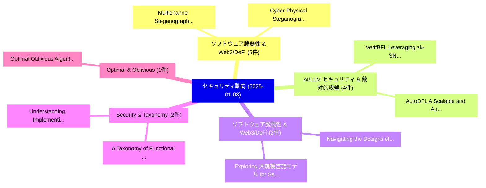

# 📅 02_daily: 日次エグゼクティブサマリー報告書 (2025-01-08)

**集計日時**: 2026-10-02 23:05:13 UTC  
**対象日付**: 2025-01-08  
**本日収集論文数**: 19 件  

---

## 💡 主要セキュリティ動向・脅威インサイト (Executive Insights)

本日の収集論文（計 19 件）において、以下の重点セキュリティ領域で活発な研究動向が確認されました：
- **ソフトウェア脆弱性 & Web3/DeFi** (5 件): 注目論文として 「Multichannel Steganography: A ...」、「Cyber-Physical Steganography i...」 等が発表され、実務防御および攻撃検証の進展が見られます。
- **AI/LLM セキュリティ & 敵対的攻撃** (4 件): 注目論文として 「VerifBFL: Leveraging zk-SNARKs...」、「AutoDFL: A Scalable and Automa...」 等が発表され、実務防御および攻撃検証の進展が見られます。
- **ソフトウェア脆弱性 & Web3/DeFi** (2 件): 注目論文として 「Navigating the Designs of Priv...」、「Exploring 大規模言語モデル for Semanti...」 等が発表され、実務防御および攻撃検証の進展が見られます。
- **Security & Taxonomy** (2 件): 注目論文として 「A Taxonomy of Functional Secur...」、「Understanding, Implementing, a...」 等が発表され、実務防御および攻撃検証の進展が見られます。
- **Optimal & Oblivious** (1 件): 注目論文として 「Optimal Oblivious Algorithms f...」 等が発表され、実務防御および攻撃検証の進展が見られます。

### 🗺️ 技術・脅威トピックマインドマップ

---

## 📌 日次セキュリティ論文一覧 (日本語表形式)

| No | arXiv ID | 論文タイトル (日本語訳) | 重要キーワード | 構造化エグゼクティブ要約 (背景・提案・影響) | 脅威分類 | 詳細リンク |
|---|---|---|---|---|---|---|
| 1 | `2501.04216v2` | [Optimal Oblivious Algorithms for Multi-way Joins（セキュリティ分析論文）](../../okf/papers/2025-01-08/2501.04216.md) | `Optimal Oblivious Algorithms`, `Multi-way Joins`, `Xiao Hu` | 【提案】概要 (Overview & Key Finding) 本論文「Optimal Oblivious Algorithms for Multi-way Joins（セキュリティ...。実証評価により経営層・セキュリティ管理者向け推奨アクション (E... | `cs.CR` | [arXiv](https://arxiv.org/abs/2501.04216v2) &#124; [OKF](../../okf/papers/2025-01-08/2501.04216.md) |
| 2 | `2501.04233v1` | [A note on the differential spectrum of a class of locally APN functions（セキュリティ分析論文）](../../okf/papers/2025-01-08/2501.04233.md) | `Haode Yan`, `Ketong Ren`, `Raw Meta` | 【提案】概要 (Overview & Key Finding) 本論文「A note on the differential spectrum of a class of local...。実証評価により経営層・セキュリティ管理者向け推奨アクション (E... | `cs.CR` | [arXiv](https://arxiv.org/abs/2501.04233v1) &#124; [OKF](../../okf/papers/2025-01-08/2501.04233.md) |
| 3 | `2501.04319v1` | [VerifBFL: Leveraging zk-SNARKs for A Verifiable Blockchained 連合学習](../../okf/papers/2025-01-08/2501.04319.md) | `Verifiable Blockchained Federated Learning`, `Verifiable Blockchained`, `Ahmed Ayoub Bellachia` | 【提案】概要 (Overview & Key Finding) 本論文「VerifBFL: Leveraging zk-SNARKs for A Verifiable Blockch...。実証評価により経営層・セキュリティ管理者向け推奨アクション (E... | `cs.CR` | [arXiv](https://arxiv.org/abs/2501.04319v1) &#124; [OKF](../../okf/papers/2025-01-08/2501.04319.md) |
| 4 | `2501.04323v3` | [Navigating the Designs of Privacy-Preserving Fine-tuning for 大規模言語モデル](../../okf/papers/2025-01-08/2501.04323.md) | `Preserving Fine`, `Privacy-Preserving Fine`, `Large Language Models` | 【提案】概要 (Overview & Key Finding) 本論文「Navigating the Designs of Privacy-Preserving Fine-tunin...。実証評価により経営層・セキュリティ管理者向け推奨アクション (E... | `cs.CR` | [arXiv](https://arxiv.org/abs/2501.04323v3) &#124; [OKF](../../okf/papers/2025-01-08/2501.04323.md) |
| 5 | `2501.04331v1` | [AutoDFL: A Scalable and Automated Reputation-Aware Decentralized 連合学習](../../okf/papers/2025-01-08/2501.04331.md) | `Automated Reputation`, `Reputation-Aware Decentralized`, `Aware Decentralized Federated Learning` | 【提案】概要 (Overview & Key Finding) 本論文「AutoDFL: A Scalable and Automated Reputation-Aware Dece...。実証評価により経営層・セキュリティ管理者向け推奨アクション (E... | `cs.CR` | [arXiv](https://arxiv.org/abs/2501.04331v1) &#124; [OKF](../../okf/papers/2025-01-08/2501.04331.md) |
| 6 | `2501.04362v1` | [Real-world actor-based image steganalysis via classifier inconsistency detection（セキュリティ分析論文）](../../okf/papers/2025-01-08/2501.04362.md) | `Real-world actor`, `Daniel Lerch`, `Raw Meta` | 【提案】概要 (Overview & Key Finding) 本論文「Real-world actor-based image steganalysis via classifie...。実証評価により経営層・セキュリティ管理者向け推奨アクション (E... | `cs.CR` | [arXiv](https://arxiv.org/abs/2501.04362v1) &#124; [OKF](../../okf/papers/2025-01-08/2501.04362.md) |
| 7 | `2501.04394v1` | [Modern Hardware Security: A Review of Attacks and Countermeasures（セキュリティ分析論文）](../../okf/papers/2025-01-08/2501.04394.md) | `Modern Hardware Security`, `Jyotiprakash Mishra`, `Raw Meta` | 【提案】概要 (Overview & Key Finding) 本論文「Modern Hardware Security: A Review of Attacks and Count...。実証評価によりSahay - **。 | `cs.CR` | [arXiv](https://arxiv.org/abs/2501.04394v1) &#124; [OKF](../../okf/papers/2025-01-08/2501.04394.md) |
| 8 | `2501.04454v1` | [A Taxonomy of Functional Security Features and How They Can Be Located（セキュリティ分析論文）](../../okf/papers/2025-01-08/2501.04454.md) | `Functional Security Features`, `Kevin Hermann`, `Simon Schneider` | 【提案】概要 (Overview & Key Finding) 本論文「A Taxonomy of Functional Security Features and How They...。実証評価により経営層・セキュリティ管理者向け推奨アクション (E... | `cs.CR` | [arXiv](https://arxiv.org/abs/2501.04454v1) &#124; [OKF](../../okf/papers/2025-01-08/2501.04454.md) |
| 9 | `2501.04479v1` | [Understanding, Implementing, and Supporting Security Assurance Cases in Safety-Critical Domains（セキュリティ分析論文）](../../okf/papers/2025-01-08/2501.04479.md) | `Supporting Security Assurance Cases`, `Critical Domains`, `Safety-Critical Domains` | 【提案】概要 (Overview & Key Finding) 本論文「Understanding, Implementing, and Supporting Security As...。実証評価により経営層・セキュリティ管理者向け推奨アクション (E... | `cs.CR` | [arXiv](https://arxiv.org/abs/2501.04479v1) &#124; [OKF](../../okf/papers/2025-01-08/2501.04479.md) |
| 10 | `2501.04511v2` | [Multichannel Steganography: A Provably Secure Hybrid Steganographic Model for Secure Communication（セキュリティ分析論文）](../../okf/papers/2025-01-08/2501.04511.md) | `Provably Secure Hybrid Steganographic Model`, `Multichannel Steganography`, `Secure Communication` | 【提案】概要 (Overview & Key Finding) 本論文「Multichannel Steganography: A Provably Secure Hybrid St...。実証評価により経営層・セキュリティ管理者向け推奨アクション (E... | `cs.CR` | [arXiv](https://arxiv.org/abs/2501.04511v2) &#124; [OKF](../../okf/papers/2025-01-08/2501.04511.md) |
| 11 | `2501.04541v1` | [Cyber-Physical Steganography in Robotic Motion Control（セキュリティ分析論文）](../../okf/papers/2025-01-08/2501.04541.md) | `Robotic Motion Control`, `Physical Steganography`, `Cyber-Physical Steganography` | 【提案】概要 (Overview & Key Finding) 本論文「Cyber-Physical Steganography in Robotic Motion Control（...。実証評価により経営層・セキュリティ管理者向け推奨アクション (E... | `cs.CR` | [arXiv](https://arxiv.org/abs/2501.04541v1) &#124; [OKF](../../okf/papers/2025-01-08/2501.04541.md) |
| 12 | `2501.04571v1` | [Scalable Data Notarization Leveraging Hybrid DLTs（セキュリティ分析論文）](../../okf/papers/2025-01-08/2501.04571.md) | `Scalable Data Notarization Leveraging Hybrid`, `Domenico Tortola`, `Claudio Felicioli` | 【提案】概要 (Overview & Key Finding) 本論文「Scalable Data Notarization Leveraging Hybrid DLTs（セキュリテ...。実証評価により経営層・セキュリティ管理者向け推奨アクション (E... | `cs.CR` | [arXiv](https://arxiv.org/abs/2501.04571v1) &#124; [OKF](../../okf/papers/2025-01-08/2501.04571.md) |
| 13 | `2501.04580v2` | [Goldilocks Isolation: High Performance VMs with Edera（セキュリティ分析論文）](../../okf/papers/2025-01-08/2501.04580.md) | `Goldilocks Isolation`, `High Performance`, `Marina Moore` | 【提案】概要 (Overview & Key Finding) 本論文「Goldilocks Isolation: High Performance VMs with Edera（セ...。実証評価により経営層・セキュリティ管理者向け推奨アクション (E... | `cs.CR` | [arXiv](https://arxiv.org/abs/2501.04580v2) &#124; [OKF](../../okf/papers/2025-01-08/2501.04580.md) |
| 14 | `2501.04811v1` | [Fast, Fine-Grained Equivalence Checking for Neural Decompilers（セキュリティ分析論文）](../../okf/papers/2025-01-08/2501.04811.md) | `Grained Equivalence Checking`, `Neural Decompilers`, `Fine-Grained Equivalence` | 【提案】概要 (Overview & Key Finding) 本論文「Fast, Fine-Grained Equivalence Checking for Neural Deco...。実証評価によりSchwartz - **公開日時**: `202... | `cs.CR` | [arXiv](https://arxiv.org/abs/2501.04811v1) &#124; [OKF](../../okf/papers/2025-01-08/2501.04811.md) |
| 15 | `2501.04841v3` | [Blockchain-Based Secure Vehicle Auction System with Smart Contracts（セキュリティ分析論文）](../../okf/papers/2025-01-08/2501.04841.md) | `Based Secure Vehicle Auction System`, `Smart Contracts`, `Blockchain-Based Secure` | 【提案】概要 (Overview & Key Finding) 本論文「Blockchain-Based Secure Vehicle Auction System with スマー...。実証評価により経営層・セキュリティ管理者向け推奨アクション (E... | `cs.CR` | [arXiv](https://arxiv.org/abs/2501.04841v3) &#124; [OKF](../../okf/papers/2025-01-08/2501.04841.md) |
| 16 | `2501.04848v1` | [Exploring 大規模言語モデル for Semantic Analysis and Categorization of Android Malware](../../okf/papers/2025-01-08/2501.04848.md) | `Android Malware`, `Exploring Large Language Models`, `Mst Eshita Khatun` | 【提案】概要 (Overview & Key Finding) 本論文「Exploring 大規模言語モデル for Semantic Analysis and Categoriza...。実証評価により経営層・セキュリティ管理者向け推奨アクション (E... | `cs.CR` | [arXiv](https://arxiv.org/abs/2501.04848v1) &#124; [OKF](../../okf/papers/2025-01-08/2501.04848.md) |
| 17 | `2501.06234v2` | [Fast, Secure, Adaptable: LionsOS Design, Implementation and Performance（セキュリティ分析論文）](../../okf/papers/2025-01-08/2501.06234.md) | `Gernot Heiser`, `Ivan Velickovic`, `Peter Chubb` | 【提案】概要 (Overview & Key Finding) 本論文「Fast, Secure, Adaptable: LionsOS Design, Implementation...。実証評価により経営層・セキュリティ管理者向け推奨アクション (E... | `cs.CR` | [arXiv](https://arxiv.org/abs/2501.06234v2) &#124; [OKF](../../okf/papers/2025-01-08/2501.06234.md) |
| 18 | `2501.06237v1` | [Forecasting Anonymized Electricity Load Profiles（セキュリティ分析論文）](../../okf/papers/2025-01-08/2501.06237.md) | `Forecasting Anonymized Electricity Load Profiles`, `Joaquin Delgado Fernandez`, `Sergio Potenciano Menci` | 【提案】概要 (Overview & Key Finding) 本論文「Forecasting Anonymized Electricity Load Profiles（セキュリティ...。実証評価により経営層・セキュリティ管理者向け推奨アクション (E... | `cs.CR` | [arXiv](https://arxiv.org/abs/2501.06237v1) &#124; [OKF](../../okf/papers/2025-01-08/2501.06237.md) |
| 19 | `2501.06239v1` | [a scalable AI-driven framework for data-independent Cyber Threat Intelligence Information Extractionに向けて](../../okf/papers/2025-01-08/2501.06239.md) | `data-independent Cyber`, `Cyber Threat Intelligence Information Extraction`, `Cyber Threat Intelligence Information` | 【提案】概要 (Overview & Key Finding) 本論文「a scalable AI-driven framework for data-independent Cyb...。実証評価により経営層・セキュリティ管理者向け推奨アクション (E... | `cs.CR` | [arXiv](https://arxiv.org/abs/2501.06239v1) &#124; [OKF](../../okf/papers/2025-01-08/2501.06239.md) |

