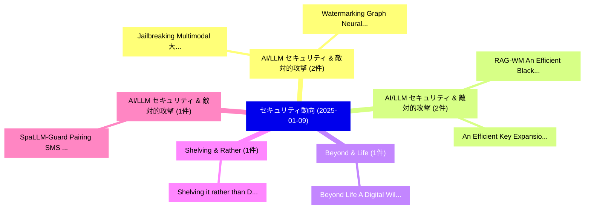

# 📅 02_daily: 日次エグゼクティブサマリー報告書 (2025-01-09)

**集計日時**: 2026-10-02 23:05:13 UTC  
**対象日付**: 2025-01-09  
**本日収集論文数**: 22 件  

---

## 💡 主要セキュリティ動向・脅威インサイト (Executive Insights)

本日の収集論文（計 22 件）において、以下の重点セキュリティ領域で活発な研究動向が確認されました：
- **AI/LLM セキュリティ & 敵対的攻撃** (2 件): 注目論文として 「Jailbreaking Multimodal 大規模言語モ...」、「Watermarking Graph Neural Netw...」 等が発表され、実務防御および攻撃検証の進展が見られます。
- **AI/LLM セキュリティ & 敵対的攻撃** (2 件): 注目論文として 「RAG-WM: An Efficient Black-Box...」、「An Efficient Key Expansion Met...」 等が発表され、実務防御および攻撃検証の進展が見られます。
- **Beyond & Life** (1 件): 注目論文として 「Beyond Life: A Digital Will So...」 等が発表され、実務防御および攻撃検証の進展が見られます。
- **Shelving & Rather** (1 件): 注目論文として 「Shelving it rather than Ditchi...」 等が発表され、実務防御および攻撃検証の進展が見られます。
- **AI/LLM セキュリティ & 敵対的攻撃** (1 件): 注目論文として 「SpaLLM-Guard: Pairing SMS Spam...」 等が発表され、実務防御および攻撃検証の進展が見られます。

### 🗺️ 技術・脅威トピックマインドマップ

---

## 📌 日次セキュリティ論文一覧 (日本語表形式)

| No | arXiv ID | 論文タイトル (日本語訳) | 重要キーワード | 構造化エグゼクティブ要約 (背景・提案・影響) | 脅威分類 | 詳細リンク |
|---|---|---|---|---|---|---|
| 1 | `2501.04900v2` | [Beyond Life: A Digital Will Solution for Posthumous Data Management（セキュリティ分析論文）](../../okf/papers/2025-01-09/2501.04900.md) | `Digital Will Solution`, `Posthumous Data Management`, `Beyond Life` | 【提案】概要 (Overview & Key Finding) 本論文「Beyond Life: A Digital Will Solution for Posthumous Dat...。実証評価により経営層・セキュリティ管理者向け推奨アクション (E... | `cs.CR` | [arXiv](https://arxiv.org/abs/2501.04900v2) &#124; [OKF](../../okf/papers/2025-01-09/2501.04900.md) |
| 2 | `2501.04931v2` | [Jailbreaking Multimodal 大規模言語モデル via Shuffle Inconsistency](../../okf/papers/2025-01-09/2501.04931.md) | `Shuffle Inconsistency`, `Jailbreaking Multimodal Large Language Models`, `Jailbreaking Multimodal` | 【提案】概要 (Overview & Key Finding) 本論文「ジェイルブレイクing Multimodal 大規模言語モデル via Shuffle Inconsisten...。実証評価により経営層・セキュリティ管理者向け推奨アクション (E... | `cs.CR` | [arXiv](https://arxiv.org/abs/2501.04931v2) &#124; [OKF](../../okf/papers/2025-01-09/2501.04931.md) |
| 3 | `2501.04963v1` | [Shelving it rather than Ditching it: Dynamically Debloating DEX and Native Methods of Android Applications without APK Modification（セキュリティ分析論文）](../../okf/papers/2025-01-09/2501.04963.md) | `Dynamically Debloating`, `Native Methods`, `Android Applications` | 【提案】背景とセキュリティ上の課題 (Background & Problem) 本研究はサイバー脅威環境におけるセキュリティ構造・脆弱性の検証を目的としています。(主要検出項目: ...。実証評価により経営層・セキュリティ管理者向け推奨アクション (E... | `cs.CR` | [arXiv](https://arxiv.org/abs/2501.04963v1) &#124; [OKF](../../okf/papers/2025-01-09/2501.04963.md) |
| 4 | `2501.04985v1` | [SpaLLM-Guard: Pairing SMS Spam Detection Using Open-source and Commercial LLMs（セキュリティ分析論文）](../../okf/papers/2025-01-09/2501.04985.md) | `Spam Detection Using Open`, `Mohamed Ali Kaafar`, `Muhammad Salman` | 【提案】概要 (Overview & Key Finding) 本論文「SpaLLM-Guard: Pairing SMS Spam Detection Using Open-sou...。実証評価により経営層・セキュリティ管理者向け推奨アクション (E... | `cs.CR` | [arXiv](https://arxiv.org/abs/2501.04985v1) &#124; [OKF](../../okf/papers/2025-01-09/2501.04985.md) |
| 5 | `2501.05053v1` | [TAPFed: Threshold Secure Aggregation for Privacy-Preserving 連合学習](../../okf/papers/2025-01-09/2501.05053.md) | `Threshold Secure Aggregation`, `Preserving Federated Learning`, `Privacy-Preserving Federated` | 【提案】概要 (Overview & Key Finding) 本論文「TAPFed: Threshold Secure Aggregation for Privacy-Preser...。実証評価により経営層・セキュリティ管理者向け推奨アクション (E... | `cs.CR` | [arXiv](https://arxiv.org/abs/2501.05053v1) &#124; [OKF](../../okf/papers/2025-01-09/2501.05053.md) |
| 6 | `2501.05165v1` | [Bringing Order Amidst Chaos: On the Role of Artificial Intelligence in Secure Software Engineering（セキュリティ分析論文）](../../okf/papers/2025-01-09/2501.05165.md) | `Bringing Order Amidst Chaos`, `Secure Software Engineering`, `Artificial Intelligence` | 【提案】概要 (Overview & Key Finding) 本論文「Bringing Order Amidst Chaos: On the Role of Artificial ...。実証評価により経営層・セキュリティ管理者向け推奨アクション (E... | `cs.CR` | [arXiv](https://arxiv.org/abs/2501.05165v1) &#124; [OKF](../../okf/papers/2025-01-09/2501.05165.md) |
| 7 | `2501.05223v3` | [EVA-S2PLoR: Decentralized Secure 2-party Logistic Regression with A Subtly Hadamard Product Protocol (Full Version)（セキュリティ分析論文）](../../okf/papers/2025-01-09/2501.05223.md) | `Subtly Hadamard Product Protocol`, `Decentralized Secure`, `Logistic Regression` | 【提案】概要 (Overview & Key Finding) 本論文「EVA-S2PLoR: Decentralized Secure 2-party Logistic Regre...。実証評価により経営層・セキュリティ管理者向け推奨アクション (E... | `cs.CR` | [arXiv](https://arxiv.org/abs/2501.05223v3) &#124; [OKF](../../okf/papers/2025-01-09/2501.05223.md) |
| 8 | `2501.05239v1` | [Is Your Autonomous Vehicle Safe? Understanding the Threat of Electromagnetic Signal Injection Attacks on Traffic Scene Perception（セキュリティ分析論文）](../../okf/papers/2025-01-09/2501.05239.md) | `Electromagnetic Signal Injection Attacks`, `Traffic Scene Perception`, `Eugene Yujun Fu` | 【提案】Understanding the 脅威 of Electromagnetic Signal Injection Attacks on Traffic Scene Perce...。実証評価により経営層・セキュリティ管理者向け推奨アクション (E... | `cs.CR` | [arXiv](https://arxiv.org/abs/2501.05239v1) &#124; [OKF](../../okf/papers/2025-01-09/2501.05239.md) |
| 9 | `2501.05249v1` | [RAG-WM: An Efficient Black-Box Watermarking Approach for Retrieval-Augmented Generation of 大規模言語モデル](../../okf/papers/2025-01-09/2501.05249.md) | `Augmented Generation`, `Black-Box Watermarking`, `Retrieval-Augmented Generation` | 【提案】概要 (Overview & Key Finding) 本論文「RAG-WM: An Efficient Black-Box Watermarking Approach fo...。実証評価により経営層・セキュリティ管理者向け推奨アクション (E... | `cs.CR` | [arXiv](https://arxiv.org/abs/2501.05249v1) &#124; [OKF](../../okf/papers/2025-01-09/2501.05249.md) |
| 10 | `2501.05258v1` | [Automating the Code Vulnerabilities by Analyzing GitHub Issuesの検出](../../okf/papers/2025-01-09/2501.05258.md) | `Code Vulnerabilities`, `Daniele Cipollone`, `Changjie Wang` | 【提案】概要 (Overview & Key Finding) 本論文「Automating the Code Vulnerabilities by Analyzing GitHub...。実証評価により経営層・セキュリティ管理者向け推奨アクション (E... | `cs.CR` | [arXiv](https://arxiv.org/abs/2501.05258v1) &#124; [OKF](../../okf/papers/2025-01-09/2501.05258.md) |
| 11 | `2501.05309v1` | [Private Selection with Heterogeneous Sensitivities（セキュリティ分析論文）](../../okf/papers/2025-01-09/2501.05309.md) | `Private Selection`, `Heterogeneous Sensitivities`, `Daniela Antonova` | 【提案】概要 (Overview & Key Finding) 本論文「Private Selection with Heterogeneous Sensitivities（セキュリ...。実証評価により経営層・セキュリティ管理者向け推奨アクション (E... | `cs.CR` | [arXiv](https://arxiv.org/abs/2501.05309v1) &#124; [OKF](../../okf/papers/2025-01-09/2501.05309.md) |
| 12 | `2501.05356v1` | [サイバーセキュリティ in Transportation Systems: Policies and Technology Directions](../../okf/papers/2025-01-09/2501.05356.md) | `Transportation Systems`, `Technology Directions`, `Ostonya Thomas` | 【提案】概要 (Overview & Key Finding) 本論文「サイバーセキュリティ in Transportation Systems: Policies and Tech...。実証評価により経営層・セキュリティ管理者向け推奨アクション (E... | `cs.CR` | [arXiv](https://arxiv.org/abs/2501.05356v1) &#124; [OKF](../../okf/papers/2025-01-09/2501.05356.md) |
| 13 | `2501.05387v1` | [Integrating Explainable AI for Effective マルウェア検出 in Encrypted Network Traffic](../../okf/papers/2025-01-09/2501.05387.md) | `Encrypted Network Traffic`, `Integrating Explainable`, `Effective Malware Detection` | 【提案】概要 (Overview & Key Finding) 本論文「Integrating Explainable AI for Effective マルウェア検出 in Enc...。実証評価により経営層・セキュリティ管理者向け推奨アクション (E... | `cs.CR` | [arXiv](https://arxiv.org/abs/2501.05387v1) &#124; [OKF](../../okf/papers/2025-01-09/2501.05387.md) |
| 14 | `2501.05500v1` | [A Survey of Interactive Verifiable Computing: Utilizing Low-degree Polynomials（セキュリティ分析論文）](../../okf/papers/2025-01-09/2501.05500.md) | `Interactive Verifiable Computing`, `Utilizing Low`, `Low-degree Polynomials` | 【提案】概要 (Overview & Key Finding) 本論文「A Survey of Interactive Verifiable Computing: Utilizing...。実証評価により経営層・セキュリティ管理者向け推奨アクション (E... | `cs.CR` | [arXiv](https://arxiv.org/abs/2501.05500v1) &#124; [OKF](../../okf/papers/2025-01-09/2501.05500.md) |
| 15 | `2501.05535v1` | [On Fair Ordering and Differential Privacy（セキュリティ分析論文）](../../okf/papers/2025-01-09/2501.05535.md) | `Differential Privacy`, `Shir Cohen`, `Neel Basu` | 【提案】概要 (Overview & Key Finding) 本論文「On Fair Ordering and 差分プライバシー（セキュリティ分析論文）」（原題: On Fair ...。実証評価により経営層・セキュリティ管理者向け推奨アクション (E... | `cs.CR` | [arXiv](https://arxiv.org/abs/2501.05535v1) &#124; [OKF](../../okf/papers/2025-01-09/2501.05535.md) |
| 16 | `2501.05542v1` | [Infecting Generative AI With Viruses（セキュリティ分析論文）](../../okf/papers/2025-01-09/2501.05542.md) | `Infecting Generative`, `David Noever`, `Raw Meta` | 【提案】概要 (Overview & Key Finding) 本論文「Infecting Generative AI With Viruses（セキュリティ分析論文）」（原題: I...。実証評価により経営層・セキュリティ管理者向け推奨アクション (E... | `cs.CR` | [arXiv](https://arxiv.org/abs/2501.05542v1) &#124; [OKF](../../okf/papers/2025-01-09/2501.05542.md) |
| 17 | `2501.05614v2` | [Watermarking Graph Neural Networks via Explanations for Ownership Protection（セキュリティ分析論文）](../../okf/papers/2025-01-09/2501.05614.md) | `Watermarking Graph Neural Networks`, `Ownership Protection`, `Jane Downer` | 【提案】概要 (Overview & Key Finding) 本論文「Watermarking Graph Neural Networks via Explanations for...。実証評価により経営層・セキュリティ管理者向け推奨アクション (E... | `cs.CR` | [arXiv](https://arxiv.org/abs/2501.05614v2) &#124; [OKF](../../okf/papers/2025-01-09/2501.05614.md) |
| 18 | `2501.05626v4` | [Kite: How to Delegate Voting Power Privately（セキュリティ分析論文）](../../okf/papers/2025-01-09/2501.05626.md) | `Delegate Voting Power Privately`, `Kamilla Nazirkhanova`, `Vrushank Gunjur` | 【提案】概要 (Overview & Key Finding) 本論文「Kite: How to Delegate Voting Power Privately（セキュリティ分析論文...。実証評価によりPilli Cruz-De Jesus, Dan ... | `cs.CR` | [arXiv](https://arxiv.org/abs/2501.05626v4) &#124; [OKF](../../okf/papers/2025-01-09/2501.05626.md) |
| 19 | `2501.05627v1` | [An Efficient Key Expansion Method Applied to Security Credential Management System（セキュリティ分析論文）](../../okf/papers/2025-01-09/2501.05627.md) | `Security Credential Management System`, `Raw Meta`, `Executive Summary` | 【提案】概要 (Overview & Key Finding) 本論文「An Efficient Key Expansion Method Applied to Security C...。実証評価により経営層・セキュリティ管理者向け推奨アクション (E... | `cs.CR` | [arXiv](https://arxiv.org/abs/2501.05627v1) &#124; [OKF](../../okf/papers/2025-01-09/2501.05627.md) |
| 20 | `2501.06264v1` | [HPAC-IDS: A Hierarchical Packet Attention Convolution for Intrusion Detection System（セキュリティ分析論文）](../../okf/papers/2025-01-09/2501.06264.md) | `Hierarchical Packet Attention Convolution`, `Intrusion Detection System`, `Btissam El Khamlichi` | 【提案】概要 (Overview & Key Finding) 本論文「HPAC-IDS: A Hierarchical Packet Attention Convolution f...。実証評価により経営層・セキュリティ管理者向け推奨アクション (E... | `cs.CR` | [arXiv](https://arxiv.org/abs/2501.06264v1) &#124; [OKF](../../okf/papers/2025-01-09/2501.06264.md) |
| 21 | `2501.06267v1` | [Certifying Digitally Issued Diplomas（セキュリティ分析論文）](../../okf/papers/2025-01-09/2501.06267.md) | `Certifying Digitally Issued Diplomas`, `Geoffrey Goodell`, `Raw Meta` | 【提案】概要 (Overview & Key Finding) 本論文「Certifying Digitally Issued Diplomas（セキュリティ分析論文）」（原題: C...。実証評価により経営層・セキュリティ管理者向け推奨アクション (E... | `cs.CR` | [arXiv](https://arxiv.org/abs/2501.06267v1) &#124; [OKF](../../okf/papers/2025-01-09/2501.06267.md) |
| 22 | `2501.10419v2` | [A Protocol for Compliant, Obliviously Managed Electronic Transfers（セキュリティ分析論文）](../../okf/papers/2025-01-09/2501.10419.md) | `Obliviously Managed Electronic Transfers`, `Geoffrey Goodell`, `Raw Meta` | 【提案】概要 (Overview & Key Finding) 本論文「A Protocol for Compliant, Obliviously Managed Electroni...。実証評価により経営層・セキュリティ管理者向け推奨アクション (E... | `cs.CR` | [arXiv](https://arxiv.org/abs/2501.10419v2) &#124; [OKF](../../okf/papers/2025-01-09/2501.10419.md) |

