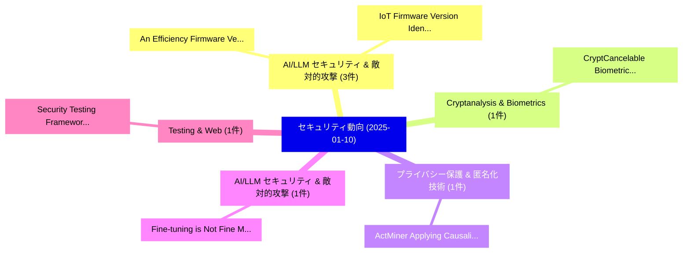

# 📅 02_daily: 日次エグゼクティブサマリー報告書 (2025-01-10)

**集計日時**: 2026-10-02 23:05:13 UTC  
**対象日付**: 2025-01-10  
**本日収集論文数**: 18 件  

---

## 💡 主要セキュリティ動向・脅威インサイト (Executive Insights)

本日の収集論文（計 18 件）において、以下の重点セキュリティ領域で活発な研究動向が確認されました：
- **AI/LLM セキュリティ & 敵対的攻撃** (3 件): 注目論文として 「An Efficiency Firmware Verific...」、「IoT Firmware Version Identific...」 等が発表され、実務防御および攻撃検証の進展が見られます。
- **Cryptanalysis & Biometrics** (1 件): 注目論文として 「CryptCancelable Biometrics Vau...」 等が発表され、実務防御および攻撃検証の進展が見られます。
- **プライバシー保護 & 匿名化技術** (1 件): 注目論文として 「ActMiner: Applying Causality T...」 等が発表され、実務防御および攻撃検証の進展が見られます。
- **AI/LLM セキュリティ & 敵対的攻撃** (1 件): 注目論文として 「Fine-tuning is Not Fine: Mitig...」 等が発表され、実務防御および攻撃検証の進展が見られます。
- **Testing & Web** (1 件): 注目論文として 「Security Testing Framework for...」 等が発表され、実務防御および攻撃検証の進展が見られます。

### 🗺️ 技術・脅威トピックマインドマップ

---

## 📌 日次セキュリティ論文一覧 (日本語表形式)

| No | arXiv ID | 論文タイトル (日本語訳) | 重要キーワード | 構造化エグゼクティブ要約 (背景・提案・影響) | 脅威分類 | 詳細リンク |
|---|---|---|---|---|---|---|
| 1 | `2501.05722v1` | [An Efficiency Firmware Verification Framework for Public Key Infrastructure with Smart Grid and Energy Storage System（セキュリティ分析論文）](../../okf/papers/2025-01-10/2501.05722.md) | `Public Key Infrastructure`, `Energy Storage System`, `Smart Grid` | 【提案】概要 (Overview & Key Finding) 本論文「An Efficiency Firmware Verification Framework for Publi...。実証評価により経営層・セキュリティ管理者向け推奨アクション (E... | `cs.CR` | [arXiv](https://arxiv.org/abs/2501.05722v1) &#124; [OKF](../../okf/papers/2025-01-10/2501.05722.md) |
| 2 | `2501.05786v1` | [CryptCancelable Biometrics Vaultの分析](../../okf/papers/2025-01-10/2501.05786.md) | `Cancelable Biometrics Vault`, `Patrick Lacharme`, `Kevin Thiry` | 【提案】概要 (Overview & Key Finding) 本論文「CryptCancelable Biometrics Vaultの分析」（原題: Cryptanalysis ...。実証評価により経営層・セキュリティ管理者向け推奨アクション (E... | `cs.CR` | [arXiv](https://arxiv.org/abs/2501.05786v1) &#124; [OKF](../../okf/papers/2025-01-10/2501.05786.md) |
| 3 | `2501.05793v2` | [ActMiner: Applying Causality Tracking and Increment Aligning for Graph-based Cyber Threat Hunting（セキュリティ分析論文）](../../okf/papers/2025-01-10/2501.05793.md) | `Applying Causality Tracking`, `Cyber Threat Hunting`, `Increment Aligning` | 【提案】概要 (Overview & Key Finding) 本論文「ActMiner: Applying Causality Tracking and Increment Ali...。実証評価により経営層・セキュリティ管理者向け推奨アクション (E... | `cs.CR` | [arXiv](https://arxiv.org/abs/2501.05793v2) &#124; [OKF](../../okf/papers/2025-01-10/2501.05793.md) |
| 4 | `2501.05835v1` | [Fine-tuning is Not Fine: Mitigating Backdoor Attacks in GNNs with Limited Clean Data（セキュリティ分析論文）](../../okf/papers/2025-01-10/2501.05835.md) | `Mitigating Backdoor Attacks`, `Limited Clean Data`, `Jiale Zhang` | 【提案】背景とセキュリティ上の課題 (Background & Problem) 本研究はサイバー脅威環境におけるセキュリティ構造・脆弱性の検証を目的としています。(主要検出項目: ...。実証評価により経営層・セキュリティ管理者向け推奨アクション (E... | `cs.CR` | [arXiv](https://arxiv.org/abs/2501.05835v1) &#124; [OKF](../../okf/papers/2025-01-10/2501.05835.md) |
| 5 | `2501.05907v1` | [Security Testing Framework for Web Applications: ZAP V2.12.0 and V2.13.0 by OWASP as an exampleのベンチマーク評価](../../okf/papers/2025-01-10/2501.05907.md) | `Web Applications`, `Sri Potti`, `Sheng Huang` | 【提案】概要 (Overview & Key Finding) 本論文「Security Testing Framework for Web Applications: ZAP V2...。実証評価により経営層・セキュリティ管理者向け推奨アクション (E... | `cs.CR` | [arXiv](https://arxiv.org/abs/2501.05907v1) &#124; [OKF](../../okf/papers/2025-01-10/2501.05907.md) |
| 6 | `2501.05923v1` | [From Balance to Breach: Cyber Threats to Battery Energy Storage Systems（セキュリティ分析論文）](../../okf/papers/2025-01-10/2501.05923.md) | `Battery Energy Storage Systems`, `Cyber Threats`, `Joakim Oscarsson` | 【提案】概要 (Overview & Key Finding) 本論文「From Balance to Breach: Cyber Threats to Battery Energy...。実証評価により経営層・セキュリティ管理者向け推奨アクション (E... | `cs.CR` | [arXiv](https://arxiv.org/abs/2501.05923v1) &#124; [OKF](../../okf/papers/2025-01-10/2501.05923.md) |
| 7 | `2501.05928v3` | [Backdoor Stealthiness in Model Parameter Spaceに向けて](../../okf/papers/2025-01-10/2501.05928.md) | `Towards Backdoor Stealthiness`, `Model Parameter Space`, `Backdoor Stealthiness` | 【提案】概要 (Overview & Key Finding) 本論文「Backdoor Stealthiness in Model Parameter Spaceに向けて」（原題:...。実証評価により経営層・セキュリティ管理者向け推奨アクション (E... | `cs.CR` | [arXiv](https://arxiv.org/abs/2501.05928v3) &#124; [OKF](../../okf/papers/2025-01-10/2501.05928.md) |
| 8 | `2501.06010v1` | [RPKI-Based Location-Unaware Tor Guard Relay Selection Algorithms（セキュリティ分析論文）](../../okf/papers/2025-01-10/2501.06010.md) | `Unaware Tor Guard Relay Selection Algorithms`, `Based Location`, `RPKI-Based Location` | 【提案】概要 (Overview & Key Finding) 本論文「RPKI-Based Location-Unaware Tor Guard Relay Selection A...。実証評価により経営層・セキュリティ管理者向け推奨アクション (E... | `cs.CR` | [arXiv](https://arxiv.org/abs/2501.06010v1) &#124; [OKF](../../okf/papers/2025-01-10/2501.06010.md) |
| 9 | `2501.06033v1` | [IoT Firmware Version Identification Using Transfer Learning with Twin Neural Networks（セキュリティ分析論文）](../../okf/papers/2025-01-10/2501.06033.md) | `Firmware Version Identification Using Transfer Learning`, `Twin Neural Networks`, `Firmware Version Identification Using Trans` | 【提案】概要 (Overview & Key Finding) 本論文「IoT Firmware Version Identification Using Transfer Lear...。実証評価により経営層・セキュリティ管理者向け推奨アクション (E... | `cs.CR` | [arXiv](https://arxiv.org/abs/2501.06033v1) &#124; [OKF](../../okf/papers/2025-01-10/2501.06033.md) |
| 10 | `2501.06071v1` | [Unveiling Malware Patterns: A Self-analysis Perspective（セキュリティ分析論文）](../../okf/papers/2025-01-10/2501.06071.md) | `Unveiling Malware Patterns`, `Self-analysis Perspective`, `Fangtian Zhong` | 【提案】概要 (Overview & Key Finding) 本論文「Unveiling マルウェア Patterns: A Self-analysis Perspective（セ...。実証評価により経営層・セキュリティ管理者向け推奨アクション (E... | `cs.CR` | [arXiv](https://arxiv.org/abs/2501.06071v1) &#124; [OKF](../../okf/papers/2025-01-10/2501.06071.md) |
| 11 | `2501.06084v1` | [Verifying the Fisher-Yates Shuffle Algorithm in Dafny（セキュリティ分析論文）](../../okf/papers/2025-01-10/2501.06084.md) | `Yates Shuffle Algorithm`, `Fisher-Yates Shuffle`, `Stefan Zetzsche` | 【提案】概要 (Overview & Key Finding) 本論文「Verifying the Fisher-Yates Shuffle Algorithm in Dafny（セ...。実証評価により経営層・セキュリティ管理者向け推奨アクション (E... | `cs.CR` | [arXiv](https://arxiv.org/abs/2501.06084v1) &#124; [OKF](../../okf/papers/2025-01-10/2501.06084.md) |
| 12 | `2501.06087v2` | [Privacy-Preserving and Simultaneous Authentication in High-Density V2X Networks（セキュリティ分析論文）](../../okf/papers/2025-01-10/2501.06087.md) | `Simultaneous Authentication`, `High-Density V2X`, `Morteza Azmoudeh Afshar` | 【提案】概要 (Overview & Key Finding) 本論文「Privacy-Preserving and Simultaneous Authentication in H...。実証評価により経営層・セキュリティ管理者向け推奨アクション (E... | `cs.CR` | [arXiv](https://arxiv.org/abs/2501.06087v2) &#124; [OKF](../../okf/papers/2025-01-10/2501.06087.md) |
| 13 | `2501.06161v2` | [RIOT-based smart metering system for privacy-preserving data aggregation using watermarking and encryption（セキュリティ分析論文）](../../okf/papers/2025-01-10/2501.06161.md) | `RIOT-based smart`, `privacy-preserving data`, `Farzana Kabir` | 【提案】概要 (Overview & Key Finding) 本論文「RIOT-based smart metering system for privacy-preserving...。実証評価により経営層・セキュリティ管理者向け推奨アクション (E... | `cs.CR` | [arXiv](https://arxiv.org/abs/2501.06161v2) &#124; [OKF](../../okf/papers/2025-01-10/2501.06161.md) |
| 14 | `2501.06281v1` | [Autonomous Identity-Based Threat Segmentation in Zero Trust Architectures（セキュリティ分析論文）](../../okf/papers/2025-01-10/2501.06281.md) | `Based Threat Segmentation`, `Zero Trust Architectures`, `Autonomous Identity` | 【提案】概要 (Overview & Key Finding) 本論文「Autonomous Identity-Based 脅威 Segmentation in ゼロトラスト Arc...。実証評価により経営層・セキュリティ管理者向け推奨アクション (E... | `cs.CR` | [arXiv](https://arxiv.org/abs/2501.06281v1) &#124; [OKF](../../okf/papers/2025-01-10/2501.06281.md) |
| 15 | `2501.06305v1` | [Reinforcement Learning-Driven Adaptation Chains: A Robust Framework for Multi-Cloud Workflow Security（セキュリティ分析論文）](../../okf/papers/2025-01-10/2501.06305.md) | `Driven Adaptation Chains`, `Cloud Workflow Security`, `Reinforcement Learning` | 【提案】概要 (Overview & Key Finding) 本論文「Reinforcement Learning-Driven Adaptation Chains: A Robu...。実証評価により経営層・セキュリティ管理者向け推奨アクション (E... | `cs.CR` | [arXiv](https://arxiv.org/abs/2501.06305v1) &#124; [OKF](../../okf/papers/2025-01-10/2501.06305.md) |
| 16 | `2501.06319v1` | [Quantum Entanglement and Measurement Noise: A Novel Approach to Satellite Node Authentication（セキュリティ分析論文）](../../okf/papers/2025-01-10/2501.06319.md) | `Satellite Node Authentication`, `Quantum Entanglement`, `Measurement Noise` | 【提案】概要 (Overview & Key Finding) 本論文「量子 Entanglement and Measurement Noise: A Novel Approach...。実証評価により経営層・セキュリティ管理者向け推奨アクション (E... | `cs.CR` | [arXiv](https://arxiv.org/abs/2501.06319v1) &#124; [OKF](../../okf/papers/2025-01-10/2501.06319.md) |
| 17 | `2501.06367v1` | [Resilient Endurance-Aware NVM-based PUF against Learning-based Attacks（セキュリティ分析論文）](../../okf/papers/2025-01-10/2501.06367.md) | `Resilient Endurance`, `Endurance-Aware NVM`, `Learning-based Attacks` | 【提案】概要 (Overview & Key Finding) 本論文「Resilient Endurance-Aware NVM-based PUF against Learnin...。実証評価により経営層・セキュリティ管理者向け推奨アクション (E... | `cs.CR` | [arXiv](https://arxiv.org/abs/2501.06367v1) &#124; [OKF](../../okf/papers/2025-01-10/2501.06367.md) |
| 18 | `2501.07597v1` | [Learning-based GPS Spoofing Attack for Quadrotorsの検出](../../okf/papers/2025-01-10/2501.07597.md) | `Spoofing Attack`, `Learning-based Detection`, `Learning-based GPS` | 【提案】概要 (Overview & Key Finding) 本論文「Learning-based GPS Spoofing Attack for Quadrotorsの検出」（原...。実証評価により経営層・セキュリティ管理者向け推奨アクション (E... | `cs.CR` | [arXiv](https://arxiv.org/abs/2501.07597v1) &#124; [OKF](../../okf/papers/2025-01-10/2501.07597.md) |

