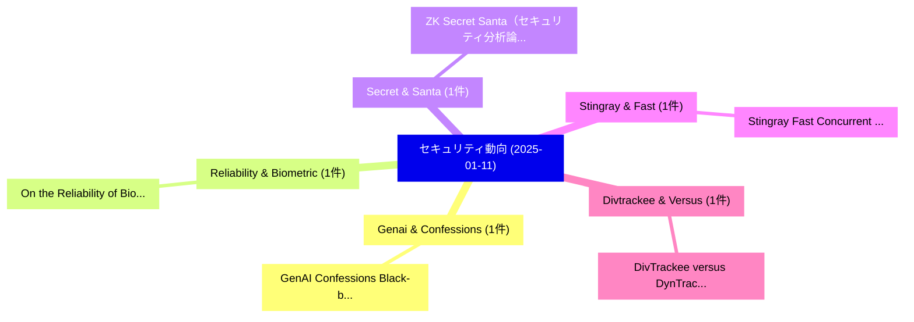

# 📅 02_daily: 日次エグゼクティブサマリー報告書 (2025-01-11)

**集計日時**: 2026-10-02 23:05:14 UTC  
**対象日付**: 2025-01-11  
**本日収集論文数**: 9 件  

---

## 💡 主要セキュリティ動向・脅威インサイト (Executive Insights)

本日の収集論文（計 9 件）において、以下の重点セキュリティ領域で活発な研究動向が確認されました：
- **Genai & Confessions** (1 件): 注目論文として 「GenAI Confessions: Black-box M...」 等が発表され、実務防御および攻撃検証の進展が見られます。
- **Reliability & Biometric** (1 件): 注目論文として 「On the Reliability of Biometri...」 等が発表され、実務防御および攻撃検証の進展が見られます。
- **Secret & Santa** (1 件): 注目論文として 「ZK Secret Santa（セキュリティ分析論文）」 等が発表され、実務防御および攻撃検証の進展が見られます。
- **Stingray & Fast** (1 件): 注目論文として 「Stingray: Fast Concurrent Tran...」 等が発表され、実務防御および攻撃検証の進展が見られます。
- **Divtrackee & Versus** (1 件): 注目論文として 「DivTrackee versus DynTracker: ...」 等が発表され、実務防御および攻撃検証の進展が見られます。

### 🗺️ 技術・脅威トピックマインドマップ

---

## 📌 日次セキュリティ論文一覧 (日本語表形式)

| No | arXiv ID | 論文タイトル (日本語訳) | 重要キーワード | 構造化エグゼクティブ要約 (背景・提案・影響) | 脅威分類 | 詳細リンク |
|---|---|---|---|---|---|---|
| 1 | `2501.06399v2` | [GenAI Confessions: Black-box Membership Inference for Generative Image Models（セキュリティ分析論文）](../../okf/papers/2025-01-11/2501.06399.md) | `Generative Image Models`, `Membership Inference`, `Black-box Membership` | 【提案】概要 (Overview & Key Finding) 本論文「GenAI Confessions: Black-box Membership Inference for G...。実証評価により経営層・セキュリティ管理者向け推奨アクション (E... | `cs.CR` | [arXiv](https://arxiv.org/abs/2501.06399v2) &#124; [OKF](../../okf/papers/2025-01-11/2501.06399.md) |
| 2 | `2501.06504v1` | [On the Reliability of Biometric Datasets: How Much Test Data Ensures Reliability?（セキュリティ分析論文）](../../okf/papers/2025-01-11/2501.06504.md) | `Biometric Datasets`, `Pankaja Priya Ramasamy`, `Patricia Arias Cabarcos` | 【提案】### (日本語題名: On the Reliability of Biometric Datasets: How Much Test Data Ensures Reliab...。実証評価により経営層・セキュリティ管理者向け推奨アクション (E... | `cs.CR` | [arXiv](https://arxiv.org/abs/2501.06504v1) &#124; [OKF](../../okf/papers/2025-01-11/2501.06504.md) |
| 3 | `2501.06515v1` | [ZK Secret Santa（セキュリティ分析論文）](../../okf/papers/2025-01-11/2501.06515.md) | `Secret Santa`, `Artem Chystiakov`, `Kyrylo Riabov` | 【提案】概要 (Overview & Key Finding) 本論文「ZK Secret Santa（セキュリティ分析論文）」（原題: ZK Secret Santa / arXi...。実証評価により経営層・セキュリティ管理者向け推奨アクション (E... | `cs.CR` | [arXiv](https://arxiv.org/abs/2501.06515v1) &#124; [OKF](../../okf/papers/2025-01-11/2501.06515.md) |
| 4 | `2501.06531v1` | [Stingray: Fast Concurrent Transactions Without Consensus（セキュリティ分析論文）](../../okf/papers/2025-01-11/2501.06531.md) | `Fast Concurrent Transactions Without Consensus`, `Srivatsan Sridhar`, `Alberto Sonnino` | 【提案】背景とセキュリティ上の課題 (Background & Problem) 本研究はサイバー脅威環境におけるセキュリティ構造・脆弱性の検証を目的としています。(主要検出項目: ...。実証評価により経営層・セキュリティ管理者向け推奨アクション (E... | `cs.CR` | [arXiv](https://arxiv.org/abs/2501.06531v1) &#124; [OKF](../../okf/papers/2025-01-11/2501.06531.md) |
| 5 | `2501.06533v2` | [DivTrackee versus DynTracker: Promoting Diversity in Anti-Facial Recognition against Dynamic FR Strategy（セキュリティ分析論文）](../../okf/papers/2025-01-11/2501.06533.md) | `Promoting Diversity`, `Facial Recognition`, `Anti-Facial Recognition` | 【提案】概要 (Overview & Key Finding) 本論文「DivTrackee versus DynTracker: Promoting Diversity in An...。実証評価により経営層・セキュリティ管理者向け推奨アクション (E... | `cs.CR` | [arXiv](https://arxiv.org/abs/2501.06533v2) &#124; [OKF](../../okf/papers/2025-01-11/2501.06533.md) |
| 6 | `2501.06620v3` | [Functional Approximation Methods for Differentially Private Distribution Estimation（セキュリティ分析論文）](../../okf/papers/2025-01-11/2501.06620.md) | `Differentially Private Distribution Estimation`, `Functional Approximation Methods`, `Ye Tao` | 【提案】概要 (Overview & Key Finding) 本論文「Functional Approximation Methods for Differentially Pri...。実証評価により経営層・セキュリティ管理者向け推奨アクション (E... | `cs.CR` | [arXiv](https://arxiv.org/abs/2501.06620v3) &#124; [OKF](../../okf/papers/2025-01-11/2501.06620.md) |
| 7 | `2501.06646v1` | [RogueRFM: Attacking Refresh Management for Covert-Channel and Denial-of-Service（セキュリティ分析論文）](../../okf/papers/2025-01-11/2501.06646.md) | `Attacking Refresh Management`, `Hritvik Taneja`, `Moinuddin Qureshi` | 【提案】概要 (Overview & Key Finding) 本論文「RogueRFM: Attacking Refresh Management for Covert-Chann...。実証評価により経営層・セキュリティ管理者向け推奨アクション (E... | `cs.CR` | [arXiv](https://arxiv.org/abs/2501.06646v1) &#124; [OKF](../../okf/papers/2025-01-11/2501.06646.md) |
| 8 | `2501.06650v2` | [SafeSplit: A Novel Defense Against Client-Side Backdoor Attacks in Split Learning (Full Version)（セキュリティ分析論文）](../../okf/papers/2025-01-11/2501.06650.md) | `Side Backdoor Attacks`, `Split Learning`, `Full Version` | 【提案】概要 (Overview & Key Finding) 本論文「SafeSplit: A Novel Defense Against Client-Side Backdoor...。実証評価により経営層・セキュリティ管理者向け推奨アクション (E... | `cs.CR` | [arXiv](https://arxiv.org/abs/2501.06650v2) &#124; [OKF](../../okf/papers/2025-01-11/2501.06650.md) |
| 9 | `2501.10427v1` | [Who Are "We"? Power Centers in Threat Modeling（セキュリティ分析論文）](../../okf/papers/2025-01-11/2501.10427.md) | `Power Centers`, `Threat Modeling`, `Adam Shostack` | 【提案】Power Centers in 脅威 Modeling ### (日本語題名: Who Are "We"?。実証評価により経営層・セキュリティ管理者向け推奨アクション (Executive Recommendations) - 組織のセキュリテ... | `cs.CR` | [arXiv](https://arxiv.org/abs/2501.10427v1) &#124; [OKF](../../okf/papers/2025-01-11/2501.10427.md) |

