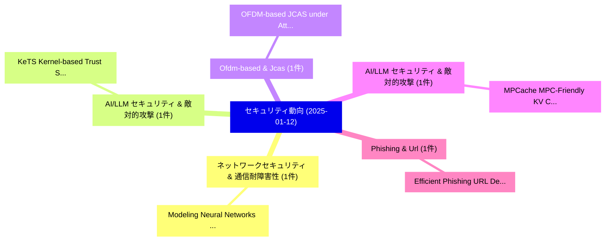

# 📅 02_daily: 日次エグゼクティブサマリー報告書 (2025-01-12)

**集計日時**: 2026-10-02 23:05:14 UTC  
**対象日付**: 2025-01-12  
**本日収集論文数**: 8 件  

---

## 💡 主要セキュリティ動向・脅威インサイト (Executive Insights)

本日の収集論文（計 8 件）において、以下の重点セキュリティ領域で活発な研究動向が確認されました：
- **ネットワークセキュリティ & 通信耐障害性** (1 件): 注目論文として 「Modeling Neural Networks with ...」 等が発表され、実務防御および攻撃検証の進展が見られます。
- **AI/LLM セキュリティ & 敵対的攻撃** (1 件): 注目論文として 「KeTS: Kernel-based Trust Segme...」 等が発表され、実務防御および攻撃検証の進展が見られます。
- **Ofdm-based & Jcas** (1 件): 注目論文として 「OFDM-based JCAS under Attack: ...」 等が発表され、実務防御および攻撃検証の進展が見られます。
- **AI/LLM セキュリティ & 敵対的攻撃** (1 件): 注目論文として 「MPCache: MPC-Friendly KV Cache...」 等が発表され、実務防御および攻撃検証の進展が見られます。
- **Phishing & Url** (1 件): 注目論文として 「Efficient Phishing URL Detecti...」 等が発表され、実務防御および攻撃検証の進展が見られます。

### 🗺️ 技術・脅威トピックマインドマップ

---

## 📌 日次セキュリティ論文一覧 (日本語表形式)

| No | arXiv ID | 論文タイトル (日本語訳) | 重要キーワード | 構造化エグゼクティブ要約 (背景・提案・影響) | 脅威分類 | 詳細リンク |
|---|---|---|---|---|---|---|
| 1 | `2501.06686v2` | [Modeling Neural Networks with Privacy Using Neural Stochastic Differential Equations（セキュリティ分析論文）](../../okf/papers/2025-01-12/2501.06686.md) | `Privacy Using Neural Stochastic Differential Equations`, `Modeling Neural Networks`, `Privacy Using Neural Stochastic Differential` | 【提案】概要 (Overview & Key Finding) 本論文「Modeling Neural Networks with Privacy Using Neural Stoc...。実証評価により経営層・セキュリティ管理者向け推奨アクション (E... | `cs.CR` | [arXiv](https://arxiv.org/abs/2501.06686v2) &#124; [OKF](../../okf/papers/2025-01-12/2501.06686.md) |
| 2 | `2501.06729v2` | [KeTS: Kernel-based Trust Segmentation against Model Poisoning Attacks（セキュリティ分析論文）](../../okf/papers/2025-01-12/2501.06729.md) | `Model Poisoning Attacks`, `Trust Segmentation`, `Kernel-based Trust` | 【提案】概要 (Overview & Key Finding) 本論文「KeTS: Kernel-based Trust Segmentation against モデル汚染 Att...。実証評価により経営層・セキュリティ管理者向け推奨アクション (E... | `cs.CR` | [arXiv](https://arxiv.org/abs/2501.06729v2) &#124; [OKF](../../okf/papers/2025-01-12/2501.06729.md) |
| 3 | `2501.06798v1` | [OFDM-based JCAS under Attack: The Dual Threat of Spoofing and Jamming in WLAN Sensing（セキュリティ分析論文）](../../okf/papers/2025-01-12/2501.06798.md) | `OFDM-based JCAS`, `Hasan Can Yildirim`, `Musa Furkan Keskin` | 【提案】概要 (Overview & Key Finding) 本論文「OFDM-based JCAS under Attack: The Dual 脅威 of Spoofing a...。実証評価により経営層・セキュリティ管理者向け推奨アクション (E... | `cs.CR` | [arXiv](https://arxiv.org/abs/2501.06798v1) &#124; [OKF](../../okf/papers/2025-01-12/2501.06798.md) |
| 4 | `2501.06807v2` | [MPCache: MPC-Friendly KV Cache Eviction for Efficient Private LLM Inference（セキュリティ分析論文）](../../okf/papers/2025-01-12/2501.06807.md) | `Cache Eviction`, `Efficient Private`, `MPC-Friendly KV` | 【提案】概要 (Overview & Key Finding) 本論文「MPCache: MPC-Friendly KV Cache Eviction for Efficient P...。実証評価により経営層・セキュリティ管理者向け推奨アクション (E... | `cs.CR` | [arXiv](https://arxiv.org/abs/2501.06807v2) &#124; [OKF](../../okf/papers/2025-01-12/2501.06807.md) |
| 5 | `2501.06912v1` | [Efficient Phishing URL Detection Using Graph-based Machine Learning and Loopy Belief Propagation（セキュリティ分析論文）](../../okf/papers/2025-01-12/2501.06912.md) | `Detection Using Graph`, `Loopy Belief Propagation`, `Efficient Phishing` | 【提案】概要 (Overview & Key Finding) 本論文「Efficient Phishing URL Detection Using Graph-based Mach...。実証評価により経営層・セキュリティ管理者向け推奨アクション (E... | `cs.CR` | [arXiv](https://arxiv.org/abs/2501.06912v1) &#124; [OKF](../../okf/papers/2025-01-12/2501.06912.md) |
| 6 | `2501.06953v1` | [ByzSFL: Achieving Byzantine-Robust Secure 連合学習 with Zero-Knowledge Proofs](../../okf/papers/2025-01-12/2501.06953.md) | `Achieving Byzantine`, `Knowledge Proofs`, `Byzantine-Robust Secure` | 【提案】概要 (Overview & Key Finding) 本論文「ByzSFL: Achieving Byzantine-Robust Secure 連合学習 with Zer...。実証評価により# ByzSFL: Achieving Byzan... | `cs.CR` | [arXiv](https://arxiv.org/abs/2501.06953v1) &#124; [OKF](../../okf/papers/2025-01-12/2501.06953.md) |
| 7 | `2501.06963v2` | [Generative Artificial Intelligence-Supported Pentesting: A Comparison between Claude Opus, GPT-4, and Copilot（セキュリティ分析論文）](../../okf/papers/2025-01-12/2501.06963.md) | `Generative Artificial Intelligence`, `Supported Pentesting`, `Claude Opus` | 【提案】概要 (Overview & Key Finding) 本論文「Generative Artificial Intelligence-Supported Pentesting...。実証評価により経営層・セキュリティ管理者向け推奨アクション (E... | `cs.CR` | [arXiv](https://arxiv.org/abs/2501.06963v2) &#124; [OKF](../../okf/papers/2025-01-12/2501.06963.md) |
| 8 | `2501.09029v1` | [Enhancing Data Integrity through Provenance Tracking in Semantic Web Frameworks（セキュリティ分析論文）](../../okf/papers/2025-01-12/2501.09029.md) | `Enhancing Data Integrity`, `Semantic Web Frameworks`, `Provenance Tracking` | 【提案】概要 (Overview & Key Finding) 本論文「Enhancing Data Integrity through Provenance Tracking in...。実証評価により経営層・セキュリティ管理者向け推奨アクション (E... | `cs.CR` | [arXiv](https://arxiv.org/abs/2501.09029v1) &#124; [OKF](../../okf/papers/2025-01-12/2501.09029.md) |

