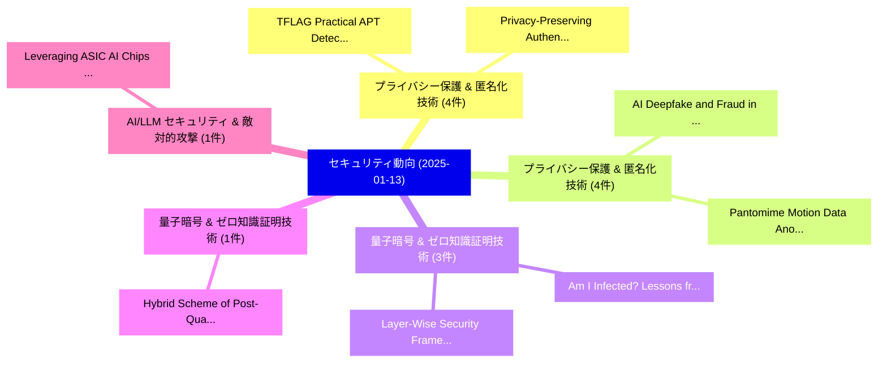

# 📅 02_daily: 日次エグゼクティブサマリー報告書 (2025-01-13)

**集計日時**: 2026-10-02 23:05:14 UTC  
**対象日付**: 2025-01-13  
**本日収集論文数**: 25 件  

---

## 💡 主要セキュリティ動向・脅威インサイト (Executive Insights)

本日の収集論文（計 25 件）において、以下の重点セキュリティ領域で活発な研究動向が確認されました：
- **プライバシー保護 & 匿名化技術** (4 件): 注目論文として 「TFLAG:Practical APT Detection ...」、「Privacy-Preserving Authenticat...」 等が発表され、実務防御および攻撃検証の進展が見られます。
- **プライバシー保護 & 匿名化技術** (4 件): 注目論文として 「AI Deepfake and Fraud in Onlin...」、「Pantomime: Motion Data Anonymi...」 等が発表され、実務防御および攻撃検証の進展が見られます。
- **量子暗号 & ゼロ知識証明技術** (3 件): 注目論文として 「Layer-Wise Security Framework ...」、「Am I Infected? Lessons from Op...」 等が発表され、実務防御および攻撃検証の進展が見られます。
- **量子暗号 & ゼロ知識証明技術** (1 件): 注目論文として 「Hybrid Scheme of Post-Quantum ...」 等が発表され、実務防御および攻撃検証の進展が見られます。
- **AI/LLM セキュリティ & 敵対的攻撃** (1 件): 注目論文として 「Leveraging ASIC AI Chips for H...」 等が発表され、実務防御および攻撃検証の進展が見られます。

### 🗺️ 技術・脅威トピックマインドマップ

---

## 📌 日次セキュリティ論文一覧 (日本語表形式)

| No | arXiv ID | 論文タイトル (日本語訳) | 重要キーワード | 構造化エグゼクティブ要約 (背景・提案・影響) | 脅威分類 | 詳細リンク |
|---|---|---|---|---|---|---|
| 1 | `2501.06989v1` | [Layer-Wise Security Framework and Analysis for the Quantum Internet（セキュリティ分析論文）](../../okf/papers/2025-01-13/2501.06989.md) | `Quantum Internet`, `Layer-Wise Security`, `Zebo Yang` | 【提案】概要 (Overview & Key Finding) 本論文「Layer-Wise Security Framework and Analysis for the 量子 I...。実証評価により経営層・セキュリティ管理者向け推奨アクション (E... | `cs.CR` | [arXiv](https://arxiv.org/abs/2501.06989v1) &#124; [OKF](../../okf/papers/2025-01-13/2501.06989.md) |
| 2 | `2501.06997v2` | [TFLAG:Practical APT Detection via Deviation-Aware Learning on Temporal Provenance Graphに向けて](../../okf/papers/2025-01-13/2501.06997.md) | `Aware Learning`, `Deviation-Aware Learning`, `Towards Practical` | 【提案】概要 (Overview & Key Finding) 本論文「TFLAG:Practical APT Detection via Deviation-Aware Learn...。実証評価により経営層・セキュリティ管理者向け推奨アクション (E... | `cs.CR` | [arXiv](https://arxiv.org/abs/2501.06997v2) &#124; [OKF](../../okf/papers/2025-01-13/2501.06997.md) |
| 3 | `2501.07028v1` | [Hybrid Scheme of Post-Quantum Cryptography and Elliptic-Curve Cryptography for Certificates -- A Case Study of Security Credential Management System in Vehicle-to-Everything Communications（セキュリティ分析論文）](../../okf/papers/2025-01-13/2501.07028.md) | `Security Credential Management System`, `Hybrid Scheme`, `Quantum Cryptography` | 【提案】概要 (Overview & Key Finding) 本論文「Hybrid Scheme of ポスト量子暗号 and Elliptic-Curve 暗号技術 for Ce...。実証評価によりセキュリティ影響と実験結果 (Results & ... | `cs.CR` | [arXiv](https://arxiv.org/abs/2501.07028v1) &#124; [OKF](../../okf/papers/2025-01-13/2501.07028.md) |
| 4 | `2501.07033v3` | [AI Deepfake and Fraud in Online Payments Using GAN-Based Modelsの検出](../../okf/papers/2025-01-13/2501.07033.md) | `Online Payments Using`, `Based Models`, `GAN-Based Models` | 【提案】概要 (Overview & Key Finding) 本論文「AI Deepfake and Fraud in Online Payments Using GAN-Base...。実証評価により経営層・セキュリティ管理者向け推奨アクション (E... | `cs.CR` | [arXiv](https://arxiv.org/abs/2501.07033v3) &#124; [OKF](../../okf/papers/2025-01-13/2501.07033.md) |
| 5 | `2501.07047v4` | [Leveraging ASIC AI Chips for Homomorphic Encryption（セキュリティ分析論文）](../../okf/papers/2025-01-13/2501.07047.md) | `Homomorphic Encryption`, `Jianming Tong`, `Tianhao Huang` | 【提案】概要 (Overview & Key Finding) 本論文「Leveraging ASIC AI Chips for 準同型暗号（セキュリティ分析論文）」（原題: Lev...。実証評価により経営層・セキュリティ管理者向け推奨アクション (E... | `cs.CR` | [arXiv](https://arxiv.org/abs/2501.07047v4) &#124; [OKF](../../okf/papers/2025-01-13/2501.07047.md) |
| 6 | `2501.07058v1` | [Logic Meets Magic: LLMs Cracking Smart Contract Vulnerabilities（セキュリティ分析論文）](../../okf/papers/2025-01-13/2501.07058.md) | `Cracking Smart Contract Vulnerabilities`, `Logic Meets Magic`, `Qin Wang` | 【提案】概要 (Overview & Key Finding) 本論文「Logic Meets Magic: LLMs Cracking スマートコントラクト Vulnerabili...。実証評価により経営層・セキュリティ管理者向け推奨アクション (E... | `cs.CR` | [arXiv](https://arxiv.org/abs/2501.07058v1) &#124; [OKF](../../okf/papers/2025-01-13/2501.07058.md) |
| 7 | `2501.07131v2` | [ThreatLinker: An NLP-based Methodology to Automatically Estimate CVE Relevance for CAPEC Attack Patterns（セキュリティ分析論文）](../../okf/papers/2025-01-13/2501.07131.md) | `Automatically Estimate`, `NLP-based Methodology`, `Attack Patterns` | 【提案】概要 (Overview & Key Finding) 本論文「ThreatLinker: An NLP-based Methodology to Automatically...。実証評価により経営層・セキュリティ管理者向け推奨アクション (E... | `cs.CR` | [arXiv](https://arxiv.org/abs/2501.07131v2) &#124; [OKF](../../okf/papers/2025-01-13/2501.07131.md) |
| 8 | `2501.07149v2` | [Pantomime: Motion Data Anonymization using Foundation Motion Models（セキュリティ分析論文）](../../okf/papers/2025-01-13/2501.07149.md) | `Motion Data Anonymization`, `Foundation Motion Models`, `Simon Hanisch` | 【提案】概要 (Overview & Key Finding) 本論文「Pantomime: Motion Data Anonymization using Foundation M...。実証評価により経営層・セキュリティ管理者向け推奨アクション (E... | `cs.CR` | [arXiv](https://arxiv.org/abs/2501.07149v2) &#124; [OKF](../../okf/papers/2025-01-13/2501.07149.md) |
| 9 | `2501.07192v1` | [A4O: All Trigger for One sample（セキュリティ分析論文）](../../okf/papers/2025-01-13/2501.07192.md) | `Duc Anh Vu`, `Anh Tuan Tran`, `Cong Tran` | 【提案】概要 (Overview & Key Finding) 本論文「A4O: All Trigger for One sample（セキュリティ分析論文）」（原題: A4O: A...。実証評価により経営層・セキュリティ管理者向け推奨アクション (E... | `cs.CR` | [arXiv](https://arxiv.org/abs/2501.07192v1) &#124; [OKF](../../okf/papers/2025-01-13/2501.07192.md) |
| 10 | `2501.07207v1` | [Beyond Security-by-design: a compromised systemのセキュリティ強化](../../okf/papers/2025-01-13/2501.07207.md) | `Beyond Security`, `Awais Rashid`, `Sana Belguith` | 【提案】概要 (Overview & Key Finding) 本論文「Beyond Security-by-design: a compromised systemのセキュリティ強...。実証評価により経営層・セキュリティ管理者向け推奨アクション (E... | `cs.CR` | [arXiv](https://arxiv.org/abs/2501.07207v1) &#124; [OKF](../../okf/papers/2025-01-13/2501.07207.md) |
| 11 | `2501.07208v1` | [A Secure Remote Password Protocol From The Learning With Errors Problem（セキュリティ分析論文）](../../okf/papers/2025-01-13/2501.07208.md) | `Huapeng Li`, `Baocheng Wang`, `Raw Meta` | 【提案】概要 (Overview & Key Finding) 本論文「A Secure Remote Password Protocol From The Learning Wit...。実証評価により経営層・セキュリティ管理者向け推奨アクション (E... | `cs.CR` | [arXiv](https://arxiv.org/abs/2501.07208v1) &#124; [OKF](../../okf/papers/2025-01-13/2501.07208.md) |
| 12 | `2501.07209v2` | [Privacy-Preserving Authentication: Theory vs. Practice（セキュリティ分析論文）](../../okf/papers/2025-01-13/2501.07209.md) | `Preserving Authentication`, `Privacy-Preserving Authentication`, `Daniel Slamanig` | 【提案】概要 (Overview & Key Finding) 本論文「Privacy-Preserving Authentication: Theory vs. Practice（...。実証評価により経営層・セキュリティ管理者向け推奨アクション (E... | `cs.CR` | [arXiv](https://arxiv.org/abs/2501.07209v2) &#124; [OKF](../../okf/papers/2025-01-13/2501.07209.md) |
| 13 | `2501.07251v3` | [MOS-Attack: A Scalable Multi-objective Adversarial Attack Framework（セキュリティ分析論文）](../../okf/papers/2025-01-13/2501.07251.md) | `Scalable Multi`, `Multi-objective Adversarial`, `Ping Guo` | 【提案】概要 (Overview & Key Finding) 本論文「MOS-Attack: A Scalable Multi-objective 敵対的攻撃 Framework（...。実証評価により経営層・セキュリティ管理者向け推奨アクション (E... | `cs.CR` | [arXiv](https://arxiv.org/abs/2501.07251v3) &#124; [OKF](../../okf/papers/2025-01-13/2501.07251.md) |
| 14 | `2501.07262v1` | [OblivCDN: A Practical Privacy-preserving CDN with Oblivious Content Access（セキュリティ分析論文）](../../okf/papers/2025-01-13/2501.07262.md) | `Oblivious Content Access`, `Practical Privacy`, `Privacy-preserving CDN` | 【提案】概要 (Overview & Key Finding) 本論文「OblivCDN: A Practical Privacy-preserving CDN with Obliv...。実証評価により経営層・セキュリティ管理者向け推奨アクション (E... | `cs.CR` | [arXiv](https://arxiv.org/abs/2501.07262v1) &#124; [OKF](../../okf/papers/2025-01-13/2501.07262.md) |
| 15 | `2501.07326v1` | [Am I Infected? Lessons from Operating a Large-Scale IoT Security Diagnostic Service（セキュリティ分析論文）](../../okf/papers/2025-01-13/2501.07326.md) | `Security Diagnostic Service`, `Large-Scale IoT`, `Takayuki Sasaki` | 【提案】Lessons from Operating a Large-Scale IoT Security Diagnostic Service ### (日本語題名: Am I I...。実証評価により経営層・セキュリティ管理者向け推奨アクション (E... | `cs.CR` | [arXiv](https://arxiv.org/abs/2501.07326v1) &#124; [OKF](../../okf/papers/2025-01-13/2501.07326.md) |
| 16 | `2501.07380v1` | [Device-Bound vs. Synced Credentials: A Comparative Evaluation of Passkey Authentication（セキュリティ分析論文）](../../okf/papers/2025-01-13/2501.07380.md) | `Synced Credentials`, `Passkey Authentication`, `Device-Bound vs` | 【提案】概要 (Overview & Key Finding) 本論文「Device-Bound vs. Synced Credentials: A Comparative Eval...。実証評価により経営層・セキュリティ管理者向け推奨アクション (E... | `cs.CR` | [arXiv](https://arxiv.org/abs/2501.07380v1) &#124; [OKF](../../okf/papers/2025-01-13/2501.07380.md) |
| 17 | `2501.07435v2` | [Union: A Trust-minimized Bridge for Rootstock（セキュリティ分析論文）](../../okf/papers/2025-01-13/2501.07435.md) | `Trust-minimized Bridge`, `Sergio Demian Lerner`, `Ramon Amela` | 【提案】概要 (Overview & Key Finding) 本論文「Union: A Trust-minimized Bridge for Rootstock（セキュリティ分析論...。実証評価により経営層・セキュリティ管理者向け推奨アクション (E... | `cs.CR` | [arXiv](https://arxiv.org/abs/2501.07435v2) &#124; [OKF](../../okf/papers/2025-01-13/2501.07435.md) |
| 18 | `2501.07475v1` | [A Novel Approach to Network Traffic Analysis: the HERA tool（セキュリティ分析論文）](../../okf/papers/2025-01-13/2501.07475.md) | `Daniela Pinto`, `Ivone Amorim`, `Eva Maia` | 【提案】概要 (Overview & Key Finding) 本論文「A Novel Approach to Network Traffic Analysis: the HERA ...。実証評価により経営層・セキュリティ管理者向け推奨アクション (E... | `cs.CR` | [arXiv](https://arxiv.org/abs/2501.07475v1) &#124; [OKF](../../okf/papers/2025-01-13/2501.07475.md) |
| 19 | `2501.07476v1` | [Encrypted Computation of Collision Probability for Secure Satellite Conjunction Analysis（セキュリティ分析論文）](../../okf/papers/2025-01-13/2501.07476.md) | `Encrypted Computation`, `Collision Probability`, `Jihoon Suh` | 【提案】概要 (Overview & Key Finding) 本論文「Encrypted Computation of Collision Probability for Secu...。実証評価により経営層・セキュリティ管理者向け推奨アクション (E... | `cs.CR` | [arXiv](https://arxiv.org/abs/2501.07476v1) &#124; [OKF](../../okf/papers/2025-01-13/2501.07476.md) |
| 20 | `2501.07493v1` | [Exploring and Mitigating Adversarial Manipulation of Voting-Based Leaderboards（セキュリティ分析論文）](../../okf/papers/2025-01-13/2501.07493.md) | `Mitigating Adversarial Manipulation`, `Based Leaderboards`, `Voting-Based Leaderboards` | 【提案】概要 (Overview & Key Finding) 本論文「Exploring and Mitigating Adversarial Manipulation of Vo...。実証評価により経営層・セキュリティ管理者向け推奨アクション (E... | `cs.CR` | [arXiv](https://arxiv.org/abs/2501.07493v1) &#124; [OKF](../../okf/papers/2025-01-13/2501.07493.md) |
| 21 | `2501.07535v1` | [Code Generation for Cryptographic Kernels using Multi-word Modular Arithmetic on GPU（セキュリティ分析論文）](../../okf/papers/2025-01-13/2501.07535.md) | `Code Generation`, `Cryptographic Kernels`, `Modular Arithmetic` | 【提案】概要 (Overview & Key Finding) 本論文「Code Generation for Cryptographic Kernels using Multi-w...。実証評価により経営層・セキュリティ管理者向け推奨アクション (E... | `cs.CR` | [arXiv](https://arxiv.org/abs/2501.07535v1) &#124; [OKF](../../okf/papers/2025-01-13/2501.07535.md) |
| 22 | `2501.07695v1` | [Masking Countermeasures Against Side-Channel Attacks on Quantum Computers（セキュリティ分析論文）](../../okf/papers/2025-01-13/2501.07695.md) | `Channel Attacks`, `Quantum Computers`, `Side-Channel Attacks` | 【提案】概要 (Overview & Key Finding) 本論文「Masking Countermeasures Against サイドチャネル攻撃 Attacks on 量子...。実証評価によりLeGrow, Travis Morrison, ... | `cs.CR` | [arXiv](https://arxiv.org/abs/2501.07695v1) &#124; [OKF](../../okf/papers/2025-01-13/2501.07695.md) |
| 23 | `2501.07703v1` | [A Review on the Security Vulnerabilities of the IoMT against Malware Attacks and DDoS（セキュリティ分析論文）](../../okf/papers/2025-01-13/2501.07703.md) | `Security Vulnerabilities`, `Malware Attacks`, `Lily Dzamesi` | 【提案】概要 (Overview & Key Finding) 本論文「A Review on the Security Vulnerabilities of the IoMT ag...。実証評価により経営層・セキュリティ管理者向け推奨アクション (E... | `cs.CR` | [arXiv](https://arxiv.org/abs/2501.07703v1) &#124; [OKF](../../okf/papers/2025-01-13/2501.07703.md) |
| 24 | `2501.09031v1` | [Synthetic Data and Health Privacy（セキュリティ分析論文）](../../okf/papers/2025-01-13/2501.09031.md) | `Synthetic Data`, `Health Privacy`, `Xavier Monnet` | 【提案】概要 (Overview & Key Finding) 本論文「Synthetic Data and Health Privacy（セキュリティ分析論文）」（原題: Synt...。実証評価により経営層・セキュリティ管理者向け推奨アクション (E... | `cs.CR` | [arXiv](https://arxiv.org/abs/2501.09031v1) &#124; [OKF](../../okf/papers/2025-01-13/2501.09031.md) |
| 25 | `2501.10441v1` | [A Review of Detection, Evolution, and Data Reconstruction Strategies for False Data Injection Attacks in Power Cyber-Physical Systems（セキュリティ分析論文）](../../okf/papers/2025-01-13/2501.10441.md) | `False Data Injection Attacks`, `Data Reconstruction Strategies`, `Power Cyber` | 【提案】概要 (Overview & Key Finding) 本論文「A Review of Detection, Evolution, and Data Reconstructi...。実証評価により経営層・セキュリティ管理者向け推奨アクション (E... | `cs.CR` | [arXiv](https://arxiv.org/abs/2501.10441v1) &#124; [OKF](../../okf/papers/2025-01-13/2501.10441.md) |

