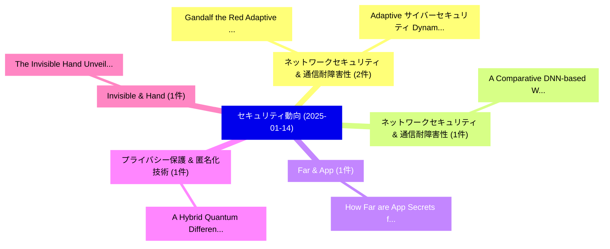

# 📅 02_daily: 日次エグゼクティブサマリー報告書 (2025-01-14)

**集計日時**: 2026-10-02 23:05:14 UTC  
**対象日付**: 2025-01-14  
**本日収集論文数**: 19 件  

---

## 💡 主要セキュリティ動向・脅威インサイト (Executive Insights)

本日の収集論文（計 19 件）において、以下の重点セキュリティ領域で活発な研究動向が確認されました：
- **ネットワークセキュリティ & 通信耐障害性** (2 件): 注目論文として 「Gandalf the Red: Adaptive Secu...」、「Adaptive サイバーセキュリティ: Dynamical...」 等が発表され、実務防御および攻撃検証の進展が見られます。
- **ネットワークセキュリティ & 通信耐障害性** (1 件): 注目論文として 「A Comparative DNN-based White-...」 等が発表され、実務防御および攻撃検証の進展が見られます。
- **Far & App** (1 件): 注目論文として 「How Far are App Secrets from B...」 等が発表され、実務防御および攻撃検証の進展が見られます。
- **プライバシー保護 & 匿名化技術** (1 件): 注目論文として 「A Hybrid Quantum Differential ...」 等が発表され、実務防御および攻撃検証の進展が見られます。
- **Invisible & Hand** (1 件): 注目論文として 「The Invisible Hand: Unveiling ...」 等が発表され、実務防御および攻撃検証の進展が見られます。

### 🗺️ 技術・脅威トピックマインドマップ

---

## 📌 日次セキュリティ論文一覧 (日本語表形式)

| No | arXiv ID | 論文タイトル (日本語訳) | 重要キーワード | 構造化エグゼクティブ要約 (背景・提案・影響) | 脅威分類 | 詳細リンク |
|---|---|---|---|---|---|---|
| 1 | `2501.07801v1` | [A Comparative DNN-based White-Box Explainable AI Methods in Network Securityの分析](../../okf/papers/2025-01-14/2501.07801.md) | `Box Explainable`, `DNN-based White`, `Network Security` | 【提案】概要 (Overview & Key Finding) 本論文「A Comparative DNN-based White-Box Explainable AI Method...。実証評価により経営層・セキュリティ管理者向け推奨アクション (E... | `cs.CR` | [arXiv](https://arxiv.org/abs/2501.07801v1) &#124; [OKF](../../okf/papers/2025-01-14/2501.07801.md) |
| 2 | `2501.07805v1` | [How Far are App Secrets from Being Stolen? A Case Study on Android（セキュリティ分析論文）](../../okf/papers/2025-01-14/2501.07805.md) | `App Secrets`, `Lili Wei`, `Heqing Huang` | 【提案】A Case Study on Android ### (日本語題名: How Far are App Secrets from Being Stolen?。実証評価により経営層・セキュリティ管理者向け推奨アクション (Executive Rec... | `cs.CR` | [arXiv](https://arxiv.org/abs/2501.07805v1) &#124; [OKF](../../okf/papers/2025-01-14/2501.07805.md) |
| 3 | `2501.07844v2` | [A Hybrid Quantum Differential Privacyに向けて](../../okf/papers/2025-01-14/2501.07844.md) | `Hybrid Quantum Differential Privacy`, `Hybrid Quantum Differential`, `Shiva Raj Pokhrel` | 【提案】概要 (Overview & Key Finding) 本論文「A Hybrid 量子 差分プライバシーに向けて」（原題: Towards A Hybrid 量子 差分プライ...。実証評価によりVasilakos, Tianqing Zhu, ... | `cs.CR` | [arXiv](https://arxiv.org/abs/2501.07844v2) &#124; [OKF](../../okf/papers/2025-01-14/2501.07844.md) |
| 4 | `2501.07849v3` | [The Invisible Hand: Unveiling Provider Bias in 大規模言語モデル for Code Generation](../../okf/papers/2025-01-14/2501.07849.md) | `Unveiling Provider Bias`, `Code Generation`, `Large Language Models` | 【提案】概要 (Overview & Key Finding) 本論文「The Invisible Hand: Unveiling Provider Bias in 大規模言語モデル...。実証評価により経営層・セキュリティ管理者向け推奨アクション (E... | `cs.CR` | [arXiv](https://arxiv.org/abs/2501.07849v3) &#124; [OKF](../../okf/papers/2025-01-14/2501.07849.md) |
| 5 | `2501.07868v1` | [PUFBind: PUF-Enabled Lightweight Program Binary Authentication for FPGA-based Embedded Systems（セキュリティ分析論文）](../../okf/papers/2025-01-14/2501.07868.md) | `Enabled Lightweight Program Binary Authentication`, `PUF-Enabled Lightweight`, `Embedded Systems` | 【提案】概要 (Overview & Key Finding) 本論文「PUFBind: PUF-Enabled Lightweight Program Binary Authent...。実証評価により経営層・セキュリティ管理者向け推奨アクション (E... | `cs.CR` | [arXiv](https://arxiv.org/abs/2501.07868v1) &#124; [OKF](../../okf/papers/2025-01-14/2501.07868.md) |
| 6 | `2501.07927v3` | [Gandalf the Red: Adaptive Security for LLMs（セキュリティ分析論文）](../../okf/papers/2025-01-14/2501.07927.md) | `Adaptive Security`, `Niklas Pfister`, `Manuel Knott` | 【提案】概要 (Overview & Key Finding) 本論文「Gandalf the Red: Adaptive Security for LLMs（セキュリティ分析論文）...。実証評価により経営層・セキュリティ管理者向け推奨アクション (E... | `cs.CR` | [arXiv](https://arxiv.org/abs/2501.07927v3) &#124; [OKF](../../okf/papers/2025-01-14/2501.07927.md) |
| 7 | `2501.07955v1` | [Differentially Private Distance Query with Asymmetric Noise（セキュリティ分析論文）](../../okf/papers/2025-01-14/2501.07955.md) | `Differentially Private Distance Query`, `Asymmetric Noise`, `Weihong Sheng` | 【提案】概要 (Overview & Key Finding) 本論文「Differentially Private Distance Query with Asymmetric N...。実証評価により経営層・セキュリティ管理者向け推奨アクション (E... | `cs.CR` | [arXiv](https://arxiv.org/abs/2501.07955v1) &#124; [OKF](../../okf/papers/2025-01-14/2501.07955.md) |
| 8 | `2501.08031v1` | [Entropy Mixing Networks: Enhancing Pseudo-Random Number Generators with Lightweight Dynamic Entropy Injection（セキュリティ分析論文）](../../okf/papers/2025-01-14/2501.08031.md) | `Lightweight Dynamic Entropy Injection`, `Entropy Mixing Networks`, `Random Number Generators` | 【提案】概要 (Overview & Key Finding) 本論文「Entropy Mixing Networks: Enhancing Pseudo-Random Number...。実証評価により経営層・セキュリティ管理者向け推奨アクション (E... | `cs.CR` | [arXiv](https://arxiv.org/abs/2501.08031v1) &#124; [OKF](../../okf/papers/2025-01-14/2501.08031.md) |
| 9 | `2501.08137v4` | [Audio-Visual Deepfake Detection With Local Temporal Inconsistencies（セキュリティ分析論文）](../../okf/papers/2025-01-14/2501.08137.md) | `Audio-Visual Deepfake`, `Marcella Astrid`, `Enjie Ghorbel` | 【提案】概要 (Overview & Key Finding) 本論文「Audio-Visual Deepfake Detection With Local Temporal Inc...。実証評価により経営層・セキュリティ管理者向け推奨アクション (E... | `cs.CR` | [arXiv](https://arxiv.org/abs/2501.08137v4) &#124; [OKF](../../okf/papers/2025-01-14/2501.08137.md) |
| 10 | `2501.08249v2` | [Verifying Device Drivers with Pancake（セキュリティ分析論文）](../../okf/papers/2025-01-14/2501.08249.md) | `Verifying Device Drivers`, `Tiana Tsang Ung`, `Tsun Wang Sau` | 【提案】概要 (Overview & Key Finding) 本論文「Verifying Device Drivers with Pancake（セキュリティ分析論文）」（原題: ...。実証評価によりTruong, Tsun Wang Sau, Th... | `cs.CR` | [arXiv](https://arxiv.org/abs/2501.08249v2) &#124; [OKF](../../okf/papers/2025-01-14/2501.08249.md) |
| 11 | `2501.08258v2` | [an End-to-End (E2E) Adversarial Learning and Application in the Physical Worldに向けて](../../okf/papers/2025-01-14/2501.08258.md) | `Adversarial Learning`, `Physical World`, `Dudi Biton` | 【提案】概要 (Overview & Key Finding) 本論文「an End-to-End (E2E) Adversarial Learning and Applicatio...。実証評価により経営層・セキュリティ管理者向け推奨アクション (E... | `cs.CR` | [arXiv](https://arxiv.org/abs/2501.08258v2) &#124; [OKF](../../okf/papers/2025-01-14/2501.08258.md) |
| 12 | `2501.08435v1` | [Secure Composition of Quantum Key Distribution and Symmetric Key Encryption（セキュリティ分析論文）](../../okf/papers/2025-01-14/2501.08435.md) | `Quantum Key Distribution`, `Symmetric Key Encryption`, `Secure Composition` | 【提案】概要 (Overview & Key Finding) 本論文「Secure Composition of 量子鍵配送 and Symmetric Key Encryptio...。実証評価により経営層・セキュリティ管理者向け推奨アクション (E... | `cs.CR` | [arXiv](https://arxiv.org/abs/2501.08435v1) &#124; [OKF](../../okf/papers/2025-01-14/2501.08435.md) |
| 13 | `2501.08449v2` | [A Refreshment Stirred, Not Shaken: Invariant-Preserving Deployments of Differential Privacy for the U.S. Decennial Census（セキュリティ分析論文）](../../okf/papers/2025-01-14/2501.08449.md) | `Refreshment Stirred`, `Preserving Deployments`, `Differential Privacy` | 【提案】Decennial Census / arXiv: 2501.08449v2）は、cs.CR 分野における最新セキュリティ研究成果を取り扱っています。  **概要**: 本研...。実証評価により経営層・セキュリティ管理者向け推奨アクション (E... | `cs.CR` | [arXiv](https://arxiv.org/abs/2501.08449v2) &#124; [OKF](../../okf/papers/2025-01-14/2501.08449.md) |
| 14 | `2501.08454v2` | [Tag&Tab: Pretraining Data Detection in 大規模言語モデル Using Keyword-Based Membership Inference Attack](../../okf/papers/2025-01-14/2501.08454.md) | `Based Membership Inference Attack`, `Pretraining Data Detection`, `Keyword-Based Membership` | 【提案】概要 (Overview & Key Finding) 本論文「Tag&Tab: Pretraining Data Detection in 大規模言語モデル Using K...。実証評価により経営層・セキュリティ管理者向け推奨アクション (E... | `cs.CR` | [arXiv](https://arxiv.org/abs/2501.08454v2) &#124; [OKF](../../okf/papers/2025-01-14/2501.08454.md) |
| 15 | `2501.09032v1` | [Distributed Identity for Zero Trust and Segmented Access Control: A Novel Approach to Network Infrastructureのセキュリティ強化](../../okf/papers/2025-01-14/2501.09032.md) | `Segmented Access Control`, `Distributed Identity`, `Zero Trust` | 【提案】概要 (Overview & Key Finding) 本論文「Distributed Identity for ゼロトラスト and Segmented アクセス制御: A...。実証評価により経営層・セキュリティ管理者向け推奨アクション (E... | `cs.CR` | [arXiv](https://arxiv.org/abs/2501.09032v1) &#124; [OKF](../../okf/papers/2025-01-14/2501.09032.md) |
| 16 | `2501.09033v1` | [Adaptive サイバーセキュリティ: Dynamically Retrainable Firewalls for Real-Time Network Protection](../../okf/papers/2025-01-14/2501.09033.md) | `Dynamically Retrainable Firewalls`, `Time Network Protection`, `Real-Time Network` | 【提案】概要 (Overview & Key Finding) 本論文「Adaptive サイバーセキュリティ: Dynamically Retrainable Firewalls ...。実証評価により経営層・セキュリティ管理者向け推奨アクション (E... | `cs.CR` | [arXiv](https://arxiv.org/abs/2501.09033v1) &#124; [OKF](../../okf/papers/2025-01-14/2501.09033.md) |
| 17 | `2501.09039v1` | [Playing Devil's Advocate: Unmasking Toxicity and Vulnerabilities in Large Vision-Language Models（セキュリティ分析論文）](../../okf/papers/2025-01-14/2501.09039.md) | `Playing Devil`, `Unmasking Toxicity`, `Large Vision` | 【提案】概要 (Overview & Key Finding) 本論文「Playing Devil's Advocate: Unmasking Toxicity and Vulner...。実証評価により経営層・セキュリティ管理者向け推奨アクション (E... | `cs.CR` | [arXiv](https://arxiv.org/abs/2501.09039v1) &#124; [OKF](../../okf/papers/2025-01-14/2501.09039.md) |
| 18 | `2501.10443v1` | [Monetary Evolution: How Societies Shaped Money from Antiquity to Cryptocurrencies（セキュリティ分析論文）](../../okf/papers/2025-01-14/2501.10443.md) | `Monetary Evolution`, `Mahya Karbalaii`, `Raw Meta` | 【提案】概要 (Overview & Key Finding) 本論文「Monetary Evolution: How Societies Shaped Money from Ant...。実証評価により経営層・セキュリティ管理者向け推奨アクション (E... | `cs.CR` | [arXiv](https://arxiv.org/abs/2501.10443v1) &#124; [OKF](../../okf/papers/2025-01-14/2501.10443.md) |
| 19 | `2501.17866v3` | [Advancing Brainwave-Based Biometrics: A Large-Scale, Multi-Session Evaluation（セキュリティ分析論文）](../../okf/papers/2025-01-14/2501.17866.md) | `Advancing Brainwave`, `Based Biometrics`, `Brainwave-Based Biometrics` | 【提案】概要 (Overview & Key Finding) 本論文「Advancing Brainwave-Based Biometrics: A Large-Scale, Mu...。実証評価により経営層・セキュリティ管理者向け推奨アクション (E... | `cs.CR` | [arXiv](https://arxiv.org/abs/2501.17866v3) &#124; [OKF](../../okf/papers/2025-01-14/2501.17866.md) |

