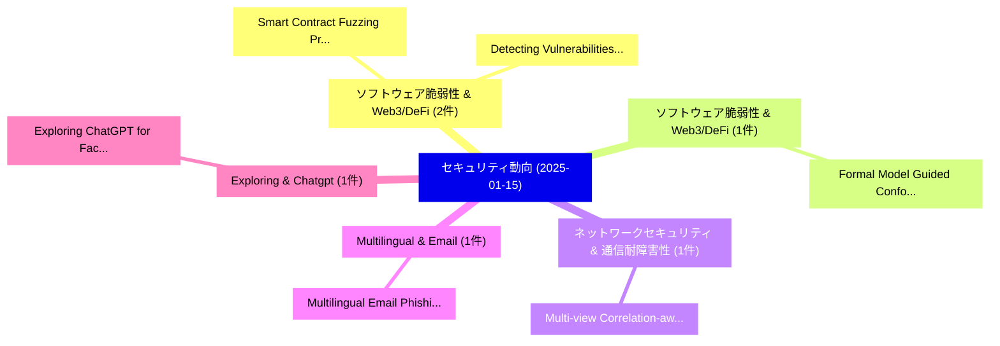

# 📅 02_daily: 日次エグゼクティブサマリー報告書 (2025-01-15)

**集計日時**: 2026-10-02 23:05:14 UTC  
**対象日付**: 2025-01-15  
**本日収集論文数**: 13 件  

---

## 💡 主要セキュリティ動向・脅威インサイト (Executive Insights)

本日の収集論文（計 13 件）において、以下の重点セキュリティ領域で活発な研究動向が確認されました：
- **ソフトウェア脆弱性 & Web3/DeFi** (2 件): 注目論文として 「Smart Contract Fuzzing Profita...」、「Detecting Vulnerabilities in E...」 等が発表され、実務防御および攻撃検証の進展が見られます。
- **ソフトウェア脆弱性 & Web3/DeFi** (1 件): 注目論文として 「Formal Model Guided Conformanc...」 等が発表され、実務防御および攻撃検証の進展が見られます。
- **ネットワークセキュリティ & 通信耐障害性** (1 件): 注目論文として 「Multi-view Correlation-aware N...」 等が発表され、実務防御および攻撃検証の進展が見られます。
- **Multilingual & Email** (1 件): 注目論文として 「Multilingual Email Phishing At...」 等が発表され、実務防御および攻撃検証の進展が見られます。
- **Exploring & Chatgpt** (1 件): 注目論文として 「Exploring ChatGPT for Face Pre...」 等が発表され、実務防御および攻撃検証の進展が見られます。

### 🗺️ 技術・脅威トピックマインドマップ

---

## 📌 日次セキュリティ論文一覧 (日本語表形式)

| No | arXiv ID | 論文タイトル (日本語訳) | 重要キーワード | 構造化エグゼクティブ要約 (背景・提案・影響) | 脅威分類 | 詳細リンク |
|---|---|---|---|---|---|---|
| 1 | `2501.08550v2` | [Formal Model Guided Conformance Testing for Blockchains（セキュリティ分析論文）](../../okf/papers/2025-01-15/2501.08550.md) | `Formal Model Guided Conformance Testing`, `Filip Drobnjakovic`, `Amir Kashapov` | 【提案】概要 (Overview & Key Finding) 本論文「Formal Model Guided Conformance Testing for Blockchains...。実証評価により経営層・セキュリティ管理者向け推奨アクション (E... | `cs.CR` | [arXiv](https://arxiv.org/abs/2501.08550v2) &#124; [OKF](../../okf/papers/2025-01-15/2501.08550.md) |
| 2 | `2501.08610v2` | [Multi-view Correlation-aware Network Traffic Detection on Flow Hypergraph（セキュリティ分析論文）](../../okf/papers/2025-01-15/2501.08610.md) | `Network Traffic Detection`, `Flow Hypergraph`, `Multi-view Correlation` | 【提案】概要 (Overview & Key Finding) 本論文「Multi-view Correlation-aware Network Traffic Detection ...。実証評価により経営層・セキュリティ管理者向け推奨アクション (E... | `cs.CR` | [arXiv](https://arxiv.org/abs/2501.08610v2) &#124; [OKF](../../okf/papers/2025-01-15/2501.08610.md) |
| 3 | `2501.08723v1` | [Multilingual Email Phishing Attacks Detection using OSINT and Machine Learning（セキュリティ分析論文）](../../okf/papers/2025-01-15/2501.08723.md) | `Multilingual Email Phishing Attacks Detection`, `Machine Learning`, `Onyango Allan Onyango` | 【提案】概要 (Overview & Key Finding) 本論文「Multilingual Email Phishing Attacks Detection using OSI...。実証評価により経営層・セキュリティ管理者向け推奨アクション (E... | `cs.CR` | [arXiv](https://arxiv.org/abs/2501.08723v1) &#124; [OKF](../../okf/papers/2025-01-15/2501.08723.md) |
| 4 | `2501.08799v1` | [Exploring ChatGPT for Face Presentation Attack Detection in Zero and Few-Shot in-Context Learning（セキュリティ分析論文）](../../okf/papers/2025-01-15/2501.08799.md) | `Face Presentation Attack Detection`, `Context Learning`, `Hatef Otroshi Shahreza` | 【提案】概要 (Overview & Key Finding) 本論文「Exploring ChatGPT for Face Presentation Attack Detectio...。実証評価により経営層・セキュリティ管理者向け推奨アクション (E... | `cs.CR` | [arXiv](https://arxiv.org/abs/2501.08799v1) &#124; [OKF](../../okf/papers/2025-01-15/2501.08799.md) |
| 5 | `2501.08834v2` | [Smart Contract Fuzzing Profitable Vulnerabilitiesに向けて](../../okf/papers/2025-01-15/2501.08834.md) | `Smart Contract Fuzzing Towards Profitable Vulnerabilities`, `Smart Contract Fuzzing Profitable`, `Ziqiao Kong` | 【提案】概要 (Overview & Key Finding) 本論文「スマートコントラクト Fuzzing Profitable Vulnerabilitiesに向けて」（原題: ...。実証評価により経営層・セキュリティ管理者向け推奨アクション (E... | `cs.CR` | [arXiv](https://arxiv.org/abs/2501.08834v2) &#124; [OKF](../../okf/papers/2025-01-15/2501.08834.md) |
| 6 | `2501.08840v1` | [CveBinarySheet: A Comprehensive Pre-built Binaries Database for IoT Vulnerability Analysis（セキュリティ分析論文）](../../okf/papers/2025-01-15/2501.08840.md) | `Comprehensive Pre`, `Binaries Database`, `Pre-built Binaries` | 【提案】概要 (Overview & Key Finding) 本論文「CveBinarySheet: A Comprehensive Pre-built Binaries Data...。実証評価により経営層・セキュリティ管理者向け推奨アクション (E... | `cs.CR` | [arXiv](https://arxiv.org/abs/2501.08840v1) &#124; [OKF](../../okf/papers/2025-01-15/2501.08840.md) |
| 7 | `2501.08862v1` | [ARMOR: Shielding Unlearnable Examples against Data Augmentation（セキュリティ分析論文）](../../okf/papers/2025-01-15/2501.08862.md) | `Shielding Unlearnable Examples`, `Data Augmentation`, `Xueluan Gong` | 【提案】概要 (Overview & Key Finding) 本論文「ARMOR: Shielding Unlearnable Examples against Data Augm...。実証評価により経営層・セキュリティ管理者向け推奨アクション (E... | `cs.CR` | [arXiv](https://arxiv.org/abs/2501.08862v1) &#124; [OKF](../../okf/papers/2025-01-15/2501.08862.md) |
| 8 | `2501.08947v5` | [Taint Analysis for Graph APIs Focusing on Broken Access Control（セキュリティ分析論文）](../../okf/papers/2025-01-15/2501.08947.md) | `Broken Access Control`, `Leen Lambers`, `Lucas Sakizloglou` | 【提案】概要 (Overview & Key Finding) 本論文「Taint Analysis for Graph APIs Focusing on Broken アクセス制御...。実証評価により経営層・セキュリティ管理者向け推奨アクション (E... | `cs.CR` | [arXiv](https://arxiv.org/abs/2501.08947v5) &#124; [OKF](../../okf/papers/2025-01-15/2501.08947.md) |
| 9 | `2501.08970v1` | [Trusted Machine Learning Models Unlock Private Inference for Problems Currently Infeasible with Cryptography（セキュリティ分析論文）](../../okf/papers/2025-01-15/2501.08970.md) | `Trusted Machine Learning Models Unlock Private Inference`, `Problems Currently Infeasible`, `Ilia Shumailov` | 【提案】概要 (Overview & Key Finding) 本論文「Trusted Machine Learning Models Unlock Private Inferenc...。実証評価により経営層・セキュリティ管理者向け推奨アクション (E... | `cs.CR` | [arXiv](https://arxiv.org/abs/2501.08970v1) &#124; [OKF](../../okf/papers/2025-01-15/2501.08970.md) |
| 10 | `2501.09182v1` | [A Blockchain-Enabled Approach to Cross-Border Compliance and Trust（セキュリティ分析論文）](../../okf/papers/2025-01-15/2501.09182.md) | `Border Compliance`, `Cross-Border Compliance`, `Vikram Kulothungan` | 【提案】概要 (Overview & Key Finding) 本論文「A Blockchain-Enabled Approach to Cross-Border Complianc...。実証評価により経営層・セキュリティ管理者向け推奨アクション (E... | `cs.CR` | [arXiv](https://arxiv.org/abs/2501.09182v1) &#124; [OKF](../../okf/papers/2025-01-15/2501.09182.md) |
| 11 | `2501.09191v2` | [Detecting Vulnerabilities in Encrypted Software Code while Ensuring Code Privacy（セキュリティ分析論文）](../../okf/papers/2025-01-15/2501.09191.md) | `Encrypted Software Code`, `Ensuring Code Privacy`, `Detecting Vulnerabilities` | 【提案】概要 (Overview & Key Finding) 本論文「Detecting Vulnerabilities in Encrypted Software Code wh...。実証評価により経営層・セキュリティ管理者向け推奨アクション (E... | `cs.CR` | [arXiv](https://arxiv.org/abs/2501.09191v2) &#124; [OKF](../../okf/papers/2025-01-15/2501.09191.md) |
| 12 | `2501.10466v4` | [Efficient Semi-Supervised Adversarial Training via Latent Clustering-Based Data Reduction（セキュリティ分析論文）](../../okf/papers/2025-01-15/2501.10466.md) | `Supervised Adversarial Training`, `Based Data Reduction`, `Efficient Semi` | 【提案】概要 (Overview & Key Finding) 本論文「Efficient Semi-Supervised Adversarial Training via Late...。実証評価により経営層・セキュリティ管理者向け推奨アクション (E... | `cs.CR` | [arXiv](https://arxiv.org/abs/2501.10466v4) &#124; [OKF](../../okf/papers/2025-01-15/2501.10466.md) |
| 13 | `2501.10467v1` | [the AI Frontier: Urgent Ethical and Regulatory Imperatives for AI-Driven Cybersecurityのセキュリティ強化](../../okf/papers/2025-01-15/2501.10467.md) | `Urgent Ethical`, `Regulatory Imperatives`, `Driven Cybersecurity` | 【提案】概要 (Overview & Key Finding) 本論文「the AI Frontier: Urgent Ethical and Regulatory Imperati...。実証評価により経営層・セキュリティ管理者向け推奨アクション (E... | `cs.CR` | [arXiv](https://arxiv.org/abs/2501.10467v1) &#124; [OKF](../../okf/papers/2025-01-15/2501.10467.md) |

