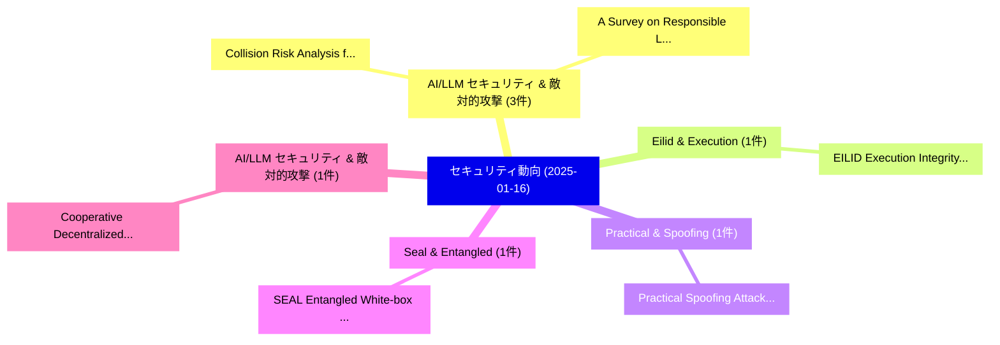

# 📅 02_daily: 日次エグゼクティブサマリー報告書 (2025-01-16)

**集計日時**: 2026-10-02 23:05:14 UTC  
**対象日付**: 2025-01-16  
**本日収集論文数**: 14 件  

---

## 💡 主要セキュリティ動向・脅威インサイト (Executive Insights)

本日の収集論文（計 14 件）において、以下の重点セキュリティ領域で活発な研究動向が確認されました：
- **AI/LLM セキュリティ & 敵対的攻撃** (3 件): 注目論文として 「Collision Risk Analysis for LE...」、「A Survey on Responsible LLMs: ...」 等が発表され、実務防御および攻撃検証の進展が見られます。
- **Eilid & Execution** (1 件): 注目論文として 「EILID: Execution Integrity for...」 等が発表され、実務防御および攻撃検証の進展が見られます。
- **Practical & Spoofing** (1 件): 注目論文として 「Practical Spoofing Attacks aga...」 等が発表され、実務防御および攻撃検証の進展が見られます。
- **Seal & Entangled** (1 件): 注目論文として 「SEAL: Entangled White-box Wate...」 等が発表され、実務防御および攻撃検証の進展が見られます。
- **AI/LLM セキュリティ & 敵対的攻撃** (1 件): 注目論文として 「Cooperative Decentralized Back...」 等が発表され、実務防御および攻撃検証の進展が見られます。

### 🗺️ 技術・脅威トピックマインドマップ

---

## 📌 日次セキュリティ論文一覧 (日本語表形式)

| No | arXiv ID | 論文タイトル (日本語訳) | 重要キーワード | 構造化エグゼクティブ要約 (背景・提案・影響) | 脅威分類 | 詳細リンク |
|---|---|---|---|---|---|---|
| 1 | `2501.09216v1` | [EILID: Execution Integrity for Low-end IoT Devices（セキュリティ分析論文）](../../okf/papers/2025-01-16/2501.09216.md) | `Execution Integrity`, `Low-end IoT`, `Sashidhar Jakkamsetti` | 【提案】概要 (Overview & Key Finding) 本論文「EILID: Execution Integrity for Low-end IoT Devices（セキュリ...。実証評価により経営層・セキュリティ管理者向け推奨アクション (E... | `cs.CR` | [arXiv](https://arxiv.org/abs/2501.09216v1) &#124; [OKF](../../okf/papers/2025-01-16/2501.09216.md) |
| 2 | `2501.09246v2` | [Practical Spoofing Attacks against Galileo OSNMA with Time-Synchronization Manipulation（セキュリティ分析論文）](../../okf/papers/2025-01-16/2501.09246.md) | `Practical Spoofing Attacks`, `Synchronization Manipulation`, `Time-Synchronization Manipulation` | 【提案】概要 (Overview & Key Finding) 本論文「Practical Spoofing Attacks against Galileo OSNMA with T...。実証評価により経営層・セキュリティ管理者向け推奨アクション (E... | `cs.CR` | [arXiv](https://arxiv.org/abs/2501.09246v2) &#124; [OKF](../../okf/papers/2025-01-16/2501.09246.md) |
| 3 | `2501.09284v2` | [SEAL: Entangled White-box Watermarks on Low-Rank Adaptation（セキュリティ分析論文）](../../okf/papers/2025-01-16/2501.09284.md) | `Entangled White`, `Rank Adaptation`, `White-box Watermarks` | 【提案】概要 (Overview & Key Finding) 本論文「SEAL: Entangled White-box Watermarks on Low-Rank Adapta...。実証評価により経営層・セキュリティ管理者向け推奨アクション (E... | `cs.CR` | [arXiv](https://arxiv.org/abs/2501.09284v2) &#124; [OKF](../../okf/papers/2025-01-16/2501.09284.md) |
| 4 | `2501.09320v2` | [Cooperative Decentralized Backdoor Attacks on Vertical 連合学習](../../okf/papers/2025-01-16/2501.09320.md) | `Cooperative Decentralized Backdoor Attacks`, `Vertical Federated Learning`, `Anindya Bijoy Das` | 【提案】概要 (Overview & Key Finding) 本論文「Cooperative Decentralized Backdoor Attacks on Vertical ...。実証評価によりLove, Christopher。 | `cs.CR` | [arXiv](https://arxiv.org/abs/2501.09320v2) &#124; [OKF](../../okf/papers/2025-01-16/2501.09320.md) |
| 5 | `2501.09328v4` | [Neural Honeytrace: Plug&Play Watermarking Framework against Model Extraction Attacks（セキュリティ分析論文）](../../okf/papers/2025-01-16/2501.09328.md) | `Model Extraction Attacks`, `Neural Honeytrace`, `Yixiao Xu` | 【提案】概要 (Overview & Key Finding) 本論文「Neural Honeytrace: Plug&Play Watermarking Framework aga...。実証評価により経営層・セキュリティ管理者向け推奨アクション (E... | `cs.CR` | [arXiv](https://arxiv.org/abs/2501.09328v4) &#124; [OKF](../../okf/papers/2025-01-16/2501.09328.md) |
| 6 | `2501.09334v1` | [Jodes: Efficient Oblivious Join in the Distributed Setting（セキュリティ分析論文）](../../okf/papers/2025-01-16/2501.09334.md) | `Efficient Oblivious Join`, `Distributed Setting`, `Yilei Wang` | 【提案】概要 (Overview & Key Finding) 本論文「Jodes: Efficient Oblivious Join in the Distributed Sett...。実証評価により経営層・セキュリティ管理者向け推奨アクション (E... | `cs.CR` | [arXiv](https://arxiv.org/abs/2501.09334v1) &#124; [OKF](../../okf/papers/2025-01-16/2501.09334.md) |
| 7 | `2501.09380v1` | [Testing a cellular automata construction method to obtain 9-variable cryptographic Boolean functions（セキュリティ分析論文）](../../okf/papers/2025-01-16/2501.09380.md) | `9-variable cryptographic`, `Bruno Martin`, `Raw Meta` | 【提案】概要 (Overview & Key Finding) 本論文「Testing a cellular automata construction method to obta...。実証評価により経営層・セキュリティ管理者向け推奨アクション (E... | `cs.CR` | [arXiv](https://arxiv.org/abs/2501.09380v1) &#124; [OKF](../../okf/papers/2025-01-16/2501.09380.md) |
| 8 | `2501.09397v1` | [Collision Risk Analysis for LEO Satellites with Confidential Orbital Data（セキュリティ分析論文）](../../okf/papers/2025-01-16/2501.09397.md) | `Confidential Orbital Data`, `Svenja Lage`, `Felix Hanke` | 【提案】概要 (Overview & Key Finding) 本論文「Collision Risk Analysis for LEO Satellites with Confide...。実証評価により経営層・セキュリティ管理者向け推奨アクション (E... | `cs.CR` | [arXiv](https://arxiv.org/abs/2501.09397v1) &#124; [OKF](../../okf/papers/2025-01-16/2501.09397.md) |
| 9 | `2501.09431v1` | [A Survey on Responsible LLMs: Inherent Risk, Malicious Use, and Mitigation Strategy（セキュリティ分析論文）](../../okf/papers/2025-01-16/2501.09431.md) | `Inherent Risk`, `Malicious Use`, `Mitigation Strategy` | 【提案】概要 (Overview & Key Finding) 本論文「A Survey on Responsible LLMs: Inherent Risk, Malicious ...。実証評価により経営層・セキュリティ管理者向け推奨アクション (E... | `cs.CR` | [arXiv](https://arxiv.org/abs/2501.09431v1) &#124; [OKF](../../okf/papers/2025-01-16/2501.09431.md) |
| 10 | `2501.09559v1` | [Threshold Quantum Secret Sharing（セキュリティ分析論文）](../../okf/papers/2025-01-16/2501.09559.md) | `Threshold Quantum Secret Sharing`, `Kartick Sutradhar`, `Raw Meta` | 【提案】概要 (Overview & Key Finding) 本論文「Threshold 量子 Secret Sharing（セキュリティ分析論文）」（原題: Threshold ...。実証評価により経営層・セキュリティ管理者向け推奨アクション (E... | `cs.CR` | [arXiv](https://arxiv.org/abs/2501.09559v1) &#124; [OKF](../../okf/papers/2025-01-16/2501.09559.md) |
| 11 | `2501.09568v1` | [Quantum Diffie-Hellman key exchange（セキュリティ分析論文）](../../okf/papers/2025-01-16/2501.09568.md) | `Quantum Diffie`, `Diffie-Hellman key`, `Raw Meta` | 【提案】概要 (Overview & Key Finding) 本論文「量子 Diffie-Hellman key exchange（セキュリティ分析論文）」（原題: 量子 Diff...。実証評価によりNikolopoulos - **公開日時**: ... | `cs.CR` | [arXiv](https://arxiv.org/abs/2501.09568v1) &#124; [OKF](../../okf/papers/2025-01-16/2501.09568.md) |
| 12 | `2501.09798v2` | [Fun-tuning: Characterizing the Vulnerability of Proprietary LLMs to Optimization-based Prompt Injection Attacks via the Fine-Tuning Interface（セキュリティ分析論文）](../../okf/papers/2025-01-16/2501.09798.md) | `Prompt Injection Attacks`, `Tuning Interface`, `Optimization-based Prompt` | 【提案】概要 (Overview & Key Finding) 本論文「Fun-tuning: Characterizing the 脆弱性 of Proprietary LLMs ...。実証評価により経営層・セキュリティ管理者向け推奨アクション (E... | `cs.CR` | [arXiv](https://arxiv.org/abs/2501.09798v2) &#124; [OKF](../../okf/papers/2025-01-16/2501.09798.md) |
| 13 | `2501.09802v1` | [W3ID: A Quantum Computing-Secure Digital Identity System Redefining Standards for Web3 and Digital Twins（セキュリティ分析論文）](../../okf/papers/2025-01-16/2501.09802.md) | `Secure Digital Identity System Redefining Standards`, `Quantum Computing`, `Digital Twins` | 【提案】概要 (Overview & Key Finding) 本論文「W3ID: A 量子 Computing-Secure Digital Identity System Red...。実証評価により経営層・セキュリティ管理者向け推奨アクション (E... | `cs.CR` | [arXiv](https://arxiv.org/abs/2501.09802v1) &#124; [OKF](../../okf/papers/2025-01-16/2501.09802.md) |
| 14 | `2501.09808v1` | [Ruling the Unruly: Designing Effective, Low-Noise Network Intrusion Detection Rules for Security Operations Centers（セキュリティ分析論文）](../../okf/papers/2025-01-16/2501.09808.md) | `Noise Network Intrusion Detection Rules`, `Security Operations Centers`, `Designing Effective` | 【提案】概要 (Overview & Key Finding) 本論文「Ruling the Unruly: Designing Effective, Low-Noise Netwo...。実証評価により経営層・セキュリティ管理者向け推奨アクション (E... | `cs.CR` | [arXiv](https://arxiv.org/abs/2501.09808v1) &#124; [OKF](../../okf/papers/2025-01-16/2501.09808.md) |

