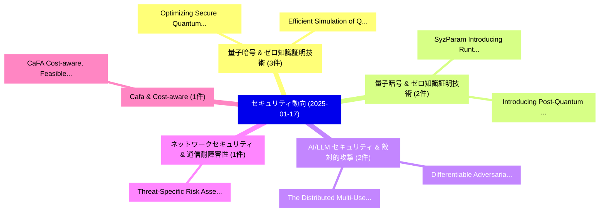

# 📅 02_daily: 日次エグゼクティブサマリー報告書 (2025-01-17)

**集計日時**: 2026-10-02 23:05:14 UTC  
**対象日付**: 2025-01-17  
**本日収集論文数**: 12 件  

---

## 💡 主要セキュリティ動向・脅威インサイト (Executive Insights)

本日の収集論文（計 12 件）において、以下の重点セキュリティ領域で活発な研究動向が確認されました：
- **量子暗号 & ゼロ知識証明技術** (3 件): 注目論文として 「Optimizing Secure Quantum Info...」、「Efficient Simulation of Quantu...」 等が発表され、実務防御および攻撃検証の進展が見られます。
- **量子暗号 & ゼロ知識証明技術** (2 件): 注目論文として 「SyzParam: Introducing Runtime ...」、「Introducing Post-Quantum algor...」 等が発表され、実務防御および攻撃検証の進展が見られます。
- **AI/LLM セキュリティ & 敵対的攻撃** (2 件): 注目論文として 「The Distributed Multi-User Poi...」、「Differentiable Adversarial Att...」 等が発表され、実務防御および攻撃検証の進展が見られます。
- **ネットワークセキュリティ & 通信耐障害性** (1 件): 注目論文として 「Threat-Specific Risk Assessmen...」 等が発表され、実務防御および攻撃検証の進展が見られます。
- **Cafa & Cost-aware** (1 件): 注目論文として 「CaFA: Cost-aware, Feasible Att...」 等が発表され、実務防御および攻撃検証の進展が見られます。

### 🗺️ 技術・脅威トピックマインドマップ

---

## 📌 日次セキュリティ論文一覧 (日本語表形式)

| No | arXiv ID | 論文タイトル (日本語訳) | 重要キーワード | 構造化エグゼクティブ要約 (背景・提案・影響) | 脅威分類 | 詳細リンク |
|---|---|---|---|---|---|---|
| 1 | `2501.09895v3` | [Optimizing Secure Quantum Information Transmission in Entanglement-Assisted Quantum Networks（セキュリティ分析論文）](../../okf/papers/2025-01-17/2501.09895.md) | `Optimizing Secure Quantum Information Transmission`, `Assisted Quantum Networks`, `Entanglement-Assisted Quantum` | 【提案】概要 (Overview & Key Finding) 本論文「Optimizing Secure 量子 Information Transmission in Entang...。実証評価により経営層・セキュリティ管理者向け推奨アクション (E... | `cs.CR` | [arXiv](https://arxiv.org/abs/2501.09895v3) &#124; [OKF](../../okf/papers/2025-01-17/2501.09895.md) |
| 2 | `2501.09936v1` | [Threat-Specific Risk Assessment for IP Multimedia Subsystem Networks Based on Hierarchical Models（セキュリティ分析論文）](../../okf/papers/2025-01-17/2501.09936.md) | `Multimedia Subsystem Networks Based`, `Specific Risk Assessment`, `Threat-Specific Risk` | 【提案】概要 (Overview & Key Finding) 本論文「脅威-Specific Risk Assessment for IP Multimedia Subsystem...。実証評価により経営層・セキュリティ管理者向け推奨アクション (E... | `cs.CR` | [arXiv](https://arxiv.org/abs/2501.09936v1) &#124; [OKF](../../okf/papers/2025-01-17/2501.09936.md) |
| 3 | `2501.10002v1` | [SyzParam: Introducing Runtime Parameters into Kernel Driver Fuzzing（セキュリティ分析論文）](../../okf/papers/2025-01-17/2501.10002.md) | `Introducing Runtime Parameters`, `Kernel Driver Fuzzing`, `Yue Sun` | 【提案】概要 (Overview & Key Finding) 本論文「SyzParam: Introducing Runtime Parameters into Kernel Dr...。実証評価により経営層・セキュリティ管理者向け推奨アクション (E... | `cs.CR` | [arXiv](https://arxiv.org/abs/2501.10002v1) &#124; [OKF](../../okf/papers/2025-01-17/2501.10002.md) |
| 4 | `2501.10013v1` | [CaFA: Cost-aware, Feasible Attacks With Database Constraints Against Neural Tabular Classifiers（セキュリティ分析論文）](../../okf/papers/2025-01-17/2501.10013.md) | `Matan Ben`, `Daniel Deutch`, `Nave Frost` | 【提案】概要 (Overview & Key Finding) 本論文「CaFA: Cost-aware, Feasible Attacks With Database Constr...。実証評価により経営層・セキュリティ管理者向け推奨アクション (E... | `cs.CR` | [arXiv](https://arxiv.org/abs/2501.10013v1) &#124; [OKF](../../okf/papers/2025-01-17/2501.10013.md) |
| 5 | `2501.10060v1` | [Introducing Post-Quantum algorithms in Open RAN interfaces（セキュリティ分析論文）](../../okf/papers/2025-01-17/2501.10060.md) | `Introducing Post`, `Post-Quantum algorithms`, `Pedro Otero` | 【提案】概要 (Overview & Key Finding) 本論文「Introducing Post-量子 algorithms in Open RAN interfaces（セ...。実証評価により経営層・セキュリティ管理者向け推奨アクション (E... | `cs.CR` | [arXiv](https://arxiv.org/abs/2501.10060v1) &#124; [OKF](../../okf/papers/2025-01-17/2501.10060.md) |
| 6 | `2501.10083v1` | [Efficient Simulation of Quantum Secure Multiparty Computation（セキュリティ分析論文）](../../okf/papers/2025-01-17/2501.10083.md) | `Quantum Secure Multiparty Computation`, `Efficient Simulation`, `Kartick Sutradhar` | 【提案】概要 (Overview & Key Finding) 本論文「Efficient Simulation of 量子 Secure Multiparty Computatio...。実証評価により経営層・セキュリティ管理者向け推奨アクション (E... | `cs.CR` | [arXiv](https://arxiv.org/abs/2501.10083v1) &#124; [OKF](../../okf/papers/2025-01-17/2501.10083.md) |
| 7 | `2501.10174v1` | [Michscan: Black-Box Neural Network Integrity Checking at Runtime Through Power Analysis（セキュリティ分析論文）](../../okf/papers/2025-01-17/2501.10174.md) | `Box Neural Network Integrity Checking`, `Black-Box Neural`, `Robi Paul` | 【提案】概要 (Overview & Key Finding) 本論文「Michscan: Black-Box Neural Network Integrity Checking a...。実証評価により経営層・セキュリティ管理者向け推奨アクション (E... | `cs.CR` | [arXiv](https://arxiv.org/abs/2501.10174v1) &#124; [OKF](../../okf/papers/2025-01-17/2501.10174.md) |
| 8 | `2501.10182v2` | [Secure Semantic Communication With Homomorphic Encryption（セキュリティ分析論文）](../../okf/papers/2025-01-17/2501.10182.md) | `Rui Meng`, `Dayu Fan`, `Haixiao Gao` | 【提案】概要 (Overview & Key Finding) 本論文「Secure Semantic Communication With 準同型暗号（セキュリティ分析論文）」（原...。実証評価により経営層・セキュリティ管理者向け推奨アクション (E... | `cs.CR` | [arXiv](https://arxiv.org/abs/2501.10182v2) &#124; [OKF](../../okf/papers/2025-01-17/2501.10182.md) |
| 9 | `2501.10251v2` | [The Distributed Multi-User Point Function（セキュリティ分析論文）](../../okf/papers/2025-01-17/2501.10251.md) | `User Point Function`, `Multi-User Point`, `Ali Khalesi` | 【提案】概要 (Overview & Key Finding) 本論文「The Distributed Multi-User Point Function（セキュリティ分析論文）」（...。実証評価により経営層・セキュリティ管理者向け推奨アクション (E... | `cs.CR` | [arXiv](https://arxiv.org/abs/2501.10251v2) &#124; [OKF](../../okf/papers/2025-01-17/2501.10251.md) |
| 10 | `2501.10560v1` | [Picachv: Formally Verified Data Use Policy Enforcement for Secure Data Analytics（セキュリティ分析論文）](../../okf/papers/2025-01-17/2501.10560.md) | `Formally Verified Data Use Policy Enforcement`, `Secure Data Analytics`, `Haobin Hiroki Chen` | 【提案】概要 (Overview & Key Finding) 本論文「Picachv: Formally Verified Data Use Policy Enforcement ...。実証評価により経営層・セキュリティ管理者向け推奨アクション (E... | `cs.CR` | [arXiv](https://arxiv.org/abs/2501.10560v1) &#124; [OKF](../../okf/papers/2025-01-17/2501.10560.md) |
| 11 | `2501.10606v1` | [Differentiable Adversarial Attacks for Marked Temporal Point Processes（セキュリティ分析論文）](../../okf/papers/2025-01-17/2501.10606.md) | `Marked Temporal Point Processes`, `Differentiable Adversarial Attacks`, `Pritish Chakraborty` | 【提案】概要 (Overview & Key Finding) 本論文「Differentiable 敵対的攻撃s for Marked Temporal Point Process...。実証評価により経営層・セキュリティ管理者向け推奨アクション (E... | `cs.CR` | [arXiv](https://arxiv.org/abs/2501.10606v1) &#124; [OKF](../../okf/papers/2025-01-17/2501.10606.md) |
| 12 | `2501.13941v1` | [GaussMark: A Practical Approach for Structural Watermarking of Language Models（セキュリティ分析論文）](../../okf/papers/2025-01-17/2501.13941.md) | `Structural Watermarking`, `Language Models`, `Adam Block` | 【提案】概要 (Overview & Key Finding) 本論文「GaussMark: A Practical Approach for Structural Watermar...。実証評価により経営層・セキュリティ管理者向け推奨アクション (E... | `cs.CR` | [arXiv](https://arxiv.org/abs/2501.13941v1) &#124; [OKF](../../okf/papers/2025-01-17/2501.13941.md) |

