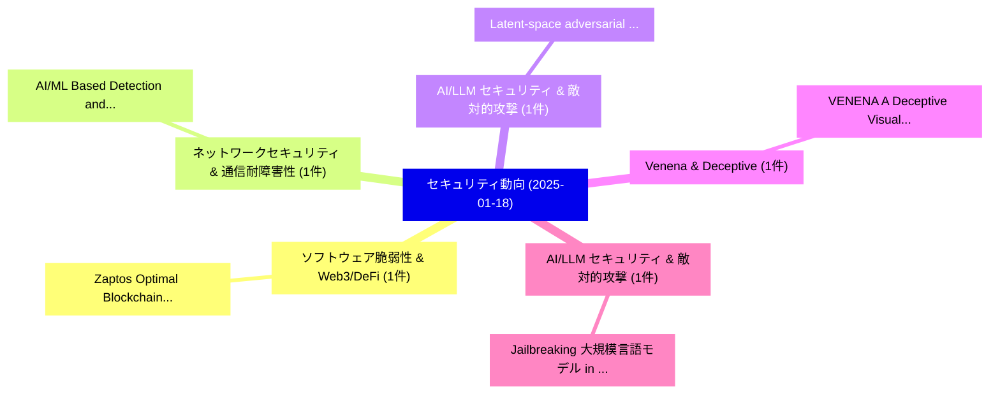

# 📅 02_daily: 日次エグゼクティブサマリー報告書 (2025-01-18)

**集計日時**: 2026-10-02 23:05:14 UTC  
**対象日付**: 2025-01-18  
**本日収集論文数**: 9 件  

---

## 💡 主要セキュリティ動向・脅威インサイト (Executive Insights)

本日の収集論文（計 9 件）において、以下の重点セキュリティ領域で活発な研究動向が確認されました：
- **ソフトウェア脆弱性 & Web3/DeFi** (1 件): 注目論文として 「Zaptos: Optimal Blockchain Lat...」 等が発表され、実務防御および攻撃検証の進展が見られます。
- **ネットワークセキュリティ & 通信耐障害性** (1 件): 注目論文として 「AI/ML Based Detection and Cate...」 等が発表され、実務防御および攻撃検証の進展が見られます。
- **AI/LLM セキュリティ & 敵対的攻撃** (1 件): 注目論文として 「Latent-space adversarial train...」 等が発表され、実務防御および攻撃検証の進展が見られます。
- **Venena & Deceptive** (1 件): 注目論文として 「VENENA: A Deceptive Visual Enc...」 等が発表され、実務防御および攻撃検証の進展が見られます。
- **AI/LLM セキュリティ & 敵対的攻撃** (1 件): 注目論文として 「Jailbreaking 大規模言語モデル in Infin...」 等が発表され、実務防御および攻撃検証の進展が見られます。

### 🗺️ 技術・脅威トピックマインドマップ

---

## 📌 日次セキュリティ論文一覧 (日本語表形式)

| No | arXiv ID | 論文タイトル (日本語訳) | 重要キーワード | 構造化エグゼクティブ要約 (背景・提案・影響) | 脅威分類 | 詳細リンク |
|---|---|---|---|---|---|---|
| 1 | `2501.10612v1` | [Zaptos: Optimal Blockchain Latencyに向けて](../../okf/papers/2025-01-18/2501.10612.md) | `Towards Optimal Blockchain Latency`, `Optimal Blockchain`, `Zhuolun Xiang` | 【提案】概要 (Overview & Key Finding) 本論文「Zaptos: Optimal Blockchain Latencyに向けて」（原題: Zaptos: Tow...。実証評価により経営層・セキュリティ管理者向け推奨アクション (E... | `cs.CR` | [arXiv](https://arxiv.org/abs/2501.10612v1) &#124; [OKF](../../okf/papers/2025-01-18/2501.10612.md) |
| 2 | `2501.10627v2` | [AI/ML Based Detection and Categorization of Covert Communication in IPv6 Network（セキュリティ分析論文）](../../okf/papers/2025-01-18/2501.10627.md) | `Based Detection`, `Covert Communication`, `Mohammad Wali Ur Rahman` | 【提案】概要 (Overview & Key Finding) 本論文「AI/ML Based Detection and Categorization of Covert Comm...。実証評価により経営層・セキュリティ管理者向け推奨アクション (E... | `cs.CR` | [arXiv](https://arxiv.org/abs/2501.10627v2) &#124; [OKF](../../okf/papers/2025-01-18/2501.10627.md) |
| 3 | `2501.10639v3` | [Latent-space adversarial training with post-aware calibration for defending 大規模言語モデル against jailbreak attacks](../../okf/papers/2025-01-18/2501.10639.md) | `Latent-space adversarial`, `post-aware calibration`, `Xin Yi` | 【提案】概要 (Overview & Key Finding) 本論文「Latent-space adversarial training with post-aware calib...。実証評価により経営層・セキュリティ管理者向け推奨アクション (E... | `cs.CR` | [arXiv](https://arxiv.org/abs/2501.10639v3) &#124; [OKF](../../okf/papers/2025-01-18/2501.10639.md) |
| 4 | `2501.10699v4` | [VENENA: A Deceptive Visual Encryption Framework for Wireless Semantic Secrecy（セキュリティ分析論文）](../../okf/papers/2025-01-18/2501.10699.md) | `Wireless Semantic Secrecy`, `Bin Han`, `Ye Yuan` | 【提案】概要 (Overview & Key Finding) 本論文「VENENA: A Deceptive Visual Encryption Framework for Wir...。実証評価により経営層・セキュリティ管理者向け推奨アクション (E... | `cs.CR` | [arXiv](https://arxiv.org/abs/2501.10699v4) &#124; [OKF](../../okf/papers/2025-01-18/2501.10699.md) |
| 5 | `2501.10800v2` | [Jailbreaking 大規模言語モデル in Infinitely Many Ways](../../okf/papers/2025-01-18/2501.10800.md) | `Infinitely Many Ways`, `Jailbreaking Large Language Models`, `Emanuele La Malfa` | 【提案】概要 (Overview & Key Finding) 本論文「ジェイルブレイクing 大規模言語モデル in Infinitely Many Ways」（原題: ジェイルブ...。実証評価により経営層・セキュリティ管理者向け推奨アクション (E... | `cs.CR` | [arXiv](https://arxiv.org/abs/2501.10800v2) &#124; [OKF](../../okf/papers/2025-01-18/2501.10800.md) |
| 6 | `2501.10817v1` | [A comprehensive survey on RPL routing-based attacks, defences and future directions in Internet of Things（セキュリティ分析論文）](../../okf/papers/2025-01-18/2501.10817.md) | `routing-based attacks`, `Vijay Varadharajan`, `Abhishek Verma` | 【提案】概要 (Overview & Key Finding) 本論文「A comprehensive survey on RPL routing-based attacks, de...。実証評価により経営層・セキュリティ管理者向け推奨アクション (E... | `cs.CR` | [arXiv](https://arxiv.org/abs/2501.10817v1) &#124; [OKF](../../okf/papers/2025-01-18/2501.10817.md) |
| 7 | `2501.10841v1` | [Practical and Ready-to-Use Methodology to Assess the re-identification Risk in Anonymized Datasets（セキュリティ分析論文）](../../okf/papers/2025-01-18/2501.10841.md) | `Use Methodology`, `Anonymized Datasets`, `re-identification Risk` | 【提案】概要 (Overview & Key Finding) 本論文「Practical and Ready-to-Use Methodology to Assess the re...。実証評価により経営層・セキュリティ管理者向け推奨アクション (E... | `cs.CR` | [arXiv](https://arxiv.org/abs/2501.10841v1) &#124; [OKF](../../okf/papers/2025-01-18/2501.10841.md) |
| 8 | `2501.10881v1` | [Addressing Network Packet-based Cheats in Multiplayer Games: A Secret Sharing Approach（セキュリティ分析論文）](../../okf/papers/2025-01-18/2501.10881.md) | `Addressing Network Packet`, `Multiplayer Games`, `Packet-based Cheats` | 【提案】概要 (Overview & Key Finding) 本論文「Addressing Network Packet-based Cheats in Multiplayer G...。実証評価により経営層・セキュリティ管理者向け推奨アクション (E... | `cs.CR` | [arXiv](https://arxiv.org/abs/2501.10881v1) &#124; [OKF](../../okf/papers/2025-01-18/2501.10881.md) |
| 9 | `2501.10888v3` | [Automated Selfish Mining Analysis for DAG-Based PoW Consensus Protocols（セキュリティ分析論文）](../../okf/papers/2025-01-18/2501.10888.md) | `Consensus Protocols`, `DAG-Based PoW`, `Patrik Keller` | 【提案】概要 (Overview & Key Finding) 本論文「Automated Selfish Mining Analysis for DAG-Based PoW Con...。実証評価により経営層・セキュリティ管理者向け推奨アクション (E... | `cs.CR` | [arXiv](https://arxiv.org/abs/2501.10888v3) &#124; [OKF](../../okf/papers/2025-01-18/2501.10888.md) |

