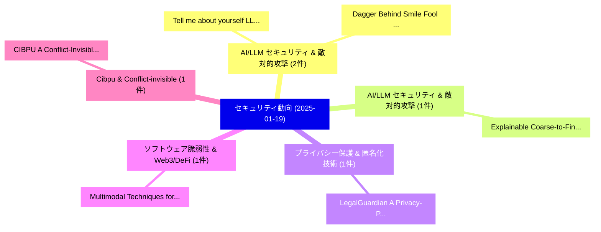

# 📅 02_daily: 日次エグゼクティブサマリー報告書 (2025-01-19)

**集計日時**: 2026-10-02 23:05:14 UTC  
**対象日付**: 2025-01-19  
**本日収集論文数**: 15 件  

---

## 💡 主要セキュリティ動向・脅威インサイト (Executive Insights)

本日の収集論文（計 15 件）において、以下の重点セキュリティ領域で活発な研究動向が確認されました：
- **AI/LLM セキュリティ & 敵対的攻撃** (2 件): 注目論文として 「Tell me about yourself: LLMs a...」、「Dagger Behind Smile: Fool LLMs...」 等が発表され、実務防御および攻撃検証の進展が見られます。
- **AI/LLM セキュリティ & 敵対的攻撃** (1 件): 注目論文として 「Explainable Coarse-to-Fine Cla...」 等が発表され、実務防御および攻撃検証の進展が見られます。
- **プライバシー保護 & 匿名化技術** (1 件): 注目論文として 「LegalGuardian: A Privacy-Prese...」 等が発表され、実務防御および攻撃検証の進展が見られます。
- **ソフトウェア脆弱性 & Web3/DeFi** (1 件): 注目論文として 「Multimodal Techniques for Malw...」 等が発表され、実務防御および攻撃検証の進展が見られます。
- **Cibpu & Conflict-invisible** (1 件): 注目論文として 「CIBPU: A Conflict-Invisible Se...」 等が発表され、実務防御および攻撃検証の進展が見られます。

### 🗺️ 技術・脅威トピックマインドマップ

---

## 📌 日次セキュリティ論文一覧 (日本語表形式)

| No | arXiv ID | 論文タイトル (日本語訳) | 重要キーワード | 構造化エグゼクティブ要約 (背景・提案・影響) | 脅威分類 | 詳細リンク |
|---|---|---|---|---|---|---|
| 1 | `2501.10906v1` | [Explainable Coarse-to-Fine Classifiersに対する敵対的攻撃](../../okf/papers/2025-01-19/2501.10906.md) | `Explainable Adversarial Attacks`, `Fine Classifiers`, `Explainable Coarse` | 【提案】概要 (Overview & Key Finding) 本論文「Explainable Coarse-to-Fine Classifiersに対する敵対的攻撃」（原題: Ex...。実証評価により経営層・セキュリティ管理者向け推奨アクション (E... | `cs.CR` | [arXiv](https://arxiv.org/abs/2501.10906v1) &#124; [OKF](../../okf/papers/2025-01-19/2501.10906.md) |
| 2 | `2501.10915v1` | [LegalGuardian: A Privacy-Preserving Framework for Secure Integration of 大規模言語モデル in Legal Practice](../../okf/papers/2025-01-19/2501.10915.md) | `Secure Integration`, `Legal Practice`, `Large Language Models` | 【提案】概要 (Overview & Key Finding) 本論文「LegalGuardian: A Privacy-Preserving Framework for Secur...。実証評価により経営層・セキュリティ管理者向け推奨アクション (E... | `cs.CR` | [arXiv](https://arxiv.org/abs/2501.10915v1) &#124; [OKF](../../okf/papers/2025-01-19/2501.10915.md) |
| 3 | `2501.10956v1` | [Multimodal Techniques for Malware Classification（セキュリティ分析論文）](../../okf/papers/2025-01-19/2501.10956.md) | `Multimodal Techniques`, `Malware Classification`, `Jonathan Jiang` | 【提案】概要 (Overview & Key Finding) 本論文「Multimodal Techniques for マルウェア Classification（セキュリティ分析...。実証評価により経営層・セキュリティ管理者向け推奨アクション (E... | `cs.CR` | [arXiv](https://arxiv.org/abs/2501.10956v1) &#124; [OKF](../../okf/papers/2025-01-19/2501.10956.md) |
| 4 | `2501.10983v1` | [CIBPU: A Conflict-Invisible Secure Branch Prediction Unit（セキュリティ分析論文）](../../okf/papers/2025-01-19/2501.10983.md) | `Invisible Secure Branch Prediction Unit`, `Conflict-Invisible Secure`, `Zhe Zhou` | 【提案】概要 (Overview & Key Finding) 本論文「CIBPU: A Conflict-Invisible Secure Branch Prediction Un...。実証評価により経営層・セキュリティ管理者向け推奨アクション (E... | `cs.CR` | [arXiv](https://arxiv.org/abs/2501.10983v1) &#124; [OKF](../../okf/papers/2025-01-19/2501.10983.md) |
| 5 | `2501.10985v2` | [GRID: Protecting Training Graph from Link Stealing Attacks on GNN Models（セキュリティ分析論文）](../../okf/papers/2025-01-19/2501.10985.md) | `Protecting Training Graph`, `Link Stealing Attacks`, `Jiadong Lou` | 【提案】概要 (Overview & Key Finding) 本論文「GRID: Protecting Training Graph from Link Stealing Atta...。実証評価により経営層・セキュリティ管理者向け推奨アクション (E... | `cs.CR` | [arXiv](https://arxiv.org/abs/2501.10985v2) &#124; [OKF](../../okf/papers/2025-01-19/2501.10985.md) |
| 6 | `2501.10996v1` | [Effectiveness of Adversarial Benign and Malware Examples in Evasion and Poisoning Attacks（セキュリティ分析論文）](../../okf/papers/2025-01-19/2501.10996.md) | `Adversarial Benign`, `Malware Examples`, `Poisoning Attacks` | 【提案】概要 (Overview & Key Finding) 本論文「Effectiveness of Adversarial Benign and マルウェア Examples ...。実証評価により経営層・セキュリティ管理者向け推奨アクション (E... | `cs.CR` | [arXiv](https://arxiv.org/abs/2501.10996v1) &#124; [OKF](../../okf/papers/2025-01-19/2501.10996.md) |
| 7 | `2501.11045v1` | [Bridging the Security Gap: Lessons from 5G and What 6G Should Do Better（セキュリティ分析論文）](../../okf/papers/2025-01-19/2501.11045.md) | `Security Gap`, `Raw Meta`, `Executive Summary` | 【提案】概要 (Overview & Key Finding) 本論文「Bridging the Security Gap: Lessons from 5G and What 6G ...。実証評価により経営層・セキュリティ管理者向け推奨アクション (E... | `cs.CR` | [arXiv](https://arxiv.org/abs/2501.11045v1) &#124; [OKF](../../okf/papers/2025-01-19/2501.11045.md) |
| 8 | `2501.11052v3` | [SLVC-DIDA: Signature-less Verifiable Credential-based Issuer-hiding and Multi-party Authentication for Decentralized Identity（セキュリティ分析論文）](../../okf/papers/2025-01-19/2501.11052.md) | `Verifiable Credential`, `Decentralized Identity`, `Signature-less Verifiable` | 【提案】概要 (Overview & Key Finding) 本論文「SLVC-DIDA: Signature-less Verifiable Credential-based I...。実証評価により経営層・セキュリティ管理者向け推奨アクション (E... | `cs.CR` | [arXiv](https://arxiv.org/abs/2501.11052v3) &#124; [OKF](../../okf/papers/2025-01-19/2501.11052.md) |
| 9 | `2501.11054v1` | [Temporal Adversarial Attacks in Federated Learningの分析](../../okf/papers/2025-01-19/2501.11054.md) | `Temporal Adversarial Attacks`, `Adversarial Attacks`, `Federated Learning` | 【提案】概要 (Overview & Key Finding) 本論文「Temporal 敵対的攻撃s in Federated Learningの分析」（原題: Temporal ...。実証評価により経営層・セキュリティ管理者向け推奨アクション (E... | `cs.CR` | [arXiv](https://arxiv.org/abs/2501.11054v1) &#124; [OKF](../../okf/papers/2025-01-19/2501.11054.md) |
| 10 | `2501.11068v1` | [Generative AI-driven Cross-layer Covert Communication: Fundamentals, Framework and Case Study（セキュリティ分析論文）](../../okf/papers/2025-01-19/2501.11068.md) | `Covert Communication`, `AI-driven Cross`, `Tianhao Liu` | 【提案】概要 (Overview & Key Finding) 本論文「Generative AI-driven Cross-layer Covert Communication: ...。実証評価により経営層・セキュリティ管理者向け推奨アクション (E... | `cs.CR` | [arXiv](https://arxiv.org/abs/2501.11068v1) &#124; [OKF](../../okf/papers/2025-01-19/2501.11068.md) |
| 11 | `2501.11074v1` | [Achieving Network Resilience through Graph Neural Network-enabled Deep Reinforcement Learning（セキュリティ分析論文）](../../okf/papers/2025-01-19/2501.11074.md) | `Achieving Network Resilience`, `Graph Neural Network`, `Deep Reinforcement Learning` | 【提案】概要 (Overview & Key Finding) 本論文「Achieving Network Resilience through Graph Neural Netwo...。実証評価により経営層・セキュリティ管理者向け推奨アクション (E... | `cs.CR` | [arXiv](https://arxiv.org/abs/2501.11074v1) &#124; [OKF](../../okf/papers/2025-01-19/2501.11074.md) |
| 12 | `2501.11091v11` | [Bitcoin: A Non-Continuous Time System（セキュリティ分析論文）](../../okf/papers/2025-01-19/2501.11091.md) | `Continuous Time System`, `Non-Continuous Time`, `Bin Chen` | 【提案】概要 (Overview & Key Finding) 本論文「Bitcoin: A Non-Continuous Time System（セキュリティ分析論文）」（原題: ...。実証評価により経営層・セキュリティ管理者向け推奨アクション (E... | `cs.CR` | [arXiv](https://arxiv.org/abs/2501.11091v11) &#124; [OKF](../../okf/papers/2025-01-19/2501.11091.md) |
| 13 | `2501.11120v1` | [Tell me about yourself: LLMs are aware of their learned behaviors（セキュリティ分析論文）](../../okf/papers/2025-01-19/2501.11120.md) | `Jan Betley`, `Xuchan Bao`, `Anna Sztyber` | 【提案】概要 (Overview & Key Finding) 本論文「Tell me about yourself: LLMs are aware of their learned...。実証評価により経営層・セキュリティ管理者向け推奨アクション (E... | `cs.CR` | [arXiv](https://arxiv.org/abs/2501.11120v1) &#124; [OKF](../../okf/papers/2025-01-19/2501.11120.md) |
| 14 | `2501.11183v1` | [Can Safety Fine-Tuning Be More Principled? Lessons Learned from サイバーセキュリティ](../../okf/papers/2025-01-19/2501.11183.md) | `Can Safety Fine`, `Lessons Learned`, `David Williams` | 【提案】Lessons Learned from Cybersecurity ### (日本語題名: Can Safety Fine-Tuning Be More Principled?。実証評価により経営層・セキュリティ管理者向け推奨アクション (Ex... | `cs.CR` | [arXiv](https://arxiv.org/abs/2501.11183v1) &#124; [OKF](../../okf/papers/2025-01-19/2501.11183.md) |
| 15 | `2501.13115v3` | [Dagger Behind Smile: Fool LLMs with a Happy Ending Story（セキュリティ分析論文）](../../okf/papers/2025-01-19/2501.13115.md) | `Dagger Behind Smile`, `Happy Ending Story`, `Xurui Song` | 【提案】概要 (Overview & Key Finding) 本論文「Dagger Behind Smile: Fool LLMs with a Happy Ending Stor...。実証評価により経営層・セキュリティ管理者向け推奨アクション (E... | `cs.CR` | [arXiv](https://arxiv.org/abs/2501.13115v3) &#124; [OKF](../../okf/papers/2025-01-19/2501.13115.md) |

