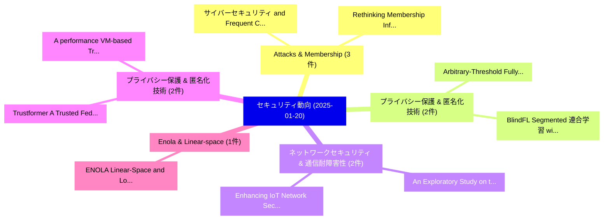

# 📅 02_daily: 日次エグゼクティブサマリー報告書 (2025-01-20)

**集計日時**: 2026-10-02 23:05:14 UTC  
**対象日付**: 2025-01-20  
**本日収集論文数**: 17 件  

---

## 💡 主要セキュリティ動向・脅威インサイト (Executive Insights)

本日の収集論文（計 17 件）において、以下の重点セキュリティ領域で活発な研究動向が確認されました：
- **Attacks & Membership** (3 件): 注目論文として 「サイバーセキュリティ and Frequent Cyber ...」、「Rethinking Membership Inferenc...」 等が発表され、実務防御および攻撃検証の進展が見られます。
- **プライバシー保護 & 匿名化技術** (2 件): 注目論文として 「Arbitrary-Threshold Fully Homo...」、「BlindFL: Segmented 連合学習 with F...」 等が発表され、実務防御および攻撃検証の進展が見られます。
- **ネットワークセキュリティ & 通信耐障害性** (2 件): 注目論文として 「An Exploratory Study on the En...」、「Enhancing IoT Network Security...」 等が発表され、実務防御および攻撃検証の進展が見られます。
- **プライバシー保護 & 匿名化技術** (2 件): 注目論文として 「A performance VM-based Trusted...」、「Trustformer: A Trusted Federat...」 等が発表され、実務防御および攻撃検証の進展が見られます。
- **Enola & Linear-space** (1 件): 注目論文として 「ENOLA: Linear-Space and Low-Ov...」 等が発表され、実務防御および攻撃検証の進展が見られます。

### 🗺️ 技術・脅威トピックマインドマップ

---

## 📌 日次セキュリティ論文一覧 (日本語表形式)

| No | arXiv ID | 論文タイトル (日本語訳) | 重要キーワード | 構造化エグゼクティブ要約 (背景・提案・影響) | 脅威分類 | 詳細リンク |
|---|---|---|---|---|---|---|
| 1 | `2501.11207v2` | [ENOLA: Linear-Space and Low-Overhead Control-Flow Attestation for Microcontroller-based Systems（セキュリティ分析論文）](../../okf/papers/2025-01-20/2501.11207.md) | `Overhead Control`, `Flow Attestation`, `Low-Overhead Control` | 【提案】概要 (Overview & Key Finding) 本論文「ENOLA: Linear-Space and Low-Overhead Control-Flow Attes...。実証評価により経営層・セキュリティ管理者向け推奨アクション (E... | `cs.CR` | [arXiv](https://arxiv.org/abs/2501.11207v2) &#124; [OKF](../../okf/papers/2025-01-20/2501.11207.md) |
| 2 | `2501.11235v1` | [Arbitrary-Threshold Fully Homomorphic Encryption with Lower Complexity（セキュリティ分析論文）](../../okf/papers/2025-01-20/2501.11235.md) | `Threshold Fully Homomorphic Encryption`, `Lower Complexity`, `Arbitrary-Threshold Fully` | 【提案】概要 (Overview & Key Finding) 本論文「Arbitrary-Threshold Fully 準同型暗号 with Lower Complexity（セ...。実証評価により経営層・セキュリティ管理者向け推奨アクション (E... | `cs.CR` | [arXiv](https://arxiv.org/abs/2501.11235v1) &#124; [OKF](../../okf/papers/2025-01-20/2501.11235.md) |
| 3 | `2501.11250v1` | [サイバーセキュリティ and Frequent Cyber Attacks on IoT Devices in Healthcare: Issues and Solutions](../../okf/papers/2025-01-20/2501.11250.md) | `Frequent Cyber Attacks`, `Ahmed Abdelgawad`, `Nelly Elsayed` | 【提案】概要 (Overview & Key Finding) 本論文「サイバーセキュリティ and Frequent Cyber Attacks on IoT Devices in...。実証評価により経営層・セキュリティ管理者向け推奨アクション (E... | `cs.CR` | [arXiv](https://arxiv.org/abs/2501.11250v1) &#124; [OKF](../../okf/papers/2025-01-20/2501.11250.md) |
| 4 | `2501.11405v1` | [Voltage Profile-Driven Physical Layer Authentication for RIS-aided Backscattering Tag-to-Tag Networks（セキュリティ分析論文）](../../okf/papers/2025-01-20/2501.11405.md) | `Driven Physical Layer Authentication`, `Voltage Profile`, `Profile-Driven Physical` | 【提案】概要 (Overview & Key Finding) 本論文「Voltage Profile-Driven Physical Layer Authentication fo...。実証評価により経営層・セキュリティ管理者向け推奨アクション (E... | `cs.CR` | [arXiv](https://arxiv.org/abs/2501.11405v1) &#124; [OKF](../../okf/papers/2025-01-20/2501.11405.md) |
| 5 | `2501.11525v1` | [Technical Report for the Forgotten-by-Design Project: Targeted Obfuscation for Machine Learning（セキュリティ分析論文）](../../okf/papers/2025-01-20/2501.11525.md) | `Technical Report`, `Design Project`, `Targeted Obfuscation` | 【提案】概要 (Overview & Key Finding) 本論文「Technical Report for the Forgotten-by-Design Project: T...。実証評価により経営層・セキュリティ管理者向け推奨アクション (E... | `cs.CR` | [arXiv](https://arxiv.org/abs/2501.11525v1) &#124; [OKF](../../okf/papers/2025-01-20/2501.11525.md) |
| 6 | `2501.11546v2` | [An Exploratory Study on the Engineering of Security Features（セキュリティ分析論文）](../../okf/papers/2025-01-20/2501.11546.md) | `Security Features`, `Kevin Hermann`, `Sven Peldszus` | 【提案】概要 (Overview & Key Finding) 本論文「An Exploratory Study on the Engineering of Security Fea...。実証評価により経営層・セキュリティ管理者向け推奨アクション (E... | `cs.CR` | [arXiv](https://arxiv.org/abs/2501.11546v2) &#124; [OKF](../../okf/papers/2025-01-20/2501.11546.md) |
| 7 | `2501.11558v1` | [A performance VM-based Trusted Execution Environments for Confidential Federated Learningの分析](../../okf/papers/2025-01-20/2501.11558.md) | `Trusted Execution Environments`, `VM-based Trusted`, `Confidential Federated Learning` | 【提案】概要 (Overview & Key Finding) 本論文「A performance VM-based Trusted Execution Environments f...。実証評価により経営層・セキュリティ管理者向け推奨アクション (E... | `cs.CR` | [arXiv](https://arxiv.org/abs/2501.11558v1) &#124; [OKF](../../okf/papers/2025-01-20/2501.11558.md) |
| 8 | `2501.11577v1` | [Rethinking Membership Inference Attacks Against Transfer Learning（セキュリティ分析論文）](../../okf/papers/2025-01-20/2501.11577.md) | `Cong Wu`, `Jing Chen`, `Qianru Fang` | 【提案】概要 (Overview & Key Finding) 本論文「Rethinking Membership Inference Attacks Against Transfe...。実証評価により経営層・セキュリティ管理者向け推奨アクション (E... | `cs.CR` | [arXiv](https://arxiv.org/abs/2501.11577v1) &#124; [OKF](../../okf/papers/2025-01-20/2501.11577.md) |
| 9 | `2501.11618v1` | [Enhancing IoT Network Security through Adaptive Curriculum Learning and XAI（セキュリティ分析論文）](../../okf/papers/2025-01-20/2501.11618.md) | `Adaptive Curriculum Learning`, `Network Security`, `Ranga Rao Venkatesha Prasad` | 【提案】概要 (Overview & Key Finding) 本論文「Enhancing IoT Network Security through Adaptive Curricu...。実証評価により経営層・セキュリティ管理者向け推奨アクション (E... | `cs.CR` | [arXiv](https://arxiv.org/abs/2501.11618v1) &#124; [OKF](../../okf/papers/2025-01-20/2501.11618.md) |
| 10 | `2501.11659v1` | [BlindFL: Segmented 連合学習 with Fully Homomorphic Encryption](../../okf/papers/2025-01-20/2501.11659.md) | `Fully Homomorphic Encryption`, `Segmented Federated Learning`, `Evan Gronberg` | 【提案】概要 (Overview & Key Finding) 本論文「BlindFL: Segmented 連合学習 with Fully 準同型暗号」（原題: BlindFL: ...。実証評価により経営層・セキュリティ管理者向け推奨アクション (E... | `cs.CR` | [arXiv](https://arxiv.org/abs/2501.11659v1) &#124; [OKF](../../okf/papers/2025-01-20/2501.11659.md) |
| 11 | `2501.11668v1` | [Characterizing Transfer Graphs of Suspicious ERC-20 Tokens（セキュリティ分析論文）](../../okf/papers/2025-01-20/2501.11668.md) | `Characterizing Transfer Graphs`, `ERC-20 Tokens`, `Calvin Josenhans` | 【提案】概要 (Overview & Key Finding) 本論文「Characterizing Transfer Graphs of Suspicious ERC-20 Tok...。実証評価により経営層・セキュリティ管理者向け推奨アクション (E... | `cs.CR` | [arXiv](https://arxiv.org/abs/2501.11668v1) &#124; [OKF](../../okf/papers/2025-01-20/2501.11668.md) |
| 12 | `2501.11685v1` | [Improving IDS Using CTF Eventsに向けて](../../okf/papers/2025-01-20/2501.11685.md) | `Towards Improving`, `Manuel Kern`, `Florian Skopik` | 【提案】概要 (Overview & Key Finding) 本論文「Improving IDS Using CTF Eventsに向けて」（原題: Towards Improvi...。実証評価により経営層・セキュリティ管理者向け推奨アクション (E... | `cs.CR` | [arXiv](https://arxiv.org/abs/2501.11685v1) &#124; [OKF](../../okf/papers/2025-01-20/2501.11685.md) |
| 13 | `2501.11706v1` | [Trustformer: A Trusted Federated Transformer（セキュリティ分析論文）](../../okf/papers/2025-01-20/2501.11706.md) | `Trusted Federated Transformer`, `Ali Abbasi Tadi`, `Dima Alhadidi` | 【提案】概要 (Overview & Key Finding) 本論文「Trustformer: A Trusted Federated Transformer（セキュリティ分析論文...。実証評価により経営層・セキュリティ管理者向け推奨アクション (E... | `cs.CR` | [arXiv](https://arxiv.org/abs/2501.11706v1) &#124; [OKF](../../okf/papers/2025-01-20/2501.11706.md) |
| 14 | `2501.11707v1` | [Key Concepts and Principles of Blockchain Technology（セキュリティ分析論文）](../../okf/papers/2025-01-20/2501.11707.md) | `Key Concepts`, `Blockchain Technology`, `Mohsen Ghorbian` | 【提案】概要 (Overview & Key Finding) 本論文「Key Concepts and Principles of Blockchain Technology（セキ...。実証評価により経営層・セキュリティ管理者向け推奨アクション (E... | `cs.CR` | [arXiv](https://arxiv.org/abs/2501.11707v1) &#124; [OKF](../../okf/papers/2025-01-20/2501.11707.md) |
| 15 | `2501.11771v3` | [Characterization of GPU TEE Overheads in Distributed Data Parallel ML Training（セキュリティ分析論文）](../../okf/papers/2025-01-20/2501.11771.md) | `Distributed Data Parallel`, `Jonghyun Lee`, `Yongqin Wang` | 【提案】概要 (Overview & Key Finding) 本論文「Characterization of GPU TEE Overheads in Distributed Da...。実証評価により経営層・セキュリティ管理者向け推奨アクション (E... | `cs.CR` | [arXiv](https://arxiv.org/abs/2501.11771v3) &#124; [OKF](../../okf/papers/2025-01-20/2501.11771.md) |
| 16 | `2501.11786v1` | [Synthetic Data Can Mislead Evaluations: Membership Inference as Machine Text Detection（セキュリティ分析論文）](../../okf/papers/2025-01-20/2501.11786.md) | `Synthetic Data Can Mislead Evaluations`, `Machine Text Detection`, `Membership Inference` | 【提案】概要 (Overview & Key Finding) 本論文「Synthetic Data Can Mislead Evaluations: Membership Infe...。実証評価により経営層・セキュリティ管理者向け推奨アクション (E... | `cs.CR` | [arXiv](https://arxiv.org/abs/2501.11786v1) &#124; [OKF](../../okf/papers/2025-01-20/2501.11786.md) |
| 17 | `2501.11788v2` | [OciorABA: Improved Error-Free Asynchronous Byzantine Agreement via Partial Vector Agreement（セキュリティ分析論文）](../../okf/papers/2025-01-20/2501.11788.md) | `Free Asynchronous Byzantine Agreement`, `Partial Vector Agreement`, `Improved Error` | 【提案】概要 (Overview & Key Finding) 本論文「OciorABA: Improved Error-Free Asynchronous Byzantine Ag...。実証評価により経営層・セキュリティ管理者向け推奨アクション (E... | `cs.CR` | [arXiv](https://arxiv.org/abs/2501.11788v2) &#124; [OKF](../../okf/papers/2025-01-20/2501.11788.md) |

