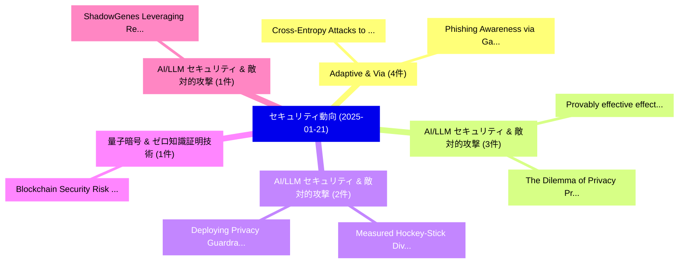

# 📅 02_daily: 日次エグゼクティブサマリー報告書 (2025-01-21)

**集計日時**: 2026-10-02 23:05:14 UTC  
**対象日付**: 2025-01-21  
**本日収集論文数**: 25 件  

---

## 💡 主要セキュリティ動向・脅威インサイト (Executive Insights)

本日の収集論文（計 25 件）において、以下の重点セキュリティ領域で活発な研究動向が確認されました：
- **Adaptive & Via** (4 件): 注目論文として 「Cross-Entropy Attacks to Langu...」、「Phishing Awareness via Game-Ba...」 等が発表され、実務防御および攻撃検証の進展が見られます。
- **AI/LLM セキュリティ & 敵対的攻撃** (3 件): 注目論文として 「Provably effective effective d...」、「The Dilemma of Privacy Protect...」 等が発表され、実務防御および攻撃検証の進展が見られます。
- **AI/LLM セキュリティ & 敵対的攻撃** (2 件): 注目論文として 「Measured Hockey-Stick Divergen...」、「Deploying Privacy Guardrails f...」 等が発表され、実務防御および攻撃検証の進展が見られます。
- **量子暗号 & ゼロ知識証明技術** (1 件): 注目論文として 「Blockchain Security Risk Asses...」 等が発表され、実務防御および攻撃検証の進展が見られます。
- **AI/LLM セキュリティ & 敵対的攻撃** (1 件): 注目論文として 「ShadowGenes: Leveraging Recurr...」 等が発表され、実務防御および攻撃検証の進展が見られます。

### 🗺️ 技術・脅威トピックマインドマップ

---

## 📌 日次セキュリティ論文一覧 (日本語表形式)

| No | arXiv ID | 論文タイトル (日本語訳) | 重要キーワード | 構造化エグゼクティブ要約 (背景・提案・影響) | 脅威分類 | 詳細リンク |
|---|---|---|---|---|---|---|
| 1 | `2501.11795v1` | [Provably effective effective data poisoning attacksの検出](../../okf/papers/2025-01-21/2501.11795.md) | `Jonathan Gallagher`, `Yasaman Esfandiari`, `Michael Warren` | 【提案】概要 (Overview & Key Finding) 本論文「Provably effective effective data poisoning attacksの検出」...。実証評価により経営層・セキュリティ管理者向け推奨アクション (E... | `cs.CR` | [arXiv](https://arxiv.org/abs/2501.11795v1) &#124; [OKF](../../okf/papers/2025-01-21/2501.11795.md) |
| 2 | `2501.11798v2` | [Blockchain Security Risk Assessment in Quantum Era, Migration Strategies and Proactive Defense（セキュリティ分析論文）](../../okf/papers/2025-01-21/2501.11798.md) | `Blockchain Security Risk Assessment`, `Quantum Era`, `Migration Strategies` | 【提案】概要 (Overview & Key Finding) 本論文「Blockchain Security Risk Assessment in 量子 Era, Migratio...。実証評価により経営層・セキュリティ管理者向け推奨アクション (E... | `cs.CR` | [arXiv](https://arxiv.org/abs/2501.11798v2) &#124; [OKF](../../okf/papers/2025-01-21/2501.11798.md) |
| 3 | `2501.11830v1` | [ShadowGenes: Leveraging Recurring Patterns within Computational Graphs for Model Genealogy（セキュリティ分析論文）](../../okf/papers/2025-01-21/2501.11830.md) | `Leveraging Recurring Patterns`, `Computational Graphs`, `Model Genealogy` | 【提案】概要 (Overview & Key Finding) 本論文「ShadowGenes: Leveraging Recurring Patterns within Compu...。実証評価により経営層・セキュリティ管理者向け推奨アクション (E... | `cs.CR` | [arXiv](https://arxiv.org/abs/2501.11830v1) &#124; [OKF](../../okf/papers/2025-01-21/2501.11830.md) |
| 4 | `2501.11848v1` | [FedMUA: Exploring the Vulnerabilities of 連合学習 to Malicious Unlearning Attacks](../../okf/papers/2025-01-21/2501.11848.md) | `Malicious Unlearning Attacks`, `Federated Learning`, `Jian Chen` | 【提案】概要 (Overview & Key Finding) 本論文「FedMUA: Exploring the Vulnerabilities of 連合学習 to Malici...。実証評価により経営層・セキュリティ管理者向け推奨アクション (E... | `cs.CR` | [arXiv](https://arxiv.org/abs/2501.11848v1) &#124; [OKF](../../okf/papers/2025-01-21/2501.11848.md) |
| 5 | `2501.11852v1` | [Cross-Entropy Attacks to Language Models via Rare Event Simulation（セキュリティ分析論文）](../../okf/papers/2025-01-21/2501.11852.md) | `Rare Event Simulation`, `Entropy Attacks`, `Language Models` | 【提案】概要 (Overview & Key Finding) 本論文「Cross-Entropy Attacks to Language Models via Rare Event...。実証評価により経営層・セキュリティ管理者向け推奨アクション (E... | `cs.CR` | [arXiv](https://arxiv.org/abs/2501.11852v1) &#124; [OKF](../../okf/papers/2025-01-21/2501.11852.md) |
| 6 | `2501.11942v1` | [BRC20 Snipping Attack（セキュリティ分析論文）](../../okf/papers/2025-01-21/2501.11942.md) | `Snipping Attack`, `Minfeng Qi`, `Qin Wang` | 【提案】概要 (Overview & Key Finding) 本論文「BRC20 Snipping Attack（セキュリティ分析論文）」（原題: BRC20 Snipping A...。実証評価により経営層・セキュリティ管理者向け推奨アクション (E... | `cs.CR` | [arXiv](https://arxiv.org/abs/2501.11942v1) &#124; [OKF](../../okf/papers/2025-01-21/2501.11942.md) |
| 7 | `2501.12006v1` | [The Dilemma of Privacy Protection for Developers in the Metaverse（セキュリティ分析論文）](../../okf/papers/2025-01-21/2501.12006.md) | `Privacy Protection`, `Argianto Rahartomo`, `Leonel Merino` | 【提案】概要 (Overview & Key Finding) 本論文「The Dilemma of Privacy Protection for Developers in the...。実証評価により経営層・セキュリティ管理者向け推奨アクション (E... | `cs.CR` | [arXiv](https://arxiv.org/abs/2501.12006v1) &#124; [OKF](../../okf/papers/2025-01-21/2501.12006.md) |
| 8 | `2501.12009v2` | [Ratio Attack on G+G Convoluted Gaussian Signature（セキュリティ分析論文）](../../okf/papers/2025-01-21/2501.12009.md) | `Convoluted Gaussian Signature`, `Ratio Attack`, `Theo Fanuela Prabowo` | 【提案】概要 (Overview & Key Finding) 本論文「Ratio Attack on G+G Convoluted Gaussian Signature（セキュリテ...。実証評価により経営層・セキュリティ管理者向け推奨アクション (E... | `cs.CR` | [arXiv](https://arxiv.org/abs/2501.12009v2) &#124; [OKF](../../okf/papers/2025-01-21/2501.12009.md) |
| 9 | `2501.12034v1` | [Application of Machine Learning Techniques for Secure Traffic in NoC-based Manycores（セキュリティ分析論文）](../../okf/papers/2025-01-21/2501.12034.md) | `Machine Learning Techniques`, `Secure Traffic`, `NoC-based Manycores` | 【提案】概要 (Overview & Key Finding) 本論文「Application of Machine Learning Techniques for Secure T...。実証評価により経営層・セキュリティ管理者向け推奨アクション (E... | `cs.CR` | [arXiv](https://arxiv.org/abs/2501.12034v1) &#124; [OKF](../../okf/papers/2025-01-21/2501.12034.md) |
| 10 | `2501.12077v1` | [Phishing Awareness via Game-Based Learning（セキュリティ分析論文）](../../okf/papers/2025-01-21/2501.12077.md) | `Phishing Awareness`, `Based Learning`, `Game-Based Learning` | 【提案】概要 (Overview & Key Finding) 本論文「Phishing Awareness via Game-Based Learning（セキュリティ分析論文）」...。実証評価により経営層・セキュリティ管理者向け推奨アクション (E... | `cs.CR` | [arXiv](https://arxiv.org/abs/2501.12077v1) &#124; [OKF](../../okf/papers/2025-01-21/2501.12077.md) |
| 11 | `2501.12080v2` | [Balance-Based Cryptography: Physically Computing Any Boolean Function（セキュリティ分析論文）](../../okf/papers/2025-01-21/2501.12080.md) | `Based Cryptography`, `Balance-Based Cryptography`, `Suthee Ruangwises` | 【提案】概要 (Overview & Key Finding) 本論文「Balance-Based 暗号技術: Physically Computing Any Boolean Fu...。実証評価により経営層・セキュリティ管理者向け推奨アクション (E... | `cs.CR` | [arXiv](https://arxiv.org/abs/2501.12080v2) &#124; [OKF](../../okf/papers/2025-01-21/2501.12080.md) |
| 12 | `2501.12112v1` | [BotDetect: A Decentralized 連合学習 Framework for Detecting Financial Bots on the EVM Blockchains](../../okf/papers/2025-01-21/2501.12112.md) | `Detecting Financial Bots`, `Ahmed Mounsf Rafik Bendada`, `Abdelaziz Amara Korba` | 【提案】概要 (Overview & Key Finding) 本論文「BotDetect: A Decentralized 連合学習 Framework for Detecting...。実証評価により経営層・セキュリティ管理者向け推奨アクション (E... | `cs.CR` | [arXiv](https://arxiv.org/abs/2501.12112v1) &#124; [OKF](../../okf/papers/2025-01-21/2501.12112.md) |
| 13 | `2501.12123v2` | [FL-CLEANER: byzantine and backdoor defense by CLustering Errors of Activation maps in Non-iid 連合学習](../../okf/papers/2025-01-21/2501.12123.md) | `Non-iid fedErated`, `Mehdi Ben Ghali`, `Gouenou Coatrieux` | 【提案】概要 (Overview & Key Finding) 本論文「FL-CLEANER: byzantine and backdoor defense by CLusterin...。実証評価により経営層・セキュリティ管理者向け推奨アクション (E... | `cs.CR` | [arXiv](https://arxiv.org/abs/2501.12123v2) &#124; [OKF](../../okf/papers/2025-01-21/2501.12123.md) |
| 14 | `2501.12210v1` | [You Can't Eat Your Cake and Have It Too: The Performance Degradation of LLMs with Jailbreak Defense（セキュリティ分析論文）](../../okf/papers/2025-01-21/2501.12210.md) | `Jailbreak Defense`, `Wuyuao Mai`, `Geng Hong` | 【提案】背景とセキュリティ上の課題 (Background & Problem) 本研究はサイバー脅威環境におけるセキュリティ構造・脆弱性の検証を目的としています。(主要検出項目: ...。実証評価により経営層・セキュリティ管理者向け推奨アクション (E... | `cs.CR` | [arXiv](https://arxiv.org/abs/2501.12210v1) &#124; [OKF](../../okf/papers/2025-01-21/2501.12210.md) |
| 15 | `2501.12229v1` | [Empower Healthcare through a Self-Sovereign Identity Infrastructure for Secure Electronic Health Data Access（セキュリティ分析論文）](../../okf/papers/2025-01-21/2501.12229.md) | `Secure Electronic Health Data Access`, `Sovereign Identity Infrastructure`, `Empower Healthcare` | 【提案】概要 (Overview & Key Finding) 本論文「Empower Healthcare through a Self-Sovereign Identity In...。実証評価により経営層・セキュリティ管理者向け推奨アクション (E... | `cs.CR` | [arXiv](https://arxiv.org/abs/2501.12229v1) &#124; [OKF](../../okf/papers/2025-01-21/2501.12229.md) |
| 16 | `2501.12275v1` | [With Great Backbones Comes Great Adversarial Transferability（セキュリティ分析論文）](../../okf/papers/2025-01-21/2501.12275.md) | `Erik Arakelyan`, `Karen Hambardzumyan`, `Davit Papikyan` | 【提案】概要 (Overview & Key Finding) 本論文「With Great Backbones Comes Great Adversarial Transferab...。実証評価により経営層・セキュリティ管理者向け推奨アクション (E... | `cs.CR` | [arXiv](https://arxiv.org/abs/2501.12275v1) &#124; [OKF](../../okf/papers/2025-01-21/2501.12275.md) |
| 17 | `2501.12292v1` | [Library-Attack: Reverse Engineering Approach for Evaluating Hardware IP Protection（セキュリティ分析論文）](../../okf/papers/2025-01-21/2501.12292.md) | `Evaluating Hardware`, `Aritra Dasgupta`, `Sudipta Paria` | 【提案】概要 (Overview & Key Finding) 本論文「Library-Attack: Reverse Engineering Approach for Evalua...。実証評価により経営層・セキュリティ管理者向け推奨アクション (E... | `cs.CR` | [arXiv](https://arxiv.org/abs/2501.12292v1) &#124; [OKF](../../okf/papers/2025-01-21/2501.12292.md) |
| 18 | `2501.12359v2` | [Measured Hockey-Stick Divergence and its Applications to Quantum Pufferfish Privacy（セキュリティ分析論文）](../../okf/papers/2025-01-21/2501.12359.md) | `Quantum Pufferfish Privacy`, `Measured Hockey`, `Stick Divergence` | 【提案】概要 (Overview & Key Finding) 本論文「Measured Hockey-Stick Divergence and its Applications t...。実証評価により経営層・セキュリティ管理者向け推奨アクション (E... | `cs.CR` | [arXiv](https://arxiv.org/abs/2501.12359v2) &#124; [OKF](../../okf/papers/2025-01-21/2501.12359.md) |
| 19 | `2501.12456v1` | [Deploying Privacy Guardrails for LLMs: A Comparative Real-World Applicationsの分析](../../okf/papers/2025-01-21/2501.12456.md) | `Deploying Privacy Guardrails`, `Comparative Real`, `World Applications` | 【提案】概要 (Overview & Key Finding) 本論文「Deploying Privacy Guardrails for LLMs: A Comparative Re...。実証評価により経営層・セキュリティ管理者向け推奨アクション (E... | `cs.CR` | [arXiv](https://arxiv.org/abs/2501.12456v1) &#124; [OKF](../../okf/papers/2025-01-21/2501.12456.md) |
| 20 | `2501.12465v1` | [Adaptive PII Mitigation Framework for 大規模言語モデル](../../okf/papers/2025-01-21/2501.12465.md) | `Large Language Models`, `Shubhi Asthana`, `Ruchi Mahindru` | 【提案】概要 (Overview & Key Finding) 本論文「Adaptive PII Mitigation Framework for 大規模言語モデル」（原題: Ada...。実証評価により経営層・セキュリティ管理者向け推奨アクション (E... | `cs.CR` | [arXiv](https://arxiv.org/abs/2501.12465v1) &#124; [OKF](../../okf/papers/2025-01-21/2501.12465.md) |
| 21 | `2501.12516v1` | [Robustness of Selected Learning Models under Label-Flipping Attack（セキュリティ分析論文）](../../okf/papers/2025-01-21/2501.12516.md) | `Selected Learning Models`, `Flipping Attack`, `Label-Flipping Attack` | 【提案】概要 (Overview & Key Finding) 本論文「Robustness of Selected Learning Models under Label-Flip...。実証評価により経営層・セキュリティ管理者向け推奨アクション (E... | `cs.CR` | [arXiv](https://arxiv.org/abs/2501.12516v1) &#124; [OKF](../../okf/papers/2025-01-21/2501.12516.md) |
| 22 | `2501.12523v1` | [Federated Discrete Denoising Diffusion Model for Molecular Generation with OpenFL（セキュリティ分析論文）](../../okf/papers/2025-01-21/2501.12523.md) | `Federated Discrete Denoising Diffusion Model`, `Molecular Generation`, `Kevin Ta` | 【提案】概要 (Overview & Key Finding) 本論文「Federated Discrete Denoising Diffusion Model for Molecu...。実証評価により経営層・セキュリティ管理者向け推奨アクション (E... | `cs.CR` | [arXiv](https://arxiv.org/abs/2501.12523v1) &#124; [OKF](../../okf/papers/2025-01-21/2501.12523.md) |
| 23 | `2501.13962v1` | [Adaptive Cyber-Attack Detection in IIoT Using Attention-Based LSTM-CNN Models（セキュリティ分析論文）](../../okf/papers/2025-01-21/2501.13962.md) | `Adaptive Cyber`, `Attack Detection`, `Using Attention` | 【提案】概要 (Overview & Key Finding) 本論文「Adaptive Cyber-Attack Detection in IIoT Using Attention...。実証評価により経営層・セキュリティ管理者向け推奨アクション (E... | `cs.CR` | [arXiv](https://arxiv.org/abs/2501.13962v1) &#124; [OKF](../../okf/papers/2025-01-21/2501.13962.md) |
| 24 | `2501.13965v1` | [ZKLoRA: Efficient Zero-Knowledge Proofs for LoRA Verification（セキュリティ分析論文）](../../okf/papers/2025-01-21/2501.13965.md) | `Efficient Zero`, `Knowledge Proofs`, `Zero-Knowledge Proofs` | 【提案】概要 (Overview & Key Finding) 本論文「ZKLoRA: Efficient Zero-Knowledge Proofs for LoRA Verifi...。実証評価により経営層・セキュリティ管理者向け推奨アクション (E... | `cs.CR` | [arXiv](https://arxiv.org/abs/2501.13965v1) &#124; [OKF](../../okf/papers/2025-01-21/2501.13965.md) |
| 25 | `2502.10404v1` | [Data Protection through Governance Frameworks（セキュリティ分析論文）](../../okf/papers/2025-01-21/2502.10404.md) | `Data Protection`, `Governance Frameworks`, `Sivananda Reddy Julakanti` | 【提案】概要 (Overview & Key Finding) 本論文「Data Protection through Governance Frameworks（セキュリティ分析論...。実証評価により経営層・セキュリティ管理者向け推奨アクション (E... | `cs.CR` | [arXiv](https://arxiv.org/abs/2502.10404v1) &#124; [OKF](../../okf/papers/2025-01-21/2502.10404.md) |

