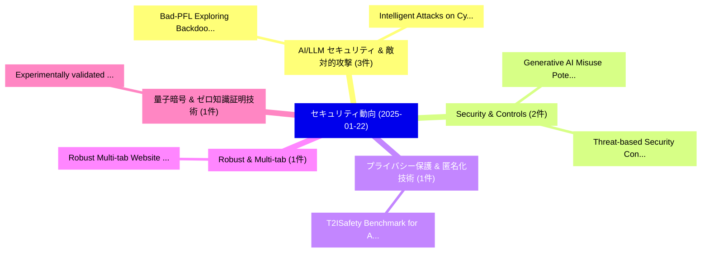

# 📅 02_daily: 日次エグゼクティブサマリー報告書 (2025-01-22)

**集計日時**: 2026-10-02 23:05:14 UTC  
**対象日付**: 2025-01-22  
**本日収集論文数**: 22 件  

---

## 💡 主要セキュリティ動向・脅威インサイト (Executive Insights)

本日の収集論文（計 22 件）において、以下の重点セキュリティ領域で活発な研究動向が確認されました：
- **AI/LLM セキュリティ & 敵対的攻撃** (3 件): 注目論文として 「Bad-PFL: Exploring Backdoor At...」、「Intelligent Attacks on Cyber-P...」 等が発表され、実務防御および攻撃検証の進展が見られます。
- **Security & Controls** (2 件): 注目論文として 「Generative AI Misuse Potential...」、「Threat-based Security Controls...」 等が発表され、実務防御および攻撃検証の進展が見られます。
- **プライバシー保護 & 匿名化技術** (1 件): 注目論文として 「T2ISafety: Benchmark for Asses...」 等が発表され、実務防御および攻撃検証の進展が見られます。
- **Robust & Multi-tab** (1 件): 注目論文として 「Robust Multi-tab Website Finge...」 等が発表され、実務防御および攻撃検証の進展が見られます。
- **量子暗号 & ゼロ知識証明技術** (1 件): 注目論文として 「Experimentally validated quant...」 等が発表され、実務防御および攻撃検証の進展が見られます。

### 🗺️ 技術・脅威トピックマインドマップ

---

## 📌 日次セキュリティ論文一覧 (日本語表形式)

| No | arXiv ID | 論文タイトル (日本語訳) | 重要キーワード | 構造化エグゼクティブ要約 (背景・提案・影響) | 脅威分類 | 詳細リンク |
|---|---|---|---|---|---|---|
| 1 | `2501.12612v3` | [T2ISafety: Benchmark for Assessing Fairness, Toxicity, and Privacy in Image Generation（セキュリティ分析論文）](../../okf/papers/2025-01-22/2501.12612.md) | `Assessing Fairness`, `Image Generation`, `Lijun Li` | 【提案】概要 (Overview & Key Finding) 本論文「T2ISafety: Benchmark for Assessing Fairness, Toxicity, ...。実証評価により経営層・セキュリティ管理者向け推奨アクション (E... | `cs.CR` | [arXiv](https://arxiv.org/abs/2501.12612v3) &#124; [OKF](../../okf/papers/2025-01-22/2501.12612.md) |
| 2 | `2501.12622v1` | [Robust Multi-tab Website Fingerprintingに向けて](../../okf/papers/2025-01-22/2501.12622.md) | `Multi-tab Website`, `Towards Robust Multi`, `Website Fingerprinting` | 【提案】概要 (Overview & Key Finding) 本論文「Robust Multi-tab Website Fingerprintingに向けて」（原題: Toward...。実証評価により経営層・セキュリティ管理者向け推奨アクション (E... | `cs.CR` | [arXiv](https://arxiv.org/abs/2501.12622v1) &#124; [OKF](../../okf/papers/2025-01-22/2501.12622.md) |
| 3 | `2501.12709v2` | [Experimentally validated quantum-secure 連合学習 over a multi-user quantum network](../../okf/papers/2025-01-22/2501.12709.md) | `multi-user quantum`, `quantum-secure federated`, `Ping Liu` | 【提案】概要 (Overview & Key Finding) 本論文「Experimentally validated 量子-secure 連合学習 over a multi-us...。実証評価により経営層・セキュリティ管理者向け推奨アクション (E... | `cs.CR` | [arXiv](https://arxiv.org/abs/2501.12709v2) &#124; [OKF](../../okf/papers/2025-01-22/2501.12709.md) |
| 4 | `2501.12736v1` | [Bad-PFL: Exploring Backdoor Attacks against Personalized 連合学習](../../okf/papers/2025-01-22/2501.12736.md) | `Exploring Backdoor Attacks`, `Personalized Federated Learning`, `Mingyuan Fan` | 【提案】概要 (Overview & Key Finding) 本論文「Bad-PFL: Exploring Backdoor Attacks against Personalize...。実証評価により経営層・セキュリティ管理者向け推奨アクション (E... | `cs.CR` | [arXiv](https://arxiv.org/abs/2501.12736v1) &#124; [OKF](../../okf/papers/2025-01-22/2501.12736.md) |
| 5 | `2501.12762v1` | [Intelligent Attacks on Cyber-Physical Systems and Critical Infrastructures（セキュリティ分析論文）](../../okf/papers/2025-01-22/2501.12762.md) | `Intelligent Attacks`, `Physical Systems`, `Critical Infrastructures` | 【提案】概要 (Overview & Key Finding) 本論文「Intelligent Attacks on Cyber-Physical Systems and Criti...。実証評価により経営層・セキュリティ管理者向け推奨アクション (E... | `cs.CR` | [arXiv](https://arxiv.org/abs/2501.12762v1) &#124; [OKF](../../okf/papers/2025-01-22/2501.12762.md) |
| 6 | `2501.12811v2` | [Unveiling Zero-Space Detection: A Novel Framework for Autonomous Ransomware Identification in High-Velocity Environments（セキュリティ分析論文）](../../okf/papers/2025-01-22/2501.12811.md) | `Autonomous Ransomware Identification`, `Unveiling Zero`, `Space Detection` | 【提案】概要 (Overview & Key Finding) 本論文「Unveiling Zero-Space Detection: A Novel Framework for A...。実証評価により経営層・セキュリティ管理者向け推奨アクション (E... | `cs.CR` | [arXiv](https://arxiv.org/abs/2501.12811v2) &#124; [OKF](../../okf/papers/2025-01-22/2501.12811.md) |
| 7 | `2501.12842v5` | [Impossibility of Quantum Private Queries（セキュリティ分析論文）](../../okf/papers/2025-01-22/2501.12842.md) | `Quantum Private Queries`, `Severin Winkler`, `Raw Meta` | 【提案】概要 (Overview & Key Finding) 本論文「Impossibility of 量子 Private Queries（セキュリティ分析論文）」（原題: Im...。実証評価により経営層・セキュリティ管理者向け推奨アクション (E... | `cs.CR` | [arXiv](https://arxiv.org/abs/2501.12842v5) &#124; [OKF](../../okf/papers/2025-01-22/2501.12842.md) |
| 8 | `2501.12883v4` | [Generative AI Misuse Potential in Cyber Security Education: A Case Study of a UK Degree Program（セキュリティ分析論文）](../../okf/papers/2025-01-22/2501.12883.md) | `Cyber Security Education`, `Misuse Potential`, `Degree Program` | 【提案】概要 (Overview & Key Finding) 本論文「Generative AI Misuse Potential in Cyber Security Educat...。実証評価により経営層・セキュリティ管理者向け推奨アクション (E... | `cs.CR` | [arXiv](https://arxiv.org/abs/2501.12883v4) &#124; [OKF](../../okf/papers/2025-01-22/2501.12883.md) |
| 9 | `2501.12890v1` | [Analyzing and Exploiting Branch Mispredictions in Microcode（セキュリティ分析論文）](../../okf/papers/2025-01-22/2501.12890.md) | `Exploiting Branch Mispredictions`, `Nicholas Mosier`, `Hamed Nemati` | 【提案】概要 (Overview & Key Finding) 本論文「Analyzing and Exploiting Branch Mispredictions in Micro...。実証評価によりMitchell, Caroline Trippe... | `cs.CR` | [arXiv](https://arxiv.org/abs/2501.12890v1) &#124; [OKF](../../okf/papers/2025-01-22/2501.12890.md) |
| 10 | `2501.12893v2` | [Statistical Privacy（セキュリティ分析論文）](../../okf/papers/2025-01-22/2501.12893.md) | `Statistical Privacy`, `Dennis Breutigam`, `Raw Meta` | 【提案】概要 (Overview & Key Finding) 本論文「Statistical Privacy（セキュリティ分析論文）」（原題: Statistical Privac...。実証評価により経営層・セキュリティ管理者向け推奨アクション (E... | `cs.CR` | [arXiv](https://arxiv.org/abs/2501.12893v2) &#124; [OKF](../../okf/papers/2025-01-22/2501.12893.md) |
| 11 | `2501.12911v4` | [A Selective Homomorphic Encryption Approach for Faster Privacy-Preserving 連合学習](../../okf/papers/2025-01-22/2501.12911.md) | `Faster Privacy`, `Preserving Federated Learning`, `Privacy-Preserving Federated` | 【提案】概要 (Overview & Key Finding) 本論文「A Selective 準同型暗号 Approach for Faster Privacy-Preservin...。実証評価により経営層・セキュリティ管理者向け推奨アクション (E... | `cs.CR` | [arXiv](https://arxiv.org/abs/2501.12911v4) &#124; [OKF](../../okf/papers/2025-01-22/2501.12911.md) |
| 12 | `2501.13004v1` | [Comparison of feature extraction tools for network traffic data（セキュリティ分析論文）](../../okf/papers/2025-01-22/2501.13004.md) | `Borys Lypa`, `Ivan Horyn`, `Natalia Zagorodna` | 【提案】概要 (Overview & Key Finding) 本論文「Comparison of feature extraction tools for network traf...。実証評価により経営層・セキュリティ管理者向け推奨アクション (E... | `cs.CR` | [arXiv](https://arxiv.org/abs/2501.13004v1) &#124; [OKF](../../okf/papers/2025-01-22/2501.13004.md) |
| 13 | `2501.13080v1` | [Refining Input Guardrails: Enhancing LLM-as-a-Judge Efficiency Through Chain-of-Thought Fine-Tuning and Alignment（セキュリティ分析論文）](../../okf/papers/2025-01-22/2501.13080.md) | `Refining Input Guardrails`, `Thought Fine`, `a-Judge Efficiency` | 【提案】概要 (Overview & Key Finding) 本論文「Refining Input Guardrails: Enhancing LLM-as-a-Judge Eff...。実証評価により経営層・セキュリティ管理者向け推奨アクション (E... | `cs.CR` | [arXiv](https://arxiv.org/abs/2501.13080v1) &#124; [OKF](../../okf/papers/2025-01-22/2501.13080.md) |
| 14 | `2501.13081v1` | [Real-Time Multi-Modal Subcomponent-Level Measurements for Trustworthy System Monitoring and マルウェア検出](../../okf/papers/2025-01-22/2501.13081.md) | `Trustworthy System Monitoring`, `Time Multi`, `Real-Time Multi` | 【提案】概要 (Overview & Key Finding) 本論文「Real-Time Multi-Modal Subcomponent-Level Measurements f...。実証評価により経営層・セキュリティ管理者向け推奨アクション (E... | `cs.CR` | [arXiv](https://arxiv.org/abs/2501.13081v1) &#124; [OKF](../../okf/papers/2025-01-22/2501.13081.md) |
| 15 | `2501.13213v1` | [Distributed Intrusion Detection in Dynamic Networks of UAVs using Few-Shot 連合学習](../../okf/papers/2025-01-22/2501.13213.md) | `Distributed Intrusion Detection`, `Dynamic Networks`, `Shot Federated Learning` | 【提案】概要 (Overview & Key Finding) 本論文「Distributed Intrusion Detection in Dynamic Networks of ...。実証評価により経営層・セキュリティ管理者向け推奨アクション (E... | `cs.CR` | [arXiv](https://arxiv.org/abs/2501.13213v1) &#124; [OKF](../../okf/papers/2025-01-22/2501.13213.md) |
| 16 | `2501.13227v2` | [Joint Task Offloading and User Scheduling in 5G MEC under Jamming Attacks（セキュリティ分析論文）](../../okf/papers/2025-01-22/2501.13227.md) | `Joint Task Offloading`, `User Scheduling`, `Jamming Attacks` | 【提案】概要 (Overview & Key Finding) 本論文「Joint Task Offloading and User Scheduling in 5G MEC und...。実証評価により経営層・セキュリティ管理者向け推奨アクション (E... | `cs.CR` | [arXiv](https://arxiv.org/abs/2501.13227v2) &#124; [OKF](../../okf/papers/2025-01-22/2501.13227.md) |
| 17 | `2501.13231v1` | [Active RIS-Assisted URLLC NOMA-Based 5G Network with FBL under Jamming Attacks（セキュリティ分析論文）](../../okf/papers/2025-01-22/2501.13231.md) | `Jamming Attacks`, `RIS-Assisted URLLC`, `NOMA-Based 5G` | 【提案】概要 (Overview & Key Finding) 本論文「Active RIS-Assisted URLLC NOMA-Based 5G Network with FB...。実証評価により経営層・セキュリティ管理者向け推奨アクション (E... | `cs.CR` | [arXiv](https://arxiv.org/abs/2501.13231v1) &#124; [OKF](../../okf/papers/2025-01-22/2501.13231.md) |
| 18 | `2501.13252v2` | [Exploring the Technology Landscape through Topic Modeling, Expert Involvement, and Reinforcement Learning（セキュリティ分析論文）](../../okf/papers/2025-01-22/2501.13252.md) | `Technology Landscape`, `Topic Modeling`, `Expert Involvement` | 【提案】概要 (Overview & Key Finding) 本論文「Exploring the Technology Landscape through Topic Modeli...。実証評価により経営層・セキュリティ管理者向け推奨アクション (E... | `cs.CR` | [arXiv](https://arxiv.org/abs/2501.13252v2) &#124; [OKF](../../okf/papers/2025-01-22/2501.13252.md) |
| 19 | `2501.13256v1` | [Bypassing Array Canaries via Autonomous Function Call Resolution（セキュリティ分析論文）](../../okf/papers/2025-01-22/2501.13256.md) | `Autonomous Function Call Resolution`, `Bypassing Array Canaries`, `Nathaniel Oh` | 【提案】概要 (Overview & Key Finding) 本論文「Bypassing Array Canaries via Autonomous Function Call R...。実証評価により経営層・セキュリティ管理者向け推奨アクション (E... | `cs.CR` | [arXiv](https://arxiv.org/abs/2501.13256v1) &#124; [OKF](../../okf/papers/2025-01-22/2501.13256.md) |
| 20 | `2501.13268v1` | [Threat-based Security Controls to Protect Industrial Control Systems（セキュリティ分析論文）](../../okf/papers/2025-01-22/2501.13268.md) | `Protect Industrial Control Systems`, `Security Controls`, `Threat-based Security` | 【提案】概要 (Overview & Key Finding) 本論文「脅威-based Security Controls to Protect Industrial Contro...。実証評価により経営層・セキュリティ管理者向け推奨アクション (E... | `cs.CR` | [arXiv](https://arxiv.org/abs/2501.13268v1) &#124; [OKF](../../okf/papers/2025-01-22/2501.13268.md) |
| 21 | `2501.13276v1` | [Extraction of Secrets from 40nm CMOS Gate Dielectric Breakdown Antifuses by FIB Passive Voltage Contrast（セキュリティ分析論文）](../../okf/papers/2025-01-22/2501.13276.md) | `Gate Dielectric Breakdown Antifuses`, `Passive Voltage Contrast`, `Antony Moor` | 【提案】概要 (Overview & Key Finding) 本論文「Extraction of Secrets from 40nm CMOS Gate Dielectric Br...。実証評価により経営層・セキュリティ管理者向け推奨アクション (E... | `cs.CR` | [arXiv](https://arxiv.org/abs/2501.13276v1) &#124; [OKF](../../okf/papers/2025-01-22/2501.13276.md) |
| 22 | `2501.13974v1` | [Absolute Governance: A Framework for Synchronization and Certification of the Corporate Contractual State（セキュリティ分析論文）](../../okf/papers/2025-01-22/2501.13974.md) | `Corporate Contractual State`, `Absolute Governance`, `Antonio Hoffert` | 【提案】概要 (Overview & Key Finding) 本論文「Absolute Governance: A Framework for Synchronization an...。実証評価により経営層・セキュリティ管理者向け推奨アクション (E... | `cs.CR` | [arXiv](https://arxiv.org/abs/2501.13974v1) &#124; [OKF](../../okf/papers/2025-01-22/2501.13974.md) |

