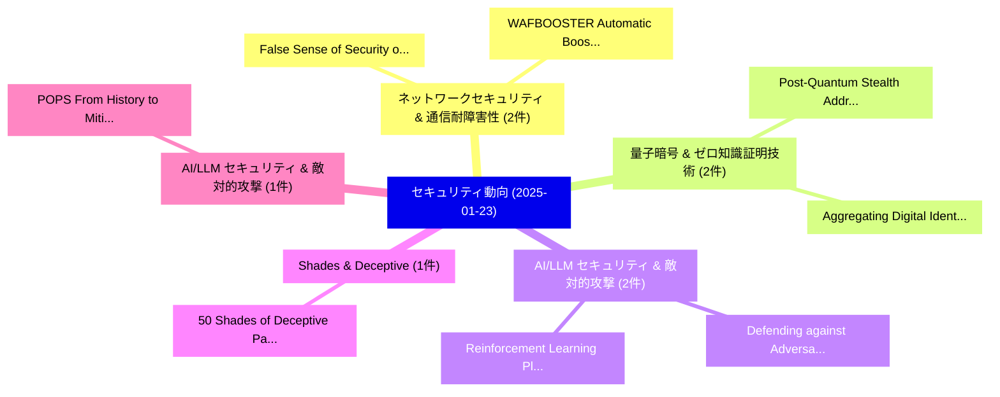

# 📅 02_daily: 日次エグゼクティブサマリー報告書 (2025-01-23)

**集計日時**: 2026-10-02 23:05:14 UTC  
**対象日付**: 2025-01-23  
**本日収集論文数**: 15 件  

---

## 💡 主要セキュリティ動向・脅威インサイト (Executive Insights)

本日の収集論文（計 15 件）において、以下の重点セキュリティ領域で活発な研究動向が確認されました：
- **ネットワークセキュリティ & 通信耐障害性** (2 件): 注目論文として 「False Sense of Security on Pro...」、「WAFBOOSTER: Automatic Boosting...」 等が発表され、実務防御および攻撃検証の進展が見られます。
- **量子暗号 & ゼロ知識証明技術** (2 件): 注目論文として 「Post-Quantum Stealth Address P...」、「Aggregating Digital Identities...」 等が発表され、実務防御および攻撃検証の進展が見られます。
- **AI/LLM セキュリティ & 敵対的攻撃** (2 件): 注目論文として 「Defending against Adversarial ...」、「Reinforcement Learning Platfor...」 等が発表され、実務防御および攻撃検証の進展が見られます。
- **Shades & Deceptive** (1 件): 注目論文として 「50 Shades of Deceptive Pattern...」 等が発表され、実務防御および攻撃検証の進展が見られます。
- **AI/LLM セキュリティ & 敵対的攻撃** (1 件): 注目論文として 「POPS: From History to Mitigati...」 等が発表され、実務防御および攻撃検証の進展が見られます。

### 🗺️ 技術・脅威トピックマインドマップ

---

## 📌 日次セキュリティ論文一覧 (日本語表形式)

| No | arXiv ID | 論文タイトル (日本語訳) | 重要キーワード | 構造化エグゼクティブ要約 (背景・提案・影響) | 脅威分類 | 詳細リンク |
|---|---|---|---|---|---|---|
| 1 | `2501.13351v3` | [50 Shades of Deceptive Patterns: A Unified Taxonomy, Multimodal Detection, and Security Implications（セキュリティ分析論文）](../../okf/papers/2025-01-23/2501.13351.md) | `Deceptive Patterns`, `Unified Taxonomy`, `Multimodal Detection` | 【提案】概要 (Overview & Key Finding) 本論文「50 Shades of Deceptive Patterns: A Unified Taxonomy, Mu...。実証評価により経営層・セキュリティ管理者向け推奨アクション (E... | `cs.CR` | [arXiv](https://arxiv.org/abs/2501.13351v3) &#124; [OKF](../../okf/papers/2025-01-23/2501.13351.md) |
| 2 | `2501.13363v1` | [False Sense of Security on Protected Wi-Fi Networks（セキュリティ分析論文）](../../okf/papers/2025-01-23/2501.13363.md) | `False Sense`, `Protected Wi`, `Fi Networks` | 【提案】概要 (Overview & Key Finding) 本論文「False Sense of Security on Protected Wi-Fi Networks（セキュ...。実証評価により経営層・セキュリティ管理者向け推奨アクション (E... | `cs.CR` | [arXiv](https://arxiv.org/abs/2501.13363v1) &#124; [OKF](../../okf/papers/2025-01-23/2501.13363.md) |
| 3 | `2501.13540v1` | [POPS: From History to Mitigation of DNS Cache Poisoning Attacks（セキュリティ分析論文）](../../okf/papers/2025-01-23/2501.13540.md) | `Cache Poisoning Attacks`, `Yehuda Afek`, `Harel Berger` | 【提案】概要 (Overview & Key Finding) 本論文「POPS: From History to Mitigation of DNS Cache Poisoning...。実証評価により経営層・セキュリティ管理者向け推奨アクション (E... | `cs.CR` | [arXiv](https://arxiv.org/abs/2501.13540v1) &#124; [OKF](../../okf/papers/2025-01-23/2501.13540.md) |
| 4 | `2501.13677v3` | [HumorReject: Decoupling LLM Safety from Refusal Prefix via A Little Humor（セキュリティ分析論文）](../../okf/papers/2025-01-23/2501.13677.md) | `Refusal Prefix`, `Little Humor`, `Zihui Wu` | 【提案】概要 (Overview & Key Finding) 本論文「HumorReject: Decoupling LLM Safety from Refusal Prefix ...。実証評価により経営層・セキュリティ管理者向け推奨アクション (E... | `cs.CR` | [arXiv](https://arxiv.org/abs/2501.13677v3) &#124; [OKF](../../okf/papers/2025-01-23/2501.13677.md) |
| 5 | `2501.13716v1` | [A Comprehensive Framework for Building Highly Secure, Network-Connected Devices: Chip to App（セキュリティ分析論文）](../../okf/papers/2025-01-23/2501.13716.md) | `Building Highly Secure`, `Connected Devices`, `Network-Connected Devices` | 【提案】概要 (Overview & Key Finding) 本論文「A Comprehensive Framework for Building Highly Secure, N...。実証評価により経営層・セキュリティ管理者向け推奨アクション (E... | `cs.CR` | [arXiv](https://arxiv.org/abs/2501.13716v1) &#124; [OKF](../../okf/papers/2025-01-23/2501.13716.md) |
| 6 | `2501.13733v1` | [Post-Quantum Stealth Address Protocols（セキュリティ分析論文）](../../okf/papers/2025-01-23/2501.13733.md) | `Quantum Stealth Address Protocols`, `Post-Quantum Stealth`, `Marija Mikic` | 【提案】概要 (Overview & Key Finding) 本論文「Post-量子 Stealth Address Protocols（セキュリティ分析論文）」（原題: Post...。実証評価により経営層・セキュリティ管理者向け推奨アクション (E... | `cs.CR` | [arXiv](https://arxiv.org/abs/2501.13733v1) &#124; [OKF](../../okf/papers/2025-01-23/2501.13733.md) |
| 7 | `2501.13748v1` | [Exact Soft Analytical Side-Channel Attacks using Tractable Circuits（セキュリティ分析論文）](../../okf/papers/2025-01-23/2501.13748.md) | `Exact Soft Analytical Side`, `Channel Attacks`, `Tractable Circuits` | 【提案】概要 (Overview & Key Finding) 本論文「Exact Soft Analytical サイドチャネル攻撃 Attacks using Tractable...。実証評価により経営層・セキュリティ管理者向け推奨アクション (E... | `cs.CR` | [arXiv](https://arxiv.org/abs/2501.13748v1) &#124; [OKF](../../okf/papers/2025-01-23/2501.13748.md) |
| 8 | `2501.13770v1` | [Aggregating Digital Identities through Bridging. An Integration of Open Authentication Protocols for Web3 Identifiers（セキュリティ分析論文）](../../okf/papers/2025-01-23/2501.13770.md) | `Aggregating Digital Identities`, `Open Authentication Protocols`, `Web3 Identifiers` | 【提案】An Integration of Open Authentication Protocols for Web3 Identifiers ### (日本語題名: Aggreg...。実証評価により経営層・セキュリティ管理者向け推奨アクション (E... | `cs.CR` | [arXiv](https://arxiv.org/abs/2501.13770v1) &#124; [OKF](../../okf/papers/2025-01-23/2501.13770.md) |
| 9 | `2501.13782v1` | [Defending against Adversarial Malware Attacks on ML-based Android マルウェア検出 Systems](../../okf/papers/2025-01-23/2501.13782.md) | `Adversarial Malware Attacks`, `ML-based Android`, `Android Malware Detection Systems` | 【提案】概要 (Overview & Key Finding) 本論文「Defending against Adversarial マルウェア Attacks on ML-based...。実証評価により経営層・セキュリティ管理者向け推奨アクション (E... | `cs.CR` | [arXiv](https://arxiv.org/abs/2501.13782v1) &#124; [OKF](../../okf/papers/2025-01-23/2501.13782.md) |
| 10 | `2501.13799v1` | [Rudraksh: A compact and lightweight post-quantum key-encapsulation mechanism（セキュリティ分析論文）](../../okf/papers/2025-01-23/2501.13799.md) | `post-quantum key`, `Suparna Kundu`, `Archisman Ghosh` | 【提案】概要 (Overview & Key Finding) 本論文「Rudraksh: A compact and lightweight post-量子 key-encapsu...。実証評価により経営層・セキュリティ管理者向け推奨アクション (E... | `cs.CR` | [arXiv](https://arxiv.org/abs/2501.13799v1) &#124; [OKF](../../okf/papers/2025-01-23/2501.13799.md) |
| 11 | `2501.13865v1` | [Threshold Selection for Iterative Decoding of $(v,w)$-regular Binary Codes（セキュリティ分析論文）](../../okf/papers/2025-01-23/2501.13865.md) | `Threshold Selection`, `Iterative Decoding`, `Binary Codes` | 【提案】概要 (Overview & Key Finding) 本論文「Threshold Selection for Iterative Decoding of $(v,w)$-r...。実証評価により経営層・セキュリティ管理者向け推奨アクション (E... | `cs.CR` | [arXiv](https://arxiv.org/abs/2501.13865v1) &#124; [OKF](../../okf/papers/2025-01-23/2501.13865.md) |
| 12 | `2501.13894v2` | [Logical Maneuvers: Detecting and Mitigating Adversarial Hardware Faults in Space（セキュリティ分析論文）](../../okf/papers/2025-01-23/2501.13894.md) | `Mitigating Adversarial Hardware Faults`, `Logical Maneuvers`, `Fatemeh Khojasteh Dana` | 【提案】概要 (Overview & Key Finding) 本論文「Logical Maneuvers: Detecting and Mitigating Adversarial...。実証評価により経営層・セキュリティ管理者向け推奨アクション (E... | `cs.CR` | [arXiv](https://arxiv.org/abs/2501.13894v2) &#124; [OKF](../../okf/papers/2025-01-23/2501.13894.md) |
| 13 | `2501.14008v1` | [WAFBOOSTER: Automatic Boosting of WAF Security Against Mutated Malicious Payloads（セキュリティ分析論文）](../../okf/papers/2025-01-23/2501.14008.md) | `Automatic Boosting`, `Cong Wu`, `Jing Chen` | 【提案】概要 (Overview & Key Finding) 本論文「WAFBOOSTER: Automatic Boosting of WAF Security Against ...。実証評価により経営層・セキュリティ管理者向け推奨アクション (E... | `cs.CR` | [arXiv](https://arxiv.org/abs/2501.14008v1) &#124; [OKF](../../okf/papers/2025-01-23/2501.14008.md) |
| 14 | `2501.14050v4` | [GraphRAG under Fire（セキュリティ分析論文）](../../okf/papers/2025-01-23/2501.14050.md) | `Jiacheng Liang`, `Yuhui Wang`, `Changjiang Li` | 【提案】概要 (Overview & Key Finding) 本論文「GraphRAG under Fire（セキュリティ分析論文）」（原題: GraphRAG under Fir...。実証評価により経営層・セキュリティ管理者向け推奨アクション (E... | `cs.CR` | [arXiv](https://arxiv.org/abs/2501.14050v4) &#124; [OKF](../../okf/papers/2025-01-23/2501.14050.md) |
| 15 | `2501.14122v2` | [Reinforcement Learning Platform for Adversarial Black-box Attacks with Custom Distortion Filters（セキュリティ分析論文）](../../okf/papers/2025-01-23/2501.14122.md) | `Reinforcement Learning Platform`, `Custom Distortion Filters`, `Adversarial Black` | 【提案】概要 (Overview & Key Finding) 本論文「Reinforcement Learning Platform for Adversarial Black-b...。実証評価により経営層・セキュリティ管理者向け推奨アクション (E... | `cs.CR` | [arXiv](https://arxiv.org/abs/2501.14122v2) &#124; [OKF](../../okf/papers/2025-01-23/2501.14122.md) |

