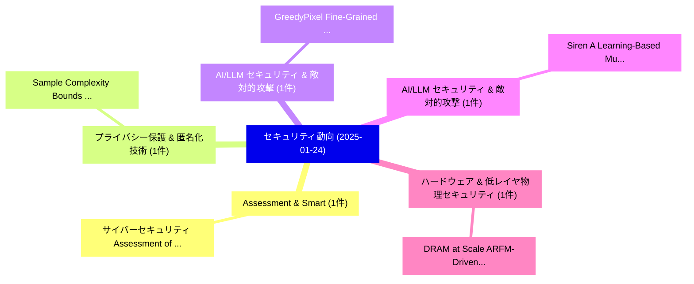

# 📅 02_daily: 日次エグゼクティブサマリー報告書 (2025-01-24)

**集計日時**: 2026-10-02 23:05:15 UTC  
**対象日付**: 2025-01-24  
**本日収集論文数**: 23 件  

---

## 💡 主要セキュリティ動向・脅威インサイト (Executive Insights)

本日の収集論文（計 23 件）において、以下の重点セキュリティ領域で活発な研究動向が確認されました：
- **Assessment & Smart** (1 件): 注目論文として 「サイバーセキュリティ Assessment of Smart...」 等が発表され、実務防御および攻撃検証の進展が見られます。
- **プライバシー保護 & 匿名化技術** (1 件): 注目論文として 「Sample Complexity Bounds for S...」 等が発表され、実務防御および攻撃検証の進展が見られます。
- **AI/LLM セキュリティ & 敵対的攻撃** (1 件): 注目論文として 「GreedyPixel: Fine-Grained Blac...」 等が発表され、実務防御および攻撃検証の進展が見られます。
- **AI/LLM セキュリティ & 敵対的攻撃** (1 件): 注目論文として 「Siren: A Learning-Based Multi-...」 等が発表され、実務防御および攻撃検証の進展が見られます。
- **ハードウェア & 低レイヤ物理セキュリティ** (1 件): 注目論文として 「DRAM at Scale: ARFM-Driven Row...」 等が発表され、実務防御および攻撃検証の進展が見られます。

### 🗺️ 技術・脅威トピックマインドマップ

---

## 📌 日次セキュリティ論文一覧 (日本語表形式)

| No | arXiv ID | 論文タイトル (日本語訳) | 重要キーワード | 構造化エグゼクティブ要約 (背景・提案・影響) | 脅威分類 | 詳細リンク |
|---|---|---|---|---|---|---|
| 1 | `2501.14175v1` | [サイバーセキュリティ Assessment of Smart Grid Exposure Using a Machine Learning Based Approach](../../okf/papers/2025-01-24/2501.14175.md) | `Smart Grid Exposure Using`, `Cybersecurity Assessment`, `Raw Meta` | 【提案】概要 (Overview & Key Finding) 本論文「サイバーセキュリティ Assessment of Smart Grid Exposure Using a Ma...。実証評価により経営層・セキュリティ管理者向け推奨アクション (E... | `cs.CR` | [arXiv](https://arxiv.org/abs/2501.14175v1) &#124; [OKF](../../okf/papers/2025-01-24/2501.14175.md) |
| 2 | `2501.14184v3` | [Sample Complexity Bounds for Scalar Parameter Estimation Under Quantum Differential Privacy（セキュリティ分析論文）](../../okf/papers/2025-01-24/2501.14184.md) | `Sample Complexity Bounds`, `Farhad Farokhi`, `Raw Meta` | 【提案】概要 (Overview & Key Finding) 本論文「Sample Complexity Bounds for Scalar Parameter Estimatio...。実証評価により経営層・セキュリティ管理者向け推奨アクション (E... | `cs.CR` | [arXiv](https://arxiv.org/abs/2501.14184v3) &#124; [OKF](../../okf/papers/2025-01-24/2501.14184.md) |
| 3 | `2501.14230v4` | [GreedyPixel: Fine-Grained Black-Box Adversarial Attack Via Greedy Algorithm（セキュリティ分析論文）](../../okf/papers/2025-01-24/2501.14230.md) | `Box Adversarial Attack Via Greedy Algorithm`, `Grained Black`, `Fine-Grained Black` | 【提案】概要 (Overview & Key Finding) 本論文「GreedyPixel: Fine-Grained Black-Box 敵対的攻撃 Via Greedy Al...。実証評価により経営層・セキュリティ管理者向け推奨アクション (E... | `cs.CR` | [arXiv](https://arxiv.org/abs/2501.14230v4) &#124; [OKF](../../okf/papers/2025-01-24/2501.14230.md) |
| 4 | `2501.14250v2` | [Siren: A Learning-Based Multi-Turn Attack Framework for Simulating Real-World Human Jailbreak Behaviors（セキュリティ分析論文）](../../okf/papers/2025-01-24/2501.14250.md) | `World Human Jailbreak Behaviors`, `Based Multi`, `Simulating Real` | 【提案】概要 (Overview & Key Finding) 本論文「Siren: A Learning-Based Multi-Turn Attack Framework for...。実証評価により経営層・セキュリティ管理者向け推奨アクション (E... | `cs.CR` | [arXiv](https://arxiv.org/abs/2501.14250v2) &#124; [OKF](../../okf/papers/2025-01-24/2501.14250.md) |
| 5 | `2501.14328v1` | [DRAM at Scale: ARFM-Driven Row Hammer Defense with Unveiling the Threat of Short tRC Patternsのセキュリティ強化](../../okf/papers/2025-01-24/2501.14328.md) | `Driven Row Hammer Defense`, `ARFM-Driven Row`, `Nogeun Joo` | 【提案】概要 (Overview & Key Finding) 本論文「DRAM at Scale: ARFM-Driven Row Hammer Defense with Unve...。実証評価により経営層・セキュリティ管理者向け推奨アクション (E... | `cs.CR` | [arXiv](https://arxiv.org/abs/2501.14328v1) &#124; [OKF](../../okf/papers/2025-01-24/2501.14328.md) |
| 6 | `2501.14330v1` | [Online Authentication Habits of Indian Users（セキュリティ分析論文）](../../okf/papers/2025-01-24/2501.14330.md) | `Online Authentication Habits`, `Indian Users`, `Mukul Paras Potta` | 【提案】概要 (Overview & Key Finding) 本論文「Online Authentication Habits of Indian Users（セキュリティ分析論文...。実証評価により経営層・セキュリティ管理者向け推奨アクション (E... | `cs.CR` | [arXiv](https://arxiv.org/abs/2501.14330v1) &#124; [OKF](../../okf/papers/2025-01-24/2501.14330.md) |
| 7 | `2501.14337v2` | [Interactive Oracle Proofs of Proximity to Codes on Graphs（セキュリティ分析論文）](../../okf/papers/2025-01-24/2501.14337.md) | `Interactive Oracle Proofs`, `Hugo Delavenne`, `Tanguy Medevielle` | 【提案】概要 (Overview & Key Finding) 本論文「Interactive Oracle Proofs of Proximity to Codes on Grap...。実証評価により経営層・セキュリティ管理者向け推奨アクション (E... | `cs.CR` | [arXiv](https://arxiv.org/abs/2501.14337v2) &#124; [OKF](../../okf/papers/2025-01-24/2501.14337.md) |
| 8 | `2501.14397v2` | [Streamlining Plug-and-Charge Authorization for Electric Vehicles with OAuth2 and OIDC（セキュリティ分析論文）](../../okf/papers/2025-01-24/2501.14397.md) | `Streamlining Plug`, `Charge Authorization`, `Electric Vehicles` | 【提案】概要 (Overview & Key Finding) 本論文「Streamlining Plug-and-Charge Authorization for Electric...。実証評価により経営層・セキュリティ管理者向け推奨アクション (E... | `cs.CR` | [arXiv](https://arxiv.org/abs/2501.14397v2) &#124; [OKF](../../okf/papers/2025-01-24/2501.14397.md) |
| 9 | `2501.14414v1` | [SoK: What Makes Private Learning Unfair?（セキュリティ分析論文）](../../okf/papers/2025-01-24/2501.14414.md) | `Kai Yao`, `Marc Juarez`, `Raw Meta` | 【提案】### (日本語題名: SoK: What Makes Private Learning Unfair?（セキュリティ分析論文）)  > [!NOTE] > **OKF Me...。実証評価により経営層・セキュリティ管理者向け推奨アクション (E... | `cs.CR` | [arXiv](https://arxiv.org/abs/2501.14414v1) &#124; [OKF](../../okf/papers/2025-01-24/2501.14414.md) |
| 10 | `2501.14418v4` | [Thunderdome: Timelock-Free Rationally-Secure Virtual Channels（セキュリティ分析論文）](../../okf/papers/2025-01-24/2501.14418.md) | `Secure Virtual Channels`, `Free Rationally`, `Timelock-Free Rationally` | 【提案】概要 (Overview & Key Finding) 本論文「Thunderdome: Timelock-Free Rationally-Secure Virtual Ch...。実証評価により経営層・セキュリティ管理者向け推奨アクション (E... | `cs.CR` | [arXiv](https://arxiv.org/abs/2501.14418v4) &#124; [OKF](../../okf/papers/2025-01-24/2501.14418.md) |
| 11 | `2501.14496v1` | [A Note on Implementation Errors in Recent Adaptive Attacks Against Multi-Resolution Self-Ensembles（セキュリティ分析論文）](../../okf/papers/2025-01-24/2501.14496.md) | `Implementation Errors`, `Resolution Self`, `Multi-Resolution Self` | 【提案】概要 (Overview & Key Finding) 本論文「A Note on Implementation Errors in Recent Adaptive Atta...。実証評価により経営層・セキュリティ管理者向け推奨アクション (E... | `cs.CR` | [arXiv](https://arxiv.org/abs/2501.14496v1) &#124; [OKF](../../okf/papers/2025-01-24/2501.14496.md) |
| 12 | `2501.14500v1` | [NIFuzz: Estimating Quantified Information Flow with a Fuzzer（セキュリティ分析論文）](../../okf/papers/2025-01-24/2501.14500.md) | `Estimating Quantified Information Flow`, `Daniel Blackwell`, `Ingolf Becker` | 【提案】概要 (Overview & Key Finding) 本論文「NIFuzz: Estimating Quantified Information Flow with a F...。実証評価により経営層・セキュリティ管理者向け推奨アクション (E... | `cs.CR` | [arXiv](https://arxiv.org/abs/2501.14500v1) &#124; [OKF](../../okf/papers/2025-01-24/2501.14500.md) |
| 13 | `2501.14512v1` | [Real-world Edge Neural Network Implementations Leak Private Interactions Through Physical Side Channel（セキュリティ分析論文）](../../okf/papers/2025-01-24/2501.14512.md) | `Real-world Edge`, `Edge Neural Network Implementations Leak Pri`, `Zhuoran Liu` | 【提案】概要 (Overview & Key Finding) 本論文「Real-world Edge Neural Network Implementations Leak Pri...。実証評価により経営層・セキュリティ管理者向け推奨アクション (E... | `cs.CR` | [arXiv](https://arxiv.org/abs/2501.14512v1) &#124; [OKF](../../okf/papers/2025-01-24/2501.14512.md) |
| 14 | `2501.14555v1` | [Exploring Answer Set Programming for Provenance Graph-Based Cyber Threat Detection: A Novel Approach（セキュリティ分析論文）](../../okf/papers/2025-01-24/2501.14555.md) | `Exploring Answer Set Programming`, `Based Cyber Threat Detection`, `Provenance Graph` | 【提案】概要 (Overview & Key Finding) 本論文「Exploring Answer Set Programming for Provenance Graph-B...。実証評価により経営層・セキュリティ管理者向け推奨アクション (E... | `cs.CR` | [arXiv](https://arxiv.org/abs/2501.14555v1) &#124; [OKF](../../okf/papers/2025-01-24/2501.14555.md) |
| 15 | `2501.14556v1` | [A sandbox study proposal for private and distributed health data analysis（セキュリティ分析論文）](../../okf/papers/2025-01-24/2501.14556.md) | `Hanna Svensson`, `Kannaki Kaliyaperumal`, `Susanne Stenberg` | 【提案】概要 (Overview & Key Finding) 本論文「A sandbox study proposal for private and distributed he...。実証評価により経営層・セキュリティ管理者向け推奨アクション (E... | `cs.CR` | [arXiv](https://arxiv.org/abs/2501.14556v1) &#124; [OKF](../../okf/papers/2025-01-24/2501.14556.md) |
| 16 | `2501.14644v2` | [Optimizing Privacy-Utility Trade-off in Decentralized Learning with Generalized Correlated Noise（セキュリティ分析論文）](../../okf/papers/2025-01-24/2501.14644.md) | `Generalized Correlated Noise`, `Optimizing Privacy`, `Utility Trade` | 【提案】概要 (Overview & Key Finding) 本論文「Optimizing Privacy-Utility Trade-off in Decentralized L...。実証評価により経営層・セキュリティ管理者向け推奨アクション (E... | `cs.CR` | [arXiv](https://arxiv.org/abs/2501.14644v2) &#124; [OKF](../../okf/papers/2025-01-24/2501.14644.md) |
| 17 | `2501.14651v1` | [Data-NoMAD: A Tool for Boosting Confidence in the Integrity of Social Science Survey Data（セキュリティ分析論文）](../../okf/papers/2025-01-24/2501.14651.md) | `Social Science Survey Data`, `Boosting Confidence`, `Cyrus Samii` | 【提案】概要 (Overview & Key Finding) 本論文「Data-NoMAD: A Tool for Boosting Confidence in the Integ...。実証評価により経営層・セキュリティ管理者向け推奨アクション (E... | `cs.CR` | [arXiv](https://arxiv.org/abs/2501.14651v1) &#124; [OKF](../../okf/papers/2025-01-24/2501.14651.md) |
| 18 | `2501.14700v4` | [An Attentive Graph Agent for Topology-Adaptive Cyber Defence（セキュリティ分析論文）](../../okf/papers/2025-01-24/2501.14700.md) | `Adaptive Cyber Defence`, `Topology-Adaptive Cyber`, `Ilya Orson Sandoval` | 【提案】概要 (Overview & Key Finding) 本論文「An Attentive Graph Agent for Topology-Adaptive Cyber De...。実証評価により経営層・セキュリティ管理者向け推奨アクション (E... | `cs.CR` | [arXiv](https://arxiv.org/abs/2501.14700v4) &#124; [OKF](../../okf/papers/2025-01-24/2501.14700.md) |
| 19 | `2501.14931v5` | [Pod: An Optimal-Latency, Censorship-Free, and Accountable Generalized Consensus Layer（セキュリティ分析論文）](../../okf/papers/2025-01-24/2501.14931.md) | `Accountable Generalized Consensus Layer`, `Orestis Alpos`, `Bernardo David` | 【提案】概要 (Overview & Key Finding) 本論文「Pod: An Optimal-Latency, Censorship-Free, and Accountab...。実証評価により経営層・セキュリティ管理者向け推奨アクション (E... | `cs.CR` | [arXiv](https://arxiv.org/abs/2501.14931v5) &#124; [OKF](../../okf/papers/2025-01-24/2501.14931.md) |
| 20 | `2501.14974v3` | [Private Minimum Hellinger Distance Estimation via Hellinger Distance Differential Privacy（セキュリティ分析論文）](../../okf/papers/2025-01-24/2501.14974.md) | `Private Minimum Hellinger Distance Estimation`, `Hellinger Distance Differential Privacy`, `Private Minimum Hellinger Dista` | 【提案】概要 (Overview & Key Finding) 本論文「Private Minimum Hellinger Distance Estimation via Helli...。実証評価により経営層・セキュリティ管理者向け推奨アクション (E... | `cs.CR` | [arXiv](https://arxiv.org/abs/2501.14974v3) &#124; [OKF](../../okf/papers/2025-01-24/2501.14974.md) |
| 21 | `2501.18617v2` | [DarkMind: Latent Chain-of-Thought Backdoor in Customized LLMs（セキュリティ分析論文）](../../okf/papers/2025-01-24/2501.18617.md) | `Latent Chain`, `Thought Backdoor`, `Zhen Guo` | 【提案】概要 (Overview & Key Finding) 本論文「DarkMind: Latent Chain-of-Thought Backdoor in Customize...。実証評価により経営層・セキュリティ管理者向け推奨アクション (E... | `cs.CR` | [arXiv](https://arxiv.org/abs/2501.18617v2) &#124; [OKF](../../okf/papers/2025-01-24/2501.18617.md) |
| 22 | `2502.00035v1` | [Safeguarding the Future of Mobility: サイバーセキュリティ Issues and Solutions for Infrastructure Associated with Electric Vehicle Charging](../../okf/papers/2025-01-24/2502.00035.md) | `Electric Vehicle Charging`, `Infrastructure Associated`, `Cybersecurity Issues` | 【提案】概要 (Overview & Key Finding) 本論文「Safeguarding the Future of Mobility: サイバーセキュリティ Issues ...。実証評価により経営層・セキュリティ管理者向け推奨アクション (E... | `cs.CR` | [arXiv](https://arxiv.org/abs/2502.00035v1) &#124; [OKF](../../okf/papers/2025-01-24/2502.00035.md) |
| 23 | `2503.16431v1` | [OpenAI's Approach to External Red Teaming for AI Models and Systems（セキュリティ分析論文）](../../okf/papers/2025-01-24/2503.16431.md) | `External Red Teaming`, `Lama Ahmad`, `Sandhini Agarwal` | 【提案】概要 (Overview & Key Finding) 本論文「OpenAI's Approach to External Red Teaming for AI Models...。実証評価により経営層・セキュリティ管理者向け推奨アクション (E... | `cs.CR` | [arXiv](https://arxiv.org/abs/2503.16431v1) &#124; [OKF](../../okf/papers/2025-01-24/2503.16431.md) |

