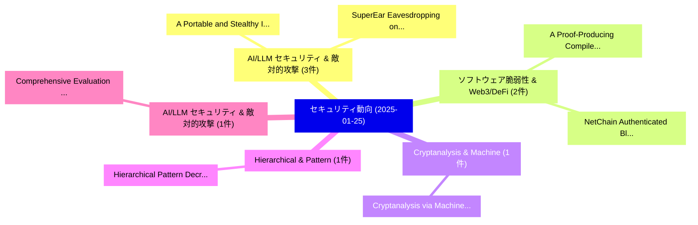

# 📅 02_daily: 日次エグゼクティブサマリー報告書 (2025-01-25)

**集計日時**: 2026-10-02 23:05:15 UTC  
**対象日付**: 2025-01-25  
**本日収集論文数**: 12 件  

---

## 💡 主要セキュリティ動向・脅威インサイト (Executive Insights)

本日の収集論文（計 12 件）において、以下の重点セキュリティ領域で活発な研究動向が確認されました：
- **AI/LLM セキュリティ & 敵対的攻撃** (3 件): 注目論文として 「A Portable and Stealthy Inaudi...」、「SuperEar: Eavesdropping on Mob...」 等が発表され、実務防御および攻撃検証の進展が見られます。
- **ソフトウェア脆弱性 & Web3/DeFi** (2 件): 注目論文として 「A Proof-Producing Compiler for...」、「NetChain: Authenticated Blockc...」 等が発表され、実務防御および攻撃検証の進展が見られます。
- **Cryptanalysis & Machine** (1 件): 注目論文として 「Cryptanalysis via Machine Lear...」 等が発表され、実務防御および攻撃検証の進展が見られます。
- **Hierarchical & Pattern** (1 件): 注目論文として 「Hierarchical Pattern Decryptio...」 等が発表され、実務防御および攻撃検証の進展が見られます。
- **AI/LLM セキュリティ & 敵対的攻撃** (1 件): 注目論文として 「Comprehensive Evaluation of Cl...」 等が発表され、実務防御および攻撃検証の進展が見られます。

### 🗺️ 技術・脅威トピックマインドマップ

---

## 📌 日次セキュリティ論文一覧 (日本語表形式)

| No | arXiv ID | 論文タイトル (日本語訳) | 重要キーワード | 構造化エグゼクティブ要約 (背景・提案・影響) | 脅威分類 | 詳細リンク |
|---|---|---|---|---|---|---|
| 1 | `2501.15002v1` | [A Proof-Producing Compiler for Blockchain Applications（セキュリティ分析論文）](../../okf/papers/2025-01-25/2501.15002.md) | `Producing Compiler`, `Blockchain Applications`, `Proof-Producing Compiler` | 【提案】概要 (Overview & Key Finding) 本論文「A Proof-Producing Compiler for Blockchain Applications（...。実証評価により経営層・セキュリティ管理者向け推奨アクション (E... | `cs.CR` | [arXiv](https://arxiv.org/abs/2501.15002v1) &#124; [OKF](../../okf/papers/2025-01-25/2501.15002.md) |
| 2 | `2501.15031v2` | [A Portable and Stealthy Inaudible Voice Attack Based on Acoustic Metamaterials（セキュリティ分析論文）](../../okf/papers/2025-01-25/2501.15031.md) | `Stealthy Inaudible Voice Attack Based`, `Acoustic Metamaterials`, `Zhiyuan Ning` | 【提案】概要 (Overview & Key Finding) 本論文「A Portable and Stealthy Inaudible Voice Attack Based on...。実証評価により経営層・セキュリティ管理者向け推奨アクション (E... | `cs.CR` | [arXiv](https://arxiv.org/abs/2501.15031v2) &#124; [OKF](../../okf/papers/2025-01-25/2501.15031.md) |
| 3 | `2501.15032v2` | [SuperEar: Eavesdropping on Mobile Voice Calls via Stealthy Acoustic Metamaterials（セキュリティ分析論文）](../../okf/papers/2025-01-25/2501.15032.md) | `Mobile Voice Calls`, `Stealthy Acoustic Metamaterials`, `Zhiyuan Ning` | 【提案】概要 (Overview & Key Finding) 本論文「SuperEar: Eavesdropping on Mobile Voice Calls via Steal...。実証評価により経営層・セキュリティ管理者向け推奨アクション (E... | `cs.CR` | [arXiv](https://arxiv.org/abs/2501.15032v2) &#124; [OKF](../../okf/papers/2025-01-25/2501.15032.md) |
| 4 | `2501.15076v1` | [Cryptanalysis via Machine Learning Based Information Theoretic Metrics（セキュリティ分析論文）](../../okf/papers/2025-01-25/2501.15076.md) | `Machine Learning Based Information Theoretic Metrics`, `Machine Learning Based Information Theoretic Metric`, `Vipindev Adat Vasudevan` | 【提案】概要 (Overview & Key Finding) 本論文「Cryptanalysis via Machine Learning Based Information Th...。実証評価によりKim, Vipindev Ada。 | `cs.CR` | [arXiv](https://arxiv.org/abs/2501.15076v1) &#124; [OKF](../../okf/papers/2025-01-25/2501.15076.md) |
| 5 | `2501.15077v1` | [NetChain: Authenticated Blockchain Top-k Graph Data Queries and its Application in Asset Management（セキュリティ分析論文）](../../okf/papers/2025-01-25/2501.15077.md) | `Authenticated Blockchain Top`, `Graph Data Queries`, `Top-k Graph` | 【提案】概要 (Overview & Key Finding) 本論文「NetChain: Authenticated Blockchain Top-k Graph Data Que...。実証評価により経営層・セキュリティ管理者向け推奨アクション (E... | `cs.CR` | [arXiv](https://arxiv.org/abs/2501.15077v1) &#124; [OKF](../../okf/papers/2025-01-25/2501.15077.md) |
| 6 | `2501.15084v2` | [Hierarchical Pattern Decryption Methodology for Ransomware Detection Using Probabilistic Cryptographic Footprints（セキュリティ分析論文）](../../okf/papers/2025-01-25/2501.15084.md) | `Ransomware Detection Using Probabilistic Cryptographic Footprints`, `Hierarchical Pattern Decryption Methodology`, `Kevin Pekepok` | 【提案】概要 (Overview & Key Finding) 本論文「Hierarchical Pattern Decryption Methodology for ランサムウェア...。実証評価により経営層・セキュリティ管理者向け推奨アクション (E... | `cs.CR` | [arXiv](https://arxiv.org/abs/2501.15084v2) &#124; [OKF](../../okf/papers/2025-01-25/2501.15084.md) |
| 7 | `2501.15101v1` | [Comprehensive Evaluation of Cloaking Backdoor Attacks on Object Detector in Real-World（セキュリティ分析論文）](../../okf/papers/2025-01-25/2501.15101.md) | `Cloaking Backdoor Attacks`, `Object Detector`, `Cloaking Backdoor Attac` | 【提案】概要 (Overview & Key Finding) 本論文「Comprehensive Evaluation of Cloaking Backdoor Attacks o...。実証評価により経営層・セキュリティ管理者向け推奨アクション (E... | `cs.CR` | [arXiv](https://arxiv.org/abs/2501.15101v1) &#124; [OKF](../../okf/papers/2025-01-25/2501.15101.md) |
| 8 | `2501.15145v2` | [PromptShield: Deployable Detection for Prompt Injection Attacks（セキュリティ分析論文）](../../okf/papers/2025-01-25/2501.15145.md) | `Prompt Injection Attacks`, `Deployable Detection`, `Dennis Jacob` | 【提案】概要 (Overview & Key Finding) 本論文「PromptShield: Deployable Detection for プロンプトインジェクション At...。実証評価により経営層・セキュリティ管理者向け推奨アクション (E... | `cs.CR` | [arXiv](https://arxiv.org/abs/2501.15145v2) &#124; [OKF](../../okf/papers/2025-01-25/2501.15145.md) |
| 9 | `2501.15269v1` | [Mirage in the Eyes: Hallucination Attack on Multi-modal 大規模言語モデル with Only Attention Sink](../../okf/papers/2025-01-25/2501.15269.md) | `Hallucination Attack`, `Large Language Models`, `Multi-modal Large` | 【提案】概要 (Overview & Key Finding) 本論文「Mirage in the Eyes: Hallucination Attack on Multi-modal...。実証評価により経営層・セキュリティ管理者向け推奨アクション (E... | `cs.CR` | [arXiv](https://arxiv.org/abs/2501.15269v1) &#124; [OKF](../../okf/papers/2025-01-25/2501.15269.md) |
| 10 | `2501.15288v1` | [A Two-Stage CAE-Based 連合学習 Framework for Efficient Jamming Detection in 5G Networks](../../okf/papers/2025-01-25/2501.15288.md) | `Efficient Jamming Detection`, `Two-Stage CAE`, `Samhita Kuili` | 【提案】概要 (Overview & Key Finding) 本論文「A Two-Stage CAE-Based 連合学習 Framework for Efficient Jamm...。実証評価により経営層・セキュリティ管理者向け推奨アクション (E... | `cs.CR` | [arXiv](https://arxiv.org/abs/2501.15288v1) &#124; [OKF](../../okf/papers/2025-01-25/2501.15288.md) |
| 11 | `2501.15290v1` | [Advanced Real-Time Fraud Detection Using RAG-Based LLMs（セキュリティ分析論文）](../../okf/papers/2025-01-25/2501.15290.md) | `Time Fraud Detection Using`, `Advanced Real`, `Real-Time Fraud` | 【提案】概要 (Overview & Key Finding) 本論文「Advanced Real-Time Fraud Detection Using RAG-Based LLMs...。実証評価により経営層・セキュリティ管理者向け推奨アクション (E... | `cs.CR` | [arXiv](https://arxiv.org/abs/2501.15290v1) &#124; [OKF](../../okf/papers/2025-01-25/2501.15290.md) |
| 12 | `2501.15313v2` | [I Know What You Did Last Summer: Identifying VR User Activity Through VR Network Traffic（セキュリティ分析論文）](../../okf/papers/2025-01-25/2501.15313.md) | `Network Traffic`, `Sheikh Samit Muhaimin`, `Spyridon Mastorakis` | 【提案】概要 (Overview & Key Finding) 本論文「I Know What You Did Last Summer: Identifying VR User Ac...。実証評価により経営層・セキュリティ管理者向け推奨アクション (E... | `cs.CR` | [arXiv](https://arxiv.org/abs/2501.15313v2) &#124; [OKF](../../okf/papers/2025-01-25/2501.15313.md) |

