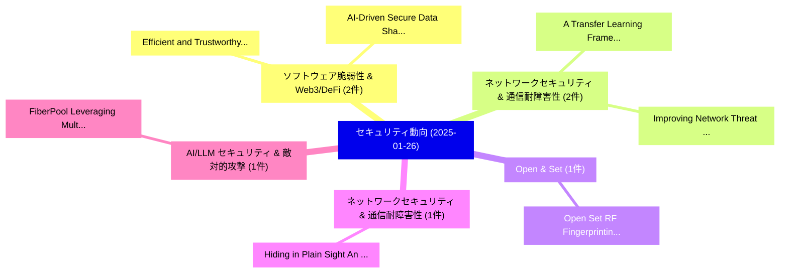

# 📅 02_daily: 日次エグゼクティブサマリー報告書 (2025-01-26)

**集計日時**: 2026-10-02 23:05:15 UTC  
**対象日付**: 2025-01-26  
**本日収集論文数**: 14 件  

---

## 💡 主要セキュリティ動向・脅威インサイト (Executive Insights)

本日の収集論文（計 14 件）において、以下の重点セキュリティ領域で活発な研究動向が確認されました：
- **ソフトウェア脆弱性 & Web3/DeFi** (2 件): 注目論文として 「AI-Driven Secure Data Sharing:...」、「Efficient and Trustworthy Bloc...」 等が発表され、実務防御および攻撃検証の進展が見られます。
- **ネットワークセキュリティ & 通信耐障害性** (2 件): 注目論文として 「A Transfer Learning Framework ...」、「Improving Network Threat Detec...」 等が発表され、実務防御および攻撃検証の進展が見られます。
- **Open & Set** (1 件): 注目論文として 「Open Set RF Fingerprinting Ide...」 等が発表され、実務防御および攻撃検証の進展が見られます。
- **ネットワークセキュリティ & 通信耐障害性** (1 件): 注目論文として 「Hiding in Plain Sight: An IoT ...」 等が発表され、実務防御および攻撃検証の進展が見られます。
- **AI/LLM セキュリティ & 敵対的攻撃** (1 件): 注目論文として 「FiberPool: Leveraging Multiple...」 等が発表され、実務防御および攻撃検証の進展が見られます。

### 🗺️ 技術・脅威トピックマインドマップ

---

## 📌 日次セキュリティ論文一覧 (日本語表形式)

| No | arXiv ID | 論文タイトル (日本語訳) | 重要キーワード | 構造化エグゼクティブ要約 (背景・提案・影響) | 脅威分類 | 詳細リンク |
|---|---|---|---|---|---|---|
| 1 | `2501.15363v1` | [AI-Driven Secure Data Sharing: A Trustworthy and Privacy-Preserving Approach（セキュリティ分析論文）](../../okf/papers/2025-01-26/2501.15363.md) | `Driven Secure Data Sharing`, `AI-Driven Secure`, `Al Amin` | 【提案】概要 (Overview & Key Finding) 本論文「AI-Driven Secure Data Sharing: A Trustworthy and Privac...。実証評価により経営層・セキュリティ管理者向け推奨アクション (E... | `cs.CR` | [arXiv](https://arxiv.org/abs/2501.15363v1) &#124; [OKF](../../okf/papers/2025-01-26/2501.15363.md) |
| 2 | `2501.15365v1` | [A Transfer Learning Framework for Anomaly Detection in Multivariate IoT Traffic Data（セキュリティ分析論文）](../../okf/papers/2025-01-26/2501.15365.md) | `Anomaly Detection`, `Traffic Data`, `Mahshid Rezakhani` | 【提案】概要 (Overview & Key Finding) 本論文「A Transfer Learning Framework for Anomaly Detection in ...。実証評価により経営層・セキュリティ管理者向け推奨アクション (E... | `cs.CR` | [arXiv](https://arxiv.org/abs/2501.15365v1) &#124; [OKF](../../okf/papers/2025-01-26/2501.15365.md) |
| 3 | `2501.15391v1` | [Open Set RF Fingerprinting Identification: A Joint Prediction and Siamese Comparison Framework（セキュリティ分析論文）](../../okf/papers/2025-01-26/2501.15391.md) | `Open Set`, `Fingerprinting Identification`, `Joint Prediction` | 【提案】概要 (Overview & Key Finding) 本論文「Open Set RF Fingerprinting Identification: A Joint Pred...。実証評価により経営層・セキュリティ管理者向け推奨アクション (E... | `cs.CR` | [arXiv](https://arxiv.org/abs/2501.15391v1) &#124; [OKF](../../okf/papers/2025-01-26/2501.15391.md) |
| 4 | `2501.15395v1` | [Hiding in Plain Sight: An IoT Traffic Camouflage Framework for Enhanced Privacy（セキュリティ分析論文）](../../okf/papers/2025-01-26/2501.15395.md) | `Plain Sight`, `Enhanced Privacy`, `Daniel Adu Worae` | 【提案】概要 (Overview & Key Finding) 本論文「Hiding in Plain Sight: An IoT Traffic Camouflage Framew...。実証評価により経営層・セキュリティ管理者向け推奨アクション (E... | `cs.CR` | [arXiv](https://arxiv.org/abs/2501.15395v1) &#124; [OKF](../../okf/papers/2025-01-26/2501.15395.md) |
| 5 | `2501.15459v1` | [FiberPool: Leveraging Multiple Blockchains for Decentralized Pooled Mining（セキュリティ分析論文）](../../okf/papers/2025-01-26/2501.15459.md) | `Leveraging Multiple Blockchains`, `Decentralized Pooled Mining`, `Akira Sakurai` | 【提案】概要 (Overview & Key Finding) 本論文「FiberPool: Leveraging Multiple Blockchains for Decentra...。実証評価により経営層・セキュリティ管理者向け推奨アクション (E... | `cs.CR` | [arXiv](https://arxiv.org/abs/2501.15459v1) &#124; [OKF](../../okf/papers/2025-01-26/2501.15459.md) |
| 6 | `2501.15468v2` | [Low-altitude UAV Friendly-Jamming for Satellite-Maritime Communications via Generative AI-enabled Deep Reinforcement Learning（セキュリティ分析論文）](../../okf/papers/2025-01-26/2501.15468.md) | `Deep Reinforcement Learning`, `Maritime Communications`, `Low-altitude UAV` | 【提案】概要 (Overview & Key Finding) 本論文「Low-altitude UAV Friendly-Jamming for Satellite-Maritim...。実証評価により経営層・セキュリティ管理者向け推奨アクション (E... | `cs.CR` | [arXiv](https://arxiv.org/abs/2501.15468v2) &#124; [OKF](../../okf/papers/2025-01-26/2501.15468.md) |
| 7 | `2501.15478v1` | [LoRAGuard: An Effective Black-box Watermarking Approach for LoRAs（セキュリティ分析論文）](../../okf/papers/2025-01-26/2501.15478.md) | `Black-box Watermarking`, `Peizhuo Lv`, `Yiran Xiahou` | 【提案】概要 (Overview & Key Finding) 本論文「LoRAGuard: An Effective Black-box Watermarking Approach...。実証評価により経営層・セキュリティ管理者向け推奨アクション (E... | `cs.CR` | [arXiv](https://arxiv.org/abs/2501.15478v1) &#124; [OKF](../../okf/papers/2025-01-26/2501.15478.md) |
| 8 | `2501.15509v5` | [FIT-Print: False-claim-resistant Model Ownership Verification via Targeted Fingerprintに向けて](../../okf/papers/2025-01-26/2501.15509.md) | `Model Ownership Verification`, `Towards False`, `Targeted Fingerprint` | 【提案】概要 (Overview & Key Finding) 本論文「FIT-Print: False-claim-resistant Model Ownership Verifi...。実証評価により経営層・セキュリティ管理者向け推奨アクション (E... | `cs.CR` | [arXiv](https://arxiv.org/abs/2501.15509v5) &#124; [OKF](../../okf/papers/2025-01-26/2501.15509.md) |
| 9 | `2501.15529v1` | [UNIDOOR: A Universal Framework for Action-Level Backdoor Attacks in Deep Reinforcement Learning（セキュリティ分析論文）](../../okf/papers/2025-01-26/2501.15529.md) | `Level Backdoor Attacks`, `Deep Reinforcement Learning`, `Action-Level Backdoor` | 【提案】概要 (Overview & Key Finding) 本論文「UNIDOOR: A Universal Framework for Action-Level Backdoo...。実証評価により経営層・セキュリティ管理者向け推奨アクション (E... | `cs.CR` | [arXiv](https://arxiv.org/abs/2501.15529v1) &#124; [OKF](../../okf/papers/2025-01-26/2501.15529.md) |
| 10 | `2501.15553v1` | [Real-CATS: A Practical Training Ground for Emerging Research on Cryptocurrency Cybercrime Detection（セキュリティ分析論文）](../../okf/papers/2025-01-26/2501.15553.md) | `Practical Training Ground`, `Cryptocurrency Cybercrime Detection`, `Emerging Research` | 【提案】概要 (Overview & Key Finding) 本論文「Real-CATS: A Practical Training Ground for Emerging Res...。実証評価により経営層・セキュリティ管理者向け推奨アクション (E... | `cs.CR` | [arXiv](https://arxiv.org/abs/2501.15553v1) &#124; [OKF](../../okf/papers/2025-01-26/2501.15553.md) |
| 11 | `2501.15563v2` | [PCAP-Backdoor: Backdoor Poisoning Generator for Network Traffic in CPS/IoT Environments（セキュリティ分析論文）](../../okf/papers/2025-01-26/2501.15563.md) | `Backdoor Poisoning Generator`, `Network Traffic`, `Ajesh Koyatan Chathoth` | 【提案】概要 (Overview & Key Finding) 本論文「PCAP-Backdoor: Backdoor Poisoning Generator for Network...。実証評価により経営層・セキュリティ管理者向け推奨アクション (E... | `cs.CR` | [arXiv](https://arxiv.org/abs/2501.15563v2) &#124; [OKF](../../okf/papers/2025-01-26/2501.15563.md) |
| 12 | `2501.15578v1` | [A Complexity-Informed Approach to Optimise Cyber Defences（セキュリティ分析論文）](../../okf/papers/2025-01-26/2501.15578.md) | `Optimise Cyber Defences`, `Lampis Alevizos`, `Raw Meta` | 【提案】概要 (Overview & Key Finding) 本論文「A Complexity-Informed Approach to Optimise Cyber Defenc...。実証評価により経営層・セキュリティ管理者向け推奨アクション (E... | `cs.CR` | [arXiv](https://arxiv.org/abs/2501.15578v1) &#124; [OKF](../../okf/papers/2025-01-26/2501.15578.md) |
| 13 | `2501.16393v2` | [Improving Network Threat Detection by Knowledge Graph, Large Language Model, and Imbalanced Learning（セキュリティ分析論文）](../../okf/papers/2025-01-26/2501.16393.md) | `Improving Network Threat Detection`, `Large Language Model`, `Knowledge Graph` | 【提案】概要 (Overview & Key Finding) 本論文「Improving Network 脅威 Detection by Knowledge Graph, Larg...。実証評価により経営層・セキュリティ管理者向け推奨アクション (E... | `cs.CR` | [arXiv](https://arxiv.org/abs/2501.16393v2) &#124; [OKF](../../okf/papers/2025-01-26/2501.16393.md) |
| 14 | `2502.09624v1` | [Efficient and Trustworthy Block Propagation for Blockchain-enabled Mobile Embodied AI Networks: A Graph Resfusion Approach（セキュリティ分析論文）](../../okf/papers/2025-01-26/2502.09624.md) | `Trustworthy Block Propagation`, `Mobile Embodied`, `Blockchain-enabled Mobile` | 【提案】概要 (Overview & Key Finding) 本論文「Efficient and Trustworthy Block Propagation for Blockch...。実証評価により経営層・セキュリティ管理者向け推奨アクション (E... | `cs.CR` | [arXiv](https://arxiv.org/abs/2502.09624v1) &#124; [OKF](../../okf/papers/2025-01-26/2502.09624.md) |

