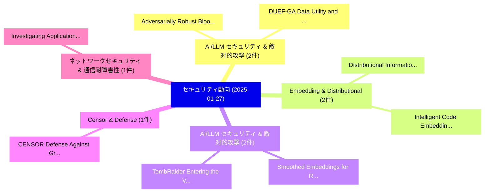

# 📅 02_daily: 日次エグゼクティブサマリー報告書 (2025-01-27)

**集計日時**: 2026-10-02 23:05:15 UTC  
**対象日付**: 2025-01-27  
**本日収集論文数**: 25 件  

---

## 💡 主要セキュリティ動向・脅威インサイト (Executive Insights)

本日の収集論文（計 25 件）において、以下の重点セキュリティ領域で活発な研究動向が確認されました：
- **AI/LLM セキュリティ & 敵対的攻撃** (2 件): 注目論文として 「Adversarially Robust Bloom Fil...」、「DUEF-GA: Data Utility and Priv...」 等が発表され、実務防御および攻撃検証の進展が見られます。
- **Embedding & Distributional** (2 件): 注目論文として 「Intelligent Code Embedding Fra...」、「Distributional Information Emb...」 等が発表され、実務防御および攻撃検証の進展が見られます。
- **AI/LLM セキュリティ & 敵対的攻撃** (2 件): 注目論文として 「Smoothed Embeddings for Robust...」、「TombRaider: Entering the Vault...」 等が発表され、実務防御および攻撃検証の進展が見られます。
- **Censor & Defense** (1 件): 注目論文として 「CENSOR: Defense Against Gradie...」 等が発表され、実務防御および攻撃検証の進展が見られます。
- **ネットワークセキュリティ & 通信耐障害性** (1 件): 注目論文として 「Investigating Application of D...」 等が発表され、実務防御および攻撃検証の進展が見られます。

### 🗺️ 技術・脅威トピックマインドマップ

---

## 📌 日次セキュリティ論文一覧 (日本語表形式)

| No | arXiv ID | 論文タイトル (日本語訳) | 重要キーワード | 構造化エグゼクティブ要約 (背景・提案・影響) | 脅威分類 | 詳細リンク |
|---|---|---|---|---|---|---|
| 1 | `2501.15718v1` | [CENSOR: Defense Against Gradient Inversion via Orthogonal Subspace Bayesian Sampling（セキュリティ分析論文）](../../okf/papers/2025-01-27/2501.15718.md) | `Orthogonal Subspace Bayesian Sampling`, `Kaiyuan Zhang`, `Siyuan Cheng` | 【提案】概要 (Overview & Key Finding) 本論文「CENSOR: Defense Against Gradient Inversion via Orthogon...。実証評価により経営層・セキュリティ管理者向け推奨アクション (E... | `cs.CR` | [arXiv](https://arxiv.org/abs/2501.15718v1) &#124; [OKF](../../okf/papers/2025-01-27/2501.15718.md) |
| 2 | `2501.15751v4` | [Adversarially Robust Bloom Filters: Privacy, Reductions, and Open Problems（セキュリティ分析論文）](../../okf/papers/2025-01-27/2501.15751.md) | `Adversarially Robust Bloom Filters`, `Open Problems`, `Hayder Tirmazi` | 【提案】概要 (Overview & Key Finding) 本論文「Adversarially Robust Bloom Filters: Privacy, Reductions...。実証評価により経営層・セキュリティ管理者向け推奨アクション (E... | `cs.CR` | [arXiv](https://arxiv.org/abs/2501.15751v4) &#124; [OKF](../../okf/papers/2025-01-27/2501.15751.md) |
| 3 | `2501.15760v1` | [Investigating Application of Deep Neural Networks in Intrusion Detection System Design（セキュリティ分析論文）](../../okf/papers/2025-01-27/2501.15760.md) | `Intrusion Detection System Design`, `Deep Neural Networks`, `Investigating Application` | 【提案】概要 (Overview & Key Finding) 本論文「Investigating Application of Deep Neural Networks in In...。実証評価により経営層・セキュリティ管理者向け推奨アクション (E... | `cs.CR` | [arXiv](https://arxiv.org/abs/2501.15760v1) &#124; [OKF](../../okf/papers/2025-01-27/2501.15760.md) |
| 4 | `2501.15836v2` | [Intelligent Code Embedding Framework for High-Precision Ransomware Detection via Multimodal Execution Path Analysis（セキュリティ分析論文）](../../okf/papers/2025-01-27/2501.15836.md) | `Precision Ransomware Detection`, `High-Precision Ransomware`, `Levi Gareth` | 【提案】概要 (Overview & Key Finding) 本論文「Intelligent Code Embedding Framework for High-Precision...。実証評価により経営層・セキュリティ管理者向け推奨アクション (E... | `cs.CR` | [arXiv](https://arxiv.org/abs/2501.15836v2) &#124; [OKF](../../okf/papers/2025-01-27/2501.15836.md) |
| 5 | `2501.15911v4` | [Web Execution Bundles: Reproducible, Accurate, and Archivable Web Measurements（セキュリティ分析論文）](../../okf/papers/2025-01-27/2501.15911.md) | `Web Execution Bundles`, `Archivable Web Measurements`, `Florian Hantke` | 【提案】概要 (Overview & Key Finding) 本論文「Web Execution Bundles: Reproducible, Accurate, and Arch...。実証評価により経営層・セキュリティ管理者向け推奨アクション (E... | `cs.CR` | [arXiv](https://arxiv.org/abs/2501.15911v4) &#124; [OKF](../../okf/papers/2025-01-27/2501.15911.md) |
| 6 | `2501.15975v1` | [Provisioning Time-Based Subscription in NDN: A Secure and Efficient Access Control Scheme（セキュリティ分析論文）](../../okf/papers/2025-01-27/2501.15975.md) | `Efficient Access Control Scheme`, `Provisioning Time`, `Based Subscription` | 【提案】概要 (Overview & Key Finding) 本論文「Provisioning Time-Based Subscription in NDN: A Secure a...。実証評価により経営層・セキュリティ管理者向け推奨アクション (E... | `cs.CR` | [arXiv](https://arxiv.org/abs/2501.15975v1) &#124; [OKF](../../okf/papers/2025-01-27/2501.15975.md) |
| 7 | `2501.16007v2` | [TOPLOC: A Locality Sensitive Hashing Scheme for Trustless Verifiable Inference（セキュリティ分析論文）](../../okf/papers/2025-01-27/2501.16007.md) | `Locality Sensitive Hashing Scheme`, `Trustless Verifiable Inference`, `Jack Min Ong` | 【提案】概要 (Overview & Key Finding) 本論文「TOPLOC: A Locality Sensitive Hashing Scheme for Trustle...。実証評価により経営層・セキュリティ管理者向け推奨アクション (E... | `cs.CR` | [arXiv](https://arxiv.org/abs/2501.16007v2) &#124; [OKF](../../okf/papers/2025-01-27/2501.16007.md) |
| 8 | `2501.16029v4` | [FDLLM: A Dedicated Detector for Black-Box LLMs Fingerprinting（セキュリティ分析論文）](../../okf/papers/2025-01-27/2501.16029.md) | `Dedicated Detector`, `Black-Box LLMs`, `Zhiyuan Fu` | 【提案】概要 (Overview & Key Finding) 本論文「FDLLM: A Dedicated Detector for Black-Box LLMs Fingerpr...。実証評価により経営層・セキュリティ管理者向け推奨アクション (E... | `cs.CR` | [arXiv](https://arxiv.org/abs/2501.16029v4) &#124; [OKF](../../okf/papers/2025-01-27/2501.16029.md) |
| 9 | `2501.16165v3` | [A Survey of Operating System Kernel Fuzzing（セキュリティ分析論文）](../../okf/papers/2025-01-27/2501.16165.md) | `Operating System Kernel Fuzzing`, `Jiacheng Xu`, `Shihao Jiang` | 【提案】概要 (Overview & Key Finding) 本論文「A Survey of Operating System Kernel Fuzzing（セキュリティ分析論文）...。実証評価により経営層・セキュリティ管理者向け推奨アクション (E... | `cs.CR` | [arXiv](https://arxiv.org/abs/2501.16165v3) &#124; [OKF](../../okf/papers/2025-01-27/2501.16165.md) |
| 10 | `2501.16184v1` | [Cryptographic Compression（セキュリティ分析論文）](../../okf/papers/2025-01-27/2501.16184.md) | `Cryptographic Compression`, `Joshua Cooper`, `Grant Fickes` | 【提案】概要 (Overview & Key Finding) 本論文「Cryptographic Compression（セキュリティ分析論文）」（原題: Cryptographi...。実証評価により経営層・セキュリティ管理者向け推奨アクション (E... | `cs.CR` | [arXiv](https://arxiv.org/abs/2501.16184v1) &#124; [OKF](../../okf/papers/2025-01-27/2501.16184.md) |
| 11 | `2501.16217v1` | [Evaluation of isolation design flow (IDF) for Single Chip Cryptography (SCC) application（セキュリティ分析論文）](../../okf/papers/2025-01-27/2501.16217.md) | `Single Chip Cryptography`, `Arsalan Ali Malik`, `Raw Meta` | 【提案】概要 (Overview & Key Finding) 本論文「Evaluation of isolation design flow (IDF) for Single Ch...。実証評価により経営層・セキュリティ管理者向け推奨アクション (E... | `cs.CR` | [arXiv](https://arxiv.org/abs/2501.16217v1) &#124; [OKF](../../okf/papers/2025-01-27/2501.16217.md) |
| 12 | `2501.16451v2` | [Emulating OP_RAND in Bitcoin（セキュリティ分析論文）](../../okf/papers/2025-01-27/2501.16451.md) | `Oleksandr Kurbatov`, `Raw Meta`, `Executive Summary` | 【提案】概要 (Overview & Key Finding) 本論文「Emulating OP_RAND in Bitcoin（セキュリティ分析論文）」（原題: Emulating...。実証評価により経営層・セキュリティ管理者向け推奨アクション (E... | `cs.CR` | [arXiv](https://arxiv.org/abs/2501.16451v2) &#124; [OKF](../../okf/papers/2025-01-27/2501.16451.md) |
| 13 | `2501.16466v4` | [Incalmo: An Autonomous LLM-assisted System for Red Teaming Multi-Host Networks（セキュリティ分析論文）](../../okf/papers/2025-01-27/2501.16466.md) | `Red Teaming Multi`, `LLM-assisted System`, `Host Networks` | 【提案】概要 (Overview & Key Finding) 本論文「Incalmo: An Autonomous LLM-assisted System for Red Team...。実証評価により経営層・セキュリティ管理者向け推奨アクション (E... | `cs.CR` | [arXiv](https://arxiv.org/abs/2501.16466v4) &#124; [OKF](../../okf/papers/2025-01-27/2501.16466.md) |
| 14 | `2501.16490v2` | [Robust Stability Prediction in Smart Grids: GAN-based Approach under Data Constraints and Adversarial Challengesに向けて](../../okf/papers/2025-01-27/2501.16490.md) | `Smart Grids`, `Data Constraints`, `Towards Robust Stability Prediction` | 【提案】概要 (Overview & Key Finding) 本論文「Robust Stability Prediction in Smart Grids: GAN-based A...。実証評価により経営層・セキュリティ管理者向け推奨アクション (E... | `cs.CR` | [arXiv](https://arxiv.org/abs/2501.16490v2) &#124; [OKF](../../okf/papers/2025-01-27/2501.16490.md) |
| 15 | `2501.16497v1` | [Smoothed Embeddings for Robust Language Models（セキュリティ分析論文）](../../okf/papers/2025-01-27/2501.16497.md) | `Robust Language Models`, `Smoothed Embeddings`, `Md Rafi Ur Rashid` | 【提案】概要 (Overview & Key Finding) 本論文「Smoothed Embeddings for Robust Language Models（セキュリティ分析...。実証評価により経営層・セキュリティ管理者向け推奨アクション (E... | `cs.CR` | [arXiv](https://arxiv.org/abs/2501.16497v1) &#124; [OKF](../../okf/papers/2025-01-27/2501.16497.md) |
| 16 | `2501.16534v5` | [Targeting Alignment: Extracting Safety Classifiers of Aligned LLMs（セキュリティ分析論文）](../../okf/papers/2025-01-27/2501.16534.md) | `Extracting Safety Classifiers`, `Targeting Alignment`, `Charles Noirot Ferrand` | 【提案】概要 (Overview & Key Finding) 本論文「Targeting Alignment: Extracting Safety Classifiers of A...。実証評価により経営層・セキュリティ管理者向け推奨アクション (E... | `cs.CR` | [arXiv](https://arxiv.org/abs/2501.16534v5) &#124; [OKF](../../okf/papers/2025-01-27/2501.16534.md) |
| 17 | `2501.16558v2` | [Distributional Information Embedding: A Framework for Multi-bit Watermarking（セキュリティ分析論文）](../../okf/papers/2025-01-27/2501.16558.md) | `Distributional Information Embedding`, `Multi-bit Watermarking`, `Yepeng Liu` | 【提案】概要 (Overview & Key Finding) 本論文「Distributional Information Embedding: A Framework for M...。実証評価により経営層・セキュリティ管理者向け推奨アクション (E... | `cs.CR` | [arXiv](https://arxiv.org/abs/2501.16558v2) &#124; [OKF](../../okf/papers/2025-01-27/2501.16558.md) |
| 18 | `2501.18624v2` | [Membership Inference Attacks Against Vision-Language Models（セキュリティ分析論文）](../../okf/papers/2025-01-27/2501.18624.md) | `Language Models`, `Vision-Language Models`, `Yuke Hu` | 【提案】概要 (Overview & Key Finding) 本論文「Membership Inference Attacks Against Vision-Language Mo...。実証評価により経営層・セキュリティ管理者向け推奨アクション (E... | `cs.CR` | [arXiv](https://arxiv.org/abs/2501.18624v2) &#124; [OKF](../../okf/papers/2025-01-27/2501.18624.md) |
| 19 | `2501.18625v1` | [DUEF-GA: Data Utility and Privacy Evaluation Framework for Graph Anonymization（セキュリティ分析論文）](../../okf/papers/2025-01-27/2501.18625.md) | `Data Utility`, `Graph Anonymization`, `Jordi Casas` | 【提案】概要 (Overview & Key Finding) 本論文「DUEF-GA: Data Utility and Privacy Evaluation Framework ...。実証評価により経営層・セキュリティ管理者向け推奨アクション (E... | `cs.CR` | [arXiv](https://arxiv.org/abs/2501.18625v1) &#124; [OKF](../../okf/papers/2025-01-27/2501.18625.md) |
| 20 | `2501.18626v4` | [The TIP of the Iceberg: Revealing a Hidden Class of Task-in-Prompt LLMsに対する敵対的攻撃](../../okf/papers/2025-01-27/2501.18626.md) | `Hidden Class`, `Prompt Adversarial Attacks`, `Sergey Berezin` | 【提案】概要 (Overview & Key Finding) 本論文「The TIP of the Iceberg: Revealing a Hidden Class of Tas...。実証評価により経営層・セキュリティ管理者向け推奨アクション (E... | `cs.CR` | [arXiv](https://arxiv.org/abs/2501.18626v4) &#124; [OKF](../../okf/papers/2025-01-27/2501.18626.md) |
| 21 | `2501.18628v2` | [TombRaider: Entering the Vault of History to Jailbreak 大規模言語モデル](../../okf/papers/2025-01-27/2501.18628.md) | `Jailbreak Large Language Models`, `Junchen Ding`, `Jiahao Zhang` | 【提案】概要 (Overview & Key Finding) 本論文「TombRaider: Entering the Vault of History to ジェイルブレイク 大...。実証評価により経営層・セキュリティ管理者向け推奨アクション (E... | `cs.CR` | [arXiv](https://arxiv.org/abs/2501.18628v2) &#124; [OKF](../../okf/papers/2025-01-27/2501.18628.md) |
| 22 | `2501.18629v1` | [The Relationship Between Network Similarity and Transferability of Adversarial Attacks（セキュリティ分析論文）](../../okf/papers/2025-01-27/2501.18629.md) | `Adversarial Attacks`, `Gerrit Klause`, `Niklas Bunzel` | 【提案】概要 (Overview & Key Finding) 本論文「The Relationship Between Network Similarity and Transfe...。実証評価により経営層・セキュリティ管理者向け推奨アクション (E... | `cs.CR` | [arXiv](https://arxiv.org/abs/2501.18629v1) &#124; [OKF](../../okf/papers/2025-01-27/2501.18629.md) |
| 23 | `2501.18632v2` | [Safe AI Clinicians: A Comprehensive Study on Large Language Model Jailbreaking in Healthcareに向けて](../../okf/papers/2025-01-27/2501.18632.md) | `Large Language Model Jailbreaking`, `Towards Safe`, `Hang Zhang` | 【提案】概要 (Overview & Key Finding) 本論文「Safe AI Clinicians: A Comprehensive Study on Large Lang...。実証評価により経営層・セキュリティ管理者向け推奨アクション (E... | `cs.CR` | [arXiv](https://arxiv.org/abs/2501.18632v2) &#124; [OKF](../../okf/papers/2025-01-27/2501.18632.md) |
| 24 | `2502.15720v1` | [Training AI to be Loyal（セキュリティ分析論文）](../../okf/papers/2025-01-27/2502.15720.md) | `Sewoong Oh`, `Himanshu Tyagi`, `Pramod Viswanath` | 【提案】概要 (Overview & Key Finding) 本論文「Training AI to be Loyal（セキュリティ分析論文）」（原題: Training AI to...。実証評価により経営層・セキュリティ管理者向け推奨アクション (E... | `cs.CR` | [arXiv](https://arxiv.org/abs/2502.15720v1) &#124; [OKF](../../okf/papers/2025-01-27/2502.15720.md) |
| 25 | `2503.15508v1` | [Assessing Human Intelligence Augmentation Strategies Using Brain Machine Interfaces and Brain Organoids in the Era of AI Advancement（セキュリティ分析論文）](../../okf/papers/2025-01-27/2503.15508.md) | `Assessing Human Intelligence Augmentation Strategies Using Brain Machine Interfaces`, `Brain Organoids`, `Kenta Kitamura` | 【提案】概要 (Overview & Key Finding) 本論文「Assessing Human Intelligence Augmentation Strategies Us...。実証評価により経営層・セキュリティ管理者向け推奨アクション (E... | `cs.CR` | [arXiv](https://arxiv.org/abs/2503.15508v1) &#124; [OKF](../../okf/papers/2025-01-27/2503.15508.md) |

