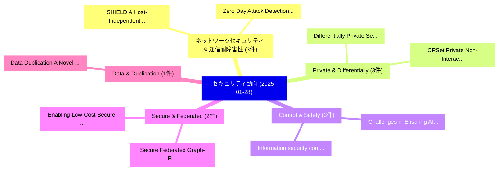

# 📅 02_daily: 日次エグゼクティブサマリー報告書 (2025-01-28)

**集計日時**: 2026-10-02 23:05:15 UTC  
**対象日付**: 2025-01-28  
**本日収集論文数**: 28 件  

---

## 💡 主要セキュリティ動向・脅威インサイト (Executive Insights)

本日の収集論文（計 28 件）において、以下の重点セキュリティ領域で活発な研究動向が確認されました：
- **ネットワークセキュリティ & 通信耐障害性** (3 件): 注目論文として 「SHIELD: A Host-Independent Fra...」、「Zero Day Attack Detection Usin...」 等が発表され、実務防御および攻撃検証の進展が見られます。
- **Private & Differentially** (3 件): 注目論文として 「Differentially Private Set Rep...」、「CRSet: Private Non-Interactive...」 等が発表され、実務防御および攻撃検証の進展が見られます。
- **Control & Safety** (3 件): 注目論文として 「Information security control a...」、「Challenges in Ensuring AI Safe...」 等が発表され、実務防御および攻撃検証の進展が見られます。
- **Secure & Federated** (2 件): 注目論文として 「Secure Federated Graph-Filteri...」、「Enabling Low-Cost Secure Compu...」 等が発表され、実務防御および攻撃検証の進展が見られます。
- **Data & Duplication** (1 件): 注目論文として 「Data Duplication: A Novel Mult...」 等が発表され、実務防御および攻撃検証の進展が見られます。

### 🗺️ 技術・脅威トピックマインドマップ

---

## 📌 日次セキュリティ論文一覧 (日本語表形式)

| No | arXiv ID | 論文タイトル (日本語訳) | 重要キーワード | 構造化エグゼクティブ要約 (背景・提案・影響) | 脅威分類 | 詳細リンク |
|---|---|---|---|---|---|---|
| 1 | `2501.16619v3` | [SHIELD: A Host-Independent Framework for Ransomware Detection using Deep Filesystem Features（セキュリティ分析論文）](../../okf/papers/2025-01-28/2501.16619.md) | `Deep Filesystem Features`, `Ransomware Detection`, `Venkata Sai Charan Putrevu` | 【提案】概要 (Overview & Key Finding) 本論文「SHIELD: A Host-Independent Framework for ランサムウェア Detect...。実証評価により経営層・セキュリティ管理者向け推奨アクション (E... | `cs.CR` | [arXiv](https://arxiv.org/abs/2501.16619v3) &#124; [OKF](../../okf/papers/2025-01-28/2501.16619.md) |
| 2 | `2501.16638v1` | [Zero Day Attack Detection Using MLP and XAIの分析](../../okf/papers/2025-01-28/2501.16638.md) | `Zero Day Attack Detection Using`, `Ashim Dahal`, `Prabin Bajgai` | 【提案】概要 (Overview & Key Finding) 本論文「Zero Day Attack Detection Using MLP and XAIの分析」（原題: Ana...。実証評価により経営層・セキュリティ管理者向け推奨アクション (E... | `cs.CR` | [arXiv](https://arxiv.org/abs/2501.16638v1) &#124; [OKF](../../okf/papers/2025-01-28/2501.16638.md) |
| 3 | `2501.16663v2` | [Data Duplication: A Novel Multi-Purpose Attack Paradigm in Machine Unlearning（セキュリティ分析論文）](../../okf/papers/2025-01-28/2501.16663.md) | `Purpose Attack Paradigm`, `Data Duplication`, `Multi-Purpose Attack` | 【提案】概要 (Overview & Key Finding) 本論文「Data Duplication: A Novel Multi-Purpose Attack Paradigm...。実証評価により経営層・セキュリティ管理者向け推奨アクション (E... | `cs.CR` | [arXiv](https://arxiv.org/abs/2501.16663v2) &#124; [OKF](../../okf/papers/2025-01-28/2501.16663.md) |
| 4 | `2501.16671v1` | [Data-Free Model-Related Attacks: Unleashing the Potential of Generative AI（セキュリティ分析論文）](../../okf/papers/2025-01-28/2501.16671.md) | `Free Model`, `Related Attacks`, `Data-Free Model` | 【提案】概要 (Overview & Key Finding) 本論文「Data-Free Model-Related Attacks: Unleashing the Potenti...。実証評価により経営層・セキュリティ管理者向け推奨アクション (E... | `cs.CR` | [arXiv](https://arxiv.org/abs/2501.16671v1) &#124; [OKF](../../okf/papers/2025-01-28/2501.16671.md) |
| 5 | `2501.16680v2` | [Differentially Private Set Representations（セキュリティ分析論文）](../../okf/papers/2025-01-28/2501.16680.md) | `Differentially Private Set Representations`, `Joon Young Seo`, `Sarvar Patel` | 【提案】概要 (Overview & Key Finding) 本論文「Differentially Private Set Representations（セキュリティ分析論文）」...。実証評価により経営層・セキュリティ管理者向け推奨アクション (E... | `cs.CR` | [arXiv](https://arxiv.org/abs/2501.16680v2) &#124; [OKF](../../okf/papers/2025-01-28/2501.16680.md) |
| 6 | `2501.16681v3` | [Blockchain Address Poisoning（セキュリティ分析論文）](../../okf/papers/2025-01-28/2501.16681.md) | `Blockchain Address Poisoning`, `Taro Tsuchiya`, `Dong Dong` | 【提案】概要 (Overview & Key Finding) 本論文「Blockchain Address Poisoning（セキュリティ分析論文）」（原題: Blockchai...。実証評価により経営層・セキュリティ管理者向け推奨アクション (E... | `cs.CR` | [arXiv](https://arxiv.org/abs/2501.16681v3) &#124; [OKF](../../okf/papers/2025-01-28/2501.16681.md) |
| 7 | `2501.16704v1` | [DFCon: Attention-Driven Supervised Contrastive Learning for Robust Deepfake Detection（セキュリティ分析論文）](../../okf/papers/2025-01-28/2501.16704.md) | `Driven Supervised Contrastive Learning`, `Robust Deepfake Detection`, `Attention-Driven Supervised` | 【提案】概要 (Overview & Key Finding) 本論文「DFCon: Attention-Driven Supervised Contrastive Learning...。実証評価により経営層・セキュリティ管理者向け推奨アクション (E... | `cs.CR` | [arXiv](https://arxiv.org/abs/2501.16704v1) &#124; [OKF](../../okf/papers/2025-01-28/2501.16704.md) |
| 8 | `2501.16732v1` | [Information security control as a task of control a dynamic system（セキュリティ分析論文）](../../okf/papers/2025-01-28/2501.16732.md) | `Sergey Masaev`, `Andrey Minkin`, `Yuri Bezborodov` | 【提案】概要 (Overview & Key Finding) 本論文「Information security control as a task of control a dyn...。実証評価により経営層・セキュリティ管理者向け推奨アクション (E... | `cs.CR` | [arXiv](https://arxiv.org/abs/2501.16732v1) &#124; [OKF](../../okf/papers/2025-01-28/2501.16732.md) |
| 9 | `2501.16750v1` | [HateBench: Hate Speech Detectors on LLM-Generated Content and Hate Campaignsのベンチマーク評価](../../okf/papers/2025-01-28/2501.16750.md) | `Generated Content`, `LLM-Generated Content`, `Benchmarking Hate Speech Detectors` | 【提案】概要 (Overview & Key Finding) 本論文「HateBench: Hate Speech Detectors on LLM-Generated Conte...。実証評価により経営層・セキュリティ管理者向け推奨アクション (E... | `cs.CR` | [arXiv](https://arxiv.org/abs/2501.16750v1) &#124; [OKF](../../okf/papers/2025-01-28/2501.16750.md) |
| 10 | `2501.16763v2` | [Utilizing Transaction Prioritization to Enhance Confirmation Speed in the IOTA Network（セキュリティ分析論文）](../../okf/papers/2025-01-28/2501.16763.md) | `Utilizing Transaction Prioritization`, `Enhance Confirmation Speed`, `Seyyed Ali Aghamiri` | 【提案】概要 (Overview & Key Finding) 本論文「Utilizing Transaction Prioritization to Enhance Confirm...。実証評価により経営層・セキュリティ管理者向け推奨アクション (E... | `cs.CR` | [arXiv](https://arxiv.org/abs/2501.16763v2) &#124; [OKF](../../okf/papers/2025-01-28/2501.16763.md) |
| 11 | `2501.16784v1` | [TORCHLIGHT: Shedding LIGHT on Real-World Attacks on Cloudless IoT Devices Concealed within the Tor Network（セキュリティ分析論文）](../../okf/papers/2025-01-28/2501.16784.md) | `World Attacks`, `Devices Concealed`, `Tor Network` | 【提案】概要 (Overview & Key Finding) 本論文「TORCHLIGHT: Shedding LIGHT on Real-World Attacks on Clo...。実証評価により経営層・セキュリティ管理者向け推奨アクション (E... | `cs.CR` | [arXiv](https://arxiv.org/abs/2501.16784v1) &#124; [OKF](../../okf/papers/2025-01-28/2501.16784.md) |
| 12 | `2501.16843v2` | [Bones of Contention: Exploring Query-Efficient Attacks against Skeleton Recognition Systems（セキュリティ分析論文）](../../okf/papers/2025-01-28/2501.16843.md) | `Skeleton Recognition Systems`, `Exploring Query`, `Efficient Attacks` | 【提案】概要 (Overview & Key Finding) 本論文「Bones of Contention: Exploring Query-Efficient Attacks ...。実証評価により経営層・セキュリティ管理者向け推奨アクション (E... | `cs.CR` | [arXiv](https://arxiv.org/abs/2501.16843v2) &#124; [OKF](../../okf/papers/2025-01-28/2501.16843.md) |
| 13 | `2501.16888v1` | [Secure Federated Graph-Filtering for Recommender Systems（セキュリティ分析論文）](../../okf/papers/2025-01-28/2501.16888.md) | `Secure Federated Graph`, `Recommender Systems`, `Sonia Ben Mokhtar` | 【提案】概要 (Overview & Key Finding) 本論文「Secure Federated Graph-Filtering for Recommender System...。実証評価により経営層・セキュリティ管理者向け推奨アクション (E... | `cs.CR` | [arXiv](https://arxiv.org/abs/2501.16888v1) &#124; [OKF](../../okf/papers/2025-01-28/2501.16888.md) |
| 14 | `2501.16948v3` | [Stack Overflow Meets Replication: Security Research Amid Evolving Code Snippets (Extended Version)（セキュリティ分析論文）](../../okf/papers/2025-01-28/2501.16948.md) | `Security Research Amid Evolving Code Snippets`, `Stack Overflow Meets Replication`, `Extended Version` | 【提案】概要 (Overview & Key Finding) 本論文「Stack Overflow Meets Replication: Security Research Ami...。実証評価により経営層・セキュリティ管理者向け推奨アクション (E... | `cs.CR` | [arXiv](https://arxiv.org/abs/2501.16948v3) &#124; [OKF](../../okf/papers/2025-01-28/2501.16948.md) |
| 15 | `2501.16962v2` | [UEFI Memory Forensics: A Framework for UEFI Threat Analysis（セキュリティ分析論文）](../../okf/papers/2025-01-28/2501.16962.md) | `Memory Forensics`, `Kalanit Suzan Segal`, `Hadar Cochavi Gorelik` | 【提案】概要 (Overview & Key Finding) 本論文「UEFI Memory Forensics: A Framework for UEFI 脅威 Analysis...。実証評価により経営層・セキュリティ管理者向け推奨アクション (E... | `cs.CR` | [arXiv](https://arxiv.org/abs/2501.16962v2) &#124; [OKF](../../okf/papers/2025-01-28/2501.16962.md) |
| 16 | `2501.16964v1` | [Few Edges Are Enough: Few-Shot Network Attack Detection with Graph Neural Networks（セキュリティ分析論文）](../../okf/papers/2025-01-28/2501.16964.md) | `Shot Network Attack Detection`, `Graph Neural Networks`, `Few-Shot Network` | 【提案】概要 (Overview & Key Finding) 本論文「Few Edges Are Enough: Few-Shot Network Attack Detection...。実証評価により経営層・セキュリティ管理者向け推奨アクション (E... | `cs.CR` | [arXiv](https://arxiv.org/abs/2501.16964v1) &#124; [OKF](../../okf/papers/2025-01-28/2501.16964.md) |
| 17 | `2501.17021v4` | [Network Oblivious Transfer via Noisy Channels: Limits and Capacities（セキュリティ分析論文）](../../okf/papers/2025-01-28/2501.17021.md) | `Network Oblivious Transfer`, `Noisy Channels`, `Hadi Aghaee` | 【提案】概要 (Overview & Key Finding) 本論文「Network Oblivious Transfer via Noisy Channels: Limits a...。実証評価により経営層・セキュリティ管理者向け推奨アクション (E... | `cs.CR` | [arXiv](https://arxiv.org/abs/2501.17021v4) &#124; [OKF](../../okf/papers/2025-01-28/2501.17021.md) |
| 18 | `2501.17030v1` | [Challenges in Ensuring AI Safety in DeepSeek-R1 Models: The Shortcomings of Reinforcement Learning Strategies（セキュリティ分析論文）](../../okf/papers/2025-01-28/2501.17030.md) | `Reinforcement Learning Strategies`, `R1 Models`, `DeepSeek-R1 Models` | 【提案】概要 (Overview & Key Finding) 本論文「Challenges in Ensuring AI Safety in DeepSeek-R1 Models:...。実証評価により経営層・セキュリティ管理者向け推奨アクション (E... | `cs.CR` | [arXiv](https://arxiv.org/abs/2501.17030v1) &#124; [OKF](../../okf/papers/2025-01-28/2501.17030.md) |
| 19 | `2501.17070v3` | [Contextual Agent Security: A Policy for Every Purpose（セキュリティ分析論文）](../../okf/papers/2025-01-28/2501.17070.md) | `Contextual Agent Security`, `Every Purpose`, `Lillian Tsai` | 【提案】概要 (Overview & Key Finding) 本論文「Contextual Agent Security: A Policy for Every Purpose（セ...。実証評価により経営層・セキュリティ管理者向け推奨アクション (E... | `cs.CR` | [arXiv](https://arxiv.org/abs/2501.17070v3) &#124; [OKF](../../okf/papers/2025-01-28/2501.17070.md) |
| 20 | `2501.17089v3` | [CRSet: Private Non-Interactive Verifiable Credential Revocation（セキュリティ分析論文）](../../okf/papers/2025-01-28/2501.17089.md) | `Interactive Verifiable Credential Revocation`, `Private Non`, `Non-Interactive Verifiable` | 【提案】概要 (Overview & Key Finding) 本論文「CRSet: Private Non-Interactive Verifiable Credential Re...。実証評価により経営層・セキュリティ管理者向け推奨アクション (E... | `cs.CR` | [arXiv](https://arxiv.org/abs/2501.17089v3) &#124; [OKF](../../okf/papers/2025-01-28/2501.17089.md) |
| 21 | `2501.17123v1` | [Hybrid Deep Learning Model for Multiple Cache Side Channel Attacks Detection: A Comparative Analysis（セキュリティ分析論文）](../../okf/papers/2025-01-28/2501.17123.md) | `Multiple Cache Side Channel Attacks Detection`, `Hybrid Deep Learning Model`, `Tejal Joshi` | 【提案】概要 (Overview & Key Finding) 本論文「Hybrid Deep Learning Model for Multiple Cache Side Chan...。実証評価により経営層・セキュリティ管理者向け推奨アクション (E... | `cs.CR` | [arXiv](https://arxiv.org/abs/2501.17123v1) &#124; [OKF](../../okf/papers/2025-01-28/2501.17123.md) |
| 22 | `2501.17124v1` | [The Asymptotic Capacity of Byzantine Symmetric Private Information Retrieval and Its Consequences（セキュリティ分析論文）](../../okf/papers/2025-01-28/2501.17124.md) | `Byzantine Symmetric Private Information Retrieval`, `Mohamed Nomeir`, `Alptug Aytekin` | 【提案】概要 (Overview & Key Finding) 本論文「The Asymptotic Capacity of Byzantine Symmetric Private ...。実証評価により経営層・セキュリティ管理者向け推奨アクション (E... | `cs.CR` | [arXiv](https://arxiv.org/abs/2501.17124v1) &#124; [OKF](../../okf/papers/2025-01-28/2501.17124.md) |
| 23 | `2501.17292v2` | [Enabling Low-Cost Secure Computing on Untrusted In-Memory Architectures（セキュリティ分析論文）](../../okf/papers/2025-01-28/2501.17292.md) | `Cost Secure Computing`, `Enabling Low`, `Memory Architectures` | 【提案】概要 (Overview & Key Finding) 本論文「Enabling Low-Cost Secure Computing on Untrusted In-Memo...。実証評価により経営層・セキュリティ管理者向け推奨アクション (E... | `cs.CR` | [arXiv](https://arxiv.org/abs/2501.17292v2) &#124; [OKF](../../okf/papers/2025-01-28/2501.17292.md) |
| 24 | `2501.17315v1` | [A sketch of an AI control safety case（セキュリティ分析論文）](../../okf/papers/2025-01-28/2501.17315.md) | `Tomek Korbak`, `Joshua Clymer`, `Benjamin Hilton` | 【提案】概要 (Overview & Key Finding) 本論文「A sketch of an AI control safety case（セキュリティ分析論文）」（原題: ...。実証評価により経営層・セキュリティ管理者向け推奨アクション (E... | `cs.CR` | [arXiv](https://arxiv.org/abs/2501.17315v1) &#124; [OKF](../../okf/papers/2025-01-28/2501.17315.md) |
| 25 | `2501.17335v2` | [Cross-Chain Arbitrage: The Next Frontier of MEV in Decentralized Finance（セキュリティ分析論文）](../../okf/papers/2025-01-28/2501.17335.md) | `Chain Arbitrage`, `Cross-Chain Arbitrage`, `Decentralized Finance` | 【提案】概要 (Overview & Key Finding) 本論文「Cross-Chain Arbitrage: The Next Frontier of MEV in Dece...。実証評価により経営層・セキュリティ管理者向け推奨アクション (E... | `cs.CR` | [arXiv](https://arxiv.org/abs/2501.17335v2) &#124; [OKF](../../okf/papers/2025-01-28/2501.17335.md) |
| 26 | `2501.18636v2` | [SafeRAG: Security in Retrieval-Augmented Generation of Large Language Modelのベンチマーク評価](../../okf/papers/2025-01-28/2501.18636.md) | `Augmented Generation`, `Retrieval-Augmented Generation`, `Large Language Model` | 【提案】概要 (Overview & Key Finding) 本論文「SafeRAG: Security in Retrieval-Augmented Generation of ...。実証評価により経営層・セキュリティ管理者向け推奨アクション (E... | `cs.CR` | [arXiv](https://arxiv.org/abs/2501.18636v2) &#124; [OKF](../../okf/papers/2025-01-28/2501.18636.md) |
| 27 | `2501.18638v3` | [Graph of Attacks with Pruning: Optimizing Stealthy Jailbreak Prompt Generation for Enhanced LLM Content Moderation（セキュリティ分析論文）](../../okf/papers/2025-01-28/2501.18638.md) | `Optimizing Stealthy Jailbreak Prompt Generation`, `Content Moderation`, `Daniel Schwartz` | 【提案】概要 (Overview & Key Finding) 本論文「Graph of Attacks with Pruning: Optimizing Stealthy ジェイル...。実証評価により経営層・セキュリティ管理者向け推奨アクション (E... | `cs.CR` | [arXiv](https://arxiv.org/abs/2501.18638v3) &#124; [OKF](../../okf/papers/2025-01-28/2501.18638.md) |
| 28 | `2502.20403v2` | [Adversarial Robustness of Partitioned Quantum Classifiers（セキュリティ分析論文）](../../okf/papers/2025-01-28/2502.20403.md) | `Partitioned Quantum Classifiers`, `Adversarial Robustness`, `Pouya Kananian` | 【提案】概要 (Overview & Key Finding) 本論文「Adversarial Robustness of Partitioned 量子 Classifiers（セキ...。実証評価により経営層・セキュリティ管理者向け推奨アクション (E... | `cs.CR` | [arXiv](https://arxiv.org/abs/2502.20403v2) &#124; [OKF](../../okf/papers/2025-01-28/2502.20403.md) |

