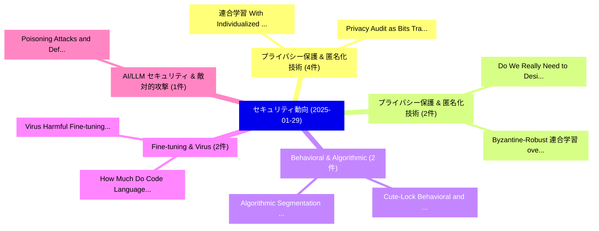

# 📅 02_daily: 日次エグゼクティブサマリー報告書 (2025-01-29)

**集計日時**: 2026-10-02 23:05:15 UTC  
**対象日付**: 2025-01-29  
**本日収集論文数**: 24 件  

---

## 💡 主要セキュリティ動向・脅威インサイト (Executive Insights)

本日の収集論文（計 24 件）において、以下の重点セキュリティ領域で活発な研究動向が確認されました：
- **プライバシー保護 & 匿名化技術** (4 件): 注目論文として 「連合学習 With Individualized Priva...」、「Privacy Audit as Bits Transmis...」 等が発表され、実務防御および攻撃検証の進展が見られます。
- **プライバシー保護 & 匿名化技術** (2 件): 注目論文として 「Do We Really Need to Design Ne...」、「Byzantine-Robust 連合学習 over Rin...」 等が発表され、実務防御および攻撃検証の進展が見られます。
- **Behavioral & Algorithmic** (2 件): 注目論文として 「Cute-Lock: Behavioral and Stru...」、「Algorithmic Segmentation and B...」 等が発表され、実務防御および攻撃検証の進展が見られます。
- **Fine-tuning & Virus** (2 件): 注目論文として 「Virus: Harmful Fine-tuning Att...」、「How Much Do Code Language Mode...」 等が発表され、実務防御および攻撃検証の進展が見られます。
- **AI/LLM セキュリティ & 敵対的攻撃** (1 件): 注目論文として 「Poisoning Attacks and Defenses...」 等が発表され、実務防御および攻撃検証の進展が見られます。

### 🗺️ 技術・脅威トピックマインドマップ

---

## 📌 日次セキュリティ論文一覧 (日本語表形式)

| No | arXiv ID | 論文タイトル (日本語訳) | 重要キーワード | 構造化エグゼクティブ要約 (背景・提案・影響) | 脅威分類 | 詳細リンク |
|---|---|---|---|---|---|---|
| 1 | `2501.17381v1` | [Do We Really Need to Design New Byzantine-robust Aggregation Rules?（セキュリティ分析論文）](../../okf/papers/2025-01-29/2501.17381.md) | `Design New Byzantine`, `Aggregation Rules`, `Byzantine-robust Aggregation` | 【提案】### (日本語題名: Do We Really Need to Design New Byzantine-robust Aggregation Rules?（セキュリティ分...。実証評価により経営層・セキュリティ管理者向け推奨アクション (E... | `cs.CR` | [arXiv](https://arxiv.org/abs/2501.17381v1) &#124; [OKF](../../okf/papers/2025-01-29/2501.17381.md) |
| 2 | `2501.17392v2` | [Byzantine-Robust 連合学習 over Ring-All-Reduce Distributed Computing](../../okf/papers/2025-01-29/2501.17392.md) | `Reduce Distributed Computing`, `Robust Federated Learning`, `Byzantine-Robust Federated` | 【提案】概要 (Overview & Key Finding) 本論文「Byzantine-Robust 連合学習 over Ring-All-Reduce Distributed ...。実証評価により# Byzantine-Robust Federa... | `cs.CR` | [arXiv](https://arxiv.org/abs/2501.17392v2) &#124; [OKF](../../okf/papers/2025-01-29/2501.17392.md) |
| 3 | `2501.17396v1` | [Poisoning Attacks and Defenses to Federated Unlearning（セキュリティ分析論文）](../../okf/papers/2025-01-29/2501.17396.md) | `Poisoning Attacks`, `Federated Unlearning`, `Wenbin Wang` | 【提案】概要 (Overview & Key Finding) 本論文「Poisoning Attacks and Defenses to Federated Unlearning（...。実証評価により経営層・セキュリティ管理者向け推奨アクション (E... | `cs.CR` | [arXiv](https://arxiv.org/abs/2501.17396v1) &#124; [OKF](../../okf/papers/2025-01-29/2501.17396.md) |
| 4 | `2501.17402v1` | [Cute-Lock: Behavioral and Structural Multi-Key Logic Locking Using Time Base Keys（セキュリティ分析論文）](../../okf/papers/2025-01-29/2501.17402.md) | `Key Logic Locking Using Time Base Keys`, `Structural Multi`, `Multi-Key Logic` | 【提案】概要 (Overview & Key Finding) 本論文「Cute-Lock: Behavioral and Structural Multi-Key Logic Lo...。実証評価により経営層・セキュリティ管理者向け推奨アクション (E... | `cs.CR` | [arXiv](https://arxiv.org/abs/2501.17402v1) &#124; [OKF](../../okf/papers/2025-01-29/2501.17402.md) |
| 5 | `2501.17405v1` | [When Everyday Devices Become Weapons: A Closer Look at the Pager and Walkie-talkie Attacks（セキュリティ分析論文）](../../okf/papers/2025-01-29/2501.17405.md) | `Closer Look`, `Walkie-talkie Attacks`, `Pantha Protim Sarker` | 【提案】概要 (Overview & Key Finding) 本論文「When Everyday Devices Become Weapons: A Closer Look at ...。実証評価により経営層・セキュリティ管理者向け推奨アクション (E... | `cs.CR` | [arXiv](https://arxiv.org/abs/2501.17405v1) &#124; [OKF](../../okf/papers/2025-01-29/2501.17405.md) |
| 6 | `2501.17413v1` | [Fine-Grained 1-Day 脆弱性検出 in Binaries via Patch Code Localization](../../okf/papers/2025-01-29/2501.17413.md) | `Patch Code Localization`, `Fine-Grained 1`, `Day Vulnerability Detection` | 【提案】概要 (Overview & Key Finding) 本論文「Fine-Grained 1-Day 脆弱性検出 in Binaries via Patch Code Loc...。実証評価により経営層・セキュリティ管理者向け推奨アクション (E... | `cs.CR` | [arXiv](https://arxiv.org/abs/2501.17413v1) &#124; [OKF](../../okf/papers/2025-01-29/2501.17413.md) |
| 7 | `2501.17429v2` | [Algorithmic Segmentation and Behavioral Profiling for Ransomware Detection Using Temporal-Correlation Graphs（セキュリティ分析論文）](../../okf/papers/2025-01-29/2501.17429.md) | `Ransomware Detection Using Temporal`, `Algorithmic Segmentation`, `Behavioral Profiling` | 【提案】概要 (Overview & Key Finding) 本論文「Algorithmic Segmentation and Behavioral Profiling for ラ...。実証評価により経営層・セキュリティ管理者向け推奨アクション (E... | `cs.CR` | [arXiv](https://arxiv.org/abs/2501.17429v2) &#124; [OKF](../../okf/papers/2025-01-29/2501.17429.md) |
| 8 | `2501.17433v1` | [Virus: Harmful Fine-tuning Attack for 大規模言語モデル Bypassing Guardrail Moderation](../../okf/papers/2025-01-29/2501.17433.md) | `Harmful Fine`, `Fine-tuning Attack`, `Large Language Models Bypassing Guardrail Moderation` | 【提案】概要 (Overview & Key Finding) 本論文「Virus: Harmful Fine-tuning Attack for 大規模言語モデル Bypassin...。実証評価により経営層・セキュリティ管理者向け推奨アクション (E... | `cs.CR` | [arXiv](https://arxiv.org/abs/2501.17433v1) &#124; [OKF](../../okf/papers/2025-01-29/2501.17433.md) |
| 9 | `2501.17501v2` | [How Much Do Code Language Models Remember? An Investigation on Data Extraction Attacks before and after Fine-tuning（セキュリティ分析論文）](../../okf/papers/2025-01-29/2501.17501.md) | `Data Extraction Attacks`, `Fabio Salerno`, `Ali Al` | 【提案】An Investigation on Data Extraction Attacks before and after Fine-tuning ### (日本語題名: Ho...。実証評価により経営層・セキュリティ管理者向け推奨アクション (E... | `cs.CR` | [arXiv](https://arxiv.org/abs/2501.17501v2) &#124; [OKF](../../okf/papers/2025-01-29/2501.17501.md) |
| 10 | `2501.17539v1` | [Supporting Penetration Testing Education with Large Language Models: an Evaluation and Comparisonに向けて](../../okf/papers/2025-01-29/2501.17539.md) | `Large Language Models`, `Supporting Penetration Testing Education`, `Towards Supporting Penetration Testing Education` | 【提案】概要 (Overview & Key Finding) 本論文「Supporting Penetration Testing Education with Large Lan...。実証評価により経営層・セキュリティ管理者向け推奨アクション (E... | `cs.CR` | [arXiv](https://arxiv.org/abs/2501.17539v1) &#124; [OKF](../../okf/papers/2025-01-29/2501.17539.md) |
| 11 | `2501.17548v1` | [Understanding Trust in Authentication Methods for Icelandic Digital Public Services（セキュリティ分析論文）](../../okf/papers/2025-01-29/2501.17548.md) | `Icelandic Digital Public Services`, `Understanding Trust`, `Authentication Methods` | 【提案】概要 (Overview & Key Finding) 本論文「Understanding Trust in Authentication Methods for Icela...。実証評価により経営層・セキュリティ管理者向け推奨アクション (E... | `cs.CR` | [arXiv](https://arxiv.org/abs/2501.17548v1) &#124; [OKF](../../okf/papers/2025-01-29/2501.17548.md) |
| 12 | `2501.17634v2` | [連合学習 With Individualized Privacy Through Client Sampling](../../okf/papers/2025-01-29/2501.17634.md) | `Lucas Lange`, `Ole Borchardt`, `Erhard Rahm` | 【提案】概要 (Overview & Key Finding) 本論文「連合学習 With Individualized Privacy Through Client Samplin...。実証評価により経営層・セキュリティ管理者向け推奨アクション (E... | `cs.CR` | [arXiv](https://arxiv.org/abs/2501.17634v2) &#124; [OKF](../../okf/papers/2025-01-29/2501.17634.md) |
| 13 | `2501.17667v2` | [CAMP in the Odyssey: Provably Robust Reinforcement Learning with Certified Radius Maximization（セキュリティ分析論文）](../../okf/papers/2025-01-29/2501.17667.md) | `Provably Robust Reinforcement Learning`, `Certified Radius Maximization`, `Derui Wang` | 【提案】概要 (Overview & Key Finding) 本論文「CAMP in the Odyssey: Provably Robust Reinforcement Lear...。実証評価により経営層・セキュリティ管理者向け推奨アクション (E... | `cs.CR` | [arXiv](https://arxiv.org/abs/2501.17667v2) &#124; [OKF](../../okf/papers/2025-01-29/2501.17667.md) |
| 14 | `2501.17733v1` | [BitMLx: Secure Cross-chain Smart Contracts For Bitcoin-style Cryptocurrencies（セキュリティ分析論文）](../../okf/papers/2025-01-29/2501.17733.md) | `Secure Cross`, `Cross-chain Smart`, `Bitcoin-style Cryptocurrencies` | 【提案】概要 (Overview & Key Finding) 本論文「BitMLx: Secure Cross-chain スマートコントラクトs For Bitcoin-styl...。実証評価により経営層・セキュリティ管理者向け推奨アクション (E... | `cs.CR` | [arXiv](https://arxiv.org/abs/2501.17733v1) &#124; [OKF](../../okf/papers/2025-01-29/2501.17733.md) |
| 15 | `2501.17740v2` | [Attacker Control and Bug Prioritization（セキュリティ分析論文）](../../okf/papers/2025-01-29/2501.17740.md) | `Attacker Control`, `Bug Prioritization`, `Guilhem Lacombe` | 【提案】概要 (Overview & Key Finding) 本論文「Attacker Control and Bug Prioritization（セキュリティ分析論文）」（原題...。実証評価により経営層・セキュリティ管理者向け推奨アクション (E... | `cs.CR` | [arXiv](https://arxiv.org/abs/2501.17740v2) &#124; [OKF](../../okf/papers/2025-01-29/2501.17740.md) |
| 16 | `2501.17748v1` | [Investigating Vulnerability Disclosures in Open-Source Software Using Bug Bounty Reports and Security Advisories（セキュリティ分析論文）](../../okf/papers/2025-01-29/2501.17748.md) | `Source Software Using Bug Bounty Reports`, `Investigating Vulnerability Disclosures`, `Security Advisories` | 【提案】概要 (Overview & Key Finding) 本論文「Investigating 脆弱性 Disclosures in Open-Source Software U...。実証評価により経営層・セキュリティ管理者向け推奨アクション (E... | `cs.CR` | [arXiv](https://arxiv.org/abs/2501.17748v1) &#124; [OKF](../../okf/papers/2025-01-29/2501.17748.md) |
| 17 | `2501.17750v1` | [Privacy Audit as Bits Transmission: (Im)possibilities for Audit by One Run（セキュリティ分析論文）](../../okf/papers/2025-01-29/2501.17750.md) | `Privacy Audit`, `Bits Transmission`, `One Run` | 【提案】概要 (Overview & Key Finding) 本論文「Privacy Audit as Bits Transmission: (Im)possibilities f...。実証評価により経営層・セキュリティ管理者向け推奨アクション (E... | `cs.CR` | [arXiv](https://arxiv.org/abs/2501.17750v1) &#124; [OKF](../../okf/papers/2025-01-29/2501.17750.md) |
| 18 | `2501.17760v1` | [Unraveling Log4Shell: Analyzing the Impact and Response to the Log4j Vulnerabil（セキュリティ分析論文）](../../okf/papers/2025-01-29/2501.17760.md) | `Log4j Vulnerabil`, `John Doll`, `Suman Bhunia` | 【提案】概要 (Overview & Key Finding) 本論文「Unraveling Log4Shell: Analyzing the Impact and Response...。実証評価により経営層・セキュリティ管理者向け推奨アクション (E... | `cs.CR` | [arXiv](https://arxiv.org/abs/2501.17760v1) &#124; [OKF](../../okf/papers/2025-01-29/2501.17760.md) |
| 19 | `2501.17762v3` | [Improving Privacy Benefits of Redaction（セキュリティ分析論文）](../../okf/papers/2025-01-29/2501.17762.md) | `Improving Privacy Benefits`, `Vaibhav Gusain`, `Douglas Leith` | 【提案】概要 (Overview & Key Finding) 本論文「Improving Privacy Benefits of Redaction（セキュリティ分析論文）」（原題...。実証評価により経営層・セキュリティ管理者向け推奨アクション (E... | `cs.CR` | [arXiv](https://arxiv.org/abs/2501.17762v3) &#124; [OKF](../../okf/papers/2025-01-29/2501.17762.md) |
| 20 | `2501.17786v1` | [Atomic Transfer Graphs: Secure-by-design Protocols for Heterogeneous Blockchain Ecosystems（セキュリティ分析論文）](../../okf/papers/2025-01-29/2501.17786.md) | `Atomic Transfer Graphs`, `Heterogeneous Blockchain Ecosystems`, `Federico Badaloni` | 【提案】概要 (Overview & Key Finding) 本論文「Atomic Transfer Graphs: Secure-by-design Protocols for ...。実証評価により経営層・セキュリティ管理者向け推奨アクション (E... | `cs.CR` | [arXiv](https://arxiv.org/abs/2501.17786v1) &#124; [OKF](../../okf/papers/2025-01-29/2501.17786.md) |
| 21 | `2501.17824v1` | [SMT-Boosted Security Types for Low-Level MPC（セキュリティ分析論文）](../../okf/papers/2025-01-29/2501.17824.md) | `Boosted Security Types`, `SMT-Boosted Security`, `Low-Level MPC` | 【提案】概要 (Overview & Key Finding) 本論文「SMT-Boosted Security Types for Low-Level MPC（セキュリティ分析論文...。実証評価によりNear - **公開日時**: `2025-01... | `cs.CR` | [arXiv](https://arxiv.org/abs/2501.17824v1) &#124; [OKF](../../okf/papers/2025-01-29/2501.17824.md) |
| 22 | `2501.17845v2` | [Private Information Retrieval on Multigraph-Based Replicated Storage（セキュリティ分析論文）](../../okf/papers/2025-01-29/2501.17845.md) | `Private Information Retrieval`, `Based Replicated Storage`, `Multigraph-Based Replicated` | 【提案】概要 (Overview & Key Finding) 本論文「Private Information Retrieval on Multigraph-Based Repli...。実証評価により経営層・セキュリティ管理者向け推奨アクション (E... | `cs.CR` | [arXiv](https://arxiv.org/abs/2501.17845v2) &#124; [OKF](../../okf/papers/2025-01-29/2501.17845.md) |
| 23 | `2501.17858v2` | [Improving Your Model Ranking on Chatbot Arena by Vote Rigging（セキュリティ分析論文）](../../okf/papers/2025-01-29/2501.17858.md) | `Chatbot Arena`, `Vote Rigging`, `Rui Min` | 【提案】概要 (Overview & Key Finding) 本論文「Improving Your Model Ranking on Chatbot Arena by Vote R...。実証評価により経営層・セキュリティ管理者向け推奨アクション (E... | `cs.CR` | [arXiv](https://arxiv.org/abs/2501.17858v2) &#124; [OKF](../../okf/papers/2025-01-29/2501.17858.md) |
| 24 | `2501.18006v1` | [Topological Signatures of Adversaries in Multimodal Alignments（セキュリティ分析論文）](../../okf/papers/2025-01-29/2501.18006.md) | `Topological Signatures`, `Multimodal Alignments`, `Minh Vu` | 【提案】概要 (Overview & Key Finding) 本論文「Topological Signatures of Adversaries in Multimodal Ali...。実証評価により経営層・セキュリティ管理者向け推奨アクション (E... | `cs.CR` | [arXiv](https://arxiv.org/abs/2501.18006v1) &#124; [OKF](../../okf/papers/2025-01-29/2501.18006.md) |

