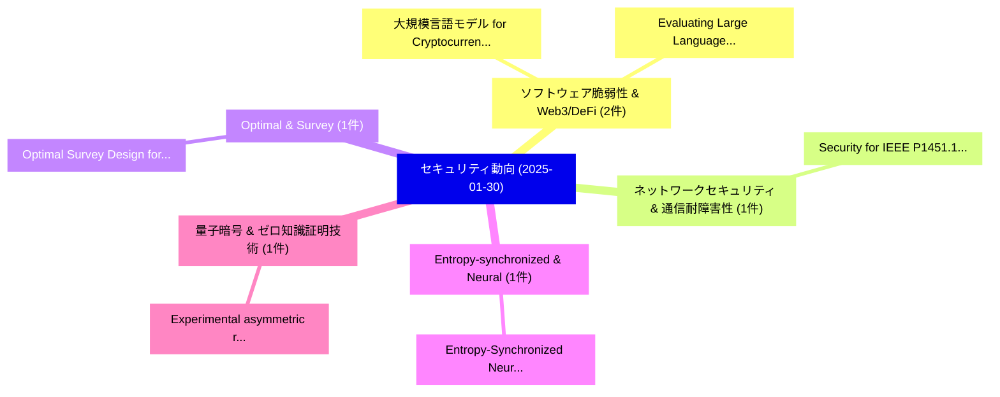

# 📅 02_daily: 日次エグゼクティブサマリー報告書 (2025-01-30)

**集計日時**: 2026-10-02 23:05:15 UTC  
**対象日付**: 2025-01-30  
**本日収集論文数**: 22 件  

---

## 💡 主要セキュリティ動向・脅威インサイト (Executive Insights)

本日の収集論文（計 22 件）において、以下の重点セキュリティ領域で活発な研究動向が確認されました：
- **ソフトウェア脆弱性 & Web3/DeFi** (2 件): 注目論文として 「大規模言語モデル for Cryptocurrency Tr...」、「Evaluating Large Language Mode...」 等が発表され、実務防御および攻撃検証の進展が見られます。
- **ネットワークセキュリティ & 通信耐障害性** (1 件): 注目論文として 「Security for IEEE P1451.1.6-ba...」 等が発表され、実務防御および攻撃検証の進展が見られます。
- **Optimal & Survey** (1 件): 注目論文として 「Optimal Survey Design for Priv...」 等が発表され、実務防御および攻撃検証の進展が見られます。
- **Entropy-synchronized & Neural** (1 件): 注目論文として 「Entropy-Synchronized Neural Ha...」 等が発表され、実務防御および攻撃検証の進展が見られます。
- **量子暗号 & ゼロ知識証明技術** (1 件): 注目論文として 「Experimental asymmetric relati...」 等が発表され、実務防御および攻撃検証の進展が見られます。

### 🗺️ 技術・脅威トピックマインドマップ

---

## 📌 日次セキュリティ論文一覧 (日本語表形式)

| No | arXiv ID | 論文タイトル (日本語訳) | 重要キーワード | 構造化エグゼクティブ要約 (背景・提案・影響) | 脅威分類 | 詳細リンク |
|---|---|---|---|---|---|---|
| 1 | `2501.18102v1` | [Security for IEEE P1451.1.6-based Sensor Networks for IoT Applications（セキュリティ分析論文）](../../okf/papers/2025-01-30/2501.18102.md) | `Sensor Networks`, `6-based Sensor`, `Hiroaki Nishi` | 【提案】概要 (Overview & Key Finding) 本論文「Security for IEEE P1451.1.6-based Sensor Networks for I...。実証評価により経営層・セキュリティ管理者向け推奨アクション (E... | `cs.CR` | [arXiv](https://arxiv.org/abs/2501.18102v1) &#124; [OKF](../../okf/papers/2025-01-30/2501.18102.md) |
| 2 | `2501.18121v1` | [Optimal Survey Design for Private Mean Estimation（セキュリティ分析論文）](../../okf/papers/2025-01-30/2501.18121.md) | `Optimal Survey Design`, `Private Mean Estimation`, `Wei Chen` | 【提案】概要 (Overview & Key Finding) 本論文「Optimal Survey Design for Private Mean Estimation（セキュリテ...。実証評価によりAwan - **公開日時**: `2025-01... | `cs.CR` | [arXiv](https://arxiv.org/abs/2501.18121v1) &#124; [OKF](../../okf/papers/2025-01-30/2501.18121.md) |
| 3 | `2501.18131v2` | [Entropy-Synchronized Neural Hashing for Unsupervised Ransomware Detection（セキュリティ分析論文）](../../okf/papers/2025-01-30/2501.18131.md) | `Synchronized Neural Hashing`, `Unsupervised Ransomware Detection`, `Entropy-Synchronized Neural` | 【提案】概要 (Overview & Key Finding) 本論文「Entropy-Synchronized Neural Hashing for Unsupervised ラン...。実証評価により経営層・セキュリティ管理者向け推奨アクション (E... | `cs.CR` | [arXiv](https://arxiv.org/abs/2501.18131v2) &#124; [OKF](../../okf/papers/2025-01-30/2501.18131.md) |
| 4 | `2501.18158v3` | [大規模言語モデル for Cryptocurrency Transaction Analysis: A Bitcoin Case Study](../../okf/papers/2025-01-30/2501.18158.md) | `Large Language Models`, `Tsz Hon Yuen`, `Kwang Raymond Choo` | 【提案】概要 (Overview & Key Finding) 本論文「大規模言語モデル for Cryptocurrency Transaction Analysis: A Bit...。実証評価により経営層・セキュリティ管理者向け推奨アクション (E... | `cs.CR` | [arXiv](https://arxiv.org/abs/2501.18158v3) &#124; [OKF](../../okf/papers/2025-01-30/2501.18158.md) |
| 5 | `2501.18176v2` | [Experimental asymmetric relativistic zero-knowledge proofs with unconditional security（セキュリティ分析論文）](../../okf/papers/2025-01-30/2501.18176.md) | `zero-knowledge proofs`, `Xun Weng`, `Yang Li` | 【提案】概要 (Overview & Key Finding) 本論文「Experimental asymmetric relativistic zero-knowledge pro...。実証評価により経営層・セキュリティ管理者向け推奨アクション (E... | `cs.CR` | [arXiv](https://arxiv.org/abs/2501.18176v2) &#124; [OKF](../../okf/papers/2025-01-30/2501.18176.md) |
| 6 | `2501.18279v2` | [SoK: Measuring Blockchain Decentralization（セキュリティ分析論文）](../../okf/papers/2025-01-30/2501.18279.md) | `Measuring Blockchain Decentralization`, `Christina Ovezik`, `Dimitris Karakostas` | 【提案】概要 (Overview & Key Finding) 本論文「SoK: Measuring Blockchain Decentralization（セキュリティ分析論文）」...。実証評価によりWoods - **公開日時**: `2025-0... | `cs.CR` | [arXiv](https://arxiv.org/abs/2501.18279v2) &#124; [OKF](../../okf/papers/2025-01-30/2501.18279.md) |
| 7 | `2501.18371v1` | [FLASH-FHE: A Heterogeneous Architecture for Fully Homomorphic Encryption Acceleration（セキュリティ分析論文）](../../okf/papers/2025-01-30/2501.18371.md) | `Fully Homomorphic Encryption Acceleration`, `Heterogeneous Architecture`, `Junxue Zhang` | 【提案】概要 (Overview & Key Finding) 本論文「FLASH-FHE: A Heterogeneous Architecture for Fully 準同型暗号...。実証評価により経営層・セキュリティ管理者向け推奨アクション (E... | `cs.CR` | [arXiv](https://arxiv.org/abs/2501.18371v1) &#124; [OKF](../../okf/papers/2025-01-30/2501.18371.md) |
| 8 | `2501.18387v6` | [AuthOr: Lower Cost Authenticity-Oriented Garbling for Arbitrary Boolean Circuits（セキュリティ分析論文）](../../okf/papers/2025-01-30/2501.18387.md) | `Lower Cost Authenticity`, `Arbitrary Boolean Circuits`, `Oriented Garbling` | 【提案】概要 (Overview & Key Finding) 本論文「AuthOr: Lower Cost Authenticity-Oriented Garbling for A...。実証評価により経営層・セキュリティ管理者向け推奨アクション (E... | `cs.CR` | [arXiv](https://arxiv.org/abs/2501.18387v6) &#124; [OKF](../../okf/papers/2025-01-30/2501.18387.md) |
| 9 | `2501.18394v1` | [Quantum-Key Distribution using Decoy Pulses to Combat Photon-Number Splitting by Eavesdropper: An Event-by-Event Impairment Enumeration Approach for Performance Evaluation and Design（セキュリティ分析論文）](../../okf/papers/2025-01-30/2501.18394.md) | `Key Distribution`, `Decoy Pulses`, `Combat Photon` | 【提案】概要 (Overview & Key Finding) 本論文「量子-Key Distribution using Decoy Pulses to Combat Photon...。実証評価によりセキュリティ影響と実験結果 (Results & ... | `cs.CR` | [arXiv](https://arxiv.org/abs/2501.18394v1) &#124; [OKF](../../okf/papers/2025-01-30/2501.18394.md) |
| 10 | `2501.18407v1` | [Degree is Important: On Evolving Homogeneous Boolean Functions（セキュリティ分析論文）](../../okf/papers/2025-01-30/2501.18407.md) | `Claude Carlet`, `Domagoj Jakobovic`, `Luca Mariot` | 【提案】概要 (Overview & Key Finding) 本論文「Degree is Important: On Evolving Homogeneous Boolean Fu...。実証評価により経営層・セキュリティ管理者向け推奨アクション (E... | `cs.CR` | [arXiv](https://arxiv.org/abs/2501.18407v1) &#124; [OKF](../../okf/papers/2025-01-30/2501.18407.md) |
| 11 | `2501.18492v2` | [GuardReasoner: Reasoning-based LLM Safeguardsに向けて](../../okf/papers/2025-01-30/2501.18492.md) | `Reasoning-based LLM`, `Towards Reasoning`, `Yue Liu` | 【提案】概要 (Overview & Key Finding) 本論文「GuardReasoner: Reasoning-based LLM Safeguardsに向けて」（原題: ...。実証評価によりLi, Hui Xiong, Bryan Hooi... | `cs.CR` | [arXiv](https://arxiv.org/abs/2501.18492v2) &#124; [OKF](../../okf/papers/2025-01-30/2501.18492.md) |
| 12 | `2501.18533v3` | [Rethinking Bottlenecks in Safety Fine-Tuning of Vision Language Models（セキュリティ分析論文）](../../okf/papers/2025-01-30/2501.18533.md) | `Vision Language Models`, `Rethinking Bottlenecks`, `Safety Fine` | 【提案】概要 (Overview & Key Finding) 本論文「Rethinking Bottlenecks in Safety Fine-Tuning of Vision ...。実証評価により経営層・セキュリティ管理者向け推奨アクション (E... | `cs.CR` | [arXiv](https://arxiv.org/abs/2501.18533v3) &#124; [OKF](../../okf/papers/2025-01-30/2501.18533.md) |
| 13 | `2501.18549v1` | [CryptoDNA: A Machine Learning Paradigm for DDoS Detection in Healthcare IoT, Inspired by crypto jacking prevention Models（セキュリティ分析論文）](../../okf/papers/2025-01-30/2501.18549.md) | `Machine Learning Paradigm`, `Ahmed Abdelgawad`, `Nelly Elsayed` | 【提案】概要 (Overview & Key Finding) 本論文「CryptoDNA: A Machine Learning Paradigm for DDoS Detecti...。実証評価により経営層・セキュリティ管理者向け推奨アクション (E... | `cs.CR` | [arXiv](https://arxiv.org/abs/2501.18549v1) &#124; [OKF](../../okf/papers/2025-01-30/2501.18549.md) |
| 14 | `2501.18565v3` | [BounTCHA: A CAPTCHA Utilizing Boundary Identification in Guided Generative AI-extended Videos（セキュリティ分析論文）](../../okf/papers/2025-01-30/2501.18565.md) | `Utilizing Boundary Identification`, `Guided Generative`, `AI-extended Videos` | 【提案】概要 (Overview & Key Finding) 本論文「BounTCHA: A CAPTCHA Utilizing Boundary Identification i...。実証評価により経営層・セキュリティ管理者向け推奨アクション (E... | `cs.CR` | [arXiv](https://arxiv.org/abs/2501.18565v3) &#124; [OKF](../../okf/papers/2025-01-30/2501.18565.md) |
| 15 | `2501.18663v1` | [Joint Optimization of Prompt Security and System Performance in Edge-Cloud LLM Systems（セキュリティ分析論文）](../../okf/papers/2025-01-30/2501.18663.md) | `Joint Optimization`, `Prompt Security`, `System Performance` | 【提案】概要 (Overview & Key Finding) 本論文「Joint Optimization of Prompt Security and System Perfor...。実証評価により経営層・セキュリティ管理者向け推奨アクション (E... | `cs.CR` | [arXiv](https://arxiv.org/abs/2501.18663v1) &#124; [OKF](../../okf/papers/2025-01-30/2501.18663.md) |
| 16 | `2501.18669v1` | [The Pitfalls of "Security by Obscurity" And What They Mean for Transparent AI（セキュリティ分析論文）](../../okf/papers/2025-01-30/2501.18669.md) | `Peter Hall`, `Olivia Mundahl`, `Sunoo Park` | 【提案】概要 (Overview & Key Finding) 本論文「The Pitfalls of "Security by Obscurity" And What They M...。実証評価により経営層・セキュリティ管理者向け推奨アクション (E... | `cs.CR` | [arXiv](https://arxiv.org/abs/2501.18669v1) &#124; [OKF](../../okf/papers/2025-01-30/2501.18669.md) |
| 17 | `2501.18712v4` | [Invisible Traces: Using Hybrid Fingerprinting to identify underlying LLMs in GenAI Apps（セキュリティ分析論文）](../../okf/papers/2025-01-30/2501.18712.md) | `Using Hybrid Fingerprinting`, `Invisible Traces`, `Devansh Bhardwaj` | 【提案】概要 (Overview & Key Finding) 本論文「Invisible Traces: Using Hybrid Fingerprinting to identi...。実証評価により経営層・セキュリティ管理者向け推奨アクション (E... | `cs.CR` | [arXiv](https://arxiv.org/abs/2501.18712v4) &#124; [OKF](../../okf/papers/2025-01-30/2501.18712.md) |
| 18 | `2501.18727v2` | [Exploring Audio Editing Features as User-Centric Privacy Defenses Against Large Language Model(LLM) Based Emotion Inference Attacks（セキュリティ分析論文）](../../okf/papers/2025-01-30/2501.18727.md) | `Exploring Audio Editing Features`, `Based Emotion Inference Attacks`, `User-Centric Privacy` | 【提案】概要 (Overview & Key Finding) 本論文「Exploring Audio Editing Features as User-Centric Privac...。実証評価により経営層・セキュリティ管理者向け推奨アクション (E... | `cs.CR` | [arXiv](https://arxiv.org/abs/2501.18727v2) &#124; [OKF](../../okf/papers/2025-01-30/2501.18727.md) |
| 19 | `2501.18740v1` | [REDACTOR: eFPGA Redaction for DNN Accelerator Security（セキュリティ分析論文）](../../okf/papers/2025-01-30/2501.18740.md) | `Accelerator Security`, `Yazan Baddour`, `Ava Hedayatipour` | 【提案】概要 (Overview & Key Finding) 本論文「REDACTOR: eFPGA Redaction for DNN Accelerator Security（...。実証評価により経営層・セキュリティ管理者向け推奨アクション (E... | `cs.CR` | [arXiv](https://arxiv.org/abs/2501.18740v1) &#124; [OKF](../../okf/papers/2025-01-30/2501.18740.md) |
| 20 | `2501.18780v2` | [Gotta Hash 'Em All! Speeding Up Hash Functions for Zero-Knowledge Proof Applications（セキュリティ分析論文）](../../okf/papers/2025-01-30/2501.18780.md) | `Knowledge Proof Applications`, `Gotta Hash`, `Zero-Knowledge Proof` | 【提案】Speeding Up Hash Functions for ゼロ知識証明 Applications ### (日本語題名: Gotta Hash 'Em All!。実証評価により経営層・セキュリティ管理者向け推奨アクション (Executive... | `cs.CR` | [arXiv](https://arxiv.org/abs/2501.18780v2) &#124; [OKF](../../okf/papers/2025-01-30/2501.18780.md) |
| 21 | `2502.00064v1` | [Evaluating Large Language Models in 脆弱性検出 Under Variable Context Windows](../../okf/papers/2025-01-30/2502.00064.md) | `Evaluating Large Language Models`, `Jie Lin`, `David Mohaisen` | 【提案】概要 (Overview & Key Finding) 本論文「Evaluating Large Language Models in 脆弱性検出 Under Variabl...。実証評価により経営層・セキュリティ管理者向け推奨アクション (E... | `cs.CR` | [arXiv](https://arxiv.org/abs/2502.00064v1) &#124; [OKF](../../okf/papers/2025-01-30/2502.00064.md) |
| 22 | `2502.15727v2` | [Retrieval Augmented Generation Based LLM Evaluation For Protocol State Machine Inference With Chain-of-Thought Reasoning（セキュリティ分析論文）](../../okf/papers/2025-01-30/2502.15727.md) | `Retrieval Augmented Generation Based`, `Thought Reasoning`, `Youssef Maklad` | 【提案】概要 (Overview & Key Finding) 本論文「Retrieval Augmented Generation Based LLM Evaluation For...。実証評価により経営層・セキュリティ管理者向け推奨アクション (E... | `cs.CR` | [arXiv](https://arxiv.org/abs/2502.15727v2) &#124; [OKF](../../okf/papers/2025-01-30/2502.15727.md) |

