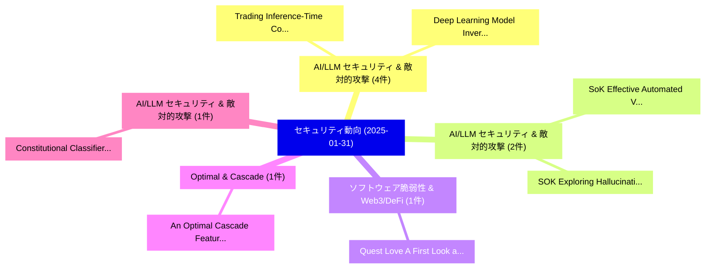

# 📅 02_daily: 日次エグゼクティブサマリー報告書 (2025-01-31)

**集計日時**: 2026-10-02 23:05:15 UTC  
**対象日付**: 2025-01-31  
**本日収集論文数**: 28 件  

---

## 💡 主要セキュリティ動向・脅威インサイト (Executive Insights)

本日の収集論文（計 28 件）において、以下の重点セキュリティ領域で活発な研究動向が確認されました：
- **AI/LLM セキュリティ & 敵対的攻撃** (4 件): 注目論文として 「Trading Inference-Time Compute...」、「Deep Learning Model Inversion ...」 等が発表され、実務防御および攻撃検証の進展が見られます。
- **AI/LLM セキュリティ & 敵対的攻撃** (2 件): 注目論文として 「SoK: Effective Automated Vulne...」、「SOK: Exploring Hallucinations ...」 等が発表され、実務防御および攻撃検証の進展が見られます。
- **ソフトウェア脆弱性 & Web3/DeFi** (1 件): 注目論文として 「Quest Love: A First Look at Bl...」 等が発表され、実務防御および攻撃検証の進展が見られます。
- **Optimal & Cascade** (1 件): 注目論文として 「An Optimal Cascade Feature-Lev...」 等が発表され、実務防御および攻撃検証の進展が見られます。
- **AI/LLM セキュリティ & 敵対的攻撃** (1 件): 注目論文として 「Constitutional Classifiers: De...」 等が発表され、実務防御および攻撃検証の進展が見られます。

### 🗺️ 技術・脅威トピックマインドマップ

---

## 📌 日次セキュリティ論文一覧 (日本語表形式)

| No | arXiv ID | 論文タイトル (日本語訳) | 重要キーワード | 構造化エグゼクティブ要約 (背景・提案・影響) | 脅威分類 | 詳細リンク |
|---|---|---|---|---|---|---|
| 1 | `2501.18810v2` | [Quest Love: A First Look at Blockchain Loyalty Programs（セキュリティ分析論文）](../../okf/papers/2025-01-31/2501.18810.md) | `Blockchain Loyalty Programs`, `Quest Love`, `First Look` | 【提案】概要 (Overview & Key Finding) 本論文「Quest Love: A First Look at Blockchain Loyalty Programs...。実証評価により経営層・セキュリティ管理者向け推奨アクション (E... | `cs.CR` | [arXiv](https://arxiv.org/abs/2501.18810v2) &#124; [OKF](../../okf/papers/2025-01-31/2501.18810.md) |
| 2 | `2501.18820v1` | [SoK: Effective Automated Vulnerability Repairに向けて](../../okf/papers/2025-01-31/2501.18820.md) | `Towards Effective Automated Vulnerability Repair`, `Effective Automated Vulnerability`, `Ying Li` | 【提案】概要 (Overview & Key Finding) 本論文「SoK: Effective Automated 脆弱性 Repairに向けて」（原題: SoK: Towar...。実証評価により経営層・セキュリティ管理者向け推奨アクション (E... | `cs.CR` | [arXiv](https://arxiv.org/abs/2501.18820v1) &#124; [OKF](../../okf/papers/2025-01-31/2501.18820.md) |
| 3 | `2501.18821v3` | [An Optimal Cascade Feature-Level Spatiotemporal Fusion Strategy for Anomaly Detection in CAN Bus（セキュリティ分析論文）](../../okf/papers/2025-01-31/2501.18821.md) | `Level Spatiotemporal Fusion Strategy`, `Feature-Level Spatiotemporal`, `Anomaly Detection` | 【提案】概要 (Overview & Key Finding) 本論文「An Optimal Cascade Feature-Level Spatiotemporal Fusion ...。実証評価により経営層・セキュリティ管理者向け推奨アクション (E... | `cs.CR` | [arXiv](https://arxiv.org/abs/2501.18821v3) &#124; [OKF](../../okf/papers/2025-01-31/2501.18821.md) |
| 4 | `2501.18837v1` | [Constitutional Classifiers: Defending against Universal Jailbreaks across Thousands of Hours of Red Teaming（セキュリティ分析論文）](../../okf/papers/2025-01-31/2501.18837.md) | `Constitutional Classifiers`, `Universal Jailbreaks`, `Red Teaming` | 【提案】概要 (Overview & Key Finding) 本論文「Constitutional Classifiers: Defending against Universal...。実証評価により経営層・セキュリティ管理者向け推奨アクション (E... | `cs.CR` | [arXiv](https://arxiv.org/abs/2501.18837v1) &#124; [OKF](../../okf/papers/2025-01-31/2501.18837.md) |
| 5 | `2501.18841v1` | [Trading Inference-Time Compute for Adversarial Robustness（セキュリティ分析論文）](../../okf/papers/2025-01-31/2501.18841.md) | `Trading Inference`, `Time Compute`, `Adversarial Robustness` | 【提案】概要 (Overview & Key Finding) 本論文「Trading Inference-Time Compute for Adversarial Robustne...。実証評価により経営層・セキュリティ管理者向け推奨アクション (E... | `cs.CR` | [arXiv](https://arxiv.org/abs/2501.18841v1) &#124; [OKF](../../okf/papers/2025-01-31/2501.18841.md) |
| 6 | `2501.18857v2` | [DAPPER: A Performance-Attack-Resilient Tracker for RowHammer Defense（セキュリティ分析論文）](../../okf/papers/2025-01-31/2501.18857.md) | `Resilient Tracker`, `Jeonghyun Woo`, `Raw Meta` | 【提案】概要 (Overview & Key Finding) 本論文「DAPPER: A Performance-Attack-Resilient Tracker for RowH...。実証評価により経営層・セキュリティ管理者向け推奨アクション (E... | `cs.CR` | [arXiv](https://arxiv.org/abs/2501.18857v2) &#124; [OKF](../../okf/papers/2025-01-31/2501.18857.md) |
| 7 | `2501.18861v5` | [QPRAC: Secure and Practical PRAC-based Rowhammer Mitigation using Priority Queuesに向けて](../../okf/papers/2025-01-31/2501.18861.md) | `Rowhammer Mitigation`, `PRAC-based Rowhammer`, `Towards Secure` | 【提案】概要 (Overview & Key Finding) 本論文「QPRAC: Secure and Practical PRAC-based RowHammer Mitiga...。実証評価により経営層・セキュリティ管理者向け推奨アクション (E... | `cs.CR` | [arXiv](https://arxiv.org/abs/2501.18861v5) &#124; [OKF](../../okf/papers/2025-01-31/2501.18861.md) |
| 8 | `2501.18874v2` | [Enforcing MAVLink Safety & Security Properties Via Refined Multiparty Session Types（セキュリティ分析論文）](../../okf/papers/2025-01-31/2501.18874.md) | `Security Properties Via Refined Multiparty Session Types`, `Arthur Amorim`, `Max Taylor` | 【提案】概要 (Overview & Key Finding) 本論文「Enforcing MAVLink Safety & Security Properties Via Refi...。実証評価により経営層・セキュリティ管理者向け推奨アクション (E... | `cs.CR` | [arXiv](https://arxiv.org/abs/2501.18874v2) &#124; [OKF](../../okf/papers/2025-01-31/2501.18874.md) |
| 9 | `2501.18877v2` | [Embedding Distortion in Text-conditioned Diffusion ModelsによるSexual Content Generationの軽減](../../okf/papers/2025-01-31/2501.18877.md) | `Embedding Distortion`, `Text-conditioned Diffusion`, `Mitigating Sexual Content Generation` | 【提案】概要 (Overview & Key Finding) 本論文「Embedding Distortion in Text-conditioned Diffusion Mode...。実証評価により経営層・セキュリティ管理者向け推奨アクション (E... | `cs.CR` | [arXiv](https://arxiv.org/abs/2501.18877v2) &#124; [OKF](../../okf/papers/2025-01-31/2501.18877.md) |
| 10 | `2501.18914v1` | [Scaling Laws for Differentially Private Language Models（セキュリティ分析論文）](../../okf/papers/2025-01-31/2501.18914.md) | `Differentially Private Language Models`, `Scaling Laws`, `Yangsibo Huang` | 【提案】概要 (Overview & Key Finding) 本論文「Scaling Laws for Differentially Private Language Models...。実証評価によりChoquette-Choo, Ba。 | `cs.CR` | [arXiv](https://arxiv.org/abs/2501.18914v1) &#124; [OKF](../../okf/papers/2025-01-31/2501.18914.md) |
| 11 | `2501.18928v2` | [Quantum function secret sharing（セキュリティ分析論文）](../../okf/papers/2025-01-31/2501.18928.md) | `Ramis Movassagh`, `Raw Meta`, `Executive Summary` | 【提案】概要 (Overview & Key Finding) 本論文「量子 function secret sharing（セキュリティ分析論文）」（原題: 量子 function...。実証評価によりGrilo, Ramis Movassagh - ... | `cs.CR` | [arXiv](https://arxiv.org/abs/2501.18928v2) &#124; [OKF](../../okf/papers/2025-01-31/2501.18928.md) |
| 12 | `2501.18934v2` | [Deep Learning Model Inversion Attacks and Defenses: A Comprehensive Survey（セキュリティ分析論文）](../../okf/papers/2025-01-31/2501.18934.md) | `Deep Learning Model Inversion Attacks`, `Comprehensive Survey`, `Wencheng Yang` | 【提案】概要 (Overview & Key Finding) 本論文「Deep Learning モデル反転攻撃 Attacks and Defenses: A Comprehen...。実証評価により経営層・セキュリティ管理者向け推奨アクション (E... | `cs.CR` | [arXiv](https://arxiv.org/abs/2501.18934v2) &#124; [OKF](../../okf/papers/2025-01-31/2501.18934.md) |
| 13 | `2501.19012v1` | [Importing Phantoms: Measuring LLM Package Hallucination Vulnerabilities（セキュリティ分析論文）](../../okf/papers/2025-01-31/2501.19012.md) | `Package Hallucination Vulnerabilities`, `Importing Phantoms`, `Arjun Krishna` | 【提案】概要 (Overview & Key Finding) 本論文「Importing Phantoms: Measuring LLM Package Hallucination...。実証評価により経営層・セキュリティ管理者向け推奨アクション (E... | `cs.CR` | [arXiv](https://arxiv.org/abs/2501.19012v1) &#124; [OKF](../../okf/papers/2025-01-31/2501.19012.md) |
| 14 | `2501.19120v2` | [Hierarchical Cryptographic Signature Mapping for Ransomware Classification: A Structural Decomposition Approach（セキュリティ分析論文）](../../okf/papers/2025-01-31/2501.19120.md) | `Hierarchical Cryptographic Signature Mapping`, `Ransomware Classification`, `Hierarchical Cryptographic Sign` | 【提案】概要 (Overview & Key Finding) 本論文「Hierarchical Cryptographic Signature Mapping for ランサムウェ...。実証評価により経営層・セキュリティ管理者向け推奨アクション (E... | `cs.CR` | [arXiv](https://arxiv.org/abs/2501.19120v2) &#124; [OKF](../../okf/papers/2025-01-31/2501.19120.md) |
| 15 | `2501.19143v2` | [Imitation Game for Adversarial Disillusion with Chain-of-Thought Reasoning in Generative AI（セキュリティ分析論文）](../../okf/papers/2025-01-31/2501.19143.md) | `Imitation Game`, `Adversarial Disillusion`, `Thought Reasoning` | 【提案】概要 (Overview & Key Finding) 本論文「Imitation Game for Adversarial Disillusion with Chain-o...。実証評価により経営層・セキュリティ管理者向け推奨アクション (E... | `cs.CR` | [arXiv](https://arxiv.org/abs/2501.19143v2) &#124; [OKF](../../okf/papers/2025-01-31/2501.19143.md) |
| 16 | `2501.19172v2` | [PSyDUCK: Training-Free Steganography for Latent Diffusion（セキュリティ分析論文）](../../okf/papers/2025-01-31/2501.19172.md) | `Free Steganography`, `Latent Diffusion`, `Training-Free Steganography` | 【提案】概要 (Overview & Key Finding) 本論文「PSyDUCK: Training-Free Steganography for Latent Diffusi...。実証評価により経営層・セキュリティ管理者向け推奨アクション (E... | `cs.CR` | [arXiv](https://arxiv.org/abs/2501.19172v2) &#124; [OKF](../../okf/papers/2025-01-31/2501.19172.md) |
| 17 | `2501.19180v2` | [Enhancing Model Defense Against Jailbreaks with Proactive Safety Reasoning（セキュリティ分析論文）](../../okf/papers/2025-01-31/2501.19180.md) | `Proactive Safety Reasoning`, `Jin Song Dong`, `Xianglin Yang` | 【提案】概要 (Overview & Key Finding) 本論文「Enhancing Model Defense Against ジェイルブレイクs with Proactiv...。実証評価により経営層・セキュリティ管理者向け推奨アクション (E... | `cs.CR` | [arXiv](https://arxiv.org/abs/2501.19180v2) &#124; [OKF](../../okf/papers/2025-01-31/2501.19180.md) |
| 18 | `2501.19191v1` | [Secured Communication Schemes for UAVs in 5G: CRYSTALS-Kyber and IDS（セキュリティ分析論文）](../../okf/papers/2025-01-31/2501.19191.md) | `Secured Communication Schemes`, `Seyed Ahmad Soleymani`, `Taneya Sharma` | 【提案】概要 (Overview & Key Finding) 本論文「Secured Communication Schemes for UAVs in 5G: CRYSTALS-...。実証評価により経営層・セキュリティ管理者向け推奨アクション (E... | `cs.CR` | [arXiv](https://arxiv.org/abs/2501.19191v1) &#124; [OKF](../../okf/papers/2025-01-31/2501.19191.md) |
| 19 | `2501.19206v1` | [An Empirical Game-Theoretic Autonomous Cyber-Defence Agentsの分析](../../okf/papers/2025-01-31/2501.19206.md) | `Theoretic Autonomous Cyber`, `Autonomous Cyber`, `Defence Agents` | 【提案】概要 (Overview & Key Finding) 本論文「An Empirical Game-Theoretic Autonomous Cyber-Defence Ag...。実証評価によりHarrold, Matthew Stewart,... | `cs.CR` | [arXiv](https://arxiv.org/abs/2501.19206v1) &#124; [OKF](../../okf/papers/2025-01-31/2501.19206.md) |
| 20 | `2501.19223v1` | [Through the Looking Glass: LLM-Based AR/VR Android Applications Privacy Policiesの分析](../../okf/papers/2025-01-31/2501.19223.md) | `Looking Glass`, `Android Applications Privacy Policies`, `Android Applications Privacy` | 【提案】概要 (Overview & Key Finding) 本論文「Through the Looking Glass: LLM-Based AR/VR Android Appl...。実証評価により経営層・セキュリティ管理者向け推奨アクション (E... | `cs.CR` | [arXiv](https://arxiv.org/abs/2501.19223v1) &#124; [OKF](../../okf/papers/2025-01-31/2501.19223.md) |
| 21 | `2501.19290v3` | [Noninterference Irreversible Systems and Reversible Systems Featuring both Nondeterminism and Probabilitiesの分析](../../okf/papers/2025-01-31/2501.19290.md) | `Reversible Systems Featuring`, `Noninterference Irreversible Systems`, `Irreversible Systems` | 【提案】概要 (Overview & Key Finding) 本論文「Noninterference Irreversible Systems and Reversible Sys...。実証評価により経営層・セキュリティ管理者向け推奨アクション (E... | `cs.CR` | [arXiv](https://arxiv.org/abs/2501.19290v3) &#124; [OKF](../../okf/papers/2025-01-31/2501.19290.md) |
| 22 | `2502.00067v1` | [Decoding User Concerns in AI Health Chatbots: An Exploration of Security and Privacy in App Reviews（セキュリティ分析論文）](../../okf/papers/2025-01-31/2502.00067.md) | `Decoding User Concerns`, `Health Chatbots`, `App Reviews` | 【提案】概要 (Overview & Key Finding) 本論文「Decoding User Concerns in AI Health Chatbots: An Explor...。実証評価により経営層・セキュリティ管理者向け推奨アクション (E... | `cs.CR` | [arXiv](https://arxiv.org/abs/2502.00067v1) &#124; [OKF](../../okf/papers/2025-01-31/2502.00067.md) |
| 23 | `2502.00068v1` | [Privacy Preserving Charge Location Prediction for Electric Vehicles（セキュリティ分析論文）](../../okf/papers/2025-01-31/2502.00068.md) | `Privacy Preserving Charge Location Prediction`, `Electric Vehicles`, `Robert Marlin` | 【提案】概要 (Overview & Key Finding) 本論文「Privacy Preserving Charge Location Prediction for Elect...。実証評価により経営層・セキュリティ管理者向け推奨アクション (E... | `cs.CR` | [arXiv](https://arxiv.org/abs/2502.00068v1) &#124; [OKF](../../okf/papers/2025-01-31/2502.00068.md) |
| 24 | `2502.00069v1` | [Large Capacity Data Hiding in Binary Image black and white mixed regions（セキュリティ分析論文）](../../okf/papers/2025-01-31/2502.00069.md) | `Large Capacity Data Hiding`, `Binary Image`, `Yuanlin Yang` | 【提案】概要 (Overview & Key Finding) 本論文「Large Capacity Data Hiding in Binary Image black and wh...。実証評価により経営層・セキュリティ管理者向け推奨アクション (E... | `cs.CR` | [arXiv](https://arxiv.org/abs/2502.00069v1) &#124; [OKF](../../okf/papers/2025-01-31/2502.00069.md) |
| 25 | `2502.00072v1` | [LLM Cyber Evaluations Don't Capture Real-World Risk（セキュリティ分析論文）](../../okf/papers/2025-01-31/2502.00072.md) | `Cyber Evaluations Don`, `Capture Real`, `World Risk` | 【提案】概要 (Overview & Key Finding) 本論文「LLM Cyber Evaluations Don't Capture Real-World Risk（セキュ...。実証評価により経営層・セキュリティ管理者向け推奨アクション (E... | `cs.CR` | [arXiv](https://arxiv.org/abs/2502.00072v1) &#124; [OKF](../../okf/papers/2025-01-31/2502.00072.md) |
| 26 | `2502.00156v2` | [ALBAR: Adversarial Learning approach to mitigate Biases in Action Recognition（セキュリティ分析論文）](../../okf/papers/2025-01-31/2502.00156.md) | `Adversarial Learning`, `Action Recognition`, `Ishan Rajendrakumar Dave` | 【提案】概要 (Overview & Key Finding) 本論文「ALBAR: Adversarial Learning approach to mitigate Biases...。実証評価により経営層・セキュリティ管理者向け推奨アクション (E... | `cs.CR` | [arXiv](https://arxiv.org/abs/2502.00156v2) &#124; [OKF](../../okf/papers/2025-01-31/2502.00156.md) |
| 27 | `2502.00193v1` | [Byzantine-Resilient Zero-Order Optimization for Communication-Efficient Heterogeneous 連合学習](../../okf/papers/2025-01-31/2502.00193.md) | `Resilient Zero`, `Order Optimization`, `Byzantine-Resilient Zero` | 【提案】概要 (Overview & Key Finding) 本論文「Byzantine-Resilient Zero-Order Optimization for Communi...。実証評価により経営層・セキュリティ管理者向け推奨アクション (E... | `cs.CR` | [arXiv](https://arxiv.org/abs/2502.00193v1) &#124; [OKF](../../okf/papers/2025-01-31/2502.00193.md) |
| 28 | `2502.18468v1` | [SOK: Exploring Hallucinations and Security Risks in AI-Assisted Software Development with Insights for LLM Deployment（セキュリティ分析論文）](../../okf/papers/2025-01-31/2502.18468.md) | `Assisted Software Development`, `Exploring Hallucinations`, `Security Risks` | 【提案】概要 (Overview & Key Finding) 本論文「SOK: Exploring Hallucinations and Security Risks in AI-...。実証評価により経営層・セキュリティ管理者向け推奨アクション (E... | `cs.CR` | [arXiv](https://arxiv.org/abs/2502.18468v1) &#124; [OKF](../../okf/papers/2025-01-31/2502.18468.md) |

