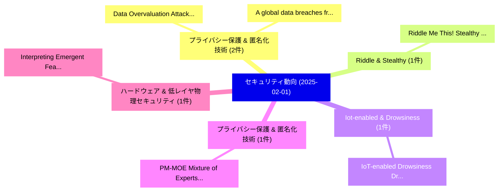

# 📅 02_daily: 日次エグゼクティブサマリー報告書 (2025-02-01)

**集計日時**: 2026-10-02 23:05:15 UTC  
**対象日付**: 2025-02-01  
**本日収集論文数**: 10 件  

---

## 💡 主要セキュリティ動向・脅威インサイト (Executive Insights)

本日の収集論文（計 10 件）において、以下の重点セキュリティ領域で活発な研究動向が確認されました：
- **プライバシー保護 & 匿名化技術** (2 件): 注目論文として 「Data Overvaluation Attack and ...」、「A global data breaches from 20...」 等が発表され、実務防御および攻撃検証の進展が見られます。
- **Riddle & Stealthy** (1 件): 注目論文として 「Riddle Me This! Stealthy Membe...」 等が発表され、実務防御および攻撃検証の進展が見られます。
- **Iot-enabled & Drowsiness** (1 件): 注目論文として 「IoT-enabled Drowsiness Driver ...」 等が発表され、実務防御および攻撃検証の進展が見られます。
- **プライバシー保護 & 匿名化技術** (1 件): 注目論文として 「PM-MOE: Mixture of Experts on ...」 等が発表され、実務防御および攻撃検証の進展が見られます。
- **ハードウェア & 低レイヤ物理セキュリティ** (1 件): 注目論文として 「Interpreting Emergent Features...」 等が発表され、実務防御および攻撃検証の進展が見られます。

### 🗺️ 技術・脅威トピックマインドマップ

---

## 📌 日次セキュリティ論文一覧 (日本語表形式)

| No | arXiv ID | 論文タイトル (日本語訳) | 重要キーワード | 構造化エグゼクティブ要約 (背景・提案・影響) | 脅威分類 | 詳細リンク |
|---|---|---|---|---|---|---|
| 1 | `2502.00306v2` | [Riddle Me This! Stealthy Membership Inference for Retrieval-Augmented Generation（セキュリティ分析論文）](../../okf/papers/2025-02-01/2502.00306.md) | `Stealthy Membership Inference`, `Augmented Generation`, `Retrieval-Augmented Generation` | 【提案】Stealthy Membership Inference for Retrieval-Augmented Generation ### (日本語題名: Riddle Me ...。実証評価により経営層・セキュリティ管理者向け推奨アクション (E... | `cs.CR` | [arXiv](https://arxiv.org/abs/2502.00306v2) &#124; [OKF](../../okf/papers/2025-02-01/2502.00306.md) |
| 2 | `2502.00347v1` | [IoT-enabled Drowsiness Driver Safety Alert System with Real-Time Monitoring Using Integrated Sensors Technology（セキュリティ分析論文）](../../okf/papers/2025-02-01/2502.00347.md) | `Time Monitoring Using Integrated Sensors Technology`, `Drowsiness Driver Safety Alert System`, `IoT-enabled Drowsiness` | 【提案】概要 (Overview & Key Finding) 本論文「IoT-enabled Drowsiness Driver Safety Alert System with ...。実証評価により経営層・セキュリティ管理者向け推奨アクション (E... | `cs.CR` | [arXiv](https://arxiv.org/abs/2502.00347v1) &#124; [OKF](../../okf/papers/2025-02-01/2502.00347.md) |
| 3 | `2502.00354v1` | [PM-MOE: Mixture of Experts on Private Model Parameters for Personalized 連合学習](../../okf/papers/2025-02-01/2502.00354.md) | `Private Model Parameters`, `Personalized Federated Learning`, `Yu Feng` | 【提案】概要 (Overview & Key Finding) 本論文「PM-MOE: Mixture of Experts on Private Model Parameters ...。実証評価により経営層・セキュリティ管理者向け推奨アクション (E... | `cs.CR` | [arXiv](https://arxiv.org/abs/2502.00354v1) &#124; [OKF](../../okf/papers/2025-02-01/2502.00354.md) |
| 4 | `2502.00384v3` | [Interpreting Emergent Features in Deep Learning-based Side-channel Analysis（セキュリティ分析論文）](../../okf/papers/2025-02-01/2502.00384.md) | `Interpreting Emergent Features`, `Deep Learning`, `Learning-based Side` | 【提案】概要 (Overview & Key Finding) 本論文「Interpreting Emergent Features in Deep Learning-based サ...。実証評価により経営層・セキュリティ管理者向け推奨アクション (E... | `cs.CR` | [arXiv](https://arxiv.org/abs/2502.00384v3) &#124; [OKF](../../okf/papers/2025-02-01/2502.00384.md) |
| 5 | `2502.00494v3` | [Data Overvaluation Attack and Truthful Data Valuation in 連合学習](../../okf/papers/2025-02-01/2502.00494.md) | `Data Overvaluation Attack`, `Truthful Data Valuation`, `Federated Learning` | 【提案】概要 (Overview & Key Finding) 本論文「Data Overvaluation Attack and Truthful Data Valuation i...。実証評価により経営層・セキュリティ管理者向け推奨アクション (E... | `cs.CR` | [arXiv](https://arxiv.org/abs/2502.00494v3) &#124; [OKF](../../okf/papers/2025-02-01/2502.00494.md) |
| 6 | `2502.00580v1` | [Defense Against the Dark Prompts: Mitigating Best-of-N Jailbreaking with Prompt Evaluation（セキュリティ分析論文）](../../okf/papers/2025-02-01/2502.00580.md) | `Dark Prompts`, `Mitigating Best`, `Stuart Armstrong` | 【提案】概要 (Overview & Key Finding) 本論文「Defense Against the Dark Prompts: Mitigating Best-of-N ...。実証評価により経営層・セキュリティ管理者向け推奨アクション (E... | `cs.CR` | [arXiv](https://arxiv.org/abs/2502.00580v1) &#124; [OKF](../../okf/papers/2025-02-01/2502.00580.md) |
| 7 | `2502.00586v2` | [Less is More: Simplifying Network Traffic Classification Leveraging RFCs（セキュリティ分析論文）](../../okf/papers/2025-02-01/2502.00586.md) | `Simplifying Network Traffic Classification Leveraging`, `Nimesha Wickramasinghe`, `Arash Shaghaghi` | 【提案】概要 (Overview & Key Finding) 本論文「Less is More: Simplifying Network Traffic Classificatio...。実証評価により経営層・セキュリティ管理者向け推奨アクション (E... | `cs.CR` | [arXiv](https://arxiv.org/abs/2502.00586v2) &#124; [OKF](../../okf/papers/2025-02-01/2502.00586.md) |
| 8 | `2502.00587v2` | [Robust Knowledge Distillation in 連合学習: Counteracting Backdoor Attacks](../../okf/papers/2025-02-01/2502.00587.md) | `Robust Knowledge Distillation`, `Counteracting Backdoor Attacks`, `Federated Learning` | 【提案】概要 (Overview & Key Finding) 本論文「Robust Knowledge Distillation in 連合学習: Counteracting Ba...。実証評価により経営層・セキュリティ管理者向け推奨アクション (E... | `cs.CR` | [arXiv](https://arxiv.org/abs/2502.00587v2) &#124; [OKF](../../okf/papers/2025-02-01/2502.00587.md) |
| 9 | `2502.05205v1` | [A global data breaches from 2004 to 2024の分析](../../okf/papers/2025-02-01/2502.05205.md) | `Shanitamol Sojan Gracy`, `Raw Meta`, `Executive Summary` | 【提案】概要 (Overview & Key Finding) 本論文「A global data breaches from 2004 to 2024の分析」（原題: A glob...。実証評価により経営層・セキュリティ管理者向け推奨アクション (E... | `cs.CR` | [arXiv](https://arxiv.org/abs/2502.05205v1) &#124; [OKF](../../okf/papers/2025-02-01/2502.05205.md) |
| 10 | `2503.13457v1` | [Man-in-the-Middle Attacks Targeting Quantum Cryptography（セキュリティ分析論文）](../../okf/papers/2025-02-01/2503.13457.md) | `Middle Attacks Targeting Quantum Cryptography`, `the-Middle Attacks`, `Raw Meta` | 【提案】概要 (Overview & Key Finding) 本論文「中間者攻撃 Attacks Targeting 量子 暗号技術（セキュリティ分析論文）」（原題: 中間者攻撃 ...。実証評価によりChen - **公開日時**: `2025-02... | `cs.CR` | [arXiv](https://arxiv.org/abs/2503.13457v1) &#124; [OKF](../../okf/papers/2025-02-01/2503.13457.md) |

