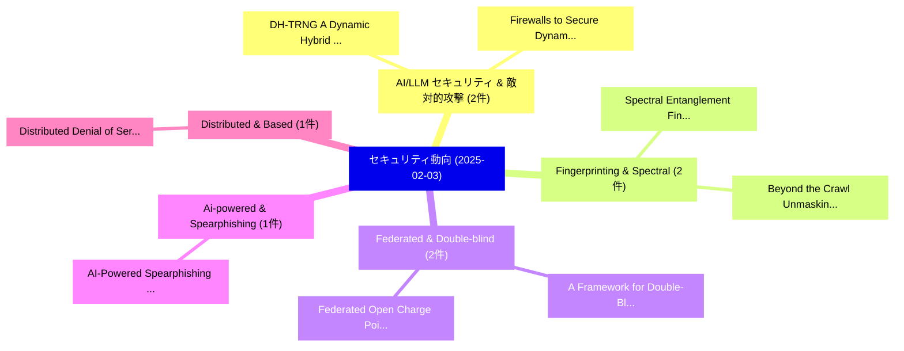

# 📅 02_daily: 日次エグゼクティブサマリー報告書 (2025-02-03)

**集計日時**: 2026-10-02 23:05:15 UTC  
**対象日付**: 2025-02-03  
**本日収集論文数**: 29 件  

---

## 💡 主要セキュリティ動向・脅威インサイト (Executive Insights)

本日の収集論文（計 29 件）において、以下の重点セキュリティ領域で活発な研究動向が確認されました：
- **AI/LLM セキュリティ & 敵対的攻撃** (2 件): 注目論文として 「DH-TRNG: A Dynamic Hybrid TRNG...」、「Firewalls to Secure Dynamic LL...」 等が発表され、実務防御および攻撃検証の進展が見られます。
- **Fingerprinting & Spectral** (2 件): 注目論文として 「Spectral Entanglement Fingerpr...」、「Beyond the Crawl: Unmasking Br...」 等が発表され、実務防御および攻撃検証の進展が見られます。
- **Federated & Double-blind** (2 件): 注目論文として 「A Framework for Double-Blind F...」、「Federated Open Charge Point Pr...」 等が発表され、実務防御および攻撃検証の進展が見られます。
- **Ai-powered & Spearphishing** (1 件): 注目論文として 「AI-Powered Spearphishing Cyber...」 等が発表され、実務防御および攻撃検証の進展が見られます。
- **Distributed & Based** (1 件): 注目論文として 「Distributed Denial of Service ...」 等が発表され、実務防御および攻撃検証の進展が見られます。

### 🗺️ 技術・脅威トピックマインドマップ

---

## 📌 日次セキュリティ論文一覧 (日本語表形式)

| No | arXiv ID | 論文タイトル (日本語訳) | 重要キーワード | 構造化エグゼクティブ要約 (背景・提案・影響) | 脅威分類 | 詳細リンク |
|---|---|---|---|---|---|---|
| 1 | `2502.00961v1` | [AI-Powered Spearphishing Cyber Attacks: Fact or Fiction?（セキュリティ分析論文）](../../okf/papers/2025-02-03/2502.00961.md) | `Powered Spearphishing Cyber Attacks`, `AI-Powered Spearphishing`, `Matthew Kemp` | 【提案】### (日本語題名: AI-Powered Spearphishing Cyber Attacks: Fact or Fiction?（セキュリティ分析論文）)  > [!...。実証評価によりOmar Al-Kadri - **公開日時**:... | `cs.CR` | [arXiv](https://arxiv.org/abs/2502.00961v1) &#124; [OKF](../../okf/papers/2025-02-03/2502.00961.md) |
| 2 | `2502.00975v1` | [Distributed Denial of Service Attacks based on Machine Learning Algorithmsの検出](../../okf/papers/2025-02-03/2502.00975.md) | `Distributed Denial`, `Service Attacks`, `Machine Learning Algorithms` | 【提案】概要 (Overview & Key Finding) 本論文「Distributed サービス運用妨害 Attacks based on Machine Learning ...。実証評価によりAbdur Rahman - **公開日時**: ... | `cs.CR` | [arXiv](https://arxiv.org/abs/2502.00975v1) &#124; [OKF](../../okf/papers/2025-02-03/2502.00975.md) |
| 3 | `2502.01013v1` | [Encrypted Large Model Inference: The Equivariant Encryption Paradigm（セキュリティ分析論文）](../../okf/papers/2025-02-03/2502.01013.md) | `Encrypted Large Model Inference`, `James Buban`, `Hongyang Zhang` | 【提案】概要 (Overview & Key Finding) 本論文「Encrypted Large Model Inference: The Equivariant Encryp...。実証評価により経営層・セキュリティ管理者向け推奨アクション (E... | `cs.CR` | [arXiv](https://arxiv.org/abs/2502.01013v1) &#124; [OKF](../../okf/papers/2025-02-03/2502.01013.md) |
| 4 | `2502.01020v1` | [RiskHarvester: A Risk-based Tool to Prioritize Secret Removal Efforts in Software Artifacts（セキュリティ分析論文）](../../okf/papers/2025-02-03/2502.01020.md) | `Prioritize Secret Removal Efforts`, `Software Artifacts`, `Risk-based Tool` | 【提案】概要 (Overview & Key Finding) 本論文「RiskHarvester: A Risk-based Tool to Prioritize Secret R...。実証評価により経営層・セキュリティ管理者向け推奨アクション (E... | `cs.CR` | [arXiv](https://arxiv.org/abs/2502.01020v1) &#124; [OKF](../../okf/papers/2025-02-03/2502.01020.md) |
| 5 | `2502.01060v1` | [Learning Nonlinearity of Boolean Functions: An Experimentation with Neural Networks（セキュリティ分析論文）](../../okf/papers/2025-02-03/2502.01060.md) | `Learning Nonlinearity`, `Boolean Functions`, `Neural Networks` | 【提案】概要 (Overview & Key Finding) 本論文「Learning Nonlinearity of Boolean Functions: An Experime...。実証評価により経営層・セキュリティ管理者向け推奨アクション (E... | `cs.CR` | [arXiv](https://arxiv.org/abs/2502.01060v1) &#124; [OKF](../../okf/papers/2025-02-03/2502.01060.md) |
| 6 | `2502.01066v1` | [DH-TRNG: A Dynamic Hybrid TRNG with Ultra-High Throughput and Area-Energy Efficiency（セキュリティ分析論文）](../../okf/papers/2025-02-03/2502.01066.md) | `Dynamic Hybrid`, `High Throughput`, `Energy Efficiency` | 【提案】概要 (Overview & Key Finding) 本論文「DH-TRNG: A Dynamic Hybrid TRNG with Ultra-High Throughp...。実証評価により経営層・セキュリティ管理者向け推奨アクション (E... | `cs.CR` | [arXiv](https://arxiv.org/abs/2502.01066v1) &#124; [OKF](../../okf/papers/2025-02-03/2502.01066.md) |
| 7 | `2502.01110v8` | [The Nonlinear Filter Model of Stream Cipher Redivivus（セキュリティ分析論文）](../../okf/papers/2025-02-03/2502.01110.md) | `Stream Cipher Redivivus`, `Claude Carlet`, `Palash Sarkar` | 【提案】概要 (Overview & Key Finding) 本論文「The Nonlinear Filter Model of Stream Cipher Redivivus（セ...。実証評価により経営層・セキュリティ管理者向け推奨アクション (E... | `cs.CR` | [arXiv](https://arxiv.org/abs/2502.01110v8) &#124; [OKF](../../okf/papers/2025-02-03/2502.01110.md) |
| 8 | `2502.01154v1` | [Jailbreaking with Universal Multi-Prompts（セキュリティ分析論文）](../../okf/papers/2025-02-03/2502.01154.md) | `Universal Multi`, `Ling Hsu`, `Hsuan Su` | 【提案】概要 (Overview & Key Finding) 本論文「ジェイルブレイクing with Universal Multi-Prompts（セキュリティ分析論文）」（原...。実証評価により経営層・セキュリティ管理者向け推奨アクション (E... | `cs.CR` | [arXiv](https://arxiv.org/abs/2502.01154v1) &#124; [OKF](../../okf/papers/2025-02-03/2502.01154.md) |
| 9 | `2502.01221v1` | [Ransomware IR Model: Proactive Threat Intelligence-Based Incident Response Strategy（セキュリティ分析論文）](../../okf/papers/2025-02-03/2502.01221.md) | `Based Incident Response Strategy`, `Proactive Threat Intelligence`, `Intelligence-Based Incident` | 【提案】概要 (Overview & Key Finding) 本論文「ランサムウェア IR Model: Proactive 脅威 Intelligence-Based Incid...。実証評価により経営層・セキュリティ管理者向け推奨アクション (E... | `cs.CR` | [arXiv](https://arxiv.org/abs/2502.01221v1) &#124; [OKF](../../okf/papers/2025-02-03/2502.01221.md) |
| 10 | `2502.01225v1` | [The dark deep side of DeepSeek: Fine-tuning attacks against the safety alignment of CoT-enabled models（セキュリティ分析論文）](../../okf/papers/2025-02-03/2502.01225.md) | `Fine-tuning attacks`, `CoT-enabled models`, `Zhiyuan Xu` | 【提案】概要 (Overview & Key Finding) 本論文「The dark deep side of DeepSeek: Fine-tuning attacks aga...。実証評価により経営層・セキュリティ管理者向け推奨アクション (E... | `cs.CR` | [arXiv](https://arxiv.org/abs/2502.01225v1) &#124; [OKF](../../okf/papers/2025-02-03/2502.01225.md) |
| 11 | `2502.01240v2` | [The Impact of Logic Locking on Confidentiality: An Automated Evaluation（セキュリティ分析論文）](../../okf/papers/2025-02-03/2502.01240.md) | `Logic Locking`, `Evgenii Rezunov`, `Dominik Germek` | 【提案】概要 (Overview & Key Finding) 本論文「The Impact of Logic Locking on Confidentiality: An Auto...。実証評価により経営層・セキュリティ管理者向け推奨アクション (E... | `cs.CR` | [arXiv](https://arxiv.org/abs/2502.01240v2) &#124; [OKF](../../okf/papers/2025-02-03/2502.01240.md) |
| 12 | `2502.01241v2` | [Peering Behind the Shield: Guardrail Identification in 大規模言語モデル](../../okf/papers/2025-02-03/2502.01241.md) | `Peering Behind`, `Guardrail Identification`, `Large Language Models` | 【提案】概要 (Overview & Key Finding) 本論文「Peering Behind the Shield: Guardrail Identification in ...。実証評価により経営層・セキュリティ管理者向け推奨アクション (E... | `cs.CR` | [arXiv](https://arxiv.org/abs/2502.01241v2) &#124; [OKF](../../okf/papers/2025-02-03/2502.01241.md) |
| 13 | `2502.01275v2` | [Spectral Entanglement Fingerprinting: A Novel Framework for Ransomware Detection Using Cross-Frequency Anomalous Waveform Signatures（セキュリティ分析論文）](../../okf/papers/2025-02-03/2502.01275.md) | `Ransomware Detection Using Cross`, `Frequency Anomalous Waveform Signatures`, `Spectral Entanglement Fingerprinting` | 【提案】概要 (Overview & Key Finding) 本論文「Spectral Entanglement Fingerprinting: A Novel Framework...。実証評価により経営層・セキュリティ管理者向け推奨アクション (E... | `cs.CR` | [arXiv](https://arxiv.org/abs/2502.01275v2) &#124; [OKF](../../okf/papers/2025-02-03/2502.01275.md) |
| 14 | `2502.01289v2` | [A Framework for Double-Blind Federated Adaptation of Foundation Models（セキュリティ分析論文）](../../okf/papers/2025-02-03/2502.01289.md) | `Blind Federated Adaptation`, `Foundation Models`, `Double-Blind Federated` | 【提案】概要 (Overview & Key Finding) 本論文「A Framework for Double-Blind Federated Adaptation of Fo...。実証評価により経営層・セキュリティ管理者向け推奨アクション (E... | `cs.CR` | [arXiv](https://arxiv.org/abs/2502.01289v2) &#124; [OKF](../../okf/papers/2025-02-03/2502.01289.md) |
| 15 | `2502.01320v2` | [Evaluating the Impacts of Swapping on the US Decennial Census（セキュリティ分析論文）](../../okf/papers/2025-02-03/2502.01320.md) | `Decennial Census`, `Maria Ballesteros`, `Cynthia Dwork` | 【提案】概要 (Overview & Key Finding) 本論文「Evaluating the Impacts of Swapping on the US Decennial ...。実証評価により経営層・セキュリティ管理者向け推奨アクション (E... | `cs.CR` | [arXiv](https://arxiv.org/abs/2502.01320v2) &#124; [OKF](../../okf/papers/2025-02-03/2502.01320.md) |
| 16 | `2502.01339v1` | [Reducing Ciphertext and Key Sizes for MLWE-Based Cryptosystems（セキュリティ分析論文）](../../okf/papers/2025-02-03/2502.01339.md) | `Reducing Ciphertext`, `Key Sizes`, `Based Cryptosystems` | 【提案】概要 (Overview & Key Finding) 本論文「Reducing Ciphertext and Key Sizes for MLWE-Based Crypto...。実証評価により経営層・セキュリティ管理者向け推奨アクション (E... | `cs.CR` | [arXiv](https://arxiv.org/abs/2502.01339v1) &#124; [OKF](../../okf/papers/2025-02-03/2502.01339.md) |
| 17 | `2502.01352v1` | [Metric Privacy in 連合学習 for Medical Imaging: Improving Convergence and Preventing Client Inference Attacks](../../okf/papers/2025-02-03/2502.01352.md) | `Preventing Client Inference Attacks`, `Metric Privacy`, `Medical Imaging` | 【提案】概要 (Overview & Key Finding) 本論文「Metric Privacy in 連合学習 for Medical Imaging: Improving C...。実証評価により経営層・セキュリティ管理者向け推奨アクション (E... | `cs.CR` | [arXiv](https://arxiv.org/abs/2502.01352v1) &#124; [OKF](../../okf/papers/2025-02-03/2502.01352.md) |
| 18 | `2502.01386v3` | [Topic-FlipRAG: Topic-Orientated Adversarial Opinion Manipulation Attacks to Retrieval-Augmented Generation Models（セキュリティ分析論文）](../../okf/papers/2025-02-03/2502.01386.md) | `Orientated Adversarial Opinion Manipulation Attacks`, `Augmented Generation Models`, `Topic-Orientated Adversarial` | 【提案】概要 (Overview & Key Finding) 本論文「Topic-FlipRAG: Topic-Orientated Adversarial Opinion Man...。実証評価により経営層・セキュリティ管理者向け推奨アクション (E... | `cs.CR` | [arXiv](https://arxiv.org/abs/2502.01386v3) &#124; [OKF](../../okf/papers/2025-02-03/2502.01386.md) |
| 19 | `2502.01569v1` | [Federated Open Charge Point Protocol 1.6 Cyberattacksの検出](../../okf/papers/2025-02-03/2502.01569.md) | `Federated Open Charge Point Protocol`, `Open Charge Point Protocol`, `Federated Detection` | 【提案】概要 (Overview & Key Finding) 本論文「Federated Open Charge Point Protocol 1.6 Cyberattacksの検...。実証評価により経営層・セキュリティ管理者向け推奨アクション (E... | `cs.CR` | [arXiv](https://arxiv.org/abs/2502.01569v1) &#124; [OKF](../../okf/papers/2025-02-03/2502.01569.md) |
| 20 | `2502.01608v1` | [Beyond the Crawl: Unmasking Browser Fingerprinting in Real User Interactions（セキュリティ分析論文）](../../okf/papers/2025-02-03/2502.01608.md) | `Unmasking Browser Fingerprinting`, `Real User Interactions`, `Meenatchi Sundaram Muthu Selva Annamalai` | 【提案】概要 (Overview & Key Finding) 本論文「Beyond the Crawl: Unmasking Browser Fingerprinting in R...。実証評価により経営層・セキュリティ管理者向け推奨アクション (E... | `cs.CR` | [arXiv](https://arxiv.org/abs/2502.01608v1) &#124; [OKF](../../okf/papers/2025-02-03/2502.01608.md) |
| 21 | `2502.01634v1` | [Online Gradient Boosting Decision Tree: In-Place Updates for Efficient Adding/Deleting Data（セキュリティ分析論文）](../../okf/papers/2025-02-03/2502.01634.md) | `Online Gradient Boosting Decision Tree`, `Place Updates`, `Efficient Adding` | 【提案】概要 (Overview & Key Finding) 本論文「Online Gradient Boosting Decision Tree: In-Place Update...。実証評価により経営層・セキュリティ管理者向け推奨アクション (E... | `cs.CR` | [arXiv](https://arxiv.org/abs/2502.01634v1) &#124; [OKF](../../okf/papers/2025-02-03/2502.01634.md) |
| 22 | `2502.01798v1` | [Harmful Terms and Where to Find Them: Measuring and Modeling Unfavorable Financial Terms and Conditions in Shopping Websites at Scale（セキュリティ分析論文）](../../okf/papers/2025-02-03/2502.01798.md) | `Modeling Unfavorable Financial Terms`, `Harmful Terms`, `Shopping Websites` | 【提案】概要 (Overview & Key Finding) 本論文「Harmful Terms and Where to Find Them: Measuring and Mod...。実証評価により経営層・セキュリティ管理者向け推奨アクション (E... | `cs.CR` | [arXiv](https://arxiv.org/abs/2502.01798v1) &#124; [OKF](../../okf/papers/2025-02-03/2502.01798.md) |
| 23 | `2502.01822v7` | [Firewalls to Secure Dynamic LLM Agentic Networks（セキュリティ分析論文）](../../okf/papers/2025-02-03/2502.01822.md) | `Secure Dynamic`, `Agentic Networks`, `Per Ola Kristensson` | 【提案】概要 (Overview & Key Finding) 本論文「Firewalls to Secure Dynamic LLM Agentic Networks（セキュリティ...。実証評価により経営層・セキュリティ管理者向け推奨アクション (E... | `cs.CR` | [arXiv](https://arxiv.org/abs/2502.01822v7) &#124; [OKF](../../okf/papers/2025-02-03/2502.01822.md) |
| 24 | `2502.01835v1` | [Efficient Denial of Service Attack Detection in IoT using Kolmogorov-Arnold Networks（セキュリティ分析論文）](../../okf/papers/2025-02-03/2502.01835.md) | `Service Attack Detection`, `Efficient Denial`, `Arnold Networks` | 【提案】概要 (Overview & Key Finding) 本論文「Efficient サービス運用妨害 Attack Detection in IoT using Kolmog...。実証評価により経営層・セキュリティ管理者向け推奨アクション (E... | `cs.CR` | [arXiv](https://arxiv.org/abs/2502.01835v1) &#124; [OKF](../../okf/papers/2025-02-03/2502.01835.md) |
| 25 | `2502.01848v1` | [Preparing for Kyber in Intelligent Transportation Systems Communications: A Case Study on Fault-Enabled Chosen-Ciphertext Attackのセキュリティ強化](../../okf/papers/2025-02-03/2502.01848.md) | `Enabled Chosen`, `Fault-Enabled Chosen`, `Securing Intelligent Transportation Systems Communications` | 【提案】概要 (Overview & Key Finding) 本論文「Preparing for Kyber in Intelligent Transportation Syste...。実証評価により経営層・セキュリティ管理者向け推奨アクション (E... | `cs.CR` | [arXiv](https://arxiv.org/abs/2502.01848v1) &#124; [OKF](../../okf/papers/2025-02-03/2502.01848.md) |
| 26 | `2502.01853v2` | [Security and Quality in LLM-Generated Code: A Multi-Language, Multi-Model Analysis（セキュリティ分析論文）](../../okf/papers/2025-02-03/2502.01853.md) | `Generated Code`, `LLM-Generated Code`, `Mohammed Kharma` | 【提案】概要 (Overview & Key Finding) 本論文「Security and Quality in LLM-Generated Code: A Multi-Lan...。実証評価により経営層・セキュリティ管理者向け推奨アクション (E... | `cs.CR` | [arXiv](https://arxiv.org/abs/2502.01853v2) &#124; [OKF](../../okf/papers/2025-02-03/2502.01853.md) |
| 27 | `2502.05208v1` | [Mitigation of Camouflaged Adversarial Attacks in 自動運転車両--A Case Study Using CARLA Simulator](../../okf/papers/2025-02-03/2502.05208.md) | `Camouflaged Adversarial Attacks`, `Autonomous Vehicles`, `Yago Romano Martinez` | 【提案】概要 (Overview & Key Finding) 本論文「Mitigation of Camouflaged 敵対的攻撃s in 自動運転車両--A Case Stud...。実証評価により経営層・セキュリティ管理者向け推奨アクション (E... | `cs.CR` | [arXiv](https://arxiv.org/abs/2502.05208v1) &#124; [OKF](../../okf/papers/2025-02-03/2502.05208.md) |
| 28 | `2502.05209v4` | [Model Tampering Attacks Enable More Rigorous Evaluations of LLM Capabilities（セキュリティ分析論文）](../../okf/papers/2025-02-03/2502.05209.md) | `Zora Che`, `Stephen Casper`, `Robert Kirk` | 【提案】概要 (Overview & Key Finding) 本論文「Model Tampering Attacks Enable More Rigorous Evaluation...。実証評価により経営層・セキュリティ管理者向け推奨アクション (E... | `cs.CR` | [arXiv](https://arxiv.org/abs/2502.05209v4) &#124; [OKF](../../okf/papers/2025-02-03/2502.05209.md) |
| 29 | `2502.05211v1` | [Decoding FL Defenses: Systemization, Pitfalls, and Remedies（セキュリティ分析論文）](../../okf/papers/2025-02-03/2502.05211.md) | `Momin Ahmad Khan`, `Fatima Muhammad Anwar`, `Virat Shejwalkar` | 【提案】概要 (Overview & Key Finding) 本論文「Decoding FL Defenses: Systemization, Pitfalls, and Reme...。実証評価により経営層・セキュリティ管理者向け推奨アクション (E... | `cs.CR` | [arXiv](https://arxiv.org/abs/2502.05211v1) &#124; [OKF](../../okf/papers/2025-02-03/2502.05211.md) |

