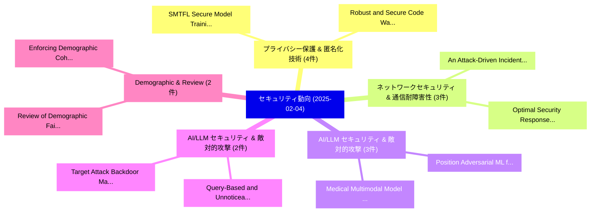

# 📅 02_daily: 日次エグゼクティブサマリー報告書 (2025-02-04)

**集計日時**: 2026-10-02 23:05:16 UTC  
**対象日付**: 2025-02-04  
**本日収集論文数**: 29 件  

---

## 💡 主要セキュリティ動向・脅威インサイト (Executive Insights)

本日の収集論文（計 29 件）において、以下の重点セキュリティ領域で活発な研究動向が確認されました：
- **プライバシー保護 & 匿名化技術** (4 件): 注目論文として 「SMTFL: Secure Model Training t...」、「Robust and Secure Code Waterma...」 等が発表され、実務防御および攻撃検証の進展が見られます。
- **ネットワークセキュリティ & 通信耐障害性** (3 件): 注目論文として 「An Attack-Driven Incident Resp...」、「Optimal Security Response to N...」 等が発表され、実務防御および攻撃検証の進展が見られます。
- **AI/LLM セキュリティ & 敵対的攻撃** (3 件): 注目論文として 「Position: Adversarial ML for L...」、「Medical Multimodal Model Steal...」 等が発表され、実務防御および攻撃検証の進展が見られます。
- **AI/LLM セキュリティ & 敵対的攻撃** (2 件): 注目論文として 「Query-Based and Unnoticeable G...」、「Target Attack Backdoor Malware...」 等が発表され、実務防御および攻撃検証の進展が見られます。
- **Demographic & Review** (2 件): 注目論文として 「Review of Demographic Fairness...」、「Enforcing Demographic Coherenc...」 等が発表され、実務防御および攻撃検証の進展が見られます。

### 🗺️ 技術・脅威トピックマインドマップ

---

## 📌 日次セキュリティ論文一覧 (日本語表形式)

| No | arXiv ID | 論文タイトル (日本語訳) | 重要キーワード | 構造化エグゼクティブ要約 (背景・提案・影響) | 脅威分類 | 詳細リンク |
|---|---|---|---|---|---|---|
| 1 | `2502.01925v2` | [PANDAS: Improving Many-shot Jailbreaking via Positive Affirmation, Negative Demonstration, and Adaptive Sampling（セキュリティ分析論文）](../../okf/papers/2025-02-04/2502.01925.md) | `Improving Many`, `Positive Affirmation`, `Negative Demonstration` | 【提案】概要 (Overview & Key Finding) 本論文「PANDAS: Improving Many-shot ジェイルブレイクing via Positive Af...。実証評価により経営層・セキュリティ管理者向け推奨アクション (E... | `cs.CR` | [arXiv](https://arxiv.org/abs/2502.01925v2) &#124; [OKF](../../okf/papers/2025-02-04/2502.01925.md) |
| 2 | `2502.01936v1` | [Query-Based and Unnoticeable Graph Injection Attack from Neighborhood Perspective（セキュリティ分析論文）](../../okf/papers/2025-02-04/2502.01936.md) | `Unnoticeable Graph Injection Attack`, `Neighborhood Perspective`, `Chang Liu` | 【提案】概要 (Overview & Key Finding) 本論文「Query-Based and Unnoticeable Graph Injection Attack fro...。実証評価により経営層・セキュリティ管理者向け推奨アクション (E... | `cs.CR` | [arXiv](https://arxiv.org/abs/2502.01936v1) &#124; [OKF](../../okf/papers/2025-02-04/2502.01936.md) |
| 3 | `2502.01966v2` | [Optimizing Spot Instance Reliability and Security Using Cloud-Native Data and Tools（セキュリティ分析論文）](../../okf/papers/2025-02-04/2502.01966.md) | `Optimizing Spot Instance Reliability`, `Security Using Cloud`, `Native Data` | 【提案】概要 (Overview & Key Finding) 本論文「Optimizing Spot Instance Reliability and Security Using...。実証評価により経営層・セキュリティ管理者向け推奨アクション (E... | `cs.CR` | [arXiv](https://arxiv.org/abs/2502.01966v2) &#124; [OKF](../../okf/papers/2025-02-04/2502.01966.md) |
| 4 | `2502.02009v1` | [LLMSecConfig: An LLM-Based Approach for Fixing Software Container Misconfigurations（セキュリティ分析論文）](../../okf/papers/2025-02-04/2502.02009.md) | `Fixing Software Container Misconfigurations`, `Triet Huynh Minh Le`, `Fixing Software Container Misco` | 【提案】概要 (Overview & Key Finding) 本論文「LLMSecConfig: An LLM-Based Approach for Fixing Software...。実証評価により経営層・セキュリティ管理者向け推奨アクション (E... | `cs.CR` | [arXiv](https://arxiv.org/abs/2502.02009v1) &#124; [OKF](../../okf/papers/2025-02-04/2502.02009.md) |
| 5 | `2502.02038v2` | [SMTFL: Secure Model Training to Untrusted Participants in 連合学習](../../okf/papers/2025-02-04/2502.02038.md) | `Secure Model Training`, `Untrusted Participants`, `Federated Learning` | 【提案】概要 (Overview & Key Finding) 本論文「SMTFL: Secure Model Training to Untrusted Participants ...。実証評価により経営層・セキュリティ管理者向け推奨アクション (E... | `cs.CR` | [arXiv](https://arxiv.org/abs/2502.02038v2) &#124; [OKF](../../okf/papers/2025-02-04/2502.02038.md) |
| 6 | `2502.02068v3` | [Robust and Secure Code Watermarking for 大規模言語モデル via ML/Crypto Codesign](../../okf/papers/2025-02-04/2502.02068.md) | `Secure Code Watermarking`, `Crypto Codesign`, `Large Language Models` | 【提案】概要 (Overview & Key Finding) 本論文「Robust and Secure Code Watermarking for 大規模言語モデル via ML...。実証評価により経営層・セキュリティ管理者向け推奨アクション (E... | `cs.CR` | [arXiv](https://arxiv.org/abs/2502.02068v3) &#124; [OKF](../../okf/papers/2025-02-04/2502.02068.md) |
| 7 | `2502.02230v1` | [An Attack-Driven Incident Response and Defense System (ADIRDS)（セキュリティ分析論文）](../../okf/papers/2025-02-04/2502.02230.md) | `Driven Incident Response`, `Defense System`, `Attack-Driven Incident` | 【提案】概要 (Overview & Key Finding) 本論文「An Attack-Driven Incident Response and Defense System (...。実証評価により経営層・セキュリティ管理者向け推奨アクション (E... | `cs.CR` | [arXiv](https://arxiv.org/abs/2502.02230v1) &#124; [OKF](../../okf/papers/2025-02-04/2502.02230.md) |
| 8 | `2502.02260v2` | [Position: Adversarial ML for LLMs Is Not Making Any Progress（セキュリティ分析論文）](../../okf/papers/2025-02-04/2502.02260.md) | `Javier Rando`, `Jie Zhang`, `Nicholas Carlini` | 【提案】背景とセキュリティ上の課題 (Background & Problem) 本研究はサイバー脅威環境におけるセキュリティ構造・脆弱性の検証を目的としています。(主要検出項目: ...。実証評価により経営層・セキュリティ管理者向け推奨アクション (E... | `cs.CR` | [arXiv](https://arxiv.org/abs/2502.02260v2) &#124; [OKF](../../okf/papers/2025-02-04/2502.02260.md) |
| 9 | `2502.02309v3` | [Review of Demographic Fairness in Face Recognition（セキュリティ分析論文）](../../okf/papers/2025-02-04/2502.02309.md) | `Demographic Fairness`, `Face Recognition`, `Ketan Kotwal` | 【提案】概要 (Overview & Key Finding) 本論文「Review of Demographic Fairness in Face Recognition（セキュリ...。実証評価により経営層・セキュリティ管理者向け推奨アクション (E... | `cs.CR` | [arXiv](https://arxiv.org/abs/2502.02309v3) &#124; [OKF](../../okf/papers/2025-02-04/2502.02309.md) |
| 10 | `2502.02320v3` | [Extending Asynchronous Byzantine Agreement with Crusader Agreement（セキュリティ分析論文）](../../okf/papers/2025-02-04/2502.02320.md) | `Extending Asynchronous Byzantine Agreement`, `Crusader Agreement`, `Mose Mizrahi Erbes` | 【提案】概要 (Overview & Key Finding) 本論文「Extending Asynchronous Byzantine Agreement with Crusade...。実証評価により経営層・セキュリティ管理者向け推奨アクション (E... | `cs.CR` | [arXiv](https://arxiv.org/abs/2502.02320v3) &#124; [OKF](../../okf/papers/2025-02-04/2502.02320.md) |
| 11 | `2502.02335v2` | [Target Attack Backdoor Malware Analysis and Attribution（セキュリティ分析論文）](../../okf/papers/2025-02-04/2502.02335.md) | `Anthony Cheuk Tung Lai`, `Ping Fan Ke`, `Vitaly Kamluk` | 【提案】概要 (Overview & Key Finding) 本論文「Target Attack Backdoor マルウェア Analysis and Attribution（セ...。実証評価により経営層・セキュリティ管理者向け推奨アクション (E... | `cs.CR` | [arXiv](https://arxiv.org/abs/2502.02335v2) &#124; [OKF](../../okf/papers/2025-02-04/2502.02335.md) |
| 12 | `2502.02337v1` | [Rule-ATT&CK Mapper (RAM): Mapping SIEM Rules to TTPs Using LLMs（セキュリティ分析論文）](../../okf/papers/2025-02-04/2502.02337.md) | `Moshe Kravchik`, `Ehud Malul`, `Yuval Elovici` | 【提案】概要 (Overview & Key Finding) 本論文「Rule-ATT&CK Mapper (RAM): Mapping SIEM Rules to TTPs Us...。実証評価によりWudali, Moshe Kravchik, E... | `cs.CR` | [arXiv](https://arxiv.org/abs/2502.02337v1) &#124; [OKF](../../okf/papers/2025-02-04/2502.02337.md) |
| 13 | `2502.02342v1` | [SHIELD: APT Detection and Intelligent Explanation Using LLM（セキュリティ分析論文）](../../okf/papers/2025-02-04/2502.02342.md) | `Intelligent Explanation Using`, `Parth Atulbhai Gandhi`, `Yonatan Amaru` | 【提案】概要 (Overview & Key Finding) 本論文「SHIELD: APT Detection and Intelligent Explanation Using...。実証評価によりWudali, Yonatan Amaru, Yu... | `cs.CR` | [arXiv](https://arxiv.org/abs/2502.02342v1) &#124; [OKF](../../okf/papers/2025-02-04/2502.02342.md) |
| 14 | `2502.02387v2` | [SoK: Understanding zk-SNARKs: The Gap Between Research and Practice（セキュリティ分析論文）](../../okf/papers/2025-02-04/2502.02387.md) | `Junkai Liang`, `Daqi Hu`, `Pengfei Wu` | 【提案】概要 (Overview & Key Finding) 本論文「SoK: Understanding zk-SNARKs: The Gap Between Research ...。実証評価により経営層・セキュリティ管理者向け推奨アクション (E... | `cs.CR` | [arXiv](https://arxiv.org/abs/2502.02387v2) &#124; [OKF](../../okf/papers/2025-02-04/2502.02387.md) |
| 15 | `2502.02410v3` | [Privacy Amplification by Structured Subsampling for Deep Differentially Private Time Series Forecasting（セキュリティ分析論文）](../../okf/papers/2025-02-04/2502.02410.md) | `Deep Differentially Private Time Series Forecasting`, `Privacy Amplification`, `Structured Subsampling` | 【提案】概要 (Overview & Key Finding) 本論文「Privacy Amplification by Structured Subsampling for Dee...。実証評価により経営層・セキュリティ管理者向け推奨アクション (E... | `cs.CR` | [arXiv](https://arxiv.org/abs/2502.02410v3) &#124; [OKF](../../okf/papers/2025-02-04/2502.02410.md) |
| 16 | `2502.02438v1` | [Medical Multimodal Model Stealing Attacks via Adversarial Domain Alignment（セキュリティ分析論文）](../../okf/papers/2025-02-04/2502.02438.md) | `Medical Multimodal Model Stealing Attacks`, `Adversarial Domain Alignment`, `Yaling Shen` | 【提案】概要 (Overview & Key Finding) 本論文「Medical Multimodal Model Stealing Attacks via Adversari...。実証評価により経営層・セキュリティ管理者向け推奨アクション (E... | `cs.CR` | [arXiv](https://arxiv.org/abs/2502.02438v1) &#124; [OKF](../../okf/papers/2025-02-04/2502.02438.md) |
| 17 | `2502.02445v1` | [Quantum-enabled framework for the Advanced Encryption Standard in the post-quantum era（セキュリティ分析論文）](../../okf/papers/2025-02-04/2502.02445.md) | `Advanced Encryption Standard`, `post-quantum era`, `Arit Kumar Bishwas` | 【提案】概要 (Overview & Key Finding) 本論文「量子-enabled framework for the Advanced Encryption Standa...。実証評価により経営層・セキュリティ管理者向け推奨アクション (E... | `cs.CR` | [arXiv](https://arxiv.org/abs/2502.02445v1) &#124; [OKF](../../okf/papers/2025-02-04/2502.02445.md) |
| 18 | `2502.02541v2` | [Optimal Security Response to Network Intrusions in IT Systems（セキュリティ分析論文）](../../okf/papers/2025-02-04/2502.02541.md) | `Optimal Security Response`, `Network Intrusions`, `Kim Hammar` | 【提案】概要 (Overview & Key Finding) 本論文「Optimal Security Response to Network Intrusions in IT S...。実証評価により経営層・セキュリティ管理者向け推奨アクション (E... | `cs.CR` | [arXiv](https://arxiv.org/abs/2502.02541v2) &#124; [OKF](../../okf/papers/2025-02-04/2502.02541.md) |
| 19 | `2502.02542v4` | [OverThink: Slowdown Attacks on Reasoning LLMs（セキュリティ分析論文）](../../okf/papers/2025-02-04/2502.02542.md) | `Slowdown Attacks`, `Abhinav Kumar`, `Jaechul Roh` | 【提案】概要 (Overview & Key Finding) 本論文「OverThink: Slowdown Attacks on Reasoning LLMs（セキュリティ分析論...。実証評価により経営層・セキュリティ管理者向け推奨アクション (E... | `cs.CR` | [arXiv](https://arxiv.org/abs/2502.02542v4) &#124; [OKF](../../okf/papers/2025-02-04/2502.02542.md) |
| 20 | `2502.02676v1` | [Blind Visible Watermark Removal with Morphological Dilation（セキュリティ分析論文）](../../okf/papers/2025-02-04/2502.02676.md) | `Blind Visible Watermark Removal`, `Morphological Dilation`, `Raw Meta` | 【提案】概要 (Overview & Key Finding) 本論文「Blind Visible Watermark Removal with Morphological Dila...。実証評価によりJohnson - **公開日時**: `2025... | `cs.CR` | [arXiv](https://arxiv.org/abs/2502.02676v1) &#124; [OKF](../../okf/papers/2025-02-04/2502.02676.md) |
| 21 | `2502.02709v1` | [Enforcing Demographic Coherence: A Harms Aware Framework for Reasoning about Private Data Release（セキュリティ分析論文）](../../okf/papers/2025-02-04/2502.02709.md) | `Enforcing Demographic Coherence`, `Private Data Release`, `Mark Bun` | 【提案】概要 (Overview & Key Finding) 本論文「Enforcing Demographic Coherence: A Harms Aware Framewor...。実証評価により経営層・セキュリティ管理者向け推奨アクション (E... | `cs.CR` | [arXiv](https://arxiv.org/abs/2502.02709v1) &#124; [OKF](../../okf/papers/2025-02-04/2502.02709.md) |
| 22 | `2502.02720v1` | [Risk-Aware Sensitive Property-Driven Resource Management in Cloud Datacenters（セキュリティ分析論文）](../../okf/papers/2025-02-04/2502.02720.md) | `Aware Sensitive Property`, `Driven Resource Management`, `Cloud Datacenters` | 【提案】概要 (Overview & Key Finding) 本論文「Risk-Aware Sensitive Property-Driven Resource Managemen...。実証評価により経営層・セキュリティ管理者向け推奨アクション (E... | `cs.CR` | [arXiv](https://arxiv.org/abs/2502.02720v1) &#124; [OKF](../../okf/papers/2025-02-04/2502.02720.md) |
| 23 | `2502.02730v2` | [Semantic Entanglement-Based Ransomware Detection via Probabilistic Latent Encryption Mapping（セキュリティ分析論文）](../../okf/papers/2025-02-04/2502.02730.md) | `Probabilistic Latent Encryption Mapping`, `Based Ransomware Detection`, `Semantic Entanglement` | 【提案】概要 (Overview & Key Finding) 本論文「Semantic Entanglement-Based ランサムウェア Detection via Proba...。実証評価により経営層・セキュリティ管理者向け推奨アクション (E... | `cs.CR` | [arXiv](https://arxiv.org/abs/2502.02730v2) &#124; [OKF](../../okf/papers/2025-02-04/2502.02730.md) |
| 24 | `2502.02747v2` | [PatchPilot: A Cost-Efficient Software Engineering Agent with Early Attempts on Formal Verification（セキュリティ分析論文）](../../okf/papers/2025-02-04/2502.02747.md) | `Efficient Software Engineering Agent`, `Early Attempts`, `Formal Verification` | 【提案】概要 (Overview & Key Finding) 本論文「PatchPilot: A Cost-Efficient Software Engineering Agent...。実証評価により経営層・セキュリティ管理者向け推奨アクション (E... | `cs.CR` | [arXiv](https://arxiv.org/abs/2502.02747v2) &#124; [OKF](../../okf/papers/2025-02-04/2502.02747.md) |
| 25 | `2502.02749v1` | [Unveiling Privacy and Security Gaps in Female Health Apps（セキュリティ分析論文）](../../okf/papers/2025-02-04/2502.02749.md) | `Female Health Apps`, `Unveiling Privacy`, `Security Gaps` | 【提案】概要 (Overview & Key Finding) 本論文「Unveiling Privacy and Security Gaps in Female Health Ap...。実証評価により経営層・セキュリティ管理者向け推奨アクション (E... | `cs.CR` | [arXiv](https://arxiv.org/abs/2502.02749v1) &#124; [OKF](../../okf/papers/2025-02-04/2502.02749.md) |
| 26 | `2502.02759v1` | [ClarAVy: A Tool for Scalable and Accurate Malware Family Labeling（セキュリティ分析論文）](../../okf/papers/2025-02-04/2502.02759.md) | `Accurate Malware Family Labeling`, `Derek Everett`, `Maya Fuchs` | 【提案】概要 (Overview & Key Finding) 本論文「ClarAVy: A Tool for Scalable and Accurate マルウェア Family ...。実証評価によりJoyce, Derek Everett, May... | `cs.CR` | [arXiv](https://arxiv.org/abs/2502.02759v1) &#124; [OKF](../../okf/papers/2025-02-04/2502.02759.md) |
| 27 | `2502.02774v2` | [Optimal Computational Secret Sharing（セキュリティ分析論文）](../../okf/papers/2025-02-04/2502.02774.md) | `Optimal Computational Secret Sharing`, `Alejandro Cohen`, `Raw Meta` | 【提案】概要 (Overview & Key Finding) 本論文「Optimal Computational Secret Sharing（セキュリティ分析論文）」（原題: O...。実証評価によりD'Oliveira - **公開日時**: `2... | `cs.CR` | [arXiv](https://arxiv.org/abs/2502.02774v2) &#124; [OKF](../../okf/papers/2025-02-04/2502.02774.md) |
| 28 | `2502.05213v2` | [DERMARK: A Dynamic, Efficient and Robust Multi-bit Watermark for 大規模言語モデル](../../okf/papers/2025-02-04/2502.05213.md) | `Robust Multi`, `Multi-bit Watermark`, `Large Language Models` | 【提案】概要 (Overview & Key Finding) 本論文「DERMARK: A Dynamic, Efficient and Robust Multi-bit Wate...。実証評価により経営層・セキュリティ管理者向け推奨アクション (E... | `cs.CR` | [arXiv](https://arxiv.org/abs/2502.05213v2) &#124; [OKF](../../okf/papers/2025-02-04/2502.05213.md) |
| 29 | `2502.05215v1` | [Watermarking across Modalities for Content Tracing and Generative AI（セキュリティ分析論文）](../../okf/papers/2025-02-04/2502.05215.md) | `Content Tracing`, `Pierre Fernandez`, `Raw Meta` | 【提案】概要 (Overview & Key Finding) 本論文「Watermarking across Modalities for Content Tracing and ...。実証評価により経営層・セキュリティ管理者向け推奨アクション (E... | `cs.CR` | [arXiv](https://arxiv.org/abs/2502.05215v1) &#124; [OKF](../../okf/papers/2025-02-04/2502.05215.md) |

