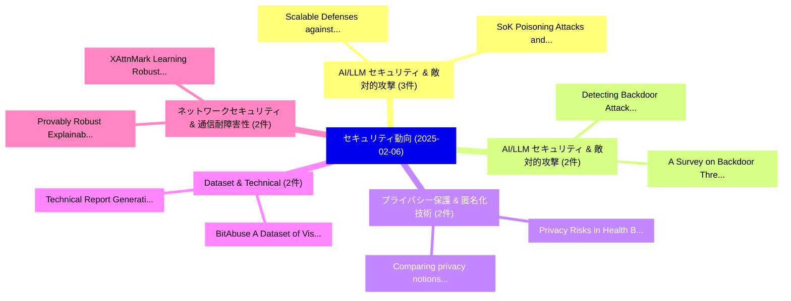

# 📅 02_daily: 日次エグゼクティブサマリー報告書 (2025-02-06)

**集計日時**: 2026-10-02 23:05:16 UTC  
**対象日付**: 2025-02-06  
**本日収集論文数**: 35 件  

---

## 💡 主要セキュリティ動向・脅威インサイト (Executive Insights)

本日の収集論文（計 35 件）において、以下の重点セキュリティ領域で活発な研究動向が確認されました：
- **AI/LLM セキュリティ & 敵対的攻撃** (3 件): 注目論文として 「Scalable Defenses against Inti...」、「SoK: Poisoning Attacks and Def...」 等が発表され、実務防御および攻撃検証の進展が見られます。
- **AI/LLM セキュリティ & 敵対的攻撃** (2 件): 注目論文として 「Detecting Backdoor Attacks via...」、「A Survey on Backdoor Threats i...」 等が発表され、実務防御および攻撃検証の進展が見られます。
- **プライバシー保護 & 匿名化技術** (2 件): 注目論文として 「Privacy Risks in Health Big Da...」、「Comparing privacy notions for ...」 等が発表され、実務防御および攻撃検証の進展が見られます。
- **Dataset & Technical** (2 件): 注目論文として 「Technical Report: Generating t...」、「BitAbuse: A Dataset of Visuall...」 等が発表され、実務防御および攻撃検証の進展が見られます。
- **ネットワークセキュリティ & 通信耐障害性** (2 件): 注目論文として 「Provably Robust Explainable Gr...」、「XAttnMark: Learning Robust Aud...」 等が発表され、実務防御および攻撃検証の進展が見られます。

### 🗺️ 技術・脅威トピックマインドマップ

---

## 📌 日次セキュリティ論文一覧 (日本語表形式)

| No | arXiv ID | 論文タイトル (日本語訳) | 重要キーワード | 構造化エグゼクティブ要約 (背景・提案・影響) | 脅威分類 | 詳細リンク |
|---|---|---|---|---|---|---|
| 1 | `2502.03682v2` | [Scalable Defenses against Intimate Partner Infiltrationsに向けて](../../okf/papers/2025-02-06/2502.03682.md) | `Towards Scalable Defenses`, `Intimate Partner Infiltrations`, `Scalable Defenses` | 【提案】概要 (Overview & Key Finding) 本論文「Scalable Defenses against Intimate Partner Infiltration...。実証評価により経営層・セキュリティ管理者向け推奨アクション (E... | `cs.CR` | [arXiv](https://arxiv.org/abs/2502.03682v2) &#124; [OKF](../../okf/papers/2025-02-06/2502.03682.md) |
| 2 | `2502.03692v1` | [DocMIA: Document-Level Membership Inference Attacks against DocVQA Models（セキュリティ分析論文）](../../okf/papers/2025-02-06/2502.03692.md) | `Level Membership Inference Attacks`, `Document-Level Membership`, `Khanh Nguyen` | 【提案】概要 (Overview & Key Finding) 本論文「DocMIA: Document-Level Membership Inference Attacks aga...。実証評価により経営層・セキュリティ管理者向け推奨アクション (E... | `cs.CR` | [arXiv](https://arxiv.org/abs/2502.03692v1) &#124; [OKF](../../okf/papers/2025-02-06/2502.03692.md) |
| 3 | `2502.03698v4` | [How Vulnerable Is My Learned Policy? Universal Adversarial Perturbation Attacks On Modern Behavior Cloning Policies（セキュリティ分析論文）](../../okf/papers/2025-02-06/2502.03698.md) | `Akansha Kalra`, `Basavasagar Patil`, `Guanhong Tao` | 【提案】Universal Adversarial Perturbation Attacks On Modern Behavior Cloning Policies ### (日本語...。実証評価により経営層・セキュリティ管理者向け推奨アクション (E... | `cs.CR` | [arXiv](https://arxiv.org/abs/2502.03698v4) &#124; [OKF](../../okf/papers/2025-02-06/2502.03698.md) |
| 4 | `2502.03718v1` | [Following Devils' Footprint: Real-time Detection of Price Manipulation Attacksに向けて](../../okf/papers/2025-02-06/2502.03718.md) | `Following Devils`, `Real-time Detection`, `Price Manipulation Attacks` | 【提案】概要 (Overview & Key Finding) 本論文「Following Devils' Footprint: Real-time Detection of Pri...。実証評価により経営層・セキュリティ管理者向け推奨アクション (E... | `cs.CR` | [arXiv](https://arxiv.org/abs/2502.03718v1) &#124; [OKF](../../okf/papers/2025-02-06/2502.03718.md) |
| 5 | `2502.03721v1` | [Detecting Backdoor Attacks via Similarity in Semantic Communication Systems（セキュリティ分析論文）](../../okf/papers/2025-02-06/2502.03721.md) | `Detecting Backdoor Attacks`, `Semantic Communication Systems`, `Ziyang Wei` | 【提案】概要 (Overview & Key Finding) 本論文「Detecting Backdoor Attacks via Similarity in Semantic C...。実証評価により経営層・セキュリティ管理者向け推奨アクション (E... | `cs.CR` | [arXiv](https://arxiv.org/abs/2502.03721v1) &#124; [OKF](../../okf/papers/2025-02-06/2502.03721.md) |
| 6 | `2502.03773v4` | [ExpProof : Operationalizing Explanations for Confidential Models with ZKPs（セキュリティ分析論文）](../../okf/papers/2025-02-06/2502.03773.md) | `Operationalizing Explanations`, `Confidential Models`, `Evan Monroe Laufer` | 【提案】概要 (Overview & Key Finding) 本論文「ExpProof : Operationalizing Explanations for Confidenti...。実証評価により経営層・セキュリティ管理者向け推奨アクション (E... | `cs.CR` | [arXiv](https://arxiv.org/abs/2502.03773v4) &#124; [OKF](../../okf/papers/2025-02-06/2502.03773.md) |
| 7 | `2502.03801v1` | [SoK: Poisoning Attacks and Defenses in Federated Learningのベンチマーク評価](../../okf/papers/2025-02-06/2502.03801.md) | `Benchmarking Poisoning Attacks`, `Federated Learning`, `Poisoning Attacks` | 【提案】概要 (Overview & Key Finding) 本論文「SoK: Poisoning Attacks and Defenses in Federated Learni...。実証評価により経営層・セキュリティ管理者向け推奨アクション (E... | `cs.CR` | [arXiv](https://arxiv.org/abs/2502.03801v1) &#124; [OKF](../../okf/papers/2025-02-06/2502.03801.md) |
| 8 | `2502.03811v1` | [Privacy Risks in Health Big Data: A Systematic Literature Review（セキュリティ分析論文）](../../okf/papers/2025-02-06/2502.03811.md) | `Health Big Data`, `Systematic Literature Review`, `Privacy Risks` | 【提案】概要 (Overview & Key Finding) 本論文「Privacy Risks in Health Big Data: A Systematic Literatu...。実証評価により経営層・セキュリティ管理者向け推奨アクション (E... | `cs.CR` | [arXiv](https://arxiv.org/abs/2502.03811v1) &#124; [OKF](../../okf/papers/2025-02-06/2502.03811.md) |
| 9 | `2502.03825v1` | [Synthetic Poisoning Attacks: The Impact of Poisoned MRI Image on U-Net Brain Tumor Segmentation（セキュリティ分析論文）](../../okf/papers/2025-02-06/2502.03825.md) | `Net Brain Tumor Segmentation`, `Synthetic Poisoning Attacks`, `U-Net Brain` | 【提案】概要 (Overview & Key Finding) 本論文「Synthetic Poisoning Attacks: The Impact of Poisoned MRI...。実証評価により経営層・セキュリティ管理者向け推奨アクション (E... | `cs.CR` | [arXiv](https://arxiv.org/abs/2502.03825v1) &#124; [OKF](../../okf/papers/2025-02-06/2502.03825.md) |
| 10 | `2502.03868v2` | [Time-based GNSS attack detection（セキュリティ分析論文）](../../okf/papers/2025-02-06/2502.03868.md) | `Time-based GNSS`, `Marco Spanghero`, `Panos Papadimitratos` | 【提案】概要 (Overview & Key Finding) 本論文「Time-based GNSS attack detection（セキュリティ分析論文）」（原題: Time-...。実証評価により経営層・セキュリティ管理者向け推奨アクション (E... | `cs.CR` | [arXiv](https://arxiv.org/abs/2502.03868v2) &#124; [OKF](../../okf/papers/2025-02-06/2502.03868.md) |
| 11 | `2502.03870v1` | [Consumer INS Coupled with Carrier Phase Measurements for GNSS Spoofing Detection（セキュリティ分析論文）](../../okf/papers/2025-02-06/2502.03870.md) | `Carrier Phase Measurements`, `Spoofing Detection`, `Tore Johansson` | 【提案】概要 (Overview & Key Finding) 本論文「Consumer INS Coupled with Carrier Phase Measurements fo...。実証評価により経営層・セキュリティ管理者向け推奨アクション (E... | `cs.CR` | [arXiv](https://arxiv.org/abs/2502.03870v1) &#124; [OKF](../../okf/papers/2025-02-06/2502.03870.md) |
| 12 | `2502.03882v2` | [Hierarchical Entropic Diffusion for Ransomware Detection: A Probabilistic Approach to Behavioral Anomaly Isolation（セキュリティ分析論文）](../../okf/papers/2025-02-06/2502.03882.md) | `Hierarchical Entropic Diffusion`, `Behavioral Anomaly Isolation`, `Ransomware Detection` | 【提案】概要 (Overview & Key Finding) 本論文「Hierarchical Entropic Diffusion for ランサムウェア Detection: ...。実証評価により経営層・セキュリティ管理者向け推奨アクション (E... | `cs.CR` | [arXiv](https://arxiv.org/abs/2502.03882v2) &#124; [OKF](../../okf/papers/2025-02-06/2502.03882.md) |
| 13 | `2502.03909v1` | [Technical Report: Generating the WEB-IDS23 Dataset（セキュリティ分析論文）](../../okf/papers/2025-02-06/2502.03909.md) | `Technical Report`, `WEB-IDS23 Dataset`, `Eric Lanfer` | 【提案】概要 (Overview & Key Finding) 本論文「Technical Report: Generating the WEB-IDS23 Dataset（セキュリ...。実証評価により経営層・セキュリティ管理者向け推奨アクション (E... | `cs.CR` | [arXiv](https://arxiv.org/abs/2502.03909v1) &#124; [OKF](../../okf/papers/2025-02-06/2502.03909.md) |
| 14 | `2502.03957v1` | [Improving the Perturbation-Based Explanation of Deepfake Detectors Through the Use of Adversarially-Generated Samples（セキュリティ分析論文）](../../okf/papers/2025-02-06/2502.03957.md) | `Based Explanation`, `Generated Samples`, `Perturbation-Based Explanation` | 【提案】概要 (Overview & Key Finding) 本論文「Improving the Perturbation-Based Explanation of Deepfak...。実証評価により経営層・セキュリティ管理者向け推奨アクション (E... | `cs.CR` | [arXiv](https://arxiv.org/abs/2502.03957v1) &#124; [OKF](../../okf/papers/2025-02-06/2502.03957.md) |
| 15 | `2502.03964v1` | ["It Warned Me Just at the Right Moment": Exploring LLM-based Real-time Phone Scamsの検出](../../okf/papers/2025-02-06/2502.03964.md) | `Right Moment`, `LLM-based Real`, `Phone Scams` | 【提案】概要 (Overview & Key Finding) 本論文「"It Warned Me Just at the Right Moment": Exploring LLM-...。実証評価により経営層・セキュリティ管理者向け推奨アクション (E... | `cs.CR` | [arXiv](https://arxiv.org/abs/2502.03964v1) &#124; [OKF](../../okf/papers/2025-02-06/2502.03964.md) |
| 16 | `2502.04009v2` | [A Critical Deployed Use Cases for Quantum Key Distribution and Comparison with Post-Quantum Cryptographyの分析](../../okf/papers/2025-02-06/2502.04009.md) | `Quantum Key Distribution`, `Critical Deployed Use Cases`, `Deployed Use Cases` | 【提案】概要 (Overview & Key Finding) 本論文「A Critical Deployed Use Cases for 量子鍵配送 and Comparison ...。実証評価により経営層・セキュリティ管理者向け推奨アクション (E... | `cs.CR` | [arXiv](https://arxiv.org/abs/2502.04009v2) &#124; [OKF](../../okf/papers/2025-02-06/2502.04009.md) |
| 17 | `2502.04045v1` | [Comparing privacy notions for protection against reconstruction attacks in machine learning（セキュリティ分析論文）](../../okf/papers/2025-02-06/2502.04045.md) | `Sayan Biswas`, `Mark Dras`, `Pedro Faustini` | 【提案】概要 (Overview & Key Finding) 本論文「Comparing privacy notions for protection against recons...。実証評価により経営層・セキュリティ管理者向け推奨アクション (E... | `cs.CR` | [arXiv](https://arxiv.org/abs/2502.04045v1) &#124; [OKF](../../okf/papers/2025-02-06/2502.04045.md) |
| 18 | `2502.04106v2` | [The Gradient Puppeteer: Adversarial Domination in Gradient Leakage Attacks through Model Poisoning（セキュリティ分析論文）](../../okf/papers/2025-02-06/2502.04106.md) | `Gradient Leakage Attacks`, `Adversarial Domination`, `Model Poisoning` | 【提案】概要 (Overview & Key Finding) 本論文「The Gradient Puppeteer: Adversarial Domination in Gradi...。実証評価により経営層・セキュリティ管理者向け推奨アクション (E... | `cs.CR` | [arXiv](https://arxiv.org/abs/2502.04106v2) &#124; [OKF](../../okf/papers/2025-02-06/2502.04106.md) |
| 19 | `2502.04157v2` | [Censor Resistant Instruction Independent Obfuscation for Multiple Programs（セキュリティ分析論文）](../../okf/papers/2025-02-06/2502.04157.md) | `Censor Resistant Instruction Independent Obfuscation`, `Multiple Programs`, `Ali Ajorian` | 【提案】概要 (Overview & Key Finding) 本論文「Censor Resistant Instruction Independent Obfuscation fo...。実証評価により経営層・セキュリティ管理者向け推奨アクション (E... | `cs.CR` | [arXiv](https://arxiv.org/abs/2502.04157v2) &#124; [OKF](../../okf/papers/2025-02-06/2502.04157.md) |
| 20 | `2502.04201v1` | [Safeguarding connected autonomous vehicle communication: Protocols, intra- and inter-vehicular attacks and defenses（セキュリティ分析論文）](../../okf/papers/2025-02-06/2502.04201.md) | `inter-vehicular attacks`, `Mohammed Aledhari`, `Rehma Razzak` | 【提案】概要 (Overview & Key Finding) 本論文「Safeguarding connected autonomous vehicle communication...。実証評価により経営層・セキュリティ管理者向け推奨アクション (E... | `cs.CR` | [arXiv](https://arxiv.org/abs/2502.04201v1) &#124; [OKF](../../okf/papers/2025-02-06/2502.04201.md) |
| 21 | `2502.04204v3` | [Short-length Adversarial Training Helps LLMs Defend Long-length Jailbreak Attacks: Theoretical and Empirical Evidence（セキュリティ分析論文）](../../okf/papers/2025-02-06/2502.04204.md) | `Adversarial Training Helps`, `Defend Long`, `Jailbreak Attacks` | 【提案】概要 (Overview & Key Finding) 本論文「Short-length Adversarial Training Helps LLMs Defend Lon...。実証評価により経営層・セキュリティ管理者向け推奨アクション (E... | `cs.CR` | [arXiv](https://arxiv.org/abs/2502.04204v3) &#124; [OKF](../../okf/papers/2025-02-06/2502.04204.md) |
| 22 | `2502.04224v1` | [Provably Robust Explainable Graph Neural Networks against Graph Perturbation Attacks（セキュリティ分析論文）](../../okf/papers/2025-02-06/2502.04224.md) | `Provably Robust Explainable Graph Neural Networks`, `Graph Perturbation Attacks`, `Jiate Li` | 【提案】概要 (Overview & Key Finding) 本論文「Provably Robust Explainable Graph Neural Networks again...。実証評価により経営層・セキュリティ管理者向け推奨アクション (E... | `cs.CR` | [arXiv](https://arxiv.org/abs/2502.04224v1) &#124; [OKF](../../okf/papers/2025-02-06/2502.04224.md) |
| 23 | `2502.04227v3` | [Can LLMs Hack Enterprise Networks? Autonomous Assumed Breach Penetration-Testing Active Directory Networks（セキュリティ分析論文）](../../okf/papers/2025-02-06/2502.04227.md) | `Autonomous Assumed Breach Penetration`, `Testing Active Directory Networks`, `Hack Enterprise Networks` | 【提案】Autonomous Assumed Breach Penetration-Testing Active Directory Networks ### (日本語題名: Can...。実証評価により経営層・セキュリティ管理者向け推奨アクション (E... | `cs.CR` | [arXiv](https://arxiv.org/abs/2502.04227v3) &#124; [OKF](../../okf/papers/2025-02-06/2502.04227.md) |
| 24 | `2502.04229v1` | [Dark Distillation: Backdooring Distilled Datasets without Accessing Raw Data（セキュリティ分析論文）](../../okf/papers/2025-02-06/2502.04229.md) | `Backdooring Distilled Datasets`, `Accessing Raw Data`, `Dark Distillation` | 【提案】背景とセキュリティ上の課題 (Background & Problem) 本研究はサイバー脅威環境におけるセキュリティ構造・脆弱性の検証を目的としています。(主要検出項目: ...。実証評価により経営層・セキュリティ管理者向け推奨アクション (E... | `cs.CR` | [arXiv](https://arxiv.org/abs/2502.04229v1) &#124; [OKF](../../okf/papers/2025-02-06/2502.04229.md) |
| 25 | `2502.04230v3` | [XAttnMark: Learning Robust Audio Watermarking with Cross-Attention（セキュリティ分析論文）](../../okf/papers/2025-02-06/2502.04230.md) | `Learning Robust Audio Watermarking`, `Yixin Liu`, `Lie Lu` | 【提案】概要 (Overview & Key Finding) 本論文「XAttnMark: Learning Robust Audio Watermarking with Cros...。実証評価により経営層・セキュリティ管理者向け推奨アクション (E... | `cs.CR` | [arXiv](https://arxiv.org/abs/2502.04230v3) &#124; [OKF](../../okf/papers/2025-02-06/2502.04230.md) |
| 26 | `2502.04236v1` | [Saflo: eBPF-Based MPTCP Scheduler for Mitigating Traffic Analysis Attacks in Cellular Networks（セキュリティ分析論文）](../../okf/papers/2025-02-06/2502.04236.md) | `eBPF-Based MPTCP`, `Cellular Networks`, `Sangwoo Lee` | 【提案】概要 (Overview & Key Finding) 本論文「Saflo: eBPF-Based MPTCP Scheduler for Mitigating Traffi...。実証評価により経営層・セキュリティ管理者向け推奨アクション (E... | `cs.CR` | [arXiv](https://arxiv.org/abs/2502.04236v1) &#124; [OKF](../../okf/papers/2025-02-06/2502.04236.md) |
| 27 | `2502.04287v1` | [Breaking the Vault: A Case Study of the 2022 LastPass Data Breach（セキュリティ分析論文）](../../okf/papers/2025-02-06/2502.04287.md) | `Data Breach`, `Jessica Gentles`, `Mason Fields` | 【提案】概要 (Overview & Key Finding) 本論文「Breaking the Vault: A Case Study of the 2022 LastPass D...。実証評価により経営層・セキュリティ管理者向け推奨アクション (E... | `cs.CR` | [arXiv](https://arxiv.org/abs/2502.04287v1) &#124; [OKF](../../okf/papers/2025-02-06/2502.04287.md) |
| 28 | `2502.04303v1` | [The 23andMe Data Breach: Analyzing Credential Stuffing Attacks, Security Vulnerabilities, and Mitigation Strategies（セキュリティ分析論文）](../../okf/papers/2025-02-06/2502.04303.md) | `Analyzing Credential Stuffing Attacks`, `Data Breach`, `Security Vulnerabilities` | 【提案】概要 (Overview & Key Finding) 本論文「The 23andMe Data Breach: Analyzing Credential Stuffing ...。実証評価により経営層・セキュリティ管理者向け推奨アクション (E... | `cs.CR` | [arXiv](https://arxiv.org/abs/2502.04303v1) &#124; [OKF](../../okf/papers/2025-02-06/2502.04303.md) |
| 29 | `2502.04400v2` | [Adaptive Prototype Knowledge Transfer for 連合学習 with Mixed Modalities and Heterogeneous Tasks](../../okf/papers/2025-02-06/2502.04400.md) | `Adaptive Prototype Knowledge Transfer`, `Mixed Modalities`, `Heterogeneous Tasks` | 【提案】概要 (Overview & Key Finding) 本論文「Adaptive Prototype Knowledge Transfer for 連合学習 with Mix...。実証評価により経営層・セキュリティ管理者向け推奨アクション (E... | `cs.CR` | [arXiv](https://arxiv.org/abs/2502.04400v2) &#124; [OKF](../../okf/papers/2025-02-06/2502.04400.md) |
| 30 | `2502.04421v1` | [Assessing and Prioritizing Ransomware Risk Based on Historical Victim Data（セキュリティ分析論文）](../../okf/papers/2025-02-06/2502.04421.md) | `Prioritizing Ransomware Risk Based`, `Historical Victim Data`, `Spencer Massengale` | 【提案】概要 (Overview & Key Finding) 本論文「Assessing and Prioritizing ランサムウェア Risk Based on Histor...。実証評価により経営層・セキュリティ管理者向け推奨アクション (E... | `cs.CR` | [arXiv](https://arxiv.org/abs/2502.04421v1) &#124; [OKF](../../okf/papers/2025-02-06/2502.04421.md) |
| 31 | `2502.04536v2` | [Idioms: Neural Decompilation With Joint Code and Type Definition Prediction（セキュリティ分析論文）](../../okf/papers/2025-02-06/2502.04536.md) | `Type Definition Prediction`, `Claire Le Goues`, `Luke Dramko` | 【提案】概要 (Overview & Key Finding) 本論文「Idioms: Neural Decompilation With Joint Code and Type D...。実証評価により経営層・セキュリティ管理者向け推奨アクション (E... | `cs.CR` | [arXiv](https://arxiv.org/abs/2502.04536v2) &#124; [OKF](../../okf/papers/2025-02-06/2502.04536.md) |
| 32 | `2502.04538v5` | ["Security vs. Interoperability" Arguments: An Analytical Framework（セキュリティ分析論文）](../../okf/papers/2025-02-06/2502.04538.md) | `Daji Landis`, `Elettra Bietti`, `Sunoo Park` | 【提案】概要 (Overview & Key Finding) 本論文「"Security vs. Interoperability" Arguments: An Analytica...。実証評価により経営層・セキュリティ管理者向け推奨アクション (E... | `cs.CR` | [arXiv](https://arxiv.org/abs/2502.04538v5) &#124; [OKF](../../okf/papers/2025-02-06/2502.04538.md) |
| 33 | `2502.04565v2` | [Private 連合学習 In Real World Application -- A Case Study](../../okf/papers/2025-02-06/2502.04565.md) | `Bortik Bandyopadhyay`, `Congzheng Song`, `Natarajan Krishnaswami` | 【提案】概要 (Overview & Key Finding) 本論文「Private 連合学習 In Real World Application -- A Case Study」...。実証評価により経営層・セキュリティ管理者向け推奨アクション (E... | `cs.CR` | [arXiv](https://arxiv.org/abs/2502.04565v2) &#124; [OKF](../../okf/papers/2025-02-06/2502.04565.md) |
| 34 | `2502.05224v1` | [A Survey on Backdoor Threats in 大規模言語モデル (LLMs): Attacks, Defenses, and Evaluations](../../okf/papers/2025-02-06/2502.05224.md) | `Backdoor Threats`, `Large Language Models`, `Yihe Zhou` | 【提案】概要 (Overview & Key Finding) 本論文「A Survey on Backdoor Threats in 大規模言語モデル (LLMs): Attack...。実証評価により経営層・セキュリティ管理者向け推奨アクション (E... | `cs.CR` | [arXiv](https://arxiv.org/abs/2502.05224v1) &#124; [OKF](../../okf/papers/2025-02-06/2502.05224.md) |
| 35 | `2502.05225v1` | [BitAbuse: A Dataset of Visually Perturbed Texts for Defending Phishing Attacks（セキュリティ分析論文）](../../okf/papers/2025-02-06/2502.05225.md) | `Visually Perturbed Texts`, `Defending Phishing Attacks`, `Hanyong Lee` | 【提案】概要 (Overview & Key Finding) 本論文「BitAbuse: A Dataset of Visually Perturbed Texts for Def...。実証評価により経営層・セキュリティ管理者向け推奨アクション (E... | `cs.CR` | [arXiv](https://arxiv.org/abs/2502.05225v1) &#124; [OKF](../../okf/papers/2025-02-06/2502.05225.md) |

